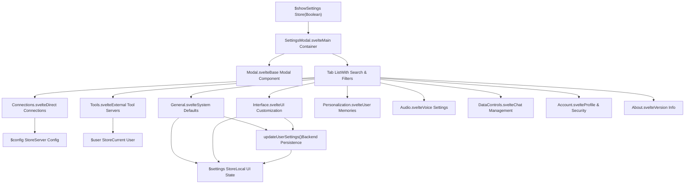
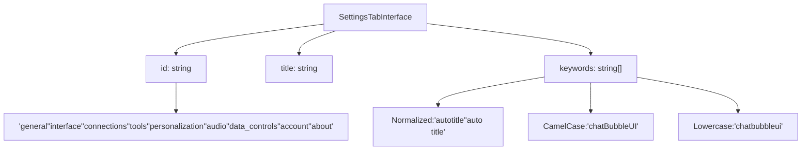
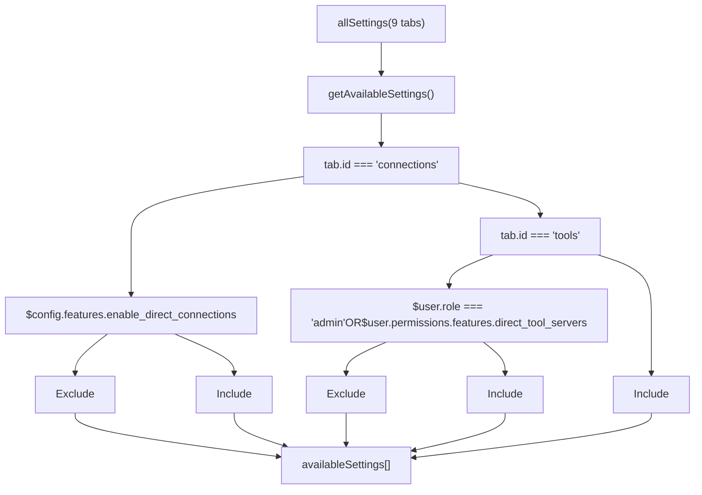
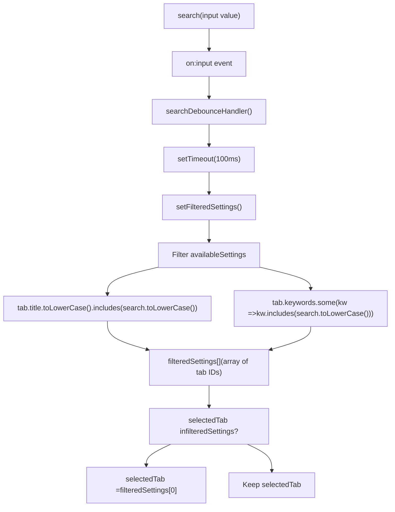
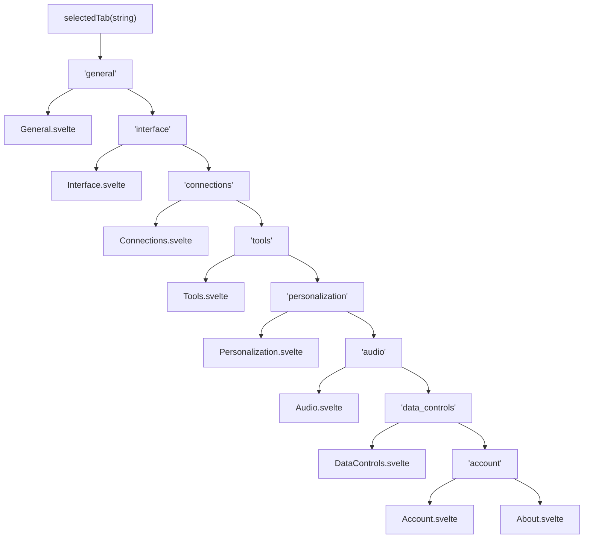
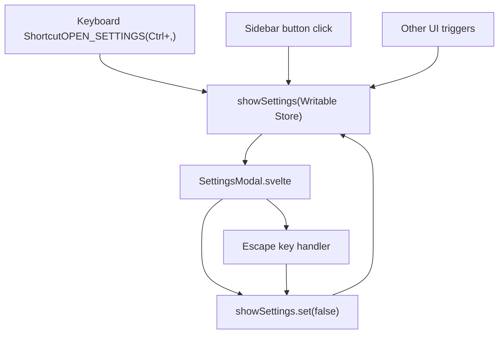
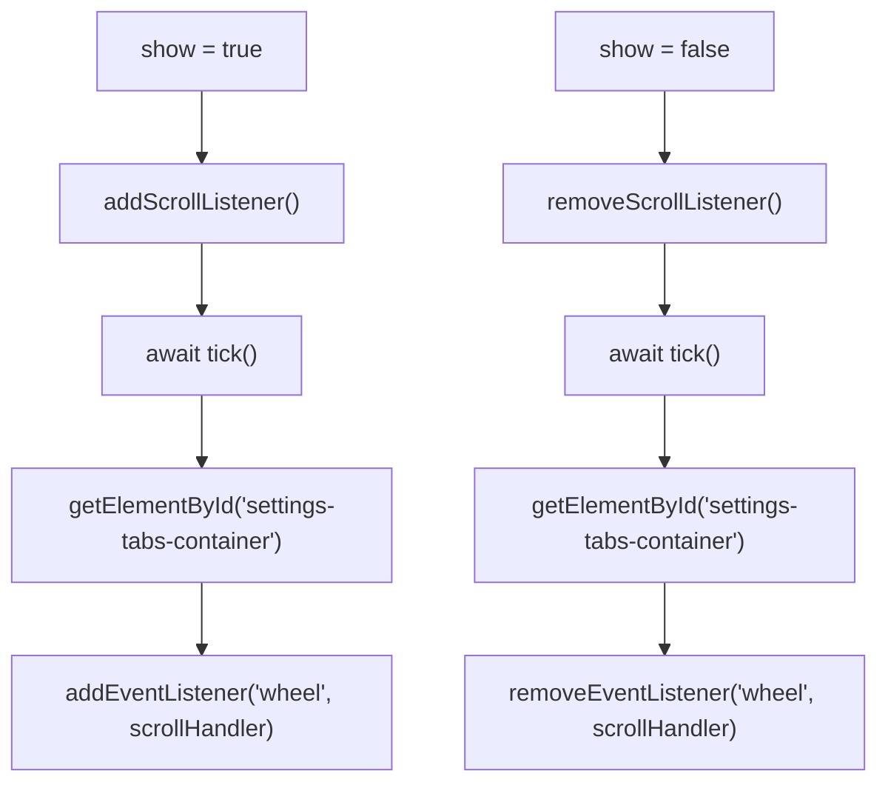
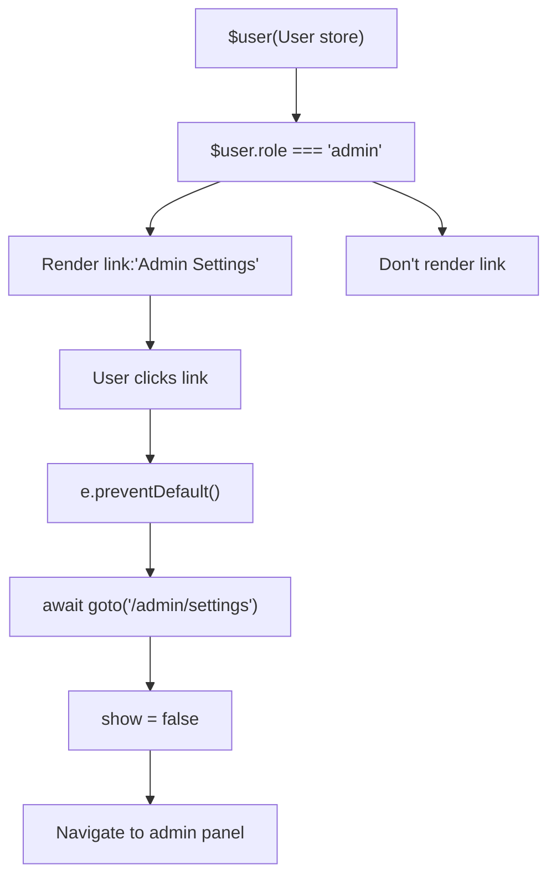

# Settings UI

Relevant source files

-   [src/lib/components/chat/Messages.svelte](https://github.com/open-webui/open-webui/blob/a7271532/src/lib/components/chat/Messages.svelte)
-   [src/lib/components/chat/Messages/ResponseMessage.svelte](https://github.com/open-webui/open-webui/blob/a7271532/src/lib/components/chat/Messages/ResponseMessage.svelte)
-   [src/lib/components/chat/Messages/UserMessage.svelte](https://github.com/open-webui/open-webui/blob/a7271532/src/lib/components/chat/Messages/UserMessage.svelte)
-   [src/lib/components/chat/Settings/Interface.svelte](https://github.com/open-webui/open-webui/blob/a7271532/src/lib/components/chat/Settings/Interface.svelte)
-   [src/lib/components/chat/SettingsModal.svelte](https://github.com/open-webui/open-webui/blob/a7271532/src/lib/components/chat/SettingsModal.svelte)
-   [src/lib/components/common/Modal.svelte](https://github.com/open-webui/open-webui/blob/a7271532/src/lib/components/common/Modal.svelte)
-   [src/lib/utils/index.ts](https://github.com/open-webui/open-webui/blob/a7271532/src/lib/utils/index.ts)
-   [src/routes/(app)/+layout.svelte](https://github.com/open-webui/open-webui/blob/a7271532/src/routes/(app)/+layout.svelte)/+layout.svelte)
-   [src/routes/(app)/+page.svelte](https://github.com/open-webui/open-webui/blob/a7271532/src/routes/(app)/+page.svelte)/+page.svelte)
-   [src/routes/(app)/c/\[id\]/+page.svelte](src/routes/(app)/c/%5Bid%5D/+page.svelte)

## Purpose and Scope

The Settings UI (`SettingsModal.svelte`) is the primary user interface for configuring application preferences, account details, and feature behavior. It provides a tabbed interface with search functionality to organize dozens of configuration options across nine main categories. This document covers the modal's architecture, tab system, search filtering, and integration with backend persistence.

The modal is rendered in the root layout at [src/routes/(app)/+layout.svelte304](https://github.com/open-webui/open-webui/blob/a7271532/src/routes/(app)/+layout.svelte#L304-L304) and controlled by the `$showSettings` store. Settings are persisted via `updateUserSettings()` API call to the backend database.

For information about the persistent configuration storage layer, see page 11.2 (Persistent Configuration System). For authentication and user permissions that control tab visibility, see page 10 (Authentication and Security).

---

## Architecture Overview

The Settings Modal follows a tab-based architecture where each tab loads a separate component responsible for a specific settings domain. The modal includes role-based tab visibility, keyword-based search, and automatic persistence of changes to the backend.


**Sources:** [src/lib/components/chat/SettingsModal.svelte1-920](https://github.com/open-webui/open-webui/blob/a7271532/src/lib/components/chat/SettingsModal.svelte#L1-L920)

---

## Component Hierarchy and File Structure

The Settings Modal is composed of a main coordinator component and nine specialized tab components:

| Component File | Purpose | Lines of Code |
| --- | --- | --- |
| `SettingsModal.svelte` | Main modal container, tab routing, search | 920 |
| `Settings/General.svelte` | System prompt, parameters, language | ~400 |
| `Settings/Interface.svelte` | UI scale, chat bubble, notifications | 1343 |
| `Settings/Connections.svelte` | Direct API connections management | ~200 |
| `Settings/Tools.svelte` | External tool server configuration | ~200 |
| `Settings/Personalization.svelte` | Memory, custom instructions | ~300 |
| `Settings/Audio.svelte` | TTS/STT, voice settings | ~400 |
| `Settings/DataControls.svelte` | Import/export, archive chats | ~200 |
| `Settings/Account.svelte` | Profile, password, API keys | ~300 |
| `Settings/About.svelte` | Version, license, links | ~150 |

**Sources:** [src/lib/components/chat/SettingsModal.svelte10-16](https://github.com/open-webui/open-webui/blob/a7271532/src/lib/components/chat/SettingsModal.svelte#L10-L16)

---

## Tab System and Registration

### Tab Definition Structure

**Tab Definition: `SettingsTab` Interface**

Each tab is defined with an ID, localized title, and extensive keywords for search functionality:


The `allSettings` array contains all possible tabs:

```
interface SettingsTab {
  id: string;
  title: string;
  keywords: string[];
}

const allSettings: SettingsTab[] = [
  { id: 'general', title: 'General', keywords: [...] },
  { id: 'interface', title: 'Interface', keywords: [...] },
  // ... 7 more tabs
];
```
**Example keyword coverage for 'interface' tab** (123 total keywords):

-   Boolean settings: `'highContrastMode'`, `'high contrast mode'`
-   Feature names: `'widescreen mode'`, `'chat bubble ui'`, `'haptic feedback'`
-   Related terms: `'android'`, `'beta'`, `'fullscreen'`

**Sources:** [src/lib/components/chat/SettingsModal.svelte42-469](https://github.com/open-webui/open-webui/blob/a7271532/src/lib/components/chat/SettingsModal.svelte#L42-L469)

### Role-Based Tab Visibility

**Function: `getAvailableSettings()`**

Not all tabs are visible to all users. The `getAvailableSettings()` function filters tabs based on `$config` and `$user` permissions:


**Visibility rules:**

| Tab ID | Visibility Condition |
| --- | --- |
| `'connections'` | `$config.features.enable_direct_connections === true` |
| `'tools'` | `$user.role === 'admin'` OR `$user.permissions.features.direct_tool_servers === true` |
| All others | Always visible |

**Sources:** [src/lib/components/chat/SettingsModal.svelte477-492](https://github.com/open-webui/open-webui/blob/a7271532/src/lib/components/chat/SettingsModal.svelte#L477-L492)

---

## Search and Filtering System

### Search Implementation

**Functions: `searchDebounceHandler()` and `setFilteredSettings()`**

The modal includes a search input (desktop only, hidden on mobile) that filters tabs by matching against tab titles and keywords:


**Search algorithm:**

1.  User types in search input (id: `'search-input-settings-modal'`)
2.  `searchDebounceHandler()` sets 100ms timeout to call `setFilteredSettings()`
3.  `setFilteredSettings()` filters `availableSettings`:
    -   Match if `tab.title.toLowerCase().includes(search.toLowerCase())`
    -   OR if any `tab.keywords` element includes the search term (lowercase)
4.  If current `selectedTab` not in `filteredSettings`, auto-select first match
5.  Empty search (`search === ''`) shows all `availableSettings`

**Sources:** [src/lib/components/chat/SettingsModal.svelte510-518](https://github.com/open-webui/open-webui/blob/a7271532/src/lib/components/chat/SettingsModal.svelte#L510-L518) [src/lib/components/chat/SettingsModal.svelte494-508](https://github.com/open-webui/open-webui/blob/a7271532/src/lib/components/chat/SettingsModal.svelte#L494-L508) [src/lib/components/chat/SettingsModal.svelte593-612](https://github.com/open-webui/open-webui/blob/a7271532/src/lib/components/chat/SettingsModal.svelte#L593-L612)

### Keyword Coverage

The keyword system is extensive. For example, the Interface tab includes 123 keywords covering various spellings and variations:

-   With/without spaces: `'autotitle'`, `'auto title'`
-   Camel case variants: `'chatBubbleUI'`, `'chat bubble ui'`
-   Feature-specific: `'widescreen mode'`, `'fullscreen'`, `'haptic feedback'`
-   Related concepts: `'android'`, `'beta'`, `'copy formatted text'`

**Sources:** [src/lib/components/chat/SettingsModal.svelte81-207](https://github.com/open-webui/open-webui/blob/a7271532/src/lib/components/chat/SettingsModal.svelte#L81-L207)

---

## Settings Persistence

### Save Flow

**Function: `saveSettings(updated)`**

When a user modifies a setting in any tab component, changes are persisted through the `saveSettings` callback:

> **[Mermaid sequence]**
> *(图表结构无法解析)*

**Implementation at [src/lib/components/chat/SettingsModal.svelte520-525](https://github.com/open-webui/open-webui/blob/a7271532/src/lib/components/chat/SettingsModal.svelte#L520-L525):**

```
const saveSettings = async (updated) => {
  console.log(updated);
  await settings.set({ ...$settings, ...updated });
  await models.set(await getModels());
  await updateUserSettings(localStorage.token, { ui: $settings });
};
```
**Save sequence:**

1.  Tab component calls `saveSettings({ changedKey: newValue })`
2.  Merge `updated` object into `$settings` store: `{ ...$settings, ...updated }`
3.  Call `getModels()` to refresh model list (important for connection changes)
4.  Call `updateUserSettings(localStorage.token, { ui: $settings })` to persist to backend
5.  Tab component displays success toast via `on:save` event or inline

**Sources:** [src/lib/components/chat/SettingsModal.svelte520-525](https://github.com/open-webui/open-webui/blob/a7271532/src/lib/components/chat/SettingsModal.svelte#L520-L525) [src/lib/components/chat/SettingsModal.svelte527-532](https://github.com/open-webui/open-webui/blob/a7271532/src/lib/components/chat/SettingsModal.svelte#L527-L532)

### Model Refresh

The `getModels()` call after settings changes is critical because several settings affect model availability:

-   **Direct connections**: If `$config.features.enable_direct_connections` is enabled and `$settings.directConnections` is set, models from those connections are included
-   The function combines base models with external OpenAI-compatible endpoints

**Sources:** [src/lib/components/chat/SettingsModal.svelte527-532](https://github.com/open-webui/open-webui/blob/a7271532/src/lib/components/chat/SettingsModal.svelte#L527-L532)

---

## Tab Components and Rendering

### Conditional Tab Rendering

**Variable: `selectedTab` (string)**

The main content area uses Svelte's `{#if}/{:else if}` blocks to render the appropriate tab component based on `selectedTab`:


**Tab component invocation patterns at [src/lib/components/chat/SettingsModal.svelte862-916](https://github.com/open-webui/open-webui/blob/a7271532/src/lib/components/chat/SettingsModal.svelte#L862-L916):**

**Pattern 1: Pass `saveSettings` + listen for `on:save` event**

```
{#if selectedTab === 'interface'}
  <Interface
    {saveSettings}
    on:save={() => {
      toast.success($i18n.t('Settings saved successfully!'));
    }}
  />
{/if}
```
**Pattern 2: Wrap `saveSettings` with inline toast**

```
{#if selectedTab === 'connections'}
  <Connections
    saveSettings={async (updated) => {
      await saveSettings(updated);
      toast.success($i18n.t('Settings saved successfully!'));
    }}
  />
{/if}
```
Most tabs use Pattern 1 (General, Interface, Personalization, Audio, Account, About). Only Connections and Tools use Pattern 2.

**Sources:** [src/lib/components/chat/SettingsModal.svelte862-916](https://github.com/open-webui/open-webui/blob/a7271532/src/lib/components/chat/SettingsModal.svelte#L862-L916)

---

## Tab-Specific Components

### Interface Tab Example

**Component: `Interface.svelte`**

The Interface tab is the most complex settings tab, with 1343 lines managing dozens of UI preferences organized into logical groups:

```mermaid
flowchart TD
    InterfaceSvelte["Interface.svelte(1343 lines)"]
    UIGroup["UItextScale, highContrastModeshowChatTitleInTabnotificationSound"]
    ChatGroup["ChatchatDirection, landingPageModechatBackgroundImagechatBubble, widescreenMode"]
    InputGroup["InputrichTextInputctrlEnterToSendlargeTextAsFile"]
    ArtifactsGroup["ArtifactsdetectArtifactsiframeSandboxAllowSameOriginiframeSandboxAllowForms"]
    VoiceGroup["Voice/CallshowEmojiInCallvoiceInterruptionhapticFeedback"]
    FileGroup["FilesimageCompressionimageCompressionSize"]
    SwitchComponent["Switch.svelte(Boolean toggles)"]
    ButtonToggle["Button toggles(Enums/multi-state)"]
    RangeSlider["Range input(Numeric)"]
    SubModal["Sub-modals(Complex config)"]

    InterfaceSvelte --> UIGroup
    InterfaceSvelte --> ChatGroup
    InterfaceSvelte --> InputGroup
    InterfaceSvelte --> ArtifactsGroup
    InterfaceSvelte --> VoiceGroup
    InterfaceSvelte --> FileGroup
    UIGroup --> SwitchComponent
    UIGroup --> RangeSlider
    ChatGroup --> SwitchComponent
    ChatGroup --> ButtonToggle
    InputGroup --> SwitchComponent
    FileGroup --> SubModal
```


**Selected Interface settings:**

| Setting Key | Type | Values | Description |
| --- | --- | --- | --- |
| `textScale` | `number` | 1.0-1.5 | UI font scale multiplier (null = default) |
| `highContrastMode` | `boolean` | true/false | Enhanced contrast for accessibility |
| `notificationSound` | `boolean` | true/false | Play sound on message completion |
| `chatDirection` | `string` | 'LTR', 'RTL', 'auto' | Text direction for chat messages |
| `chatBubble` | `boolean` | true/false | Chat bubble UI vs. traditional layout |
| `widescreenMode` | `boolean` | true/false | Full-width chat container |
| `richTextInput` | `boolean` | true/false | Tiptap rich text editor vs. textarea |
| `imageCompression` | `boolean` | true/false | Compress images before upload |
| `iframeSandboxAllowSameOrigin` | `boolean` | true/false | Allow artifacts to access same origin |

**Sub-modals for advanced configuration:**

-   `ManageFloatingActionButtonsModal`: Configure text selection actions
-   `ManageImageCompressionModal`: Set compression dimensions

**Sources:** [src/lib/components/chat/Settings/Interface.svelte1-1343](https://github.com/open-webui/open-webui/blob/a7271532/src/lib/components/chat/Settings/Interface.svelte#L1-L1343) [src/lib/components/chat/Settings/Interface.svelte197-272](https://github.com/open-webui/open-webui/blob/a7271532/src/lib/components/chat/Settings/Interface.svelte#L197-L272)

### Common Settings Patterns

All tab components follow similar patterns:

1.  **State initialization in onMount**: Load values from `$settings` store
2.  **Reactive save handlers**: Call `saveSettings()` prop with updated values
3.  **Form structure**: Each setting in a flex row with label and control
4.  **Accessibility**: All controls have `aria-labelledby` attributes
5.  **Conditional sections**: Some settings only visible based on other settings

**Sources:** [src/lib/components/chat/Settings/Interface.svelte197-272](https://github.com/open-webui/open-webui/blob/a7271532/src/lib/components/chat/Settings/Interface.svelte#L197-L272)

---

## Modal Integration and Lifecycle

### Activation via Store

**Store: `showSettings` (Writable<boolean>)**

The modal visibility is controlled by the `showSettings` Svelte store, which is a boolean writable store:


**Modal instantiation at [src/routes/(app)/+layout.svelte304](https://github.com/open-webui/open-webui/blob/a7271532/src/routes/(app)/+layout.svelte#L304-L304):**

```
<SettingsModal bind:show={$showSettings} />
```
The modal is instantiated once in the root layout and remains in the DOM. The `bind:show` directive creates a two-way binding to the `show` prop in `SettingsModal.svelte`.

**Keyboard shortcut registration at [src/routes/(app)/+layout.svelte220-223](https://github.com/open-webui/open-webui/blob/a7271532/src/routes/(app)/+layout.svelte#L220-L223):**

```
else if (isShortcutMatch(event, shortcuts[Shortcut.OPEN_SETTINGS])) {
  console.log('Shortcut triggered: OPEN_SETTINGS');
  event.preventDefault();
  showSettings.set(!$showSettings);
}
```
**Sources:** [src/routes/(app)/+layout.svelte304](https://github.com/open-webui/open-webui/blob/a7271532/src/routes/(app)/+layout.svelte#L304-L304) [src/routes/(app)/+layout.svelte220-223](https://github.com/open-webui/open-webui/blob/a7271532/src/routes/(app)/+layout.svelte#L220-L223) [src/lib/components/chat/SettingsModal.svelte34](https://github.com/open-webui/open-webui/blob/a7271532/src/lib/components/chat/SettingsModal.svelte#L34-L34)

### Modal Base Component

**Component: `Modal.svelte`**

`SettingsModal` wraps the common `Modal.svelte` base component at [src/lib/components/chat/SettingsModal.svelte572](https://github.com/open-webui/open-webui/blob/a7271532/src/lib/components/chat/SettingsModal.svelte#L572-L572):

```
<Modal size="2xl" bind:show>
  <!-- Settings content -->
</Modal>
```
**Modal.svelte features at [src/lib/components/common/Modal.svelte1-134](https://github.com/open-webui/open-webui/blob/a7271532/src/lib/components/common/Modal.svelte#L1-L134):**

| Feature | Implementation | Purpose |
| --- | --- | --- |
| Focus trapping | `focus-trap` library | Keeps keyboard navigation inside modal |
| Escape key handler | `handleKeyDown()` + `isTopModal()` | Close on Escape (only topmost modal) |
| Click-outside-to-close | `on:mousedown` on backdrop | Close when clicking backdrop |
| Portal rendering | `document.body.appendChild(modalElement)` | Render outside normal DOM tree |
| Size management | `sizeToWidth(size)` function | Maps size prop to Tailwind width classes |
| Scroll lock | `document.body.style.overflow = 'hidden'` | Prevent page scrolling when modal open |

**Size mapping for SettingsModal (`size="2xl"`):**

-   `'2xl'` → `'w-[84rem]'` (1344px max width)

**Focus trap configuration:**

```
focusTrap = FocusTrap.createFocusTrap(modalElement, {
  allowOutsideClick: (e) => {
    return (
      e.target.closest('[data-sonner-toast]') !== null ||
      e.target.closest('.modal-content') === null
    );
  }
});
```
This allows clicks on toast notifications while trapping focus otherwise.

**Sources:** [src/lib/components/chat/SettingsModal.svelte572](https://github.com/open-webui/open-webui/blob/a7271532/src/lib/components/chat/SettingsModal.svelte#L572-L572) [src/lib/components/common/Modal.svelte1-134](https://github.com/open-webui/open-webui/blob/a7271532/src/lib/components/common/Modal.svelte#L1-L134) [src/lib/components/common/Modal.svelte42-76](https://github.com/open-webui/open-webui/blob/a7271532/src/lib/components/common/Modal.svelte#L42-L76)

### Horizontal Scroll Handling

**Functions: `scrollHandler()`, `addScrollListener()`, `removeScrollListener()`**

On desktop, the tab list is vertical. On mobile, it's horizontal and scrollable. The component adds custom wheel event handling to enable horizontal scrolling with the mouse wheel on desktop:

```
const scrollHandler = (event) => {
  const settingsTabsContainer = document.getElementById('settings-tabs-container');
  if (settingsTabsContainer) {
    event.preventDefault(); // Prevent default vertical scroll
    settingsTabsContainer.scrollLeft += event.deltaY; // Scroll horizontally
  }
};
```
**Lifecycle management:**


The event listener is added when the modal opens and removed when it closes to avoid interfering with page scrolling.

**Sources:** [src/lib/components/chat/SettingsModal.svelte537-559](https://github.com/open-webui/open-webui/blob/a7271532/src/lib/components/chat/SettingsModal.svelte#L537-L559) [src/lib/components/chat/SettingsModal.svelte36-40](https://github.com/open-webui/open-webui/blob/a7271532/src/lib/components/chat/SettingsModal.svelte#L36-L40)

---

## Admin Settings Navigation

**Component: Admin Settings Link**

Admin users see an additional link at the bottom of the tab list that navigates to `/admin/settings`:


**Implementation at [src/lib/components/chat/SettingsModal.svelte843-858](https://github.com/open-webui/open-webui/blob/a7271532/src/lib/components/chat/SettingsModal.svelte#L843-L858):**

```
{#if $user?.role === 'admin'}
  <a
    href="/admin/settings"
    class="px-0.5 md:px-2.5 py-1 min-w-fit rounded-xl flex-1 md:flex-none md:mt-auto flex text-left transition ..."
    on:click={async (e) => {
      e.preventDefault();
      await goto('/admin/settings');
      show = false;
    }}
  >
    <div class=" self-center mr-2">
      <UserBadgeCheck strokeWidth="2" />
    </div>
    <div class=" self-center">{$i18n.t('Admin Settings')}</div>
  </a>
{/if}
```
This link is positioned at the bottom of the tab list with `md:mt-auto` (pushes to bottom on desktop). It provides a seamless transition from user-level settings to system-wide admin configuration.

**Sources:** [src/lib/components/chat/SettingsModal.svelte842-859](https://github.com/open-webui/open-webui/blob/a7271532/src/lib/components/chat/SettingsModal.svelte#L842-L859)

---

## Internationalization

All visible text in the Settings Modal uses the `$i18n.t()` function for translation:

```
<div class=" text-lg font-medium self-center">{$i18n.t('Settings')}</div>
```
Tab titles, button labels, setting names, and help text are all translatable. The modal supports all 17 languages available in Open WebUI.

**Sources:** [src/lib/components/chat/SettingsModal.svelte575](https://github.com/open-webui/open-webui/blob/a7271532/src/lib/components/chat/SettingsModal.svelte#L575-L575) [src/lib/components/chat/SettingsModal.svelte32](https://github.com/open-webui/open-webui/blob/a7271532/src/lib/components/chat/SettingsModal.svelte#L32-L32)

---

## State Lifecycle

**Modal State Diagram**

The following diagram illustrates the modal's state lifecycle:

> **[Mermaid stateDiagram]**
> *(图表结构无法解析)*

**State transitions:**

1.  **Closed → Opening**: `showSettings.set(true)` triggered by keyboard shortcut, button click, etc.
2.  **Opening → Rendered**: Modal component mounts, `selectedTab` defaults to `'general'` or first filtered tab
3.  **Rendered → Rendered**: User types in search input, `setFilteredSettings()` runs, tabs filter in real-time
4.  **Rendered → TabSwitch**: User clicks tab button, `selectedTab` updated
5.  **Rendered → EditingSetting**: User modifies a setting control (switch, input, button)
6.  **EditingSetting → Saving**: Tab component calls `saveSettings({ key: value })`
7.  **Saving → Saved**: `updateUserSettings()` API call completes successfully
8.  **Saved → Rendered**: Success toast displayed, UI returns to ready state
9.  **Rendered → Closing**: User triggers close (Escape key, X button, backdrop click)
10.  **Closing → Closed**: `show = false` set, modal unmounts, focus released

**Sources:** [src/lib/components/chat/SettingsModal.svelte34-40](https://github.com/open-webui/open-webui/blob/a7271532/src/lib/components/chat/SettingsModal.svelte#L34-L40) [src/lib/components/chat/SettingsModal.svelte520-525](https://github.com/open-webui/open-webui/blob/a7271532/src/lib/components/chat/SettingsModal.svelte#L520-L525)

---

## Key Code Symbols and References

| Symbol | Type | Location | Purpose |
| --- | --- | --- | --- |
| `SettingsModal.svelte` | Component | [src/lib/components/chat/SettingsModal.svelte](https://github.com/open-webui/open-webui/blob/a7271532/src/lib/components/chat/SettingsModal.svelte) | Main modal coordinator |
| `allSettings` | Array | [SettingsModal.svelte48-469](https://github.com/open-webui/open-webui/blob/a7271532/SettingsModal.svelte#L48-L469) | Tab definitions with keywords |
| `getAvailableSettings()` | Function | [SettingsModal.svelte477-492](https://github.com/open-webui/open-webui/blob/a7271532/SettingsModal.svelte#L477-L492) | Role-based tab filtering |
| `setFilteredSettings()` | Function | [SettingsModal.svelte494-508](https://github.com/open-webui/open-webui/blob/a7271532/SettingsModal.svelte#L494-L508) | Search filter logic |
| `saveSettings()` | Function | [SettingsModal.svelte520-525](https://github.com/open-webui/open-webui/blob/a7271532/SettingsModal.svelte#L520-L525) | Persist settings to backend |
| `selectedTab` | Variable | [SettingsModal.svelte534](https://github.com/open-webui/open-webui/blob/a7271532/SettingsModal.svelte#L534-L534) | Current active tab ID |
| `$showSettings` | Store | [src/lib/stores/index.ts](https://github.com/open-webui/open-webui/blob/a7271532/src/lib/stores/index.ts) | Modal visibility state |
| `updateUserSettings()` | API | [src/lib/apis/users/index.ts](https://github.com/open-webui/open-webui/blob/a7271532/src/lib/apis/users/index.ts) | Backend persistence endpoint |
| `Interface.svelte` | Component | [src/lib/components/chat/Settings/Interface.svelte](https://github.com/open-webui/open-webui/blob/a7271532/src/lib/components/chat/Settings/Interface.svelte) | UI customization tab |

**Sources:** [src/lib/components/chat/SettingsModal.svelte1-920](https://github.com/open-webui/open-webui/blob/a7271532/src/lib/components/chat/SettingsModal.svelte#L1-L920)
