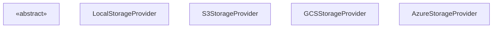
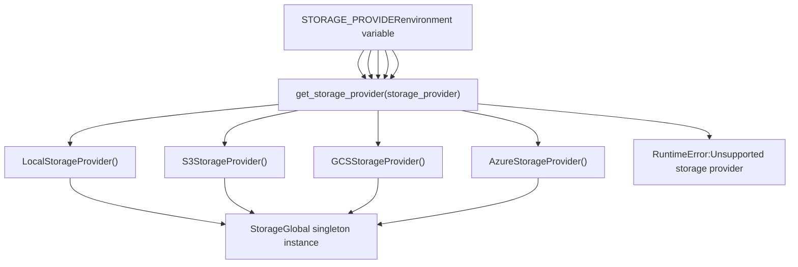
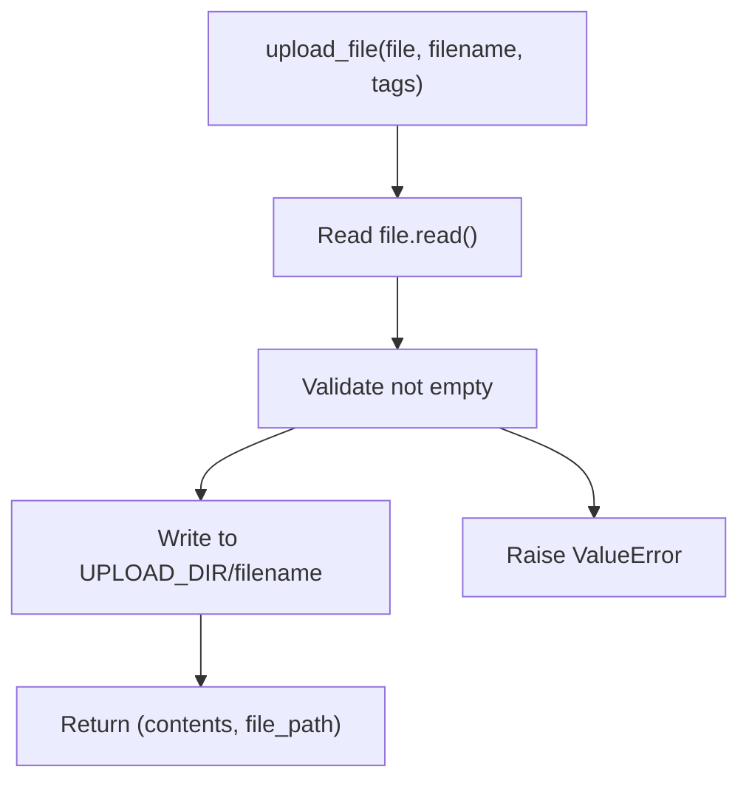
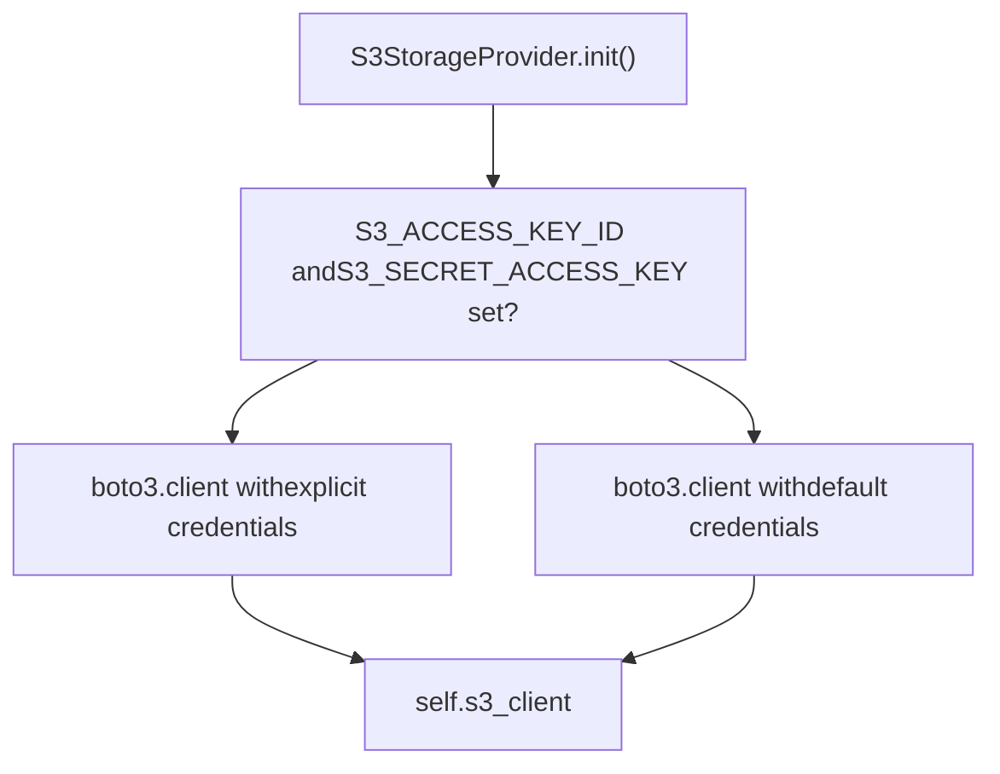
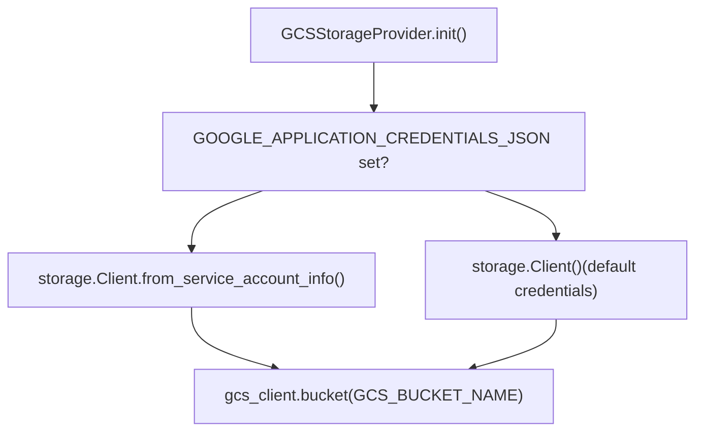
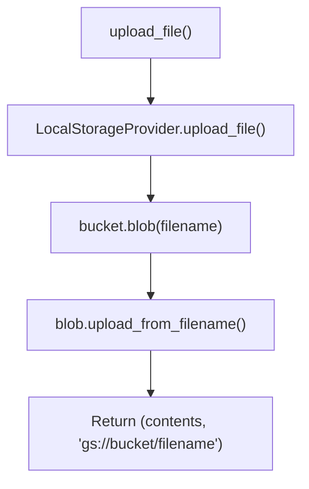
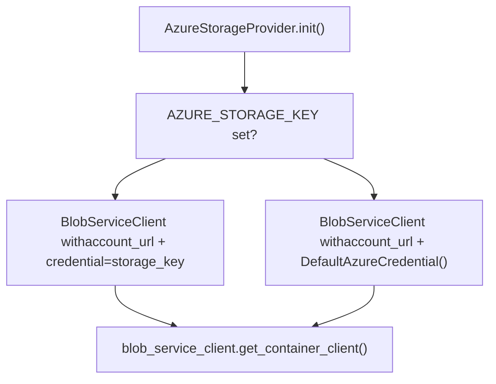
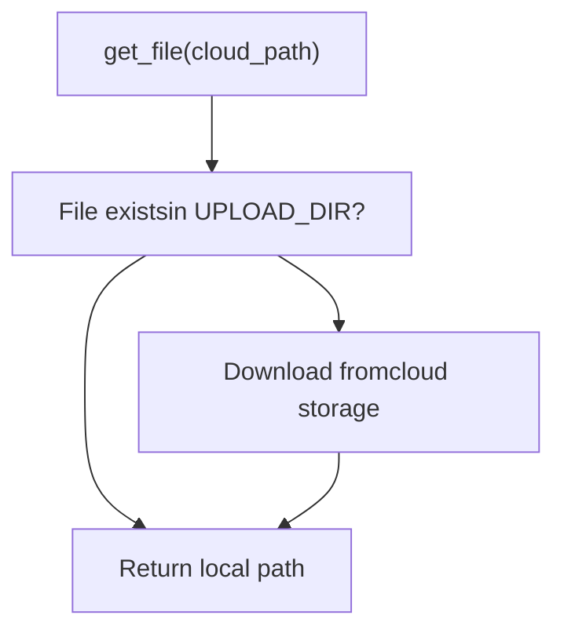

# Storage and File Management

Relevant source files

-   [.github/workflows/integration-test.disabled](https://github.com/open-webui/open-webui/blob/a7271532/.github/workflows/integration-test.disabled)
-   [backend/open\_webui/storage/provider.py](https://github.com/open-webui/open-webui/blob/a7271532/backend/open_webui/storage/provider.py)
-   [backend/open\_webui/test/apps/webui/storage/test\_provider.py](https://github.com/open-webui/open-webui/blob/a7271532/backend/open_webui/test/apps/webui/storage/test_provider.py)
-   [backend/requirements-min.txt](https://github.com/open-webui/open-webui/blob/a7271532/backend/requirements-min.txt)
-   [backend/requirements.txt](https://github.com/open-webui/open-webui/blob/a7271532/backend/requirements.txt)
-   [docker-compose.playwright.yaml](https://github.com/open-webui/open-webui/blob/a7271532/docker-compose.playwright.yaml)
-   [pyproject.toml](https://github.com/open-webui/open-webui/blob/a7271532/pyproject.toml)
-   [uv.lock](https://github.com/open-webui/open-webui/blob/a7271532/uv.lock)

This document describes the storage provider abstraction system that enables Open WebUI to store uploaded files on different storage backends including local disk, S3-compatible storage, Google Cloud Storage (GCS), and Azure Blob Storage. The system provides a unified interface for file operations regardless of the underlying storage backend.

For information about file upload processing in the frontend and backend middleware, see [File Upload and Processing](https://github.com/open-webui/open-webui/blob/a7271532/File Upload and Processing) For information about document processing and RAG ingestion, see [Document Ingestion Pipeline](https://github.com/open-webui/open-webui/blob/a7271532/Document Ingestion Pipeline)

---

## Overview and Architecture

The storage system is built around an abstract base class `StorageProvider` that defines a common interface for all storage backends. The system uses a factory pattern to instantiate the appropriate provider based on configuration, and supports a hybrid storage model where files can be cached locally even when using cloud storage.

### Storage Provider Class Hierarchy

**Diagram: StorageProvider Class Hierarchy**


**Sources:** [backend/open\_webui/storage/provider.py43-61](https://github.com/open-webui/open-webui/blob/a7271532/backend/open_webui/storage/provider.py#L43-L61) [backend/open\_webui/storage/provider.py63-106](https://github.com/open-webui/open-webui/blob/a7271532/backend/open_webui/storage/provider.py#L63-L106) [backend/open\_webui/storage/provider.py108-224](https://github.com/open-webui/open-webui/blob/a7271532/backend/open_webui/storage/provider.py#L108-L224) [backend/open\_webui/storage/provider.py226-290](https://github.com/open-webui/open-webui/blob/a7271532/backend/open_webui/storage/provider.py#L226-L290) [backend/open\_webui/storage/provider.py292-360](https://github.com/open-webui/open-webui/blob/a7271532/backend/open_webui/storage/provider.py#L292-L360)

### Configuration and Factory Pattern

The storage provider is selected at application startup based on the `STORAGE_PROVIDER` environment variable and instantiated through the `get_storage_provider()` factory function:

**Diagram: Storage Provider Factory Pattern**


**Sources:** [backend/open\_webui/storage/provider.py362-377](https://github.com/open-webui/open-webui/blob/a7271532/backend/open_webui/storage/provider.py#L362-L377)

---

## Storage Provider Interface

All storage providers implement the `StorageProvider` abstract base class, which defines four core methods for file operations.

### Abstract Methods

| Method | Parameters | Return Type | Purpose |
| --- | --- | --- | --- |
| `upload_file` | `file: BinaryIO`
`filename: str`
`tags: Dict[str, str]` | `Tuple[bytes, str]` | Upload a file and return its contents and storage path |
| `get_file` | `file_path: str` | `str` | Retrieve a file and return its local path |
| `delete_file` | `file_path: str` | `None` | Delete a specific file |
| `delete_all_files` | None | `None` | Delete all files from storage |

**Sources:** [backend/open\_webui/storage/provider.py43-61](https://github.com/open-webui/open-webui/blob/a7271532/backend/open_webui/storage/provider.py#L43-L61)

---

## Local Storage Provider

The `LocalStorageProvider` is the simplest implementation, storing files directly to the local filesystem in the directory specified by `UPLOAD_DIR`.

### Implementation Details


### Key Characteristics

-   **No external dependencies**: Uses only Python's built-in file I/O
-   **Immediate availability**: Files are immediately accessible after upload
-   **Path format**: Returns paths in format `{UPLOAD_DIR}/{filename}`
-   **Empty file validation**: Raises `ValueError` if file contents are empty

**Sources:** [backend/open\_webui/storage/provider.py63-106](https://github.com/open-webui/open-webui/blob/a7271532/backend/open_webui/storage/provider.py#L63-L106)

---

## S3 Storage Provider

The `S3StorageProvider` supports S3-compatible object storage services including AWS S3, MinIO, and other S3-compatible backends.

### Authentication Strategies

The provider supports two authentication methods:


**Workload identity support**: When credentials are not explicitly provided, the provider falls back to default AWS credential chain, enabling IAM roles for EC2, EKS, and other AWS services.

**Sources:** [backend/open\_webui/storage/provider.py108-142](https://github.com/open-webui/open-webui/blob/a7271532/backend/open_webui/storage/provider.py#L108-L142)

### Configuration Options

All configuration variables are imported from `open_webui.config`:

| Environment Variable | Type | Purpose | Default |
| --- | --- | --- | --- |
| `S3_ACCESS_KEY_ID` | string | AWS access key (optional with IAM roles) | None |
| `S3_SECRET_ACCESS_KEY` | string | AWS secret key (optional with IAM roles) | None |
| `S3_BUCKET_NAME` | string (required) | Target S3 bucket name | \- |
| `S3_REGION_NAME` | string | AWS region | None |
| `S3_ENDPOINT_URL` | string | Custom endpoint for MinIO/S3-compatible services | None |
| `S3_KEY_PREFIX` | string | Key prefix for namespacing objects | "" |
| `S3_USE_ACCELERATE_ENDPOINT` | boolean | Enable S3 Transfer Acceleration | False |
| `S3_ADDRESSING_STYLE` | string | Addressing style ('path' or 'virtual') | "auto" |
| `S3_ENABLE_TAGGING` | boolean | Enable S3 object tagging | False |

**Sources:** [backend/open\_webui/storage/provider.py12-21](https://github.com/open-webui/open-webui/blob/a7271532/backend/open_webui/storage/provider.py#L12-L21) [backend/open\_webui/config.py](https://github.com/open-webui/open-webui/blob/a7271532/backend/open_webui/config.py)

### Two-Stage Upload Process

All cloud storage providers (S3, GCS, Azure) implement a two-stage upload process where files are first written to local storage in `UPLOAD_DIR`, then synchronized to cloud storage. This hybrid approach provides:

-   **Immediate local availability** for processing by document loaders and RAG systems
-   **Durability** through cloud backup
-   **Performance** via local caching on retrieval operations

The S3 provider demonstrates this pattern:

**Diagram: S3 Upload Flow with Hybrid Storage**

> **[Mermaid sequence]**
> *(图表结构无法解析)*

This two-stage process ensures that files are immediately available locally for document processing while also being persisted to cloud storage for durability and cross-instance accessibility.

**Sources:** [backend/open\_webui/storage/provider.py148-177](https://github.com/open-webui/open-webui/blob/a7271532/backend/open_webui/storage/provider.py#L148-L177) [backend/open\_webui/storage/provider.py65-74](https://github.com/open-webui/open-webui/blob/a7271532/backend/open_webui/storage/provider.py#L65-L74)

### Tag Sanitization

S3 has strict requirements for tag values. The provider includes a `sanitize_tag_value()` method that removes characters not allowed by S3:

```
# Only allows: a-zA-Z0-9 äöüÄÖÜß +-=._:/@
@staticmethod
def sanitize_tag_value(s: str) -> str:
    return re.sub(r"[^a-zA-Z0-9 äöüÄÖÜß\+\-=\._:/@]", "", s)
```
**Sources:** [backend/open\_webui/storage/provider.py143-147](https://github.com/open-webui/open-webui/blob/a7271532/backend/open_webui/storage/provider.py#L143-L147)

### File Retrieval and Deletion

Both operations maintain the hybrid storage model:

-   **get\_file**: Downloads from S3 to local cache and returns local path
-   **delete\_file**: Deletes from both S3 and local storage
-   **delete\_all\_files**: Deletes from S3 (respecting key\_prefix) and local storage

**Sources:** [backend/open\_webui/storage/provider.py178-224](https://github.com/open-webui/open-webui/blob/a7271532/backend/open_webui/storage/provider.py#L178-L224)

---

## GCS Storage Provider

The `GCSStorageProvider` supports Google Cloud Storage with flexible authentication options.

### Authentication Methods


**Default credentials** include:

-   User credentials on local development machines
-   Google Metadata Server credentials on Compute Engine instances
-   Service account credentials from environment

**Sources:** [backend/open\_webui/storage/provider.py226-240](https://github.com/open-webui/open-webui/blob/a7271532/backend/open_webui/storage/provider.py#L226-L240)

### Configuration

All configuration variables are imported from `open_webui.config`:

| Environment Variable | Type | Purpose | Default |
| --- | --- | --- | --- |
| `GCS_BUCKET_NAME` | string (required) | Target GCS bucket name | \- |
| `GOOGLE_APPLICATION_CREDENTIALS_JSON` | string | Service account JSON credentials | None |

When `GOOGLE_APPLICATION_CREDENTIALS_JSON` is not set, the `storage.Client()` uses default credentials from:

-   `GOOGLE_APPLICATION_CREDENTIALS` file path
-   Google Cloud SDK credentials (`gcloud auth`)
-   Compute Engine metadata server (for workload identity)

**Sources:** [backend/open\_webui/storage/provider.py22-23](https://github.com/open-webui/open-webui/blob/a7271532/backend/open_webui/storage/provider.py#L22-L23) [backend/open\_webui/storage/provider.py230-239](https://github.com/open-webui/open-webui/blob/a7271532/backend/open_webui/storage/provider.py#L230-L239) [backend/open\_webui/config.py](https://github.com/open-webui/open-webui/blob/a7271532/backend/open_webui/config.py)

### Storage Operations and Two-Stage Upload

Like S3, the GCS provider implements the two-stage upload pattern with local staging:


**Path format**: Returns paths in format `gs://{bucket_name}/{filename}`

**Sources:** [backend/open\_webui/storage/provider.py241-290](https://github.com/open-webui/open-webui/blob/a7271532/backend/open_webui/storage/provider.py#L241-L290)

---

## Azure Storage Provider

The `AzureStorageProvider` supports Azure Blob Storage with both storage key and Managed Identity authentication.

### Authentication Strategies


**DefaultAzureCredential** supports multiple authentication methods in order:

1.  Environment variables
2.  Managed Identity
3.  Azure CLI credentials
4.  Interactive browser authentication

**Sources:** [backend/open\_webui/storage/provider.py292-312](https://github.com/open-webui/open-webui/blob/a7271532/backend/open_webui/storage/provider.py#L292-L312)

### Configuration

All configuration variables are imported from `open_webui.config`:

| Environment Variable | Type | Purpose | Default |
| --- | --- | --- | --- |
| `AZURE_STORAGE_ENDPOINT` | string (required) | Storage account endpoint URL
(e.g., `https://account.blob.core.windows.net`) | \- |
| `AZURE_STORAGE_CONTAINER_NAME` | string (required) | Target blob container name | \- |
| `AZURE_STORAGE_KEY` | string | Storage account access key | None |

When `AZURE_STORAGE_KEY` is not set, the `BlobServiceClient` uses `DefaultAzureCredential()` which attempts authentication via:

-   Environment variables (`AZURE_CLIENT_ID`, `AZURE_TENANT_ID`, `AZURE_CLIENT_SECRET`)
-   Managed Identity (for Azure VMs, App Service, Functions)
-   Azure CLI credentials (`az login`)
-   Visual Studio Code credentials
-   Interactive browser authentication

**Sources:** [backend/open\_webui/storage/provider.py24-26](https://github.com/open-webui/open-webui/blob/a7271532/backend/open_webui/storage/provider.py#L24-L26) [backend/open\_webui/storage/provider.py293-311](https://github.com/open-webui/open-webui/blob/a7271532/backend/open_webui/storage/provider.py#L293-L311) [backend/open\_webui/config.py](https://github.com/open-webui/open-webui/blob/a7271532/backend/open_webui/config.py)

### Storage Operations and Two-Stage Upload

The Azure provider follows the same two-stage pattern with local staging followed by cloud upload:

> **[Mermaid sequence]**
> *(图表结构无法解析)*

**Path format**: Returns paths in format `{AZURE_STORAGE_ENDPOINT}/{container_name}/{filename}`

**Sources:** [backend/open\_webui/storage/provider.py313-360](https://github.com/open-webui/open-webui/blob/a7271532/backend/open_webui/storage/provider.py#L313-L360)

---

## Testing Infrastructure

The storage system includes comprehensive tests for all providers using various mocking and emulation strategies.

### Test Coverage

```mermaid
flowchart TD
    TestSuite["Storage Provider Tests"]
    LocalTests["TestLocalStorageProvider"]
    S3Tests["TestS3StorageProvider(@mock_aws)"]
    GCSTests["TestGCSStorageProvider(gcp-storage-emulator)"]
    AzureTests["TestAzureStorageProvider(mocked clients)"]
    LT1["test_upload_file"]
    LT2["test_get_file"]
    LT3["test_delete_file"]
    LT4["test_delete_all_files"]
    S3T1["test_upload_file"]
    S3T2["test_get_file"]
    S3T3["test_delete_file"]
    S3T4["test_delete_all_files"]
    S3T5["test_init_without_credentials"]
    GCST1["test_upload_file"]
    GCST2["test_get_file"]
    GCST3["test_delete_file"]
    GCST4["test_delete_all_files"]
    AT1["test_upload_file"]
    AT2["test_get_file"]
    AT3["test_delete_file"]
    AT4["test_delete_all_files"]
    AT5["test_get_file_not_found"]

    TestSuite --> LocalTests
    TestSuite --> S3Tests
    TestSuite --> GCSTests
    TestSuite --> AzureTests
    LocalTests --> LT1
    LocalTests --> LT2
    LocalTests --> LT3
    LocalTests --> LT4
    S3Tests --> S3T1
    S3Tests --> S3T2
    S3Tests --> S3T3
    S3Tests --> S3T4
    S3Tests --> S3T5
    GCSTests --> GCST1
    GCSTests --> GCST2
    GCSTests --> GCST3
    GCSTests --> GCST4
    AzureTests --> AT1
    AzureTests --> AT2
    AzureTests --> AT3
    AzureTests --> AT4
    AzureTests --> AT5
```


### Testing Strategies by Provider

| Provider | Testing Strategy | Key Dependencies |
| --- | --- | --- |
| **LocalStorageProvider** | Real filesystem operations with temporary directories | pytest, tmp\_path fixture |
| **S3StorageProvider** | Mocked AWS services using moto | moto's `@mock_aws` decorator, boto3 |
| **GCSStorageProvider** | In-memory GCS emulator | gcp-storage-emulator server |
| **AzureStorageProvider** | Mocked Azure clients using unittest.mock | MagicMock for BlobServiceClient |

**Sources:** [backend/open\_webui/test/apps/webui/storage/test\_provider.py1-436](https://github.com/open-webui/open-webui/blob/a7271532/backend/open_webui/test/apps/webui/storage/test_provider.py#L1-L436)

### Common Test Fixtures

The tests use a shared `mock_upload_dir` helper function to create temporary upload directories and monkey-patch the `UPLOAD_DIR` configuration:

```
def mock_upload_dir(monkeypatch, tmp_path):
    """Fixture to monkey-patch the UPLOAD_DIR and create a temporary directory."""
    directory = tmp_path / "uploads"
    directory.mkdir()
    monkeypatch.setattr(provider, "UPLOAD_DIR", str(directory))
    return directory
```
This fixture:

1.  Creates a temporary directory under pytest's `tmp_path`
2.  Uses `monkeypatch.setattr()` to override `provider.UPLOAD_DIR` for the test duration
3.  Returns the directory path for test assertions

**Sources:** [backend/open\_webui/test/apps/webui/storage/test\_provider.py14-19](https://github.com/open-webui/open-webui/blob/a7271532/backend/open_webui/test/apps/webui/storage/test_provider.py#L14-L19)

---

## Dependencies and Requirements

The storage system requires different dependencies based on the configured provider:

### Core Dependencies

Required for all storage providers:

| Package | Version | File | Purpose |
| --- | --- | --- | --- |
| `aiofiles` | 24.1.0 | requirements.txt:19 | Asynchronous file I/O operations |

### Cloud Storage Dependencies

Required based on `STORAGE_PROVIDER` configuration:

| Provider | Package | Version | File | Purpose |
| --- | --- | --- | --- | --- |
| **S3** | `boto3` | 1.41.5 | requirements.txt:116 | AWS SDK for Python (S3 client) |
| **GCS** | `google-cloud-storage` | 2.19.0 | requirements.txt:108 | Google Cloud Storage client library |
| **GCS** | `google-api-python-client` | \- | requirements.txt:103 | Google API client base library |
| **GCS** | `google-auth-httplib2` | \- | requirements.txt:104 | Google authentication transport |
| **GCS** | `google-auth-oauthlib` | \- | requirements.txt:105 | Google OAuth2 authentication |
| **GCS** | `googleapis-common-protos` | 1.72.0 | requirements.txt:107 | Common protobuf definitions |
| **Azure** | `azure-storage-blob` | 12.24.1 | requirements.txt:99 | Azure Blob Storage client |
| **Azure** | `azure-identity` | 1.25.0 | requirements.txt:98 | Azure authentication (DefaultAzureCredential) |

### Testing Dependencies

Required for running storage provider tests:

| Package | Version | File | Purpose |
| --- | --- | --- | --- |
| `moto[s3]` | \>=5.0.26 | pyproject.toml:141 | AWS service mocking (@mock\_aws decorator) |
| `gcp-storage-emulator` | \>=2024.8.3 | pyproject.toml:142 | In-memory GCS server for tests |
| `docker` | ~7.1.0 | requirements.txt:131 | Docker SDK for container orchestration |
| `pytest` | ~8.4.1 | requirements.txt:132 | Python testing framework |
| `pytest-docker` | ~3.2.5 | requirements.txt:133 | Docker fixtures for pytest |

**Sources:** [backend/requirements.txt19](https://github.com/open-webui/open-webui/blob/a7271532/backend/requirements.txt#L19-L19) [backend/requirements.txt98-116](https://github.com/open-webui/open-webui/blob/a7271532/backend/requirements.txt#L98-L116) [backend/requirements.txt131-133](https://github.com/open-webui/open-webui/blob/a7271532/backend/requirements.txt#L131-L133) [pyproject.toml131-158](https://github.com/open-webui/open-webui/blob/a7271532/pyproject.toml#L131-L158)

---

## File Upload Processing

The storage system's two-stage upload process integrates with the broader file upload pipeline. When a file is uploaded through Open WebUI:

**Diagram: Complete File Upload Pipeline**

> **[Mermaid sequence]**
> *(图表结构无法解析)*

### Stage 1: Local Staging

All providers begin by writing the file to `UPLOAD_DIR`:

```
# From LocalStorageProvider.upload_file()
contents = file.read()
file_path = f"{UPLOAD_DIR}/{filename}"
with open(file_path, "wb") as f:
    f.write(contents)
```
This ensures the file is immediately available for:

-   Document content extraction (Tika, Docling, etc.)
-   Embedding generation
-   RAG processing

**Sources:** [backend/open\_webui/storage/provider.py65-74](https://github.com/open-webui/open-webui/blob/a7271532/backend/open_webui/storage/provider.py#L65-L74)

### Stage 2: Cloud Synchronization

Cloud providers (S3, GCS, Azure) then upload to remote storage:

| Provider | Upload Method | Result Path Format |
| --- | --- | --- |
| S3 | `s3_client.upload_file()` | `s3://{bucket}/{key_prefix}/{filename}` |
| GCS | `blob.upload_from_filename()` | `gs://{bucket}/{filename}` |
| Azure | `blob_client.upload_blob()` | `{endpoint}/{container}/{filename}` |

**Sources:** [backend/open\_webui/storage/provider.py148-177](https://github.com/open-webui/open-webui/blob/a7271532/backend/open_webui/storage/provider.py#L148-L177) [backend/open\_webui/storage/provider.py241-250](https://github.com/open-webui/open-webui/blob/a7271532/backend/open_webui/storage/provider.py#L241-L250) [backend/open\_webui/storage/provider.py313-322](https://github.com/open-webui/open-webui/blob/a7271532/backend/open_webui/storage/provider.py#L313-L322)

### Retrieval with Local Caching

When retrieving files, cloud providers download to local cache:


This pattern optimizes for:

-   **Performance**: Subsequent accesses use local cache
-   **Processing**: Document loaders can work with local files
-   **Resilience**: Cloud backup enables recovery if local storage is lost

**Sources:** [backend/open\_webui/storage/provider.py178-185](https://github.com/open-webui/open-webui/blob/a7271532/backend/open_webui/storage/provider.py#L178-L185) [backend/open\_webui/storage/provider.py253-262](https://github.com/open-webui/open-webui/blob/a7271532/backend/open_webui/storage/provider.py#L253-L262) [backend/open\_webui/storage/provider.py325-334](https://github.com/open-webui/open-webui/blob/a7271532/backend/open_webui/storage/provider.py#L325-L334)

---

## Global Storage Instance

The module exports a singleton `Storage` instance that is initialized at module import time based on the `STORAGE_PROVIDER` environment variable:

```
# At module level in backend/open_webui/storage/provider.py
Storage = get_storage_provider(STORAGE_PROVIDER)
```
This global `Storage` instance provides the active storage backend and is imported throughout the codebase:

```
from open_webui.storage.provider import Storage

# Usage examples:
contents, file_path = Storage.upload_file(file, filename, tags)
local_path = Storage.get_file(file_path)
Storage.delete_file(file_path)
```
The singleton pattern ensures:

-   **Single initialization**: Storage backend is configured once at startup
-   **Consistent interface**: All file operations use the same provider instance
-   **Backend transparency**: Code using `Storage` doesn't need to know which provider is active

**Sources:** [backend/open\_webui/storage/provider.py376-377](https://github.com/open-webui/open-webui/blob/a7271532/backend/open_webui/storage/provider.py#L376-L377)

---

## Error Handling

All storage providers implement consistent error handling:

### Common Exceptions

| Operation | Exception | Condition |
| --- | --- | --- |
| `upload_file` | `ValueError` | Empty file contents |
| `upload_file` | `RuntimeError` | Cloud storage upload failure |
| `get_file` | `RuntimeError` | Cloud storage download failure |
| `delete_file` | `RuntimeError` | Cloud storage deletion failure |
| `delete_all_files` | `RuntimeError` | Cloud storage bulk deletion failure |

### Cloud Provider Specific Exceptions

-   **S3**: Wraps `botocore.exceptions.ClientError` in `RuntimeError`
-   **GCS**: Wraps `google.cloud.exceptions.GoogleCloudError` and `NotFound` in `RuntimeError`
-   **Azure**: Wraps `azure.core.exceptions.ResourceNotFoundError` in `RuntimeError`

**Sources:** [backend/open\_webui/storage/provider.py63-360](https://github.com/open-webui/open-webui/blob/a7271532/backend/open_webui/storage/provider.py#L63-L360)
