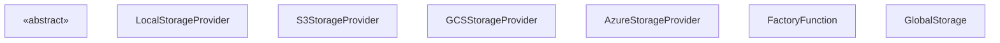
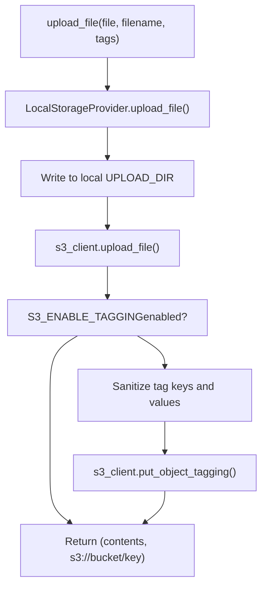
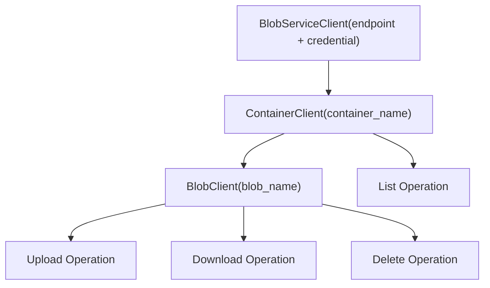
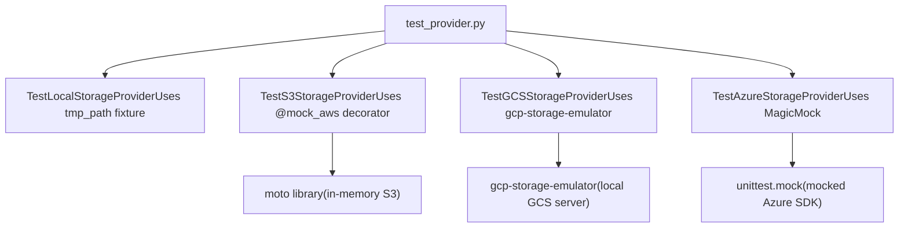

# Storage Provider Architecture

Relevant source files

-   [.github/workflows/integration-test.disabled](https://github.com/open-webui/open-webui/blob/a7271532/.github/workflows/integration-test.disabled)
-   [backend/open\_webui/storage/provider.py](https://github.com/open-webui/open-webui/blob/a7271532/backend/open_webui/storage/provider.py)
-   [backend/open\_webui/test/apps/webui/storage/test\_provider.py](https://github.com/open-webui/open-webui/blob/a7271532/backend/open_webui/test/apps/webui/storage/test_provider.py)
-   [backend/requirements-min.txt](https://github.com/open-webui/open-webui/blob/a7271532/backend/requirements-min.txt)
-   [backend/requirements.txt](https://github.com/open-webui/open-webui/blob/a7271532/backend/requirements.txt)
-   [docker-compose.playwright.yaml](https://github.com/open-webui/open-webui/blob/a7271532/docker-compose.playwright.yaml)
-   [pyproject.toml](https://github.com/open-webui/open-webui/blob/a7271532/pyproject.toml)
-   [uv.lock](https://github.com/open-webui/open-webui/blob/a7271532/uv.lock)

This document describes the polymorphic storage provider system that abstracts file storage operations across multiple backend implementations. Open WebUI supports local filesystem storage and three cloud storage providers (Amazon S3, Google Cloud Storage, Azure Blob Storage) through a unified interface. For information about how uploaded files are processed and used in the RAG system, see [Document Ingestion Pipeline](/open-webui/open-webui/7.1-document-ingestion-pipeline). For database storage configuration, see [Data and Storage Layer](/open-webui/open-webui/2.4-data-and-storage-layer).

## Architecture Overview

The storage system uses an abstract base class pattern with a factory function to select the appropriate provider at runtime. All storage operations in the codebase interact with a singleton `Storage` instance that implements one of four concrete providers based on the `STORAGE_PROVIDER` environment variable.


**Sources:** [backend/open\_webui/storage/provider.py1-375](https://github.com/open-webui/open-webui/blob/a7271532/backend/open_webui/storage/provider.py#L1-L375)

The `StorageProvider` abstract base class defines four required methods that all concrete implementations must provide. The factory function `get_storage_provider()` instantiates the appropriate provider based on a string identifier, and a module-level `Storage` variable provides a singleton instance used throughout the application.

**Sources:** [backend/open\_webui/storage/provider.py41-59](https://github.com/open-webui/open-webui/blob/a7271532/backend/open_webui/storage/provider.py#L41-L59) [backend/open\_webui/storage/provider.py360-374](https://github.com/open-webui/open-webui/blob/a7271532/backend/open_webui/storage/provider.py#L360-L374)

## Storage Provider Interface

The `StorageProvider` abstract base class defines four operations:

| Method | Parameters | Return Type | Purpose |
| --- | --- | --- | --- |
| `upload_file` | `file: BinaryIO`, `filename: str`, `tags: Dict[str, str]` | `Tuple[bytes, str]` | Upload a file and return its contents and storage path |
| `get_file` | `file_path: str` | `str` | Retrieve a file from storage and return local path |
| `delete_file` | `file_path: str` | `None` | Delete a single file from storage |
| `delete_all_files` | None | `None` | Delete all files from storage |

The `upload_file` method returns a tuple containing the file contents as bytes and the storage-specific file path (e.g., `s3://bucket/key` for S3, `gs://bucket/key` for GCS). The `get_file` method always returns a local filesystem path, downloading from cloud storage if necessary.

**Sources:** [backend/open\_webui/storage/provider.py41-59](https://github.com/open-webui/open-webui/blob/a7271532/backend/open_webui/storage/provider.py#L41-L59)

## Local Storage Provider

`LocalStorageProvider` stores files directly on the local filesystem in the directory specified by the `UPLOAD_DIR` configuration variable. This is the simplest implementation and the default for development environments.

### Implementation Details

-   **Upload**: Reads file contents into memory, writes to `{UPLOAD_DIR}/{filename}`, returns contents and local path
-   **Get**: Returns the file path as-is (no download needed)
-   **Delete**: Uses `os.remove()` for individual files, `os.unlink()` and `shutil.rmtree()` for bulk deletion
-   **Error Handling**: Raises `ValueError` if file contents are empty, logs warnings if files not found

> **[Mermaid sequence]**
> *(图表结构无法解析)*

**Sources:** [backend/open\_webui/storage/provider.py61-104](https://github.com/open-webui/open-webui/blob/a7271532/backend/open_webui/storage/provider.py#L61-L104)

The `LocalStorageProvider` does not perform any authentication or authorization checks. File paths are constructed by concatenating `UPLOAD_DIR` with the provided filename. The `delete_all_files` method recursively deletes all contents of `UPLOAD_DIR`, handling files, symlinks, and directories.

**Sources:** [backend/open\_webui/storage/provider.py89-104](https://github.com/open-webui/open-webui/blob/a7271532/backend/open_webui/storage/provider.py#L89-L104)

## S3 Storage Provider

`S3StorageProvider` stores files in Amazon S3 or S3-compatible object storage services (MinIO, DigitalOcean Spaces, etc.). It implements a two-stage strategy where files are first written to local storage, then uploaded to S3.

### Authentication and Configuration

The provider supports two authentication modes:

1.  **Explicit Credentials**: When `S3_ACCESS_KEY_ID` and `S3_SECRET_ACCESS_KEY` are provided, uses them directly
2.  **Workload Identity**: When credentials are not provided, falls back to AWS default credential chain (EC2 instance roles, EKS pod identity, etc.)

**Sources:** [backend/open\_webui/storage/provider.py118-136](https://github.com/open-webui/open-webui/blob/a7271532/backend/open_webui/storage/provider.py#L118-L136)

### Configuration Variables

| Variable | Purpose | Default |
| --- | --- | --- |
| `S3_BUCKET_NAME` | Target S3 bucket | Required |
| `S3_REGION_NAME` | AWS region | Required |
| `S3_ENDPOINT_URL` | Custom endpoint for S3-compatible services | Optional |
| `S3_KEY_PREFIX` | Prefix for all object keys | Empty string |
| `S3_USE_ACCELERATE_ENDPOINT` | Enable S3 Transfer Acceleration | `False` |
| `S3_ADDRESSING_STYLE` | Path-style or virtual-hosted-style | Default |
| `S3_ENABLE_TAGGING` | Enable object tagging | `False` |

**Sources:** [backend/open\_webui/storage/provider.py12-21](https://github.com/open-webui/open-webui/blob/a7271532/backend/open_webui/storage/provider.py#L12-L21) [backend/open\_webui/storage/provider.py107-140](https://github.com/open-webui/open-webui/blob/a7271532/backend/open_webui/storage/provider.py#L107-L140)

### Object Tagging

When `S3_ENABLE_TAGGING` is enabled, the provider applies metadata tags to uploaded objects using the `put_object_tagging` API. Tag values are sanitized to include only S3-allowed characters (alphanumeric, spaces, German umlauts, and specific symbols: `+-=._:/@`).


**Sources:** [backend/open\_webui/storage/provider.py141-175](https://github.com/open-webui/open-webui/blob/a7271532/backend/open_webui/storage/provider.py#L141-L175)

The `sanitize_tag_value` method uses regex to strip disallowed characters: `[^a-zA-Z0-9 äöüÄÖÜß\+\-=\._:/@]`.

**Sources:** [backend/open\_webui/storage/provider.py141-144](https://github.com/open-webui/open-webui/blob/a7271532/backend/open_webui/storage/provider.py#L141-L144)

### Key Management and Prefix Support

Object keys are constructed as `{S3_KEY_PREFIX}/{filename}`. When listing or deleting objects, the provider skips any objects that don't start with the configured prefix, enabling bucket sharing among multiple Open WebUI instances.

**Sources:** [backend/open\_webui/storage/provider.py151](https://github.com/open-webui/open-webui/blob/a7271532/backend/open_webui/storage/provider.py#L151-L151) [backend/open\_webui/storage/provider.py203-205](https://github.com/open-webui/open-webui/blob/a7271532/backend/open_webui/storage/provider.py#L203-L205)

### Download and Cleanup

The `get_file` method downloads objects from S3 to `UPLOAD_DIR` using `download_file()`. The `_extract_s3_key` helper parses the full S3 URI (`s3://bucket/key`) to extract just the key portion, and `_get_local_file_path` constructs the local path for downloads.

**Sources:** [backend/open\_webui/storage/provider.py176-222](https://github.com/open-webui/open-webui/blob/a7271532/backend/open_webui/storage/provider.py#L176-L222)

## GCS Storage Provider

`GCSStorageProvider` stores files in Google Cloud Storage buckets. Like S3, it uses a two-stage approach with local staging.

### Authentication

The provider supports two authentication modes:

1.  **Service Account JSON**: When `GOOGLE_APPLICATION_CREDENTIALS_JSON` is set, parses it as JSON and uses `Client.from_service_account_info()`
2.  **Application Default Credentials (ADC)**: When not set, uses the default credential chain (user credentials for local development, GCE metadata server for Compute Engine instances)

```
if GOOGLE_APPLICATION_CREDENTIALS_JSON:
    self.gcs_client = storage.Client.from_service_account_info(
        info=json.loads(GOOGLE_APPLICATION_CREDENTIALS_JSON)
    )
else:
    self.gcs_client = storage.Client()
```
**Sources:** [backend/open\_webui/storage/provider.py228-237](https://github.com/open-webui/open-webui/blob/a7271532/backend/open_webui/storage/provider.py#L228-L237)

### File Operations

The GCS provider uses the `google.cloud.storage` library's blob API:

-   **Upload**: `blob.upload_from_filename(local_path)` uploads from local staging area
-   **Download**: `blob.download_to_filename(local_path)` downloads to `UPLOAD_DIR`
-   **Delete**: `blob.delete()` removes individual objects
-   **List**: `bucket.list_blobs()` enumerates all objects for bulk deletion

File paths in GCS use the format `gs://{bucket_name}/{filename}`. The `get_file` method parses this URI format using `file_path.removeprefix("gs://").split("/")[1]`.

**Sources:** [backend/open\_webui/storage/provider.py239-288](https://github.com/open-webui/open-webui/blob/a7271532/backend/open_webui/storage/provider.py#L239-L288)

### Error Handling

The provider catches `GoogleCloudError` and `NotFound` exceptions from the GCS SDK and re-raises them as `RuntimeError` with descriptive messages. This abstraction allows calling code to handle storage errors consistently across all providers.

**Sources:** [backend/open\_webui/storage/provider.py248-249](https://github.com/open-webui/open-webui/blob/a7271532/backend/open_webui/storage/provider.py#L248-L249) [backend/open\_webui/storage/provider.py260-261](https://github.com/open-webui/open-webui/blob/a7271532/backend/open_webui/storage/provider.py#L260-L261) [backend/open\_webui/storage/provider.py269-270](https://github.com/open-webui/open-webui/blob/a7271532/backend/open_webui/storage/provider.py#L269-L270) [backend/open\_webui/storage/provider.py283-284](https://github.com/open-webui/open-webui/blob/a7271532/backend/open_webui/storage/provider.py#L283-L284)

## Azure Storage Provider

`AzureStorageProvider` stores files in Azure Blob Storage containers. It uses the `azure-storage-blob` SDK.

### Authentication

The provider supports two authentication modes:

1.  **Storage Account Key**: When `AZURE_STORAGE_KEY` is provided, uses it with `BlobServiceClient(account_url, credential=storage_key)`
2.  **DefaultAzureCredential**: When key is not provided, uses `DefaultAzureCredential()` which supports managed identities, Azure CLI credentials, and other Azure identity sources

```
if storage_key:
    self.blob_service_client = BlobServiceClient(
        account_url=self.endpoint, credential=storage_key
    )
else:
    self.blob_service_client = BlobServiceClient(
        account_url=self.endpoint, credential=DefaultAzureCredential()
    )
```
**Sources:** [backend/open\_webui/storage/provider.py296-306](https://github.com/open-webui/open-webui/blob/a7271532/backend/open_webui/storage/provider.py#L296-L306)

### Configuration Variables

| Variable | Purpose | Example |
| --- | --- | --- |
| `AZURE_STORAGE_ENDPOINT` | Storage account endpoint URL | `https://myaccount.blob.core.windows.net` |
| `AZURE_STORAGE_CONTAINER_NAME` | Container name | `open-webui-files` |
| `AZURE_STORAGE_KEY` | Storage account key | Optional (can use managed identity) |

**Sources:** [backend/open\_webui/storage/provider.py24-26](https://github.com/open-webui/open-webui/blob/a7271532/backend/open_webui/storage/provider.py#L24-L26) [backend/open\_webui/storage/provider.py292-294](https://github.com/open-webui/open-webui/blob/a7271532/backend/open_webui/storage/provider.py#L292-L294)

### Blob Operations

The Azure provider uses a hierarchical client structure:

-   `BlobServiceClient` - Root client for the storage account
-   `ContainerClient` - Client for a specific container (obtained via `get_container_client()`)
-   `BlobClient` - Client for a specific blob (obtained via `container_client.get_blob_client()`)


**Sources:** [backend/open\_webui/storage/provider.py298-309](https://github.com/open-webui/open-webui/blob/a7271532/backend/open_webui/storage/provider.py#L298-L309)

### File Path Format

Azure blob paths use the format `{endpoint}/{container_name}/{blob_name}`. For example: `https://myaccount.blob.core.windows.net/open-webui-files/document.pdf`. The provider extracts the blob name from this URL by splitting on `/` and taking the last component.

**Sources:** [backend/open\_webui/storage/provider.py317-319](https://github.com/open-webui/open-webui/blob/a7271532/backend/open_webui/storage/provider.py#L317-L319) [backend/open\_webui/storage/provider.py326](https://github.com/open-webui/open-webui/blob/a7271532/backend/open_webui/storage/provider.py#L326-L326) [backend/open\_webui/storage/provider.py338](https://github.com/open-webui/open-webui/blob/a7271532/backend/open_webui/storage/provider.py#L338-L338)

### Upload and Download

-   **Upload**: Uploads blob contents using `blob_client.upload_blob(contents, overwrite=True)` after staging to local storage
-   **Download**: Downloads blob using `blob_client.download_blob().readall()` and writes to local file
-   **Error Handling**: Catches `ResourceNotFoundError` from Azure SDK and re-raises as `RuntimeError`

**Sources:** [backend/open\_webui/storage/provider.py311-357](https://github.com/open-webui/open-webui/blob/a7271532/backend/open_webui/storage/provider.py#L311-L357)

## Provider Selection and Factory Pattern

The `get_storage_provider()` factory function selects and instantiates the appropriate provider based on a string identifier:

```
def get_storage_provider(storage_provider: str):
    if storage_provider == "local":
        Storage = LocalStorageProvider()
    elif storage_provider == "s3":
        Storage = S3StorageProvider()
    elif storage_provider == "gcs":
        Storage = GCSStorageProvider()
    elif storage_provider == "azure":
        Storage = AzureStorageProvider()
    else:
        raise RuntimeError(f"Unsupported storage provider: {storage_provider}")
    return Storage
```
**Sources:** [backend/open\_webui/storage/provider.py360-372](https://github.com/open-webui/open-webui/blob/a7271532/backend/open_webui/storage/provider.py#L360-L372)

The module creates a singleton instance at import time using the `STORAGE_PROVIDER` environment variable:

```
Storage = get_storage_provider(STORAGE_PROVIDER)
```
**Sources:** [backend/open\_webui/storage/provider.py374](https://github.com/open-webui/open-webui/blob/a7271532/backend/open_webui/storage/provider.py#L374-L374)

### Supported Provider Values

| `STORAGE_PROVIDER` Value | Implementation | Primary Use Case |
| --- | --- | --- |
| `local` | `LocalStorageProvider` | Development, single-instance deployments |
| `s3` | `S3StorageProvider` | AWS deployments, S3-compatible services |
| `gcs` | `GCSStorageProvider` | Google Cloud deployments |
| `azure` | `AzureStorageProvider` | Azure deployments |

If an invalid value is provided, the factory raises `RuntimeError` with the message: `"Unsupported storage provider: {storage_provider}"`.

**Sources:** [backend/open\_webui/storage/provider.py360-371](https://github.com/open-webui/open-webui/blob/a7271532/backend/open_webui/storage/provider.py#L360-L371)

## Two-Stage Upload Strategy

All cloud storage providers (`S3StorageProvider`, `GCSStorageProvider`, `AzureStorageProvider`) implement a two-stage upload strategy:

1.  **Stage 1**: Call `LocalStorageProvider.upload_file()` to write the file to local `UPLOAD_DIR`
2.  **Stage 2**: Upload the staged file to cloud storage using the provider-specific SDK

> **[Mermaid sequence]**
> *(图表结构无法解析)*

**Sources:** [backend/open\_webui/storage/provider.py146-151](https://github.com/open-webui/open-webui/blob/a7271532/backend/open_webui/storage/provider.py#L146-L151) [backend/open\_webui/storage/provider.py239-247](https://github.com/open-webui/open-webui/blob/a7271532/backend/open_webui/storage/provider.py#L239-L247) [backend/open\_webui/storage/provider.py311-319](https://github.com/open-webui/open-webui/blob/a7271532/backend/open_webui/storage/provider.py#L311-L319)

This strategy ensures that:

-   A local copy exists for immediate access after upload
-   Cloud storage serves as the persistent, distributed backup
-   Delete operations clean up both local and cloud copies

When deleting files, cloud providers always call `LocalStorageProvider.delete_file()` or `LocalStorageProvider.delete_all_files()` after removing from cloud storage to maintain consistency.

**Sources:** [backend/open\_webui/storage/provider.py194-196](https://github.com/open-webui/open-webui/blob/a7271532/backend/open_webui/storage/provider.py#L194-L196) [backend/open\_webui/storage/provider.py213-214](https://github.com/open-webui/open-webui/blob/a7271532/backend/open_webui/storage/provider.py#L213-L214) [backend/open\_webui/storage/provider.py272-273](https://github.com/open-webui/open-webui/blob/a7271532/backend/open_webui/storage/provider.py#L272-L273) [backend/open\_webui/storage/provider.py286-287](https://github.com/open-webui/open-webui/blob/a7271532/backend/open_webui/storage/provider.py#L286-L287) [backend/open\_webui/storage/provider.py344-345](https://github.com/open-webui/open-webui/blob/a7271532/backend/open_webui/storage/provider.py#L344-L345) [backend/open\_webui/storage/provider.py356-357](https://github.com/open-webui/open-webui/blob/a7271532/backend/open_webui/storage/provider.py#L356-L357)

## Configuration Reference

The storage provider system is configured entirely through environment variables. The `STORAGE_PROVIDER` variable determines which provider is active.

### Common Configuration

```
STORAGE_PROVIDER=local|s3|gcs|azure
UPLOAD_DIR=/path/to/upload/directory
```
**Sources:** [backend/open\_webui/storage/provider.py27-28](https://github.com/open-webui/open-webui/blob/a7271532/backend/open_webui/storage/provider.py#L27-L28)

### S3 Configuration

```
S3_BUCKET_NAME=my-bucket
S3_REGION_NAME=us-east-1
S3_ENDPOINT_URL=https://s3.amazonaws.com    # Optional
S3_ACCESS_KEY_ID=AKIA...                    # Optional
S3_SECRET_ACCESS_KEY=...                     # Optional
S3_KEY_PREFIX=open-webui/                   # Optional
S3_USE_ACCELERATE_ENDPOINT=false            # Optional
S3_ADDRESSING_STYLE=auto                    # Optional
S3_ENABLE_TAGGING=false                     # Optional
```
**Sources:** [backend/open\_webui/storage/provider.py12-21](https://github.com/open-webui/open-webui/blob/a7271532/backend/open_webui/storage/provider.py#L12-L21)

### GCS Configuration

```
GCS_BUCKET_NAME=my-bucket
GOOGLE_APPLICATION_CREDENTIALS_JSON='{"type": "service_account", ...}'  # Optional
```
If `GOOGLE_APPLICATION_CREDENTIALS_JSON` is not set, the provider uses Application Default Credentials (ADC).

**Sources:** [backend/open\_webui/storage/provider.py22-23](https://github.com/open-webui/open-webui/blob/a7271532/backend/open_webui/storage/provider.py#L22-L23)

### Azure Configuration

```
AZURE_STORAGE_ENDPOINT=https://myaccount.blob.core.windows.net
AZURE_STORAGE_CONTAINER_NAME=my-container
AZURE_STORAGE_KEY=...                       # Optional
```
If `AZURE_STORAGE_KEY` is not set, the provider uses `DefaultAzureCredential` (managed identity, Azure CLI, etc.).

**Sources:** [backend/open\_webui/storage/provider.py24-26](https://github.com/open-webui/open-webui/blob/a7271532/backend/open_webui/storage/provider.py#L24-L26)

## Testing Infrastructure

The storage provider system includes comprehensive unit tests using mocking and emulation:

-   **Local**: Direct filesystem tests with temporary directories
-   **S3**: `moto` library provides in-memory S3 mock
-   **GCS**: `gcp-storage-emulator` provides local GCS server
-   **Azure**: Python `MagicMock` objects simulate Azure SDK


**Sources:** [backend/open\_webui/test/apps/webui/storage/test\_provider.py1-436](https://github.com/open-webui/open-webui/blob/a7271532/backend/open_webui/test/apps/webui/storage/test_provider.py#L1-L436)

Each test class validates:

-   Upload operations return correct contents and paths
-   Download operations retrieve files correctly
-   Delete operations remove files from both local and cloud storage
-   Error handling for empty files, missing files, and invalid operations

The test suite also verifies that `S3StorageProvider` can initialize without explicit credentials (for workload identity scenarios).

**Sources:** [backend/open\_webui/test/apps/webui/storage/test\_provider.py190-200](https://github.com/open-webui/open-webui/blob/a7271532/backend/open_webui/test/apps/webui/storage/test_provider.py#L190-L200)
