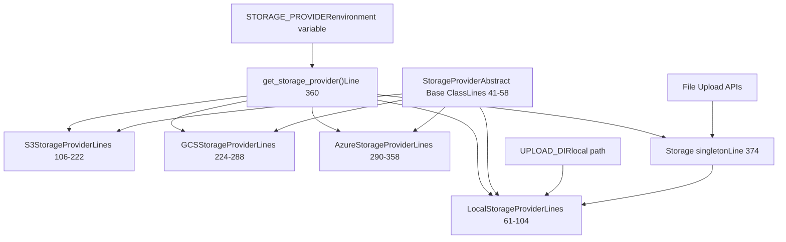
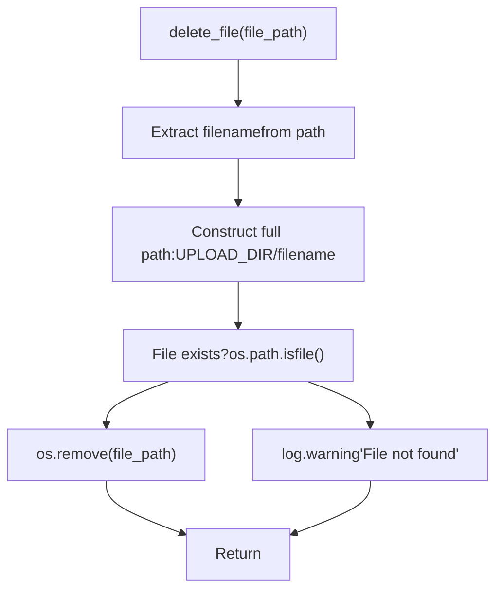
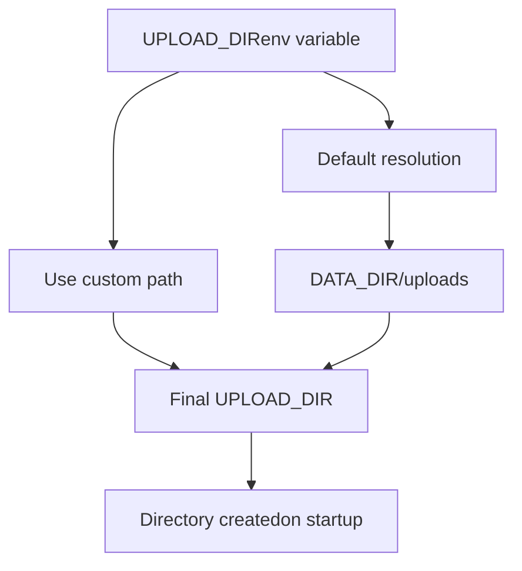

# Local Storage Provider

Relevant source files

-   [.github/workflows/integration-test.disabled](https://github.com/open-webui/open-webui/blob/a7271532/.github/workflows/integration-test.disabled)
-   [backend/open\_webui/storage/provider.py](https://github.com/open-webui/open-webui/blob/a7271532/backend/open_webui/storage/provider.py)
-   [backend/open\_webui/test/apps/webui/storage/test\_provider.py](https://github.com/open-webui/open-webui/blob/a7271532/backend/open_webui/test/apps/webui/storage/test_provider.py)
-   [backend/requirements-min.txt](https://github.com/open-webui/open-webui/blob/a7271532/backend/requirements-min.txt)
-   [backend/requirements.txt](https://github.com/open-webui/open-webui/blob/a7271532/backend/requirements.txt)
-   [docker-compose.playwright.yaml](https://github.com/open-webui/open-webui/blob/a7271532/docker-compose.playwright.yaml)
-   [pyproject.toml](https://github.com/open-webui/open-webui/blob/a7271532/pyproject.toml)
-   [uv.lock](https://github.com/open-webui/open-webui/blob/a7271532/uv.lock)

## Purpose and Scope

The Local Storage Provider implements filesystem-based storage for uploaded files in Open WebUI. This document covers the `LocalStorageProvider` class, which stores files directly to the server's local filesystem using the `UPLOAD_DIR` directory. For cloud-based storage options (S3, Google Cloud Storage, Azure Blob Storage), see [Cloud Storage Providers](/open-webui/open-webui/12.3-cloud-storage-providers). For the overall storage abstraction layer, see [Storage Provider Architecture](/open-webui/open-webui/12.1-storage-provider-architecture).

**Sources:** [backend/open\_webui/storage/provider.py1-104](https://github.com/open-webui/open-webui/blob/a7271532/backend/open_webui/storage/provider.py#L1-L104)

## Storage Provider System Overview

Open WebUI uses a polymorphic storage system where different storage backends can be selected via the `STORAGE_PROVIDER` environment variable. The `LocalStorageProvider` is the default implementation and the simplest option, suitable for single-server deployments.


**Sources:** [backend/open\_webui/storage/provider.py41-58](https://github.com/open-webui/open-webui/blob/a7271532/backend/open_webui/storage/provider.py#L41-L58) [backend/open\_webui/storage/provider.py360-374](https://github.com/open-webui/open-webui/blob/a7271532/backend/open_webui/storage/provider.py#L360-L374)

## LocalStorageProvider Implementation

The `LocalStorageProvider` class implements the `StorageProvider` abstract interface with four core methods, all defined as static methods since the class maintains no instance state.

### Class Structure


**Sources:** [backend/open\_webui/storage/provider.py41-58](https://github.com/open-webui/open-webui/blob/a7271532/backend/open_webui/storage/provider.py#L41-L58) [backend/open\_webui/storage/provider.py61-104](https://github.com/open-webui/open-webui/blob/a7271532/backend/open_webui/storage/provider.py#L61-L104)

## File Operations

### Upload File Operation

The `upload_file` method handles file uploads with validation and writing to disk:

> **[Mermaid sequence]**
> *(图表结构无法解析)*

The implementation at [backend/open\_webui/storage/provider.py62-72](https://github.com/open-webui/open-webui/blob/a7271532/backend/open_webui/storage/provider.py#L62-L72) performs these steps:

1.  **Read file contents**: `contents = file.read()`
2.  **Validate non-empty**: Raises `ValueError` with `ERROR_MESSAGES.EMPTY_CONTENT` if empty
3.  **Construct path**: `file_path = f"{UPLOAD_DIR}/{filename}"`
4.  **Write to disk**: Opens file in binary write mode and writes contents
5.  **Return tuple**: `(contents, file_path)` - contents as bytes and the full filesystem path

**Note**: The `tags` parameter is accepted for interface compatibility but not used by `LocalStorageProvider`. Cloud providers use this for metadata tagging.

**Sources:** [backend/open\_webui/storage/provider.py62-72](https://github.com/open-webui/open-webui/blob/a7271532/backend/open_webui/storage/provider.py#L62-L72)

### Get File Operation

The `get_file` method is a pass-through operation for local storage:

```
@staticmethod
def get_file(file_path: str) -> str:
    """Handles downloading of the file from local storage."""
    return file_path
```
For `LocalStorageProvider`, files are already on the local filesystem, so this method simply returns the path unchanged. Cloud storage providers override this to download files to `UPLOAD_DIR` before returning the local path.

**Sources:** [backend/open\_webui/storage/provider.py74-77](https://github.com/open-webui/open-webui/blob/a7271532/backend/open_webui/storage/provider.py#L74-L77)

### Delete File Operation

The `delete_file` method removes a single file with safety checks:


Implementation details from [backend/open\_webui/storage/provider.py79-87](https://github.com/open-webui/open-webui/blob/a7271532/backend/open_webui/storage/provider.py#L79-L87):

-   Extracts filename using: `filename = file_path.split("/")[-1]`
-   Reconstructs path: `file_path = f"{UPLOAD_DIR}/{filename}"`
-   Checks existence with `os.path.isfile(file_path)`
-   Removes with `os.remove(file_path)` if exists
-   Logs warning if file not found

**Sources:** [backend/open\_webui/storage/provider.py79-87](https://github.com/open-webui/open-webui/blob/a7271532/backend/open_webui/storage/provider.py#L79-L87)

### Delete All Files Operation

The `delete_all_files` method recursively removes all contents of the upload directory:

```
@staticmethod
def delete_all_files() -> None:
    """Handles deletion of all files from local storage."""
    if os.path.exists(UPLOAD_DIR):
        for filename in os.listdir(UPLOAD_DIR):
            file_path = os.path.join(UPLOAD_DIR, filename)
            try:
                if os.path.isfile(file_path) or os.path.islink(file_path):
                    os.unlink(file_path)  # Remove the file or link
                elif os.path.isdir(file_path):
                    shutil.rmtree(file_path)  # Remove the directory
            except Exception as e:
                log.exception(f"Failed to delete {file_path}. Reason: {e}")
    else:
        log.warning(f"Directory {UPLOAD_DIR} not found in local storage.")
```
This method:

-   Checks if `UPLOAD_DIR` exists
-   Iterates through all entries in the directory
-   Handles files/symlinks with `os.unlink()`
-   Handles subdirectories with `shutil.rmtree()`
-   Logs exceptions for individual deletion failures
-   Continues processing remaining items after failures

**Sources:** [backend/open\_webui/storage/provider.py89-103](https://github.com/open-webui/open-webui/blob/a7271532/backend/open_webui/storage/provider.py#L89-L103)

## Configuration

### Environment Variables

The `LocalStorageProvider` depends on two configuration values imported from `open_webui.config`:

| Variable | Type | Default | Description |
| --- | --- | --- | --- |
| `STORAGE_PROVIDER` | string | `"local"` | Determines which storage backend to use |
| `UPLOAD_DIR` | string | Platform-specific | Directory path where files are stored |

**Sources:** [backend/open\_webui/storage/provider.py12-29](https://github.com/open-webui/open-webui/blob/a7271532/backend/open_webui/storage/provider.py#L12-L29)

### UPLOAD\_DIR Resolution

The `UPLOAD_DIR` path is resolved in the configuration system (see [Environment Configuration](/open-webui/open-webui/11.1-environment-configuration)) and typically follows this pattern:


The directory is created automatically on application initialization if it doesn't exist.

**Sources:** [backend/open\_webui/storage/provider.py28](https://github.com/open-webui/open-webui/blob/a7271532/backend/open_webui/storage/provider.py#L28-L28)

## Factory Pattern and Initialization

The storage system uses a factory pattern to instantiate the correct provider at module import time:

```
def get_storage_provider(storage_provider: str):
    if storage_provider == "local":
        Storage = LocalStorageProvider()
    elif storage_provider == "s3":
        Storage = S3StorageProvider()
    elif storage_provider == "gcs":
        Storage = GCSStorageProvider()
    elif storage_provider == "azure":
        Storage = AzureStorageProvider()
    else:
        raise RuntimeError(f"Unsupported storage provider: {storage_provider}")
    return Storage

Storage = get_storage_provider(STORAGE_PROVIDER)
```
The global `Storage` singleton is created when the module is imported and used throughout the application. This provides a single point of configuration and enables switching storage backends via environment variables without code changes.

**Sources:** [backend/open\_webui/storage/provider.py360-374](https://github.com/open-webui/open-webui/blob/a7271532/backend/open_webui/storage/provider.py#L360-L374)

## Directory Structure and File Organization

Files uploaded through the `LocalStorageProvider` are stored flat in the `UPLOAD_DIR` directory:

```
UPLOAD_DIR/
├── document1.pdf
├── image1.png
├── spreadsheet1.xlsx
├── avatar_abc123.jpg
└── ...
```
**Key characteristics:**

-   **Flat structure**: No subdirectories by default
-   **Filename preservation**: Original filenames are typically used (may be prefixed/hashed by calling code)
-   **No metadata storage**: Unlike cloud providers, no separate metadata files are maintained
-   **Direct filesystem access**: Application code can directly access files using standard Python file I/O

**Sources:** [backend/open\_webui/storage/provider.py69](https://github.com/open-webui/open-webui/blob/a7271532/backend/open_webui/storage/provider.py#L69-L69) [backend/open\_webui/storage/provider.py83](https://github.com/open-webui/open-webui/blob/a7271532/backend/open_webui/storage/provider.py#L83-L83)

## Integration with Cloud Providers

Cloud storage providers (`S3StorageProvider`, `GCSStorageProvider`, `AzureStorageProvider`) use a two-stage approach that leverages `LocalStorageProvider`:

> **[Mermaid sequence]**
> *(图表结构无法解析)*

This hybrid approach means `UPLOAD_DIR` serves as:

-   **Primary storage** for `local` provider
-   **Staging area** for cloud uploads
-   **Cache directory** for cloud downloads

**Sources:** [backend/open\_webui/storage/provider.py150](https://github.com/open-webui/open-webui/blob/a7271532/backend/open_webui/storage/provider.py#L150-L150) [backend/open\_webui/storage/provider.py195](https://github.com/open-webui/open-webui/blob/a7271532/backend/open_webui/storage/provider.py#L195-L195) [backend/open\_webui/storage/provider.py243](https://github.com/open-webui/open-webui/blob/a7271532/backend/open_webui/storage/provider.py#L243-L243)

## Error Handling

### Empty File Validation

The only validation performed by `LocalStorageProvider` is checking for empty files:

```
contents = file.read()
if not contents:
    raise ValueError(ERROR_MESSAGES.EMPTY_CONTENT)
```
This prevents writing zero-byte files to disk.

**Sources:** [backend/open\_webui/storage/provider.py66-68](https://github.com/open-webui/open-webui/blob/a7271532/backend/open_webui/storage/provider.py#L66-L68)

### File Deletion Safety

The `delete_file` method includes existence checking:

-   Returns silently if file doesn't exist (logs warning)
-   Does not raise exceptions for missing files
-   This prevents errors when deleting already-deleted files

The `delete_all_files` method catches and logs individual deletion failures:

```
try:
    if os.path.isfile(file_path) or os.path.islink(file_path):
        os.unlink(file_path)
    elif os.path.isdir(file_path):
        shutil.rmtree(file_path)
except Exception as e:
    log.exception(f"Failed to delete {file_path}. Reason: {e}")
```
This ensures partial failures don't stop the cleanup process.

**Sources:** [backend/open\_webui/storage/provider.py84-101](https://github.com/open-webui/open-webui/blob/a7271532/backend/open_webui/storage/provider.py#L84-L101)

## Testing

The test suite for `LocalStorageProvider` is located at [backend/open\_webui/test/apps/webui/storage/test\_provider.py59-98](https://github.com/open-webui/open-webui/blob/a7271532/backend/open_webui/test/apps/webui/storage/test_provider.py#L59-L98) and includes:

### Test Coverage

| Test Method | Purpose | Key Assertions |
| --- | --- | --- |
| `test_upload_file` | Verify file upload and content writing | File exists in temp dir, contents match, ValueError on empty file |
| `test_get_file` | Verify path return | Returned path equals input path |
| `test_delete_file` | Verify single file deletion | File exists before, doesn't exist after |
| `test_delete_all_files` | Verify bulk deletion | Multiple files removed completely |

### Test Infrastructure

Tests use `monkeypatch` and `tmp_path` fixtures to:

1.  Create isolated temporary directories
2.  Patch the global `UPLOAD_DIR` variable
3.  Verify operations without affecting real filesystem

Example test setup:

```
def mock_upload_dir(monkeypatch, tmp_path):
    """Fixture to monkey-patch the UPLOAD_DIR and create a temporary directory."""
    directory = tmp_path / "uploads"
    directory.mkdir()
    monkeypatch.setattr(provider, "UPLOAD_DIR", str(directory))
    return directory
```
**Sources:** [backend/open\_webui/test/apps/webui/storage/test\_provider.py14-19](https://github.com/open-webui/open-webui/blob/a7271532/backend/open_webui/test/apps/webui/storage/test_provider.py#L14-L19) [backend/open\_webui/test/apps/webui/storage/test\_provider.py59-98](https://github.com/open-webui/open-webui/blob/a7271532/backend/open_webui/test/apps/webui/storage/test_provider.py#L59-L98)

## Dependencies

The `LocalStorageProvider` has minimal dependencies:

```
import os
import shutil
import logging
from typing import BinaryIO, Tuple, Dict
```
No external packages are required beyond Python standard library, making it the lightest storage option.

**Sources:** [backend/open\_webui/storage/provider.py1-7](https://github.com/open-webui/open-webui/blob/a7271532/backend/open_webui/storage/provider.py#L1-L7)

## Usage Pattern

Throughout the Open WebUI codebase, the storage provider is accessed via the module-level `Storage` singleton:

```
from open_webui.storage.provider import Storage

# Upload a file
contents, file_path = Storage.upload_file(file_object, "document.pdf", {})

# Get file path (for local, this is a no-op)
local_path = Storage.get_file(file_path)

# Delete a file
Storage.delete_file(file_path)

# Delete all files
Storage.delete_all_files()
```
The calling code doesn't need to know which storage provider is active - the interface is identical across all providers.

**Sources:** [backend/open\_webui/storage/provider.py374](https://github.com/open-webui/open-webui/blob/a7271532/backend/open_webui/storage/provider.py#L374-L374)
