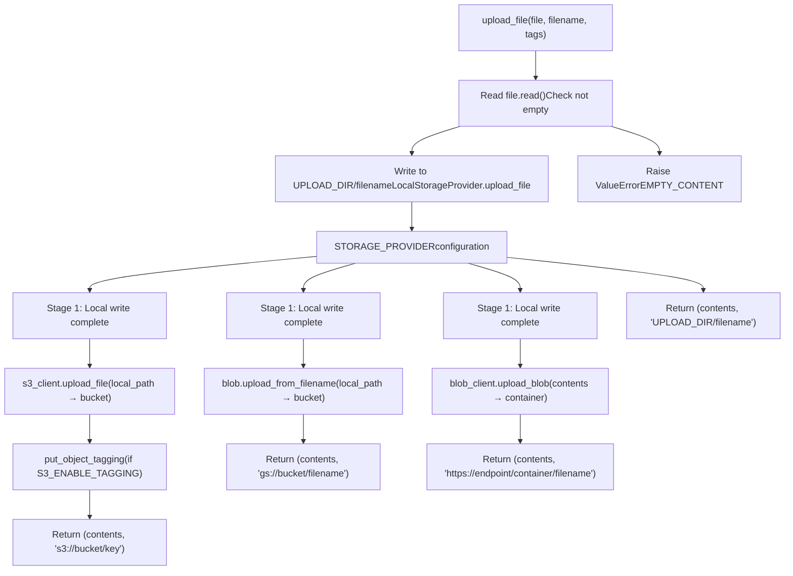
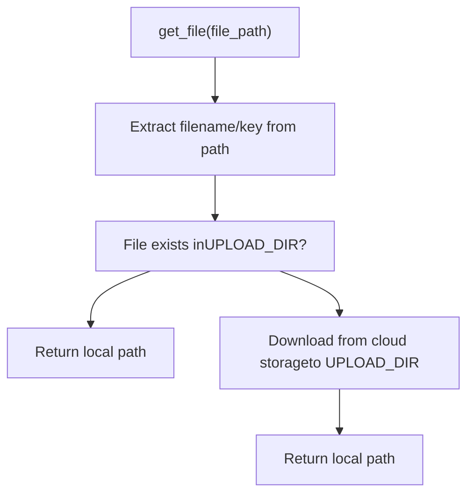

# File Upload Processing

Relevant source files

-   [.github/workflows/integration-test.disabled](https://github.com/open-webui/open-webui/blob/a7271532/.github/workflows/integration-test.disabled)
-   [backend/open\_webui/storage/provider.py](https://github.com/open-webui/open-webui/blob/a7271532/backend/open_webui/storage/provider.py)
-   [backend/open\_webui/test/apps/webui/storage/test\_provider.py](https://github.com/open-webui/open-webui/blob/a7271532/backend/open_webui/test/apps/webui/storage/test_provider.py)
-   [backend/requirements-min.txt](https://github.com/open-webui/open-webui/blob/a7271532/backend/requirements-min.txt)
-   [backend/requirements.txt](https://github.com/open-webui/open-webui/blob/a7271532/backend/requirements.txt)
-   [docker-compose.playwright.yaml](https://github.com/open-webui/open-webui/blob/a7271532/docker-compose.playwright.yaml)
-   [pyproject.toml](https://github.com/open-webui/open-webui/blob/a7271532/pyproject.toml)
-   [uv.lock](https://github.com/open-webui/open-webui/blob/a7271532/uv.lock)

## Purpose and Scope

This document explains the file upload processing system in Open WebUI, specifically the two-stage upload architecture where files are first written to local storage before being optionally synchronized to cloud storage backends. This page focuses on the mechanics of the upload flow, return values, and error handling. For information about the storage provider abstraction layer, see [Storage Provider Architecture](/open-webui/open-webui/12.1-storage-provider-architecture). For details on specific provider implementations, see [Local Storage Provider](/open-webui/open-webui/12.2-local-storage-provider) and [Cloud Storage Providers](/open-webui/open-webui/12.3-cloud-storage-providers).

## Two-Stage Upload Architecture

### Overview

All file uploads in Open WebUI follow a two-stage process, regardless of the configured storage provider:

1.  **Stage 1: Local Staging** - Files are first written to the local filesystem at `UPLOAD_DIR`
2.  **Stage 2: Cloud Synchronization** - Cloud providers synchronize the local file to remote storage

This architecture provides several operational benefits:

-   **Caching**: Local copies serve as cache for frequently accessed files
-   **Reliability**: Upload succeeds even if cloud upload fails temporarily
-   **Performance**: Local files can be served directly without cloud API calls
-   **Consistency**: All providers follow the same initial processing path

### Upload Flow by Provider


Sources: [backend/open\_webui/storage/provider.py61-357](https://github.com/open-webui/open-webui/blob/a7271532/backend/open_webui/storage/provider.py#L61-L357)

## Stage 1: Local File Writing

### LocalStorageProvider.upload\_file Method

All file uploads begin by invoking `LocalStorageProvider.upload_file`, regardless of the configured storage provider. This method performs the following operations:

1.  **Read file contents**: `contents = file.read()` reads the entire file into memory
2.  **Validate non-empty**: Raises `ValueError(ERROR_MESSAGES.EMPTY_CONTENT)` if empty
3.  **Construct file path**: `file_path = f"{UPLOAD_DIR}/{filename}"`
4.  **Write to disk**: Opens file in binary write mode (`"wb"`) and writes contents
5.  **Return tuple**: Returns `(contents, file_path)`

### Code Structure


Sources: [backend/open\_webui/storage/provider.py61-72](https://github.com/open-webui/open-webui/blob/a7271532/backend/open_webui/storage/provider.py#L61-L72) [backend/open\_webui/storage/provider.py106-137](https://github.com/open-webui/open-webui/blob/a7271532/backend/open_webui/storage/provider.py#L106-L137) [backend/open\_webui/storage/provider.py224-237](https://github.com/open-webui/open-webui/blob/a7271532/backend/open_webui/storage/provider.py#L224-L237) [backend/open\_webui/storage/provider.py290-309](https://github.com/open-webui/open-webui/blob/a7271532/backend/open_webui/storage/provider.py#L290-L309)

### File Path Construction

The local file path follows a simple pattern:

-   **Pattern**: `{UPLOAD_DIR}/{filename}`
-   **UPLOAD\_DIR**: Configured via environment variable, typically `./data/uploads/`
-   **filename**: Provided by caller, usually includes unique identifiers (UUIDs, hashes)

Example: `/data/uploads/a1b2c3d4-e5f6-4789-abcd-ef0123456789.pdf`

The filename parameter must be unique to prevent overwrites. The caller is responsible for generating unique filenames.

Sources: [backend/open\_webui/storage/provider.py69](https://github.com/open-webui/open-webui/blob/a7271532/backend/open_webui/storage/provider.py#L69-L69)

## Stage 2: Cloud Synchronization

### S3StorageProvider Upload Flow

> **[Mermaid sequence]**
> *(图表结构无法解析)*

Sources: [backend/open\_webui/storage/provider.py146-174](https://github.com/open-webui/open-webui/blob/a7271532/backend/open_webui/storage/provider.py#L146-L174)

### S3-Specific Implementation Details

**Key Prefix Support**: The `S3_KEY_PREFIX` environment variable allows organizing files within the bucket:

-   S3 key construction: `s3_key = os.path.join(self.key_prefix, filename)`
-   Example: `key_prefix="uploads/"` results in `s3://bucket/uploads/filename.pdf`

**Tag Sanitization**: S3 tags must contain only specific characters. The `sanitize_tag_value` method enforces this:

```
# Allowed characters: [a-zA-Z0-9 äöüÄÖÜß\+\-=\._:/@]
return re.sub(r"[^a-zA-Z0-9 äöüÄÖÜß\+\-=\._:/@]", "", s)
```
**Tag Application**: Tags are applied in a separate API call after upload completes:

1.  Tags are only applied if `S3_ENABLE_TAGGING=true` and `tags` dict is non-empty
2.  Tags are sanitized and converted to S3 TagSet format: `[{"Key": k, "Value": v}, ...]`
3.  Applied via `put_object_tagging` API call

**Authentication Options**:

-   **Explicit credentials**: Set `S3_ACCESS_KEY_ID` and `S3_SECRET_ACCESS_KEY`
-   **Workload identity**: Omit credentials to use IAM roles (EC2, EKS, ECS)

Sources: [backend/open\_webui/storage/provider.py106-174](https://github.com/open-webui/open-webui/blob/a7271532/backend/open_webui/storage/provider.py#L106-L174)

### GCS and Azure Upload Flows

**GCS Upload Sequence**:

1.  Call `LocalStorageProvider.upload_file` → get `(contents, local_path)`
2.  Create blob: `blob = self.bucket.blob(filename)`
3.  Upload: `blob.upload_from_filename(local_path)`
4.  Return: `(contents, f"gs://{bucket_name}/{filename}")`

**Azure Upload Sequence**:

1.  Call `LocalStorageProvider.upload_file` → get `(contents, local_path)`
2.  Get blob client: `blob_client = self.container_client.get_blob_client(filename)`
3.  Upload: `blob_client.upload_blob(contents, overwrite=True)`
4.  Return: `(contents, f"{endpoint}/{container_name}/{filename}")`

**Key Differences**:

-   GCS uploads from the local file path
-   Azure uploads the contents bytes directly
-   Azure always uses `overwrite=True` to replace existing blobs

Sources: [backend/open\_webui/storage/provider.py239-249](https://github.com/open-webui/open-webui/blob/a7271532/backend/open_webui/storage/provider.py#L239-L249) [backend/open\_webui/storage/provider.py311-321](https://github.com/open-webui/open-webui/blob/a7271532/backend/open_webui/storage/provider.py#L311-L321)

## Upload Return Values

### Return Type and Components

All `upload_file` methods return `Tuple[bytes, str]`:

1.  **bytes**: Raw file contents (entire file in memory)
2.  **str**: File path or URL identifying the storage location

The contents are useful for immediate processing without re-reading from disk. The path string is typically stored in the database as a reference for later retrieval.

### File Path Formats by Provider

| Provider | Format | Example | Notes |
| --- | --- | --- | --- |
| `local` | `{UPLOAD_DIR}/{filename}` | `/data/uploads/file.pdf` | Local filesystem path |
| `s3` | `s3://{bucket}/{key}` | `s3://my-bucket/uploads/file.pdf` | S3 URI format |
| `gcs` | `gs://{bucket}/{filename}` | `gs://my-bucket/file.pdf` | GCS URI format |
| `azure` | `https://{endpoint}/{container}/{filename}` | `https://account.blob.core.windows.net/uploads/file.pdf` | Full HTTPS URL |

### Path Format Implications

The path format serves multiple purposes:

1.  **Provider identification**: The URI scheme (`s3://`, `gs://`, `https://`) identifies the storage backend
2.  **Retrieval routing**: The `get_file` method uses the path format to determine retrieval strategy
3.  **Database storage**: Paths are stored in database records referencing the file
4.  **Debugging**: Paths make it easy to locate files in cloud consoles

Sources: [backend/open\_webui/storage/provider.py69-72](https://github.com/open-webui/open-webui/blob/a7271532/backend/open_webui/storage/provider.py#L69-L72) [backend/open\_webui/storage/provider.py169-172](https://github.com/open-webui/open-webui/blob/a7271532/backend/open_webui/storage/provider.py#L169-L172) [backend/open\_webui/storage/provider.py247](https://github.com/open-webui/open-webui/blob/a7271532/backend/open_webui/storage/provider.py#L247-L247) [backend/open\_webui/storage/provider.py319](https://github.com/open-webui/open-webui/blob/a7271532/backend/open_webui/storage/provider.py#L319-L319)

## Error Handling

### Validation Errors

**Empty File Check**: All providers validate that file contents are non-empty during Stage 1:

```
contents = file.read()
if not contents:
    raise ValueError(ERROR_MESSAGES.EMPTY_CONTENT)
```
This validation occurs in `LocalStorageProvider.upload_file`, so it applies to all providers uniformly.

Sources: [backend/open\_webui/storage/provider.py66-68](https://github.com/open-webui/open-webui/blob/a7271532/backend/open_webui/storage/provider.py#L66-L68)

### Cloud Upload Errors

Each cloud provider wraps cloud-specific exceptions in generic `RuntimeError`:

| Provider | Exception Type | Error Wrapping |
| --- | --- | --- |
| S3 | `ClientError` (boto3) | `RuntimeError(f"Error uploading file to S3: {e}")` |
| GCS | `GoogleCloudError` | `RuntimeError(f"Error uploading file to GCS: {e}")` |
| Azure | Generic `Exception` | `RuntimeError(f"Error uploading file to Azure Blob Storage: {e}")` |

### Error Recovery Considerations

**Partial Success Scenario**:

-   If Stage 1 succeeds but Stage 2 fails, the file exists in `UPLOAD_DIR`
-   The function raises an exception, so no database record is created
-   The local file becomes an orphan (exists on disk but not referenced)
-   Manual cleanup may be required to remove orphaned files

**Retry Behavior**:

-   No automatic retry logic is implemented in the storage providers
-   Callers are responsible for implementing retry logic if needed
-   Cloud SDK clients (boto3, google-cloud-storage) have their own retry mechanisms

Sources: [backend/open\_webui/storage/provider.py173-174](https://github.com/open-webui/open-webui/blob/a7271532/backend/open_webui/storage/provider.py#L173-L174) [backend/open\_webui/storage/provider.py248-249](https://github.com/open-webui/open-webui/blob/a7271532/backend/open_webui/storage/provider.py#L248-L249) [backend/open\_webui/storage/provider.py320-321](https://github.com/open-webui/open-webui/blob/a7271532/backend/open_webui/storage/provider.py#L320-L321)

## File Metadata and Tagging

### Tags Parameter

The `upload_file` method signature includes `tags: Dict[str, str]`:

```
def upload_file(self, file: BinaryIO, filename: str, tags: Dict[str, str]) -> Tuple[bytes, str]
```
Currently, only S3 implements tag support. GCS and Azure providers accept the parameter but ignore it.

### S3 Tagging Implementation

**Tag Processing Steps**:

1.  Check `S3_ENABLE_TAGGING` flag and non-empty tags dict
2.  Sanitize tag keys and values: `sanitized_tags = {sanitize_tag_value(k): sanitize_tag_value(v) for k, v in tags.items()}`
3.  Convert to S3 TagSet format: `{"TagSet": [{"Key": k, "Value": v} for k, v in sanitized_tags.items()]}`
4.  Apply tags: `s3_client.put_object_tagging(Bucket=bucket, Key=key, Tagging=tagging)`

**Character Restrictions**: S3 tags allow: `[a-zA-Z0-9 äöüÄÖÜß\+\-=\._:/@]`

-   Letters, numbers, spaces
-   German umlauts
-   Special characters: `+ - = . _ : / @`

### Tag Use Cases

Common tagging patterns:

| Tag Key | Example Value | Purpose |
| --- | --- | --- |
| `user_id` | `user_abc123` | Associate files with users |
| `document_type` | `invoice` | Categorize documents |
| `upload_date` | `2024-01-15` | Track upload timestamps |
| `project` | `project_x` | Enable cost allocation |
| `retention` | `90days` | Support lifecycle policies |

Sources: [backend/open\_webui/storage/provider.py142-168](https://github.com/open-webui/open-webui/blob/a7271532/backend/open_webui/storage/provider.py#L142-L168)

## Local File Caching

### Cache Behavior Overview

The two-stage architecture creates an implicit caching layer:

**Cache Population**:

-   All uploaded files are cached in `UPLOAD_DIR` during Stage 1
-   Cache is populated even for cloud-only storage configurations
-   No cache size limits or eviction policies are enforced

**Cache Persistence**:

-   Files persist across application restarts
-   No automatic expiration or cleanup
-   Manual cleanup via `delete_file` or `delete_all_files` methods

### Cache Retrieval Flow

Cloud providers' `get_file` methods implement cache-aware retrieval:


**S3 get\_file**:

```
def get_file(self, file_path: str) -> str:
    s3_key = self._extract_s3_key(file_path)
    local_file_path = self._get_local_file_path(s3_key)
    self.s3_client.download_file(self.bucket_name, s3_key, local_file_path)
    return local_file_path
```
The method always downloads from S3 and returns the local path. It does not check if the file already exists locally, so it overwrites the cache on every `get_file` call.

Sources: [backend/open\_webui/storage/provider.py176-184](https://github.com/open-webui/open-webui/blob/a7271532/backend/open_webui/storage/provider.py#L176-L184) [backend/open\_webui/storage/provider.py251-261](https://github.com/open-webui/open-webui/blob/a7271532/backend/open_webui/storage/provider.py#L251-L261) [backend/open\_webui/storage/provider.py323-333](https://github.com/open-webui/open-webui/blob/a7271532/backend/open_webui/storage/provider.py#L323-L333)

### Cache Management Considerations

**Storage Overhead**:

-   Cloud configurations store files twice: local cache + cloud storage
-   No automatic cache eviction implemented
-   Cache can grow unbounded without manual cleanup

**Performance Trade-offs**:

-   Cache enables fast local file serving
-   Eliminates cloud API latency for cached files
-   Disk space consumption grows with file count

**Operational Recommendations**:

-   Monitor `UPLOAD_DIR` disk usage
-   Implement scheduled cache cleanup if needed
-   Consider LRU eviction for high-volume deployments

Sources: [backend/open\_webui/storage/provider.py61-287](https://github.com/open-webui/open-webui/blob/a7271532/backend/open_webui/storage/provider.py#L61-L287)

## Testing Infrastructure

### Test Provider Implementations

The test suite uses provider-specific mock strategies:

| Provider | Mock Strategy | Implementation |
| --- | --- | --- |
| Local | `tmp_path` fixture | Creates temporary directory, patches `UPLOAD_DIR` |
| S3 | `@mock_aws` decorator | Uses `moto` library to mock boto3 API |
| GCS | `gcp-storage-emulator` | Runs local emulator server on port 9023 |
| Azure | `MagicMock` | Mocks `BlobServiceClient` and related clients |

### Upload Test Pattern

All provider tests follow a consistent pattern:

> **[Mermaid sequence]**
> *(图表结构无法解析)*

### Test Coverage Areas

**Positive Test Cases**:

-   Upload valid files and verify storage
-   Retrieve files and verify local paths
-   Delete individual files
-   Delete all files

**Negative Test Cases**:

-   Empty file rejection (raises `ValueError`)
-   Missing bucket/container errors
-   Permission errors
-   Network failures (cloud providers)

**Edge Cases**:

-   Multiple uploads to same filename
-   Large file handling
-   Special characters in filenames
-   Tag sanitization (S3 only)

Sources: [backend/open\_webui/test/apps/webui/storage/test\_provider.py59-425](https://github.com/open-webui/open-webui/blob/a7271532/backend/open_webui/test/apps/webui/storage/test_provider.py#L59-L425)

### Mock Upload Directory Fixture

```
def mock_upload_dir(monkeypatch, tmp_path):
    """Fixture to monkey-patch the UPLOAD_DIR and create a temporary directory."""
    directory = tmp_path / "uploads"
    directory.mkdir()
    monkeypatch.setattr(provider, "UPLOAD_DIR", str(directory))
    return directory
```
This fixture ensures:

-   Tests use isolated temporary directories
-   No interference with actual upload directories
-   Automatic cleanup after test completion
-   Deterministic test behavior

Sources: [backend/open\_webui/test/apps/webui/storage/test\_provider.py14-19](https://github.com/open-webui/open-webui/blob/a7271532/backend/open_webui/test/apps/webui/storage/test_provider.py#L14-L19)

## Configuration Reference

### Environment Variables by Provider

**Local Storage**:

-   `UPLOAD_DIR` - Local directory path (default: `./data/uploads/`)

**S3 Storage**:

-   `S3_BUCKET_NAME` - Required: Bucket name
-   `S3_REGION_NAME` - Required: AWS region (e.g., `us-east-1`)
-   `S3_ENDPOINT_URL` - Optional: Custom endpoint for S3-compatible services
-   `S3_ACCESS_KEY_ID` - Optional: AWS access key (or use workload identity)
-   `S3_SECRET_ACCESS_KEY` - Optional: AWS secret key (or use workload identity)
-   `S3_KEY_PREFIX` - Optional: Prefix for S3 keys (e.g., `uploads/`)
-   `S3_USE_ACCELERATE_ENDPOINT` - Optional: Enable Transfer Acceleration
-   `S3_ADDRESSING_STYLE` - Optional: `path` or `virtual` addressing
-   `S3_ENABLE_TAGGING` - Optional: Enable object tagging (`true`/`false`)

**GCS Storage**:

-   `GCS_BUCKET_NAME` - Required: Bucket name
-   `GOOGLE_APPLICATION_CREDENTIALS_JSON` - Optional: Service account JSON (or use default credentials)

**Azure Storage**:

-   `AZURE_STORAGE_ENDPOINT` - Required: Storage account endpoint URL
-   `AZURE_STORAGE_CONTAINER_NAME` - Required: Container name
-   `AZURE_STORAGE_KEY` - Optional: Storage account key (or use managed identity)

**Provider Selection**:

-   `STORAGE_PROVIDER` - Required: `local`, `s3`, `gcs`, or `azure`

Sources: [backend/open\_webui/storage/provider.py12-29](https://github.com/open-webui/open-webui/blob/a7271532/backend/open_webui/storage/provider.py#L12-L29)

### Storage Provider Initialization

The storage provider is initialized as a module-level singleton:

```
Storage = get_storage_provider(STORAGE_PROVIDER)
```
The `get_storage_provider` factory function:

```
def get_storage_provider(storage_provider: str):
    if storage_provider == "local":
        Storage = LocalStorageProvider()
    elif storage_provider == "s3":
        Storage = S3StorageProvider()
    elif storage_provider == "gcs":
        Storage = GCSStorageProvider()
    elif storage_provider == "azure":
        Storage = AzureStorageProvider()
    else:
        raise RuntimeError(f"Unsupported storage provider: {storage_provider}")
    return Storage
```
Sources: [backend/open\_webui/storage/provider.py360-374](https://github.com/open-webui/open-webui/blob/a7271532/backend/open_webui/storage/provider.py#L360-L374)

## Integration with Document Processing

### Upstream Callers

File upload processing is invoked by several subsystems:

1.  **RAG Document Ingestion** (see [Document Ingestion Pipeline](/open-webui/open-webui/7.1-document-ingestion-pipeline))

    -   Uploads PDFs, DOCX, and other documents
    -   Files are processed by content extraction engines
    -   Uses tagging to associate files with knowledge collections
2.  **Chat File Attachments** (see [File Upload and Processing](/open-webui/open-webui/4.4-file-upload-and-processing))

    -   Uploads user-attached files in chat messages
    -   Supports images, audio, documents (40+ file types)
    -   Files may be embedded inline or processed as context
3.  **User/Workspace Assets**

    -   Avatar image uploads
    -   Custom branding assets
    -   Configuration file imports

### File Lifecycle

> **[Mermaid stateDiagram]**
> *(图表结构无法解析)*

**Typical Lifecycle**:

1.  **Upload**: Client calls `upload_file` with file contents
2.  **Storage**: File written to local and optionally cloud storage
3.  **Database Reference**: Caller stores returned path in database
4.  **Retrieval**: Later accesses call `get_file` with stored path
5.  **Processing**: File is read from local cache for processing
6.  **Deletion**: File removed via `delete_file` when no longer needed

Sources: [backend/open\_webui/storage/provider.py41-58](https://github.com/open-webui/open-webui/blob/a7271532/backend/open_webui/storage/provider.py#L41-L58)
