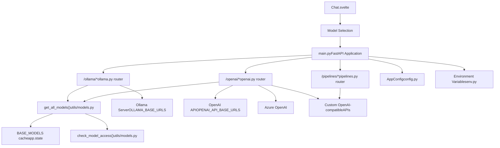
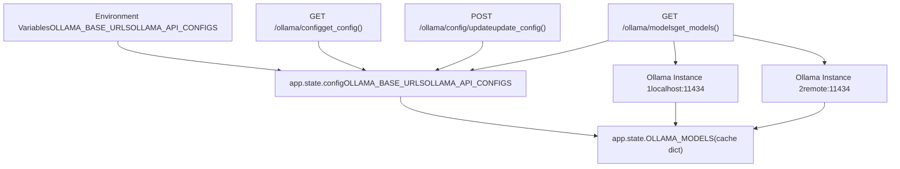
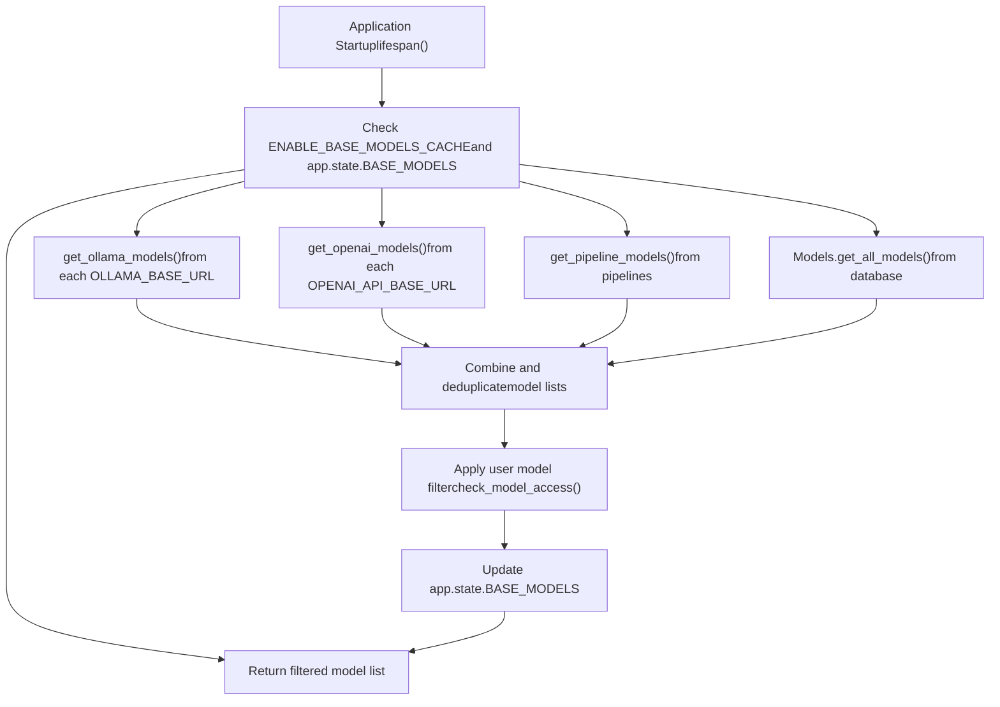
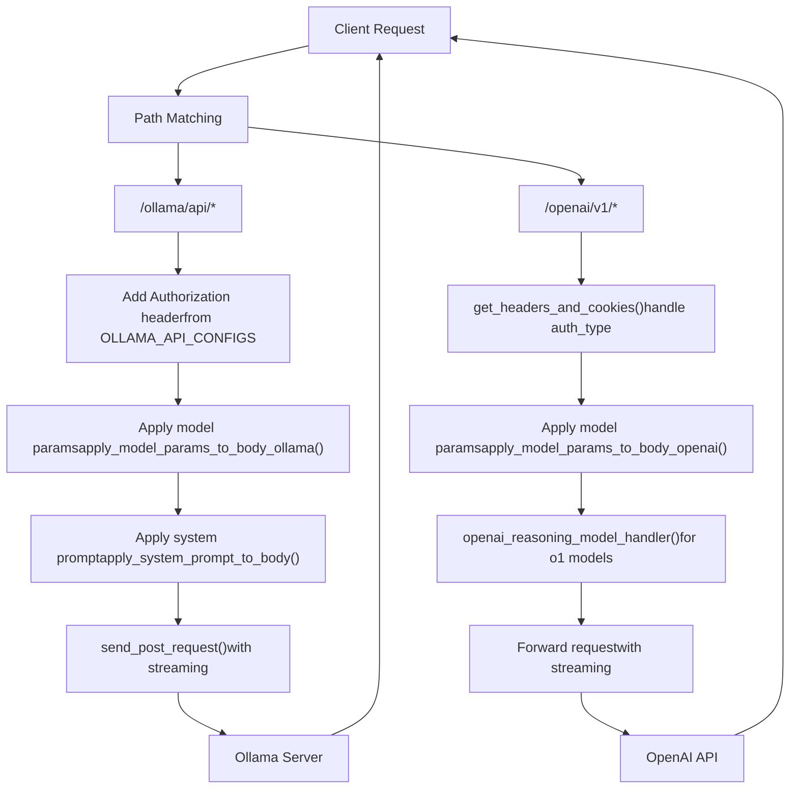
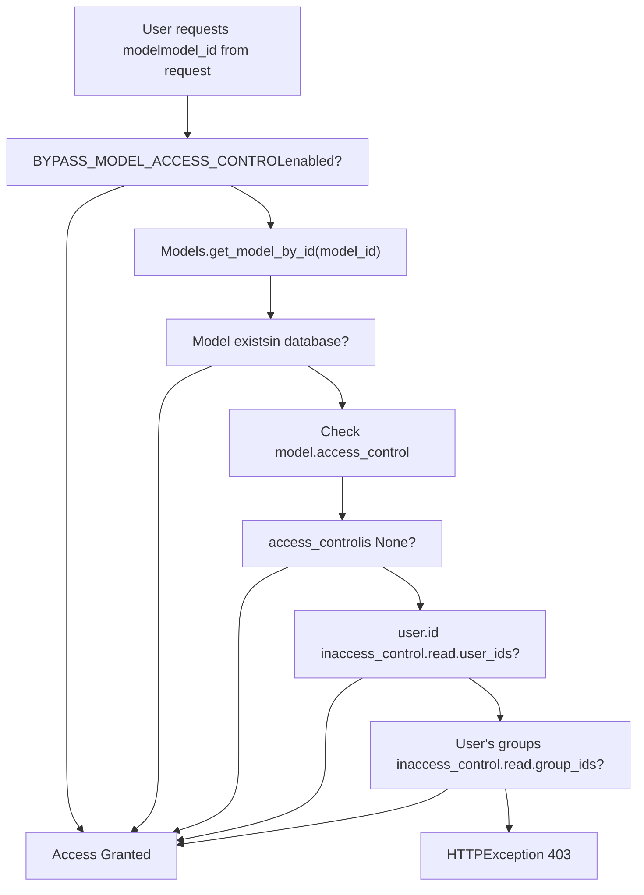
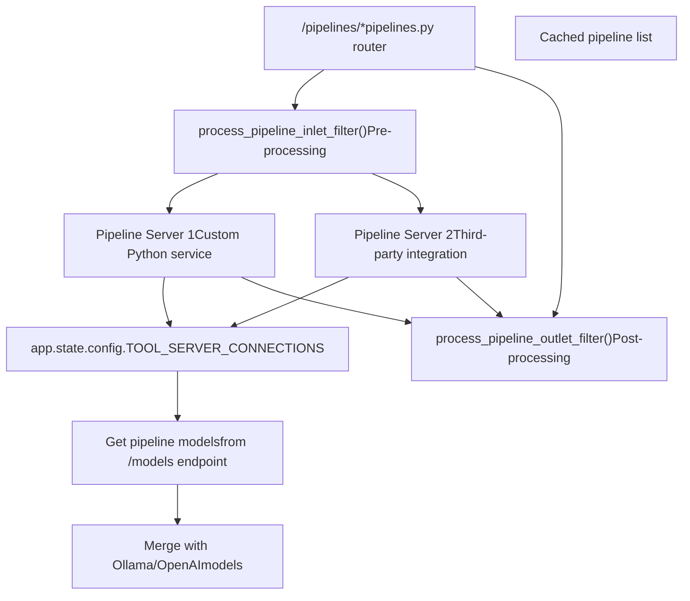
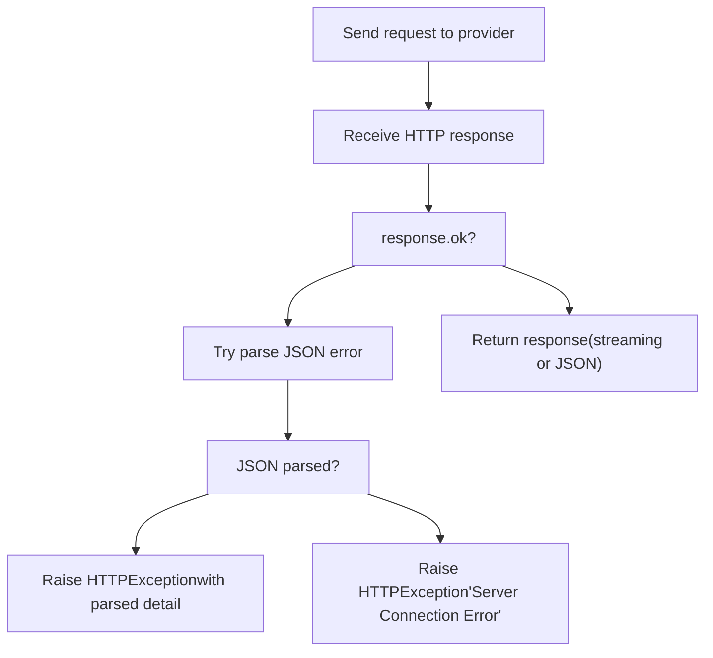
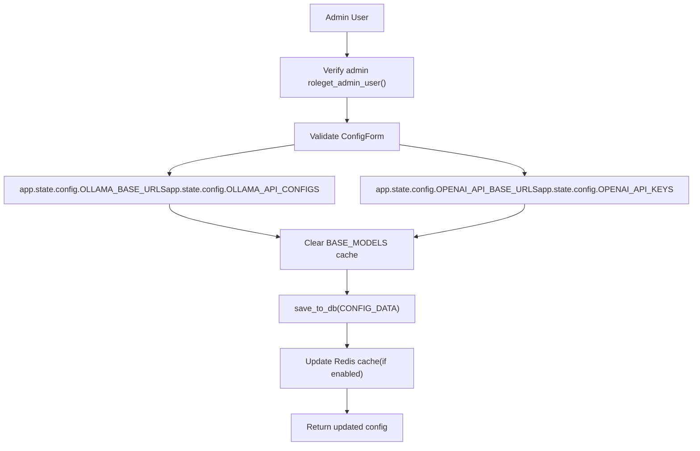

# LLM Provider Integration

Relevant source files

-   [backend/open\_webui/config.py](https://github.com/open-webui/open-webui/blob/a7271532/backend/open_webui/config.py)
-   [backend/open\_webui/env.py](https://github.com/open-webui/open-webui/blob/a7271532/backend/open_webui/env.py)
-   [backend/open\_webui/main.py](https://github.com/open-webui/open-webui/blob/a7271532/backend/open_webui/main.py)
-   [backend/open\_webui/retrieval/loaders/datalab\_marker.py](https://github.com/open-webui/open-webui/blob/a7271532/backend/open_webui/retrieval/loaders/datalab_marker.py)
-   [backend/open\_webui/retrieval/loaders/external\_document.py](https://github.com/open-webui/open-webui/blob/a7271532/backend/open_webui/retrieval/loaders/external_document.py)
-   [backend/open\_webui/retrieval/loaders/external\_web.py](https://github.com/open-webui/open-webui/blob/a7271532/backend/open_webui/retrieval/loaders/external_web.py)
-   [backend/open\_webui/retrieval/loaders/main.py](https://github.com/open-webui/open-webui/blob/a7271532/backend/open_webui/retrieval/loaders/main.py)
-   [backend/open\_webui/retrieval/loaders/mineru.py](https://github.com/open-webui/open-webui/blob/a7271532/backend/open_webui/retrieval/loaders/mineru.py)
-   [backend/open\_webui/retrieval/loaders/mistral.py](https://github.com/open-webui/open-webui/blob/a7271532/backend/open_webui/retrieval/loaders/mistral.py)
-   [backend/open\_webui/retrieval/utils.py](https://github.com/open-webui/open-webui/blob/a7271532/backend/open_webui/retrieval/utils.py)
-   [backend/open\_webui/routers/audio.py](https://github.com/open-webui/open-webui/blob/a7271532/backend/open_webui/routers/audio.py)
-   [backend/open\_webui/routers/auths.py](https://github.com/open-webui/open-webui/blob/a7271532/backend/open_webui/routers/auths.py)
-   [backend/open\_webui/routers/ollama.py](https://github.com/open-webui/open-webui/blob/a7271532/backend/open_webui/routers/ollama.py)
-   [backend/open\_webui/routers/openai.py](https://github.com/open-webui/open-webui/blob/a7271532/backend/open_webui/routers/openai.py)
-   [backend/open\_webui/routers/retrieval.py](https://github.com/open-webui/open-webui/blob/a7271532/backend/open_webui/routers/retrieval.py)
-   [backend/open\_webui/utils/auth.py](https://github.com/open-webui/open-webui/blob/a7271532/backend/open_webui/utils/auth.py)
-   [backend/open\_webui/utils/embeddings.py](https://github.com/open-webui/open-webui/blob/a7271532/backend/open_webui/utils/embeddings.py)
-   [backend/open\_webui/utils/middleware.py](https://github.com/open-webui/open-webui/blob/a7271532/backend/open_webui/utils/middleware.py)
-   [backend/open\_webui/utils/misc.py](https://github.com/open-webui/open-webui/blob/a7271532/backend/open_webui/utils/misc.py)
-   [backend/open\_webui/utils/oauth.py](https://github.com/open-webui/open-webui/blob/a7271532/backend/open_webui/utils/oauth.py)
-   [backend/open\_webui/utils/response.py](https://github.com/open-webui/open-webui/blob/a7271532/backend/open_webui/utils/response.py)
-   [src/lib/apis/retrieval/index.ts](https://github.com/open-webui/open-webui/blob/a7271532/src/lib/apis/retrieval/index.ts)
-   [src/lib/components/admin/Settings/Documents.svelte](https://github.com/open-webui/open-webui/blob/a7271532/src/lib/components/admin/Settings/Documents.svelte)
-   [src/lib/components/admin/Settings/WebSearch.svelte](https://github.com/open-webui/open-webui/blob/a7271532/src/lib/components/admin/Settings/WebSearch.svelte)

## Purpose and Scope

This document describes how Open WebUI integrates with Large Language Model (LLM) providers including Ollama, OpenAI, Azure OpenAI, and other OpenAI-compatible APIs. It covers the proxy architecture, configuration management, model aggregation, authentication mechanisms, and request routing.

For information about the chat processing pipeline that occurs after LLM provider integration, see [Backend Processing Pipeline](/open-webui/open-webui/6-backend-processing-pipeline). For details on authentication and user access control, see [Authentication and Security](/open-webui/open-webui/10-authentication-and-security).

**Sources**: [backend/open\_webui/main.py1-97](https://github.com/open-webui/open-webui/blob/a7271532/backend/open_webui/main.py#L1-L97) [backend/open\_webui/routers/ollama.py1-70](https://github.com/open-webui/open-webui/blob/a7271532/backend/open_webui/routers/ollama.py#L1-L70) [backend/open\_webui/routers/openai.py1-55](https://github.com/open-webui/open-webui/blob/a7271532/backend/open_webui/routers/openai.py#L1-L55)

---

## Architecture Overview

Open WebUI acts as an intelligent proxy that sits between the frontend application and multiple LLM providers. The system supports multiple concurrent providers, each with their own configuration, authentication, and model catalog.

### System Architecture Diagram


**Sources**: [backend/open\_webui/main.py633-639](https://github.com/open-webui/open-webui/blob/a7271532/backend/open_webui/main.py#L633-L639) [backend/open\_webui/main.py70-96](https://github.com/open-webui/open-webui/blob/a7271532/backend/open_webui/main.py#L70-L96) [backend/open\_webui/main.py482-487](https://github.com/open-webui/open-webui/blob/a7271532/backend/open_webui/main.py#L482-L487)

---

## Provider Configuration

Open WebUI supports multiple LLM providers through a flexible configuration system. Each provider can have multiple endpoints configured simultaneously.

### Configuration State Management

The application stores provider configuration in `app.state.config`:

| Configuration Key | Type | Description |
| --- | --- | --- |
| `ENABLE_OLLAMA_API` | `bool` | Enable/disable Ollama integration |
| `OLLAMA_BASE_URLS` | `list[str]` | List of Ollama server URLs |
| `OLLAMA_API_CONFIGS` | `dict` | Per-URL configuration (auth, headers) |
| `ENABLE_OPENAI_API` | `bool` | Enable/disable OpenAI-compatible APIs |
| `OPENAI_API_BASE_URLS` | `list[str]` | List of OpenAI-compatible API URLs |
| `OPENAI_API_KEYS` | `list[str]` | API keys for each URL |
| `OPENAI_API_CONFIGS` | `dict` | Per-URL configuration objects |

**Sources**: [backend/open\_webui/main.py681-698](https://github.com/open-webui/open-webui/blob/a7271532/backend/open_webui/main.py#L681-L698) [backend/open\_webui/config.py113-440](https://github.com/open-webui/open-webui/blob/a7271532/backend/open_webui/config.py#L113-L440)

### Ollama Configuration


The Ollama router at `/ollama/*` provides endpoints for:

-   **Configuration retrieval**: `GET /ollama/config` returns current Ollama settings
-   **Configuration updates**: `POST /ollama/config/update` with `OllamaConfigForm`
-   **Model listing**: `GET /ollama/models` aggregates models from all configured Ollama servers

**Sources**: [backend/open\_webui/routers/ollama.py207-230](https://github.com/open-webui/open-webui/blob/a7271532/backend/open_webui/routers/ollama.py#L207-L230) [backend/open\_webui/routers/ollama.py233-271](https://github.com/open-webui/open-webui/blob/a7271532/backend/open_webui/routers/ollama.py#L233-L271) [backend/open\_webui/main.py681-686](https://github.com/open-webui/open-webui/blob/a7271532/backend/open_webui/main.py#L681-L686)

### OpenAI Configuration

The OpenAI router supports multiple authentication methods through the `OPENAI_API_CONFIGS` dictionary:

```
# Configuration structure per URL
{
    "auth_type": "bearer" | "none" | "session" | "system_oauth" | "azure_ad",
    "headers": {
        "Custom-Header": "value"
    }
}
```
Authentication types:

-   **`bearer`** (default): Uses API key in `Authorization: Bearer <key>` header
-   **`none`**: No authentication
-   **`session`**: Forwards user session cookies
-   **`system_oauth`**: Uses Open WebUI OAuth tokens
-   **`azure_ad` / `microsoft_entra_id`**: Uses Azure AD DefaultAzureCredential

**Sources**: [backend/open\_webui/routers/openai.py118-196](https://github.com/open-webui/open-webui/blob/a7271532/backend/open_webui/routers/openai.py#L118-L196) [backend/open\_webui/routers/openai.py208-230](https://github.com/open-webui/open-webui/blob/a7271532/backend/open_webui/routers/openai.py#L208-L230)

### Configuration Endpoints

Both routers expose admin-only configuration endpoints:

| Endpoint | Method | Purpose |
| --- | --- | --- |
| `/ollama/config` | GET | Retrieve Ollama configuration |
| `/ollama/config/update` | POST | Update Ollama configuration |
| `/openai/config` | GET | Retrieve OpenAI configuration |
| `/openai/config/update` | POST | Update OpenAI configuration |

**Sources**: [backend/open\_webui/routers/ollama.py207-230](https://github.com/open-webui/open-webui/blob/a7271532/backend/open_webui/routers/ollama.py#L207-L230) [backend/open\_webui/routers/openai.py208-230](https://github.com/open-webui/open-webui/blob/a7271532/backend/open_webui/routers/openai.py#L208-L230)

---

## Model Aggregation System

The system aggregates models from multiple sources into a unified catalog with caching for performance optimization.

### Model Aggregation Flow


**Sources**: [backend/open\_webui/main.py606-625](https://github.com/open-webui/open-webui/blob/a7271532/backend/open_webui/main.py#L606-L625) [backend/open\_webui/utils/models.py](https://github.com/open-webui/open-webui/blob/a7271532/backend/open_webui/utils/models.py) (referenced in imports)

### Model Caching Strategy

The system implements a two-tier caching strategy:

1.  **Base Models Cache**: Stored in `app.state.BASE_MODELS`, enabled by `ENABLE_BASE_MODELS_CACHE`

    -   Populated on application startup
    -   Shared across all users
    -   TTL controlled by `MODELS_CACHE_TTL` environment variable
2.  **Provider-Specific Cache**: Stored in `app.state.OLLAMA_MODELS` and `app.state.OPENAI_MODELS`

    -   Per-provider caching using `@cached` decorator
    -   TTL from `MODELS_CACHE_TTL`
    -   Invalidated on configuration updates

**Sources**: [backend/open\_webui/main.py685-698](https://github.com/open-webui/open-webui/blob/a7271532/backend/open_webui/main.py#L685-L698) [backend/open\_webui/main.py732-733](https://github.com/open-webui/open-webui/blob/a7271532/backend/open_webui/main.py#L732-L733) [backend/open\_webui/env.py546-554](https://github.com/open-webui/open-webui/blob/a7271532/backend/open_webui/env.py#L546-L554)

### Ollama Model Fetching

```
# Simplified from ollama.py
async def get_ollama_models(request: Request, url_idx: int = None):
    """Fetch models from Ollama server(s)"""
    if url_idx is None:
        # Fetch from all configured Ollama servers
        for idx, url in enumerate(OLLAMA_BASE_URLS):
            models = await send_get_request(f"{url}/api/tags", key)
            # Process and cache models
    else:
        # Fetch from specific server
        models = await send_get_request(f"{url}/api/tags", key)

    return models
```
The function aggregates models from all Ollama servers configured in `OLLAMA_BASE_URLS`, handling authentication via optional API keys from `OLLAMA_API_CONFIGS`.

**Sources**: [backend/open\_webui/routers/ollama.py233-271](https://github.com/open-webui/open-webui/blob/a7271532/backend/open_webui/routers/ollama.py#L233-L271)

---

## Proxy Architecture

Open WebUI implements a dual-proxy architecture for Ollama and OpenAI-compatible APIs, providing request augmentation, authentication handling, and response streaming.

### Request Routing Architecture


**Sources**: [backend/open\_webui/routers/ollama.py113-188](https://github.com/open-webui/open-webui/blob/a7271532/backend/open_webui/routers/ollama.py#L113-L188) [backend/open\_webui/routers/openai.py118-196](https://github.com/open-webui/open-webui/blob/a7271532/backend/open_webui/routers/openai.py#L118-L196)

### Ollama Proxy Request Handler

The Ollama router provides endpoints that mirror the Ollama API structure:

| Endpoint | Upstream Path | Purpose |
| --- | --- | --- |
| `/ollama/api/chat` | `/api/chat` | Chat completions |
| `/ollama/api/generate` | `/api/generate` | Text generation |
| `/ollama/api/embeddings` | `/api/embeddings` | Generate embeddings |
| `/ollama/api/create` | `/api/create` | Create model from Modelfile |
| `/ollama/api/pull` | `/api/pull` | Pull model from registry |
| `/ollama/api/push` | `/api/push` | Push model to registry |
| `/ollama/api/copy` | `/api/copy` | Copy model |
| `/ollama/api/delete` | `/api/delete` | Delete model |
| `/ollama/api/show` | `/api/show` | Show model info |

The proxy performs several transformations:

1.  **URL Resolution**: Selects Ollama server from `OLLAMA_BASE_URLS` (round-robin for multiple servers)
2.  **Authentication**: Adds `Authorization: Bearer <key>` header if configured
3.  **Payload Augmentation**: Applies model-specific parameters from database
4.  **System Prompt Injection**: Applies system prompts from model configuration
5.  **Header Forwarding**: Optionally forwards user info headers when `ENABLE_FORWARD_USER_INFO_HEADERS` is true

**Sources**: [backend/open\_webui/routers/ollama.py379-463](https://github.com/open-webui/open-webui/blob/a7271532/backend/open_webui/routers/ollama.py#L379-L463) [backend/open\_webui/routers/ollama.py113-188](https://github.com/open-webui/open-webui/blob/a7271532/backend/open_webui/routers/ollama.py#L113-L188)

### OpenAI Proxy Request Handler

The OpenAI router handles multiple authentication schemes through `get_headers_and_cookies()`:

```
async def get_headers_and_cookies(request, url, key, config, metadata, user):
    """Build headers and cookies based on auth_type"""
    auth_type = config.get("auth_type")

    if auth_type == "bearer" or auth_type is None:
        headers["Authorization"] = f"Bearer {key}"
    elif auth_type == "session":
        cookies = request.cookies
    elif auth_type == "system_oauth":
        oauth_token = await get_oauth_token(user.id, session_id)
        headers["Authorization"] = f"Bearer {oauth_token['access_token']}"
    elif auth_type in ("azure_ad", "microsoft_entra_id"):
        token = get_microsoft_entra_id_access_token()
        headers["Authorization"] = f"Bearer {token}"
```
**Special handling for reasoning models** (o1-mini, o1-preview, o1):

-   Converts `max_tokens` to `max_completion_tokens`
-   Converts `system` role to `user` (legacy) or `developer` (current)

**Sources**: [backend/open\_webui/routers/openai.py118-196](https://github.com/open-webui/open-webui/blob/a7271532/backend/open_webui/routers/openai.py#L118-L196) [backend/open\_webui/routers/openai.py97-115](https://github.com/open-webui/open-webui/blob/a7271532/backend/open_webui/routers/openai.py#L97-L115)

### Streaming Response Handling

Both proxies support streaming responses through `StreamingResponse`:

> **[Mermaid sequence]**
> *(图表结构无法解析)*

The proxy uses `BackgroundTask` to ensure proper cleanup of `aiohttp.ClientSession` and response objects after streaming completes.

**Sources**: [backend/open\_webui/routers/ollama.py161-178](https://github.com/open-webui/open-webui/blob/a7271532/backend/open_webui/routers/ollama.py#L161-L178) [backend/open\_webui/routers/openai.py87-95](https://github.com/open-webui/open-webui/blob/a7271532/backend/open_webui/routers/openai.py#L87-L95)

---

## Model Access Control

Open WebUI implements per-model and per-user access control through a flexible permissions system.

### Access Control Flow


**Sources**: [backend/open\_webui/utils/models.py](https://github.com/open-webui/open-webui/blob/a7271532/backend/open_webui/utils/models.py) (referenced), [backend/open\_webui/env.py438-440](https://github.com/open-webui/open-webui/blob/a7271532/backend/open_webui/env.py#L438-L440)

### Model Database Schema

Models stored in the database include access control metadata:

```
# Simplified from Models table
class Model:
    id: str  # Model identifier
    user_id: str  # Owner user ID
    base_model_id: str  # Reference to base model
    name: str
    params: dict  # Model-specific parameters
    access_control: dict  # Access control configuration
    # Structure: {
    #   "read": {
    #     "user_ids": ["user1", "user2"],
    #     "group_ids": ["group1"]
    #   }
    # }
```
The `BYPASS_MODEL_ACCESS_CONTROL` environment variable disables all access checks when set to `true`, useful for development or single-user deployments.

**Sources**: [backend/open\_webui/models/models.py](https://github.com/open-webui/open-webui/blob/a7271532/backend/open_webui/models/models.py) (referenced in imports)

---

## Pipeline System

The Pipeline system provides a plugin architecture for custom model integrations and transformations that don't fit standard OpenAI/Ollama patterns.

### Pipeline Architecture


**Sources**: [backend/open\_webui/main.py705-707](https://github.com/open-webui/open-webui/blob/a7271532/backend/open_webui/main.py#L705-L707) [backend/open\_webui/routers/pipelines.py](https://github.com/open-webui/open-webui/blob/a7271532/backend/open_webui/routers/pipelines.py) (referenced)

### Pipeline Configuration

Pipelines are configured via `TOOL_SERVER_CONNECTIONS` environment variable:

```
[
  {
    "url": "http://localhost:9000",
    "api_key": "optional_api_key"
  }
]
```
Each pipeline server must implement the Pipeline API specification:

-   `GET /models` - Return list of models provided by the pipeline
-   `POST /inlet` - Pre-process requests before sending to LLM
-   `POST /outlet` - Post-process responses from LLM

**Sources**: [backend/open\_webui/main.py705-707](https://github.com/open-webui/open-webui/blob/a7271532/backend/open_webui/main.py#L705-L707) [backend/open\_webui/utils/middleware.py54-56](https://github.com/open-webui/open-webui/blob/a7271532/backend/open_webui/utils/middleware.py#L54-L56)

### Inlet and Outlet Filters

Pipelines can transform requests and responses through filter functions:

> **[Mermaid sequence]**
> *(图表结构无法解析)*

**Sources**: [backend/open\_webui/routers/pipelines.py](https://github.com/open-webui/open-webui/blob/a7271532/backend/open_webui/routers/pipelines.py) (referenced), [backend/open\_webui/utils/middleware.py54-56](https://github.com/open-webui/open-webui/blob/a7271532/backend/open_webui/utils/middleware.py#L54-L56)

---

## Request Headers and User Context

Open WebUI supports forwarding user information to upstream providers when `ENABLE_FORWARD_USER_INFO_HEADERS` is enabled.

### User Info Header Forwarding

The `include_user_info_headers()` function adds user context to requests:

```
def include_user_info_headers(headers: dict, user: UserModel) -> dict:
    """Add user context headers for upstream providers"""
    headers["X-OpenWebUI-User-Id"] = user.id
    headers["X-OpenWebUI-User-Name"] = user.name
    headers["X-OpenWebUI-User-Email"] = user.email
    headers["X-OpenWebUI-User-Role"] = user.role
    # Chat-specific headers added when available:
    # headers["X-OpenWebUI-Chat-Id"] = chat_id
    return headers
```
This enables upstream providers or pipeline servers to:

-   Implement per-user quotas or rate limiting
-   Log user activity
-   Provide personalized responses
-   Enforce their own access controls

**Sources**: [backend/open\_webui/utils/headers.py2-10](https://github.com/open-webui/open-webui/blob/a7271532/backend/open_webui/utils/headers.py#L2-L10) (file referenced in imports), [backend/open\_webui/routers/ollama.py88-90](https://github.com/open-webui/open-webui/blob/a7271532/backend/open_webui/routers/ollama.py#L88-L90) [backend/open\_webui/routers/openai.py139-142](https://github.com/open-webui/open-webui/blob/a7271532/backend/open_webui/routers/openai.py#L139-L142)

---

## Load Balancing and Failover

When multiple URLs are configured for a provider, Open WebUI implements basic load distribution.

### Simple Round-Robin Selection

Currently, the system uses `random.choice()` for selecting among multiple backend URLs:

```
# From ollama.py - simplified
def get_ollama_url(url_idx: Optional[int] = None):
    if url_idx is None:
        # Random selection from available URLs
        urls = app.state.config.OLLAMA_BASE_URLS
        return random.choice(urls)
    else:
        return urls[url_idx]
```
**Note**: The codebase includes a TODO comment indicating plans for more sophisticated load balancing:

> "TODO: Implement a more intelligent load balancing mechanism for distributing requests among multiple backend instances. Current implementation uses a simple round-robin approach (random.choice). Consider incorporating algorithms like weighted round-robin, least connections, or least response time for better resource utilization and performance optimization."

**Sources**: [backend/open\_webui/routers/ollama.py1-3](https://github.com/open-webui/open-webui/blob/a7271532/backend/open_webui/routers/ollama.py#L1-L3)

---

## Error Handling and Retries

The proxy layer implements comprehensive error handling for upstream provider failures.

### Error Response Processing


The error handling extracts error details from provider responses when possible:

```
# Simplified from ollama.py
if r.ok is False:
    try:
        res = await r.json()
        if "error" in res:
            raise HTTPException(status_code=r.status, detail=res["error"])
    except HTTPException as e:
        raise e
    except Exception as e:
        raise HTTPException(
            status_code=r.status,
            detail="Open WebUI: Server Connection Error"
        )
```
**Sources**: [backend/open\_webui/routers/ollama.py146-159](https://github.com/open-webui/open-webui/blob/a7271532/backend/open_webui/routers/ollama.py#L146-L159)

---

## Configuration Persistence

Provider configurations can be updated at runtime and are persisted through the `AppConfig` system.

### Configuration Update Flow


The `AppConfig` class (see [Configuration Management](/open-webui/open-webui/11-configuration-management)) provides a Redis-backed caching layer for configuration values, ensuring consistency across multiple backend instances in distributed deployments.

**Sources**: [backend/open\_webui/routers/ollama.py224-230](https://github.com/open-webui/open-webui/blob/a7271532/backend/open_webui/routers/ollama.py#L224-L230) [backend/open\_webui/routers/openai.py224-230](https://github.com/open-webui/open-webui/blob/a7271532/backend/open_webui/routers/openai.py#L224-L230) [backend/open\_webui/config.py224-284](https://github.com/open-webui/open-webui/blob/a7271532/backend/open_webui/config.py#L224-L284)

---

## Integration with Chat Middleware

LLM provider integration is the final step in the chat processing pipeline, occurring after all middleware transformations.

### Chat Request Processing Flow

> **[Mermaid sequence]**
> *(图表结构无法解析)*

For detailed information about the middleware pipeline, see [Backend Processing Pipeline](/open-webui/open-webui/6-backend-processing-pipeline).

**Sources**: [backend/open\_webui/utils/chat.py](https://github.com/open-webui/open-webui/blob/a7271532/backend/open_webui/utils/chat.py) (referenced), [backend/open\_webui/utils/middleware.py494](https://github.com/open-webui/open-webui/blob/a7271532/backend/open_webui/utils/middleware.py#L494-L494)

---

## Code Reference Summary

### Key Files and Their Roles

| File Path | Primary Responsibilities |
| --- | --- |
| `backend/open_webui/main.py` | Application initialization, router registration, provider state management |
| `backend/open_webui/routers/ollama.py` | Ollama API proxy, model listing, request forwarding |
| `backend/open_webui/routers/openai.py` | OpenAI API proxy, authentication handling, streaming |
| `backend/open_webui/config.py` | Configuration persistence, AppConfig class, Redis caching |
| `backend/open_webui/env.py` | Environment variable loading, validation |
| `backend/open_webui/utils/models.py` | Model aggregation, access control, filtering |
| `backend/open_webui/utils/payload.py` | Request payload transformation for different providers |
| `backend/open_webui/routers/pipelines.py` | Pipeline plugin system, inlet/outlet filters |

**Sources**: [backend/open\_webui/main.py1-1000](https://github.com/open-webui/open-webui/blob/a7271532/backend/open_webui/main.py#L1-L1000) [backend/open\_webui/routers/ollama.py1-700](https://github.com/open-webui/open-webui/blob/a7271532/backend/open_webui/routers/ollama.py#L1-L700) [backend/open\_webui/routers/openai.py1-500](https://github.com/open-webui/open-webui/blob/a7271532/backend/open_webui/routers/openai.py#L1-L500)
