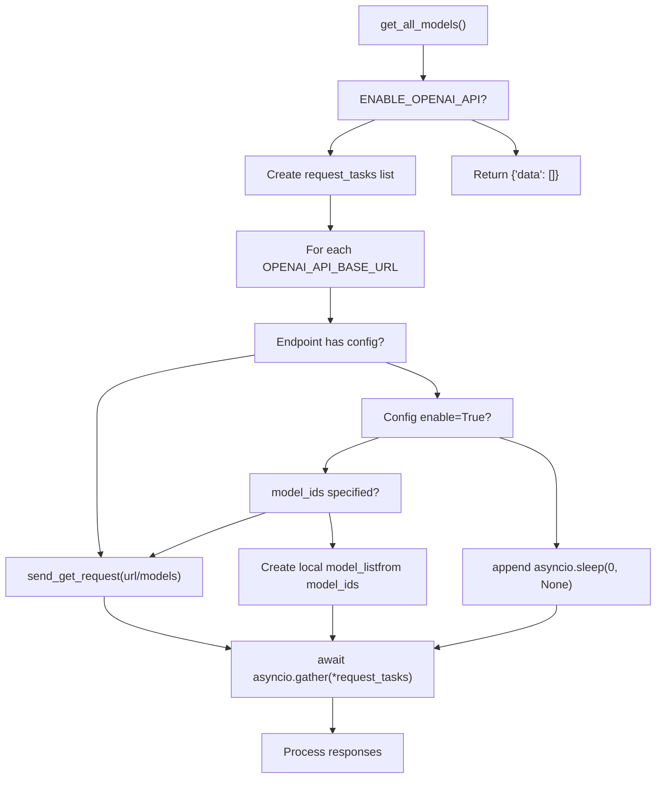
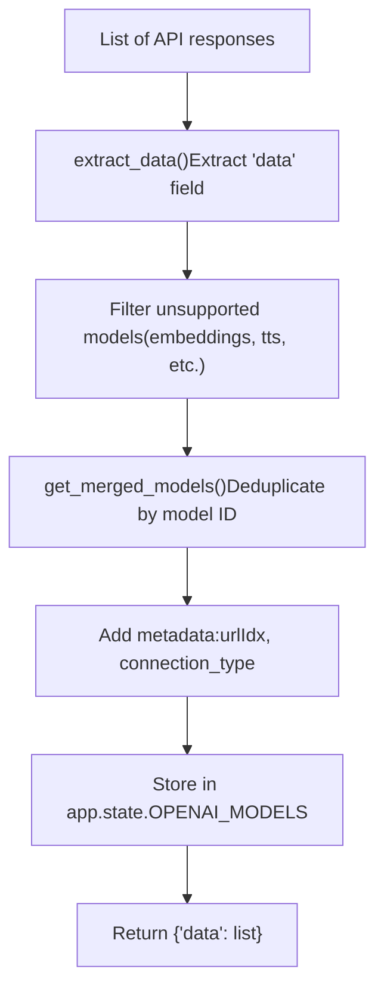
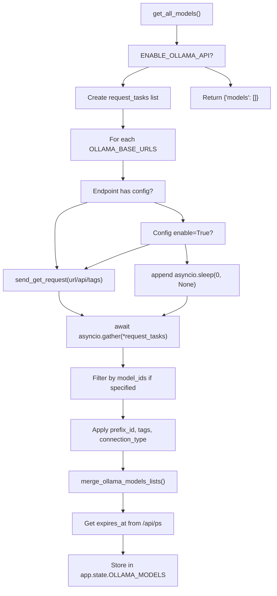
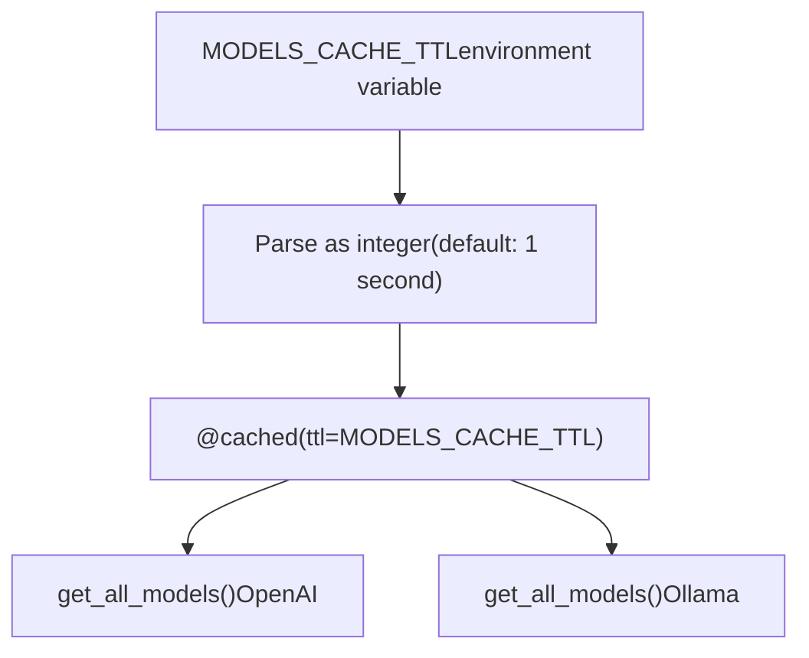
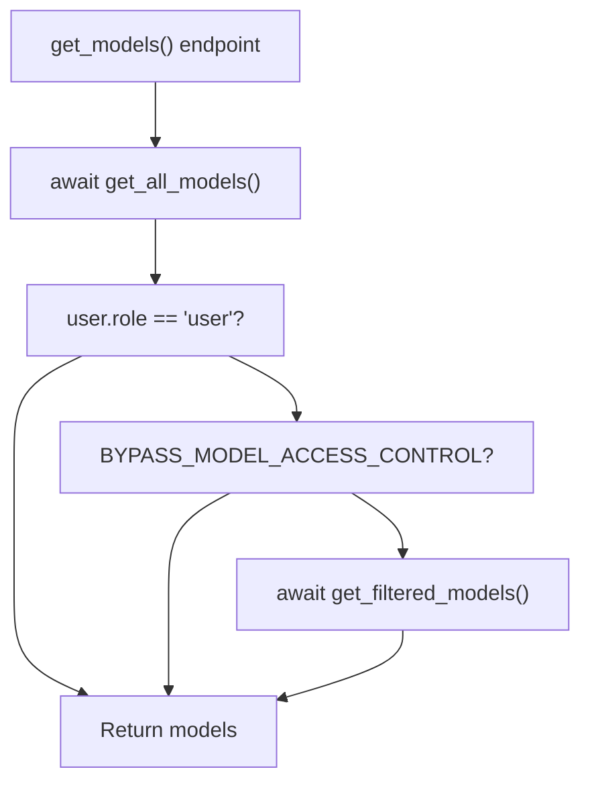
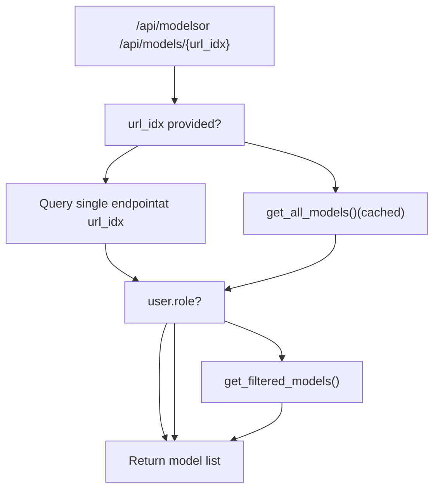

# Model Aggregation

Relevant source files

-   [backend/open\_webui/env.py](https://github.com/open-webui/open-webui/blob/a7271532/backend/open_webui/env.py)
-   [backend/open\_webui/routers/audio.py](https://github.com/open-webui/open-webui/blob/a7271532/backend/open_webui/routers/audio.py)
-   [backend/open\_webui/routers/auths.py](https://github.com/open-webui/open-webui/blob/a7271532/backend/open_webui/routers/auths.py)
-   [backend/open\_webui/routers/ollama.py](https://github.com/open-webui/open-webui/blob/a7271532/backend/open_webui/routers/ollama.py)
-   [backend/open\_webui/routers/openai.py](https://github.com/open-webui/open-webui/blob/a7271532/backend/open_webui/routers/openai.py)
-   [backend/open\_webui/utils/auth.py](https://github.com/open-webui/open-webui/blob/a7271532/backend/open_webui/utils/auth.py)
-   [backend/open\_webui/utils/embeddings.py](https://github.com/open-webui/open-webui/blob/a7271532/backend/open_webui/utils/embeddings.py)
-   [backend/open\_webui/utils/misc.py](https://github.com/open-webui/open-webui/blob/a7271532/backend/open_webui/utils/misc.py)
-   [backend/open\_webui/utils/oauth.py](https://github.com/open-webui/open-webui/blob/a7271532/backend/open_webui/utils/oauth.py)
-   [backend/open\_webui/utils/response.py](https://github.com/open-webui/open-webui/blob/a7271532/backend/open_webui/utils/response.py)

## Purpose and Scope

This document describes the Model Aggregation system in Open WebUI, which queries multiple LLM backend endpoints (both OpenAI-compatible APIs and Ollama instances), merges their model catalogs into a unified list, and presents them to users with appropriate access control filtering. This system enables Open WebUI to act as a unified interface for models from diverse sources.

For information about how individual models are managed and configured, see [Model Access Control](/open-webui/open-webui/13.4-model-access-control). For details on how the backend proxies requests to specific models, see [OpenAI Integration](/open-webui/open-webui/13.3-openai-integration) and [Ollama Integration](/open-webui/open-webui/13.2-ollama-integration).

## System Overview

The Model Aggregation system performs the following functions:

1.  **Parallel Querying**: Sends concurrent requests to all configured backend endpoints
2.  **Response Processing**: Extracts and normalizes model metadata from each backend
3.  **Merging**: Combines model lists, handling duplicates and applying configurations
4.  **Caching**: Stores aggregated results with TTL-based expiration
5.  **Filtering**: Applies user-specific access control before returning results

The aggregation occurs separately for OpenAI-compatible endpoints and Ollama endpoints, with results stored in distinct application state variables.

Sources: [backend/open\_webui/routers/openai.py343-536](https://github.com/open-webui/open-webui/blob/a7271532/backend/open_webui/routers/openai.py#L343-L536) [backend/open\_webui/routers/ollama.py306-421](https://github.com/open-webui/open-webui/blob/a7271532/backend/open_webui/routers/ollama.py#L306-L421)

## Configuration Structure

### Backend Endpoint Configuration

Both OpenAI and Ollama backends maintain lists of base URLs and corresponding configuration objects:

| Configuration Key | OpenAI | Ollama | Purpose |
| --- | --- | --- | --- |
| Base URLs | `OPENAI_API_BASE_URLS` | `OLLAMA_BASE_URLS` | List of endpoint URLs |
| API Keys | `OPENAI_API_KEYS` | N/A (in configs) | Authentication keys per endpoint |
| Configs | `OPENAI_API_CONFIGS` | `OLLAMA_API_CONFIGS` | Per-endpoint configuration dict |

### Per-Endpoint Configuration Options

Each endpoint in `*_API_CONFIGS` is keyed by its index (as string) or legacy URL and supports:

```
{
    "enable": bool,           # Whether to query this endpoint
    "key": str,               # API key (Ollama only, OpenAI uses separate list)
    "model_ids": list[str],   # Filter: only include these models
    "prefix_id": str,         # Prepend to all model IDs from this endpoint
    "tags": list[str],        # Tags to add to all models
    "connection_type": str,   # "local", "external", etc.
    "auth_type": str,         # Authentication method
    "azure": bool,            # Azure-specific handling
}
```
Sources: [backend/open\_webui/routers/openai.py207-265](https://github.com/open-webui/open-webui/blob/a7271532/backend/open_webui/routers/openai.py#L207-L265) [backend/open\_webui/routers/ollama.py267-303](https://github.com/open-webui/open-webui/blob/a7271532/backend/open_webui/routers/ollama.py#L267-L303)

## OpenAI Model Aggregation

### Request Dispatch


**Sources:** [backend/open\_webui/routers/openai.py343-413](https://github.com/open-webui/open-webui/blob/a7271532/backend/open_webui/routers/openai.py#L343-L413)

The `get_all_models_responses()` function at [backend/open\_webui/routers/openai.py343-453](https://github.com/open-webui/open-webui/blob/a7271532/backend/open_webui/routers/openai.py#L343-L453) orchestrates parallel requests:

1.  **Task Creation**: For each configured URL, creates either:

    -   A `send_get_request()` task for enabled endpoints without explicit `model_ids`
    -   A pre-built model list for endpoints with explicit `model_ids`
    -   A no-op sleep task for disabled endpoints
2.  **Parallel Execution**: Uses `asyncio.gather()` to execute all tasks concurrently with timeout from `AIOHTTP_CLIENT_TIMEOUT_MODEL_LIST`

3.  **Post-Processing**: Applies endpoint-specific configuration (prefix\_id, tags, connection\_type) to each model in the response


### Model Merging and Deduplication


**Sources:** [backend/open\_webui/routers/openai.py473-536](https://github.com/open-webui/open-webui/blob/a7271532/backend/open_webui/routers/openai.py#L473-L536)

The merging logic at [backend/open\_webui/routers/openai.py503-530](https://github.com/open-webui/open-webui/blob/a7271532/backend/open_webui/routers/openai.py#L503-L530):

1.  **Extraction**: Extracts `data` array from each response or handles list responses directly
2.  **Filtering**: For `api.openai.com` endpoints, filters out models containing "babbage", "dall-e", "davinci", "embedding", "tts", or "whisper"
3.  **Deduplication**: Maintains a dict keyed by model ID; first occurrence wins
4.  **Metadata Addition**: Adds `urlIdx` (endpoint index), `connection_type`, `owned_by: "openai"`, and preserves original response in `openai` field

### Caching

The `get_all_models()` function uses the `@cached()` decorator:

```
@cached(
    ttl=MODELS_CACHE_TTL,
    key=lambda _, user: f"openai_all_models_{user.id}" if user else "openai_all_models",
)
async def get_all_models(request: Request, user: UserModel) -> dict[str, list]:
```
-   **TTL**: Configured via `MODELS_CACHE_TTL` environment variable (default 1 second)
-   **Cache Key**: Per-user to support user-specific filtering
-   **Backend**: Uses `aiocache` library

Sources: [backend/open\_webui/routers/openai.py469-472](https://github.com/open-webui/open-webui/blob/a7271532/backend/open_webui/routers/openai.py#L469-L472) [backend/open\_webui/env.py546-553](https://github.com/open-webui/open-webui/blob/a7271532/backend/open_webui/env.py#L546-L553)

## Ollama Model Aggregation

### Request Dispatch

The Ollama aggregation follows a similar pattern to OpenAI but with Ollama-specific endpoints:


**Sources:** [backend/open\_webui/routers/ollama.py323-421](https://github.com/open-webui/open-webui/blob/a7271532/backend/open_webui/routers/ollama.py#L323-L421)

Key differences from OpenAI aggregation:

1.  **Endpoint**: Queries `/api/tags` instead of `/models`
2.  **Model Filtering**: Applies `model_ids` filter server-side at [backend/open\_webui/routers/ollama.py372-378](https://github.com/open-webui/open-webui/blob/a7271532/backend/open_webui/routers/ollama.py#L372-L378)
3.  **Loaded Models**: Queries `/api/ps` to get `expires_at` timestamps for loaded models at [backend/open\_webui/routers/ollama.py399-413](https://github.com/open-webui/open-webui/blob/a7271532/backend/open_webui/routers/ollama.py#L399-L413)

### Ollama-Specific Merging

```
def merge_ollama_models_lists(model_lists):
    merged_models = {}
    for idx, model_list in enumerate(model_lists):
        if model_list is not None:
            for model in model_list:
                id = model.get("model")
                if id is not None:
                    if id not in merged_models:
                        model["urls"] = [idx]
                        merged_models[id] = model
                    else:
                        merged_models[id]["urls"].append(idx)
    return list(merged_models.values())
```
Unlike OpenAI (where first occurrence wins), Ollama tracking maintains a `urls` list indicating which backend indices serve each model. This enables load balancing across multiple Ollama instances.

Sources: [backend/open\_webui/routers/ollama.py306-320](https://github.com/open-webui/open-webui/blob/a7271532/backend/open_webui/routers/ollama.py#L306-L320)

## Caching Mechanism

### Cache Configuration


**Sources:** [backend/open\_webui/env.py546-553](https://github.com/open-webui/open-webui/blob/a7271532/backend/open_webui/env.py#L546-L553)

The `MODELS_CACHE_TTL` environment variable controls cache duration:

-   **Value**: Integer seconds, or empty string for no caching
-   **Default**: 1 second
-   **Per-User**: Cache keys include user ID to support user-specific filtering
-   **Implementation**: `aiocache` library with in-memory backend

### Cache Invalidation

Cache entries automatically expire after TTL. Manual invalidation occurs when:

-   Backend configuration changes (URLs, API keys, configs updated)
-   User permissions change (handled by per-user cache keys)

Sources: [backend/open\_webui/routers/openai.py469-472](https://github.com/open-webui/open-webui/blob/a7271532/backend/open_webui/routers/openai.py#L469-L472) [backend/open\_webui/routers/ollama.py323-326](https://github.com/open-webui/open-webui/blob/a7271532/backend/open_webui/routers/ollama.py#L323-L326)

## Access Control and Filtering

### User-Level Filtering


**Sources:** [backend/open\_webui/routers/openai.py539-625](https://github.com/open-webui/open-webui/blob/a7271532/backend/open_webui/routers/openai.py#L539-L625) [backend/open\_webui/routers/ollama.py437-487](https://github.com/open-webui/open-webui/blob/a7271532/backend/open_webui/routers/ollama.py#L437-L487)

The `get_filtered_models()` function at [backend/open\_webui/routers/openai.py456-466](https://github.com/open-webui/open-webui/blob/a7271532/backend/open_webui/routers/openai.py#L456-L466) and [backend/open\_webui/routers/ollama.py424-434](https://github.com/open-webui/open-webui/blob/a7271532/backend/open_webui/routers/ollama.py#L424-L434):

1.  **Iterates** through all models in the aggregated list
2.  **Queries** the `Models` database table for each model ID
3.  **Checks** if user is the model owner OR has read access via `has_access()`
4.  **Returns** only models passing the access check

The `BYPASS_MODEL_ACCESS_CONTROL` environment variable at [backend/open\_webui/env.py438-440](https://github.com/open-webui/open-webui/blob/a7271532/backend/open_webui/env.py#L438-L440) disables this filtering entirely.

### Model Database Integration

```
model_info = Models.get_model_by_id(model["id"])
if model_info:
    if user.id == model_info.user_id or has_access(
        user.id, type="read", access_control=model_info.access_control
    ):
        filtered_models.append(model)
```
Models not found in the database are excluded from results. This allows administrators to control model visibility through the Models management interface.

Sources: [backend/open\_webui/routers/openai.py456-466](https://github.com/open-webui/open-webui/blob/a7271532/backend/open_webui/routers/openai.py#L456-L466) [backend/open\_webui/utils/access\_control.py](https://github.com/open-webui/open-webui/blob/a7271532/backend/open_webui/utils/access_control.py)

## Model Storage and State

### Application State Variables

Aggregated models are stored in FastAPI application state:

| State Variable | Type | Populated By | Format |
| --- | --- | --- | --- |
| `app.state.OPENAI_MODELS` | `dict` | `get_all_models()` (OpenAI) | `{model_id: model_dict}` |
| `app.state.OLLAMA_MODELS` | `dict` | `get_all_models()` (Ollama) | `{model_id: model_dict}` |
| `app.state.MODELS` | `dict` | Combined by router | `{model_id: model_dict}` |

The aggregation functions populate these at:

-   [backend/open\_webui/routers/openai.py535](https://github.com/open-webui/open-webui/blob/a7271532/backend/open_webui/routers/openai.py#L535-L535) - `request.app.state.OPENAI_MODELS = models`
-   [backend/open\_webui/routers/ollama.py418-420](https://github.com/open-webui/open-webui/blob/a7271532/backend/open_webui/routers/ollama.py#L418-L420) - `request.app.state.OLLAMA_MODELS = {...}`

### Model Object Structure

**OpenAI Model:**

```
{
  "id": "gpt-4",
  "name": "gpt-4",
  "owned_by": "openai",
  "openai": { /* original response */ },
  "connection_type": "external",
  "urlIdx": 0,
  "tags": ["production"]
}
```
**Ollama Model:**

```
{
  "model": "llama2",
  "name": "llama2",
  "urls": [0, 1],
  "connection_type": "local",
  "tags": ["local"],
  "expires_at": 1704657600
}
```
Sources: [backend/open\_webui/routers/openai.py521-528](https://github.com/open-webui/open-webui/blob/a7271532/backend/open_webui/routers/openai.py#L521-L528) [backend/open\_webui/routers/ollama.py306-320](https://github.com/open-webui/open-webui/blob/a7271532/backend/open_webui/routers/ollama.py#L306-L320)

## Request Flow

### Complete Aggregation Flow

> **[Mermaid sequence]**
> *(图表结构无法解析)*

**Sources:** [backend/open\_webui/routers/openai.py539-625](https://github.com/open-webui/open-webui/blob/a7271532/backend/open_webui/routers/openai.py#L539-L625) [backend/open\_webui/routers/ollama.py437-487](https://github.com/open-webui/open-webui/blob/a7271532/backend/open_webui/routers/ollama.py#L437-L487)

### Endpoint-Specific Request Flow


**Sources:** [backend/open\_webui/routers/openai.py539-625](https://github.com/open-webui/open-webui/blob/a7271532/backend/open_webui/routers/openai.py#L539-L625) [backend/open\_webui/routers/ollama.py437-487](https://github.com/open-webui/open-webui/blob/a7271532/backend/open_webui/routers/ollama.py#L437-L487)

When `url_idx` is provided, the system queries only that specific backend endpoint, bypassing aggregation and caching. This is used for testing individual endpoint connectivity and retrieving endpoint-specific model metadata.

## Configuration Updates

### Dynamic Configuration

Backend configurations can be updated at runtime via admin endpoints:

**OpenAI:** `POST /api/openai/config/update` at [backend/open\_webui/routers/openai.py224-265](https://github.com/open-webui/open-webui/blob/a7271532/backend/open_webui/routers/openai.py#L224-L265) **Ollama:** `POST /api/ollama/config/update` at [backend/open\_webui/routers/ollama.py282-303](https://github.com/open-webui/open-webui/blob/a7271532/backend/open_webui/routers/ollama.py#L282-L303)

Updates persist to the application's configuration system and take effect immediately for new requests. Cached model lists continue to serve until TTL expiration.

### Endpoint Verification

Before adding or updating endpoints, administrators can verify connectivity:

**OpenAI:** `POST /api/openai/verify` at [backend/open\_webui/routers/openai.py635-691](https://github.com/open-webui/open-webui/blob/a7271532/backend/open_webui/routers/openai.py#L635-L691) **Ollama:** `POST /api/ollama/verify` at [backend/open\_webui/routers/ollama.py222-264](https://github.com/open-webui/open-webui/blob/a7271532/backend/open_webui/routers/ollama.py#L222-L264)

These endpoints test authentication and connectivity without modifying configuration.

Sources: [backend/open\_webui/routers/openai.py635-691](https://github.com/open-webui/open-webui/blob/a7271532/backend/open_webui/routers/openai.py#L635-L691) [backend/open\_webui/routers/ollama.py222-264](https://github.com/open-webui/open-webui/blob/a7271532/backend/open_webui/routers/ollama.py#L222-L264)

## Performance Considerations

### Concurrent Request Handling

```
request_tasks = []
for idx, url in enumerate(config.OPENAI_API_BASE_URLS):
    request_tasks.append(send_get_request(f"{url}/models", key))

responses = await asyncio.gather(*request_tasks)
```
The system uses `asyncio.gather()` to issue all backend requests concurrently, minimizing total latency. With 10 backends, this reduces aggregation time from sequential sum to the slowest single response time.

### Timeout Configuration

-   **Model List Requests**: `AIOHTTP_CLIENT_TIMEOUT_MODEL_LIST` (default 10s) at [backend/open\_webui/env.py685-696](https://github.com/open-webui/open-webui/blob/a7271532/backend/open_webui/env.py#L685-L696)
-   **General Requests**: `AIOHTTP_CLIENT_TIMEOUT` (default 300s) at [backend/open\_webui/env.py670-678](https://github.com/open-webui/open-webui/blob/a7271532/backend/open_webui/env.py#L670-L678)

Failed or timed-out requests return `None` and are filtered out during merging.

### Cache Optimization

Setting `MODELS_CACHE_TTL` to a higher value (e.g., 60 seconds) reduces backend load at the cost of delayed propagation of model changes. For production deployments with stable model catalogs, values of 30-300 seconds are recommended.

Sources: [backend/open\_webui/env.py546-553](https://github.com/open-webui/open-webui/blob/a7271532/backend/open_webui/env.py#L546-L553) [backend/open\_webui/env.py685-696](https://github.com/open-webui/open-webui/blob/a7271532/backend/open_webui/env.py#L685-L696)
