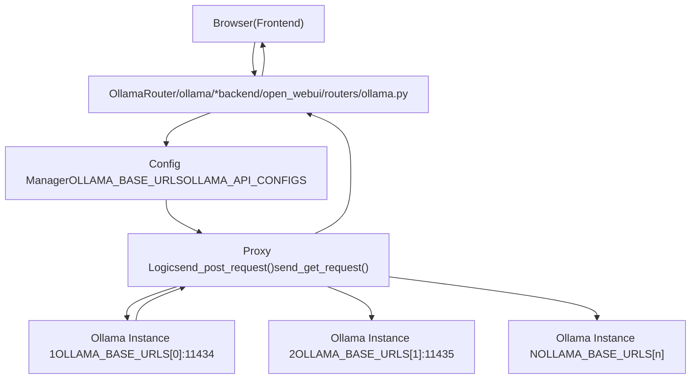
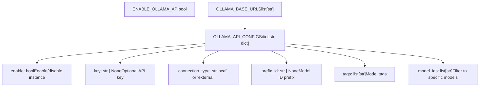
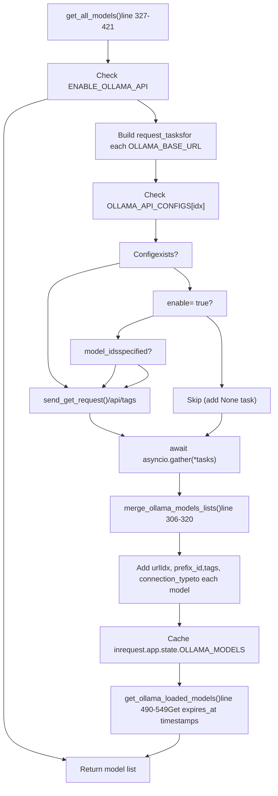
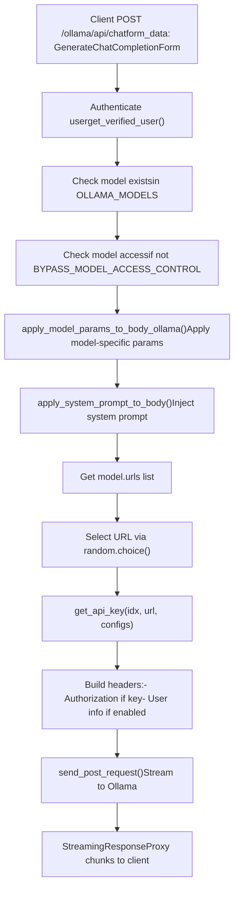
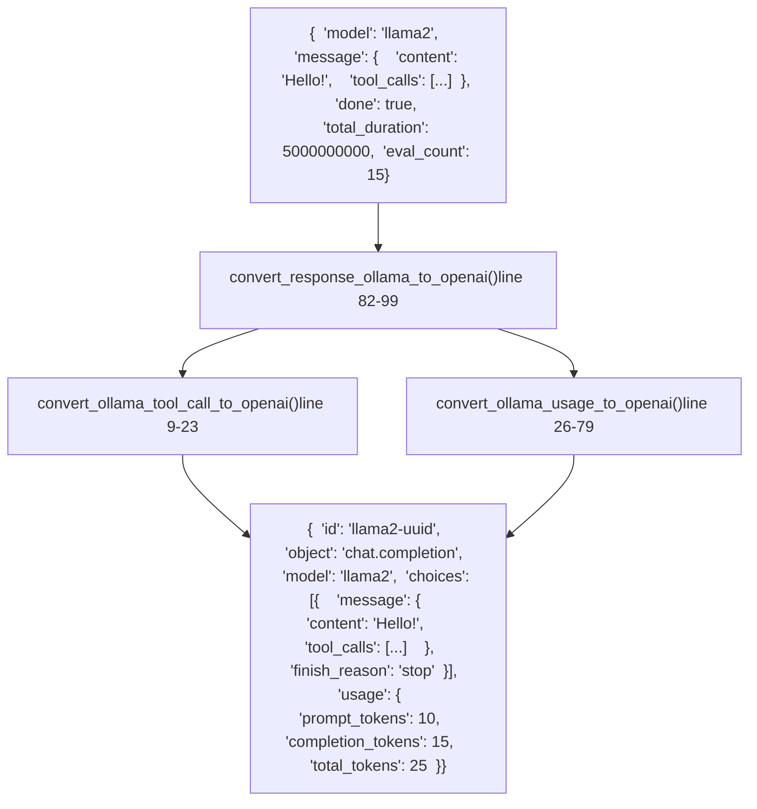
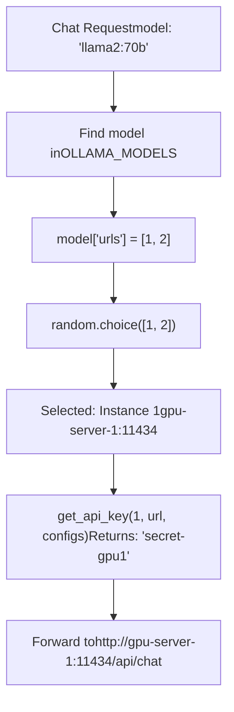

# Ollama Integration

Relevant source files

-   [LICENSE](https://github.com/open-webui/open-webui/blob/a7271532/LICENSE)
-   [README.md](https://github.com/open-webui/open-webui/blob/a7271532/README.md)
-   [TROUBLESHOOTING.md](https://github.com/open-webui/open-webui/blob/a7271532/TROUBLESHOOTING.md)
-   [backend/open\_webui/env.py](https://github.com/open-webui/open-webui/blob/a7271532/backend/open_webui/env.py)
-   [backend/open\_webui/routers/audio.py](https://github.com/open-webui/open-webui/blob/a7271532/backend/open_webui/routers/audio.py)
-   [backend/open\_webui/routers/auths.py](https://github.com/open-webui/open-webui/blob/a7271532/backend/open_webui/routers/auths.py)
-   [backend/open\_webui/routers/ollama.py](https://github.com/open-webui/open-webui/blob/a7271532/backend/open_webui/routers/ollama.py)
-   [backend/open\_webui/routers/openai.py](https://github.com/open-webui/open-webui/blob/a7271532/backend/open_webui/routers/openai.py)
-   [backend/open\_webui/utils/auth.py](https://github.com/open-webui/open-webui/blob/a7271532/backend/open_webui/utils/auth.py)
-   [backend/open\_webui/utils/embeddings.py](https://github.com/open-webui/open-webui/blob/a7271532/backend/open_webui/utils/embeddings.py)
-   [backend/open\_webui/utils/misc.py](https://github.com/open-webui/open-webui/blob/a7271532/backend/open_webui/utils/misc.py)
-   [backend/open\_webui/utils/oauth.py](https://github.com/open-webui/open-webui/blob/a7271532/backend/open_webui/utils/oauth.py)
-   [backend/open\_webui/utils/response.py](https://github.com/open-webui/open-webui/blob/a7271532/backend/open_webui/utils/response.py)
-   [docs/apache.md](https://github.com/open-webui/open-webui/blob/a7271532/docs/apache.md)
-   [src/lib/components/chat/Settings/About.svelte](https://github.com/open-webui/open-webui/blob/a7271532/src/lib/components/chat/Settings/About.svelte)
-   [src/lib/constants.ts](https://github.com/open-webui/open-webui/blob/a7271532/src/lib/constants.ts)

## Purpose and Scope

This document covers Open WebUI's integration with Ollama servers, including the proxy architecture, configuration options, and model management capabilities. Open WebUI acts as a reverse proxy that sits between the frontend client and one or more Ollama server instances, providing features like authentication, load balancing, response format conversion, and centralized model access control.

For information about OpenAI integration, see [OpenAI Integration](/open-webui/open-webui/13.3-openai-integration). For model access control features, see [Model Access Control](/open-webui/open-webui/13.4-model-access-control). For aggregating models from multiple providers, see [Model Aggregation](/open-webui/open-webui/13.1-model-aggregation).

---

## Proxy Architecture

Open WebUI implements a backend proxy for Ollama API requests, providing security, CORS resolution, and enhanced functionality.


**Key Design Principles:**

1.  **Indirect Access**: Frontend never directly contacts Ollama servers. All requests go through `/ollama` route on Open WebUI backend.
2.  **URL Rewriting**: Request to `/ollama/api/tags` becomes `OLLAMA_BASE_URL/api/tags` on the backend.
3.  **Security Layer**: Authentication is enforced at the proxy level before forwarding requests.
4.  **CORS Resolution**: Backend proxy eliminates cross-origin issues since frontend communicates only with its own origin.

Sources: [README.md7-8](https://github.com/open-webui/open-webui/blob/a7271532/README.md#L7-L8) [TROUBLESHOOTING.md3-9](https://github.com/open-webui/open-webui/blob/a7271532/TROUBLESHOOTING.md#L3-L9) [backend/open\_webui/routers/ollama.py1-265](https://github.com/open-webui/open-webui/blob/a7271532/backend/open_webui/routers/ollama.py#L1-L265)

---

## Configuration

### Environment Variables

The primary configuration mechanism for Ollama integration uses environment variables defined in `backend/open_webui/env.py`.

**OLLAMA\_BASE\_URL** (Legacy, Single Instance):

```
OLLAMA_BASE_URL=http://localhost:11434
```
**OLLAMA\_BASE\_URLS** (Modern, Multi-Instance):

```
# Not set directly; configured via Admin UI or API
```
The `OLLAMA_BASE_URLS` is a list managed through the application configuration system and stored persistently in the database via `AppConfig`.

Sources: [backend/open\_webui/env.py1-889](https://github.com/open-webui/open-webui/blob/a7271532/backend/open_webui/env.py#L1-L889) [README.md122-133](https://github.com/open-webui/open-webui/blob/a7271532/README.md#L122-L133)

### Configuration Data Structure


**Configuration Access Pattern:**

```
# Get config for instance at index idx
url = request.app.state.config.OLLAMA_BASE_URLS[idx]
api_config = request.app.state.config.OLLAMA_API_CONFIGS.get(
    str(idx),  # Keyed by string index
    request.app.state.config.OLLAMA_API_CONFIGS.get(url, {})  # Legacy: keyed by URL
)

enable = api_config.get("enable", True)
key = api_config.get("key", None)
connection_type = api_config.get("connection_type", "local")
prefix_id = api_config.get("prefix_id", None)
model_ids = api_config.get("model_ids", [])
```
Sources: [backend/open\_webui/routers/ollama.py267-303](https://github.com/open-webui/open-webui/blob/a7271532/backend/open_webui/routers/ollama.py#L267-L303) [backend/open\_webui/routers/ollama.py328-353](https://github.com/open-webui/open-webui/blob/a7271532/backend/open_webui/routers/ollama.py#L328-L353)

### Admin Configuration Endpoints

**GET /ollama/config**

```
{
  "ENABLE_OLLAMA_API": true,
  "OLLAMA_BASE_URLS": ["http://localhost:11434", "http://gpu-server:11434"],
  "OLLAMA_API_CONFIGS": {
    "0": {
      "enable": true,
      "key": null,
      "connection_type": "local",
      "prefix_id": null,
      "tags": [],
      "model_ids": []
    },
    "1": {
      "enable": true,
      "key": "secret-key-123",
      "connection_type": "external",
      "prefix_id": "gpu",
      "tags": ["gpu", "production"],
      "model_ids": ["llama2:latest", "mistral:latest"]
    }
  }
}
```
**POST /ollama/config/update**

Updates the configuration with the same structure. Only accessible to admin users.

Sources: [backend/open\_webui/routers/ollama.py267-303](https://github.com/open-webui/open-webui/blob/a7271532/backend/open_webui/routers/ollama.py#L267-L303)

---

## API Routes and Proxy Behavior

The Ollama router is mounted at `/ollama` and provides proxied access to all Ollama API endpoints.

```mermaid
flowchart TD
    FE_Tags["/ollama/api/tags"]
    FE_Chat["/ollama/api/chat"]
    FE_Generate["/ollama/api/generate"]
    FE_Embeddings["/ollama/api/embeddings"]
    FE_Pull["/ollama/api/pull"]
    FE_Show["/ollama/api/show"]
    Router["APIRouterprefix: /ollama"]
    H_Tags["get_ollama_tags()line 437-487"]
    H_Chat["generate_chat_completion()line 764-893"]
    H_Generate["generate_completion()line 674-763"]
    H_Embeddings["embeddings()line 895-1077"]
    H_Pull["pull_model()line 1135-1214"]
    H_Show["show_model_info()line 1216-1260"]
    Ollama_Tags["OLLAMA_BASE_URL/api/tags"]
    Ollama_Chat["OLLAMA_BASE_URL/api/chat"]
    Ollama_Generate["OLLAMA_BASE_URL/api/generate"]
    Ollama_Embeddings["OLLAMA_BASE_URL/api/embeddings"]
    Ollama_Pull["OLLAMA_BASE_URL/api/pull"]
    Ollama_Show["OLLAMA_BASE_URL/api/show"]

    FE --> Tags_Router
    FE --> Chat_Router
    FE --> Generate_Router
    FE --> Embeddings_Router
    FE --> Pull_Router
    FE --> Show_Router
    Router --> H_Tags
    Router --> H_Chat
    Router --> H_Generate
    Router --> H_Embeddings
    Router --> H_Pull
    Router --> H_Show
    H --> Tags_Ollama_Tags
    H --> Chat_Ollama_Chat
    H --> Generate_Ollama_Generate
    H --> Embeddings_Ollama_Embeddings
    H --> Pull_Ollama_Pull
    H --> Show_Ollama_Show
```


### Core Route Categories

| Route Pattern | Handler Function | Purpose |
| --- | --- | --- |
| `GET /api/tags` | `get_ollama_tags()` | List available models |
| `GET /api/ps` | `get_ollama_loaded_models()` | List currently loaded models |
| `GET /api/version` | `get_ollama_versions()` | Get Ollama version info |
| `POST /api/generate` | `generate_completion()` | Text completion (non-chat) |
| `POST /api/chat` | `generate_chat_completion()` | Chat completion |
| `POST /api/embeddings` | `embeddings()` | Generate embeddings |
| `POST /api/pull` | `pull_model()` | Download a model |
| `POST /api/push` | `push_model()` | Upload model to registry |
| `POST /api/create` | `create_model()` | Create model from Modelfile |
| `POST /api/copy` | `copy_model()` | Copy/rename a model |
| `DELETE /api/delete` | `delete_model()` | Delete a model |
| `POST /api/show` | `show_model_info()` | Get model details |

Sources: [backend/open\_webui/routers/ollama.py437-1260](https://github.com/open-webui/open-webui/blob/a7271532/backend/open_webui/routers/ollama.py#L437-L1260)

### Request Forwarding Logic

> **[Mermaid sequence]**
> *(图表结构无法解析)*

**Key Implementation Details:**

1.  **URL Selection**: The `urlIdx` or `urls` field in model metadata determines which Ollama instance to use. If multiple URLs are available, selection uses `random.choice()` for basic load balancing.

2.  **API Key Authentication**: If configured, the proxy adds `Authorization: Bearer {key}` header when forwarding to Ollama.

3.  **User Info Headers**: When `ENABLE_FORWARD_USER_INFO_HEADERS=true`, the proxy includes user identification headers in forwarded requests.

4.  **Streaming Support**: For generation endpoints, responses are streamed back to the client using `StreamingResponse`.


Sources: [backend/open\_webui/routers/ollama.py113-192](https://github.com/open-webui/open-webui/blob/a7271532/backend/open_webui/routers/ollama.py#L113-L192) [backend/open\_webui/routers/ollama.py764-893](https://github.com/open-webui/open-webui/blob/a7271532/backend/open_webui/routers/ollama.py#L764-L893)

---

## Model Management

### Model Discovery and Aggregation


**merge\_ollama\_models\_lists() Algorithm:**

The function consolidates models from multiple Ollama instances, tracking which instances have each model:

```
# Input: [response1, response2, ...]
# Each response: {"models": [{"model": "llama2:latest", ...}, ...]}

# Output: Single list where each model has "urls" field
# {"model": "llama2:latest", "urls": [0, 2], ...}  # Available on instances 0 and 2
```
This allows Open WebUI to:

1.  Show which models are available across all instances
2.  Route requests to instances that have the requested model
3.  Implement basic load balancing when multiple instances have the same model

Sources: [backend/open\_webui/routers/ollama.py306-421](https://github.com/open-webui/open-webui/blob/a7271532/backend/open_webui/routers/ollama.py#L306-L421)

### Model Metadata Enhancement

After retrieving models from Ollama instances, the proxy enriches model metadata with Open WebUI-specific fields:

| Field | Purpose | Source |
| --- | --- | --- |
| `urlIdx` | Original instance index | Set during merge |
| `urls` | List of instance indices | Populated by `merge_ollama_models_lists()` |
| `connection_type` | "local" or "external" | From `OLLAMA_API_CONFIGS[idx]` |
| `prefix_id` | Namespace prefix | From `OLLAMA_API_CONFIGS[idx]` |
| `tags` | Additional categorization | From `OLLAMA_API_CONFIGS[idx]` |
| `expires_at` | Model eviction timestamp | From `/api/ps` endpoint |

**Prefix ID Example:**

If `OLLAMA_API_CONFIGS["1"]["prefix_id"] = "gpu"`, then model `llama2:latest` from instance 1 becomes `gpu.llama2:latest` in the aggregated list. This allows distinguishing the same model running on different hardware.

Sources: [backend/open\_webui/routers/ollama.py356-414](https://github.com/open-webui/open-webui/blob/a7271532/backend/open_webui/routers/ollama.py#L356-L414)

### Model Operations

**Model Pull (Download)**

Route: `POST /ollama/api/pull`

> **[Mermaid sequence]**
> *(图表结构无法解析)*

**Model Delete**

Route: `DELETE /ollama/api/delete`

Deletes the model from the specified Ollama instance. If the model exists on multiple instances (tracked via `urls` field), the deletion only removes it from the selected instance.

**Model Show (Metadata)**

Route: `POST /ollama/api/show`

Returns detailed model information including:

-   Model architecture
-   Parameters
-   Template
-   System prompt
-   Modelfile content

Sources: [backend/open\_webui/routers/ollama.py1135-1260](https://github.com/open-webui/open-webui/blob/a7271532/backend/open_webui/routers/ollama.py#L1135-L1260)

---

## Generation Request Flow

### Chat Completion Processing


**apply\_model\_params\_to\_body\_ollama() Function:**

Located in `backend/open_webui/utils/payload.py`, this function applies Open WebUI's model configuration overrides to the request payload. It handles parameters like:

-   `temperature`
-   `top_p`, `top_k`
-   `num_predict` (max tokens)
-   `stop` sequences
-   `num_ctx` (context window)

Sources: [backend/open\_webui/routers/ollama.py764-893](https://github.com/open-webui/open-webui/blob/a7271532/backend/open_webui/routers/ollama.py#L764-L893) [backend/open\_webui/routers/ollama.py194-199](https://github.com/open-webui/open-webui/blob/a7271532/backend/open_webui/routers/ollama.py#L194-L199)

### Embeddings Generation

Route: `POST /ollama/api/embeddings`

```
class GenerateEmbeddingsForm(BaseModel):
    model: str
    prompt: Optional[str] = None
    input: Optional[Union[str, list[str]]] = None  # Batch support
    options: Optional[dict] = None
    keep_alive: Optional[Union[int, str]] = None
    truncate: Optional[bool] = None
```
**Batch Processing:**

When `input` is a list, Ollama processes each item and returns `{"embeddings": [...]}`. Open WebUI converts this to OpenAI-compatible format via `convert_embedding_response_ollama_to_openai()`.

Sources: [backend/open\_webui/routers/ollama.py895-1077](https://github.com/open-webui/open-webui/blob/a7271532/backend/open_webui/routers/ollama.py#L895-L1077) [backend/open\_webui/utils/response.py131-189](https://github.com/open-webui/open-webui/blob/a7271532/backend/open_webui/utils/response.py#L131-L189)

---

## Response Format Conversion

Open WebUI converts Ollama's native response format to OpenAI-compatible format for consistent client-side handling.

### Chat Completion Conversion


**Usage Metrics Conversion:**

Ollama provides nanosecond timing data:

-   `total_duration`: Total request time
-   `load_duration`: Model loading time
-   `prompt_eval_duration`: Prompt processing time
-   `eval_duration`: Generation time
-   `prompt_eval_count`: Input tokens
-   `eval_count`: Output tokens

These are converted to OpenAI's format:

-   `prompt_tokens`: Maps to `prompt_eval_count`
-   `completion_tokens`: Maps to `eval_count`
-   `total_tokens`: Sum of above
-   Plus custom fields like `response_token/s`, `prompt_token/s`

Sources: [backend/open\_webui/utils/response.py1-129](https://github.com/open-webui/open-webui/blob/a7271532/backend/open_webui/utils/response.py#L1-L129)

### Streaming Conversion

```
async def convert_streaming_response_ollama_to_openai(ollama_streaming_response):
    async for data in ollama_streaming_response.body_iterator:
        data = json.loads(data)

        # Extract content and convert format
        model = data.get("model", "ollama")
        message_content = data.get("message", {}).get("content", None)
        tool_calls = data.get("message", {}).get("tool_calls", None)

        # Convert to OpenAI chunk format
        data = openai_chat_chunk_message_template(model, message_content, ...)

        line = f"data: {json.dumps(data)}\n\n"
        yield line

    yield "data: [DONE]\n\n"
```
Each Ollama streaming chunk is wrapped in OpenAI's SSE format with `data:` prefix and newlines.

Sources: [backend/open\_webui/utils/response.py102-128](https://github.com/open-webui/open-webui/blob/a7271532/backend/open_webui/utils/response.py#L102-L128)

---

## Multi-Instance Support and Load Balancing

### Configuration Example

```
{
  "OLLAMA_BASE_URLS": [
    "http://localhost:11434",
    "http://gpu-server-1:11434",
    "http://gpu-server-2:11434"
  ],
  "OLLAMA_API_CONFIGS": {
    "0": {
      "enable": true,
      "connection_type": "local",
      "tags": ["cpu", "dev"]
    },
    "1": {
      "enable": true,
      "key": "secret-gpu1",
      "connection_type": "external",
      "prefix_id": "gpu1",
      "tags": ["gpu", "production"],
      "model_ids": ["llama2:70b", "mixtral:8x7b"]
    },
    "2": {
      "enable": true,
      "key": "secret-gpu2",
      "connection_type": "external",
      "prefix_id": "gpu2",
      "tags": ["gpu", "production"],
      "model_ids": ["llama2:70b", "codellama:34b"]
    }
  }
}
```
### Load Balancing Strategy


**Limitations:**

The current implementation uses `random.choice()` for load balancing, which:

-   Does not consider instance load
-   Does not account for model memory usage
-   Does not track response times
-   May create uneven distribution

The code includes a TODO comment suggesting future implementation of more sophisticated algorithms like weighted round-robin, least connections, or least response time.

Sources: [backend/open\_webui/routers/ollama.py1-3](https://github.com/open-webui/open-webui/blob/a7271532/backend/open_webui/routers/ollama.py#L1-L3) [backend/open\_webui/routers/ollama.py764-893](https://github.com/open-webui/open-webui/blob/a7271532/backend/open_webui/routers/ollama.py#L764-L893)

---

## Authentication and Security

### API Key Authentication

When `OLLAMA_API_CONFIGS[idx]["key"]` is configured, the proxy adds authentication to forwarded requests:

```
def get_api_key(idx, url, configs):
    parsed_url = urlparse(url)
    base_url = f"{parsed_url.scheme}://{parsed_url.netloc}"
    return configs.get(str(idx), configs.get(base_url, {})).get("key", None)

# In request forwarding:
key = get_api_key(url_idx, url, OLLAMA_API_CONFIGS)
headers = {
    "Content-Type": "application/json",
    **({"Authorization": f"Bearer {key}"} if key else {}),
}
```
This allows securing Ollama instances that support authentication while maintaining backward compatibility with instances that don't.

Sources: [backend/open\_webui/routers/ollama.py194-199](https://github.com/open-webui/open-webui/blob/a7271532/backend/open_webui/routers/ollama.py#L194-L199)

### User Information Forwarding

When `ENABLE_FORWARD_USER_INFO_HEADERS=true`, the proxy includes user identification in forwarded requests:

```
if ENABLE_FORWARD_USER_INFO_HEADERS and user:
    headers = include_user_info_headers(headers, user)
    if metadata and metadata.get("chat_id"):
        headers["X-OpenWebUI-Chat-Id"] = metadata.get("chat_id")
```
This enables:

-   Ollama server-side logging of which Open WebUI user made each request
-   Potential future features like per-user rate limiting at the Ollama level
-   Audit trails linking Ollama logs to Open WebUI users

Sources: [backend/open\_webui/routers/ollama.py88-90](https://github.com/open-webui/open-webui/blob/a7271532/backend/open_webui/routers/ollama.py#L88-L90) [backend/open\_webui/routers/ollama.py134-137](https://github.com/open-webui/open-webui/blob/a7271532/backend/open_webui/routers/ollama.py#L134-L137)

### Connection Verification

Route: `POST /ollama/verify`

Admin-only endpoint that tests connectivity to an Ollama instance before adding it to configuration:

```
@router.post("/verify")
async def verify_connection(form_data: ConnectionVerificationForm, user=Depends(get_admin_user)):
    async with session.get(f"{url}/api/version", headers=headers) as r:
        if r.status != 200:
            raise Exception(f"HTTP Error: {r.status}")
        return await r.json()
```
Returns Ollama version information if successful, allowing admins to validate configuration before saving.

Sources: [backend/open\_webui/routers/ollama.py222-264](https://github.com/open-webui/open-webui/blob/a7271532/backend/open_webui/routers/ollama.py#L222-L264)

---

## Caching Strategy

### Model List Caching

Model lists are cached using `@cached` decorator with TTL from `MODELS_CACHE_TTL` environment variable:

```
@cached(
    ttl=MODELS_CACHE_TTL,
    key=lambda _, user: f"ollama_all_models_{user.id}" if user else "ollama_all_models",
)
async def get_all_models(request: Request, user: UserModel = None):
    # Fetch and merge models from all instances
    ...
```
**Cache Invalidation:**

The cache is user-specific to respect per-user model access controls. Cache keys include user ID when access control is enabled.

**Default TTL:**

```
MODELS_CACHE_TTL = os.environ.get("MODELS_CACHE_TTL", "1")  # 1 second default
```
This short default TTL ensures model availability updates propagate quickly while still providing some relief from repeated requests.

Sources: [backend/open\_webui/env.py546-553](https://github.com/open-webui/open-webui/blob/a7271532/backend/open_webui/env.py#L546-L553) [backend/open\_webui/routers/ollama.py323-326](https://github.com/open-webui/open-webui/blob/a7271532/backend/open_webui/routers/ollama.py#L323-L326)

### State Storage

Processed model data is stored in application state for quick access:

```
request.app.state.OLLAMA_MODELS = {
    model["model"]: model for model in models["models"]
}
```
This dictionary allows O(1) lookup by model ID when routing requests to the appropriate Ollama instance.

Sources: [backend/open\_webui/routers/ollama.py418-420](https://github.com/open-webui/open-webui/blob/a7271532/backend/open_webui/routers/ollama.py#L418-L420)

---

## Troubleshooting

### Common Connection Issues

**Problem: "Server Connection Error"**

Cause: Open WebUI container cannot reach Ollama at the configured `OLLAMA_BASE_URL`.

Solution approaches:

1.  **Using host networking** (Docker):

    ```
    docker run -d --network=host -v open-webui:/app/backend/data \
      -e OLLAMA_BASE_URL=http://127.0.0.1:11434 \
      --name open-webui --restart always ghcr.io/open-webui/open-webui:main
    ```

    Note: Port changes from 3000 to 8080 with host networking.

2.  **Using host.docker.internal** (Docker Desktop):

    ```
    docker run -d -p 3000:8080 \
      --add-host=host.docker.internal:host-gateway \
      -v open-webui:/app/backend/data \
      --name open-webui --restart always ghcr.io/open-webui/open-webui:main
    ```

3.  **Correct URL format**: Ensure full URL including protocol:

    -   ✅ `http://192.168.1.100:11434`
    -   ❌ `192.168.1.100:11434`
    -   ❌ `localhost:11434`

Sources: [README.md181-189](https://github.com/open-webui/open-webui/blob/a7271532/README.md#L181-L189) [TROUBLESHOOTING.md12-20](https://github.com/open-webui/open-webui/blob/a7271532/TROUBLESHOOTING.md#L12-L20)

### Timeout Configuration

**Problem: Slow model responses cause timeouts**

Default timeout is 5 minutes (300 seconds). For larger models or complex prompts, increase via:

```
AIOHTTP_CLIENT_TIMEOUT=600  # 10 minutes
```
Sources: [TROUBLESHOOTING.md22-23](https://github.com/open-webui/open-webui/blob/a7271532/TROUBLESHOOTING.md#L22-L23) [backend/open\_webui/env.py670-678](https://github.com/open-webui/open-webui/blob/a7271532/backend/open_webui/env.py#L670-L678)

### Version Compatibility

Open WebUI requires Ollama version 0.1.16 or higher. Check compatibility:

```
# From Open WebUI UI: Settings > About > Ollama Version
# Or via API:
curl http://localhost:11434/api/version
```
Sources: [src/lib/constants.ts18](https://github.com/open-webui/open-webui/blob/a7271532/src/lib/constants.ts#L18-L18) [src/lib/components/chat/Settings/About.svelte37-39](https://github.com/open-webui/open-webui/blob/a7271532/src/lib/components/chat/Settings/About.svelte#L37-L39)

### Proxy Configuration

When deploying behind Apache/Nginx reverse proxy:

```
ProxyPass / http://server.com:3000/ nocanon
ProxyPassReverse / http://server.com:3000/
# Required for WebSocket support (v0.5+)
ProxyPass / ws://server.com:3000/ nocanon
ProxyPassReverse / ws://server.com:3000/
```
Ollama server itself also needs proper network configuration:

```
[Service]
Environment="OLLAMA_HOST=0.0.0.0:11434"
Environment="OLLAMA_ORIGINS=http://192.168.1.106:11434,https://models.server.city"
```
Sources: [docs/apache.md1-206](https://github.com/open-webui/open-webui/blob/a7271532/docs/apache.md#L1-L206)
