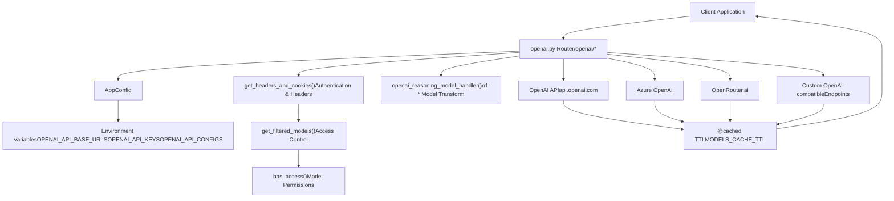
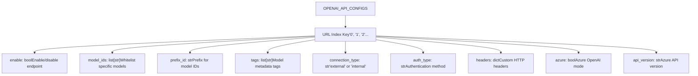
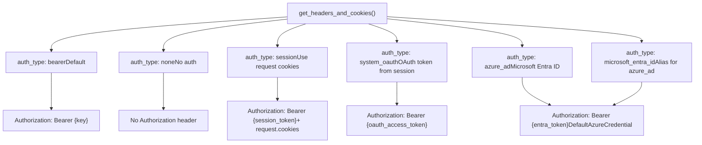
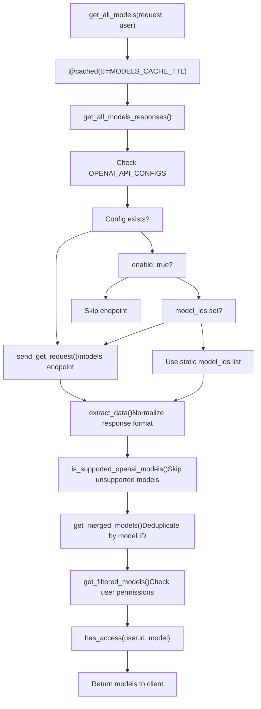
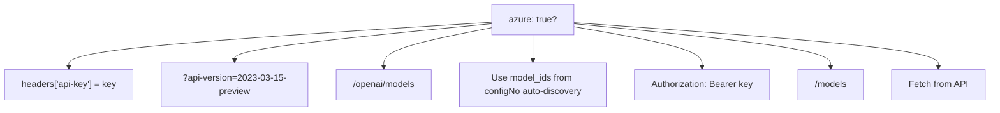
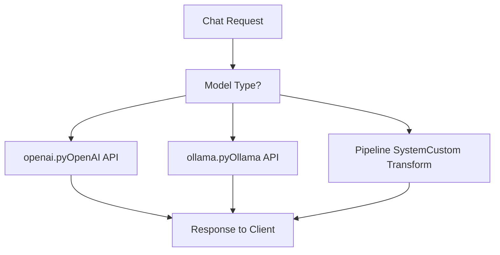

# OpenAI Integration

Relevant source files

-   [backend/open\_webui/env.py](https://github.com/open-webui/open-webui/blob/a7271532/backend/open_webui/env.py)
-   [backend/open\_webui/routers/audio.py](https://github.com/open-webui/open-webui/blob/a7271532/backend/open_webui/routers/audio.py)
-   [backend/open\_webui/routers/auths.py](https://github.com/open-webui/open-webui/blob/a7271532/backend/open_webui/routers/auths.py)
-   [backend/open\_webui/routers/ollama.py](https://github.com/open-webui/open-webui/blob/a7271532/backend/open_webui/routers/ollama.py)
-   [backend/open\_webui/routers/openai.py](https://github.com/open-webui/open-webui/blob/a7271532/backend/open_webui/routers/openai.py)
-   [backend/open\_webui/utils/auth.py](https://github.com/open-webui/open-webui/blob/a7271532/backend/open_webui/utils/auth.py)
-   [backend/open\_webui/utils/embeddings.py](https://github.com/open-webui/open-webui/blob/a7271532/backend/open_webui/utils/embeddings.py)
-   [backend/open\_webui/utils/misc.py](https://github.com/open-webui/open-webui/blob/a7271532/backend/open_webui/utils/misc.py)
-   [backend/open\_webui/utils/oauth.py](https://github.com/open-webui/open-webui/blob/a7271532/backend/open_webui/utils/oauth.py)
-   [backend/open\_webui/utils/response.py](https://github.com/open-webui/open-webui/blob/a7271532/backend/open_webui/utils/response.py)

The OpenAI Integration subsystem provides a proxy layer that connects Open WebUI to OpenAI-compatible API endpoints. This includes the official OpenAI API, Azure OpenAI, and third-party providers that implement OpenAI-compatible interfaces. The system supports multiple concurrent API endpoints with independent configuration, authentication methods, and model management.

For information about Ollama integration, see [Ollama Integration](/open-webui/open-webui/13.2-ollama-integration). For general model aggregation across all providers, see [Model Aggregation](/open-webui/open-webui/13.1-model-aggregation).

## System Architecture

The OpenAI integration is implemented as a FastAPI router that proxies requests to one or more OpenAI-compatible backends while providing additional features like model access control, request transformation, and response caching.

### Component Overview


**Sources:** [backend/open\_webui/routers/openai.py1-889](https://github.com/open-webui/open-webui/blob/a7271532/backend/open_webui/routers/openai.py#L1-L889) [backend/open\_webui/env.py1-889](https://github.com/open-webui/open-webui/blob/a7271532/backend/open_webui/env.py#L1-L889)

### Request Flow Architecture

> **[Mermaid sequence]**
> *(图表结构无法解析)*

**Sources:** [backend/open\_webui/routers/openai.py118-180](https://github.com/open-webui/open-webui/blob/a7271532/backend/open_webui/routers/openai.py#L118-L180) [backend/open\_webui/routers/openai.py97-116](https://github.com/open-webui/open-webui/blob/a7271532/backend/open_webui/routers/openai.py#L97-L116) [backend/open\_webui/routers/openai.py183-196](https://github.com/open-webui/open-webui/blob/a7271532/backend/open_webui/routers/openai.py#L183-L196)

## Configuration System

OpenAI integration supports multiple independent API endpoints, each with its own configuration, authentication, and model filtering.

### Configuration Structure

The system uses three complementary configuration structures:

| Configuration | Type | Purpose | Example |
| --- | --- | --- | --- |
| `OPENAI_API_BASE_URLS` | `list[str]` | List of API endpoint URLs | `["https://api.openai.com/v1", "http://localhost:8000"]` |
| `OPENAI_API_KEYS` | `list[str]` | API keys corresponding to each URL | `["sk-...", ""]` |
| `OPENAI_API_CONFIGS` | `dict[str, dict]` | Per-URL advanced configuration | `{"0": {"enable": true, "model_ids": []}}` |

**Sources:** [backend/open\_webui/routers/openai.py207-265](https://github.com/open-webui/open-webui/blob/a7271532/backend/open_webui/routers/openai.py#L207-L265)

### OPENAI\_API\_CONFIGS Schema


**Sources:** [backend/open\_webui/routers/openai.py224-265](https://github.com/open-webui/open-webui/blob/a7271532/backend/open_webui/routers/openai.py#L224-L265) [backend/open\_webui/routers/openai.py343-413](https://github.com/open-webui/open-webui/blob/a7271532/backend/open_webui/routers/openai.py#L343-L413)

### Configuration Endpoints

The router exposes endpoints for runtime configuration management:

```
# GET /openai/config
# Returns current configuration (admin only)
{
    "ENABLE_OPENAI_API": bool,
    "OPENAI_API_BASE_URLS": list[str],
    "OPENAI_API_KEYS": list[str],
    "OPENAI_API_CONFIGS": dict
}

# POST /openai/config/update
# Updates configuration (admin only)
```
**Sources:** [backend/open\_webui/routers/openai.py207-265](https://github.com/open-webui/open-webui/blob/a7271532/backend/open_webui/routers/openai.py#L207-L265)

## Authentication Methods

The integration supports six authentication methods, configurable per-endpoint via the `auth_type` field in `OPENAI_API_CONFIGS`.

### Authentication Method Diagram


**Sources:** [backend/open\_webui/routers/openai.py118-180](https://github.com/open-webui/open-webui/blob/a7271532/backend/open_webui/routers/openai.py#L118-L180) [backend/open\_webui/routers/openai.py183-196](https://github.com/open-webui/open-webui/blob/a7271532/backend/open_webui/routers/openai.py#L183-L196)

### Authentication Implementation Details

#### Bearer Token (Default)

```
# auth_type == "bearer" or auth_type is None
token = f"{key}"
headers["Authorization"] = f"Bearer {token}"
```
#### System OAuth

```
# auth_type == "system_oauth"
oauth_token = await request.app.state.oauth_manager.get_oauth_token(
    user.id,
    request.cookies.get("oauth_session_id", None),
)
token = f"{oauth_token.get('access_token', '')}"
```
This integrates with the OAuth session management system to retrieve stored access tokens. See [OAuth Integration](/open-webui/open-webui/10.2-oauth-integration) for details on OAuth session storage.

**Sources:** [backend/open\_webui/routers/openai.py155-169](https://github.com/open-webui/open-webui/blob/a7271532/backend/open_webui/routers/openai.py#L155-L169)

#### Microsoft Entra ID / Azure AD

```
# auth_type in ("azure_ad", "microsoft_entra_id")
from azure.identity import DefaultAzureCredential, get_bearer_token_provider

token_provider = get_bearer_token_provider(
    DefaultAzureCredential(),
    "https://cognitiveservices.azure.com/.default"
)
token = token_provider()
```
Uses Azure's `DefaultAzureCredential` for automatic credential discovery (managed identity, environment variables, Azure CLI, etc.).

**Sources:** [backend/open\_webui/routers/openai.py183-196](https://github.com/open-webui/open-webui/blob/a7271532/backend/open_webui/routers/openai.py#L183-L196)

## Model Management

The OpenAI integration aggregates models from multiple endpoints and provides access control, filtering, and caching.

### Model Aggregation Flow


**Sources:** [backend/open\_webui/routers/openai.py343-537](https://github.com/open-webui/open-webui/blob/a7271532/backend/open_webui/routers/openai.py#L343-L537) [backend/open\_webui/routers/openai.py456-467](https://github.com/open-webui/open-webui/blob/a7271532/backend/open_webui/routers/openai.py#L456-L467)

### Model Response Enrichment

Each model in the aggregated list is enriched with metadata:

```
{
    "id": "model-id",  # Optionally prefixed with prefix_id
    "name": "model-name",
    "owned_by": "openai",
    "openai": {...},  # Original model object
    "connection_type": "external",  # From OPENAI_API_CONFIGS
    "urlIdx": 0,  # Index in OPENAI_API_BASE_URLS
    "tags": []  # From OPENAI_API_CONFIGS
}
```
**Sources:** [backend/open\_webui/routers/openai.py503-531](https://github.com/open-webui/open-webui/blob/a7271532/backend/open_webui/routers/openai.py#L503-L531)

### Model Filtering

The system filters models in two stages:

1.  **OpenAI Official API Filtering** - Automatically excludes non-chat models from `api.openai.com`:

    ```
    excluded = ["babbage", "dall-e", "davinci", "embedding", "tts", "whisper"]
    ```

2.  **User Access Control Filtering** - Checks model ownership and access control lists:

    ```
    if user.role == "user" and not BYPASS_MODEL_ACCESS_CONTROL:
        models["data"] = await get_filtered_models(models, user)
    ```


**Sources:** [backend/open\_webui/routers/openai.py488-502](https://github.com/open-webui/open-webui/blob/a7271532/backend/open_webui/routers/openai.py#L488-L502) [backend/open\_webui/routers/openai.py456-467](https://github.com/open-webui/open-webui/blob/a7271532/backend/open_webui/routers/openai.py#L456-L467) [backend/open\_webui/routers/openai.py622-624](https://github.com/open-webui/open-webui/blob/a7271532/backend/open_webui/routers/openai.py#L622-L624)

## Special Features

### OpenAI Reasoning Models

OpenAI's reasoning models (o1-preview, o1-mini, o3-mini) require special handling for system messages and token limits.

```
def openai_reasoning_model_handler(payload):
    # Convert max_tokens to max_completion_tokens
    if "max_tokens" in payload:
        payload["max_completion_tokens"] = payload["max_tokens"]
        del payload["max_tokens"]

    # Handle system role conversion
    if payload["messages"][0]["role"] == "system":
        model_lower = payload["model"].lower()
        if model_lower.startswith("o1-mini") or model_lower.startswith("o1-preview"):
            # Legacy models: system → user
            payload["messages"][0]["role"] = "user"
        else:
            # New models: system → developer
            payload["messages"][0]["role"] = "developer"

    return payload
```
**Sources:** [backend/open\_webui/routers/openai.py97-116](https://github.com/open-webui/open-webui/blob/a7271532/backend/open_webui/routers/openai.py#L97-L116)

### Azure OpenAI Support

Azure OpenAI has a different API structure that requires special handling:


Azure requires the `api-version` query parameter and does not support dynamic model discovery, so models must be manually specified in `model_ids`.

**Sources:** [backend/open\_webui/routers/openai.py569-574](https://github.com/open-webui/open-webui/blob/a7271532/backend/open_webui/routers/openai.py#L569-L574) [backend/open\_webui/routers/openai.py655-667](https://github.com/open-webui/open-webui/blob/a7271532/backend/open_webui/routers/openai.py#L655-L667)

### OpenRouter.ai Headers

OpenRouter.ai requires special HTTP headers for request attribution:

```
headers = {
    "Content-Type": "application/json",
    **(
        {
            "HTTP-Referer": "https://openwebui.com/",
            "X-Title": "Open WebUI",
        }
        if "openrouter.ai" in url
        else {}
    ),
}
```
**Sources:** [backend/open\_webui/routers/openai.py126-137](https://github.com/open-webui/open-webui/blob/a7271532/backend/open_webui/routers/openai.py#L126-L137)

### User Info Headers

When `ENABLE_FORWARD_USER_INFO_HEADERS` is enabled, the system includes user identification headers in proxied requests:

```
if ENABLE_FORWARD_USER_INFO_HEADERS and user:
    headers = include_user_info_headers(headers, user)
    if metadata and metadata.get("chat_id"):
        headers["X-OpenWebUI-Chat-Id"] = metadata.get("chat_id")
```
This allows backend services to track usage per-user and per-chat.

**Sources:** [backend/open\_webui/routers/openai.py139-142](https://github.com/open-webui/open-webui/blob/a7271532/backend/open_webui/routers/openai.py#L139-L142) [backend/open\_webui/env.py188-193](https://github.com/open-webui/open-webui/blob/a7271532/backend/open_webui/env.py#L188-L193)

## Text-to-Speech Integration

The OpenAI integration provides TTS capabilities via the `/audio/speech` endpoint with response caching.

### TTS Request Flow

> **[Mermaid sequence]**
> *(图表结构无法解析)*

The caching mechanism uses SHA-256 hashing of the request body to create deterministic cache keys, preventing duplicate API calls for identical requests.

**Sources:** [backend/open\_webui/routers/openai.py268-341](https://github.com/open-webui/open-webui/blob/a7271532/backend/open_webui/routers/openai.py#L268-L341)

## Connection Verification

The `/verify` endpoint tests API connectivity before saving configuration:

```
@router.post("/verify")
async def verify_connection(
    request: Request,
    form_data: ConnectionVerificationForm,
    user=Depends(get_admin_user),
):
    # Constructs headers with authentication
    # Tests connection to /models or /openai/models endpoint
    # Returns success/error response
```
For Azure OpenAI, verification uses the `/openai/models` endpoint with the `api-version` parameter.

**Sources:** [backend/open\_webui/routers/openai.py635-695](https://github.com/open-webui/open-webui/blob/a7271532/backend/open_webui/routers/openai.py#L635-L695)

## Environment Configuration

Key environment variables for OpenAI integration:

| Variable | Type | Default | Description |
| --- | --- | --- | --- |
| `AIOHTTP_CLIENT_TIMEOUT` | `int` | `300` | Global HTTP timeout (seconds) |
| `AIOHTTP_CLIENT_TIMEOUT_MODEL_LIST` | `int` | `10` | Timeout for model list requests |
| `AIOHTTP_CLIENT_SESSION_SSL` | `bool` | `true` | Enable SSL verification |
| `MODELS_CACHE_TTL` | `int` | `1` | Model list cache duration (seconds) |
| `BYPASS_MODEL_ACCESS_CONTROL` | `bool` | `false` | Disable access control checks |
| `ENABLE_FORWARD_USER_INFO_HEADERS` | `bool` | `false` | Include user info in proxied requests |

**Sources:** [backend/open\_webui/env.py669-696](https://github.com/open-webui/open-webui/blob/a7271532/backend/open_webui/env.py#L669-L696) [backend/open\_webui/env.py546-554](https://github.com/open-webui/open-webui/blob/a7271532/backend/open_webui/env.py#L546-L554) [backend/open\_webui/env.py438-440](https://github.com/open-webui/open-webui/blob/a7271532/backend/open_webui/env.py#L438-L440) [backend/open\_webui/env.py188-193](https://github.com/open-webui/open-webui/blob/a7271532/backend/open_webui/env.py#L188-L193)

## Integration with Chat Pipeline

The OpenAI integration is invoked by the chat pipeline when a message is sent to an OpenAI model:


Model routing is determined by the `owned_by` field in the model metadata, which is set during model aggregation.

**Sources:** [backend/open\_webui/routers/openai.py503-531](https://github.com/open-webui/open-webui/blob/a7271532/backend/open_webui/routers/openai.py#L503-L531)
