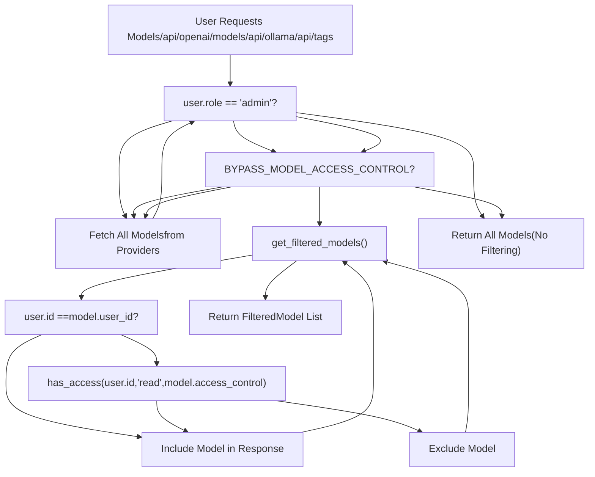
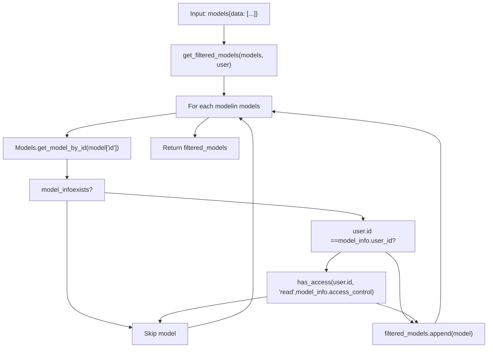
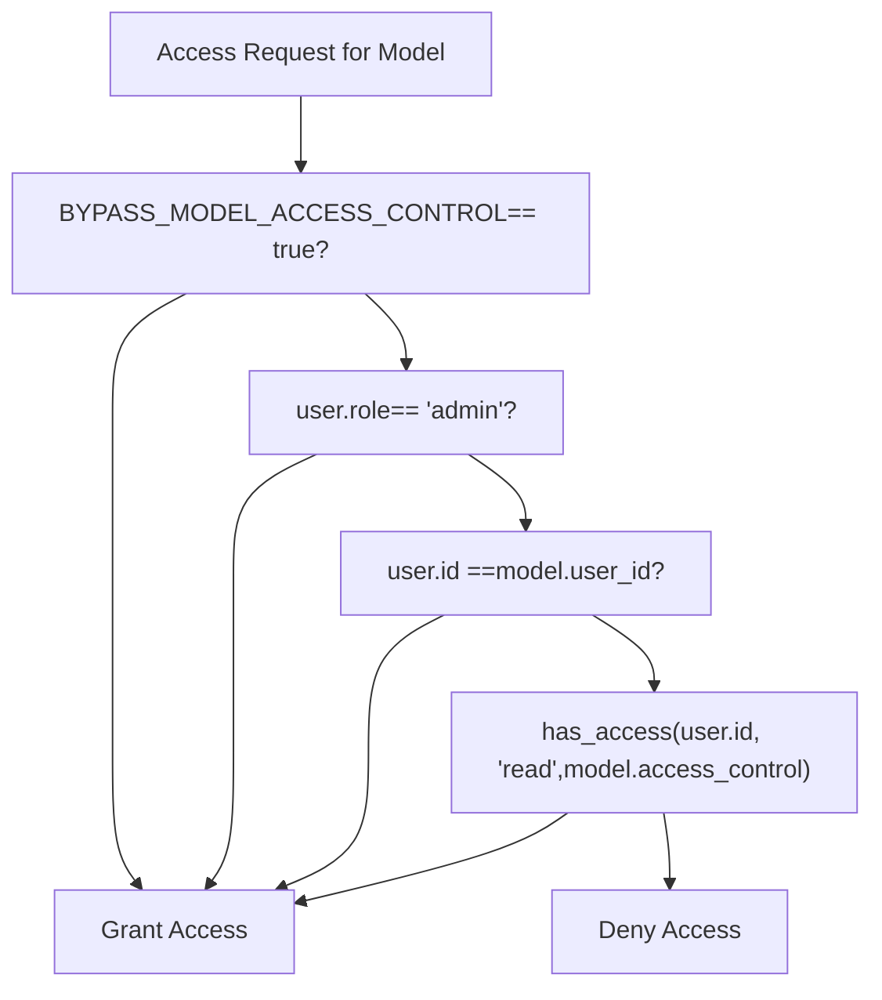

# Model Access Control

Relevant source files

-   [backend/open\_webui/env.py](https://github.com/open-webui/open-webui/blob/a7271532/backend/open_webui/env.py)
-   [backend/open\_webui/routers/audio.py](https://github.com/open-webui/open-webui/blob/a7271532/backend/open_webui/routers/audio.py)
-   [backend/open\_webui/routers/auths.py](https://github.com/open-webui/open-webui/blob/a7271532/backend/open_webui/routers/auths.py)
-   [backend/open\_webui/routers/ollama.py](https://github.com/open-webui/open-webui/blob/a7271532/backend/open_webui/routers/ollama.py)
-   [backend/open\_webui/routers/openai.py](https://github.com/open-webui/open-webui/blob/a7271532/backend/open_webui/routers/openai.py)
-   [backend/open\_webui/utils/auth.py](https://github.com/open-webui/open-webui/blob/a7271532/backend/open_webui/utils/auth.py)
-   [backend/open\_webui/utils/embeddings.py](https://github.com/open-webui/open-webui/blob/a7271532/backend/open_webui/utils/embeddings.py)
-   [backend/open\_webui/utils/misc.py](https://github.com/open-webui/open-webui/blob/a7271532/backend/open_webui/utils/misc.py)
-   [backend/open\_webui/utils/oauth.py](https://github.com/open-webui/open-webui/blob/a7271532/backend/open_webui/utils/oauth.py)
-   [backend/open\_webui/utils/response.py](https://github.com/open-webui/open-webui/blob/a7271532/backend/open_webui/utils/response.py)

## Purpose and Scope

Model Access Control is the system that restricts which LLM models individual users can access based on ownership and permission rules. This page covers the filtering mechanisms applied to model listings, the `BYPASS_MODEL_ACCESS_CONTROL` environment flag, and integration with model endpoints.

For information about model aggregation from multiple providers, see [Model Aggregation](/open-webui/open-webui/13.1-model-aggregation). For authentication and role-based access control (RBAC), see [Access Control and RBAC](/open-webui/open-webui/10.4-access-control-and-rbac). For per-user permissions on other features, see [Access Control and RBAC](/open-webui/open-webui/10.4-access-control-and-rbac).

---

## System Architecture

Model access control operates as a filter layer between the model listing endpoints and the user, evaluating each model against the user's permissions before returning results.

### Access Control Flow


**Sources:** [backend/open\_webui/routers/openai.py456-466](https://github.com/open-webui/open-webui/blob/a7271532/backend/open_webui/routers/openai.py#L456-L466) [backend/open\_webui/routers/ollama.py424-434](https://github.com/open-webui/open-webui/blob/a7271532/backend/open_webui/routers/ollama.py#L424-L434)

---

## Environment Configuration

### BYPASS\_MODEL\_ACCESS\_CONTROL Flag

The `BYPASS_MODEL_ACCESS_CONTROL` environment variable provides a global override for all access control checks. When enabled, all users (including non-admin users) can see and access all models regardless of ownership or access control lists.

| Variable | Type | Default | Description |
| --- | --- | --- | --- |
| `BYPASS_MODEL_ACCESS_CONTROL` | boolean | `False` | When `true`, disables all model access filtering for regular users |

**Configuration Location:** [backend/open\_webui/env.py438-440](https://github.com/open-webui/open-webui/blob/a7271532/backend/open_webui/env.py#L438-L440)

```
BYPASS_MODEL_ACCESS_CONTROL = (
    os.environ.get("BYPASS_MODEL_ACCESS_CONTROL", "False").lower() == "true"
)
```
**Use Cases:**

-   Development/testing environments where access restrictions are unnecessary
-   Single-user deployments
-   Deployments with external authorization systems

**Security Note:** This flag should remain `False` in production multi-user environments to maintain proper access boundaries.

**Sources:** [backend/open\_webui/env.py438-440](https://github.com/open-webui/open-webui/blob/a7271532/backend/open_webui/env.py#L438-L440)

---

## Model Metadata and Permissions

### Model Database Schema

Each model stored in the `Models` table contains access control metadata:

| Field | Type | Description |
| --- | --- | --- |
| `id` | string | Unique model identifier (e.g., `"gpt-4"`, `"llama2:13b"`) |
| `user_id` | string | ID of the user who registered/owns this model |
| `access_control` | dict | Access control list defining read/write permissions |

**Model Ownership:** The `user_id` field establishes ownership. Model owners always have full access to their models regardless of `access_control` settings.

**Access Control Structure:** The `access_control` field follows a permission structure evaluated by `has_access()`:

```
# Example access_control structure
{
  "read": {
    "group_ids": ["group_uuid_1", "group_uuid_2"],
    "user_ids": ["user_uuid_1", "user_uuid_2"]
  },
  "write": {
    "group_ids": [...],
    "user_ids": [...]
  }
}
```
**Sources:** [backend/open\_webui/routers/openai.py460-464](https://github.com/open-webui/open-webui/blob/a7271532/backend/open_webui/routers/openai.py#L460-L464) [backend/open\_webui/routers/ollama.py428-432](https://github.com/open-webui/open-webui/blob/a7271532/backend/open_webui/routers/ollama.py#L428-L432)

---

## Filtering Implementation

### Filter Function Architecture


**Sources:** [backend/open\_webui/routers/openai.py456-466](https://github.com/open-webui/open-webui/blob/a7271532/backend/open_webui/routers/openai.py#L456-L466) [backend/open\_webui/routers/ollama.py424-434](https://github.com/open-webui/open-webui/blob/a7271532/backend/open_webui/routers/ollama.py#L424-L434)

### OpenAI Endpoint Implementation

The OpenAI-compatible `/api/openai/models` endpoint applies filtering at the response stage:

[backend/open\_webui/routers/openai.py539-625](https://github.com/open-webui/open-webui/blob/a7271532/backend/open_webui/routers/openai.py#L539-L625)

```
@router.get("/models")
@router.get("/models/{url_idx}")
async def get_models(
    request: Request, url_idx: Optional[int] = None, user=Depends(get_verified_user)
):
    # Fetch models from all configured OpenAI API endpoints
    models = await get_all_models(request, user=user)

    # Apply filtering for non-admin users
    if user.role == "user" and not BYPASS_MODEL_ACCESS_CONTROL:
        models["data"] = await get_filtered_models(models, user)

    return models

async def get_filtered_models(models, user):
    # Filter models based on user access control
    filtered_models = []
    for model in models.get("data", []):
        model_info = Models.get_model_by_id(model["id"])
        if model_info:
            if user.id == model_info.user_id or has_access(
                user.id, type="read", access_control=model_info.access_control
            ):
                filtered_models.append(model)
    return filtered_models
```
**Key Behavior:**

-   Admin users (`user.role == "admin"`) bypass filtering entirely
-   Returns OpenAI-compatible `{data: []}` structure
-   Looks up model metadata from `Models` table for each model
-   Models without database entries are excluded

**Sources:** [backend/open\_webui/routers/openai.py456-466](https://github.com/open-webui/open-webui/blob/a7271532/backend/open_webui/routers/openai.py#L456-L466) [backend/open\_webui/routers/openai.py539-625](https://github.com/open-webui/open-webui/blob/a7271532/backend/open_webui/routers/openai.py#L539-L625)

### Ollama Endpoint Implementation

The Ollama-compatible `/api/ollama/api/tags` endpoint uses an identical filtering pattern with structure differences:

[backend/open\_webui/routers/ollama.py437-487](https://github.com/open-webui/open-webui/blob/a7271532/backend/open_webui/routers/ollama.py#L437-L487)

```
@router.get("/api/tags")
@router.get("/api/tags/{url_idx}")
async def get_ollama_tags(
    request: Request, url_idx: Optional[int] = None, user=Depends(get_verified_user)
):
    # Fetch models from Ollama endpoints
    models = await get_all_models(request, user=user)

    # Apply filtering for non-admin users
    if user.role == "user" and not BYPASS_MODEL_ACCESS_CONTROL:
        models["models"] = await get_filtered_models(models, user)

    return models

async def get_filtered_models(models, user):
    # Filter models based on user access control
    filtered_models = []
    for model in models.get("models", []):
        model_info = Models.get_model_by_id(model["model"])
        if model_info:
            if user.id == model_info.user_id or has_access(
                user.id, type="read", access_control=model_info.access_control
            ):
                filtered_models.append(model)
    return filtered_models
```
**Differences from OpenAI endpoint:**

-   Uses `models["models"]` instead of `models["data"]`
-   Model ID accessed via `model["model"]` instead of `model["id"]`
-   Otherwise identical filtering logic

**Sources:** [backend/open\_webui/routers/ollama.py424-434](https://github.com/open-webui/open-webui/blob/a7271532/backend/open_webui/routers/ollama.py#L424-L434) [backend/open\_webui/routers/ollama.py437-487](https://github.com/open-webui/open-webui/blob/a7271532/backend/open_webui/routers/ollama.py#L437-L487)

---

## Integration Points

### Embeddings Endpoint

The embeddings generation endpoint applies access control before processing requests:

[backend/open\_webui/utils/embeddings.py25-89](https://github.com/open-webui/open-webui/blob/a7271532/backend/open_webui/utils/embeddings.py#L25-L89)

```
async def generate_embeddings(
    request: Request,
    form_data: dict,
    user: UserModel,
    bypass_filter: bool = False,
):
    # Global bypass check
    if BYPASS_MODEL_ACCESS_CONTROL:
        bypass_filter = True

    # Retrieve model
    model_id = form_data.get("model")
    if model_id not in models:
        raise Exception("Model not found")
    model = models[model_id]

    # Access filtering
    if not getattr(request.state, "direct", False):
        if not bypass_filter and user.role == "user":
            check_model_access(user, model)

    # Process embedding request...
```
**Key Differences:**

-   Uses `check_model_access(user, model)` instead of filtering lists
-   Raises exception if access denied (rather than omitting from list)
-   Supports `bypass_filter` parameter for programmatic bypass
-   Respects global `BYPASS_MODEL_ACCESS_CONTROL` flag

**Sources:** [backend/open\_webui/utils/embeddings.py25-89](https://github.com/open-webui/open-webui/blob/a7271532/backend/open_webui/utils/embeddings.py#L25-L89)

### Chat Completion Endpoints

Chat completion endpoints inherit the same model resolution logic but do not explicitly filter model lists since they operate on single models specified in requests. Access control is enforced through:

1.  **Model Discovery Phase:** Users cannot see models they don't have access to in UI selectors (via filtered `/models` endpoints)
2.  **Request Validation:** Backend validates model access when processing chat requests (implementation in middleware layers)

**Sources:** [backend/open\_webui/routers/openai.py622-624](https://github.com/open-webui/open-webui/blob/a7271532/backend/open_webui/routers/openai.py#L622-L624) [backend/open\_webui/routers/ollama.py484-486](https://github.com/open-webui/open-webui/blob/a7271532/backend/open_webui/routers/ollama.py#L484-L486)

---

## Access Control Evaluation

### Evaluation Logic Map


**Evaluation Priority (Short-Circuit):**

1.  **Global Bypass:** If `BYPASS_MODEL_ACCESS_CONTROL=true`, grant access immediately
2.  **Admin Role:** If `user.role == "admin"`, grant access immediately
3.  **Ownership:** If `user.id == model.user_id`, grant access immediately
4.  **Access Control List:** Evaluate `has_access(user.id, "read", model.access_control)`
    -   Checks if user is in `access_control.read.user_ids[]`
    -   Checks if user belongs to any group in `access_control.read.group_ids[]`
5.  **Default:** Deny access if none of the above conditions are met

**Sources:** [backend/open\_webui/routers/openai.py456-466](https://github.com/open-webui/open-webui/blob/a7271532/backend/open_webui/routers/openai.py#L456-L466) [backend/open\_webui/routers/ollama.py424-434](https://github.com/open-webui/open-webui/blob/a7271532/backend/open_webui/routers/ollama.py#L424-L434)

---

## Security Considerations

### Access Control Bypass Scenarios

| Scenario | Behavior | Security Implication |
| --- | --- | --- |
| `BYPASS_MODEL_ACCESS_CONTROL=true` | All users see all models | Complete access control bypass |
| Admin user | Sees all models regardless of settings | Expected admin privilege |
| Model owner | Sees own models regardless of ACL | Expected ownership privilege |
| API key authentication | Subject to same filtering rules | No special privileges |
| OAuth authentication | Subject to same filtering rules | No special privileges |

### Model Registration and Ownership

-   When a model is first registered in the database, the registering user becomes the owner via `user_id`
-   Models fetched from external APIs (Ollama, OpenAI) that don't exist in the database are invisible to non-admin users
-   Admin users can see models even if they lack database entries

### Implementation Security

**Database Lookup:** The filtering functions use `Models.get_model_by_id()` to retrieve stored model metadata. Models without database entries are excluded from filtered results.

**No Implicit Access:** The absence of an `access_control` field does not grant implicit access. The `has_access()` function must explicitly return `True`.

**Sources:** [backend/open\_webui/routers/openai.py456-466](https://github.com/open-webui/open-webui/blob/a7271532/backend/open_webui/routers/openai.py#L456-L466) [backend/open\_webui/routers/ollama.py424-434](https://github.com/open-webui/open-webui/blob/a7271532/backend/open_webui/routers/ollama.py#L424-L434) [backend/open\_webui/env.py438-440](https://github.com/open-webui/open-webui/blob/a7271532/backend/open_webui/env.py#L438-L440)

---

## Deployment Configuration

### Recommended Settings by Deployment Type

| Deployment Type | `BYPASS_MODEL_ACCESS_CONTROL` | Admin Users | Notes |
| --- | --- | --- | --- |
| **Production (Multi-User)** | `false` | Limited admin accounts | Enforce proper access control |
| **Development** | `true` | All developers | Simplify testing |
| **Single-User** | `true` | N/A | Access control unnecessary |
| **Enterprise (LDAP/OAuth)** | `false` | Directory-managed | Integrate with existing IAM |
| **Demo/Evaluation** | `true` or `false` | Configuration dependent | Depends on demo scope |

### Configuration Example

```
# Production multi-user deployment
BYPASS_MODEL_ACCESS_CONTROL=false

# Development environment
BYPASS_MODEL_ACCESS_CONTROL=true
```
**Sources:** [backend/open\_webui/env.py438-440](https://github.com/open-webui/open-webui/blob/a7271532/backend/open_webui/env.py#L438-L440)

---

## Related Systems

-   **[Model Aggregation](/open-webui/open-webui/13.1-model-aggregation):** How models from multiple providers are combined before filtering
-   **[Access Control and RBAC](/open-webui/open-webui/10.4-access-control-and-rbac):** User roles, permissions, and group-based access control
-   **[Ollama Integration](/open-webui/open-webui/13.2-ollama-integration):** Ollama-specific model fetching and formatting
-   **[OpenAI Integration](/open-webui/open-webui/13.3-openai-integration):** OpenAI-compatible API model fetching
-   **[Pipeline System](/open-webui/open-webui/13.5-pipeline-system):** Custom model transformations and integrations

**Sources:** [backend/open\_webui/routers/openai.py456-625](https://github.com/open-webui/open-webui/blob/a7271532/backend/open_webui/routers/openai.py#L456-L625) [backend/open\_webui/routers/ollama.py424-487](https://github.com/open-webui/open-webui/blob/a7271532/backend/open_webui/routers/ollama.py#L424-L487) [backend/open\_webui/utils/embeddings.py25-89](https://github.com/open-webui/open-webui/blob/a7271532/backend/open_webui/utils/embeddings.py#L25-L89)
