# Pipeline System

Relevant source files

-   [backend/open\_webui/config.py](https://github.com/open-webui/open-webui/blob/a7271532/backend/open_webui/config.py)
-   [backend/open\_webui/main.py](https://github.com/open-webui/open-webui/blob/a7271532/backend/open_webui/main.py)
-   [backend/open\_webui/retrieval/loaders/datalab\_marker.py](https://github.com/open-webui/open-webui/blob/a7271532/backend/open_webui/retrieval/loaders/datalab_marker.py)
-   [backend/open\_webui/retrieval/loaders/external\_document.py](https://github.com/open-webui/open-webui/blob/a7271532/backend/open_webui/retrieval/loaders/external_document.py)
-   [backend/open\_webui/retrieval/loaders/external\_web.py](https://github.com/open-webui/open-webui/blob/a7271532/backend/open_webui/retrieval/loaders/external_web.py)
-   [backend/open\_webui/retrieval/loaders/main.py](https://github.com/open-webui/open-webui/blob/a7271532/backend/open_webui/retrieval/loaders/main.py)
-   [backend/open\_webui/retrieval/loaders/mineru.py](https://github.com/open-webui/open-webui/blob/a7271532/backend/open_webui/retrieval/loaders/mineru.py)
-   [backend/open\_webui/retrieval/loaders/mistral.py](https://github.com/open-webui/open-webui/blob/a7271532/backend/open_webui/retrieval/loaders/mistral.py)
-   [backend/open\_webui/retrieval/utils.py](https://github.com/open-webui/open-webui/blob/a7271532/backend/open_webui/retrieval/utils.py)
-   [backend/open\_webui/routers/retrieval.py](https://github.com/open-webui/open-webui/blob/a7271532/backend/open_webui/routers/retrieval.py)
-   [backend/open\_webui/utils/middleware.py](https://github.com/open-webui/open-webui/blob/a7271532/backend/open_webui/utils/middleware.py)
-   [src/lib/apis/retrieval/index.ts](https://github.com/open-webui/open-webui/blob/a7271532/src/lib/apis/retrieval/index.ts)
-   [src/lib/components/admin/Settings/Documents.svelte](https://github.com/open-webui/open-webui/blob/a7271532/src/lib/components/admin/Settings/Documents.svelte)
-   [src/lib/components/admin/Settings/WebSearch.svelte](https://github.com/open-webui/open-webui/blob/a7271532/src/lib/components/admin/Settings/WebSearch.svelte)

This page documents the Pipelines Plugin Framework in Open WebUI, which provides a standardized mechanism for custom request and response transformations. Pipelines are Python modules that can intercept chat completion requests at two points: the inlet (before LLM processing) and the outlet (after LLM response), enabling custom preprocessing, postprocessing, content filtering, and integration with external services.

The pipeline system is implemented as middleware in the backend request processing chain. Unlike model-specific pipelines (which replace the LLM), filter pipelines augment the existing chat flow by transforming data as it passes through.

**Sources:** [backend/open\_webui/utils/middleware.py53-56](https://github.com/open-webui/open-webui/blob/a7271532/backend/open_webui/utils/middleware.py#L53-L56) [backend/open\_webui/main.py76](https://github.com/open-webui/open-webui/blob/a7271532/backend/open_webui/main.py#L76-L76)

## Architecture Overview

### Pipeline Integration in Request Flow

Pipelines are integrated into the chat middleware pipeline via `process_chat_payload` and `process_chat_response` functions. The middleware system processes requests through a series of handlers, with pipelines providing customizable transformation points.

**Diagram: Pipeline Middleware Chain**

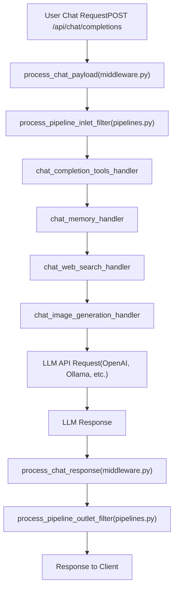
**Sources:** [backend/open\_webui/utils/middleware.py53-56](https://github.com/open-webui/open-webui/blob/a7271532/backend/open_webui/utils/middleware.py#L53-L56) Diagram 2 from system architecture overview

### Middleware Functions

The pipeline system exposes two primary integration points in the middleware layer:

**Table: Pipeline Middleware Functions**

| Function | File Location | Called By | Purpose |
| --- | --- | --- | --- |
| `process_pipeline_inlet_filter` | `routers/pipelines.py` | `process_chat_payload` | Pre-processes requests before LLM |
| `process_pipeline_outlet_filter` | `routers/pipelines.py` | `process_chat_response` | Post-processes responses after LLM |

Both functions are imported into `utils/middleware.py` and invoked as part of the standard request/response lifecycle.

**Sources:** [backend/open\_webui/utils/middleware.py53-56](https://github.com/open-webui/open-webui/blob/a7271532/backend/open_webui/utils/middleware.py#L53-L56)

## Pipeline Types

### Inlet Pipelines

Inlet pipelines process the chat request before it reaches the LLM. They can:

-   Modify message content (e.g., add context, rewrite prompts)
-   Inject system messages
-   Filter or validate user input
-   Add metadata or tracking information
-   Route requests based on content analysis

**Diagram: Inlet Filter Processing**

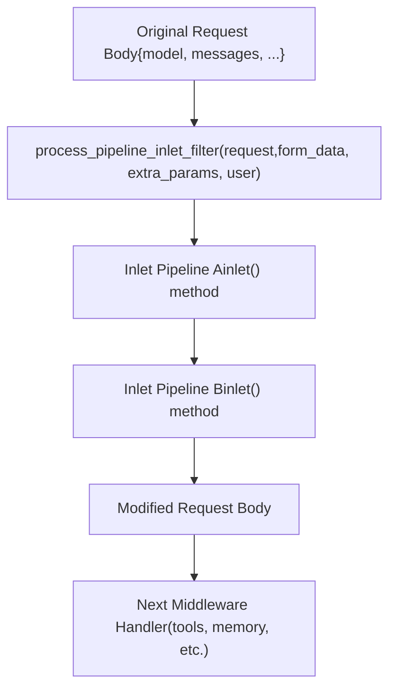
Inlet pipelines receive the request and can return a modified version. Multiple pipelines can be chained, with each processing the output of the previous one.

**Sources:** [backend/open\_webui/utils/middleware.py54](https://github.com/open-webui/open-webui/blob/a7271532/backend/open_webui/utils/middleware.py#L54-L54) Diagram 2 (Inlet Filters)

### Outlet Pipelines

Outlet pipelines process the LLM response before it's sent to the client. They can:

-   Post-process generated text (e.g., format, sanitize)
-   Add citations or references
-   Inject metadata into responses
-   Log or audit response content
-   Transform response format

**Diagram: Outlet Filter Processing**

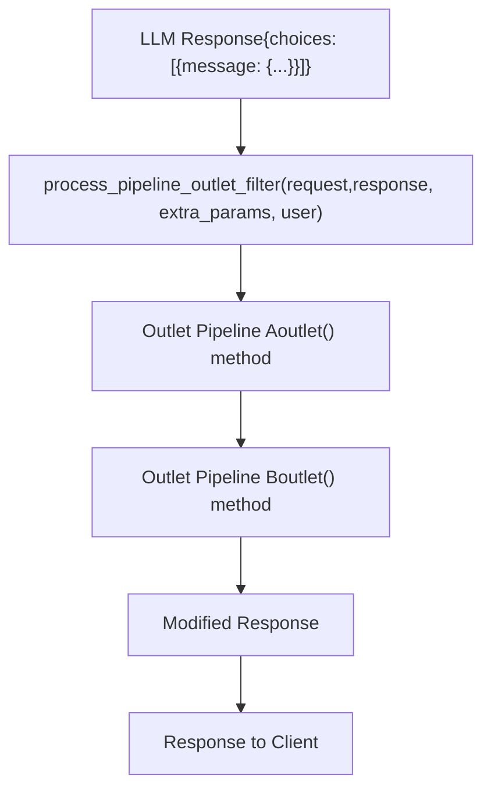
**Sources:** [backend/open\_webui/utils/middleware.py55](https://github.com/open-webui/open-webui/blob/a7271532/backend/open_webui/utils/middleware.py#L55-L55) Diagram 2 (Outlet Filters)

## Pipeline Structure

### Required Interface

A pipeline module must implement a specific interface to be recognized by the pipeline system. The exact structure depends on whether it's an inlet or outlet pipeline.

**Table: Pipeline Class Requirements**

| Element | Type | Required | Purpose |
| --- | --- | --- | --- |
| `class Pipeline` | Python class | Yes | Main pipeline implementation |
| `def __init__(self)` | Constructor | Yes | Initialize pipeline state and valves |
| `self.valves` | Object | Optional | Runtime configuration parameters |
| `async def inlet(body: dict)` | Method | For inlet pipelines | Transform request before LLM |
| `async def outlet(body: dict)` | Method | For outlet pipelines | Transform response after LLM |

**Sources:** Based on pipeline router patterns in [backend/open\_webui/routers/pipelines.py](https://github.com/open-webui/open-webui/blob/a7271532/backend/open_webui/routers/pipelines.py)

### Example Pipeline Structure

A basic pipeline implementation follows this pattern:

```
class Pipeline:
    def __init__(self):
        # Initialize valve configuration
        self.valves = {
            "ENABLED": True,
            "SETTING_A": "default_value"
        }

    async def inlet(self, body: dict, user: dict) -> dict:
        # Process request before LLM
        # body contains: model, messages, stream, etc.

        # Example: Add system message
        if self.valves.get("ENABLED"):
            body["messages"].insert(0, {
                "role": "system",
                "content": "Custom context"
            })

        return body

    async def outlet(self, body: dict, user: dict) -> dict:
        # Process response after LLM
        # body contains the LLM response

        # Example: Modify response content
        if "choices" in body:
            for choice in body["choices"]:
                choice["message"]["content"] += "\n\n[Processed by pipeline]"

        return body
```
**Sources:** Based on pipeline interface patterns

### Valve Configuration

Valves are runtime parameters that allow pipeline behavior to be customized without modifying code. They are defined in `__init__` and can be updated through the admin interface.

**Table: Common Valve Patterns**

| Valve Type | Example | Purpose |
| --- | --- | --- |
| Boolean flags | `ENABLED: True` | Enable/disable pipeline |
| String config | `API_KEY: ""` | External service credentials |
| Numeric thresholds | `MAX_TOKENS: 2048` | Processing limits |
| Lists | `ALLOWED_MODELS: []` | Filtering criteria |

**Sources:** Based on configuration patterns

## Pipeline Deployment

### Pipeline Server Architecture

Pipelines are deployed to separate pipeline servers that run alongside Open WebUI. These servers execute the Python pipeline code and are accessed via HTTP APIs.

**Diagram: Pipeline Server Deployment**

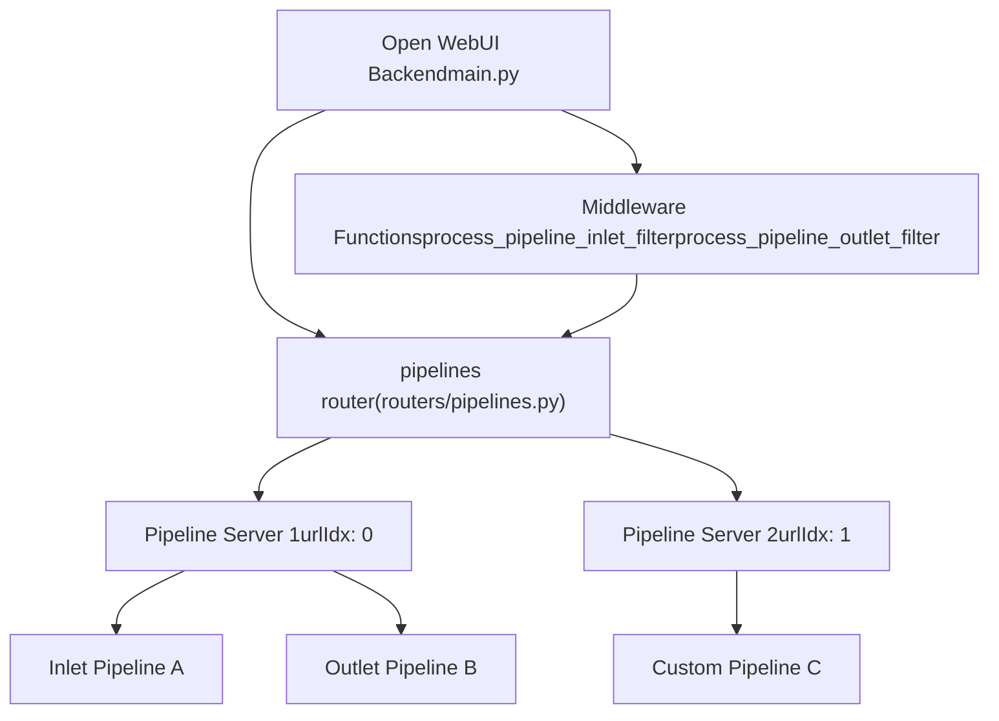
**Sources:** [backend/open\_webui/main.py76](https://github.com/open-webui/open-webui/blob/a7271532/backend/open_webui/main.py#L76-L76) [backend/open\_webui/config.py128-129](https://github.com/open-webui/open-webui/blob/a7271532/backend/open_webui/config.py#L128-L129)

### Server Configuration

Pipeline servers are configured via environment variables that specify their connection endpoints.

**Table: Pipeline Server Environment Variables**

| Variable | Type | Purpose | Example |
| --- | --- | --- | --- |
| `TOOL_SERVER_CONNECTIONS` | JSON array | List of pipeline server endpoints | `[{"url":"http://localhost:9099"}]` |

Each server in the configuration array is assigned an index (`urlIdx`) starting from 0, which is used to identify the server in API calls.

**Sources:** [backend/open\_webui/config.py128-129](https://github.com/open-webui/open-webui/blob/a7271532/backend/open_webui/config.py#L128-L129) [backend/open\_webui/main.py706-707](https://github.com/open-webui/open-webui/blob/a7271532/backend/open_webui/main.py#L706-L707)

### Pipeline Registration

Pipelines are registered with the pipeline server through file upload or URL download. The registration process involves:

1.  **Validation**: Python syntax and interface compliance checked
2.  **Deployment**: Code deployed to target server at `urlIdx`
3.  **Activation**: Pipeline becomes available for inlet/outlet processing

**Diagram: Pipeline Registration Flow**

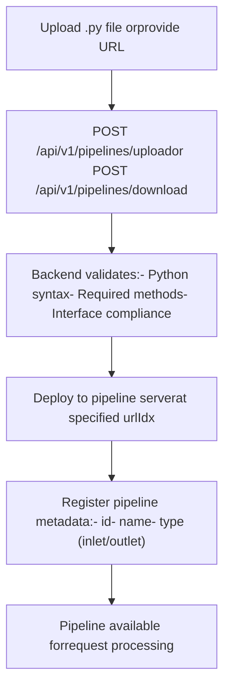
**Sources:** Based on pipeline router patterns in [backend/open\_webui/routers/pipelines.py](https://github.com/open-webui/open-webui/blob/a7271532/backend/open_webui/routers/pipelines.py)

## Processing Lifecycle

### Request Processing with Pipelines

When a chat completion request is processed, pipelines are invoked at specific points in the middleware chain. The processing flow ensures that all transformations are applied in order.

**Diagram: Complete Request Flow with Pipelines**

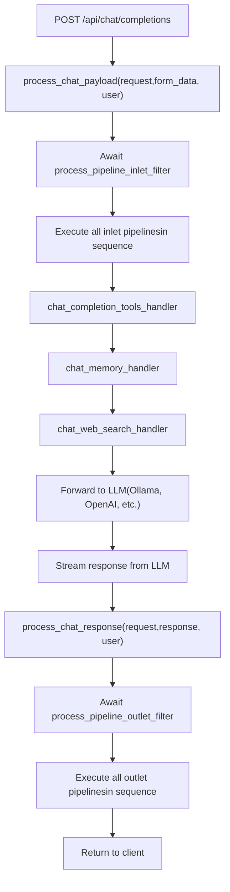
**Sources:** [backend/open\_webui/utils/middleware.py494](https://github.com/open-webui/open-webui/blob/a7271532/backend/open_webui/utils/middleware.py#L494-L494) [backend/open\_webui/utils/middleware.py53-56](https://github.com/open-webui/open-webui/blob/a7271532/backend/open_webui/utils/middleware.py#L53-L56)

### Pipeline Execution Context

Pipelines receive context information about the request including user metadata, event emitters, and session information.

**Table: Pipeline Context Parameters**

| Parameter | Type | Source | Purpose |
| --- | --- | --- | --- |
| `body` | `dict` | Request payload | Chat completion request with messages, model, etc. |
| `user` | `UserModel` | Authentication | User making the request |
| `extra_params` | `dict` | Middleware | Contains `__event_emitter__`, `__event_call__`, `__metadata__` |

The `extra_params` dictionary provides access to:

-   `__event_emitter__`: For sending status updates to the client
-   `__event_call__`: For invoking server-side events
-   `__metadata__`: Contains `chat_id`, `message_id`, `session_id`

**Sources:** [backend/open\_webui/utils/middleware.py332-334](https://github.com/open-webui/open-webui/blob/a7271532/backend/open_webui/utils/middleware.py#L332-L334)

### Pipeline Chaining

Multiple pipelines can be active simultaneously. They are executed in sequence, with each pipeline processing the output of the previous one.

**Diagram: Pipeline Chaining**

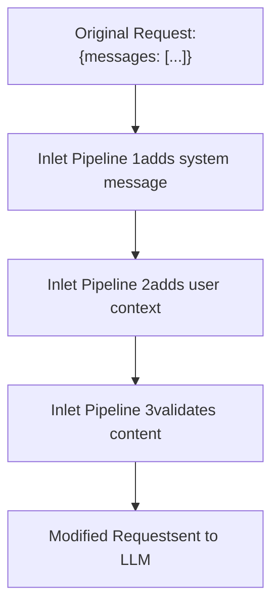
Each pipeline receives the output of the previous pipeline, allowing for composable transformations.

**Sources:** Based on pipeline processing patterns

## Integration with Middleware System

### Middleware Handler Sequence

Pipelines are integrated into the broader middleware system alongside other chat augmentation features. The execution order is critical for proper functionality.

**Table: Middleware Handler Execution Order**

| Order | Handler Function | Source File | Purpose |
| --- | --- | --- | --- |
| 1 | `process_pipeline_inlet_filter` | `routers/pipelines.py` | Pre-process request |
| 2 | `chat_completion_tools_handler` | `utils/middleware.py:286` | Execute tools |
| 3 | `chat_memory_handler` | `utils/middleware.py:516` | Add memory context |
| 4 | `chat_web_search_handler` | `utils/middleware.py:555` | Add web search results |
| 5 | `chat_image_generation_handler` | `utils/middleware.py:755` | Generate images |
| ... | LLM processing | Various | Generate response |
| N | `process_pipeline_outlet_filter` | `routers/pipelines.py` | Post-process response |

**Sources:** [backend/open\_webui/utils/middleware.py286](https://github.com/open-webui/open-webui/blob/a7271532/backend/open_webui/utils/middleware.py#L286-L286) [backend/open\_webui/utils/middleware.py516](https://github.com/open-webui/open-webui/blob/a7271532/backend/open_webui/utils/middleware.py#L516-L516) [backend/open\_webui/utils/middleware.py555](https://github.com/open-webui/open-webui/blob/a7271532/backend/open_webui/utils/middleware.py#L555-L555) [backend/open\_webui/utils/middleware.py755](https://github.com/open-webui/open-webui/blob/a7271532/backend/open_webui/utils/middleware.py#L755-L755)

### Event System Integration

Pipelines can emit events to provide real-time status updates to the client during processing. Events are sent through the `__event_emitter__` provided in `extra_params`.

**Table: Event Types Available to Pipelines**

| Event Type | Purpose | Example Payload |
| --- | --- | --- |
| `status` | Show processing status | `{"action": "processing", "description": "Running pipeline", "done": false}` |
| `message` | Send intermediate messages | `{"content": "Pipeline output"}` |
| `error` | Report errors | `{"error": true, "message": "Pipeline failed"}` |

Pipelines access the event emitter via:

```
event_emitter = extra_params.get("__event_emitter__")
if event_emitter:
    await event_emitter({
        "type": "status",
        "data": {"description": "Processing...", "done": False}
    })
```
**Sources:** [backend/open\_webui/utils/middleware.py332-334](https://github.com/open-webui/open-webui/blob/a7271532/backend/open_webui/utils/middleware.py#L332-L334) [backend/open\_webui/utils/middleware.py558-567](https://github.com/open-webui/open-webui/blob/a7271532/backend/open_webui/utils/middleware.py#L558-L567)

### Tool Integration

Pipelines can interact with the tool system by modifying tool call responses or injecting tool results into the message stream.

**Diagram: Pipeline and Tool Integration**

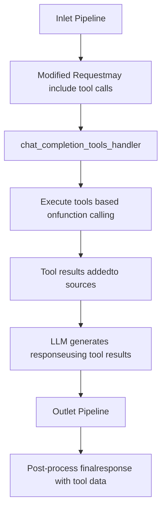
**Sources:** [backend/open\_webui/utils/middleware.py286-514](https://github.com/open-webui/open-webui/blob/a7271532/backend/open_webui/utils/middleware.py#L286-L514)

## Use Cases

### Content Filtering

Inlet pipelines can implement content filtering to validate or sanitize user input before processing.

**Example: Profanity Filter Pipeline**

```
class Pipeline:
    def __init__(self):
        self.valves = {
            "ENABLED": True,
            "BLOCKED_WORDS": ["spam", "abuse"]
        }

    async def inlet(self, body: dict, user: dict) -> dict:
        if not self.valves["ENABLED"]:
            return body

        for message in body.get("messages", []):
            content = message.get("content", "")
            for word in self.valves["BLOCKED_WORDS"]:
                if word.lower() in content.lower():
                    raise ValueError(f"Blocked word detected: {word}")

        return body
```
**Sources:** Based on pipeline pattern examples

### Context Injection

Inlet pipelines can inject additional context into requests, such as user preferences, historical data, or domain-specific knowledge.

**Example: User Preference Pipeline**

```
class Pipeline:
    async def inlet(self, body: dict, user: dict) -> dict:
        # Add user preferences to system message
        user_prefs = f"User preferences: {user.get('preferences', {})}"

        body["messages"].insert(0, {
            "role": "system",
            "content": user_prefs
        })

        return body
```
**Sources:** Based on pipeline pattern examples

### Response Formatting

Outlet pipelines can standardize response formatting, add metadata, or transform content structure.

**Example: Citation Adder Pipeline**

```
class Pipeline:
    async def outlet(self, body: dict, user: dict) -> dict:
        if "choices" in body:
            for choice in body["choices"]:
                message = choice.get("message", {})
                content = message.get("content", "")

                # Add citation footer
                message["content"] = f"{content}\n\n---\nGenerated by AI"

        return body
```
**Sources:** Based on pipeline pattern examples

### External Service Integration

Pipelines can integrate external APIs or services into the chat flow, enabling custom data sources or processing.

**Example: External API Pipeline**

```
import aiohttp

class Pipeline:
    def __init__(self):
        self.valves = {
            "API_URL": "https://api.example.com",
            "API_KEY": ""
        }

    async def inlet(self, body: dict, user: dict) -> dict:
        # Fetch data from external API
        async with aiohttp.ClientSession() as session:
            headers = {"Authorization": f"Bearer {self.valves['API_KEY']}"}
            async with session.get(self.valves["API_URL"], headers=headers) as resp:
                data = await resp.json()

        # Inject into system message
        body["messages"].insert(0, {
            "role": "system",
            "content": f"External data: {data}"
        })

        return body
```
**Sources:** Based on pipeline pattern examples

## Error Handling

### Pipeline Exceptions

Pipelines can raise exceptions to abort request processing. Exceptions are caught by the middleware and returned as error responses to the client.

**Table: Error Handling Behavior**

| Exception Type | Handling | Client Response |
| --- | --- | --- |
| `ValueError` | Caught by middleware | 400 Bad Request with error message |
| `HTTPException` | Passed through | Status code from exception |
| `Exception` | Caught by middleware | 500 Internal Server Error |

**Sources:** Based on middleware error handling patterns

### Debugging Pipelines

Pipeline execution errors are logged to the backend console. To debug pipeline issues:

1.  Check backend logs for stack traces
2.  Verify valve configuration values
3.  Test pipeline code independently
4.  Use `print()` statements (output visible in logs)

**Sources:** Based on debugging patterns

## Configuration and Management

### Pipeline Server Configuration

Pipeline servers are configured via the `TOOL_SERVER_CONNECTIONS` environment variable, which contains a JSON array of server connection objects.

**Table: Server Connection Structure**

| Field | Type | Required | Purpose |
| --- | --- | --- | --- |
| `url` | `string` | Yes | Base URL of pipeline server |
| `api_key` | `string` | No | Authentication key for server |

Example configuration:

```
[
  {"url": "http://localhost:9099"},
  {"url": "http://pipeline-server-2:9099", "api_key": "secret"}
]
```
**Sources:** [backend/open\_webui/config.py128-129](https://github.com/open-webui/open-webui/blob/a7271532/backend/open_webui/config.py#L128-L129) [backend/open\_webui/main.py706-707](https://github.com/open-webui/open-webui/blob/a7271532/backend/open_webui/main.py#L706-L707)

### Runtime State Management

The application maintains runtime state for pipeline servers in `app.state.TOOL_SERVERS`. This array is populated during application startup from the `TOOL_SERVER_CONNECTIONS` configuration.

**Diagram: Pipeline State Initialization**

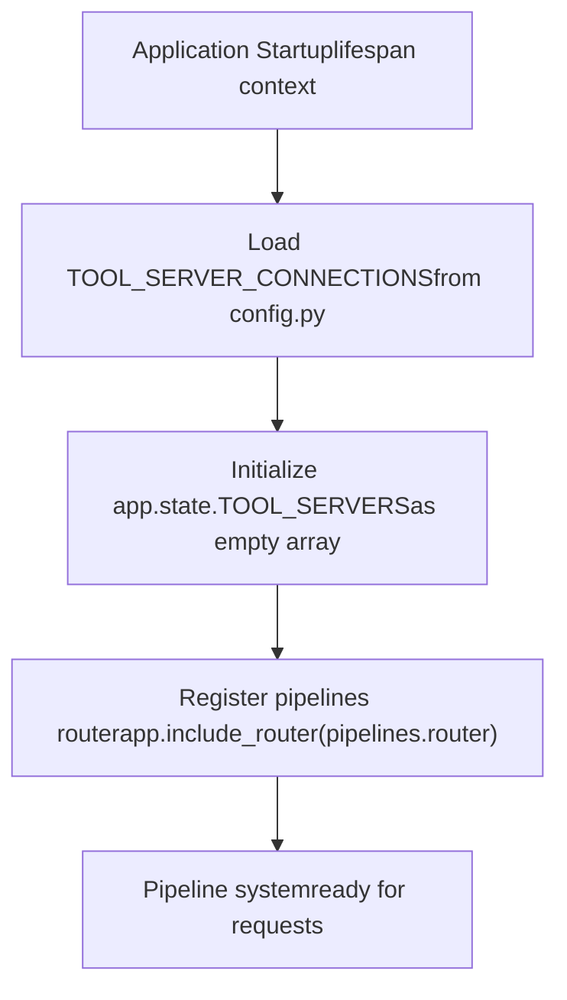
**Sources:** [backend/open\_webui/main.py706-707](https://github.com/open-webui/open-webui/blob/a7271532/backend/open_webui/main.py#L706-L707) [backend/open\_webui/main.py76](https://github.com/open-webui/open-webui/blob/a7271532/backend/open_webui/main.py#L76-L76)

### Admin Access Control

Pipeline management operations (upload, download, delete) require admin privileges. The router endpoints enforce this through the `get_admin_user` dependency.

**Table: Permission Requirements**

| Operation | Endpoint | Required Role |
| --- | --- | --- |
| List pipelines | `GET /pipelines/list` | Admin |
| Upload pipeline | `POST /pipelines/upload` | Admin |
| Download pipeline | `POST /pipelines/download` | Admin |
| Delete pipeline | `DELETE /pipelines/delete` | Admin |
| Get pipeline details | `GET /pipelines` | Admin |
| Update valves | `POST /pipelines/{id}/valves/update` | Admin |

**Sources:** Based on router authentication patterns

## Comparison with Other Systems

### Pipelines vs. Functions

Open WebUI has both a Pipeline system and a Functions system. They serve different purposes:

**Table: Pipelines vs Functions**

| Aspect | Pipelines | Functions |
| --- | --- | --- |
| Purpose | Transform requests/responses in middleware | Provide callable tools for LLMs |
| Integration | Middleware hooks (inlet/outlet) | Tool execution system |
| Invocation | Automatically on all requests | Called by LLM via function calling |
| Location | Separate pipeline servers | Stored in database, executed in backend |

Functions are documented in page 6.3 (Tool Execution System).

**Sources:** [backend/open\_webui/utils/middleware.py53-56](https://github.com/open-webui/open-webui/blob/a7271532/backend/open_webui/utils/middleware.py#L53-L56) [backend/open\_webui/models/functions.py](https://github.com/open-webui/open-webui/blob/a7271532/backend/open_webui/models/functions.py)

### Pipelines vs. MCP Tools

Model Context Protocol (MCP) tools are another integration mechanism:

**Table: Pipelines vs MCP Tools**

| Aspect | Pipelines | MCP Tools |
| --- | --- | --- |
| Standard | Custom Open WebUI format | Anthropic MCP protocol |
| Execution | Python modules in pipeline servers | External MCP servers |
| Discovery | Manual registration | Dynamic via MCP protocol |
| Use case | Request/response transformation | External tool/resource access |

MCP integration is documented in [backend/open\_webui/utils/mcp/client.py](https://github.com/open-webui/open-webui/blob/a7271532/backend/open_webui/utils/mcp/client.py)

**Sources:** [backend/open\_webui/utils/middleware.py53-56](https://github.com/open-webui/open-webui/blob/a7271532/backend/open_webui/utils/middleware.py#L53-L56) [backend/open\_webui/utils/mcp/client.py103](https://github.com/open-webui/open-webui/blob/a7271532/backend/open_webui/utils/mcp/client.py#L103-L103)

## Advanced Topics

### Streaming Response Handling

Outlet pipelines must handle streaming responses correctly. The LLM response is a stream of chunks that must be processed incrementally.

**Diagram: Streaming Response Processing**

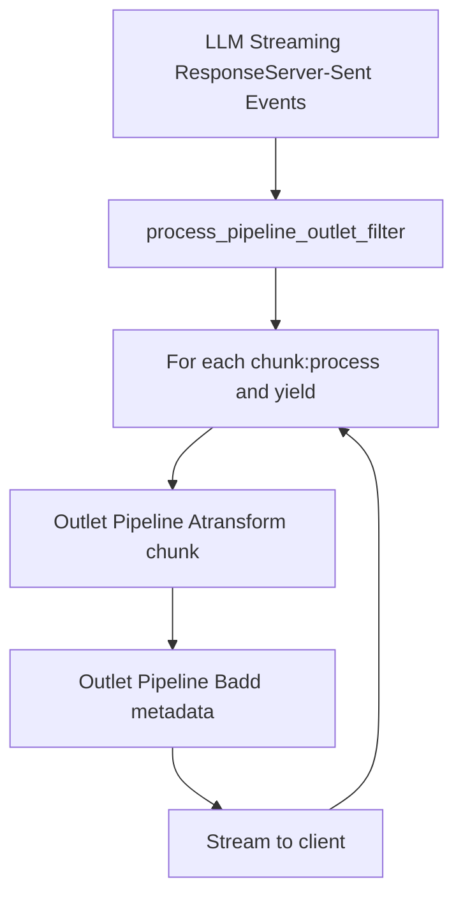
**Sources:** Based on streaming patterns in middleware

### Asynchronous Pipeline Execution

Pipelines should implement async methods (`async def inlet`, `async def outlet`) to avoid blocking the event loop during I/O operations.

**Best Practices:**

-   Use `async`/`await` for network requests
-   Use `asyncio.create_task()` for background operations
-   Avoid synchronous blocking calls (e.g., `time.sleep()`)

**Sources:** Based on async patterns in Python

### Performance Considerations

**Table: Pipeline Performance Optimization**

| Consideration | Impact | Recommendation |
| --- | --- | --- |
| Network latency | Adds delay to every request | Co-locate pipeline servers with Open WebUI |
| Processing time | Blocks request flow | Keep inlet/outlet logic minimal |
| External API calls | Variable latency | Cache results when possible |
| Memory usage | Affects server capacity | Avoid loading large models in pipelines |

**Sources:** Based on performance patterns

## Related Systems

-   **Tool Execution System (page 6.3)**: Function calling and tool integration
-   **Middleware System (page 6.2)**: Request/response processing pipeline
-   **Model Aggregation (page 13.1)**: How pipeline models appear in model list
-   **Configuration Management (page 11.2)**: Persistent configuration and settings

**Sources:** Cross-reference to related documentation pages

### Overview

Model pulling allows administrators to download models from Ollama.com directly through the UI. The system enforces a limit of 3 concurrent downloads, streams progress updates in real-time, and supports cancellation of in-progress downloads.

The pull operation is initiated when an admin user enters a model name in the search field that doesn't match any existing model. The system automatically displays a "Pull from Ollama.com" button.

**Sources:** [src/lib/components/chat/ModelSelector/Selector.svelte186-312](https://github.com/open-webui/open-webui/blob/a7271532/src/lib/components/chat/ModelSelector/Selector.svelte#L186-L312)

### Pull Model Flow

**Diagram: pullModelHandler Function Flow**

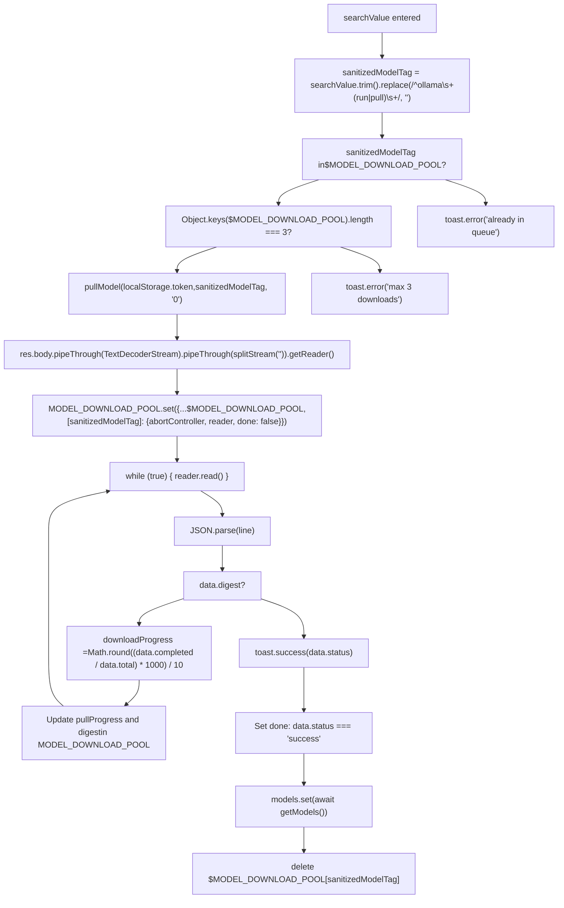
**Sources:** [src/lib/components/chat/ModelSelector/Selector.svelte186-312](https://github.com/open-webui/open-webui/blob/a7271532/src/lib/components/chat/ModelSelector/Selector.svelte#L186-L312)

### MODEL\_DOWNLOAD\_POOL Store Structure

The `MODEL_DOWNLOAD_POOL` Svelte store (imported from `$lib/stores`) tracks all active model downloads. Each entry is keyed by the sanitized model tag (e.g., `"llama2:7b"`).

**Table: MODEL\_DOWNLOAD\_POOL Entry Properties**

| Property | Type | Set When | Purpose |
| --- | --- | --- | --- |
| `abortController` | `AbortController` | Pull initiated | Cancels the fetch request via `.abort()` |
| `reader` | `ReadableStreamDefaultReader` | Pull initiated | Reads streaming response chunks |
| `done` | `boolean` | Pull initiated | `false` initially, `true` when `status === 'success'` |
| `pullProgress` | `number` | During download | Percentage (0-100) calculated from `data.completed/data.total` |
| `digest` | `string` | During download | Current layer SHA256 digest (e.g., `"sha256:abc123..."`) |

**Sources:** [src/lib/components/chat/ModelSelector/Selector.svelte218-226](https://github.com/open-webui/open-webui/blob/a7271532/src/lib/components/chat/ModelSelector/Selector.svelte#L218-L226) [src/lib/components/chat/ModelSelector/Selector.svelte255-262](https://github.com/open-webui/open-webui/blob/a7271532/src/lib/components/chat/ModelSelector/Selector.svelte#L255-L262)

### Streaming Protocol

The Ollama pull API returns a newline-delimited JSON stream. Each line represents a status update:

**Table: Ollama Pull Response Format**

| Field | Type | Example | Meaning |
| --- | --- | --- | --- |
| `status` | `string` | `"pulling manifest"` | Current operation description |
| `digest` | `string` | `"sha256:abc..."` | Layer being downloaded |
| `total` | `number` | `4366545270` | Layer size in bytes |
| `completed` | `number` | `1258291200` | Bytes downloaded so far |

The progress percentage is calculated as:

```
downloadProgress = Math.round((data.completed / data.total) * 1000) / 10
```
This formula multiplies by 1000 then divides by 10 to get one decimal place precision (e.g., 28.8%).

**Sources:** [src/lib/components/chat/ModelSelector/Selector.svelte247-253](https://github.com/open-webui/open-webui/blob/a7271532/src/lib/components/chat/ModelSelector/Selector.svelte#L247-L253)

### Download Queue UI Rendering

The download queue is rendered below the model list by iterating over `Object.keys($MODEL_DOWNLOAD_POOL)`. Each download entry displays:

**Table: Download Queue UI Elements**

| Element | Source | Displayed When |
| --- | --- | --- |
| Spinner | `<Spinner />` component | Always |
| Model name | `model` key | Always, wrapped in `Downloading "{model}"` |
| Progress percentage | `$MODEL_DOWNLOAD_POOL[model].pullProgress` | When `'pullProgress' in $MODEL_DOWNLOAD_POOL[model]` |
| Digest | `$MODEL_DOWNLOAD_POOL[model].digest` | When `'digest' in $MODEL_DOWNLOAD_POOL[model]` and digest exists |
| Cancel button | SVG with X icon | Always, triggers `cancelModelPullHandler(model)` |

**Sources:** [src/lib/components/chat/ModelSelector/Selector.svelte591-650](https://github.com/open-webui/open-webui/blob/a7271532/src/lib/components/chat/ModelSelector/Selector.svelte#L591-L650)

### Cancel Download Handler

**Diagram: cancelModelPullHandler Function Flow**

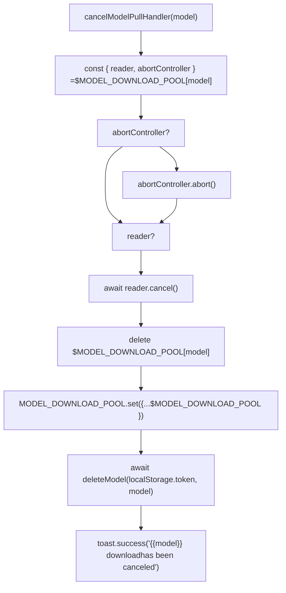
Canceling triggers `abortController.abort()` to stop the network request and `reader.cancel()` to release the stream. The partially downloaded model is then deleted from Ollama via `deleteModel` API call to clean up disk space.

**Sources:** [src/lib/components/chat/ModelSelector/Selector.svelte333-347](https://github.com/open-webui/open-webui/blob/a7271532/src/lib/components/chat/ModelSelector/Selector.svelte#L333-L347)

## Model Unloading

### Overview

Model unloading removes a model from Ollama's active memory (VRAM/RAM), freeing up resources. Ollama automatically loads models on first use and keeps them in memory until the configured timeout expires.

The unload button is displayed in `ModelItem.svelte` when all conditions are met:

-   User is admin: `$user?.role === 'admin'`
-   Model is from Ollama: `item.model.owned_by === 'ollama'`
-   Model is currently loaded: `item.model?.ollama?.expires_at` exists and is in the future

**Sources:** [src/lib/components/chat/ModelSelector/ModelItem.svelte231-247](https://github.com/open-webui/open-webui/blob/a7271532/src/lib/components/chat/ModelSelector/ModelItem.svelte#L231-L247)

### Unload Model Flow

**Diagram: unloadModelHandler Function Flow**

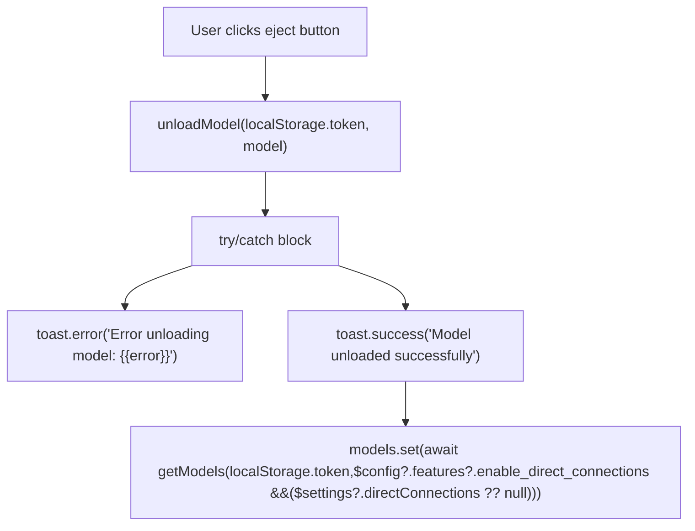
The `unloadModel` API call sends a request to the backend, which forwards it to Ollama's `POST /api/generate` endpoint with `keep_alive: 0` to immediately unload the model.

**Sources:** [src/lib/components/chat/ModelSelector/Selector.svelte349-363](https://github.com/open-webui/open-webui/blob/a7271532/src/lib/components/chat/ModelSelector/Selector.svelte#L349-L363)

### Loaded Model Indicator

**Table: Model Load Status Indicators**

| Condition | UI Indicator | Tooltip |
| --- | --- | --- |
| `expires_at` in future | Pulsing green dot | `"Unloads {{timeFromNow}}"` (e.g., "Unloads in 5 minutes") |
| `expires_at` is null/past | No indicator | Model not loaded |

The loaded status is determined by checking if `dayjs(item.model?.ollama?.expires_at).isAfter(dayjs())`.

**Sources:** [src/lib/components/chat/ModelSelector/ModelItem.svelte118-137](https://github.com/open-webui/open-webui/blob/a7271532/src/lib/components/chat/ModelSelector/ModelItem.svelte#L118-L137)

## Model Pinning

### Overview

Model pinning allows users to mark frequently-used models as favorites. Pinned models are stored in the `$settings.pinnedModels` array and persisted to the backend via `updateUserSettings` API.

The pinning state is displayed as a star icon in the model item menu. Pinned models can be sorted to appear at the top of the model list.

**Sources:** [src/lib/components/chat/ModelSelector.svelte28-39](https://github.com/open-webui/open-webui/blob/a7271532/src/lib/components/chat/ModelSelector.svelte#L28-L39)

### Pin Model Flow

**Diagram: pinModelHandler Function Flow**

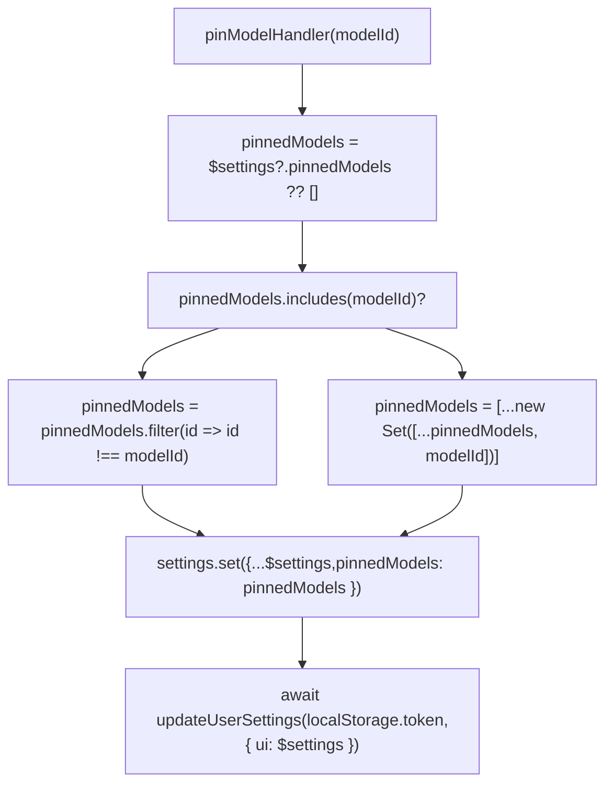
The pinning toggle is implemented as a set operation using `new Set()` to ensure no duplicate model IDs exist in the array.

**Sources:** [src/lib/components/chat/ModelSelector.svelte28-39](https://github.com/open-webui/open-webui/blob/a7271532/src/lib/components/chat/ModelSelector.svelte#L28-L39)

### Integration Points

**Table: Prop Drilling Path for pinModelHandler**

| Component | Prop Name | Purpose |
| --- | --- | --- |
| `ModelSelector.svelte` | Defines function | Top-level handler that updates `$settings` store |
| `Selector.svelte` | `pinModelHandler` | Passes handler to child components |
| `ModelItem.svelte` | `pinModelHandler` | Passes to menu component |
| `ModelItemMenu.svelte` | Called via `onClick` | Triggers when user clicks pin button |

**Sources:** [src/lib/components/chat/ModelSelector.svelte65](https://github.com/open-webui/open-webui/blob/a7271532/src/lib/components/chat/ModelSelector.svelte#L65-L65) [src/lib/components/chat/ModelSelector/Selector.svelte554](https://github.com/open-webui/open-webui/blob/a7271532/src/lib/components/chat/ModelSelector/Selector.svelte#L554-L554)

## Model Information Display

### Parameter and Size Information

For Ollama models, the system extracts and displays technical specifications from `model.ollama.details`:

**Table: Ollama Model Metadata Display**

| Field | Source Path | Example | Display Format |
| --- | --- | --- | --- |
| Parameter size | `model.ollama.details.parameter_size` | `"7B"` | Displayed as-is |
| Quantization | `model.ollama.details.quantization_level` | `"Q4_0"` | Displayed as-is |
| File size | `model.ollama.size` | `4366000000` | Converted to GB: `(size / 1024**3).toFixed(1)` |

These details appear in the model item subtitle, formatted as: `"7B Q4_0 • 4.1 GB"`

**Sources:** [src/lib/components/chat/ModelSelector/ModelItem.svelte97-117](https://github.com/open-webui/open-webui/blob/a7271532/src/lib/components/chat/ModelSelector/ModelItem.svelte#L97-L117)

### Connection Type Indicators

Models display visual badges indicating their connection architecture:

**Table: Connection Type Icons**

| `model.connection_type` / Flag | Icon Element | Tooltip | Meaning |
| --- | --- | --- | --- |
| `direct: true` | RSS/broadcast waves SVG | `"Direct Connection"` | Browser connects directly to model API |
| `external` | Link chain SVG | `"External"` | Routed through Open WebUI backend |
| `local` (default) | None | None | Local Ollama instance |

The connection type is also used for filtering in the model selector header (see page 9.1).

**Sources:** [src/lib/components/chat/ModelSelector/ModelItem.svelte161-200](https://github.com/open-webui/open-webui/blob/a7271532/src/lib/components/chat/ModelSelector/ModelItem.svelte#L161-L200)

### Tags Display

Models can have multiple tags defined in `model.tags` array. Each tag has properties: `{ name: string, ... }`.

**Table: Tag Display Locations**

| Location | Implementation | User Interaction |
| --- | --- | --- |
| Model selector header | Horizontal scrollable button list | Click to filter models |
| Model item | Tag icon with count badge | Hover for full tag list tooltip |

The tag filter is implemented in `Selector.svelte` by checking if tag names match `selectedTag.toLowerCase()`.

**Sources:** [src/lib/components/chat/ModelSelector/ModelItem.svelte141-159](https://github.com/open-webui/open-webui/blob/a7271532/src/lib/components/chat/ModelSelector/ModelItem.svelte#L141-L159) [src/lib/components/chat/ModelSelector/Selector.svelte451-544](https://github.com/open-webui/open-webui/blob/a7271532/src/lib/components/chat/ModelSelector/Selector.svelte#L451-L544)

### Model Description

If `model.info.meta.description` exists, an info icon (`i` in circle) appears next to the model name. Hovering shows a tooltip with the description rendered as HTML using `marked` library.

The parsing is done inline: `{@html marked.parse(item.model?.info?.meta?.description ?? '')}`

**Sources:** [src/lib/components/chat/ModelSelector/ModelItem.svelte202-225](https://github.com/open-webui/open-webui/blob/a7271532/src/lib/components/chat/ModelSelector/ModelItem.svelte#L202-L225)

## API Integration

### Ollama API Functions

The model operations integrate with functions imported from `$lib/apis/ollama`:

**Table: Ollama API Integration**

| Function | HTTP Method/Endpoint | Parameters | Return Type | Usage |
| --- | --- | --- | --- | --- |
| `pullModel` | `POST /ollama/api/pull` (streaming) | `token`, `modelTag`, `urlIdx` | `[Response, AbortController]` | Initiates model download |
| `unloadModel` | `POST /ollama/api/generate` | `token`, `model` | `Promise<void>` | Unloads model from memory |
| `deleteModel` | `DELETE /ollama/api/delete` | `token`, `model` | `Promise<void>` | Deletes model files |
| `getOllamaVersion` | `GET /ollama/api/version` | `token` | `Promise<string>` | Checks if Ollama is available |

**Sources:** [src/lib/components/chat/ModelSelector/Selector.svelte15](https://github.com/open-webui/open-webui/blob/a7271532/src/lib/components/chat/ModelSelector/Selector.svelte#L15-L15)

### Model List Refresh Pattern

After operations that modify model state, the system calls `getModels()` to refresh the `$models` store:

**Diagram: Model Refresh Pattern**

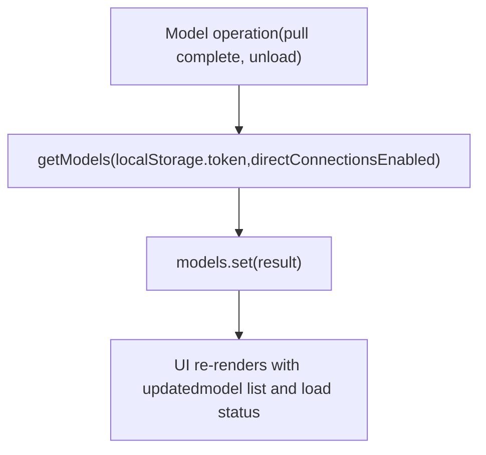
The `directConnections` parameter determines whether to include models from directly-connected providers in addition to proxied models.

**Sources:** [src/lib/components/chat/ModelSelector/Selector.svelte296-301](https://github.com/open-webui/open-webui/blob/a7271532/src/lib/components/chat/ModelSelector/Selector.svelte#L296-L301) [src/lib/components/chat/ModelSelector/Selector.svelte356-361](https://github.com/open-webui/open-webui/blob/a7271532/src/lib/components/chat/ModelSelector/Selector.svelte#L356-L361)

### Pull Model Button Visibility

The "Pull from Ollama.com" button is displayed when:

1.  `searchValue` is not empty
2.  `searchValue.trim()` is not already in `$MODEL_DOWNLOAD_POOL` (not currently downloading)
3.  `ollamaVersion` is truthy (Ollama is available)
4.  `$user?.role === 'admin'` (user is admin)

This logic is implemented at [src/lib/components/chat/ModelSelector/Selector.svelte571-589](https://github.com/open-webui/open-webui/blob/a7271532/src/lib/components/chat/ModelSelector/Selector.svelte#L571-L589)

**Sources:** [src/lib/components/chat/ModelSelector/Selector.svelte571-589](https://github.com/open-webui/open-webui/blob/a7271532/src/lib/components/chat/ModelSelector/Selector.svelte#L571-L589)

## User Permissions

Model operations respect the following permission checks:

| Operation | Permission Requirement |
| --- | --- |
| Pull model | `$user?.role === 'admin'` |
| Unload model | `$user?.role === 'admin'` |
| Pin model | Any authenticated user |
| View model info | Any authenticated user |

**Sources:** [src/lib/components/chat/ModelSelector/Selector.svelte547](https://github.com/open-webui/open-webui/blob/a7271532/src/lib/components/chat/ModelSelector/Selector.svelte#L547-L547) [src/lib/components/chat/ModelSelector/ModelItem.svelte231](https://github.com/open-webui/open-webui/blob/a7271532/src/lib/components/chat/ModelSelector/ModelItem.svelte#L231-L231)
