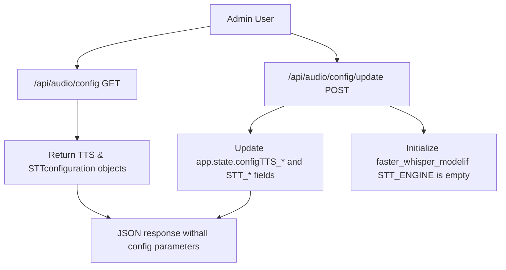
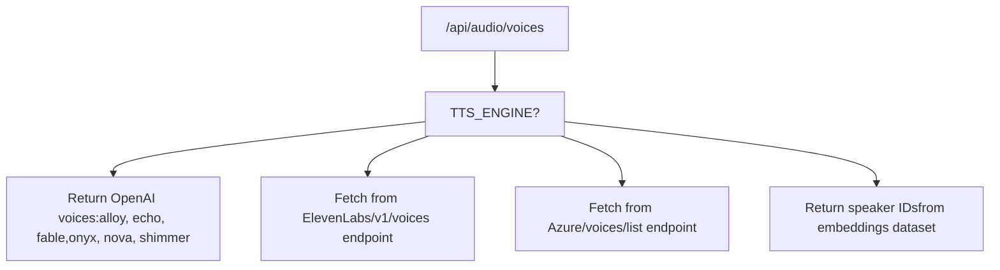
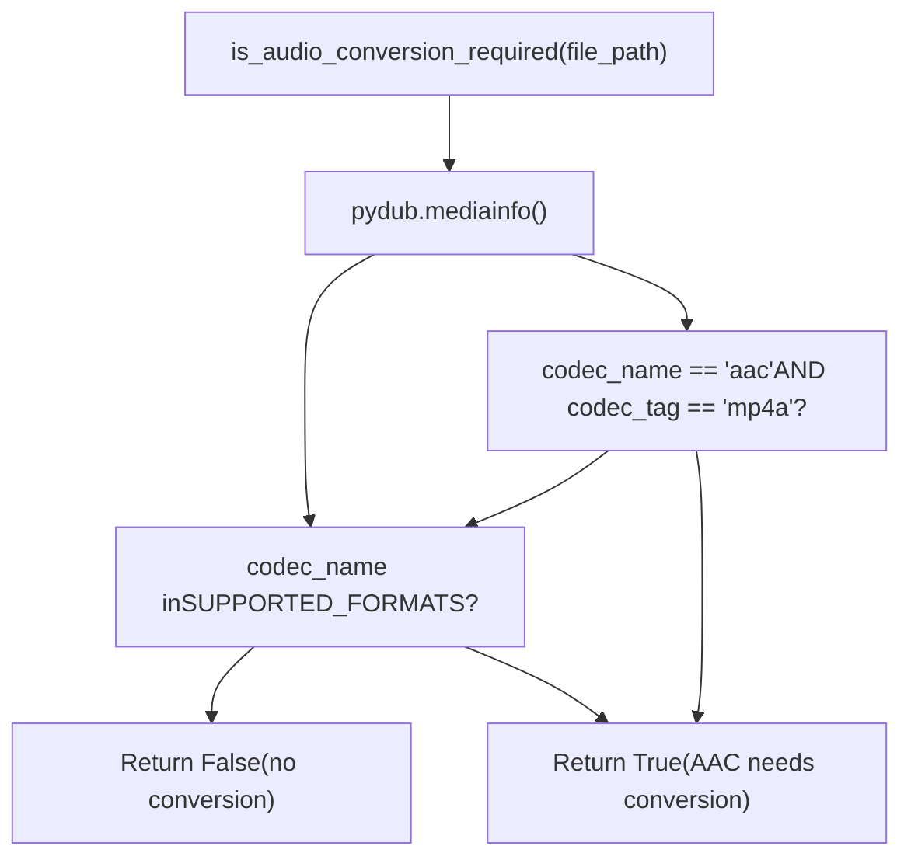

# Audio Processing

Relevant source files

-   [backend/open\_webui/env.py](https://github.com/open-webui/open-webui/blob/a7271532/backend/open_webui/env.py)
-   [backend/open\_webui/routers/audio.py](https://github.com/open-webui/open-webui/blob/a7271532/backend/open_webui/routers/audio.py)
-   [backend/open\_webui/routers/auths.py](https://github.com/open-webui/open-webui/blob/a7271532/backend/open_webui/routers/auths.py)
-   [backend/open\_webui/routers/ollama.py](https://github.com/open-webui/open-webui/blob/a7271532/backend/open_webui/routers/ollama.py)
-   [backend/open\_webui/routers/openai.py](https://github.com/open-webui/open-webui/blob/a7271532/backend/open_webui/routers/openai.py)
-   [backend/open\_webui/utils/auth.py](https://github.com/open-webui/open-webui/blob/a7271532/backend/open_webui/utils/auth.py)
-   [backend/open\_webui/utils/embeddings.py](https://github.com/open-webui/open-webui/blob/a7271532/backend/open_webui/utils/embeddings.py)
-   [backend/open\_webui/utils/misc.py](https://github.com/open-webui/open-webui/blob/a7271532/backend/open_webui/utils/misc.py)
-   [backend/open\_webui/utils/oauth.py](https://github.com/open-webui/open-webui/blob/a7271532/backend/open_webui/utils/oauth.py)
-   [backend/open\_webui/utils/response.py](https://github.com/open-webui/open-webui/blob/a7271532/backend/open_webui/utils/response.py)

## Purpose and Scope

This document covers the audio processing subsystems in Open WebUI, which enable voice-based interactions with AI models through Text-to-Speech (TTS) and Speech-to-Text (STT) capabilities. These systems support multiple backend engines and providers, allowing flexible deployment scenarios from cloud services to fully local implementations.

For LLM integration and model management, see [LLM Provider Integration](/open-webui/open-webui/13-llm-provider-integration).

**Sources:** [backend/open\_webui/routers/audio.py1-900](https://github.com/open-webui/open-webui/blob/a7271532/backend/open_webui/routers/audio.py#L1-L900)

---

## System Architecture

```mermaid
flowchart TD
    AudioRouter["audio.py APIRouter"]
    ConfigEndpoints["/config endpoints"]
    TTSEndpoint["/speech POST"]
    STTEndpoint["/transcriptions POST"]
    VoicesEndpoint["/voices GET"]
    OpenAITTS["OpenAI TTSTTS_OPENAI_API_BASE_URL"]
    ElevenLabs["ElevenLabsELEVENLABS_API_BASE_URL"]
    AzureTTS["Azure SpeechTTS_AZURE_SPEECH_REGION"]
    TransformersTTS["Transformers Pipelinespeecht5_tts"]
    WhisperLocal["Faster Whisperfaster_whisper_model"]
    OpenAISTT["OpenAI Whisper APISTT_OPENAI_API_BASE_URL"]
    AzureSTT["Azure Speech ServicesAUDIO_STT_AZURE_API_KEY"]
    Deepgram["DeepgramDEEPGRAM_API_KEY"]
    MistralSTT["Mistral AudioAUDIO_STT_MISTRAL_API_KEY"]
    FormatConversion["Audio Format Conversionis_audio_conversion_requiredconvert_audio_to_mp3"]
    SilenceDetection["Silence Detection & Chunkingsplit_on_silence"]
    SpeechCache["Speech CacheCACHE_DIR/audio/speech"]
    UploadDir["Upload DirectoryUPLOAD_DIR"]

    AudioRouter --> ConfigEndpoints
    AudioRouter --> TTSEndpoint
    AudioRouter --> STTEndpoint
    AudioRouter --> VoicesEndpoint
    TTSEndpoint --> OpenAITTS
    TTSEndpoint --> ElevenLabs
    TTSEndpoint --> AzureTTS
    TTSEndpoint --> TransformersTTS
    TTSEndpoint --> SpeechCache
    STTEndpoint --> FormatConversion
    FormatConversion --> WhisperLocal
    FormatConversion --> OpenAISTT
    FormatConversion --> AzureSTT
    FormatConversion --> Deepgram
    FormatConversion --> MistralSTT
    STTEndpoint --> SilenceDetection
    STTEndpoint --> UploadDir
```


**Sources:** [backend/open\_webui/routers/audio.py1-900](https://github.com/open-webui/open-webui/blob/a7271532/backend/open_webui/routers/audio.py#L1-L900) [backend/open\_webui/config.py1-100](https://github.com/open-webui/open-webui/blob/a7271532/backend/open_webui/config.py#L1-L100)

---

## Configuration System

Audio configuration is managed through persistent application config with dedicated forms for TTS and STT settings.

### Configuration Models

| Model | Purpose | Key Fields |
| --- | --- | --- |
| `TTSConfigForm` | TTS engine settings | `ENGINE`, `MODEL`, `VOICE`, `OPENAI_API_BASE_URL`, `API_KEY`, `SPLIT_ON`, `AZURE_SPEECH_REGION` |
| `STTConfigForm` | STT engine settings | `ENGINE`, `MODEL`, `WHISPER_MODEL`, `DEEPGRAM_API_KEY`, `AZURE_API_KEY`, `MISTRAL_API_KEY`, `SUPPORTED_CONTENT_TYPES` |
| `AudioConfigUpdateForm` | Combined update form | `tts: TTSConfigForm`, `stt: STTConfigForm` |

**Sources:** [backend/open\_webui/routers/audio.py155-189](https://github.com/open-webui/open-webui/blob/a7271532/backend/open_webui/routers/audio.py#L155-L189)

### Configuration Endpoints


The `GET /api/audio/config` endpoint retrieves current configuration:

```
{
  "tts": {
    "OPENAI_API_BASE_URL": "...",
    "OPENAI_API_KEY": "...",
    "ENGINE": "openai",
    "MODEL": "tts-1",
    "VOICE": "alloy",
    "SPLIT_ON": "sentence",
    ...
  },
  "stt": {
    "OPENAI_API_BASE_URL": "...",
    "ENGINE": "whisper",
    "MODEL": "whisper-1",
    "WHISPER_MODEL": "base",
    ...
  }
}
```
The `POST /api/audio/config/update` endpoint updates configuration and reinitializes the Whisper model if needed.

**Sources:** [backend/open\_webui/routers/audio.py192-311](https://github.com/open-webui/open-webui/blob/a7271532/backend/open_webui/routers/audio.py#L192-L311)

---

## Text-to-Speech System

The TTS system converts text to speech audio files using configurable backend engines, with an integrated caching layer to avoid redundant generation.

### Supported Engines

| Engine | Config Value | Requirements | Models |
| --- | --- | --- | --- |
| OpenAI | `TTS_ENGINE="openai"` | `TTS_OPENAI_API_BASE_URL`, `TTS_OPENAI_API_KEY` | `tts-1`, `tts-1-hd` |
| ElevenLabs | `TTS_ENGINE="elevenlabs"` | `TTS_API_KEY`, `ELEVENLABS_API_BASE_URL` | `eleven_monolingual_v1`, `eleven_multilingual_v2` |
| Azure Speech | `TTS_ENGINE="azure"` | `TTS_AZURE_SPEECH_REGION`, `TTS_AZURE_SPEECH_OUTPUT_FORMAT` | Various neural voices |
| Transformers | `TTS_ENGINE="transformers"` | Local model, speaker embeddings dataset | `microsoft/speecht5_tts` |

**Sources:** [backend/open\_webui/routers/audio.py329-600](https://github.com/open-webui/open-webui/blob/a7271532/backend/open_webui/routers/audio.py#L329-L600)

### Request Processing Flow

> **[Mermaid sequence]**
> *(图表结构无法解析)*

The caching mechanism uses SHA256 hashing of the request body plus engine/model identifiers to generate unique cache keys. Both the audio file and original request JSON are stored.

**Sources:** [backend/open\_webui/routers/audio.py329-600](https://github.com/open-webui/open-webui/blob/a7271532/backend/open_webui/routers/audio.py#L329-L600)

### OpenAI TTS Implementation

For the OpenAI engine, the system:

1.  Sets `payload["model"]` to `request.app.state.config.TTS_MODEL`
2.  Merges in `TTS_OPENAI_PARAMS` for additional parameters
3.  Makes an async POST to `{TTS_OPENAI_API_BASE_URL}/audio/speech`
4.  Includes user info headers if `ENABLE_FORWARD_USER_INFO_HEADERS` is true
5.  Saves response to cache directory and returns `FileResponse`

**Sources:** [backend/open\_webui/routers/audio.py353-410](https://github.com/open-webui/open-webui/blob/a7271532/backend/open_webui/routers/audio.py#L353-L410)

### ElevenLabs TTS Implementation

For the ElevenLabs engine:

1.  Extracts `voice_id` from payload, validates against `get_available_voices()`
2.  POSTs to `{ELEVENLABS_API_BASE_URL}/v1/text-to-speech/{voice_id}`
3.  Uses `TTS_MODEL` (e.g., `eleven_monolingual_v1`) with default voice settings
4.  Returns cached audio file

**Sources:** [backend/open\_webui/routers/audio.py412-461](https://github.com/open-webui/open-webui/blob/a7271532/backend/open_webui/routers/audio.py#L412-L461)

### Azure Speech TTS Implementation

Azure Speech uses the Speech SDK with SSML formatting:

1.  Constructs SSML XML with configured voice and language
2.  Uses `TTS_AZURE_SPEECH_OUTPUT_FORMAT` (default: `audio-24khz-48kbitrate-mono-mp3`)
3.  Supports text splitting on sentence or paragraph boundaries via `TTS_SPLIT_ON`
4.  Processes chunks with `ThreadPoolExecutor` for parallel synthesis
5.  Concatenates audio segments using `pydub.AudioSegment`

**Sources:** [backend/open\_webui/routers/audio.py462-550](https://github.com/open-webui/open-webui/blob/a7271532/backend/open_webui/routers/audio.py#L462-L550)

### Transformers (Local) TTS Implementation

The local Transformers pipeline:

1.  Lazy-loads pipeline via `load_speech_pipeline()` on first use
2.  Uses `microsoft/speecht5_tts` model from HuggingFace
3.  Loads speaker embeddings from `Matthijs/cmu-arctic-xvectors` dataset
4.  Generates audio using `pipeline(text, forward_params={"speaker_embeddings": ...})`
5.  Exports as MP3 using `scipy` and `pydub`

**Sources:** [backend/open\_webui/routers/audio.py314-327](https://github.com/open-webui/open-webui/blob/a7271532/backend/open_webui/routers/audio.py#L314-L327) [backend/open\_webui/routers/audio.py551-600](https://github.com/open-webui/open-webui/blob/a7271532/backend/open_webui/routers/audio.py#L551-L600)

### Voice Management

The `/api/audio/voices` endpoint returns available voices based on the configured engine:


**Sources:** [backend/open\_webui/routers/audio.py602-700](https://github.com/open-webui/open-webui/blob/a7271532/backend/open_webui/routers/audio.py#L602-L700)

---

## Speech-to-Text System

The STT system transcribes audio files to text using multiple backend engines, with preprocessing for format conversion and optional chunking for large files.

### Supported Engines

| Engine | Config Value | Requirements | Features |
| --- | --- | --- | --- |
| Faster Whisper | `STT_ENGINE=""` (default) | `WHISPER_MODEL` (e.g., `base`, `medium`, `large-v3`) | Local inference, CUDA support, language detection |
| OpenAI Whisper | `STT_ENGINE="openai"` | `STT_OPENAI_API_BASE_URL`, `STT_OPENAI_API_KEY` | Cloud API, prompt support |
| Azure Speech | `STT_ENGINE="azure"` | `AUDIO_STT_AZURE_API_KEY`, `AUDIO_STT_AZURE_REGION` | Speaker diarization, multiple locales |
| Deepgram | `STT_ENGINE="deepgram"` | `DEEPGRAM_API_KEY` | Real-time streaming support |
| Mistral | `STT_ENGINE="mistral"` | `AUDIO_STT_MISTRAL_API_KEY` | Chat completions or audio/transcriptions endpoint |

**Sources:** [backend/open\_webui/routers/audio.py701-900](https://github.com/open-webui/open-webui/blob/a7271532/backend/open_webui/routers/audio.py#L701-L900)

### Request Processing Flow

> **[Mermaid sequence]**
> *(图表结构无法解析)*

**Sources:** [backend/open\_webui/routers/audio.py701-900](https://github.com/open-webui/open-webui/blob/a7271532/backend/open_webui/routers/audio.py#L701-L900)

### Audio Format Conversion

The system validates and converts audio files to ensure compatibility:


The `convert_audio_to_mp3()` function uses `pydub.AudioSegment` to transcode to MP3 format.

**Sources:** [backend/open\_webui/routers/audio.py81-122](https://github.com/open-webui/open-webui/blob/a7271532/backend/open_webui/routers/audio.py#L81-L122)

### File Size Limits

| Engine | Max Size | Constant |
| --- | --- | --- |
| Default | 20 MB | `MAX_FILE_SIZE` |
| Azure | 200 MB | `AZURE_MAX_FILE_SIZE` |

**Sources:** [backend/open\_webui/routers/audio.py60-63](https://github.com/open-webui/open-webui/blob/a7271532/backend/open_webui/routers/audio.py#L60-L63)

### Faster Whisper (Local) Implementation

The local Whisper implementation uses `faster-whisper` for efficient CPU/GPU inference:

1.  Model initialization via `set_faster_whisper_model()`:

    -   Downloads model to `WHISPER_MODEL_DIR` if not present
    -   Uses CUDA if `DEVICE_TYPE == "cuda"`, otherwise CPU
    -   Supports quantization with `compute_type="int8"`
2.  Large file chunking:

    -   For files > 20MB, uses `split_on_silence()` to detect silence
    -   Processes chunks separately with `ThreadPoolExecutor`
    -   Concatenates transcriptions
3.  Transcription parameters:

    -   `language`: Auto-detect or use `WHISPER_LANGUAGE`
    -   `initial_prompt`: Optional context for better accuracy
    -   Returns segments with timestamps if requested

**Sources:** [backend/open\_webui/routers/audio.py124-146](https://github.com/open-webui/open-webui/blob/a7271532/backend/open_webui/routers/audio.py#L124-L146) [backend/open\_webui/routers/audio.py701-780](https://github.com/open-webui/open-webui/blob/a7271532/backend/open_webui/routers/audio.py#L701-L780)

### OpenAI Whisper API Implementation

For the OpenAI Whisper engine:

1.  POSTs multipart/form-data to `{STT_OPENAI_API_BASE_URL}/audio/transcriptions`
2.  Includes file, model, language, and prompt parameters
3.  Sets `response_format` based on request (default: `json`)
4.  Parses response and returns text

**Sources:** [backend/open\_webui/routers/audio.py781-820](https://github.com/open-webui/open-webui/blob/a7271532/backend/open_webui/routers/audio.py#L781-L820)

### Azure Speech Services Implementation

Azure Speech supports advanced features:

1.  **Speaker Diarization**: When `AUDIO_STT_AZURE_MAX_SPEAKERS` > 1

    -   Uses `/speechtotext/transcriptions:transcribe` endpoint
    -   Returns transcription with speaker labels
    -   Formats output with timestamps
2.  **Multiple Locales**: Supports comma-separated locale list in `AUDIO_STT_AZURE_LOCALES`

3.  **Authentication**: Uses `AUDIO_STT_AZURE_API_KEY` with `Ocp-Apim-Subscription-Key` header


**Sources:** [backend/open\_webui/routers/audio.py821-857](https://github.com/open-webui/open-webui/blob/a7271532/backend/open_webui/routers/audio.py#L821-L857)

### Deepgram Implementation

Deepgram transcription flow:

1.  POSTs audio file to `https://api.deepgram.com/v1/listen`
2.  Uses query parameters: `model`, `language`, `detect_language=true`
3.  Parses nested response: `response["results"]["channels"][0]["alternatives"][0]["transcript"]`

**Sources:** [backend/open\_webui/routers/audio.py858-880](https://github.com/open-webui/open-webui/blob/a7271532/backend/open_webui/routers/audio.py#L858-L880)

### Mistral Audio Implementation

Mistral supports two modes via `AUDIO_STT_MISTRAL_USE_CHAT_COMPLETIONS`:

1.  **Chat Completions Mode**:

    -   POSTs to `/v1/chat/completions` with image content type `audio_url`
    -   Extracts text from chat response
2.  **Audio Transcriptions Mode**:

    -   POSTs to `/v1/audio/transcriptions` endpoint
    -   Standard transcription response format

**Sources:** [backend/open\_webui/routers/audio.py881-900](https://github.com/open-webui/open-webui/blob/a7271532/backend/open_webui/routers/audio.py#L881-L900)

---

## API Endpoints Reference

| Endpoint | Method | Auth | Purpose |
| --- | --- | --- | --- |
| `/api/audio/config` | GET | Admin | Retrieve TTS/STT configuration |
| `/api/audio/config/update` | POST | Admin | Update TTS/STT configuration |
| `/api/audio/speech` | POST | User | Generate speech from text (TTS) |
| `/api/audio/transcriptions` | POST | User | Transcribe audio to text (STT) |
| `/api/audio/voices` | GET | User | List available voices for current TTS engine |

**Sources:** [backend/open\_webui/routers/audio.py57-900](https://github.com/open-webui/open-webui/blob/a7271532/backend/open_webui/routers/audio.py#L57-L900)

### Request/Response Examples

**TTS Request:**

```
{
  "model": "tts-1",
  "input": "Hello, this is a test.",
  "voice": "alloy"
}
```
**TTS Response:** Binary audio file (MP3 format)

**STT Request:** Multipart form-data with:

-   `file`: Audio file (mp3, wav, m4a, etc.)
-   `model`: Optional model identifier
-   `language`: Optional language code
-   `prompt`: Optional context for better accuracy

**STT Response:**

```
{
  "text": "Hello, this is a test."
}
```
**Sources:** [backend/open\_webui/routers/audio.py329-900](https://github.com/open-webui/open-webui/blob/a7271532/backend/open_webui/routers/audio.py#L329-L900)

---

## Caching Strategy

TTS responses are aggressively cached to reduce API costs and improve response times.

### Cache Key Generation

```
# Cache key = SHA256(request_body + TTS_ENGINE + TTS_MODEL)
name = hashlib.sha256(
    body
    + str(request.app.state.config.TTS_ENGINE).encode("utf-8")
    + str(request.app.state.config.TTS_MODEL).encode("utf-8")
).hexdigest()

file_path = SPEECH_CACHE_DIR / f"{name}.mp3"
file_body_path = SPEECH_CACHE_DIR / f"{name}.json"
```
The cache stores:

1.  **Audio file**: `{hash}.mp3` - Generated audio
2.  **Request metadata**: `{hash}.json` - Original request parameters

This ensures identical requests return cached responses without hitting external APIs.

**Sources:** [backend/open\_webui/routers/audio.py67-68](https://github.com/open-webui/open-webui/blob/a7271532/backend/open_webui/routers/audio.py#L67-L68) [backend/open\_webui/routers/audio.py332-343](https://github.com/open-webui/open-webui/blob/a7271532/backend/open_webui/routers/audio.py#L332-L343)

---

## Integration with Chat System

Audio processing integrates with the main chat interface through:

1.  **Message Playback**: TTS endpoint called with message content
2.  **Voice Input**: STT endpoint processes recorded audio, inserting text into message input
3.  **User Headers**: `ENABLE_FORWARD_USER_INFO_HEADERS` propagates user context to external APIs
4.  **Metadata**: Chat ID included in headers for tracking and auditing

**Sources:** [backend/open\_webui/routers/audio.py370-371](https://github.com/open-webui/open-webui/blob/a7271532/backend/open_webui/routers/audio.py#L370-L371) [backend/open\_webui/env.py52-54](https://github.com/open-webui/open-webui/blob/a7271532/backend/open_webui/env.py#L52-L54)

---

## Environment Configuration

Key environment variables for audio processing:

### Text-to-Speech

-   `TTS_ENGINE`: Engine selection (openai, elevenlabs, azure, transformers)
-   `TTS_OPENAI_API_BASE_URL`, `TTS_OPENAI_API_KEY`: OpenAI configuration
-   `TTS_API_KEY`: ElevenLabs API key
-   `TTS_MODEL`: Model identifier for current engine
-   `TTS_VOICE`: Voice identifier
-   `TTS_SPLIT_ON`: Text splitting strategy (sentence, paragraph)
-   `TTS_AZURE_SPEECH_REGION`, `TTS_AZURE_SPEECH_OUTPUT_FORMAT`: Azure configuration

### Speech-to-Text

-   `STT_ENGINE`: Engine selection (empty for local Whisper, openai, azure, deepgram, mistral)
-   `STT_OPENAI_API_BASE_URL`, `STT_OPENAI_API_KEY`: OpenAI configuration
-   `WHISPER_MODEL`: Local Whisper model size (base, medium, large-v3)
-   `WHISPER_MODEL_DIR`: Directory for downloaded Whisper models
-   `WHISPER_MODEL_AUTO_UPDATE`: Auto-download latest model versions
-   `WHISPER_LANGUAGE`: Default language for transcription
-   `DEEPGRAM_API_KEY`: Deepgram API key
-   `AUDIO_STT_AZURE_API_KEY`, `AUDIO_STT_AZURE_REGION`: Azure configuration
-   `AUDIO_STT_MISTRAL_API_KEY`, `AUDIO_STT_MISTRAL_API_BASE_URL`: Mistral configuration

### System

-   `CACHE_DIR`: Base cache directory (includes `audio/speech` subdirectory)
-   `DEVICE_TYPE`: Hardware acceleration (cpu, cuda, mps)
-   `ENABLE_FORWARD_USER_INFO_HEADERS`: Include user context in API requests

**Sources:** [backend/open\_webui/env.py1-889](https://github.com/open-webui/open-webui/blob/a7271532/backend/open_webui/env.py#L1-L889) [backend/open\_webui/config.py40-45](https://github.com/open-webui/open-webui/blob/a7271532/backend/open_webui/config.py#L40-L45)
