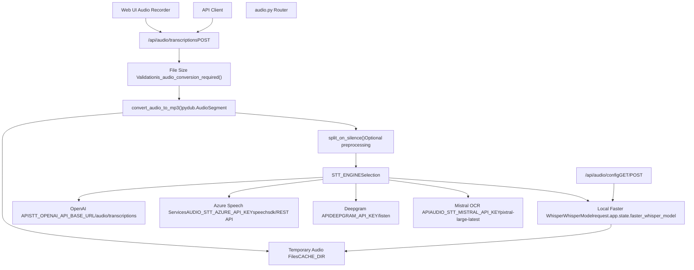
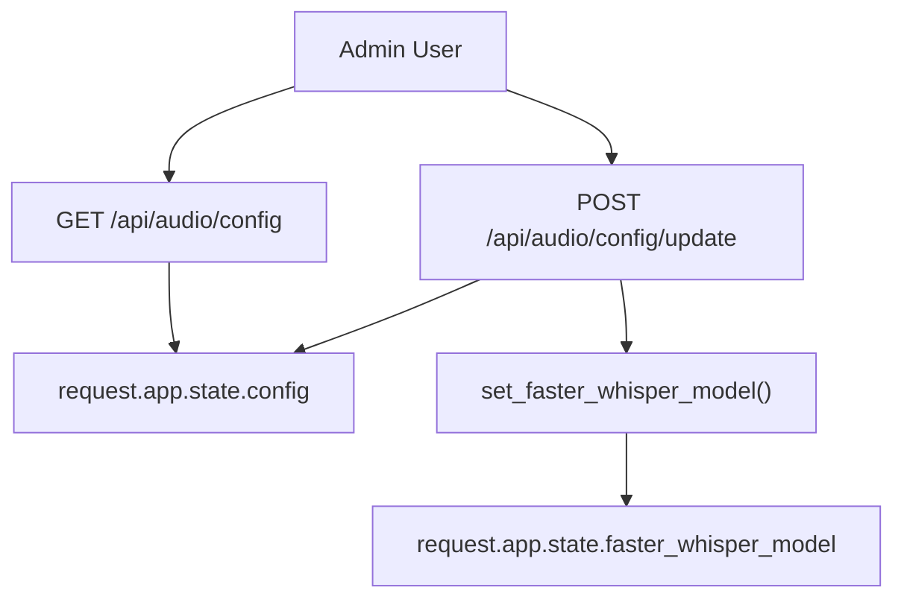
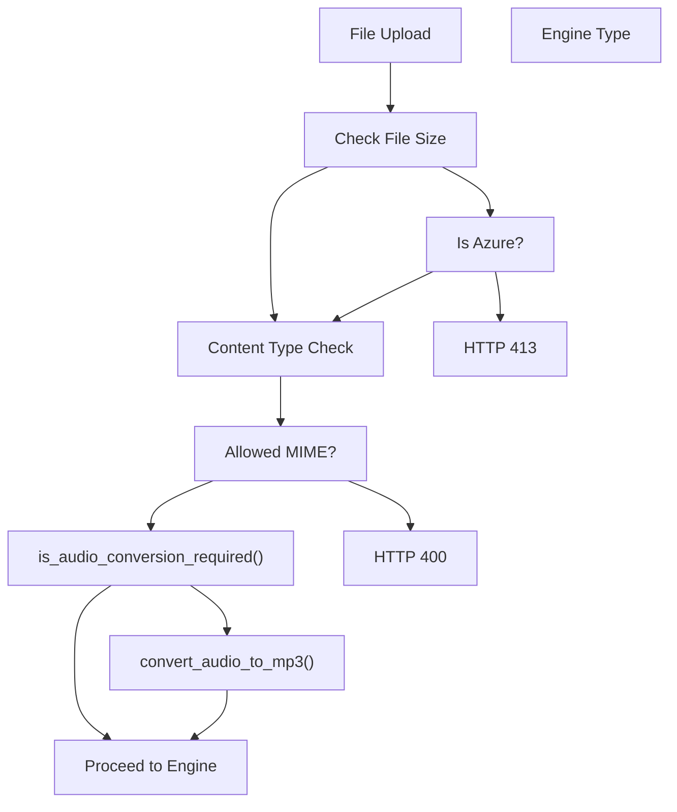
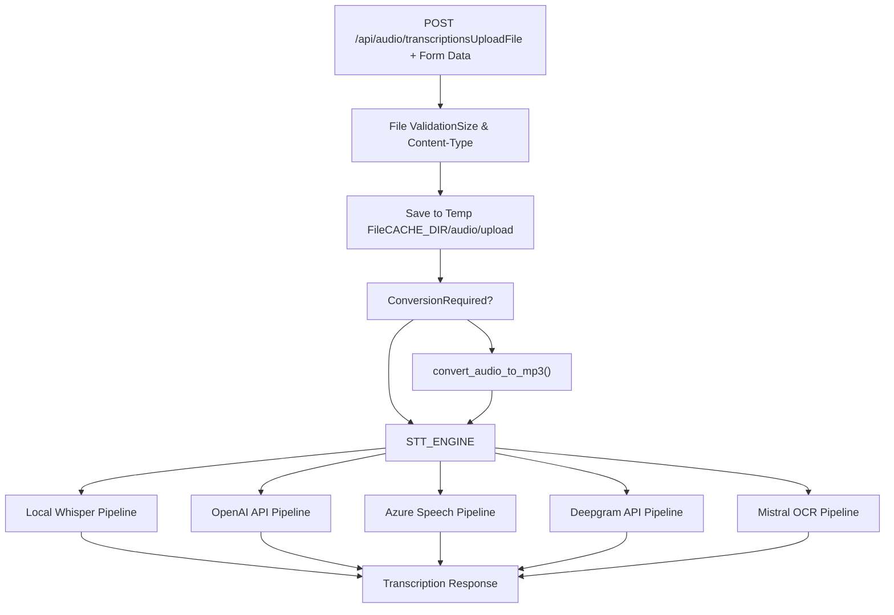
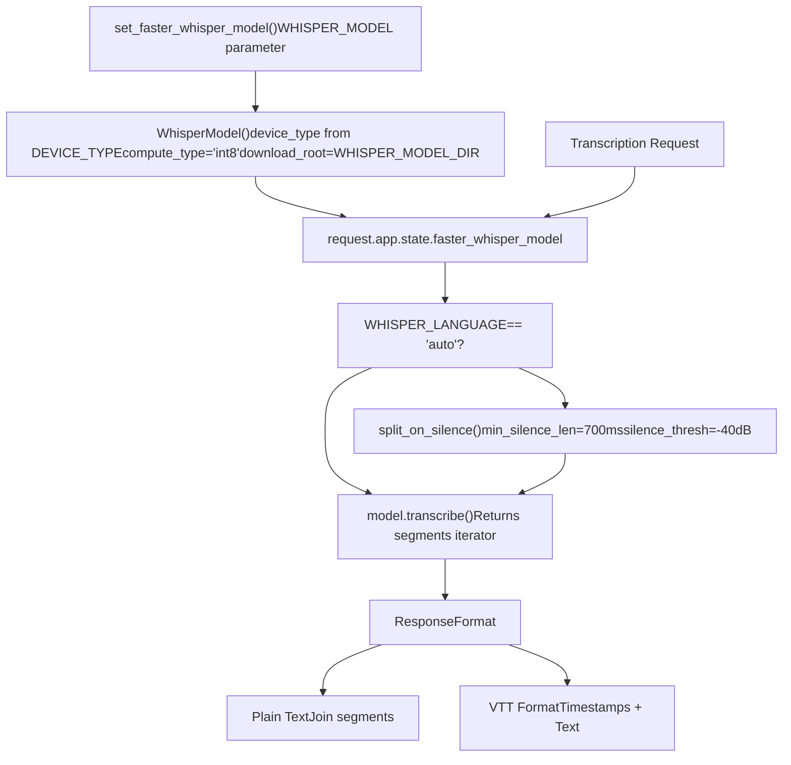
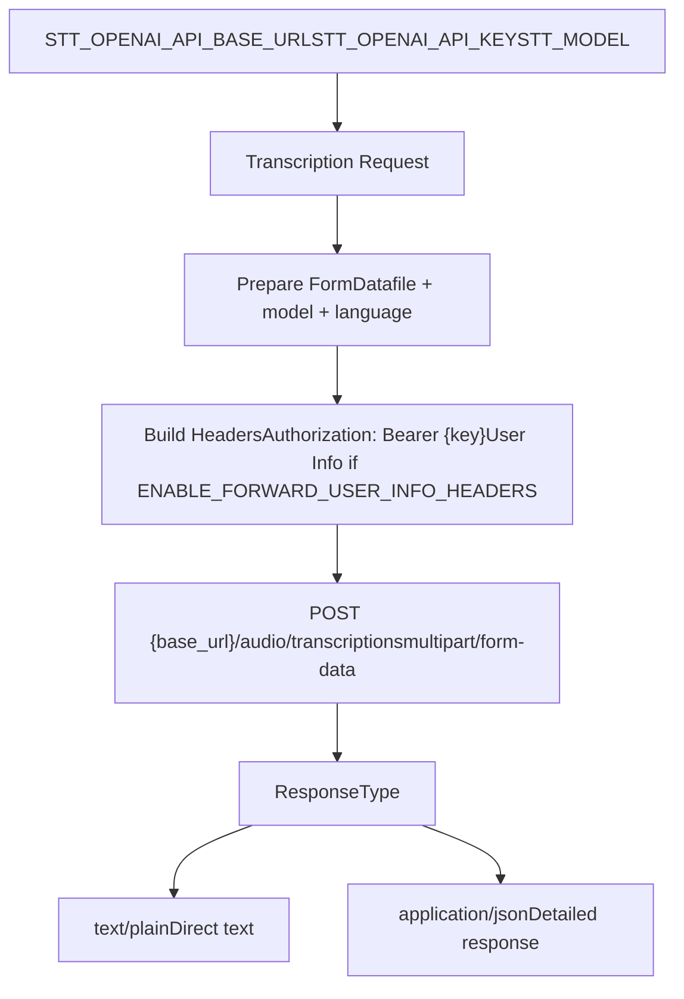
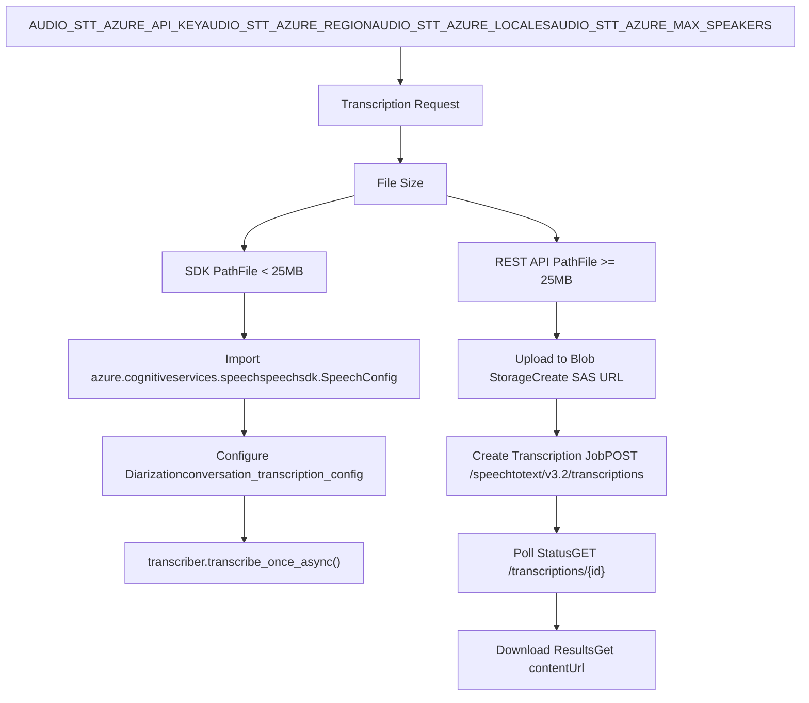
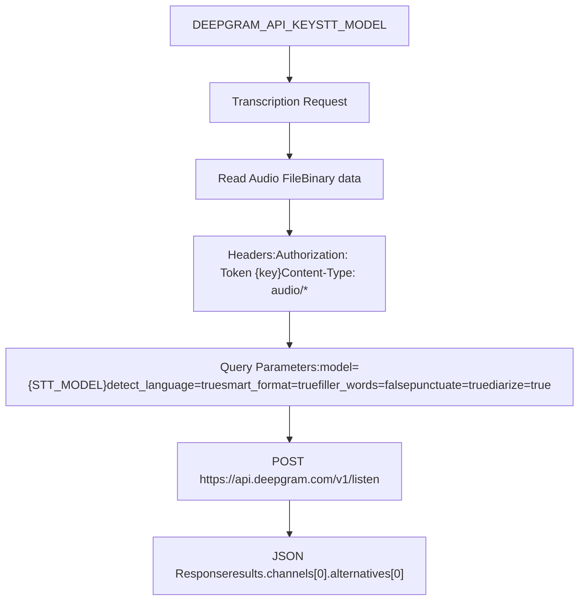
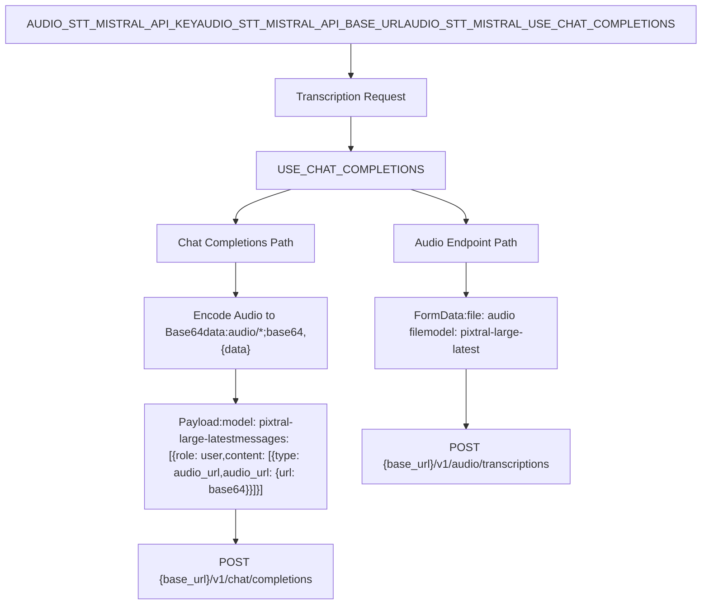

# Speech-to-Text System

Relevant source files

-   [backend/open\_webui/env.py](https://github.com/open-webui/open-webui/blob/a7271532/backend/open_webui/env.py)
-   [backend/open\_webui/routers/audio.py](https://github.com/open-webui/open-webui/blob/a7271532/backend/open_webui/routers/audio.py)
-   [backend/open\_webui/routers/auths.py](https://github.com/open-webui/open-webui/blob/a7271532/backend/open_webui/routers/auths.py)
-   [backend/open\_webui/routers/ollama.py](https://github.com/open-webui/open-webui/blob/a7271532/backend/open_webui/routers/ollama.py)
-   [backend/open\_webui/routers/openai.py](https://github.com/open-webui/open-webui/blob/a7271532/backend/open_webui/routers/openai.py)
-   [backend/open\_webui/utils/auth.py](https://github.com/open-webui/open-webui/blob/a7271532/backend/open_webui/utils/auth.py)
-   [backend/open\_webui/utils/embeddings.py](https://github.com/open-webui/open-webui/blob/a7271532/backend/open_webui/utils/embeddings.py)
-   [backend/open\_webui/utils/misc.py](https://github.com/open-webui/open-webui/blob/a7271532/backend/open_webui/utils/misc.py)
-   [backend/open\_webui/utils/oauth.py](https://github.com/open-webui/open-webui/blob/a7271532/backend/open_webui/utils/oauth.py)
-   [backend/open\_webui/utils/response.py](https://github.com/open-webui/open-webui/blob/a7271532/backend/open_webui/utils/response.py)

## Purpose and Scope

This document covers the Speech-to-Text (STT) system in Open WebUI, which converts audio recordings into text transcriptions. The system supports multiple transcription engines including local Whisper models, OpenAI API, Azure Speech Services, Deepgram, and Mistral OCR. For Text-to-Speech functionality, see [14.1](/open-webui/open-webui/14.1-text-to-speech-system).

## System Architecture

The STT system is implemented in [backend/open\_webui/routers/audio.py](https://github.com/open-webui/open-webui/blob/a7271532/backend/open_webui/routers/audio.py) and provides a unified API interface that routes transcription requests to different backend engines based on configuration. The system handles audio format conversion, file size validation, and preprocessing before sending to the selected engine.


**Sources:** [backend/open\_webui/routers/audio.py57-1089](https://github.com/open-webui/open-webui/blob/a7271532/backend/open_webui/routers/audio.py#L57-L1089)

## Configuration System

The STT system is configured through the `STTConfigForm` model and persisted in `request.app.state.config`. Configuration can be updated via the admin API.

### Configuration Data Model

| Field | Type | Purpose |
| --- | --- | --- |
| `OPENAI_API_BASE_URL` | str | Base URL for OpenAI-compatible API |
| `OPENAI_API_KEY` | str | API key for OpenAI service |
| `ENGINE` | str | Selected engine: "", "openai", "azure", "deepgram", "mistral" |
| `MODEL` | str | Model identifier for the selected engine |
| `SUPPORTED_CONTENT_TYPES` | list\[str\] | Allowed MIME types for uploads |
| `WHISPER_MODEL` | str | Local Whisper model name (tiny, base, small, medium, large) |
| `DEEPGRAM_API_KEY` | str | Deepgram service API key |
| `AZURE_API_KEY` | str | Azure Speech Services key |
| `AZURE_REGION` | str | Azure deployment region |
| `AZURE_LOCALES` | str | Comma-separated locale codes for Azure |
| `AZURE_BASE_URL` | str | Custom Azure endpoint URL |
| `AZURE_MAX_SPEAKERS` | str | Maximum speakers for diarization |
| `MISTRAL_API_KEY` | str | Mistral API key |
| `MISTRAL_API_BASE_URL` | str | Mistral API endpoint |
| `MISTRAL_USE_CHAT_COMPLETIONS` | bool | Use chat completions endpoint vs audio endpoint |

**Sources:** [backend/open\_webui/routers/audio.py169-185](https://github.com/open-webui/open-webui/blob/a7271532/backend/open_webui/routers/audio.py#L169-L185)

### Configuration Endpoints


The configuration endpoints at [backend/open\_webui/routers/audio.py192-311](https://github.com/open-webui/open-webui/blob/a7271532/backend/open_webui/routers/audio.py#L192-L311) provide:

-   **GET `/api/audio/config`**: Returns current STT configuration (admin only)
-   **POST `/api/audio/config/update`**: Updates configuration and reinitializes local Whisper model if needed

When the engine is set to empty string (local Whisper), the system calls `set_faster_whisper_model()` at [backend/open\_webui/routers/audio.py124-145](https://github.com/open-webui/open-webui/blob/a7271532/backend/open_webui/routers/audio.py#L124-L145) to initialize `request.app.state.faster_whisper_model`.

**Sources:** [backend/open\_webui/routers/audio.py192-311](https://github.com/open-webui/open-webui/blob/a7271532/backend/open_webui/routers/audio.py#L192-L311) [backend/open\_webui/routers/audio.py124-145](https://github.com/open-webui/open-webui/blob/a7271532/backend/open_webui/routers/audio.py#L124-L145)

## Audio File Processing

Before transcription, audio files undergo validation and optional conversion to ensure compatibility with the selected engine.

### File Size Validation


**File Size Constants:**

-   Standard engines: `MAX_FILE_SIZE = 20MB` (line 61)
-   Azure Speech Services: `AZURE_MAX_FILE_SIZE = 200MB` (line 63)

**Format Detection and Conversion:** The function `is_audio_conversion_required()` at [backend/open\_webui/routers/audio.py81-108](https://github.com/open-webui/open-webui/blob/a7271532/backend/open_webui/routers/audio.py#L81-L108) uses `pydub.utils.mediainfo()` to inspect the codec. If the file is AAC/mp4a or uses an unsupported codec, `convert_audio_to_mp3()` at [backend/open\_webui/routers/audio.py111-122](https://github.com/open-webui/open-webui/blob/a7271532/backend/open_webui/routers/audio.py#L111-L122) converts it using `pydub.AudioSegment`.

**Sources:** [backend/open\_webui/routers/audio.py60-122](https://github.com/open-webui/open-webui/blob/a7271532/backend/open_webui/routers/audio.py#L60-L122) [backend/open\_webui/routers/audio.py527-605](https://github.com/open-webui/open-webui/blob/a7271532/backend/open_webui/routers/audio.py#L527-L605)

## Transcription Request Flow

The main transcription endpoint is `POST /api/audio/transcriptions` at [backend/open\_webui/routers/audio.py527-1089](https://github.com/open-webui/open-webui/blob/a7271532/backend/open_webui/routers/audio.py#L527-L1089) The request flow varies based on the configured engine.


**Sources:** [backend/open\_webui/routers/audio.py527-1089](https://github.com/open-webui/open-webui/blob/a7271532/backend/open_webui/routers/audio.py#L527-L1089)

## Engine Implementations

### Local Faster Whisper Engine

The default engine uses the `faster-whisper` library for on-device transcription without external API dependencies.


**Key Implementation Details:**

1.  **Model Initialization** [backend/open\_webui/routers/audio.py124-145](https://github.com/open-webui/open-webui/blob/a7271532/backend/open_webui/routers/audio.py#L124-L145):

    -   Uses `WhisperModel` from `faster_whisper` library
    -   Device selection: CUDA if available, otherwise CPU
    -   Compute type: `int8` for efficiency
    -   Downloads models to `WHISPER_MODEL_DIR` from environment
    -   Sets `local_files_only=True` unless `WHISPER_MODEL_AUTO_UPDATE=True`
2.  **Silence-Based Preprocessing** [backend/open\_webui/routers/audio.py1019-1045](https://github.com/open-webui/open-webui/blob/a7271532/backend/open_webui/routers/audio.py#L1019-L1045):

    -   Activated when `WHISPER_LANGUAGE="auto"` and `TTS_SPLIT_ON="silence"`
    -   Uses `pydub.silence.split_on_silence()` with:
        -   `min_silence_len=700` milliseconds
        -   `silence_thresh=-40` dBFS
        -   `keep_silence=500` milliseconds
    -   Processes each chunk separately and concatenates results
3.  **Transcription** [backend/open\_webui/routers/audio.py1047-1089](https://github.com/open-webui/open-webui/blob/a7271532/backend/open_webui/routers/audio.py#L1047-L1089):

    -   Calls `model.transcribe()` with language parameter
    -   Iterates through segments
    -   Response format:
        -   `text`: Plain concatenated text
        -   `verbose_json`: VTT format with timestamps

**Sources:** [backend/open\_webui/routers/audio.py124-145](https://github.com/open-webui/open-webui/blob/a7271532/backend/open_webui/routers/audio.py#L124-L145) [backend/open\_webui/routers/audio.py1009-1089](https://github.com/open-webui/open-webui/blob/a7271532/backend/open_webui/routers/audio.py#L1009-L1089)

### OpenAI Engine

Proxies requests to OpenAI-compatible transcription APIs (OpenAI, Azure OpenAI, or compatible services).


**Implementation at** [backend/open\_webui/routers/audio.py606-687](https://github.com/open-webui/open-webui/blob/a7271532/backend/open_webui/routers/audio.py#L606-L687):

1.  **Request Preparation:**

    -   Creates `FormData` with file, model, and optional language parameter
    -   Adds Authorization header with `STT_OPENAI_API_KEY`
    -   Includes user info headers if `ENABLE_FORWARD_USER_INFO_HEADERS=True`
2.  **API Call:**

    -   POSTs to `{STT_OPENAI_API_BASE_URL}/audio/transcriptions`
    -   Uses `aiohttp.ClientSession` with SSL settings from `AIOHTTP_CLIENT_SESSION_SSL`
    -   Timeout controlled by `AIOHTTP_CLIENT_TIMEOUT`
3.  **Response Handling:**

    -   Returns raw response (text or JSON) from upstream API
    -   Propagates error details on failure

**Sources:** [backend/open\_webui/routers/audio.py606-687](https://github.com/open-webui/open-webui/blob/a7271532/backend/open_webui/routers/audio.py#L606-L687)

### Azure Speech Services Engine

Integrates with Azure Cognitive Services Speech for transcription with speaker diarization support.


**SDK-Based Transcription** [backend/open\_webui/routers/audio.py704-812](https://github.com/open-webui/open-webui/blob/a7271532/backend/open_webui/routers/audio.py#L704-L812):

1.  **Configuration:**

    -   Creates `speechsdk.SpeechConfig` with region and key
    -   Parses `AUDIO_STT_AZURE_LOCALES` (comma-separated) for language detection
    -   Configures `speechsdk.AutoDetectSourceLanguageConfig` for multi-language support
2.  **Speaker Diarization:**

    -   Enables if `AUDIO_STT_AZURE_MAX_SPEAKERS` is set
    -   Uses `conversation_transcription_config`
    -   Returns speaker-attributed segments
3.  **Transcription:**

    -   Creates audio config from file
    -   Calls `transcriber.transcribe_once_async()`
    -   Parses result into structured response

**REST API Transcription** [backend/open\_webui/routers/audio.py814-837](https://github.com/open-webui/open-webui/blob/a7271532/backend/open_webui/routers/audio.py#L814-L837):

For files >= 25MB:

1.  Uploads file to Azure Blob Storage
2.  Creates transcription job via `/speechtotext/v3.2/transcriptions` endpoint
3.  Polls job status until complete
4.  Downloads transcription results from `contentUrl`

**Sources:** [backend/open\_webui/routers/audio.py688-837](https://github.com/open-webui/open-webui/blob/a7271532/backend/open_webui/routers/audio.py#L688-L837)

### Deepgram Engine

Integrates with Deepgram's transcription API for real-time and batch processing.


**Implementation at** [backend/open\_webui/routers/audio.py937-1008](https://github.com/open-webui/open-webui/blob/a7271532/backend/open_webui/routers/audio.py#L937-L1008):

1.  **Request Setup:**

    -   Reads audio file as binary
    -   Sets authorization header with `DEEPGRAM_API_KEY`
    -   Configures content type based on file extension
2.  **Query Parameters:**

    -   `model`: From `STT_MODEL` config
    -   `detect_language=true`: Auto language detection
    -   `smart_format=true`: Intelligent formatting
    -   `filler_words=false`: Remove filler words
    -   `punctuate=true`: Add punctuation
    -   `diarize=true`: Speaker diarization
3.  **Response Processing:**

    -   Extracts transcript from `results.channels[0].alternatives[0].transcript`
    -   Returns complete JSON response

**Sources:** [backend/open\_webui/routers/audio.py937-1008](https://github.com/open-webui/open-webui/blob/a7271532/backend/open_webui/routers/audio.py#L937-L1008)

### Mistral OCR Engine

Uses Mistral's `pixtral-large-latest` model for audio transcription, with two endpoint options.


**Chat Completions Endpoint** [backend/open\_webui/routers/audio.py862-919](https://github.com/open-webui/open-webui/blob/a7271532/backend/open_webui/routers/audio.py#L862-L919):

1.  **Encoding:**

    -   Reads audio file and base64 encodes
    -   Creates data URL: `data:audio/{mimetype};base64,{encoded}`
2.  **Request:**

    -   Model: `pixtral-large-latest`
    -   Message with `audio_url` content type
    -   Authorization: `Bearer {AUDIO_STT_MISTRAL_API_KEY}`
3.  **Response:**

    -   Extracts text from `choices[0].message.content`

**Audio Endpoint** [backend/open\_webui/routers/audio.py921-936](https://github.com/open-webui/open-webui/blob/a7271532/backend/open_webui/routers/audio.py#L921-L936):

1.  **Request:**

    -   Multipart form data with file and model
    -   POSTs to `/v1/audio/transcriptions`
2.  **Response:**

    -   Returns JSON with transcript

**Sources:** [backend/open\_webui/routers/audio.py838-936](https://github.com/open-webui/open-webui/blob/a7271532/backend/open_webui/routers/audio.py#L838-L936)

## Error Handling

The STT system implements comprehensive error handling across all engines:

| Error Type | HTTP Status | Description |
| --- | --- | --- |
| File Too Large | 413 | File exceeds MAX\_FILE\_SIZE (or AZURE\_MAX\_FILE\_SIZE for Azure) |
| Unsupported Format | 400 | Content-Type not in SUPPORTED\_CONTENT\_TYPES list |
| Engine Error | 500 | Backend service failure (API timeout, authentication failure, etc.) |
| Invalid Configuration | 500 | Missing API keys or invalid engine selection |
| Conversion Failure | 500 | Audio format conversion failed |

**Error Response Structure:**

All engines return HTTPException with:

-   `status_code`: Appropriate HTTP status
-   `detail`: Descriptive error message with engine context

Example error handling pattern at [backend/open\_webui/routers/audio.py659-687](https://github.com/open-webui/open-webui/blob/a7271532/backend/open_webui/routers/audio.py#L659-L687):

```
except Exception as e:
    log.exception(e)
    detail = None
    status_code = 500
    if r is not None:
        status_code = r.status
        try:
            res = await r.json()
            if "error" in res:
                detail = f"External: {res['error']}"
        except Exception:
            detail = f"External: {e}"
    raise HTTPException(status_code=status_code, detail=detail)
```
**Sources:** [backend/open\_webui/routers/audio.py527-1089](https://github.com/open-webui/open-webui/blob/a7271532/backend/open_webui/routers/audio.py#L527-L1089)

## Integration Points

### Frontend Integration

The STT system is accessed by frontend components through the `/api/audio/transcriptions` endpoint. Audio is typically captured via browser MediaRecorder API and sent as a POST request.

### Authentication

All transcription endpoints require authentication via `get_verified_user` dependency at [backend/open\_webui/utils/auth.py400-406](https://github.com/open-webui/open-webui/blob/a7271532/backend/open_webui/utils/auth.py#L400-L406) Users must have valid JWT tokens or API keys.

### Configuration Persistence

STT configuration is stored in `request.app.state.config` which is backed by the persistent configuration system documented in [11.2](/open-webui/open-webui/11.2-persistent-configuration-system). Changes via `/api/audio/config/update` are persisted across restarts.

### Model Access Control

Unlike LLM model access control, STT engines do not have per-user permissions. All authenticated users can access the configured STT engine.

**Sources:** [backend/open\_webui/routers/audio.py527-1089](https://github.com/open-webui/open-webui/blob/a7271532/backend/open_webui/routers/audio.py#L527-L1089) [backend/open\_webui/utils/auth.py400-406](https://github.com/open-webui/open-webui/blob/a7271532/backend/open_webui/utils/auth.py#L400-L406)

## Performance Considerations

### Local Whisper Model Performance

-   **Device Selection:** Automatically uses CUDA if available, falls back to CPU
-   **Compute Type:** Uses `int8` quantization for faster inference with minimal accuracy loss
-   **Model Size Trade-offs:**
    -   `tiny`: Fastest, lowest accuracy (~1GB RAM)
    -   `base`: Good balance (~2GB RAM)
    -   `small`: Better accuracy (~3GB RAM)
    -   `medium`: High accuracy (~5GB RAM)
    -   `large`: Best accuracy (~10GB RAM)

### File Processing Overhead

-   **Conversion Time:** Converting unsupported formats to MP3 adds latency
-   **Silence Splitting:** Preprocessing with `split_on_silence()` increases processing time but can improve accuracy for low-quality audio
-   **File Size Impact:** Larger files take longer to upload and process across all engines

### API Engine Latency

External API engines (OpenAI, Azure, Deepgram, Mistral) depend on:

-   Network latency to service endpoints
-   Service-side processing queues
-   File upload time for large files

**Sources:** [backend/open\_webui/routers/audio.py124-145](https://github.com/open-webui/open-webui/blob/a7271532/backend/open_webui/routers/audio.py#L124-L145) [backend/open\_webui/routers/audio.py1019-1089](https://github.com/open-webui/open-webui/blob/a7271532/backend/open_webui/routers/audio.py#L1019-L1089)

## Environment Variables

Key environment variables for STT configuration (from [backend/open\_webui/env.py](https://github.com/open-webui/open-webui/blob/a7271532/backend/open_webui/env.py)):

| Variable | Default | Purpose |
| --- | --- | --- |
| `DEVICE_TYPE` | auto-detected | Device for local Whisper: "cpu", "cuda", "mps" |
| `WHISPER_MODEL_DIR` | computed | Directory for storing Whisper model files |
| `WHISPER_MODEL_AUTO_UPDATE` | False | Auto-download model updates |
| `WHISPER_LANGUAGE` | "en" | Default language for transcription |
| `CACHE_DIR` | computed | Directory for temporary audio files |
| `AIOHTTP_CLIENT_TIMEOUT` | 300 | HTTP timeout for external API calls |
| `AIOHTTP_CLIENT_SESSION_SSL` | True | SSL verification for API requests |
| `ENABLE_FORWARD_USER_INFO_HEADERS` | False | Forward user context to external APIs |

**Sources:** [backend/open\_webui/env.py52-683](https://github.com/open-webui/open-webui/blob/a7271532/backend/open_webui/env.py#L52-L683) [backend/open\_webui/config.py](https://github.com/open-webui/open-webui/blob/a7271532/backend/open_webui/config.py)
