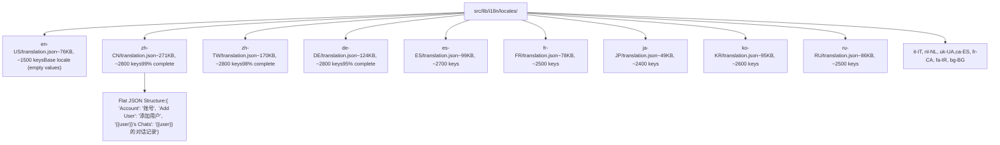
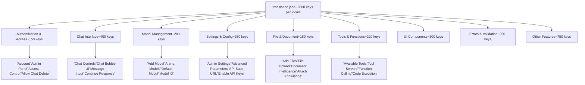
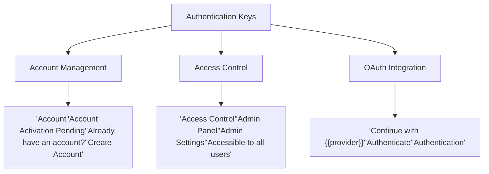
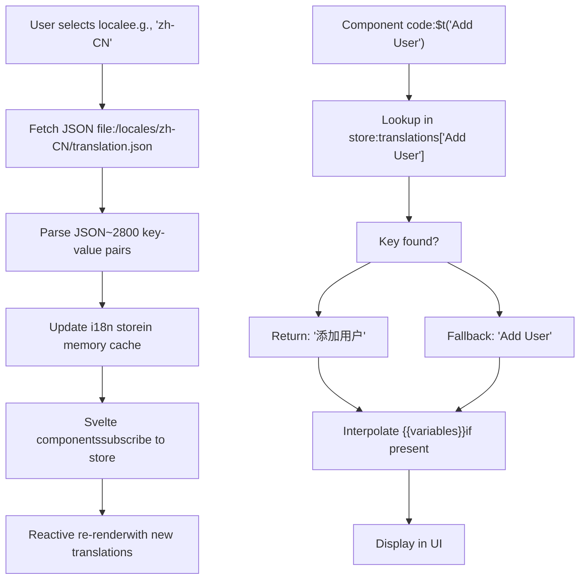
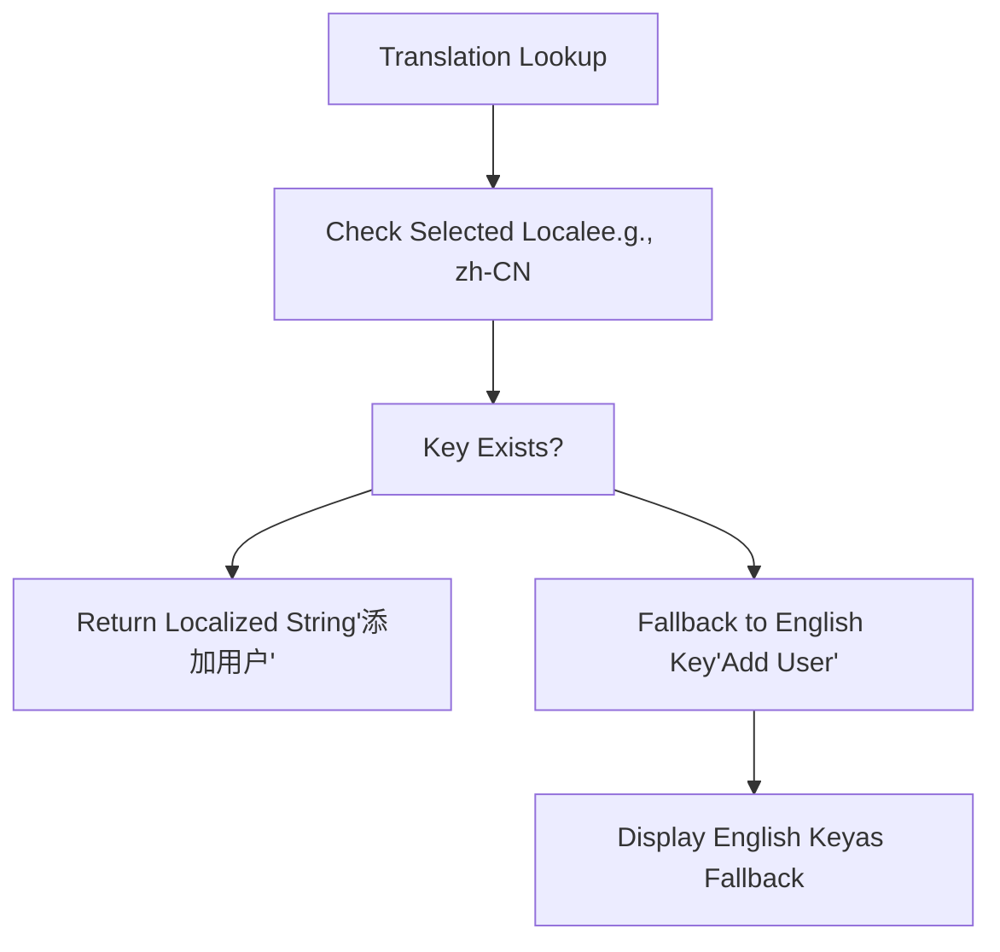

# Internationalization

Relevant source files

-   [src/lib/i18n/locales/bg-BG/translation.json](https://github.com/open-webui/open-webui/blob/a7271532/src/lib/i18n/locales/bg-BG/translation.json)
-   [src/lib/i18n/locales/ca-ES/translation.json](https://github.com/open-webui/open-webui/blob/a7271532/src/lib/i18n/locales/ca-ES/translation.json)
-   [src/lib/i18n/locales/de-DE/translation.json](https://github.com/open-webui/open-webui/blob/a7271532/src/lib/i18n/locales/de-DE/translation.json)
-   [src/lib/i18n/locales/en-GB/translation.json](https://github.com/open-webui/open-webui/blob/a7271532/src/lib/i18n/locales/en-GB/translation.json)
-   [src/lib/i18n/locales/en-US/translation.json](https://github.com/open-webui/open-webui/blob/a7271532/src/lib/i18n/locales/en-US/translation.json)
-   [src/lib/i18n/locales/es-ES/translation.json](https://github.com/open-webui/open-webui/blob/a7271532/src/lib/i18n/locales/es-ES/translation.json)
-   [src/lib/i18n/locales/fa-IR/translation.json](https://github.com/open-webui/open-webui/blob/a7271532/src/lib/i18n/locales/fa-IR/translation.json)
-   [src/lib/i18n/locales/fr-CA/translation.json](https://github.com/open-webui/open-webui/blob/a7271532/src/lib/i18n/locales/fr-CA/translation.json)
-   [src/lib/i18n/locales/fr-FR/translation.json](https://github.com/open-webui/open-webui/blob/a7271532/src/lib/i18n/locales/fr-FR/translation.json)
-   [src/lib/i18n/locales/it-IT/translation.json](https://github.com/open-webui/open-webui/blob/a7271532/src/lib/i18n/locales/it-IT/translation.json)
-   [src/lib/i18n/locales/ja-JP/translation.json](https://github.com/open-webui/open-webui/blob/a7271532/src/lib/i18n/locales/ja-JP/translation.json)
-   [src/lib/i18n/locales/ko-KR/translation.json](https://github.com/open-webui/open-webui/blob/a7271532/src/lib/i18n/locales/ko-KR/translation.json)
-   [src/lib/i18n/locales/nl-NL/translation.json](https://github.com/open-webui/open-webui/blob/a7271532/src/lib/i18n/locales/nl-NL/translation.json)
-   [src/lib/i18n/locales/pt-BR/translation.json](https://github.com/open-webui/open-webui/blob/a7271532/src/lib/i18n/locales/pt-BR/translation.json)
-   [src/lib/i18n/locales/pt-PT/translation.json](https://github.com/open-webui/open-webui/blob/a7271532/src/lib/i18n/locales/pt-PT/translation.json)
-   [src/lib/i18n/locales/ru-RU/translation.json](https://github.com/open-webui/open-webui/blob/a7271532/src/lib/i18n/locales/ru-RU/translation.json)
-   [src/lib/i18n/locales/uk-UA/translation.json](https://github.com/open-webui/open-webui/blob/a7271532/src/lib/i18n/locales/uk-UA/translation.json)
-   [src/lib/i18n/locales/vi-VN/translation.json](https://github.com/open-webui/open-webui/blob/a7271532/src/lib/i18n/locales/vi-VN/translation.json)
-   [src/lib/i18n/locales/zh-CN/translation.json](https://github.com/open-webui/open-webui/blob/a7271532/src/lib/i18n/locales/zh-CN/translation.json)
-   [src/lib/i18n/locales/zh-TW/translation.json](https://github.com/open-webui/open-webui/blob/a7271532/src/lib/i18n/locales/zh-TW/translation.json)

This document describes the internationalization (i18n) system in Open WebUI, which provides multi-language support across the application. The system currently supports 17 locales with over 1,500 translation keys and includes a placeholder variable system for dynamic content interpolation.

For information about user interface settings and theme management, see [User Preferences and Interface Settings](/open-webui/open-webui/10.2-oauth-integration).

---

## Purpose and Scope

The i18n system enables Open WebUI to present its interface in multiple languages by:

-   Maintaining translation files for 17 supported locales
-   Providing a key-based translation lookup mechanism
-   Supporting dynamic placeholder variables for runtime value insertion
-   Enabling runtime locale switching without page reload
-   Managing date/time formatting patterns per locale

---

## Translation System Architecture

The i18n system uses a flat JSON key-value structure where English phrase keys map to localized strings. Each locale file contains approximately 1,500-2,800 translation entries as a single-level JSON object.

### Translation File Organization

**Directory Structure: src/lib/i18n/locales/**


**JSON File Format**

All translation files follow this structure:

-   Root object with string keys (English phrases)
-   String values (localized translations)
-   No nesting; all keys at root level
-   Keys are human-readable English phrases
-   Placeholder variables use `{{VARIABLE}}` syntax
-   Special characters escaped per JSON spec

Sources: [src/lib/i18n/locales/en-US/translation.json1-100](https://github.com/open-webui/open-webui/blob/a7271532/src/lib/i18n/locales/en-US/translation.json#L1-L100) [src/lib/i18n/locales/zh-CN/translation.json1-100](https://github.com/open-webui/open-webui/blob/a7271532/src/lib/i18n/locales/zh-CN/translation.json#L1-L100) [src/lib/i18n/locales/de-DE/translation.json1-100](https://github.com/open-webui/open-webui/blob/a7271532/src/lib/i18n/locales/de-DE/translation.json#L1-L100)

---

## Locale Files and Key Structure

Each translation file is a flat JSON object with English keys mapped to localized strings. The keys are organized by feature domain but stored in a single-level structure for efficient lookup.

### Key Naming Conventions

Translation keys are complete English phrases that serve as both lookup keys and fallback display text:

| Pattern Type | Example Key | Locale Example (zh-CN) | Notes |
| --- | --- | --- | --- |
| Simple Action | `"Add"` | `"添加"` | Single-word verbs |
| Descriptive Label | `"Add a model ID"` | `"添加模型 ID"` | Complete sentences |
| Contextual | `"Admin Panel"` | `"管理员面板"` | Feature labels |
| Permission | `"Allow Chat Delete"` | `"允许删除对话记录"` | Boolean permissions |
| Confirmation | `"Are you sure?"` | `"您确认吗？"` | Dialog prompts |
| Template | `"{{user}}'s Chats"` | `"{{user}} 的对话记录"` | With placeholders |
| Pluralization | `"{{COUNT}} Sources"` | `"{{COUNT}} 个引用来源"` | Count-based strings |
| Date Format | `"[Today at] h:mm A"` | `"[今天] h:mm A"` | Moment.js patterns |

**Key Construction Rules**

-   Keys must be unique across all feature domains
-   Keys are case-sensitive
-   Keys should be complete English phrases, not abbreviations
-   Keys with placeholders must include `{{VARIABLE}}` syntax
-   Date/time keys use moment.js format tokens in brackets `[]`

### Translation Key Categories by Feature Domain

**Key Distribution Across Feature Domains**


**Key Pattern Analysis**

| Feature Domain | Key Count | Common Prefixes | Example Keys |
| --- | --- | --- | --- |
| Permissions | ~120 | `"Allow "` | `"Allow Chat Delete"`, `"Allow File Upload"` |
| Settings | ~180 | `"Enable "`, `"Default "` | `"Enable API Keys"`, `"Default Model"` |
| Actions | ~200 | `"Add "`, `"Delete "`, `"Edit "` | `"Add User"`, `"Delete Chat"` |
| Status Messages | ~150 | `"successfully"`, `"failed"` | `"Connection successful"`, `"Failed to save"` |
| Confirmations | ~80 | `"Are you sure"` | `"Are you sure you want to delete"` |
| Placeholders | ~250 | `"{{COUNT}}"`, `"{{user}}"` | `"{{COUNT}} Sources"`, `"{{user}}'s Chats"` |

Sources: [src/lib/i18n/locales/zh-CN/translation.json32-106](https://github.com/open-webui/open-webui/blob/a7271532/src/lib/i18n/locales/zh-CN/translation.json#L32-L106) [src/lib/i18n/locales/zh-CN/translation.json231-248](https://github.com/open-webui/open-webui/blob/a7271532/src/lib/i18n/locales/zh-CN/translation.json#L231-L248) [src/lib/i18n/locales/zh-CN/translation.json314-356](https://github.com/open-webui/open-webui/blob/a7271532/src/lib/i18n/locales/zh-CN/translation.json#L314-L356)

---

## Placeholder Variable System

The i18n system supports runtime variable interpolation using double curly brace syntax: `{{VARIABLE}}`. Variables are case-sensitive and replaced at render time by the frontend i18n library.

### Placeholder Variable Types and Usage

| Variable Name | Type | Example Key | zh-CN Translation | Usage Context |
| --- | --- | --- | --- | --- |
| `{{COUNT}}` | Integer | `"{{COUNT}} Available Tools"` | `"{{COUNT}} 个可用工具"` | Item counts, pluralization |
| `{{user}}` | String | `"{{user}}'s Chats"` | `"{{user}} 的对话记录"` | User display names |
| `{{NAME}}` | String | `"Are you sure you want to delete \"{{NAME}}\"?"` | `"您确认要删除"{{NAME}}"吗？"` | Entity names in confirmations |
| `{{model}}` | String | `"{{model}} download has been canceled"` | `"已取消模型 {{model}} 的下载"` | Model identifiers |
| `{{COMMAND}}` | String | `"Activate this command by typing \"/{{COMMAND}}\""` | `"在对话框中输入 \"/{{COMMAND}}\" 激活此命令"` | Command strings |
| `{{LATEST_VERSION}}` | String | `"A new version (v{{LATEST_VERSION}}) is now available."` | `"新版本（v{{LATEST_VERSION}}）现已发布"` | Version numbers |
| `{{webUIName}}` | String | `"{{webUIName}} Backend Required"` | `"{{webUIName}} 需要后端服务"` | Application branding |
| `{{provider}}` | String | `"Continue with {{provider}}"` | `"使用 {{provider}} 继续"` | OAuth provider names |
| `{{LOCALIZED_DATE}}` | String | `"{{LOCALIZED_DATE}} at {{LOCALIZED_TIME}}"` | `"{{LOCALIZED_DATE}} {{LOCALIZED_TIME}}"` | Pre-formatted dates |
| `{{LOCALIZED_TIME}}` | String | `"{{LOCALIZED_DATE}} at {{LOCALIZED_TIME}}"` | `"{{LOCALIZED_DATE}} {{LOCALIZED_TIME}}"` | Pre-formatted times |
| `{{NAMES}}` | String | `"{{NAMES}} reacted with {{REACTION}}"` | `"{{NAMES}} 给了 {{REACTION}}"` | Multiple names, comma-separated |
| `{{REACTION}}` | String | `"{{NAMES}} reacted with {{REACTION}}"` | `"{{NAMES}} 给了 {{REACTION}}"` | Emoji or reaction name |

**Variable Interpolation Rules**

-   Variables are replaced before rendering
-   Undefined variables remain as `{{VARIABLE}}` in output
-   Variables can appear multiple times in same key
-   Variable names use UPPER\_CASE or camelCase convention
-   No spaces allowed inside `{{}}` delimiters

### Date and Time Formatting Patterns

Date and time keys use moment.js format tokens combined with literal text in brackets `[]`. These patterns are localized per locale for proper cultural date/time display.

**Moment.js Format Token Reference**

| Token | Description | Example Output |
| --- | --- | --- |
| `h:mm A` | 12-hour time with AM/PM | `3:45 PM` |
| `H:mm` | 24-hour time | `15:45` |
| `dddd` | Full day name | `Monday`, `星期一` |
| `DD/MM/YYYY` | Day/Month/Year | `25/12/2024` |
| `[text]` | Literal text (not formatted) | `at` (unchanged) |

**Date/Time Translation Examples**

| Key (en-US) | zh-CN Translation | ko-KR Translation | Purpose |
| --- | --- | --- | --- |
| `"[Today at] h:mm A"` | `"[今天] h:mm A"` | `"[오늘] A h:mm"` | Today's messages |
| `"[Yesterday at] h:mm A"` | `"[昨天] h:mm A"` | `"[어제] A h:mm"` | Yesterday's messages |
| `"[Last] dddd [at] h:mm A"` | `"[上次] dddd [于] h:mm A"` | `"[지난] dddd A h:mm"` | Older messages |
| `"DD/MM/YYYY"` | `"DD/MM/YYYY"` | `"DD/MM/YYYY"` | Date input formats |
| `"{{LOCALIZED_DATE}} at {{LOCALIZED_TIME}}"` | `"{{LOCALIZED_DATE}} {{LOCALIZED_TIME}}"` | `"{{LOCALIZED_DATE}} {{LOCALIZED_TIME}}"` | Combined date/time |

**Locale-Specific Adaptations**

-   Chinese locales remove "at" connector: `"[今天] h:mm A"` (no "at")
-   Korean locales reorder time position: `"[오늘] A h:mm"` (AM/PM before time)
-   RTL locales (fa-IR) maintain RTL text flow
-   Some locales preserve English time format (`h:mm A`) while localizing day names

Sources: [src/lib/i18n/locales/zh-CN/translation.json8-19](https://github.com/open-webui/open-webui/blob/a7271532/src/lib/i18n/locales/zh-CN/translation.json#L8-L19) [src/lib/i18n/locales/ko-KR/translation.json8-19](https://github.com/open-webui/open-webui/blob/a7271532/src/lib/i18n/locales/ko-KR/translation.json#L8-L19) [src/lib/i18n/locales/de-DE/translation.json8-19](https://github.com/open-webui/open-webui/blob/a7271532/src/lib/i18n/locales/de-DE/translation.json#L8-L19)

---

## Translation Coverage and Completeness

### Supported Locales

The system currently supports 17 locales with varying degrees of translation completeness:

| Locale Code | Language | Translation Completeness | Notes |
| --- | --- | --- | --- |
| `en-US` | English (US) | 100% (Base) | Base locale with empty values |
| `zh-CN` | Chinese (Simplified) | ~99% | Most complete translation |
| `zh-TW` | Chinese (Traditional) | ~98% | High coverage |
| `de-DE` | German | ~95% | Good coverage |
| `es-ES` | Spanish | ~94% | Good coverage |
| `ko-KR` | Korean | ~92% | Most entries translated |
| `fr-FR` | French | ~90% | Many entries translated |
| `ru-RU` | Russian | ~88% | Many entries translated |
| `ja-JP` | Japanese | ~85% | Good coverage |
| `ca-ES` | Catalan | ~85% | Good coverage |
| `uk-UA` | Ukrainian | ~80% | Many missing entries |
| `it-IT` | Italian | ~75% | Partial coverage |
| `nl-NL` | Dutch | ~70% | Partial coverage |
| `fr-CA` | French (Canada) | ~65% | Partial coverage |
| `fa-IR` | Persian | ~62% | Partial coverage |
| `bg-BG` | Bulgarian | ~58% | Partial coverage |

### Empty Value Handling

The English locale (`en-US`) contains mostly empty string values, serving as a fallback that displays the translation key itself when no localized string is available:

```
{
  "Account": "",
  "Add User": "",
  "Admin Panel": ""
}
```
When a translation is missing in the selected locale, the system falls back to displaying the English key string.

Sources: [src/lib/i18n/locales/en-US/translation.json1-100](https://github.com/open-webui/open-webui/blob/a7271532/src/lib/i18n/locales/en-US/translation.json#L1-L100) [src/lib/i18n/locales/zh-CN/translation.json1-100](https://github.com/open-webui/open-webui/blob/a7271532/src/lib/i18n/locales/zh-CN/translation.json#L1-L100)

---

## Translation Key Patterns by Feature

### Authentication and Account Management


**Authentication Translation Keys**

Sources: [src/lib/i18n/locales/zh-CN/translation.json32-34](https://github.com/open-webui/open-webui/blob/a7271532/src/lib/i18n/locales/zh-CN/translation.json#L32-L34) [src/lib/i18n/locales/zh-CN/translation.json165-167](https://github.com/open-webui/open-webui/blob/a7271532/src/lib/i18n/locales/zh-CN/translation.json#L165-L167)

### Chat Interface

Chat-related translations cover message actions, controls, and display options:

| Category | Example Keys |
| --- | --- |
| Actions | `"Add Memory"`, `"Delete Message"`, `"Edit Last Message"` |
| Controls | `"Chat Controls"`, `"Chat Bubble UI"`, `"Chat direction"` |
| Permissions | `"Allow Chat Delete"`, `"Allow Chat Edit"`, `"Allow Chat Export"` |
| Status | `"Active"`, `"Away"`, `"Chat moved successfully"` |
| Display | `"Display chat title in tab"`, `"Chat Background Image"` |

Sources: [src/lib/i18n/locales/zh-CN/translation.json231-242](https://github.com/open-webui/open-webui/blob/a7271532/src/lib/i18n/locales/zh-CN/translation.json#L231-L242) [src/lib/i18n/locales/zh-CN/translation.json85-106](https://github.com/open-webui/open-webui/blob/a7271532/src/lib/i18n/locales/zh-CN/translation.json#L85-L106)

### Model Management

```
{
  "Add Model": "添加模型",
  "Add Arena Model": "添加竞技场模型",
  "Arena Models": "启用竞技场匿名评价模型",
  "Base Model (From)": "基础模型(来自)",
  "Current Model": "当前模型",
  "Default Model": "默认模型",
  "Model ID": "模型 ID",
  "{{model}} download has been canceled": "已取消模型 {{model}} 的下载"
}
```
Sources: [src/lib/i18n/locales/zh-CN/translation.json58-59](https://github.com/open-webui/open-webui/blob/a7271532/src/lib/i18n/locales/zh-CN/translation.json#L58-L59) [src/lib/i18n/locales/zh-CN/translation.json150](https://github.com/open-webui/open-webui/blob/a7271532/src/lib/i18n/locales/zh-CN/translation.json#L150-L150)

### Settings and Configuration

Settings translations include interface customization, theme options, and advanced parameters:

| Setting Category | Translation Keys |
| --- | --- |
| General | `"General"`, `"Settings"`, `"Admin Settings"` |
| Interface | `"Display"`, `"Chat Bubble UI"`, `"Theme System"` |
| Advanced | `"Advanced Parameters"`, `"Advanced Params"`, `"Additional Parameters"` |
| Permissions | `"Default permissions"`, `"Features Permissions"`, `"Chat Permissions"` |

Sources: [src/lib/i18n/locales/zh-CN/translation.json799](https://github.com/open-webui/open-webui/blob/a7271532/src/lib/i18n/locales/zh-CN/translation.json#L799-L799) [src/lib/i18n/locales/zh-CN/translation.json75-77](https://github.com/open-webui/open-webui/blob/a7271532/src/lib/i18n/locales/zh-CN/translation.json#L75-L77)

---

## Special Translation Patterns

### Pluralization Support

The system supports count-based translations with `{{COUNT}}` placeholders:

```
{
  "{{COUNT}} Available Tools": "{{COUNT}} 个可用工具",
  "{{COUNT}} characters": "{{COUNT}} 个字符",
  "{{COUNT}} Replies": "{{COUNT}} 条回复",
  "{{COUNT}} Sources": "{{COUNT}} 个引用来源",
  "{{COUNT}} words": "{{COUNT}} 个字",
  "and {{COUNT}} more": "还有 {{COUNT}} 个",
  "1 Source": "1 个引用来源"
}
```
Note: The system uses separate keys for singular (e.g., `"1 Source"`) and plural (e.g., `"{{COUNT}} Sources"`) forms rather than a single pluralization rule.

Sources: [src/lib/i18n/locales/zh-CN/translation.json12-18](https://github.com/open-webui/open-webui/blob/a7271532/src/lib/i18n/locales/zh-CN/translation.json#L12-L18) [src/lib/i18n/locales/zh-CN/translation.json24](https://github.com/open-webui/open-webui/blob/a7271532/src/lib/i18n/locales/zh-CN/translation.json#L24-L24)

### RTL Language Support

The system includes support for right-to-left (RTL) languages like Persian (Farsi):

```
{
  "Account": "حساب",
  "Add User": "افزودن کاربر",
  "Admin Panel": "پنل مدیریت"
}
```
The locale code `fa-IR` identifies Persian translations, allowing the frontend to apply appropriate RTL text direction.

Sources: [src/lib/i18n/locales/fa-IR/translation.json33](https://github.com/open-webui/open-webui/blob/a7271532/src/lib/i18n/locales/fa-IR/translation.json#L33-L33) [src/lib/i18n/locales/fa-IR/translation.json63](https://github.com/open-webui/open-webui/blob/a7271532/src/lib/i18n/locales/fa-IR/translation.json#L63-L63)

### Formatting and Markup in Translations

Some translations include inline formatting hints:

```
{
  "Executing **{{NAME}}**...": "正在执行 **{{NAME}}**...",
  "e.g. `sh webui.sh --api`": "（例如：`sh webui.sh --api`）",
  "(e.g. `sh webui.sh --api --api-auth username_password`)": "（例如：`sh webui.sh --api --api-auth username_password`）"
}
```
The system preserves markdown formatting (`**bold**`, `` `code` ``) within translations, allowing for consistent text styling across locales.

Sources: [src/lib/i18n/locales/zh-CN/translation.json677](https://github.com/open-webui/open-webui/blob/a7271532/src/lib/i18n/locales/zh-CN/translation.json#L677-L677) [src/lib/i18n/locales/zh-CN/translation.json4-5](https://github.com/open-webui/open-webui/blob/a7271532/src/lib/i18n/locales/zh-CN/translation.json#L4-L5)

---

## Frontend Integration Architecture

The i18n system integrates with the SvelteKit frontend through a reactive store-based architecture. Locale changes trigger automatic re-rendering of all components using translated strings.

### I18n System Flow

**Translation Lookup and Application**


**Store-Based Reactivity**

-   I18n library maintains reactive Svelte store
-   Store contains: `{ locale: string, translations: Record<string, string> }`
-   Components subscribe using `$t()` function or `$_()` shorthand
-   Store updates trigger Svelte reactivity for all subscribed components
-   No manual component update calls required

### Translation Function Usage Patterns

**In Svelte Components**

```
// Basic translation lookup
$t('Add User')  // Returns: "添加用户" (if zh-CN selected)

// With placeholder interpolation
$t('{{user}}\'s Chats', { user: 'Alice' })  // Returns: "Alice 的对话记录"

// With count placeholder
$t('{{COUNT}} Sources', { COUNT: 5 })  // Returns: "5 个引用来源"

// Multiple placeholders
$t('Are you sure you want to delete "{{NAME}}"?', { NAME: 'My Model' })
```
**Store Persistence**

User locale preference stored in:

1.  Browser localStorage (key: `locale` or `language`)
2.  User preferences API (persisted to database)
3.  Restored on application initialization
4.  Applied before first render for consistent UX

Sources: Referenced pattern from frontend architecture in [Architecture Overview](/open-webui/open-webui/2.1-system-components-and-data-flow)

---

## Translation File Maintenance

### Adding New Translation Keys

When adding new UI features, developers must:

1.  Add the English key to all locale files
2.  Provide the English translation (if not using key as display text)
3.  Request translations from community contributors for other locales
4.  Use descriptive, complete English phrases as keys for clarity

### Missing Translation Handling


**Translation Fallback Mechanism**

When a translation key is missing in the selected locale, the system displays the English key string itself as a fallback, ensuring the UI remains functional even with incomplete translations.

Sources: [src/lib/i18n/locales/en-US/translation.json44-65](https://github.com/open-webui/open-webui/blob/a7271532/src/lib/i18n/locales/en-US/translation.json#L44-L65) [src/lib/i18n/locales/zh-CN/translation.json44-65](https://github.com/open-webui/open-webui/blob/a7271532/src/lib/i18n/locales/zh-CN/translation.json#L44-L65)

---

## Common Translation Patterns

### Confirmation Dialogs

```
{
  "Are you sure?": "您确认吗？",
  "Are you sure you want to delete \"{{NAME}}\"?": "您确认要删除"{{NAME}}"吗？",
  "Are you sure you want to delete this message?": "您确认要删除此消息吗？",
  "Are you sure you want to delete this channel?": "您确认要删除此频道吗？",
  "Confirm": "确认",
  "Confirm your action": "确认要继续吗？",
  "Cancel": "取消"
}
```
### Success and Error Messages

```
{
  "Connection successful": "连接成功",
  "Connection failed": "连接失败",
  "Channel deleted successfully": "删除频道成功",
  "Channel updated successfully": "更新频道成功",
  "Failed to delete note": "删除笔记失败",
  "Failed to save conversation": "保存对话失败",
  "Error": "错误"
}
```
### Feature Toggles

```
{
  "Allow Call": "允许语音通话",
  "Allow Chat Controls": "允许使用对话高级设置",
  "Allow Chat Delete": "允许删除对话记录",
  "Allow File Upload": "允许上传文件",
  "Enable API Keys": "启用接口密钥",
  "Enable Code Execution": "启用代码执行"
}
```
Sources: [src/lib/i18n/locales/zh-CN/translation.json145-149](https://github.com/open-webui/open-webui/blob/a7271532/src/lib/i18n/locales/zh-CN/translation.json#L145-L149) [src/lib/i18n/locales/zh-CN/translation.json314-315](https://github.com/open-webui/open-webui/blob/a7271532/src/lib/i18n/locales/zh-CN/translation.json#L314-L315) [src/lib/i18n/locales/zh-CN/translation.json84-96](https://github.com/open-webui/open-webui/blob/a7271532/src/lib/i18n/locales/zh-CN/translation.json#L84-L96)

---

## Technical Implementation Notes

### JSON File Format

Each translation file follows strict JSON formatting:

-   Keys are always English strings
-   Values are localized translations
-   Special characters are properly escaped
-   Placeholder variables use `{{variable}}` syntax
-   Empty strings indicate untranslated keys

### File Size and Performance

| Metric | Value |
| --- | --- |
| Average file size | ~150-250 KB per locale |
| Total translation keys | ~1,500 keys |
| Largest translation file | zh-CN (~270 KB) |
| Smallest translation file | en-US (~75 KB) |

The translation files are loaded on-demand when a user selects a locale, minimizing initial bundle size.

Sources: All locale files in [src/lib/i18n/locales/](https://github.com/open-webui/open-webui/blob/a7271532/src/lib/i18n/locales/)
