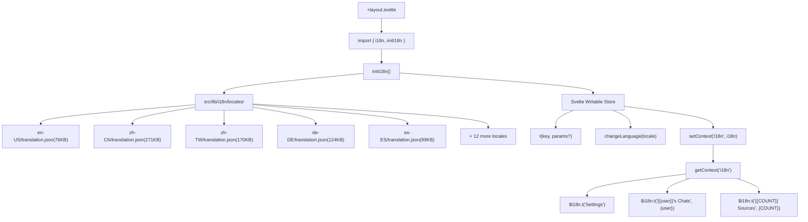
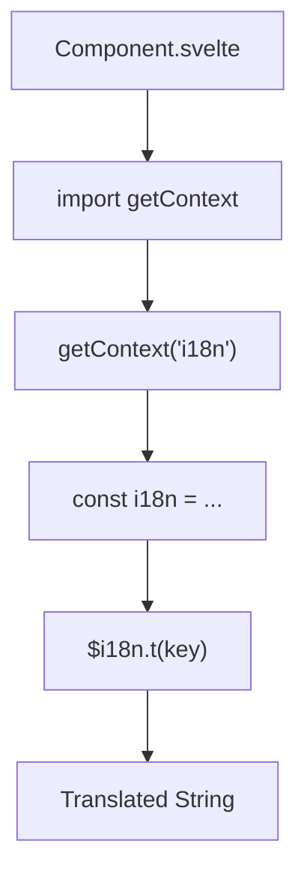
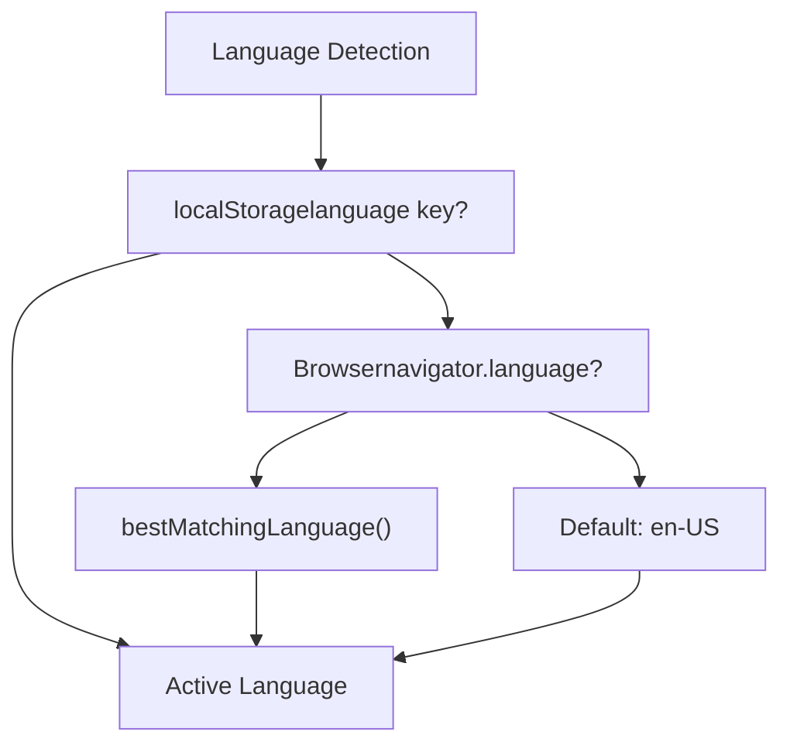
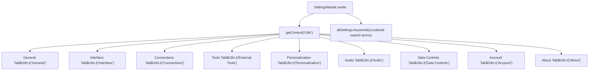

# Translation System Architecture

Relevant source files

-   [src/lib/i18n/locales/bg-BG/translation.json](https://github.com/open-webui/open-webui/blob/a7271532/src/lib/i18n/locales/bg-BG/translation.json)
-   [src/lib/i18n/locales/ca-ES/translation.json](https://github.com/open-webui/open-webui/blob/a7271532/src/lib/i18n/locales/ca-ES/translation.json)
-   [src/lib/i18n/locales/de-DE/translation.json](https://github.com/open-webui/open-webui/blob/a7271532/src/lib/i18n/locales/de-DE/translation.json)
-   [src/lib/i18n/locales/en-GB/translation.json](https://github.com/open-webui/open-webui/blob/a7271532/src/lib/i18n/locales/en-GB/translation.json)
-   [src/lib/i18n/locales/en-US/translation.json](https://github.com/open-webui/open-webui/blob/a7271532/src/lib/i18n/locales/en-US/translation.json)
-   [src/lib/i18n/locales/es-ES/translation.json](https://github.com/open-webui/open-webui/blob/a7271532/src/lib/i18n/locales/es-ES/translation.json)
-   [src/lib/i18n/locales/fa-IR/translation.json](https://github.com/open-webui/open-webui/blob/a7271532/src/lib/i18n/locales/fa-IR/translation.json)
-   [src/lib/i18n/locales/fr-CA/translation.json](https://github.com/open-webui/open-webui/blob/a7271532/src/lib/i18n/locales/fr-CA/translation.json)
-   [src/lib/i18n/locales/fr-FR/translation.json](https://github.com/open-webui/open-webui/blob/a7271532/src/lib/i18n/locales/fr-FR/translation.json)
-   [src/lib/i18n/locales/it-IT/translation.json](https://github.com/open-webui/open-webui/blob/a7271532/src/lib/i18n/locales/it-IT/translation.json)
-   [src/lib/i18n/locales/ja-JP/translation.json](https://github.com/open-webui/open-webui/blob/a7271532/src/lib/i18n/locales/ja-JP/translation.json)
-   [src/lib/i18n/locales/ko-KR/translation.json](https://github.com/open-webui/open-webui/blob/a7271532/src/lib/i18n/locales/ko-KR/translation.json)
-   [src/lib/i18n/locales/nl-NL/translation.json](https://github.com/open-webui/open-webui/blob/a7271532/src/lib/i18n/locales/nl-NL/translation.json)
-   [src/lib/i18n/locales/pt-BR/translation.json](https://github.com/open-webui/open-webui/blob/a7271532/src/lib/i18n/locales/pt-BR/translation.json)
-   [src/lib/i18n/locales/pt-PT/translation.json](https://github.com/open-webui/open-webui/blob/a7271532/src/lib/i18n/locales/pt-PT/translation.json)
-   [src/lib/i18n/locales/ru-RU/translation.json](https://github.com/open-webui/open-webui/blob/a7271532/src/lib/i18n/locales/ru-RU/translation.json)
-   [src/lib/i18n/locales/uk-UA/translation.json](https://github.com/open-webui/open-webui/blob/a7271532/src/lib/i18n/locales/uk-UA/translation.json)
-   [src/lib/i18n/locales/vi-VN/translation.json](https://github.com/open-webui/open-webui/blob/a7271532/src/lib/i18n/locales/vi-VN/translation.json)
-   [src/lib/i18n/locales/zh-CN/translation.json](https://github.com/open-webui/open-webui/blob/a7271532/src/lib/i18n/locales/zh-CN/translation.json)
-   [src/lib/i18n/locales/zh-TW/translation.json](https://github.com/open-webui/open-webui/blob/a7271532/src/lib/i18n/locales/zh-TW/translation.json)

## Purpose and Scope

This document describes the internationalization (i18n) system architecture in Open WebUI, which provides multi-language support across the application. The system supports 17 languages and handles translation key management, locale detection, language switching, and runtime translation resolution. For information about user-facing language settings and preferences, see [User Preferences and Interface Settings](/open-webui/open-webui/10.2-oauth-integration).

## System Overview

Open WebUI implements internationalization using a custom i18n module located at `src/lib/i18n`, integrated with Svelte's context API for application-wide translation access. The system is initialized at the root application layout (`src/routes/+layout.svelte`) and made available to all components through Svelte's context mechanism.

**Key Characteristics:**

-   **17 supported languages** with complete translation coverage
-   **5000+ translation keys** covering UI labels, messages, error states, and help text
-   **Browser-based locale detection** with `localStorage` persistence
-   **Runtime language switching** via `changeLanguage()` function without page reload
-   **Context-based translation access** using Svelte's `getContext('i18n')`
-   **Reactive updates** through Svelte writable stores

Sources: [src/routes/+layout.svelte37](https://github.com/open-webui/open-webui/blob/a7271532/src/routes/+layout.svelte#L37-L37) [src/routes/+layout.svelte62](https://github.com/open-webui/open-webui/blob/a7271532/src/routes/+layout.svelte#L62-L62) [src/lib/i18n/locales/zh-CN/translation.json1-10](https://github.com/open-webui/open-webui/blob/a7271532/src/lib/i18n/locales/zh-CN/translation.json#L1-L10) [src/lib/i18n/locales/en-US/translation.json1-10](https://github.com/open-webui/open-webui/blob/a7271532/src/lib/i18n/locales/en-US/translation.json#L1-L10)

## Architecture Components


**Diagram: i18n System Architecture with Code Entities**

Sources: [src/routes/+layout.svelte37](https://github.com/open-webui/open-webui/blob/a7271532/src/routes/+layout.svelte#L37-L37) [src/routes/+layout.svelte62](https://github.com/open-webui/open-webui/blob/a7271532/src/routes/+layout.svelte#L62-L62) [src/lib/i18n/locales/zh-CN/translation.json](https://github.com/open-webui/open-webui/blob/a7271532/src/lib/i18n/locales/zh-CN/translation.json) [src/lib/i18n/locales/en-US/translation.json](https://github.com/open-webui/open-webui/blob/a7271532/src/lib/i18n/locales/en-US/translation.json)

## Initialization Flow

The i18n system initializes during application bootstrap in the root layout component:

> **[Mermaid sequence]**
> *(图表结构无法解析)*

**Diagram: i18n Initialization Sequence**

The initialization process follows these steps:

1.  **Import i18n module** - Root layout imports i18n utilities
2.  **Detect locale** - System checks localStorage, then browser language, then defaults
3.  **Load translation files** - Appropriate translation.json file is loaded
4.  **Create i18n store** - Svelte writable store is created with translation functions
5.  **Set context** - i18n store is made available via Svelte context

Sources: [src/routes/+layout.svelte37](https://github.com/open-webui/open-webui/blob/a7271532/src/routes/+layout.svelte#L37-L37) [src/routes/+layout.svelte62](https://github.com/open-webui/open-webui/blob/a7271532/src/routes/+layout.svelte#L62-L62) [src/lib/utils49](https://github.com/open-webui/open-webui/blob/a7271532/src/lib/utils#L49-L49)

## Translation File Structure

Translation files are organized by locale code following BCP 47 standard:

```
src/lib/i18n/locales/
├── en-US/
│   └── translation.json
├── zh-CN/
│   └── translation.json
├── zh-TW/
│   └── translation.json
├── de-DE/
│   └── translation.json
├── es-ES/
│   └── translation.json
├── ko-KR/
│   └── translation.json
├── ru-RU/
│   └── translation.json
├── fr-FR/
│   └── translation.json
├── ca-ES/
│   └── translation.json
├── uk-UA/
│   └── translation.json
├── nl-NL/
│   └── translation.json
├── fr-CA/
│   └── translation.json
├── fa-IR/
│   └── translation.json
├── ja-JP/
│   └── translation.json
├── bg-BG/
│   └── translation.json
├── it-IT/
│   └── translation.json
└── en-GB/
    └── translation.json
```
### Translation JSON Format

Each `translation.json` file contains a flat key-value structure with 5000+ keys:

```
{
  "Settings": "设置",
  "Close settings modal": "关闭设置弹窗",
  "General": "通用",
  "Interface": "界面",
  "Account": "账号",
  "{{user}}'s Chats": "{{user}} 的对话记录",
  "{{COUNT}} Available Tools": "{{COUNT}} 个可用工具",
  "{{COUNT}} Sources": "{{COUNT}} 个引用来源",
  "[Today at] h:mm A": "[今天] h:mm A",
  "[Yesterday at] h:mm A": "[昨天] h:mm A"
}
```
**Key Patterns with Examples from Codebase:**

| Pattern | Translation Key | zh-CN Value | Purpose |
| --- | --- | --- | --- |
| Simple labels | `"Settings"` | `"设置"` | UI element labels |
| Action descriptions | `"Close settings modal"` | `"关闭设置弹窗"` | Accessibility labels |
| User interpolation | `"{{user}}'s Chats"` | `"{{user}} 的对话记录"` | Dynamic username insertion |
| Count interpolation | `"{{COUNT}} Available Tools"` | `"{{COUNT}} 个可用工具"` | Pluralization with count |
| Multiple variables | `"{{LOCALIZED_DATE}} at {{LOCALIZED_TIME}}"` | `"{{LOCALIZED_DATE}} {{LOCALIZED_TIME}}"` | Date and time formatting |
| Date formats | `"[Today at] h:mm A"` | `"[今天] h:mm A"` | Localized date/time patterns |
| Named reactions | `"{{NAMES}} reacted with {{REACTION}}"` | `"{{NAMES}} 给了 {{REACTION}}"` | Complex interpolation |

**Special Characters and Escaping:**

Translation values may contain special characters that are properly escaped in JSON:

-   Quotes: `"Don't have an account?"` → `"还没有账号吗？"`
-   Parentheses: `"(latest)"` → `"(最新版)"`
-   Backticks: ``"(e.g. `sh webui.sh --api`)"`` → `"（例如：`sh webui.sh --api`）"`

Sources: [src/lib/i18n/locales/zh-CN/translation.json1-30](https://github.com/open-webui/open-webui/blob/a7271532/src/lib/i18n/locales/zh-CN/translation.json#L1-L30) [src/lib/i18n/locales/en-US/translation.json1-30](https://github.com/open-webui/open-webui/blob/a7271532/src/lib/i18n/locales/en-US/translation.json#L1-L30)

## Component Usage Patterns

Components access translations through the i18n context using Svelte's `getContext` API:


**Diagram: Translation Access Flow in Components**

### Pattern 1: Basic Translation

Simple key lookup for static UI labels:

```
<script>
  import { getContext } from 'svelte';
  const i18n = getContext('i18n');
</script>

<div>{$i18n.t('Settings')}</div>
<button>{$i18n.t('General')}</button>
<span>{$i18n.t('Interface')}</span>
```
**Result:**

-   English: "Settings", "General", "Interface"
-   Chinese: "设置", "通用", "界面"

### Pattern 2: Variable Interpolation

Dynamic content injection using template variables:

```
<script>
  const username = 'Alice';
</script>

<h1>{$i18n.t("{{user}}'s Chats", { user: username })}</h1>
```
**Result:**

-   English: "Alice's Chats"
-   Chinese: "Alice 的对话记录"

### Pattern 3: Count-based Messages

Displaying counts with proper localization:

```
<script>
  let sourceCount = 5;
</script>

<div>{$i18n.t("{{COUNT}} Sources", { COUNT: sourceCount })}</div>
<div>{$i18n.t("{{COUNT}} Available Tools", { COUNT: toolCount })}</div>
```
**Result:**

-   English: "5 Sources", "3 Available Tools"
-   Chinese: "5 个引用来源", "3 个可用工具"

### Pattern 4: Multiple Variables

Complex interpolation with multiple dynamic values:

```
<span>
  {$i18n.t("{{LOCALIZED_DATE}} at {{LOCALIZED_TIME}}", {
    LOCALIZED_DATE: formattedDate,
    LOCALIZED_TIME: formattedTime
  })}
</span>
```
### Pattern 5: Accessibility Labels

ARIA attributes for screen readers:

```
<button aria-label={$i18n.t('Close settings modal')}>
  <XMark />
</button>

<input
  type="text"
  placeholder={$i18n.t('Enter Your Name')}
  aria-label={$i18n.t('Enter Your Name')}
/>
```
**Result:**

-   English: "Close settings modal", "Enter Your Name"
-   Chinese: "关闭设置弹窗", "输入您的名称"

### Pattern 6: Conditional Text

Using translation keys in conditional expressions:

```
<div>
  {isLoading
    ? $i18n.t('Checking for updates...')
    : $i18n.t('Check for updates')}
</div>
```
Sources: [src/lib/i18n/locales/zh-CN/translation.json1-50](https://github.com/open-webui/open-webui/blob/a7271532/src/lib/i18n/locales/zh-CN/translation.json#L1-L50) [src/lib/i18n/locales/en-US/translation.json1-50](https://github.com/open-webui/open-webui/blob/a7271532/src/lib/i18n/locales/en-US/translation.json#L1-L50)

## Language Detection and Switching

### Detection Priority

The system determines the active language using the following priority:


**Diagram: Language Detection Flow**

Sources: [src/lib/utils49](https://github.com/open-webui/open-webui/blob/a7271532/src/lib/utils#L49-L49) [src/routes/+layout.svelte37](https://github.com/open-webui/open-webui/blob/a7271532/src/routes/+layout.svelte#L37-L37)

### Runtime Language Switching

The `changeLanguage()` function enables dynamic language switching:

```
<script>
  import { changeLanguage } from '$lib/i18n';

  const switchLanguage = async (locale) => {
    await changeLanguage(locale);
    // UI automatically updates due to reactive i18n store
  };
</script>

<select on:change={(e) => switchLanguage(e.target.value)}>
  <option value="en-US">English</option>
  <option value="zh-CN">简体中文</option>
  <option value="de-DE">Deutsch</option>
</select>
```
When language changes:

1.  New translation file is loaded
2.  i18n store is updated
3.  All components using `$i18n.t()` automatically re-render
4.  New language is persisted to localStorage

Sources: [src/routes/+layout.svelte37](https://github.com/open-webui/open-webui/blob/a7271532/src/routes/+layout.svelte#L37-L37)

## Supported Languages

The system supports 17 languages with complete translation coverage. Each language has its own directory under `src/lib/i18n/locales/` containing a `translation.json` file:

| Language | Locale Code | File Path | File Size | Coverage |
| --- | --- | --- | --- | --- |
| English (US) | `en-US` | `src/lib/i18n/locales/en-US/translation.json` | 76 KB | Baseline (5000+ keys) |
| Chinese (Simplified) | `zh-CN` | `src/lib/i18n/locales/zh-CN/translation.json` | 271 KB | Complete |
| Chinese (Traditional) | `zh-TW` | `src/lib/i18n/locales/zh-TW/translation.json` | 170 KB | Complete |
| German | `de-DE` | `src/lib/i18n/locales/de-DE/translation.json` | 124 KB | Complete |
| Catalan | `ca-ES` | `src/lib/i18n/locales/ca-ES/translation.json` | 111 KB | Complete |
| Spanish | `es-ES` | `src/lib/i18n/locales/es-ES/translation.json` | 99 KB | Complete |
| Ukrainian | `uk-UA` | `src/lib/i18n/locales/uk-UA/translation.json` | 98 KB | Complete |
| Korean | `ko-KR` | `src/lib/i18n/locales/ko-KR/translation.json` | 95 KB | Complete |
| Russian | `ru-RU` | `src/lib/i18n/locales/ru-RU/translation.json` | 86 KB | Complete |
| French (France) | `fr-FR` | `src/lib/i18n/locales/fr-FR/translation.json` | 78 KB | Complete |
| Dutch | `nl-NL` | `src/lib/i18n/locales/nl-NL/translation.json` | 64 KB | Complete |
| French (Canada) | `fr-CA` | `src/lib/i18n/locales/fr-CA/translation.json` | 53 KB | Complete |
| Persian | `fa-IR` | `src/lib/i18n/locales/fa-IR/translation.json` | 52 KB | Complete |
| Japanese | `ja-JP` | `src/lib/i18n/locales/ja-JP/translation.json` | 49 KB | Complete |
| Bulgarian | `bg-BG` | `src/lib/i18n/locales/bg-BG/translation.json` | 47 KB | Complete |
| Italian | `it-IT` | `src/lib/i18n/locales/it-IT/translation.json` | 47 KB | Complete |
| English (UK) | `en-GB` | `src/lib/i18n/locales/en-GB/translation.json` | 42 KB | Complete |

**Note:** File sizes vary due to character encoding differences. Languages using multi-byte character sets (Chinese, Korean, Japanese) have larger file sizes even though they contain the same number of translation keys.

**Locale Code Standard:** All locale codes follow the BCP 47 standard format: `language-REGION` (e.g., `zh-CN`, `en-US`, `fr-CA`).

Sources: [src/lib/i18n/locales/en-US/translation.json](https://github.com/open-webui/open-webui/blob/a7271532/src/lib/i18n/locales/en-US/translation.json) [src/lib/i18n/locales/zh-CN/translation.json](https://github.com/open-webui/open-webui/blob/a7271532/src/lib/i18n/locales/zh-CN/translation.json) [src/lib/i18n/locales/zh-TW/translation.json](https://github.com/open-webui/open-webui/blob/a7271532/src/lib/i18n/locales/zh-TW/translation.json) [src/lib/i18n/locales/de-DE/translation.json](https://github.com/open-webui/open-webui/blob/a7271532/src/lib/i18n/locales/de-DE/translation.json) [src/lib/i18n/locales/ca-ES/translation.json](https://github.com/open-webui/open-webui/blob/a7271532/src/lib/i18n/locales/ca-ES/translation.json) [src/lib/i18n/locales/es-ES/translation.json](https://github.com/open-webui/open-webui/blob/a7271532/src/lib/i18n/locales/es-ES/translation.json)

## Settings Modal Integration

The Settings Modal demonstrates comprehensive i18n integration across multiple tabs:


**Diagram: Settings Modal i18n Usage**

The Settings Modal includes:

-   **Tab titles** - All navigation tab labels are translated
-   **Search functionality** - Keywords array contains localized search terms
-   **Form labels** - All input labels and placeholders use i18n
-   **Button text** - Action buttons are translated
-   **Help text** - Tooltips and descriptions are localized
-   **Error messages** - Validation messages use i18n

Sources: [src/lib/components/chat/SettingsModal.svelte32-33](https://github.com/open-webui/open-webui/blob/a7271532/src/lib/components/chat/SettingsModal.svelte#L32-L33) [src/lib/components/chat/SettingsModal.svelte48-469](https://github.com/open-webui/open-webui/blob/a7271532/src/lib/components/chat/SettingsModal.svelte#L48-L469) [src/lib/components/chat/SettingsModal.svelte575-637](https://github.com/open-webui/open-webui/blob/a7271532/src/lib/components/chat/SettingsModal.svelte#L575-L637)

## Translation Key Categories

The 5000+ translation keys are organized into semantic categories based on usage context:

### UI Component Labels (Navigation and Tabs)

Static labels for UI elements:

| Translation Key | en-US | zh-CN | Usage Context |
| --- | --- | --- | --- |
| `"Settings"` | Settings | 设置 | Modal title, menu item |
| `"General"` | General | 通用 | Settings tab |
| `"Interface"` | Interface | 界面 | Settings tab |
| `"Account"` | Account | 账号 | Settings tab |
| `"About"` | About | 关于 | Settings tab |
| `"Admin Panel"` | Admin Panel | 管理员面板 | Navigation |

### User Actions and Commands

Action verbs and command labels:

| Translation Key | en-US | zh-CN |
| --- | --- | --- |
| `"Add"` | Add | 添加 |
| `"Create"` | Create | 创建 |
| `"Delete"` | Delete | 删除 |
| `"Edit"` | Edit | 编辑 |
| `"Export"` | Export | 导出 |
| `"Cancel"` | Cancel | 取消 |
| `"Confirm"` | Confirm | 确认 |
| `"Back"` | Back | 返回 |

### Confirmation and Feedback Messages

User confirmation prompts and status messages:

| Translation Key | en-US | zh-CN |
| --- | --- | --- |
| `"Are you sure?"` | Are you sure? | 您确认吗？ |
| `"Confirm your action"` | Confirm your action | 确认要继续吗？ |
| `"Account Activation Pending"` | Account Activation Pending | 账号待激活 |
| `"Connection successful"` | Connection successful | 连接成功 |
| `"Connection failed"` | Connection failed | 连接失败 |

### Help Text and Instructions

Guidance text for users:

| Translation Key | en-US | zh-CN |
| --- | --- | --- |
| `"Click here for help."` | Click here for help. | 点击此处获取帮助 |
| `"Click here to select"` | Click here to select | 点击此处选择 |
| `"Click here for filter guides."` | Click here for filter guides. | 点击此处查看筛选指南 |

### Dynamic Content with Interpolation

Keys containing template variables:

| Translation Key | en-US | zh-CN | Variables |
| --- | --- | --- | --- |
| `"{{user}}'s Chats"` | {{user}}'s Chats | {{user}} 的对话记录 | `user` |
| `"{{COUNT}} Sources"` | {{COUNT}} Sources | {{COUNT}} 个引用来源 | `COUNT` |
| `"{{COUNT}} Available Tools"` | {{COUNT}} Available Tools | {{COUNT}} 个可用工具 | `COUNT` |
| `"{{COUNT}} characters"` | {{COUNT}} characters | {{COUNT}} 个字符 | `COUNT` |
| `"{{LOCALIZED_DATE}} at {{LOCALIZED_TIME}}"` | {{LOCALIZED\_DATE}} at {{LOCALIZED\_TIME}} | {{LOCALIZED\_DATE}} {{LOCALIZED\_TIME}} | `LOCALIZED_DATE`, `LOCALIZED_TIME` |

### Date and Time Formats

Localized date/time patterns:

| Translation Key | en-US | zh-CN |
| --- | --- | --- |
| `"[Today at] h:mm A"` | \[Today at\] h:mm A | \[今天\] h:mm A |
| `"[Yesterday at] h:mm A"` | \[Yesterday at\] h:mm A | \[昨天\] h:mm A |
| `"[Last] dddd [at] h:mm A"` | \[Last\] dddd \[at\] h:mm A | \[上次\] dddd \[于\] h:mm A |

### Accessibility and ARIA Labels

Screen reader and accessibility text:

| Translation Key | en-US | zh-CN |
| --- | --- | --- |
| `"Close settings modal"` | Close settings modal | 关闭设置弹窗 |
| `"Close modal"` | Close modal | 关闭弹窗 |
| `"Close Sidebar"` | Close Sidebar | 收起侧边栏 |
| `"Focus Chat Input"` | Focus Chat Input | 聚焦对话框 |

### Form Input Labels and Placeholders

Input field labels and placeholder text:

| Translation Key | en-US | zh-CN |
| --- | --- | --- |
| `"Enter Your Name"` | Enter Your Name | 输入您的名称 |
| `"Enter Your Email"` | Enter Your Email | 输入您的电子邮箱 |
| `"Confirm Password"` | Confirm Password | 确认密码 |
| `"Enter your message"` | Enter your message | 输入您的消息 |

Sources: [src/lib/i18n/locales/zh-CN/translation.json1-300](https://github.com/open-webui/open-webui/blob/a7271532/src/lib/i18n/locales/zh-CN/translation.json#L1-L300) [src/lib/i18n/locales/en-US/translation.json1-100](https://github.com/open-webui/open-webui/blob/a7271532/src/lib/i18n/locales/en-US/translation.json#L1-L100)

## Best Practices

### For Component Authors

1.  **Always use translation keys**

    ```
    <!-- Good -->
    <button>{$i18n.t('Settings')}</button>

    <!-- Bad -->
    <button>Settings</button>
    ```

2.  **Use descriptive keys**

    ```
    <!-- Good -->
    aria-label={$i18n.t('Close settings modal')}

    <!-- Bad -->
    aria-label={$i18n.t('Close')}
    ```

3.  **Interpolate dynamic content**

    ```
    {$i18n.t("{{user}}'s Chats", { user: username })}
    ```

4.  **Handle pluralization**

    ```
    {$i18n.t("{{COUNT}} Sources", { COUNT: count })}
    ```


### For Translation Authors

1.  **Maintain key consistency** across all locale files
2.  **Preserve interpolation variables** like `{{user}}`, `{{COUNT}}`
3.  **Test with long translations** to ensure UI doesn't break
4.  **Verify special characters** are properly escaped in JSON
5.  **Use appropriate date/time formats** for the locale

Sources: [src/lib/components/chat/SettingsModal.svelte575-637](https://github.com/open-webui/open-webui/blob/a7271532/src/lib/components/chat/SettingsModal.svelte#L575-L637)

## Performance Considerations

The translation system is designed for optimal performance:

-   **Lazy loading** - Only the active language file is loaded
-   **Context-based access** - No prop drilling required
-   **Reactive updates** - Svelte's reactivity handles re-renders efficiently
-   **Minimal bundle impact** - Translation files are not included in main bundle
-   **Caching** - Loaded translations are cached in memory

Sources: [src/routes/+layout.svelte62](https://github.com/open-webui/open-webui/blob/a7271532/src/routes/+layout.svelte#L62-L62) [src/lib/stores/index.ts69](https://github.com/open-webui/open-webui/blob/a7271532/src/lib/stores/index.ts#L69-L69)
