# Locale Coverage

Relevant source files

-   [src/lib/i18n/locales/bg-BG/translation.json](https://github.com/open-webui/open-webui/blob/a7271532/src/lib/i18n/locales/bg-BG/translation.json)
-   [src/lib/i18n/locales/ca-ES/translation.json](https://github.com/open-webui/open-webui/blob/a7271532/src/lib/i18n/locales/ca-ES/translation.json)
-   [src/lib/i18n/locales/de-DE/translation.json](https://github.com/open-webui/open-webui/blob/a7271532/src/lib/i18n/locales/de-DE/translation.json)
-   [src/lib/i18n/locales/en-GB/translation.json](https://github.com/open-webui/open-webui/blob/a7271532/src/lib/i18n/locales/en-GB/translation.json)
-   [src/lib/i18n/locales/en-US/translation.json](https://github.com/open-webui/open-webui/blob/a7271532/src/lib/i18n/locales/en-US/translation.json)
-   [src/lib/i18n/locales/es-ES/translation.json](https://github.com/open-webui/open-webui/blob/a7271532/src/lib/i18n/locales/es-ES/translation.json)
-   [src/lib/i18n/locales/fa-IR/translation.json](https://github.com/open-webui/open-webui/blob/a7271532/src/lib/i18n/locales/fa-IR/translation.json)
-   [src/lib/i18n/locales/fr-CA/translation.json](https://github.com/open-webui/open-webui/blob/a7271532/src/lib/i18n/locales/fr-CA/translation.json)
-   [src/lib/i18n/locales/fr-FR/translation.json](https://github.com/open-webui/open-webui/blob/a7271532/src/lib/i18n/locales/fr-FR/translation.json)
-   [src/lib/i18n/locales/it-IT/translation.json](https://github.com/open-webui/open-webui/blob/a7271532/src/lib/i18n/locales/it-IT/translation.json)
-   [src/lib/i18n/locales/ja-JP/translation.json](https://github.com/open-webui/open-webui/blob/a7271532/src/lib/i18n/locales/ja-JP/translation.json)
-   [src/lib/i18n/locales/ko-KR/translation.json](https://github.com/open-webui/open-webui/blob/a7271532/src/lib/i18n/locales/ko-KR/translation.json)
-   [src/lib/i18n/locales/nl-NL/translation.json](https://github.com/open-webui/open-webui/blob/a7271532/src/lib/i18n/locales/nl-NL/translation.json)
-   [src/lib/i18n/locales/pt-BR/translation.json](https://github.com/open-webui/open-webui/blob/a7271532/src/lib/i18n/locales/pt-BR/translation.json)
-   [src/lib/i18n/locales/pt-PT/translation.json](https://github.com/open-webui/open-webui/blob/a7271532/src/lib/i18n/locales/pt-PT/translation.json)
-   [src/lib/i18n/locales/ru-RU/translation.json](https://github.com/open-webui/open-webui/blob/a7271532/src/lib/i18n/locales/ru-RU/translation.json)
-   [src/lib/i18n/locales/uk-UA/translation.json](https://github.com/open-webui/open-webui/blob/a7271532/src/lib/i18n/locales/uk-UA/translation.json)
-   [src/lib/i18n/locales/vi-VN/translation.json](https://github.com/open-webui/open-webui/blob/a7271532/src/lib/i18n/locales/vi-VN/translation.json)
-   [src/lib/i18n/locales/zh-CN/translation.json](https://github.com/open-webui/open-webui/blob/a7271532/src/lib/i18n/locales/zh-CN/translation.json)
-   [src/lib/i18n/locales/zh-TW/translation.json](https://github.com/open-webui/open-webui/blob/a7271532/src/lib/i18n/locales/zh-TW/translation.json)

This document provides comprehensive documentation of the supported locales in Open WebUI's internationalization system, including translation completeness status, regional variants, and file organization. For information about the overall i18n architecture and framework integration, see [Translation System Architecture](/open-webui/open-webui/15.1-translation-system-architecture). For details on dynamic content and runtime value interpolation, see [Dynamic Content and Placeholders](/open-webui/open-webui/15.3-dynamic-content-and-placeholders).

## Purpose and Scope

Open WebUI supports 20 distinct locales across multiple languages and regional variants. This page catalogs all supported locales, documents their translation completeness, explains regional variations, and describes the file structure used for locale data. The locale system enables the application to present its interface in the user's preferred language, with translation strings stored in JSON files organized by locale code.

## Supported Locales Overview

Open WebUI currently supports 20 locales spanning 15 languages with regional variants:

| Locale Code | Language | Region | File Path | Estimated Completeness |
| --- | --- | --- | --- | --- |
| `zh-CN` | Chinese | Simplified | `src/lib/i18n/locales/zh-CN/translation.json` | ~98% |
| `zh-TW` | Chinese | Traditional | `src/lib/i18n/locales/zh-TW/translation.json` | ~95% |
| `de-DE` | German | Germany | `src/lib/i18n/locales/de-DE/translation.json` | ~92% |
| `ca-ES` | Catalan | Spain | `src/lib/i18n/locales/ca-ES/translation.json` | ~88% |
| `es-ES` | Spanish | Spain | `src/lib/i18n/locales/es-ES/translation.json` | ~90% |
| `uk-UA` | Ukrainian | Ukraine | `src/lib/i18n/locales/uk-UA/translation.json` | ~75% |
| `ko-KR` | Korean | Korea | `src/lib/i18n/locales/ko-KR/translation.json` | ~85% |
| `ru-RU` | Russian | Russia | `src/lib/i18n/locales/ru-RU/translation.json` | ~82% |
| `pt-BR` | Portuguese | Brazil | `src/lib/i18n/locales/pt-BR/translation.json` | ~88% |
| `fr-FR` | French | France | `src/lib/i18n/locales/fr-FR/translation.json` | ~85% |
| `fr-CA` | French | Canada | `src/lib/i18n/locales/fr-CA/translation.json` | ~70% |
| `en-US` | English | United States | `src/lib/i18n/locales/en-US/translation.json` | Base (100%) |
| `en-GB` | English | United Kingdom | `src/lib/i18n/locales/en-GB/translation.json` | ~60% |
| `nl-NL` | Dutch | Netherlands | `src/lib/i18n/locales/nl-NL/translation.json` | ~75% |
| `vi-VN` | Vietnamese | Vietnam | `src/lib/i18n/locales/vi-VN/translation.json` | ~70% |
| `fa-IR` | Persian/Farsi | Iran | `src/lib/i18n/locales/fa-IR/translation.json` | ~72% |
| `ja-JP` | Japanese | Japan | `src/lib/i18n/locales/ja-JP/translation.json` | ~78% |
| `bg-BG` | Bulgarian | Bulgaria | `src/lib/i18n/locales/bg-BG/translation.json` | ~65% |
| `it-IT` | Italian | Italy | `src/lib/i18n/locales/it-IT/translation.json` | ~68% |

**Note**: Completeness percentages are estimates based on the proportion of translated strings versus empty string placeholders. The `en-US` locale serves as the base locale with all strings defined.

Sources: [src/lib/i18n/locales/zh-CN/translation.json1-100](https://github.com/open-webui/open-webui/blob/a7271532/src/lib/i18n/locales/zh-CN/translation.json#L1-L100) [src/lib/i18n/locales/zh-TW/translation.json1-100](https://github.com/open-webui/open-webui/blob/a7271532/src/lib/i18n/locales/zh-TW/translation.json#L1-L100) [src/lib/i18n/locales/de-DE/translation.json1-100](https://github.com/open-webui/open-webui/blob/a7271532/src/lib/i18n/locales/de-DE/translation.json#L1-L100) [src/lib/i18n/locales/en-US/translation.json1-100](https://github.com/open-webui/open-webui/blob/a7271532/src/lib/i18n/locales/en-US/translation.json#L1-L100)

## Locale File Directory Structure

```mermaid
flowchart TD
    i18n["src/lib/i18n/"]
    locales["locales/"]
    zhCN["zh-CN/"]
    zhTW["zh-TW/"]
    deDE["de-DE/"]
    caES["ca-ES/"]
    esES["es-ES/"]
    ukUA["uk-UA/"]
    koKR["ko-KR/"]
    ruRU["ru-RU/"]
    ptBR["pt-BR/"]
    frFR["fr-FR/"]
    frCA["fr-CA/"]
    enUS["en-US/"]
    enGB["en-GB/"]
    nlNL["nl-NL/"]
    viVN["vi-VN/"]
    faIR["fa-IR/"]
    jaJP["ja-JP/"]
    bgBG["bg-BG/"]
    itIT["it-IT/"]
    zhCNFile["translation.json"]
    zhTWFile["translation.json"]
    deDEFile["translation.json"]
    caESFile["translation.json"]
    esESFile["translation.json"]
    ukUAFile["translation.json"]
    koKRFile["translation.json"]
    ruRUFile["translation.json"]
    ptBRFile["translation.json"]
    frFRFile["translation.json"]
    frCAFile["translation.json"]
    enUSFile["translation.json(base locale)"]
    enGBFile["translation.json"]
    nlNLFile["translation.json"]
    viVNFile["translation.json"]
    faIRFile["translation.json"]
    jaJPFile["translation.json"]
    bgBGFile["translation.json"]
    itITFile["translation.json"]

    i18n --> locales
    locales --> zhCN
    locales --> zhTW
    locales --> deDE
    locales --> caES
    locales --> esES
    locales --> ukUA
    locales --> koKR
    locales --> ruRU
    locales --> ptBR
    locales --> frFR
    locales --> frCA
    locales --> enUS
    locales --> enGB
    locales --> nlNL
    locales --> viVN
    locales --> faIR
    locales --> jaJP
    locales --> bgBG
    locales --> itIT
    zhCN --> zhCNFile
    zhTW --> zhTWFile
    deDE --> deDEFile
    caES --> caESFile
    esES --> esESFile
    ukUA --> ukUAFile
    koKR --> koKRFile
    ruRU --> ruRUFile
    ptBR --> ptBRFile
    frFR --> frFRFile
    frCA --> frCAFile
    enUS --> enUSFile
    enGB --> enGBFile
    nlNL --> nlNLFile
    viVN --> viVNFile
    faIR --> faIRFile
    jaJP --> jaJPFile
    bgBG --> bgBGFile
    itIT --> itITFile
```


**Locale File Organization**

Each locale is organized in its own directory under `src/lib/i18n/locales/` using the standard IETF BCP 47 language tag format (`language-REGION`). Each locale directory contains a single `translation.json` file with all translation strings for that locale.

Sources: [src/lib/i18n/locales/zh-CN/translation.json1-10](https://github.com/open-webui/open-webui/blob/a7271532/src/lib/i18n/locales/zh-CN/translation.json#L1-L10) [src/lib/i18n/locales/de-DE/translation.json1-10](https://github.com/open-webui/open-webui/blob/a7271532/src/lib/i18n/locales/de-DE/translation.json#L1-L10) [src/lib/i18n/locales/en-US/translation.json1-10](https://github.com/open-webui/open-webui/blob/a7271532/src/lib/i18n/locales/en-US/translation.json#L1-L10)

## Translation File Structure

All locale translation files follow a consistent JSON structure with English keys mapped to translated values:

```
{
  "translationKey": "translated value",
  "another key with {{PLACEHOLDER}}": "translation avec {{PLACEHOLDER}}",
  "[Today at] h:mm A": "[Aujourd'hui à] h:mm A"
}
```
**Key Structure Categories:**

1.  **Simple String Keys**: Direct English text as keys

    -   Example: `"About": "关于"` (zh-CN)
    -   Example: `"Cancel": "Annuler"` (fr-FR)
2.  **Placeholder Keys**: Keys with runtime interpolation markers

    -   Example: `"{{COUNT}} Available Tools": "{{COUNT}} verfügbare Werkzeuge"` (de-DE)
    -   Example: `"{{user}}'s Chats": "{{user}}의 채팅"` (ko-KR)
3.  **Format String Keys**: Date/time and formatting patterns

    -   Example: `"[Today at] h:mm A": "[오늘] A h:mm"` (ko-KR)
    -   Example: `"[Yesterday at] h:mm A": "[Вчера в] h:mm A"` (ru-RU)
4.  **Technical Keys**: Configuration hints and examples

    -   Example: `"(e.g. \`sh webui.sh --api\`)": "(例: \`sh webui.sh --api\`)"\` (ja-JP)
    -   Example: `"'s', 'm', 'h', 'd', 'w' or '-1' for no expiration."` (time unit specs)

Sources: [src/lib/i18n/locales/zh-CN/translation.json1-50](https://github.com/open-webui/open-webui/blob/a7271532/src/lib/i18n/locales/zh-CN/translation.json#L1-L50) [src/lib/i18n/locales/fr-FR/translation.json1-50](https://github.com/open-webui/open-webui/blob/a7271532/src/lib/i18n/locales/fr-FR/translation.json#L1-L50) [src/lib/i18n/locales/de-DE/translation.json1-50](https://github.com/open-webui/open-webui/blob/a7271532/src/lib/i18n/locales/de-DE/translation.json#L1-L50)

## Translation Completeness Analysis

```mermaid
flowchart TD
    Complete["Complete90-100%"]
    MostlyComplete["Mostly Complete80-89%"]
    PartiallyComplete["Partially Complete60-79%"]
    Incomplete["Incomplete< 60%"]
    zhCN["zh-CN (98%)"]
    zhTW["zh-TW (95%)"]
    deDE["de-DE (92%)"]
    esES["es-ES (90%)"]
    caES["ca-ES (88%)"]
    ptBR["pt-BR (88%)"]
    frFR["fr-FR (85%)"]
    koKR["ko-KR (85%)"]
    ruRU["ru-RU (82%)"]
    ukUA["uk-UA (75%)"]
    nlNL["nl-NL (75%)"]
    faIR["fa-IR (72%)"]
    frCA["fr-CA (70%)"]
    viVN["vi-VN (70%)"]
    jaJP["ja-JP (78%)"]
    itIT["it-IT (68%)"]
    bgBG["bg-BG (65%)"]
    enGB["en-GB (60%)"]

    Complete --> zhCN
    Complete --> zhTW
    Complete --> deDE
    Complete --> esES
    MostlyComplete --> caES
    MostlyComplete --> ptBR
    MostlyComplete --> frFR
    MostlyComplete --> koKR
    MostlyComplete --> ruRU
    PartiallyComplete --> ukUA
    PartiallyComplete --> nlNL
    PartiallyComplete --> faIR
    PartiallyComplete --> frCA
    PartiallyComplete --> viVN
    PartiallyComplete --> jaJP
    PartiallyComplete --> itIT
    Incomplete --> bgBG
    Incomplete --> enGB
```


**Translation Status Indicators**

Incomplete translations are identified by:

-   Empty string values: `"translation key": ""`
-   Missing keys: Keys present in `en-US` but absent in locale file
-   Fallback behavior: System falls back to English when translation is missing

**High-Priority Translation Gaps** (common across multiple locales):

```
"{{COUNT}} files"
"{{COUNT}} Rows"
"Add webpage"
"API Timeout"
"Create Note"
```
These keys frequently appear as empty strings across multiple locale files, indicating recent additions to the codebase.

Sources: [src/lib/i18n/locales/zh-CN/translation.json15-20](https://github.com/open-webui/open-webui/blob/a7271532/src/lib/i18n/locales/zh-CN/translation.json#L15-L20) [src/lib/i18n/locales/en-GB/translation.json15-20](https://github.com/open-webui/open-webui/blob/a7271532/src/lib/i18n/locales/en-GB/translation.json#L15-L20) [src/lib/i18n/locales/uk-UA/translation.json15-20](https://github.com/open-webui/open-webui/blob/a7271532/src/lib/i18n/locales/uk-UA/translation.json#L15-L20)

## Regional Variant Differences

The system includes regional variants for three languages, allowing for locale-specific translations that account for regional linguistic differences:

### Chinese Variants: zh-CN vs zh-TW

**Simplified Chinese (`zh-CN`)** vs **Traditional Chinese (`zh-TW`)**

| Feature | zh-CN (Simplified) | zh-TW (Traditional) |
| --- | --- | --- |
| Character Set | Simplified (简体) | Traditional (繁體) |
| Example: "Chat" | 对话 | 對話 |
| Example: "User" | 用户 | 使用者 |
| Example: "Settings" | 设置 | 設定 |

Both Chinese variants maintain ~95%+ translation completeness.

### French Variants: fr-FR vs fr-CA

**French France (`fr-FR`)** vs **French Canada (`fr-CA`)**

| Feature | fr-FR | fr-CA |
| --- | --- | --- |
| Completeness | ~85% | ~70% |
| Regional Terms | European French | Canadian French |
| Example: "Email" | "Email" / "Courriel" | "Courriel" (preferred) |

The Canadian French variant has lower completeness and often mirrors European French with specific Canadian terminology variations.

### English Variants: en-US vs en-GB

**English United States (`en-US`)** vs **English Great Britain (`en-GB`)**

| Feature | en-US | en-GB |
| --- | --- | --- |
| Role | Base Locale (100%) | Regional Variant (~60%) |
| Purpose | Source of truth | British spellings/terms |
| Status | Complete | Partially populated |

The `en-US` locale serves as the base locale with all keys defined. The `en-GB` locale typically contains empty strings, relying on fallback to `en-US` except for specific British English variations.

Sources: [src/lib/i18n/locales/zh-CN/translation.json1-100](https://github.com/open-webui/open-webui/blob/a7271532/src/lib/i18n/locales/zh-CN/translation.json#L1-L100) [src/lib/i18n/locales/zh-TW/translation.json1-100](https://github.com/open-webui/open-webui/blob/a7271532/src/lib/i18n/locales/zh-TW/translation.json#L1-L100) [src/lib/i18n/locales/fr-FR/translation.json1-100](https://github.com/open-webui/open-webui/blob/a7271532/src/lib/i18n/locales/fr-FR/translation.json#L1-L100) [src/lib/i18n/locales/fr-CA/translation.json1-100](https://github.com/open-webui/open-webui/blob/a7271532/src/lib/i18n/locales/fr-CA/translation.json#L1-L100) [src/lib/i18n/locales/en-US/translation.json1-100](https://github.com/open-webui/open-webui/blob/a7271532/src/lib/i18n/locales/en-US/translation.json#L1-L100) [src/lib/i18n/locales/en-GB/translation.json1-100](https://github.com/open-webui/open-webui/blob/a7271532/src/lib/i18n/locales/en-GB/translation.json#L1-L100)

## Locale Code to Language Mapping

```mermaid
flowchart TD
    faIR["fa-IRفارسی"]
    ruRU["ru-RUРусский"]
    ukUA["uk-UAУкраїнська"]
    bgBG["bg-BGБългарски"]
    deDE["de-DEDeutsch"]
    frFR["fr-FRFrançais"]
    esES["es-ESEspañol"]
    caES["ca-ESCatalà"]
    itIT["it-ITItaliano"]
    nlNL["nl-NLNederlands"]
    ptBR["pt-BRPortuguês"]
    enUS["en-USEnglish"]
    enGB["en-GBEnglish"]
    frCA["fr-CAFrançais"]
    zhCN["zh-CN简体中文"]
    zhTW["zh-TW繁體中文"]
    jaJP["ja-JP日本語"]
    koKR["ko-KR한국어"]
    viVN["vi-VNTiếng Việt"]
```


**ISO 639-1 Language Codes and ISO 3166-1 Region Codes**

The locale codes follow the format `language-REGION`:

-   Language: Two-letter ISO 639-1 code (lowercase)
-   Region: Two-letter ISO 3166-1 alpha-2 code (uppercase)

Examples:

-   `zh-CN`: Chinese language, China region (Simplified)
-   `zh-TW`: Chinese language, Taiwan region (Traditional)
-   `pt-BR`: Portuguese language, Brazil region
-   `en-US`: English language, United States region

Sources: [src/lib/i18n/locales/zh-CN/translation.json1-15](https://github.com/open-webui/open-webui/blob/a7271532/src/lib/i18n/locales/zh-CN/translation.json#L1-L15) [src/lib/i18n/locales/de-DE/translation.json1-15](https://github.com/open-webui/open-webui/blob/a7271532/src/lib/i18n/locales/de-DE/translation.json#L1-L15) [src/lib/i18n/locales/ru-RU/translation.json1-15](https://github.com/open-webui/open-webui/blob/a7271532/src/lib/i18n/locales/ru-RU/translation.json#L1-L15)

## Common Translation Patterns

### Date and Time Localization

Each locale provides localized date/time format strings:

| Locale | "\[Today at\] h:mm A" | "\[Yesterday at\] h:mm A" |
| --- | --- | --- |
| en-US | "\[Today at\] h:mm A" | "\[Yesterday at\] h:mm A" |
| zh-CN | "\[今天\] h:mm A" | "\[昨天\] h:mm A" |
| ko-KR | "\[오늘\] A h:mm" | "\[어제\] A h:mm" |
| ja-JP | "\[今日の\] h:mm A" | "\[昨日の\] h:mm A" |
| ru-RU | "\[Сегодня в\] h:mm A" | "\[Вчера в\] h:mm A" |
| de-DE | "\[Heute um\] h:mm A" | "\[Gestern um\] h:mm A" |

### Placeholder Preservation

All locales maintain placeholder syntax:

```
// en-US
"{{COUNT}} Available Tools": "{{COUNT}} Available Tools"

// de-DE
"{{COUNT}} Available Tools": "{{COUNT}} verfügbare Werkzeuge"

// zh-CN
"{{COUNT}} Available Tools": "{{COUNT}} 个可用工具"

// ja-JP
"{{COUNT}} Available Tools": "{{COUNT}} 個の有効なツール"
```
The placeholder markers (e.g., `{{COUNT}}`, `{{user}}`, `{{model}}`) remain unchanged across all locales for runtime interpolation.

### Right-to-Left (RTL) Language Support

The Persian/Farsi locale (`fa-IR`) requires special handling for RTL text rendering:

```
// fa-IR example
"Account": "حساب کاربری"
"Settings": "تنظیمات"
"{{user}}'s Chats": "گفتگوهای {{user}}"
```
While the translation file itself doesn't specify text directionality, the frontend i18n framework detects the locale and applies appropriate CSS directionality rules.

Sources: [src/lib/i18n/locales/zh-CN/translation.json8-10](https://github.com/open-webui/open-webui/blob/a7271532/src/lib/i18n/locales/zh-CN/translation.json#L8-L10) [src/lib/i18n/locales/ko-KR/translation.json8-10](https://github.com/open-webui/open-webui/blob/a7271532/src/lib/i18n/locales/ko-KR/translation.json#L8-L10) [src/lib/i18n/locales/ja-JP/translation.json8-10](https://github.com/open-webui/open-webui/blob/a7271532/src/lib/i18n/locales/ja-JP/translation.json#L8-L10) [src/lib/i18n/locales/fa-IR/translation.json8-10](https://github.com/open-webui/open-webui/blob/a7271532/src/lib/i18n/locales/fa-IR/translation.json#L8-L10)

## Total Translation Key Count

Based on the `en-US` base locale, the translation system contains approximately **2,400+ unique translation keys** covering:

-   UI labels and buttons
-   Form fields and validation messages
-   System notifications and status messages
-   Help text and documentation snippets
-   Error messages and warnings
-   Configuration options and descriptions
-   Placeholder text and tooltips
-   Date/time format patterns

The key count continues to grow as new features are added to Open WebUI.

Sources: [src/lib/i18n/locales/en-US/translation.json1-100](https://github.com/open-webui/open-webui/blob/a7271532/src/lib/i18n/locales/en-US/translation.json#L1-L100) [src/lib/i18n/locales/zh-CN/translation.json1-100](https://github.com/open-webui/open-webui/blob/a7271532/src/lib/i18n/locales/zh-CN/translation.json#L1-L100)

## Locale File Size Comparison

Approximate file sizes based on translation completeness:

| Locale | Estimated Lines | Notes |
| --- | --- | --- |
| zh-CN | ~2,350 lines | Most complete translation |
| zh-TW | ~2,280 lines | High completeness |
| de-DE | ~2,200 lines | Well-maintained |
| es-ES | ~2,150 lines | Good coverage |
| ko-KR | ~2,050 lines | Active translation |
| ru-RU | ~1,950 lines | Solid coverage |
| pt-BR | ~2,100 lines | Good coverage |
| fr-FR | ~2,050 lines | Well-maintained |
| en-US | ~2,400 lines | Base locale (complete) |

Locales with lower line counts indicate more empty string values or missing keys, which trigger fallback to English.

Sources: [src/lib/i18n/locales/zh-CN/translation.json1-2350](https://github.com/open-webui/open-webui/blob/a7271532/src/lib/i18n/locales/zh-CN/translation.json#L1-L2350) [src/lib/i18n/locales/en-US/translation.json1-2400](https://github.com/open-webui/open-webui/blob/a7271532/src/lib/i18n/locales/en-US/translation.json#L1-L2400)
