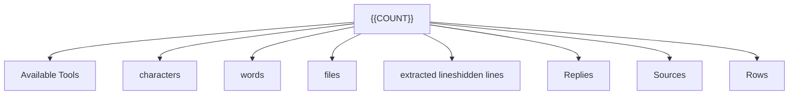
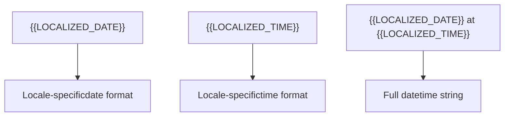
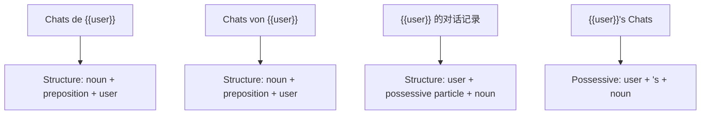
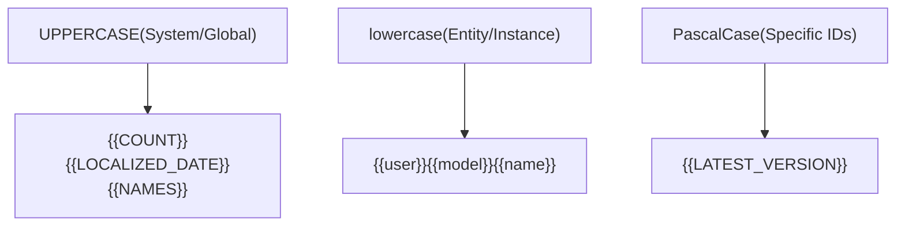
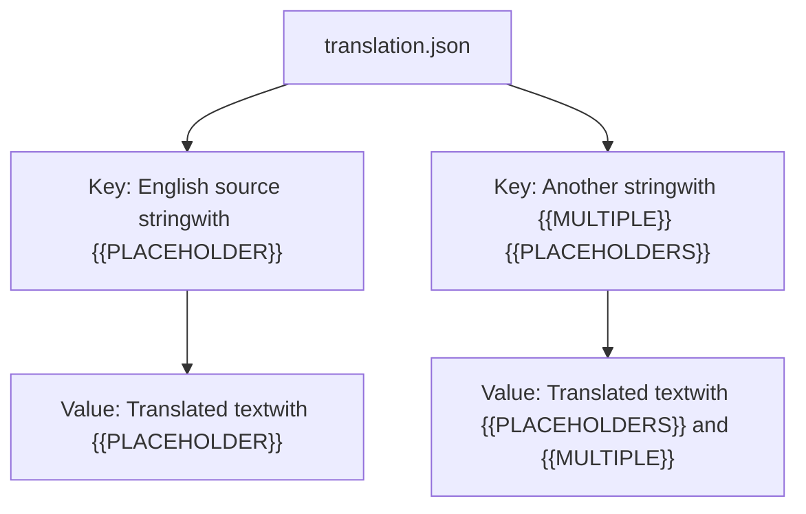
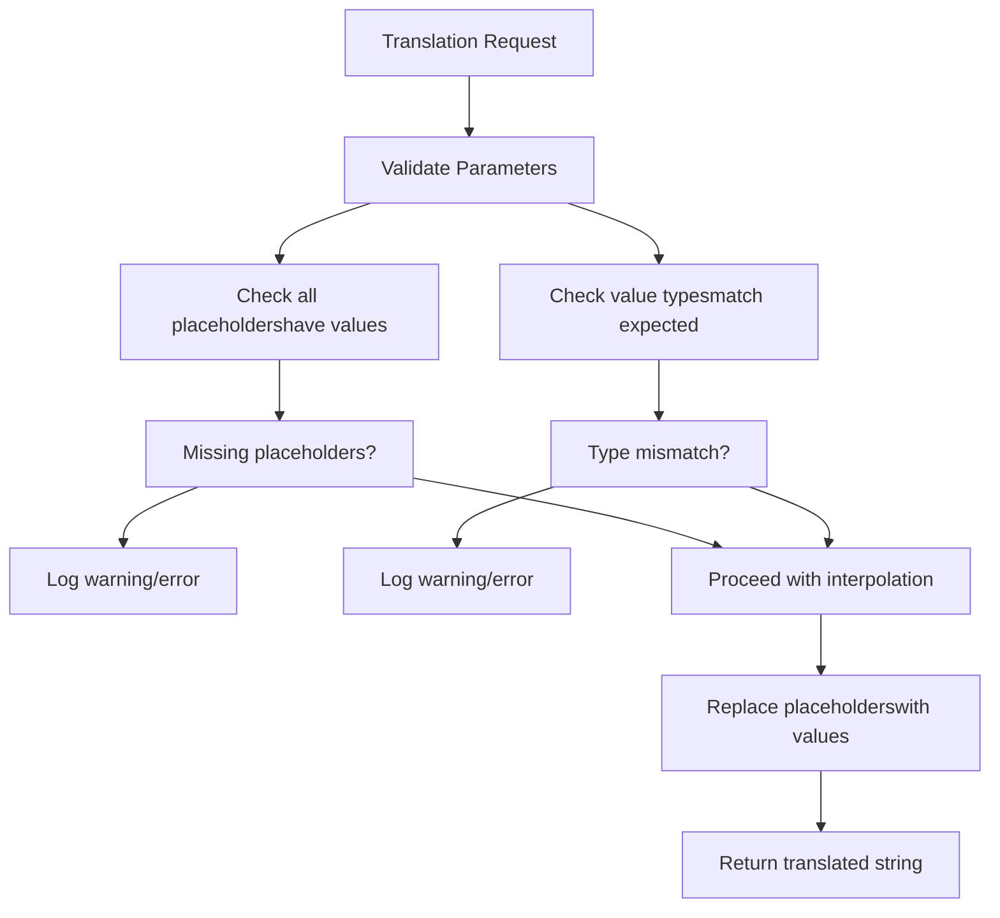

# Dynamic Content and Placeholders

Relevant source files

-   [src/lib/i18n/locales/bg-BG/translation.json](https://github.com/open-webui/open-webui/blob/a7271532/src/lib/i18n/locales/bg-BG/translation.json)
-   [src/lib/i18n/locales/ca-ES/translation.json](https://github.com/open-webui/open-webui/blob/a7271532/src/lib/i18n/locales/ca-ES/translation.json)
-   [src/lib/i18n/locales/de-DE/translation.json](https://github.com/open-webui/open-webui/blob/a7271532/src/lib/i18n/locales/de-DE/translation.json)
-   [src/lib/i18n/locales/en-GB/translation.json](https://github.com/open-webui/open-webui/blob/a7271532/src/lib/i18n/locales/en-GB/translation.json)
-   [src/lib/i18n/locales/en-US/translation.json](https://github.com/open-webui/open-webui/blob/a7271532/src/lib/i18n/locales/en-US/translation.json)
-   [src/lib/i18n/locales/es-ES/translation.json](https://github.com/open-webui/open-webui/blob/a7271532/src/lib/i18n/locales/es-ES/translation.json)
-   [src/lib/i18n/locales/fa-IR/translation.json](https://github.com/open-webui/open-webui/blob/a7271532/src/lib/i18n/locales/fa-IR/translation.json)
-   [src/lib/i18n/locales/fr-CA/translation.json](https://github.com/open-webui/open-webui/blob/a7271532/src/lib/i18n/locales/fr-CA/translation.json)
-   [src/lib/i18n/locales/fr-FR/translation.json](https://github.com/open-webui/open-webui/blob/a7271532/src/lib/i18n/locales/fr-FR/translation.json)
-   [src/lib/i18n/locales/it-IT/translation.json](https://github.com/open-webui/open-webui/blob/a7271532/src/lib/i18n/locales/it-IT/translation.json)
-   [src/lib/i18n/locales/ja-JP/translation.json](https://github.com/open-webui/open-webui/blob/a7271532/src/lib/i18n/locales/ja-JP/translation.json)
-   [src/lib/i18n/locales/ko-KR/translation.json](https://github.com/open-webui/open-webui/blob/a7271532/src/lib/i18n/locales/ko-KR/translation.json)
-   [src/lib/i18n/locales/nl-NL/translation.json](https://github.com/open-webui/open-webui/blob/a7271532/src/lib/i18n/locales/nl-NL/translation.json)
-   [src/lib/i18n/locales/pt-BR/translation.json](https://github.com/open-webui/open-webui/blob/a7271532/src/lib/i18n/locales/pt-BR/translation.json)
-   [src/lib/i18n/locales/pt-PT/translation.json](https://github.com/open-webui/open-webui/blob/a7271532/src/lib/i18n/locales/pt-PT/translation.json)
-   [src/lib/i18n/locales/ru-RU/translation.json](https://github.com/open-webui/open-webui/blob/a7271532/src/lib/i18n/locales/ru-RU/translation.json)
-   [src/lib/i18n/locales/uk-UA/translation.json](https://github.com/open-webui/open-webui/blob/a7271532/src/lib/i18n/locales/uk-UA/translation.json)
-   [src/lib/i18n/locales/vi-VN/translation.json](https://github.com/open-webui/open-webui/blob/a7271532/src/lib/i18n/locales/vi-VN/translation.json)
-   [src/lib/i18n/locales/zh-CN/translation.json](https://github.com/open-webui/open-webui/blob/a7271532/src/lib/i18n/locales/zh-CN/translation.json)
-   [src/lib/i18n/locales/zh-TW/translation.json](https://github.com/open-webui/open-webui/blob/a7271532/src/lib/i18n/locales/zh-TW/translation.json)

This document explains the placeholder system used in Open WebUI's internationalization framework to enable runtime value interpolation in translated strings. Placeholders allow dynamic content such as usernames, counts, dates, and model names to be inserted into localized UI text while maintaining proper translation structure across all supported languages.

For information about the overall translation system structure, see [Translation System Architecture](/open-webui/open-webui/15.1-translation-system-architecture). For details on supported languages, see [Locale Coverage](/open-webui/open-webui/15.2-locale-coverage).

## Overview and Purpose

The placeholder system provides a standardized mechanism for embedding dynamic runtime values into static translation strings. Instead of concatenating strings programmatically (which often produces grammatically incorrect translations), placeholders define insertion points that translators can position appropriately within each language's syntax.

This approach ensures:

-   Grammatical correctness across different language structures
-   Type-safe value interpolation
-   Consistent formatting across locales
-   Maintainable translation files

## Placeholder Syntax

### Format Convention

All placeholders follow a double curly brace syntax:

```
{{PLACEHOLDER_NAME}}
```
The placeholder name is case-sensitive and typically uses:

-   **UPPERCASE** for system values (`{{COUNT}}`, `{{LOCALIZED_DATE}}`)
-   **lowercase** for entity references (`{{user}}`, `{{model}}`, `{{name}}`)
-   **PascalCase** for specific identifiers (`{{LATEST_VERSION}}`)

### Preservation Across Locales

Placeholders maintain their exact format in all translation files. For example, the string `"{{COUNT}} Available Tools"` appears as:

| Locale | Translation |
| --- | --- |
| en-US | `"{{COUNT}} Available Tools"` |
| zh-CN | `"{{COUNT}} 个可用工具"` |
| de-DE | `"{{COUNT}} verfügbare Werkzeuge"` |
| es-ES | `"{{COUNT}} herramientas disponibles"` |
| fr-FR | `"{{COUNT}} outils disponibles"` |

Note how the placeholder `{{COUNT}}` remains unchanged while the surrounding text is translated.

**Sources:** [src/lib/i18n/locales/zh-CN/translation.json12](https://github.com/open-webui/open-webui/blob/a7271532/src/lib/i18n/locales/zh-CN/translation.json#L12-L12) [src/lib/i18n/locales/de-DE/translation.json12](https://github.com/open-webui/open-webui/blob/a7271532/src/lib/i18n/locales/de-DE/translation.json#L12-L12) [src/lib/i18n/locales/es-ES/translation.json12](https://github.com/open-webui/open-webui/blob/a7271532/src/lib/i18n/locales/es-ES/translation.json#L12-L12) [src/lib/i18n/locales/fr-FR/translation.json12](https://github.com/open-webui/open-webui/blob/a7271532/src/lib/i18n/locales/fr-FR/translation.json#L12-L12)

## Common Placeholder Types

### Numeric Placeholders


| Placeholder | Usage | Example |
| --- | --- | --- |
| `{{COUNT}}` | Generic count value | `"{{COUNT}} Available Tools"`, `"{{COUNT}} characters"` |

**Sources:** [src/lib/i18n/locales/zh-CN/translation.json12-20](https://github.com/open-webui/open-webui/blob/a7271532/src/lib/i18n/locales/zh-CN/translation.json#L12-L20) [src/lib/i18n/locales/de-DE/translation.json12-20](https://github.com/open-webui/open-webui/blob/a7271532/src/lib/i18n/locales/de-DE/translation.json#L12-L20)

### User and Identity Placeholders

| Placeholder | Purpose | Example Translation Key |
| --- | --- | --- |
| `{{user}}` | Username or user identifier | `"{{user}}'s Chats"` |
| `{{NAMES}}` | List of user names | `"{{NAMES}} reacted with {{REACTION}}"` |
| `{{role}}` | User role (admin, user, etc.) | `"Enter {{role}} message here"` |

**Sources:** [src/lib/i18n/locales/zh-CN/translation.json24](https://github.com/open-webui/open-webui/blob/a7271532/src/lib/i18n/locales/zh-CN/translation.json#L24-L24) [src/lib/i18n/locales/zh-CN/translation.json23](https://github.com/open-webui/open-webui/blob/a7271532/src/lib/i18n/locales/zh-CN/translation.json#L23-L23) [src/lib/i18n/locales/zh-CN/translation.json560](https://github.com/open-webui/open-webui/blob/a7271532/src/lib/i18n/locales/zh-CN/translation.json#L560-L560)

### Model and AI Entity Placeholders

| Placeholder | Purpose | Example Translation Key |
| --- | --- | --- |
| `{{model}}` | Single model name | `"{{model}} download has been canceled"` |
| `{{ models }}` | Multiple models reference | `"{{ models }}"` |
| `{{deleteModelTag}}` | Model tag being deleted | `"Deleted {{deleteModelTag}}"` |
| `{{modelTag}}` | Model tag identifier | `"Enter model tag (e.g. {{modelTag}})"` |

**Sources:** [src/lib/i18n/locales/zh-CN/translation.json11](https://github.com/open-webui/open-webui/blob/a7271532/src/lib/i18n/locales/zh-CN/translation.json#L11-L11) [src/lib/i18n/locales/zh-CN/translation.json22](https://github.com/open-webui/open-webui/blob/a7271532/src/lib/i18n/locales/zh-CN/translation.json#L22-L22) [src/lib/i18n/locales/zh-CN/translation.json436](https://github.com/open-webui/open-webui/blob/a7271532/src/lib/i18n/locales/zh-CN/translation.json#L436-L436)

### Temporal Placeholders


These placeholders are formatted according to each locale's conventions:

| Placeholder | Purpose | Example Output (varies by locale) |
| --- | --- | --- |
| `{{LOCALIZED_DATE}}` | Locale-formatted date | "2024-01-15" or "15/01/2024" |
| `{{LOCALIZED_TIME}}` | Locale-formatted time | "14:30" or "2:30 PM" |

**Sources:** [src/lib/i18n/locales/zh-CN/translation.json21](https://github.com/open-webui/open-webui/blob/a7271532/src/lib/i18n/locales/zh-CN/translation.json#L21-L21) [src/lib/i18n/locales/de-DE/translation.json21](https://github.com/open-webui/open-webui/blob/a7271532/src/lib/i18n/locales/de-DE/translation.json#L21-L21)

### Application and System Placeholders

| Placeholder | Purpose | Example Translation Key |
| --- | --- | --- |
| `{{webUIName}}` | Application name | `"{{webUIName}} Backend Required"` |
| `{{LATEST_VERSION}}` | Version number | `"A new version (v{{LATEST_VERSION}}) is now available."` |
| `{{COMMAND}}` | Command name | `"Activate this command by typing \"/{{COMMAND}}\" to chat input."` |

**Sources:** [src/lib/i18n/locales/zh-CN/translation.json25](https://github.com/open-webui/open-webui/blob/a7271532/src/lib/i18n/locales/zh-CN/translation.json#L25-L25) [src/lib/i18n/locales/zh-CN/translation.json30](https://github.com/open-webui/open-webui/blob/a7271532/src/lib/i18n/locales/zh-CN/translation.json#L30-L30) [src/lib/i18n/locales/zh-CN/translation.json47](https://github.com/open-webui/open-webui/blob/a7271532/src/lib/i18n/locales/zh-CN/translation.json#L47-L47)

### Content and Entity Placeholders

| Placeholder | Purpose | Example Translation Key |
| --- | --- | --- |
| `{{NAME}}` | Generic name field | `"Are you sure you want to delete \"{{NAME}}\"?"` |
| `{{TITLE}}` | Title or heading | `"Clone of {{TITLE}}"` |
| `{{name}}` | Lowercase name variant | `"Deleted {{name}}"`, `"By {{name}}"` |
| `{{provider}}` | Service provider name | `"Continue with {{provider}}"` |
| `{{url}}` | URL value | `"Failed to process URL: {{url}}"` |
| `{{error}}` | Error message | `"Error accessing Google Drive: {{error}}"` |

**Sources:** [src/lib/i18n/locales/zh-CN/translation.json153](https://github.com/open-webui/open-webui/blob/a7271532/src/lib/i18n/locales/zh-CN/translation.json#L153-L153) [src/lib/i18n/locales/zh-CN/translation.json283](https://github.com/open-webui/open-webui/blob/a7271532/src/lib/i18n/locales/zh-CN/translation.json#L283-L283) [src/lib/i18n/locales/zh-CN/translation.json437](https://github.com/open-webui/open-webui/blob/a7271532/src/lib/i18n/locales/zh-CN/translation.json#L437-L437) [src/lib/i18n/locales/zh-CN/translation.json217](https://github.com/open-webui/open-webui/blob/a7271532/src/lib/i18n/locales/zh-CN/translation.json#L217-L217)

### Social and Reaction Placeholders

| Placeholder | Purpose | Example Translation Key |
| --- | --- | --- |
| `{{REACTION}}` | Emoji or reaction type | `"{{NAMES}} reacted with {{REACTION}}"` |

**Sources:** [src/lib/i18n/locales/zh-CN/translation.json23](https://github.com/open-webui/open-webui/blob/a7271532/src/lib/i18n/locales/zh-CN/translation.json#L23-L23)

## Runtime Interpolation Process

> **[Mermaid sequence]**
> *(图表结构无法解析)*

### Interpolation Flow

1.  **Request Phase**: Code requests a translation with a key and parameter object
2.  **Locale Resolution**: i18n framework determines current user locale
3.  **Template Retrieval**: Corresponding template string is loaded from locale-specific JSON
4.  **Placeholder Replacement**: All `{{PLACEHOLDER}}` tokens are replaced with provided values
5.  **Rendering**: Final interpolated string is rendered in the UI

**Sources:** Inferred from translation file structure in [src/lib/i18n/locales/](https://github.com/open-webui/open-webui/blob/a7271532/src/lib/i18n/locales/)

## Placeholder Position Flexibility

Translators can reposition placeholders within sentences to match their language's grammar:


This flexibility ensures grammatical correctness while maintaining semantic equivalence across languages.

**Sources:** [src/lib/i18n/locales/zh-CN/translation.json24](https://github.com/open-webui/open-webui/blob/a7271532/src/lib/i18n/locales/zh-CN/translation.json#L24-L24) [src/lib/i18n/locales/de-DE/translation.json24](https://github.com/open-webui/open-webui/blob/a7271532/src/lib/i18n/locales/de-DE/translation.json#L24-L24) [src/lib/i18n/locales/es-ES/translation.json24](https://github.com/open-webui/open-webui/blob/a7271532/src/lib/i18n/locales/es-ES/translation.json#L24-L24)

## Multiple Placeholders in Single String

Some translation keys contain multiple placeholders:

```
"{{LOCALIZED_DATE}} at {{LOCALIZED_TIME}}" → "{{LOCALIZED_DATE}} {{LOCALIZED_TIME}}" (zh-CN)
"{{NAMES}} reacted with {{REACTION}}" → "{{NAMES}} 给了 {{REACTION}}" (zh-CN)
"and {{COUNT}} more" → "和另外 {{COUNT}} 个" (zh-TW)
```
Each placeholder is independently replaced during interpolation.

**Sources:** [src/lib/i18n/locales/zh-CN/translation.json21](https://github.com/open-webui/open-webui/blob/a7271532/src/lib/i18n/locales/zh-CN/translation.json#L21-L21) [src/lib/i18n/locales/zh-CN/translation.json23](https://github.com/open-webui/open-webui/blob/a7271532/src/lib/i18n/locales/zh-CN/translation.json#L23-L23) [src/lib/i18n/locales/zh-TW/translation.json130](https://github.com/open-webui/open-webui/blob/a7271532/src/lib/i18n/locales/zh-TW/translation.json#L130-L130)

## Special Cases and Edge Conditions

### Empty Placeholder Values

When a placeholder value is empty or null, the translation may appear incomplete. The i18n system typically handles this by:

-   Omitting the placeholder entirely
-   Using fallback values
-   Displaying placeholder warnings in development mode

### HTML and Markdown in Placeholders

Placeholders can contain formatted content that is interpolated as-is:

```
Key: "Failed to extract content from the file: {{error}}"
Value: {error: "<strong>Permission denied</strong>"}
Result: "Failed to extract content from the file: <strong>Permission denied</strong>"
```
### Nested Translation Keys

Some systems support nested placeholders, but Open WebUI uses a flat placeholder structure for simplicity and clarity.

**Sources:** [src/lib/i18n/locales/zh-CN/translation.json733-734](https://github.com/open-webui/open-webui/blob/a7271532/src/lib/i18n/locales/zh-CN/translation.json#L733-L734)

## Placeholder Naming Conventions

### Case Sensitivity Rules


| Convention | Usage | Examples |
| --- | --- | --- |
| UPPERCASE | System-level or aggregate values | `{{COUNT}}`, `{{LOCALIZED_DATE}}`, `{{NAMES}}`, `{{REACTION}}` |
| lowercase | Entity references, instances | `{{user}}`, `{{model}}`, `{{name}}`, `{{provider}}`, `{{role}}` |
| PascalCase | Specific compound identifiers | `{{LATEST_VERSION}}` |

**Sources:** Inferred from patterns across [src/lib/i18n/locales/zh-CN/translation.json](https://github.com/open-webui/open-webui/blob/a7271532/src/lib/i18n/locales/zh-CN/translation.json)

## Translation File Structure with Placeholders


Example from translation files:

```
{
  "{{COUNT}} Available Tools": "{{COUNT}} 个可用工具",
  "{{model}} download has been canceled": "已取消模型 {{model}} 的下载",
  "{{LOCALIZED_DATE}} at {{LOCALIZED_TIME}}": "{{LOCALIZED_DATE}} {{LOCALIZED_TIME}}"
}
```
**Sources:** [src/lib/i18n/locales/zh-CN/translation.json12](https://github.com/open-webui/open-webui/blob/a7271532/src/lib/i18n/locales/zh-CN/translation.json#L12-L12) [src/lib/i18n/locales/zh-CN/translation.json22](https://github.com/open-webui/open-webui/blob/a7271532/src/lib/i18n/locales/zh-CN/translation.json#L22-L22) [src/lib/i18n/locales/zh-CN/translation.json21](https://github.com/open-webui/open-webui/blob/a7271532/src/lib/i18n/locales/zh-CN/translation.json#L21-L21)

## Complete Placeholder Reference

Based on analysis of the translation files, here is a comprehensive table of all placeholder types:

| Category | Placeholder | Description | Example Key |
| --- | --- | --- | --- |
| **Numeric** | `{{COUNT}}` | Count or quantity | `"{{COUNT}} Available Tools"` |
| **User** | `{{user}}` | Username | `"{{user}}'s Chats"` |
| **User** | `{{NAMES}}` | Multiple user names | `"{{NAMES}} reacted with {{REACTION}}"` |
| **User** | `{{role}}` | User role | `"Enter {{role}} message here"` |
| **Model** | `{{model}}` | Model name | `"{{model}} download has been canceled"` |
| **Model** | `{{ models }}` | Multiple models | `"{{ models }}"` |
| **Model** | `{{deleteModelTag}}` | Model tag being deleted | `"Deleted {{deleteModelTag}}"` |
| **Model** | `{{modelTag}}` | Model tag | `"Enter model tag (e.g. {{modelTag}})"` |
| **Time** | `{{LOCALIZED_DATE}}` | Formatted date | `"{{LOCALIZED_DATE}} at {{LOCALIZED_TIME}}"` |
| **Time** | `{{LOCALIZED_TIME}}` | Formatted time | `"{{LOCALIZED_DATE}} at {{LOCALIZED_TIME}}"` |
| **App** | `{{webUIName}}` | Application name | `"{{webUIName}} Backend Required"` |
| **App** | `{{LATEST_VERSION}}` | Version number | `"A new version (v{{LATEST_VERSION}}) is now available."` |
| **App** | `{{COMMAND}}` | Command identifier | `"Activate this command by typing \"/{{COMMAND}}\""` |
| **Content** | `{{NAME}}` | Generic name (uppercase) | `"Are you sure you want to delete \"{{NAME}}\"?"` |
| **Content** | `{{name}}` | Generic name (lowercase) | `"Deleted {{name}}"`, `"By {{name}}"` |
| **Content** | `{{TITLE}}` | Title or heading | `"Clone of {{TITLE}}"` |
| **Content** | `{{provider}}` | Provider name | `"Continue with {{provider}}"` |
| **Error** | `{{error}}` | Error message | `"Error accessing Google Drive: {{error}}"` |
| **Error** | `{{url}}` | URL value | `"Failed to process URL: {{url}}"` |
| **Social** | `{{REACTION}}` | Reaction/emoji | `"{{NAMES}} reacted with {{REACTION}}"` |

**Sources:** [src/lib/i18n/locales/zh-CN/translation.json1-850](https://github.com/open-webui/open-webui/blob/a7271532/src/lib/i18n/locales/zh-CN/translation.json#L1-L850) [src/lib/i18n/locales/de-DE/translation.json1-850](https://github.com/open-webui/open-webui/blob/a7271532/src/lib/i18n/locales/de-DE/translation.json#L1-L850) [src/lib/i18n/locales/es-ES/translation.json1-850](https://github.com/open-webui/open-webui/blob/a7271532/src/lib/i18n/locales/es-ES/translation.json#L1-L850)

## Best Practices for Placeholder Usage

### For Developers

1.  **Use descriptive placeholder names** that clearly indicate the type of content
2.  **Maintain consistent case conventions** (UPPERCASE for system, lowercase for entities)
3.  **Always provide all required placeholder values** when requesting translations
4.  **Use type-safe interpolation** to prevent runtime errors
5.  **Avoid string concatenation** in favor of placeholder-based templates

### For Translators

1.  **Preserve all placeholders exactly** as they appear in the source string
2.  **Position placeholders appropriately** for your language's grammar
3.  **Test placeholder positioning** to ensure grammatical correctness
4.  **Do not translate placeholder names** (e.g., keep `{{COUNT}}`, not `{{数量}}`)
5.  **Maintain placeholder order** when possible, but prioritize natural language flow

## Placeholder Type Safety

While translation files are JSON and don't enforce types, the application code should validate:


**Sources:** Inferred from translation system requirements

---

This placeholder system provides a robust, maintainable approach to internationalization that preserves translation quality while enabling dynamic content across all 20 supported locales in Open WebUI.
