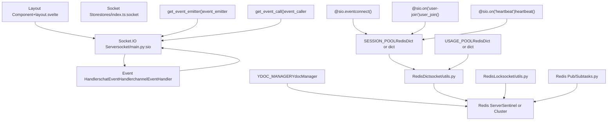
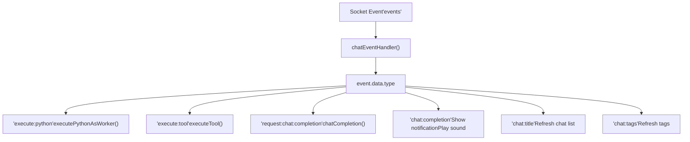
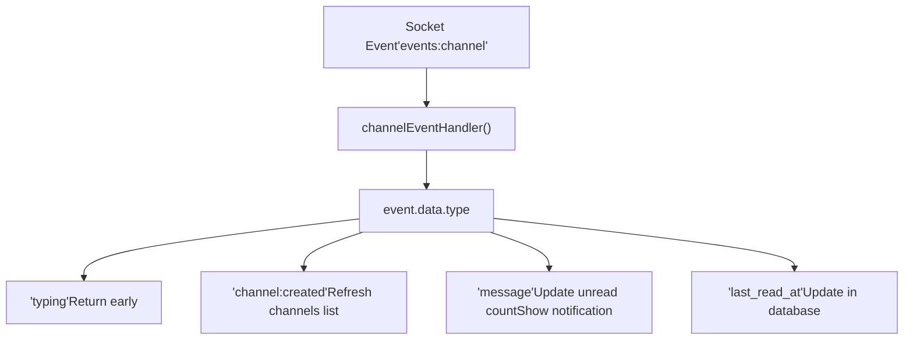
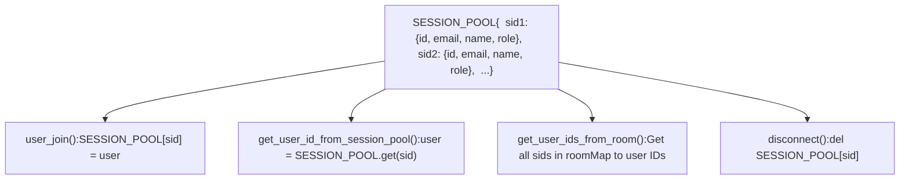
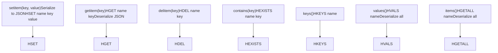
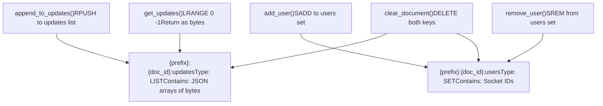
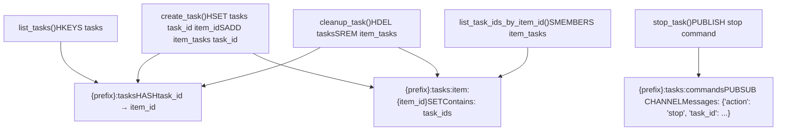
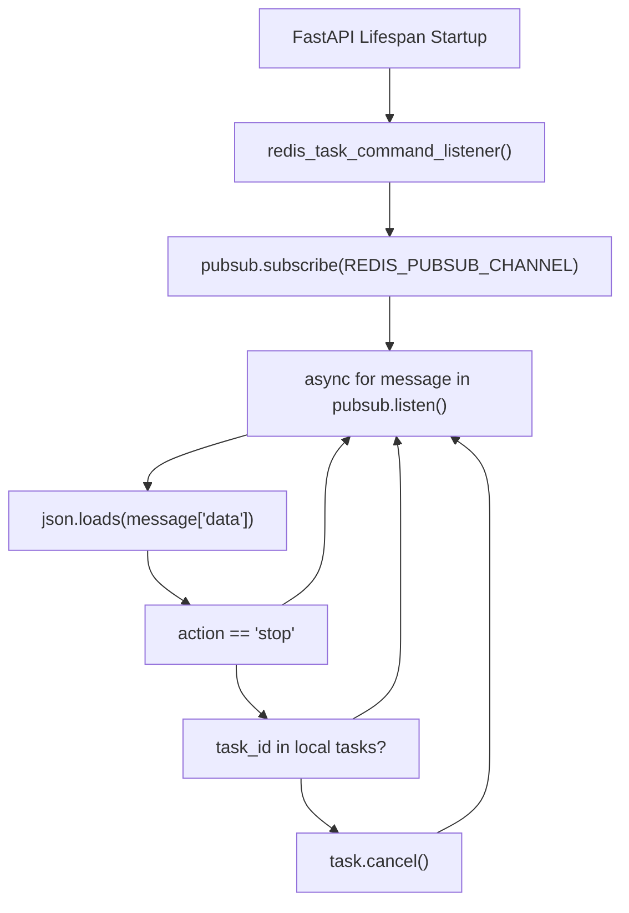
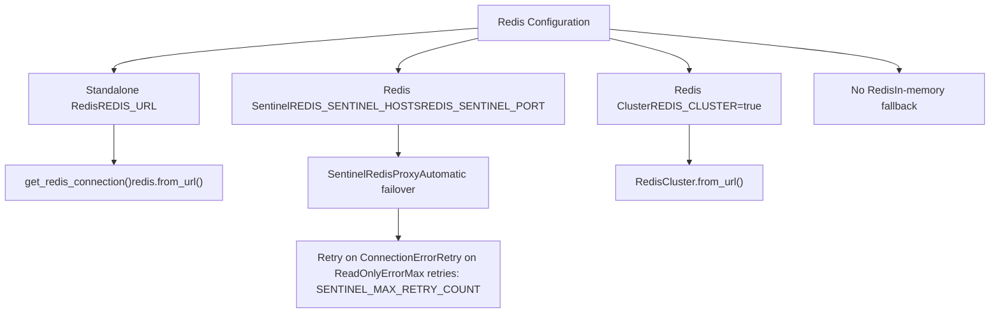
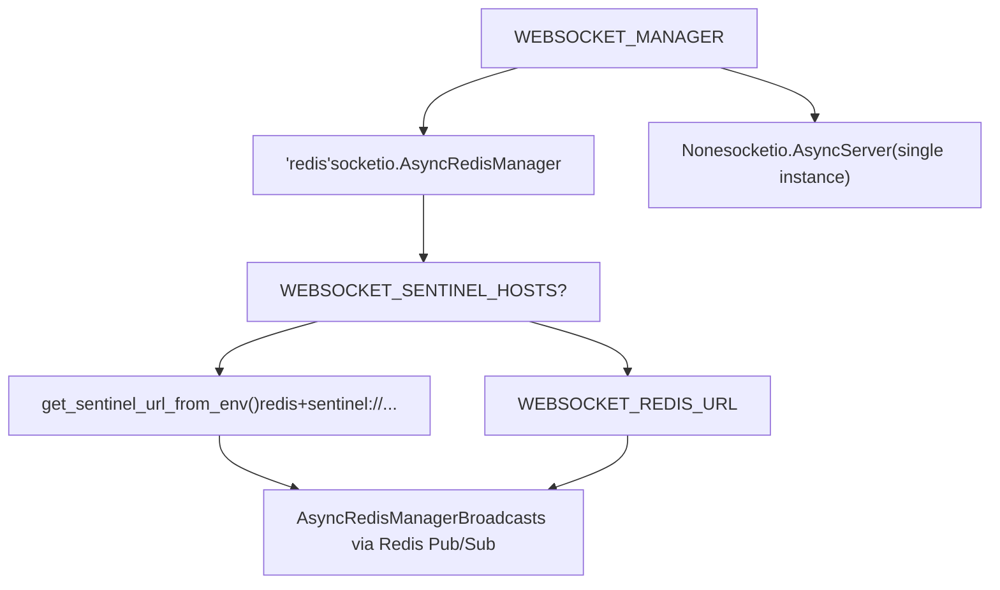

# Real-time Communication

Relevant source files

-   [backend/open\_webui/config.py](https://github.com/open-webui/open-webui/blob/a7271532/backend/open_webui/config.py)
-   [backend/open\_webui/main.py](https://github.com/open-webui/open-webui/blob/a7271532/backend/open_webui/main.py)
-   [backend/open\_webui/retrieval/loaders/datalab\_marker.py](https://github.com/open-webui/open-webui/blob/a7271532/backend/open_webui/retrieval/loaders/datalab_marker.py)
-   [backend/open\_webui/retrieval/loaders/external\_document.py](https://github.com/open-webui/open-webui/blob/a7271532/backend/open_webui/retrieval/loaders/external_document.py)
-   [backend/open\_webui/retrieval/loaders/external\_web.py](https://github.com/open-webui/open-webui/blob/a7271532/backend/open_webui/retrieval/loaders/external_web.py)
-   [backend/open\_webui/retrieval/loaders/main.py](https://github.com/open-webui/open-webui/blob/a7271532/backend/open_webui/retrieval/loaders/main.py)
-   [backend/open\_webui/retrieval/loaders/mineru.py](https://github.com/open-webui/open-webui/blob/a7271532/backend/open_webui/retrieval/loaders/mineru.py)
-   [backend/open\_webui/retrieval/loaders/mistral.py](https://github.com/open-webui/open-webui/blob/a7271532/backend/open_webui/retrieval/loaders/mistral.py)
-   [backend/open\_webui/retrieval/utils.py](https://github.com/open-webui/open-webui/blob/a7271532/backend/open_webui/retrieval/utils.py)
-   [backend/open\_webui/routers/retrieval.py](https://github.com/open-webui/open-webui/blob/a7271532/backend/open_webui/routers/retrieval.py)
-   [backend/open\_webui/utils/middleware.py](https://github.com/open-webui/open-webui/blob/a7271532/backend/open_webui/utils/middleware.py)
-   [src/lib/apis/retrieval/index.ts](https://github.com/open-webui/open-webui/blob/a7271532/src/lib/apis/retrieval/index.ts)
-   [src/lib/components/admin/Settings/Documents.svelte](https://github.com/open-webui/open-webui/blob/a7271532/src/lib/components/admin/Settings/Documents.svelte)
-   [src/lib/components/admin/Settings/WebSearch.svelte](https://github.com/open-webui/open-webui/blob/a7271532/src/lib/components/admin/Settings/WebSearch.svelte)

## Purpose and Scope

This document describes the real-time communication system in Open WebUI, which enables bidirectional communication between the frontend and backend using Socket.IO with optional Redis backing for distributed deployments. The system supports live chat streaming, collaborative document editing, session management, and distributed task coordination.

For information about chat message processing and streaming, see [Chat System](/open-webui/open-webui/3-installation-and-deployment). For backend configuration and environment setup, see [Environment Configuration](/open-webui/open-webui/9.3-collaborative-editing).

## Architecture Overview

The real-time communication layer connects the SvelteKit frontend to the FastAPI backend using Socket.IO, with Redis providing distributed state management for multi-instance deployments.

### System Components


**Sources:** [src/routes/+layout.svelte1-807](https://github.com/open-webui/open-webui/blob/a7271532/src/routes/+layout.svelte#L1-L807) [backend/open\_webui/socket/main.py1-839](https://github.com/open-webui/open-webui/blob/a7271532/backend/open_webui/socket/main.py#L1-L839) [backend/open\_webui/socket/utils.py1-224](https://github.com/open-webui/open-webui/blob/a7271532/backend/open_webui/socket/utils.py#L1-L224)

### Deployment Modes

The system supports two deployment modes:

| Mode | Manager | Use Case | State Storage |
| --- | --- | --- | --- |
| **Standalone** | `None` | Single server instance | In-memory dictionaries |
| **Distributed** | `redis` | Multiple server instances | Redis-backed `RedisDict` |

Sources: [backend/open\_webui/socket/main.py64-99](https://github.com/open-webui/open-webui/blob/a7271532/backend/open_webui/socket/main.py#L64-L99)

## WebSocket Connection Lifecycle

### Connection Establishment

> **[Mermaid sequence]**
> *(图表结构无法解析)*

**Sources:** [src/routes/+layout.svelte97-177](https://github.com/open-webui/open-webui/blob/a7271532/src/routes/+layout.svelte#L97-L177) [backend/open\_webui/socket/main.py302-359](https://github.com/open-webui/open-webui/blob/a7271532/backend/open_webui/socket/main.py#L302-L359)

The connection flow consists of:

1.  **Initial Connection** (`connect` event): Authenticates the WebSocket connection using JWT token from the `auth` parameter, stores user session in `SESSION_POOL`, and joins user-specific room.

2.  **User Join** (`user-join` event): Reinforces authentication after connection, re-joins user room, and automatically subscribes to all channel rooms the user is a member of.

3.  **Heartbeat**: Frontend sends heartbeat every 30 seconds to update user's `last_active` timestamp in the database.


### Room Management

Clients are organized into rooms for targeted event broadcasting:

| Room Pattern | Purpose | Members |
| --- | --- | --- |
| `user:{user_id}` | User-specific events | All sessions of a user |
| `channel:{channel_id}` | Channel messages | All members of a channel |
| `doc_{document_id}` | Collaborative editing | All editors of a document |
| `note:{note_id}` | Note access | Users with note access |

Sources: [backend/open\_webui/socket/main.py315-349](https://github.com/open-webui/open-webui/blob/a7271532/backend/open_webui/socket/main.py#L315-L349)

### Connection Teardown

> **[Mermaid sequence]**
> *(图表结构无法解析)*

**Sources:** [backend/open\_webui/socket/main.py684-692](https://github.com/open-webui/open-webui/blob/a7271532/backend/open_webui/socket/main.py#L684-L692)

## Event Handling System

### Frontend Event Handlers

The frontend registers two primary event handlers that process incoming events from the backend:

#### Chat Event Handler

The `chatEventHandler` processes chat-related events, including streaming responses, tool execution, and Python code execution.


**Sources:** [src/routes/+layout.svelte325-480](https://github.com/open-webui/open-webui/blob/a7271532/src/routes/+layout.svelte#L325-L480)

Event types handled:

| Event Type | Condition | Action |
| --- | --- | --- |
| `chat:completion` | Different chat or unfocused | Show notification toast, play sound |
| `chat:title` | Different chat | Refresh chat list |
| `chat:tags` | Different chat | Refresh tags list |
| `execute:python` | Same session | Execute Python code in Pyodide worker |
| `execute:tool` | Same session | Execute tool via API |
| `request:chat:completion` | Same session | Direct LLM completion via direct connections |

Sources: [src/routes/+layout.svelte325-480](https://github.com/open-webui/open-webui/blob/a7271532/src/routes/+layout.svelte#L325-L480)

#### Channel Event Handler

The `channelEventHandler` processes channel-related events for messaging and collaboration.


**Sources:** [src/routes/+layout.svelte482-569](https://github.com/open-webui/open-webui/blob/a7271532/src/routes/+layout.svelte#L482-L569)

### Backend Event Emission

The backend provides two mechanisms for emitting events to clients:

#### Event Emitter Pattern

Used for streaming chat responses with automatic database updates.

> **[Mermaid sequence]**
> *(图表结构无法解析)*

**Sources:** [backend/open\_webui/socket/main.py695-813](https://github.com/open-webui/open-webui/blob/a7271532/backend/open_webui/socket/main.py#L695-L813)

The event emitter handles these data types:

| Event Type | Database Action |
| --- | --- |
| `status` | Add message status via `add_message_status_to_chat_by_id_and_message_id()` |
| `message` | Append content via `upsert_message_to_chat_by_id_and_message_id()` |
| `replace` | Replace entire content |
| `embeds` | Extend embeds array |
| `files` | Extend files array |
| `source` / `citation` | Append to sources array |

Sources: [backend/open\_webui/socket/main.py716-803](https://github.com/open-webui/open-webui/blob/a7271532/backend/open_webui/socket/main.py#L716-L803)

#### Event Caller Pattern

Used for synchronous request-response communication via Socket.IO's `call` method.

> **[Mermaid sequence]**
> *(图表结构无法解析)*

**Sources:** [backend/open\_webui/socket/main.py815-838](https://github.com/open-webui/open-webui/blob/a7271532/backend/open_webui/socket/main.py#L815-L838)

## Session Management

### Session Pool Architecture

The `SESSION_POOL` maintains a mapping of socket IDs to user information for fast authentication and authorization checks.


**Sources:** [backend/open\_webui/socket/main.py129-156](https://github.com/open-webui/open-webui/blob/a7271532/backend/open_webui/socket/main.py#L129-L156) [backend/open\_webui/socket/main.py231-253](https://github.com/open-webui/open-webui/blob/a7271532/backend/open_webui/socket/main.py#L231-L253)

### Usage Pool for Model Tracking

The `USAGE_POOL` tracks which models are actively being used by which sessions, with automatic cleanup of stale entries.

> **[Mermaid sequence]**
> *(图表结构无法解析)*

**Sources:** [backend/open\_webui/socket/main.py288-216](https://github.com/open-webui/open-webui/blob/a7271532/backend/open_webui/socket/main.py#L288-L216)

The cleanup process uses a distributed lock (`RedisLock`) to ensure only one instance performs cleanup at a time in multi-instance deployments.

### RedisDict Implementation

The `RedisDict` class provides a dictionary-like interface backed by Redis hashes.


**Sources:** [backend/open\_webui/socket/utils.py49-118](https://github.com/open-webui/open-webui/blob/a7271532/backend/open_webui/socket/utils.py#L49-L118)

The implementation:

-   Serializes values as JSON for Redis storage
-   Supports standard dictionary operations (`[]`, `in`, `keys()`, `values()`, `items()`)
-   Provides `set()` for atomic replacement and `update()` for batch operations

## Collaborative Document Editing

The system implements real-time collaborative editing using Yjs CRDT (Conflict-free Replicated Data Type) with Redis-backed storage.

### Yjs Document Flow

> **[Mermaid sequence]**
> *(图表结构无法解析)*

**Sources:** [backend/open\_webui/socket/main.py448-661](https://github.com/open-webui/open-webui/blob/a7271532/backend/open_webui/socket/main.py#L448-L661)

### YdocManager Storage Structure

The `YdocManager` manages collaborative document state in Redis:


**Sources:** [backend/open\_webui/socket/utils.py120-224](https://github.com/open-webui/open-webui/blob/a7271532/backend/open_webui/socket/utils.py#L120-L224)

Key features:

-   **Updates Storage**: Each document update is stored as a JSON-serialized list of bytes in a Redis list
-   **User Tracking**: Active users are stored in a Redis set for each document
-   **Automatic Cleanup**: When the last user leaves, the document is cleaned up (both keys deleted)
-   **Fallback**: If Redis is unavailable, uses in-memory dictionaries

### Awareness Updates

In addition to document updates, the system supports awareness information (cursors, selections) that is not persisted:

> **[Mermaid sequence]**
> *(图表结构无法解析)*

**Sources:** [backend/open\_webui/socket/main.py664-681](https://github.com/open-webui/open-webui/blob/a7271532/backend/open_webui/socket/main.py#L664-L681)

## Distributed Task Management

The system provides distributed task coordination using Redis Pub/Sub, allowing any server instance to cancel tasks running on any other instance.

### Task Coordination Flow

> **[Mermaid sequence]**
> *(图表结构无法解析)*

**Sources:** [backend/open\_webui/tasks.py1-187](https://github.com/open-webui/open-webui/blob/a7271532/backend/open_webui/tasks.py#L1-L187)

### Task Storage Structure


**Sources:** [backend/open\_webui/tasks.py22-186](https://github.com/open-webui/open-webui/blob/a7271532/backend/open_webui/tasks.py#L22-L186)

### Listener Implementation

Each server instance runs a background listener for task commands:


**Sources:** [backend/open\_webui/tasks.py27-44](https://github.com/open-webui/open-webui/blob/a7271532/backend/open_webui/tasks.py#L27-L44)

## Redis Integration

### Connection Management

The system supports multiple Redis deployment configurations:


**Sources:** [backend/open\_webui/utils/redis.py132-209](https://github.com/open-webui/open-webui/blob/a7271532/backend/open_webui/utils/redis.py#L132-L209)

### Sentinel Failover Mechanism

The `SentinelRedisProxy` provides automatic failover with retry logic:

| Error Type | Cause | Action |
| --- | --- | --- |
| `ConnectionError` | Master node down | Retry with new master from Sentinel |
| `ReadOnlyError` | Write to old master after failover | Retry with new master |

Retry configuration:

-   Maximum retries: `REDIS_SENTINEL_MAX_RETRY_COUNT` (default from environment)
-   Applies to all operations except factory methods (`pipeline`, `pubsub`, `monitor`, `client`, `transaction`)

Sources: [backend/open\_webui/utils/redis.py22-101](https://github.com/open-webui/open-webui/blob/a7271532/backend/open_webui/utils/redis.py#L22-L101)

### Socket.IO Manager Configuration

The Socket.IO server manager determines how events are distributed across multiple server instances:


**Sources:** [backend/open\_webui/socket/main.py64-99](https://github.com/open-webui/open-webui/blob/a7271532/backend/open_webui/socket/main.py#L64-L99)

When `WEBSOCKET_MANAGER='redis'`:

-   Events emitted via `sio.emit()` are published to Redis Pub/Sub
-   All server instances subscribed to the same channel receive and deliver events to their connected clients
-   Enables horizontal scaling of the Socket.IO server

### RedisLock for Distributed Coordination

The `RedisLock` class provides distributed locking using Redis with automatic expiration:

> **[Mermaid sequence]**
> *(图表结构无法解析)*

**Sources:** [backend/open\_webui/socket/utils.py9-47](https://github.com/open-webui/open-webui/blob/a7271532/backend/open_webui/socket/utils.py#L9-L47)

Key methods:

-   `aquire_lock()`: Sets key with `NX` (only if not exists) and `EX` (expiration time)
-   `renew_lock()`: Sets key with `XX` (only if exists) to extend expiration
-   `release_lock()`: Deletes key only if the value matches the lock ID (prevents releasing another process's lock)

## Configuration Reference

### Environment Variables

| Variable | Purpose | Default | Values |
| --- | --- | --- | --- |
| `ENABLE_WEBSOCKET_SUPPORT` | Enable WebSocket transport | `True` | `True`, `False` |
| `WEBSOCKET_MANAGER` | Socket.IO backend | `None` | `None`, `redis` |
| `WEBSOCKET_REDIS_URL` | Redis connection URL | \- | `redis://host:port/db` |
| `WEBSOCKET_REDIS_CLUSTER` | Use Redis Cluster | `False` | `True`, `False` |
| `WEBSOCKET_SENTINEL_HOSTS` | Sentinel hosts (comma-separated) | \- | `host1,host2,host3` |
| `WEBSOCKET_SENTINEL_PORT` | Sentinel port | `26379` | Port number |
| `WEBSOCKET_REDIS_LOCK_TIMEOUT` | Lock expiration time (seconds) | \- | Integer |
| `WEBSOCKET_SERVER_PING_TIMEOUT` | Client ping timeout (seconds) | \- | Integer |
| `WEBSOCKET_SERVER_PING_INTERVAL` | Ping interval (seconds) | \- | Integer |
| `REDIS_KEY_PREFIX` | Redis key namespace | \- | String prefix |

Sources: [backend/open\_webui/env.py](https://github.com/open-webui/open-webui/blob/a7271532/backend/open_webui/env.py) (referenced in [backend/open\_webui/socket/main.py21-40](https://github.com/open-webui/open-webui/blob/a7271532/backend/open_webui/socket/main.py#L21-L40))

### Socket.IO Server Options

The `socketio.AsyncServer` is configured with:

```
sio = socketio.AsyncServer(
    cors_allowed_origins=SOCKETIO_CORS_ORIGINS,
    async_mode="asgi",
    transports=["websocket"] if ENABLE_WEBSOCKET_SUPPORT else ["polling"],
    allow_upgrades=ENABLE_WEBSOCKET_SUPPORT,
    always_connect=True,
    client_manager=mgr,  # AsyncRedisManager if WEBSOCKET_MANAGER='redis'
    logger=WEBSOCKET_SERVER_LOGGING,
    ping_interval=WEBSOCKET_SERVER_PING_INTERVAL,
    ping_timeout=WEBSOCKET_SERVER_PING_TIMEOUT,
    engineio_logger=WEBSOCKET_SERVER_ENGINEIO_LOGGING
)
```
Sources: [backend/open\_webui/socket/main.py76-99](https://github.com/open-webui/open-webui/blob/a7271532/backend/open_webui/socket/main.py#L76-L99)

### Frontend Socket Configuration

The frontend Socket.IO client is configured with:

```
const _socket = io(WEBUI_BASE_URL || undefined, {
    reconnection: true,
    reconnectionDelay: 1000,
    reconnectionDelayMax: 5000,
    randomizationFactor: 0.5,
    path: '/ws/socket.io',
    transports: enableWebsocket ? ['websocket'] : ['polling', 'websocket'],
    auth: { token: localStorage.token }
})
```
Sources: [src/routes/+layout.svelte98-106](https://github.com/open-webui/open-webui/blob/a7271532/src/routes/+layout.svelte#L98-L106)
