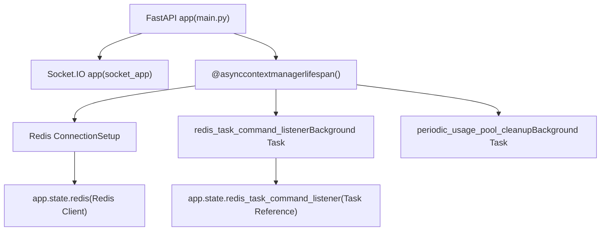
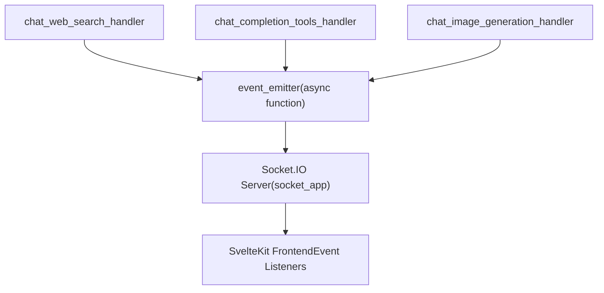
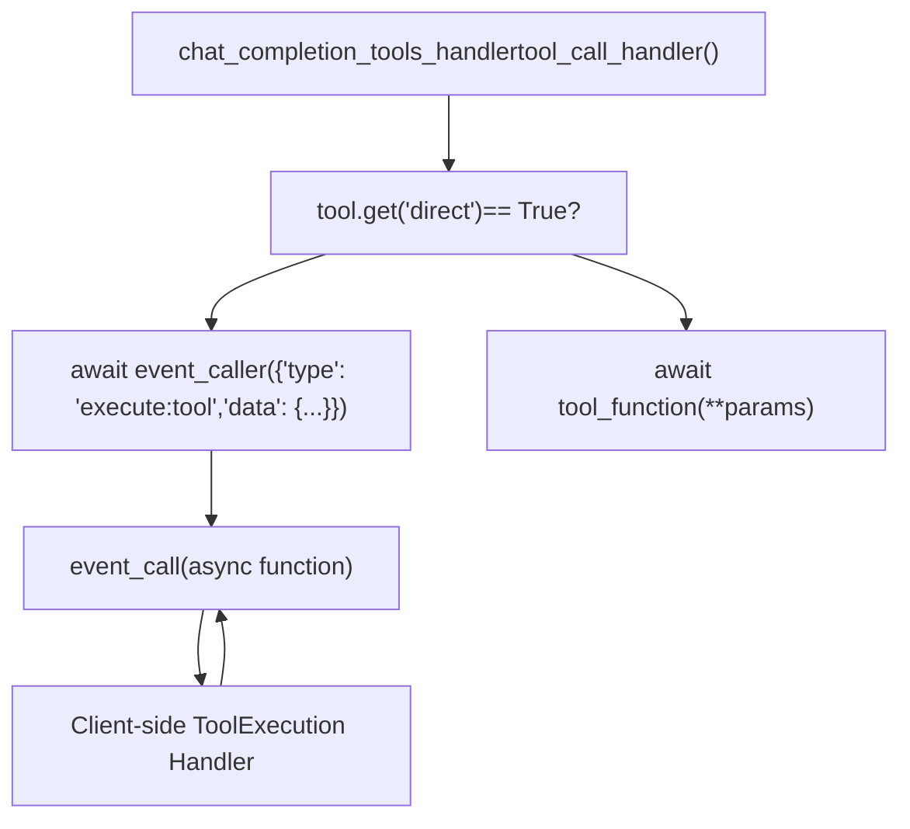
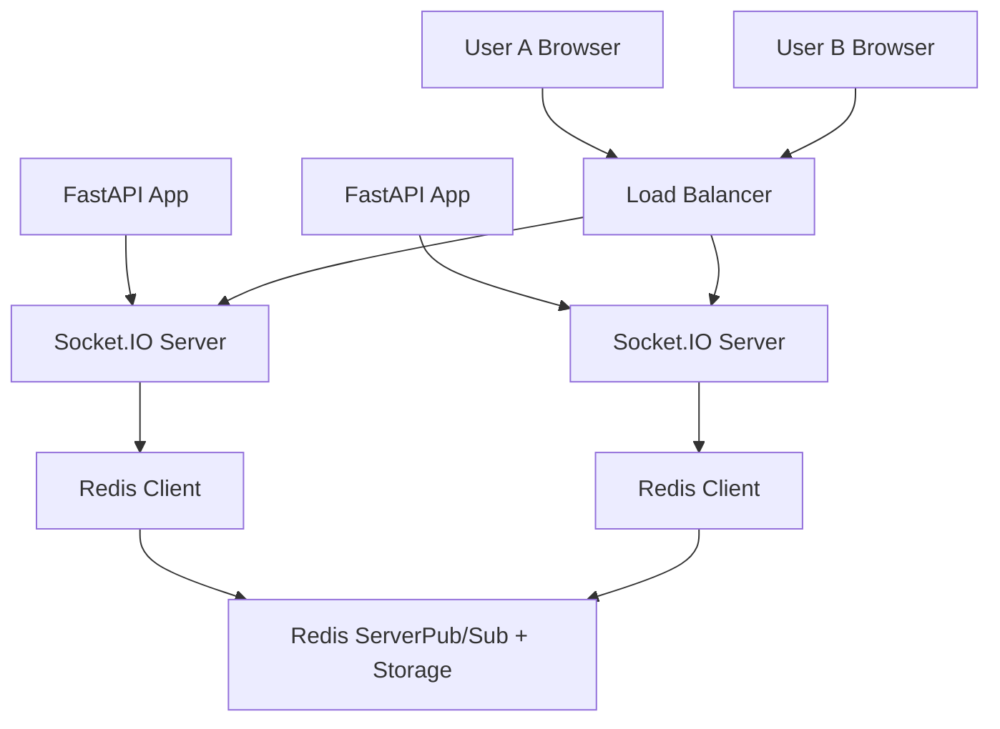
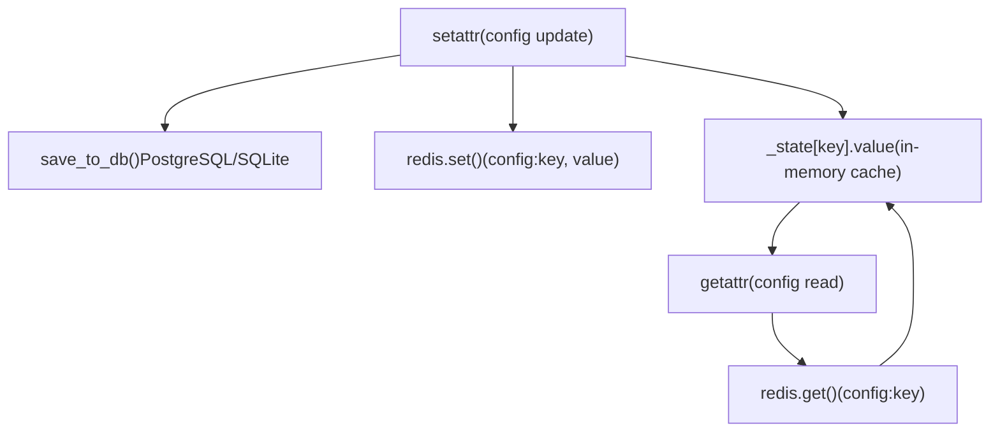
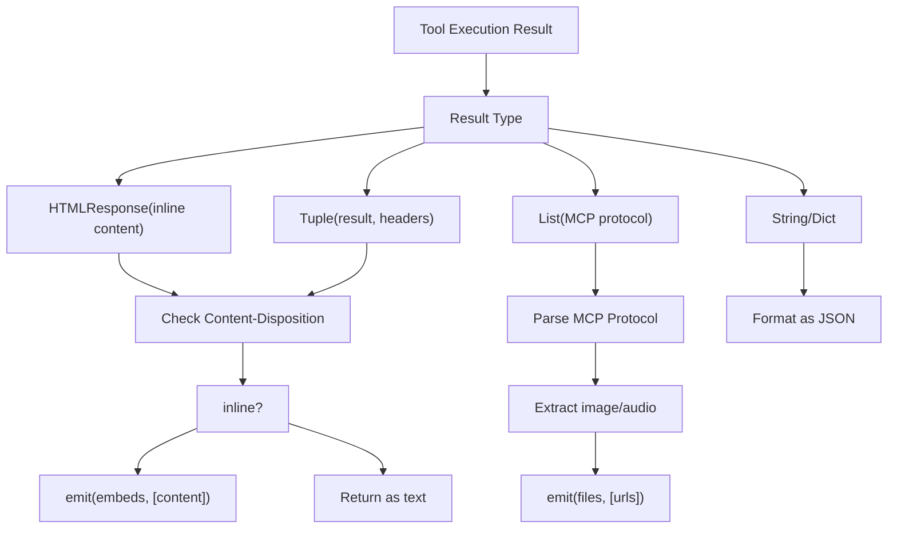

# WebSocket Architecture

Relevant source files

-   [backend/open\_webui/config.py](https://github.com/open-webui/open-webui/blob/a7271532/backend/open_webui/config.py)
-   [backend/open\_webui/main.py](https://github.com/open-webui/open-webui/blob/a7271532/backend/open_webui/main.py)
-   [backend/open\_webui/retrieval/loaders/datalab\_marker.py](https://github.com/open-webui/open-webui/blob/a7271532/backend/open_webui/retrieval/loaders/datalab_marker.py)
-   [backend/open\_webui/retrieval/loaders/external\_document.py](https://github.com/open-webui/open-webui/blob/a7271532/backend/open_webui/retrieval/loaders/external_document.py)
-   [backend/open\_webui/retrieval/loaders/external\_web.py](https://github.com/open-webui/open-webui/blob/a7271532/backend/open_webui/retrieval/loaders/external_web.py)
-   [backend/open\_webui/retrieval/loaders/main.py](https://github.com/open-webui/open-webui/blob/a7271532/backend/open_webui/retrieval/loaders/main.py)
-   [backend/open\_webui/retrieval/loaders/mineru.py](https://github.com/open-webui/open-webui/blob/a7271532/backend/open_webui/retrieval/loaders/mineru.py)
-   [backend/open\_webui/retrieval/loaders/mistral.py](https://github.com/open-webui/open-webui/blob/a7271532/backend/open_webui/retrieval/loaders/mistral.py)
-   [backend/open\_webui/retrieval/utils.py](https://github.com/open-webui/open-webui/blob/a7271532/backend/open_webui/retrieval/utils.py)
-   [backend/open\_webui/routers/retrieval.py](https://github.com/open-webui/open-webui/blob/a7271532/backend/open_webui/routers/retrieval.py)
-   [backend/open\_webui/utils/middleware.py](https://github.com/open-webui/open-webui/blob/a7271532/backend/open_webui/utils/middleware.py)
-   [src/lib/apis/retrieval/index.ts](https://github.com/open-webui/open-webui/blob/a7271532/src/lib/apis/retrieval/index.ts)
-   [src/lib/components/admin/Settings/Documents.svelte](https://github.com/open-webui/open-webui/blob/a7271532/src/lib/components/admin/Settings/Documents.svelte)
-   [src/lib/components/admin/Settings/WebSearch.svelte](https://github.com/open-webui/open-webui/blob/a7271532/src/lib/components/admin/Settings/WebSearch.svelte)

This page documents the WebSocket infrastructure that enables real-time, bidirectional communication between the Open WebUI frontend and backend. This system powers live status updates, streaming responses, file transfers, and collaborative features.

For information about the chat processing pipeline that uses these WebSocket events, see [Backend Processing Pipeline](/open-webui/open-webui/6-backend-processing-pipeline). For frontend event handling in the chat interface, see [WebSocket Event Handling](/open-webui/open-webui/4.5-websocket-event-handling).

**Sources:** [backend/open\_webui/main.py63-69](https://github.com/open-webui/open-webui/blob/a7271532/backend/open_webui/main.py#L63-L69) [backend/open\_webui/env.py470](https://github.com/open-webui/open-webui/blob/a7271532/backend/open_webui/env.py#L470-L470)

## System Overview

Open WebUI's WebSocket architecture provides a real-time event system that augments the HTTP-based API. The system is designed to be:

-   **Optional**: Can be disabled via `ENABLE_WEBSOCKET_SUPPORT` environment variable
-   **Distributed**: Uses Redis for multi-instance deployments
-   **Event-driven**: Supports bidirectional event communication (emit/call)
-   **Room-based**: Enables targeted messaging to specific sessions or users

The WebSocket system integrates with FastAPI using Socket.IO and mounts as a sub-application alongside the main HTTP routes.

**Sources:** [backend/open\_webui/main.py63-69](https://github.com/open-webui/open-webui/blob/a7271532/backend/open_webui/main.py#L63-L69) [backend/open\_webui/config.py470](https://github.com/open-webui/open-webui/blob/a7271532/backend/open_webui/config.py#L470-L470)

## WebSocket Application Mount


The Socket.IO application is imported as `socket_app` from `open_webui.socket.main` and mounted to the main FastAPI application. During application lifespan, Redis connections and background tasks are initialized.

**Sources:** [backend/open\_webui/main.py63-69](https://github.com/open-webui/open-webui/blob/a7271532/backend/open_webui/main.py#L63-L69) [backend/open\_webui/main.py586-604](https://github.com/open-webui/open-webui/blob/a7271532/backend/open_webui/main.py#L586-L604) [backend/open\_webui/main.py629-631](https://github.com/open-webui/open-webui/blob/a7271532/backend/open_webui/main.py#L629-L631)

## Event System Architecture

The WebSocket system provides two primary primitives for real-time communication:

### Event Emitter (Server → Client)

**Event Emitter** sends asynchronous notifications from the backend to connected clients without expecting a response. Used for status updates, streaming content, and notifications.


Event emitters are passed through the middleware pipeline via the `extra_params` dictionary with key `__event_emitter__`.

**Sources:** [backend/open\_webui/utils/middleware.py333-334](https://github.com/open-webui/open-webui/blob/a7271532/backend/open_webui/utils/middleware.py#L333-L334) [backend/open\_webui/utils/middleware.py439-458](https://github.com/open-webui/open-webui/blob/a7271532/backend/open_webui/utils/middleware.py#L439-L458)

### Event Caller (Server ↔ Client)

**Event Caller** sends synchronous requests from the backend to clients and waits for responses. Used for tool execution, user confirmations, and interactive features.


Event callers enable the backend to delegate execution to frontend capabilities, such as accessing clipboard, local storage, or browser APIs.

**Sources:** [backend/open\_webui/utils/middleware.py377-422](https://github.com/open-webui/open-webui/blob/a7271532/backend/open_webui/utils/middleware.py#L377-L422)

## Event Types and Payloads

The system uses typed event messages with standardized structures. Below are the primary event types used throughout the middleware pipeline:

| Event Type | Direction | Purpose | Payload Structure |
| --- | --- | --- | --- |
| `status` | Server → Client | Operation status updates | `{type: "status", data: {action, description, done, error?}}` |
| `files` | Server → Client | File/image transfers | `{type: "files", data: {files: [{type, url}]}}` |
| `embeds` | Server → Client | UI component embeds | `{type: "embeds", data: {embeds: [html_content]}}` |
| `execute:tool` | Server ↔ Client | Direct tool execution | `{type: "execute:tool", data: {id, name, params, server, session_id}}` |
| `citations` | Server → Client | Source citations | `{type: "citations", data: {citations: [...]}}` |

### Status Event Examples

> **[Mermaid stateDiagram]**
> *(图表结构无法解析)*

Status events follow a consistent pattern: initial event with `done=false`, followed by completion event with `done=true` and optional `error=true` for failures.

**Sources:** [backend/open\_webui/utils/middleware.py559-713](https://github.com/open-webui/open-webui/blob/a7271532/backend/open_webui/utils/middleware.py#L559-L713) [backend/open\_webui/utils/middleware.py769-851](https://github.com/open-webui/open-webui/blob/a7271532/backend/open_webui/utils/middleware.py#L769-L851)

## Redis Integration for Distributed Deployments

For multi-instance deployments, Redis provides a message broker for distributing WebSocket events across servers. This ensures users connected to different backend instances receive events correctly.


Redis configuration is established during application lifespan using `get_redis_connection()` with support for:

-   **Standard Redis**: Single server instance
-   **Redis Sentinel**: High availability with automatic failover
-   **Redis Cluster**: Distributed sharded deployment

**Sources:** [backend/open\_webui/main.py586-593](https://github.com/open-webui/open-webui/blob/a7271532/backend/open_webui/main.py#L586-L593) [backend/open\_webui/config.py224-283](https://github.com/open-webui/open-webui/blob/a7271532/backend/open_webui/config.py#L224-L283)

### Redis Connection Initialization

The Redis connection setup occurs in the application lifespan context manager:

```
# Pseudocode based on main.py:586-593
app.state.redis = get_redis_connection(
    redis_url=REDIS_URL,
    redis_sentinels=get_sentinels_from_env(REDIS_SENTINEL_HOSTS, REDIS_SENTINEL_PORT),
    redis_cluster=REDIS_CLUSTER,
    async_mode=True,
)

if app.state.redis is not None:
    app.state.redis_task_command_listener = asyncio.create_task(
        redis_task_command_listener(app)
    )
```
The `redis_task_command_listener` is a background task that monitors Redis for task control commands, enabling distributed task management across instances.

**Sources:** [backend/open\_webui/main.py586-598](https://github.com/open-webui/open-webui/blob/a7271532/backend/open_webui/main.py#L586-L598) [backend/open\_webui/main.py629-631](https://github.com/open-webui/open-webui/blob/a7271532/backend/open_webui/main.py#L629-L631)

## Configuration Management via Redis

When Redis is enabled, configuration changes are synchronized across all backend instances using Redis as a distributed cache:


The `AppConfig` class implements a dual-layer caching system: primary storage in the database with Redis acting as a fast-invalidation cache to synchronize configuration across instances.

**Sources:** [backend/open\_webui/config.py224-283](https://github.com/open-webui/open-webui/blob/a7271532/backend/open_webui/config.py#L224-L283)

## Session and Room Management

WebSocket connections are organized using:

### Session Identification

Each chat session receives a unique `session_id` passed through the event metadata. This identifier is used to:

-   Route events to specific client connections
-   Manage tool execution contexts
-   Track file uploads and associations

```
# From middleware.py tool execution context
metadata = {
    "chat_id": metadata.get("chat_id", None),
    "message_id": metadata.get("message_id", None),
    "session_id": metadata.get("session_id", None),
}
```
**Sources:** [backend/open\_webui/utils/middleware.py250-256](https://github.com/open-webui/open-webui/blob/a7271532/backend/open_webui/utils/middleware.py#L250-L256) [backend/open\_webui/utils/middleware.py410-417](https://github.com/open-webui/open-webui/blob/a7271532/backend/open_webui/utils/middleware.py#L410-L417)

### Room-Based Broadcasting

Events can be targeted to:

-   **Specific sessions**: One user's active chat session
-   **User rooms**: All sessions for a specific user
-   **Global broadcasts**: All connected clients (admin features)

The `MODELS` dictionary tracks active model usage across sessions for resource management and cleanup.

**Sources:** [backend/open\_webui/main.py64](https://github.com/open-webui/open-webui/blob/a7271532/backend/open_webui/main.py#L64-L64)

## Event Flow in Chat Pipeline

The following diagram illustrates how WebSocket events integrate with the chat processing middleware:

> **[Mermaid sequence]**
> *(图表结构无法解析)*

Events are emitted at key pipeline stages: before expensive operations (web search, image generation), during tool execution, when transferring files/embeds, and during streaming responses.

**Sources:** [backend/open\_webui/utils/middleware.py555-714](https://github.com/open-webui/open-webui/blob/a7271532/backend/open_webui/utils/middleware.py#L555-L714) [backend/open\_webui/utils/middleware.py755-851](https://github.com/open-webui/open-webui/blob/a7271532/backend/open_webui/utils/middleware.py#L755-L851)

## Periodic Cleanup Tasks

The WebSocket system includes background maintenance tasks:

### Usage Pool Cleanup

`periodic_usage_pool_cleanup()` runs continuously to manage the `MODELS` dictionary, which tracks active model usage. This prevents memory leaks from abandoned sessions and provides metrics for resource monitoring.

```
# From main.py:604
asyncio.create_task(periodic_usage_pool_cleanup())
```
This task is created during application startup and runs for the application's lifetime.

**Sources:** [backend/open\_webui/main.py604](https://github.com/open-webui/open-webui/blob/a7271532/backend/open_webui/main.py#L604-L604)

### Redis Task Command Listener

When Redis is available, a dedicated task monitors Redis pub/sub channels for distributed task commands:

```
# From main.py:595-598
if app.state.redis is not None:
    app.state.redis_task_command_listener = asyncio.create_task(
        redis_task_command_listener(app)
    )
```
This listener is cancelled during application shutdown to ensure clean termination.

**Sources:** [backend/open\_webui/main.py595-598](https://github.com/open-webui/open-webui/blob/a7271532/backend/open_webui/main.py#L595-L598) [backend/open\_webui/main.py629-631](https://github.com/open-webui/open-webui/blob/a7271532/backend/open_webui/main.py#L629-L631)

## Tool Result Processing

Tool execution results can include special response types that trigger WebSocket events:


The `process_tool_result()` function handles these transformations, extracting embeddable content (HTML iframes) and file attachments (images, audio) to emit as separate WebSocket events.

**Sources:** [backend/open\_webui/utils/middleware.py143-283](https://github.com/open-webui/open-webui/blob/a7271532/backend/open_webui/utils/middleware.py#L143-L283)

## Integration with Middleware Pipeline

WebSocket event handlers are passed through the middleware pipeline as part of the `extra_params` dictionary:

| Key | Type | Purpose |
| --- | --- | --- |
| `__event_emitter__` | `async callable` | Send events to client (no response) |
| `__event_call__` | `async callable` | Request/response with client |
| `__metadata__` | `dict` | Session context (chat\_id, message\_id, session\_id) |

These are injected at the entry point of the chat completion handler and threaded through all middleware functions:

```
# Pseudocode pattern used throughout middleware.py
async def chat_web_search_handler(request, form_data, extra_params, user):
    event_emitter = extra_params["__event_emitter__"]

    await event_emitter({
        "type": "status",
        "data": {"action": "web_search", "done": False}
    })

    # ... perform operation ...

    await event_emitter({
        "type": "status",
        "data": {"action": "web_search", "done": True}
    })
```
**Sources:** [backend/open\_webui/utils/middleware.py332-334](https://github.com/open-webui/open-webui/blob/a7271532/backend/open_webui/utils/middleware.py#L332-L334) [backend/open\_webui/utils/middleware.py555-625](https://github.com/open-webui/open-webui/blob/a7271532/backend/open_webui/utils/middleware.py#L555-L625)

## Environment Configuration

WebSocket support is controlled by environment variables:

| Variable | Default | Purpose |
| --- | --- | --- |
| `ENABLE_WEBSOCKET_SUPPORT` | \- | Enable/disable WebSocket functionality |
| `REDIS_URL` | \- | Redis connection URL for distributed mode |
| `REDIS_CLUSTER` | `False` | Use Redis Cluster instead of standalone |
| `REDIS_SENTINEL_HOSTS` | \- | Comma-separated sentinel hosts |
| `REDIS_SENTINEL_PORT` | \- | Sentinel port number |
| `REDIS_KEY_PREFIX` | `open-webui` | Prefix for all Redis keys |

When `REDIS_URL` is not configured, WebSocket events are only distributed within the single server instance.

**Sources:** [backend/open\_webui/env.py447-451](https://github.com/open-webui/open-webui/blob/a7271532/backend/open_webui/env.py#L447-L451) [backend/open\_webui/config.py224-236](https://github.com/open-webui/open-webui/blob/a7271532/backend/open_webui/config.py#L224-L236)
