# Event Handling System

Relevant source files

-   [src/lib/components/channel/MessageInput.svelte](https://github.com/open-webui/open-webui/blob/a7271532/src/lib/components/channel/MessageInput.svelte)
-   [src/lib/components/chat/Chat.svelte](https://github.com/open-webui/open-webui/blob/a7271532/src/lib/components/chat/Chat.svelte)
-   [src/lib/components/chat/ChatPlaceholder.svelte](https://github.com/open-webui/open-webui/blob/a7271532/src/lib/components/chat/ChatPlaceholder.svelte)
-   [src/lib/components/chat/MessageInput.svelte](https://github.com/open-webui/open-webui/blob/a7271532/src/lib/components/chat/MessageInput.svelte)
-   [src/lib/components/chat/Placeholder.svelte](https://github.com/open-webui/open-webui/blob/a7271532/src/lib/components/chat/Placeholder.svelte)
-   [src/lib/components/chat/Suggestions.svelte](https://github.com/open-webui/open-webui/blob/a7271532/src/lib/components/chat/Suggestions.svelte)
-   [src/lib/components/common/FileItem.svelte](https://github.com/open-webui/open-webui/blob/a7271532/src/lib/components/common/FileItem.svelte)
-   [src/lib/components/common/FileItemModal.svelte](https://github.com/open-webui/open-webui/blob/a7271532/src/lib/components/common/FileItemModal.svelte)

## Purpose and Scope

The Event Handling System manages real-time bidirectional communication between the Open WebUI frontend and backend using Socket.IO. This system enables features like live chat streaming, collaborative document editing, typing indicators, usage tracking, and system notifications. It provides both client-to-server and server-to-client event flows with support for distributed deployments via Redis.

For information about the WebSocket connection setup and room management, see [WebSocket Architecture](/open-webui/open-webui/8.1-sidebar-architecture). For collaborative editing features, see [Collaborative Document Editing](/open-webui/open-webui/8.3-chat-item-management). For distributed task coordination, see [Distributed Task Management](/open-webui/open-webui/8.4-drag-and-drop-system).

## System Architecture

### Event Flow Overview

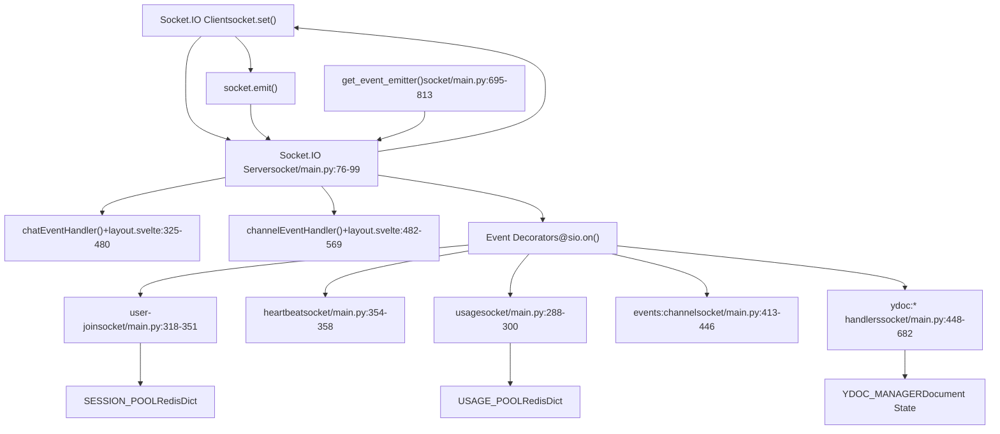
**Sources:** [backend/open\_webui/socket/main.py1-839](https://github.com/open-webui/open-webui/blob/a7271532/backend/open_webui/socket/main.py#L1-L839) [src/routes/+layout.svelte97-177](https://github.com/open-webui/open-webui/blob/a7271532/src/routes/+layout.svelte#L97-L177) [src/routes/+layout.svelte325-569](https://github.com/open-webui/open-webui/blob/a7271532/src/routes/+layout.svelte#L325-L569)

### Redis-Backed State Management

The system uses Redis data structures for distributed state across multiple server instances:

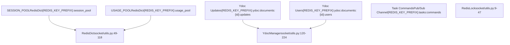
**Sources:** [backend/open\_webui/socket/main.py107-165](https://github.com/open-webui/open-webui/blob/a7271532/backend/open_webui/socket/main.py#L107-L165) [backend/open\_webui/socket/utils.py9-224](https://github.com/open-webui/open-webui/blob/a7271532/backend/open_webui/socket/utils.py#L9-L224)

## Event Categories

### Chat Events

Chat events are emitted on the `events` channel and handle chat completion streaming, status updates, and task execution:

| Event Type | Direction | Handler | Purpose |
| --- | --- | --- | --- |
| `events` | Server → Client | `chatEventHandler()` | Multipurpose chat event delivery |
| `chat:completion` | Server → Client | Lines 343-377 | Streaming chat responses with done flag |
| `chat:title` | Server → Client | Lines 378-380 | Title generation notification |
| `chat:tags` | Server → Client | Lines 381-383 | Tag updates notification |
| `execute:python` | Server → Client (RPC) | Lines 385-387 | Python code execution in Pyodide |
| `execute:tool` | Server → Client (RPC) | Lines 388-390 | Tool execution request |
| `request:chat:completion` | Server → Client (RPC) | Lines 391-475 | Direct connection chat completion |

**Event Data Structure for `chat:completion`:**

```
{
  chat_id: string,
  message_id: string,
  data: {
    type: "chat:completion",
    data: {
      done: boolean,
      content: string,
      title?: string
    }
  }
}
```
**Sources:** [src/routes/+layout.svelte325-480](https://github.com/open-webui/open-webui/blob/a7271532/src/routes/+layout.svelte#L325-L480) [backend/open\_webui/socket/main.py695-813](https://github.com/open-webui/open-webui/blob/a7271532/backend/open_webui/socket/main.py#L695-L813)

### Channel Events

Channel events manage real-time communication in channels (group chats and direct messages):

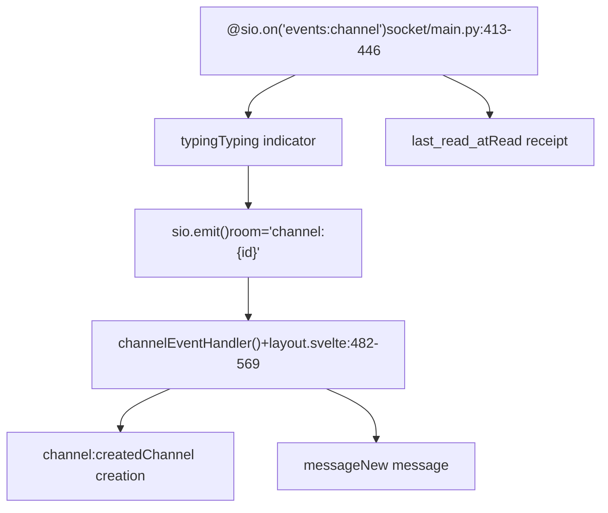
**Sources:** [src/routes/+layout.svelte482-569](https://github.com/open-webui/open-webui/blob/a7271532/src/routes/+layout.svelte#L482-L569) [backend/open\_webui/socket/main.py413-446](https://github.com/open-webui/open-webui/blob/a7271532/backend/open_webui/socket/main.py#L413-L446)

### Collaborative Document Events (Ydoc)

Yjs-based collaborative editing events use a CRDT approach for real-time document synchronization:

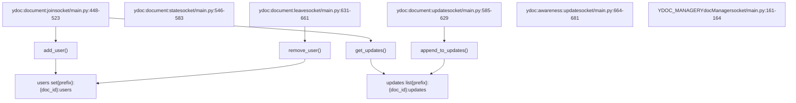
**Sources:** [backend/open\_webui/socket/main.py448-682](https://github.com/open-webui/open-webui/blob/a7271532/backend/open_webui/socket/main.py#L448-L682) [backend/open\_webui/socket/utils.py120-224](https://github.com/open-webui/open-webui/blob/a7271532/backend/open_webui/socket/utils.py#L120-L224)

### System Events

System-level events manage connections, authentication, and usage tracking:

| Event | Handler | Purpose | Session Data |
| --- | --- | --- | --- |
| `connect` | Lines 302-316 | Initial connection with JWT auth | Adds to SESSION\_POOL |
| `user-join` | Lines 318-351 | User authentication and room joining | Joins user:{id} and channel rooms |
| `heartbeat` | Lines 354-358 | Keep-alive and activity tracking | Updates last\_active timestamp |
| `usage` | Lines 288-300 | Model usage tracking | Updates USAGE\_POOL\[model\_id\]\[sid\] |
| `disconnect` | Lines 684-692 | Cleanup on disconnection | Removes from SESSION\_POOL and Ydoc |

**Sources:** [backend/open\_webui/socket/main.py288-358](https://github.com/open-webui/open-webui/blob/a7271532/backend/open_webui/socket/main.py#L288-L358) [backend/open\_webui/socket/main.py684-692](https://github.com/open-webui/open-webui/blob/a7271532/backend/open_webui/socket/main.py#L684-L692)

## Frontend Event Handling

### Socket.IO Client Setup

The frontend establishes the WebSocket connection during application initialization:

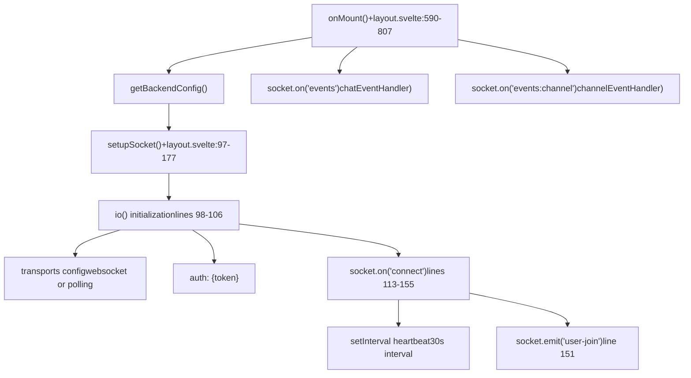
**Sources:** [src/routes/+layout.svelte97-177](https://github.com/open-webui/open-webui/blob/a7271532/src/routes/+layout.svelte#L97-L177) [src/routes/+layout.svelte590-807](https://github.com/open-webui/open-webui/blob/a7271532/src/routes/+layout.svelte#L590-L807) [src/routes/+layout.svelte683-708](https://github.com/open-webui/open-webui/blob/a7271532/src/routes/+layout.svelte#L683-L708)

### Chat Event Handler

The `chatEventHandler` processes events from the server and executes corresponding actions:

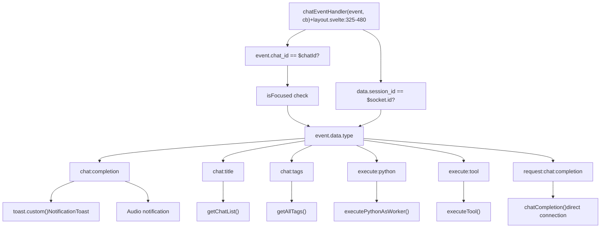
**Key event types handled:**

-   **`chat:completion`**: Displays notifications and plays sounds when chat responses complete
-   **`chat:title`**: Refreshes the chat list after title generation
-   **`chat:tags`**: Updates the global tags store
-   **`execute:python`**: Executes Python code in Pyodide worker with callback
-   **`execute:tool`**: Executes tool server operations with authentication
-   **`request:chat:completion`**: Handles direct connection chat completions for models with direct API access

**Sources:** [src/routes/+layout.svelte325-480](https://github.com/open-webui/open-webui/blob/a7271532/src/routes/+layout.svelte#L325-L480)

### Channel Event Handler

The `channelEventHandler` processes channel-related events and updates UI state:

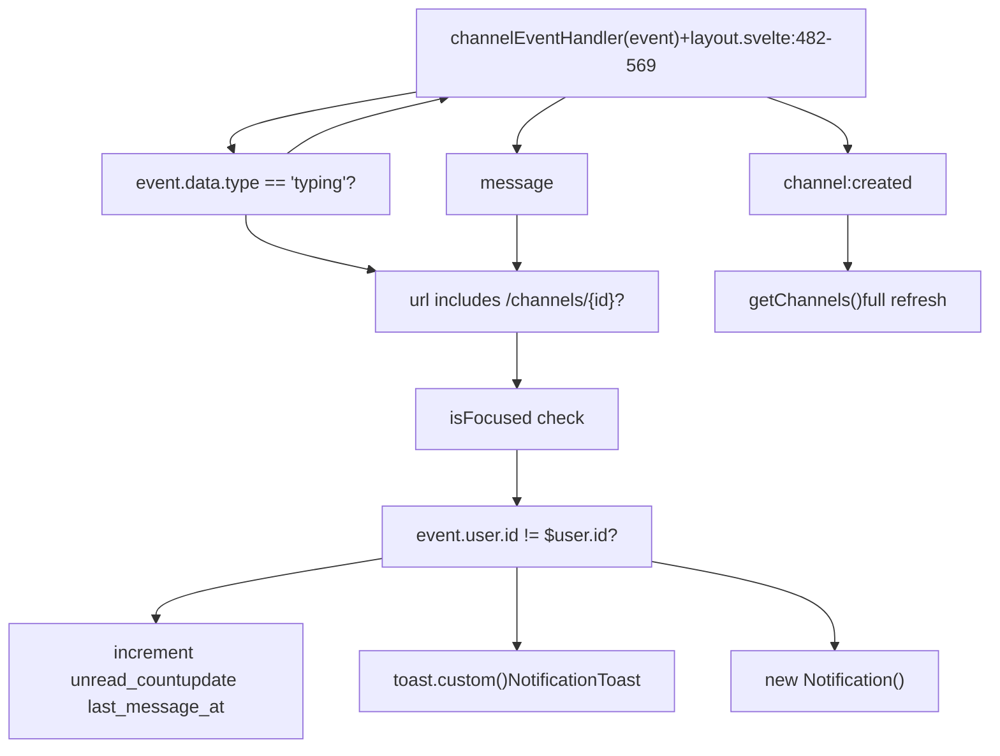
**Sources:** [src/routes/+layout.svelte482-569](https://github.com/open-webui/open-webui/blob/a7271532/src/routes/+layout.svelte#L482-L569)

## Backend Event Handlers

### Event Registration Pattern

Backend handlers use the `@sio.on()` decorator to register event listeners:

```
@sio.on("event-name")
async def event_handler(sid, data):
    # sid: session ID of the client
    # data: event payload
    pass
```
### Session and Room Management

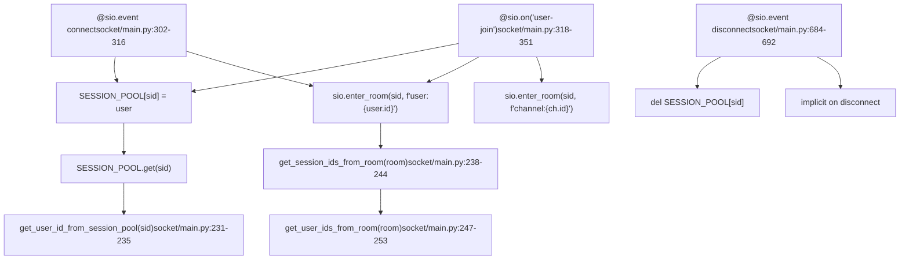
**Sources:** [backend/open\_webui/socket/main.py231-253](https://github.com/open-webui/open-webui/blob/a7271532/backend/open_webui/socket/main.py#L231-L253) [backend/open\_webui/socket/main.py302-351](https://github.com/open-webui/open-webui/blob/a7271532/backend/open_webui/socket/main.py#L302-L351) [backend/open\_webui/socket/main.py684-692](https://github.com/open-webui/open-webui/blob/a7271532/backend/open_webui/socket/main.py#L684-L692)

### Usage Tracking

Model usage is tracked in real-time with automatic cleanup:

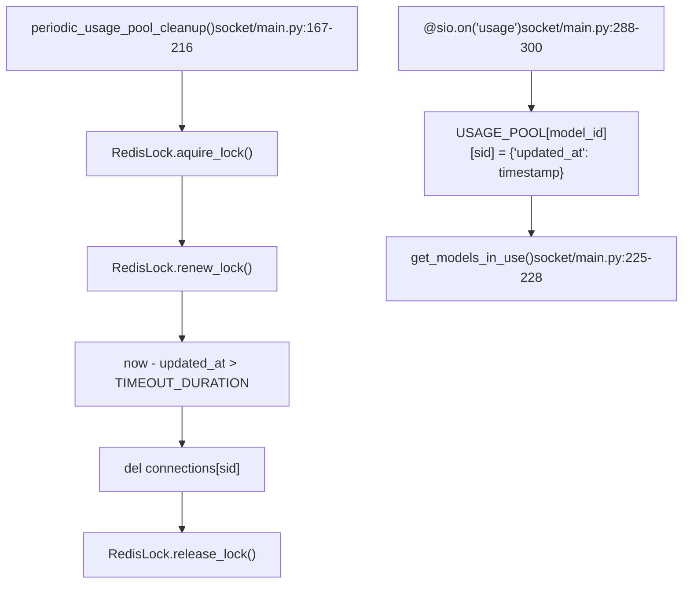
**Sources:** [backend/open\_webui/socket/main.py167-228](https://github.com/open-webui/open-webui/blob/a7271532/backend/open_webui/socket/main.py#L167-L228) [backend/open\_webui/socket/main.py288-300](https://github.com/open-webui/open-webui/blob/a7271532/backend/open_webui/socket/main.py#L288-L300)

## Event Emission Patterns

### Event Emitter Pattern

The `get_event_emitter` function creates an async callback for streaming responses from the backend to the frontend:

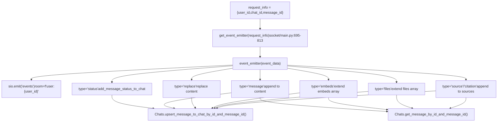
**Event data structure:**

```
{
    "chat_id": str,
    "message_id": str,
    "data": {
        "type": str,  # "status", "message", "replace", "embeds", "files", "source", "citation"
        "data": dict  # type-specific payload
    }
}
```
**Sources:** [backend/open\_webui/socket/main.py695-813](https://github.com/open-webui/open-webui/blob/a7271532/backend/open_webui/socket/main.py#L695-L813)

### Event Caller Pattern

The `get_event_call` function enables request-response style RPC over Socket.IO:

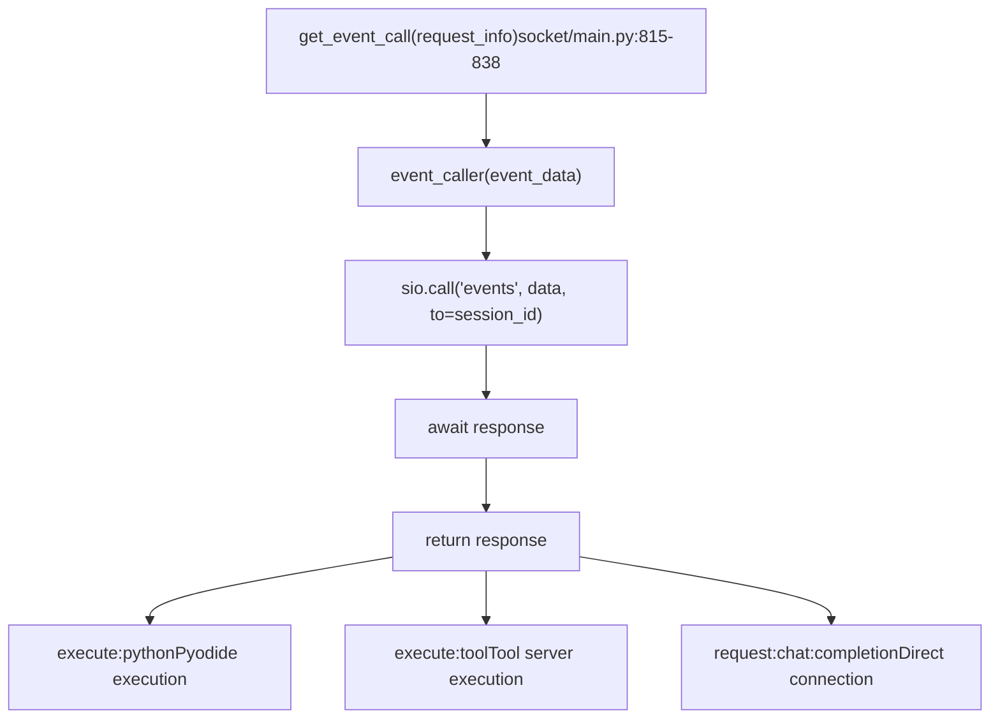
**Sources:** [backend/open\_webui/socket/main.py815-838](https://github.com/open-webui/open-webui/blob/a7271532/backend/open_webui/socket/main.py#L815-L838)

### Room-Based Broadcasting

Events can be broadcast to specific rooms (users or channels):

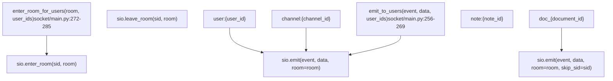
**Sources:** [backend/open\_webui/socket/main.py256-285](https://github.com/open-webui/open-webui/blob/a7271532/backend/open_webui/socket/main.py#L256-L285)

## Distributed State Management

### RedisDict Implementation

The `RedisDict` class provides a dictionary-like interface backed by Redis hashes:

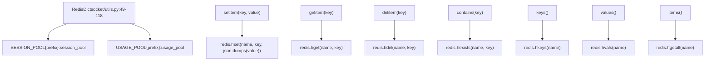
**Sources:** [backend/open\_webui/socket/utils.py49-118](https://github.com/open-webui/open-webui/blob/a7271532/backend/open_webui/socket/utils.py#L49-L118) [backend/open\_webui/socket/main.py122-140](https://github.com/open-webui/open-webui/blob/a7271532/backend/open_webui/socket/main.py#L122-L140)

### RedisLock for Distributed Coordination

The `RedisLock` class ensures only one instance performs periodic cleanup:

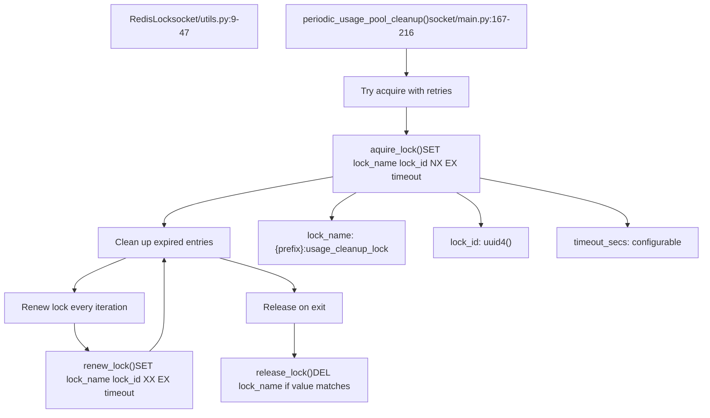
**Sources:** [backend/open\_webui/socket/utils.py9-47](https://github.com/open-webui/open-webui/blob/a7271532/backend/open_webui/socket/utils.py#L9-L47) [backend/open\_webui/socket/main.py142-216](https://github.com/open-webui/open-webui/blob/a7271532/backend/open_webui/socket/main.py#L142-L216)

## Event Type Reference

### Complete Event Type Listing

| Event Name | Direction | Payload | Handler Location |
| --- | --- | --- | --- |
| `connect` | Client → Server | `{auth: {token}}` | [backend/open\_webui/socket/main.py302-316](https://github.com/open-webui/open-webui/blob/a7271532/backend/open_webui/socket/main.py#L302-L316) |
| `disconnect` | Client → Server | \- | [backend/open\_webui/socket/main.py684-692](https://github.com/open-webui/open-webui/blob/a7271532/backend/open_webui/socket/main.py#L684-L692) |
| `user-join` | Client → Server | `{auth: {token}}` | [backend/open\_webui/socket/main.py318-351](https://github.com/open-webui/open-webui/blob/a7271532/backend/open_webui/socket/main.py#L318-L351) |
| `heartbeat` | Client → Server | `{}` | [backend/open\_webui/socket/main.py354-358](https://github.com/open-webui/open-webui/blob/a7271532/backend/open_webui/socket/main.py#L354-L358) |
| `usage` | Client → Server | `{model: string}` | [backend/open\_webui/socket/main.py288-300](https://github.com/open-webui/open-webui/blob/a7271532/backend/open_webui/socket/main.py#L288-L300) |
| `events` | Server → Client | `{chat_id, message_id, data}` | [src/routes/+layout.svelte325-480](https://github.com/open-webui/open-webui/blob/a7271532/src/routes/+layout.svelte#L325-L480) |
| `events:channel` | Bidirectional | `{channel_id, data}` | [backend/open\_webui/socket/main.py413-446](https://github.com/open-webui/open-webui/blob/a7271532/backend/open_webui/socket/main.py#L413-L446) |
| `join-channels` | Client → Server | `{auth: {token}}` | [backend/open\_webui/socket/main.py361-379](https://github.com/open-webui/open-webui/blob/a7271532/backend/open_webui/socket/main.py#L361-L379) |
| `join-note` | Client → Server | `{auth, note_id}` | [backend/open\_webui/socket/main.py382-410](https://github.com/open-webui/open-webui/blob/a7271532/backend/open_webui/socket/main.py#L382-L410) |
| `ydoc:document:join` | Client → Server | `{document_id, user_id, user_name, user_color}` | [backend/open\_webui/socket/main.py448-523](https://github.com/open-webui/open-webui/blob/a7271532/backend/open_webui/socket/main.py#L448-L523) |
| `ydoc:document:state` | Bidirectional | `{document_id, state, sessions}` | [backend/open\_webui/socket/main.py546-583](https://github.com/open-webui/open-webui/blob/a7271532/backend/open_webui/socket/main.py#L546-L583) |
| `ydoc:document:update` | Client → Server | `{document_id, user_id, update, data}` | [backend/open\_webui/socket/main.py585-629](https://github.com/open-webui/open-webui/blob/a7271532/backend/open_webui/socket/main.py#L585-L629) |
| `ydoc:document:leave` | Client → Server | `{document_id, user_id}` | [backend/open\_webui/socket/main.py631-661](https://github.com/open-webui/open-webui/blob/a7271532/backend/open_webui/socket/main.py#L631-L661) |
| `ydoc:awareness:update` | Client → Server | `{document_id, user_id, update}` | [backend/open\_webui/socket/main.py664-681](https://github.com/open-webui/open-webui/blob/a7271532/backend/open_webui/socket/main.py#L664-L681) |
| `ydoc:user:joined` | Server → Client | `{document_id, user_id, user_name, user_color}` | [backend/open\_webui/socket/main.py506-516](https://github.com/open-webui/open-webui/blob/a7271532/backend/open_webui/socket/main.py#L506-L516) |
| `ydoc:user:left` | Server → Client | `{document_id, user_id}` | [backend/open\_webui/socket/main.py647-651](https://github.com/open-webui/open-webui/blob/a7271532/backend/open_webui/socket/main.py#L647-L651) |

**Sources:** [backend/open\_webui/socket/main.py288-692](https://github.com/open-webui/open-webui/blob/a7271532/backend/open_webui/socket/main.py#L288-L692) [src/routes/+layout.svelte325-569](https://github.com/open-webui/open-webui/blob/a7271532/src/routes/+layout.svelte#L325-L569)

### Chat Event Data Types

The `events` channel carries multiple data types based on the `type` field:

```
// Status update
{
  type: "status",
  data: {
    description: string,
    done: boolean
  }
}

// Incremental message content
{
  type: "message",
  data: {
    content: string  // appended to existing content
  }
}

// Replace entire content
{
  type: "replace",
  data: {
    content: string  // replaces existing content
  }
}

// Add embeds
{
  type: "embeds",
  data: {
    embeds: Array<any>  // extends existing embeds
  }
}

// Add files
{
  type: "files",
  data: {
    files: Array<any>  // extends existing files
  }
}

// Add source/citation
{
  type: "source" | "citation",
  data: {
    // source metadata
  }
}
```
**Sources:** [backend/open\_webui/socket/main.py716-803](https://github.com/open-webui/open-webui/blob/a7271532/backend/open_webui/socket/main.py#L716-L803)

## Configuration and Deployment

### Socket.IO Server Configuration

```
# Backend Socket.IO setup
sio = socketio.AsyncServer(
    cors_allowed_origins=SOCKETIO_CORS_ORIGINS,
    async_mode="asgi",
    transports=["websocket"] if ENABLE_WEBSOCKET_SUPPORT else ["polling"],
    allow_upgrades=ENABLE_WEBSOCKET_SUPPORT,
    always_connect=True,
    client_manager=mgr,  # Redis manager if enabled
    logger=WEBSOCKET_SERVER_LOGGING,
    ping_interval=WEBSOCKET_SERVER_PING_INTERVAL,
    ping_timeout=WEBSOCKET_SERVER_PING_TIMEOUT,
    engineio_logger=WEBSOCKET_SERVER_ENGINEIO_LOGGING,
)
```
**Key configuration options:**

-   **WEBSOCKET\_MANAGER**: Set to `"redis"` for distributed deployments
-   **ENABLE\_WEBSOCKET\_SUPPORT**: Enable WebSocket transport (default: true)
-   **WEBSOCKET\_SERVER\_PING\_INTERVAL**: Heartbeat interval (default: 25s)
-   **WEBSOCKET\_SERVER\_PING\_TIMEOUT**: Timeout for ping response (default: 60s)
-   **WEBSOCKET\_REDIS\_URL**: Redis connection URL for distributed state
-   **WEBSOCKET\_SENTINEL\_HOSTS**: Redis Sentinel hosts for HA deployments
-   **WEBSOCKET\_REDIS\_CLUSTER**: Enable Redis Cluster mode

**Sources:** [backend/open\_webui/socket/main.py64-99](https://github.com/open-webui/open-webui/blob/a7271532/backend/open_webui/socket/main.py#L64-L99) [backend/open\_webui/env.py](https://github.com/open-webui/open-webui/blob/a7271532/backend/open_webui/env.py)

### Frontend Socket Configuration

```
// Frontend Socket.IO setup
const _socket = io(`${WEBUI_BASE_URL}` || undefined, {
    reconnection: true,
    reconnectionDelay: 1000,
    reconnectionDelayMax: 5000,
    randomizationFactor: 0.5,
    path: '/ws/socket.io',
    transports: enableWebsocket ? ['websocket'] : ['polling', 'websocket'],
    auth: { token: localStorage.token }
});
```
**Sources:** [src/routes/+layout.svelte98-106](https://github.com/open-webui/open-webui/blob/a7271532/src/routes/+layout.svelte#L98-L106)
