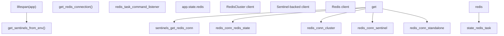
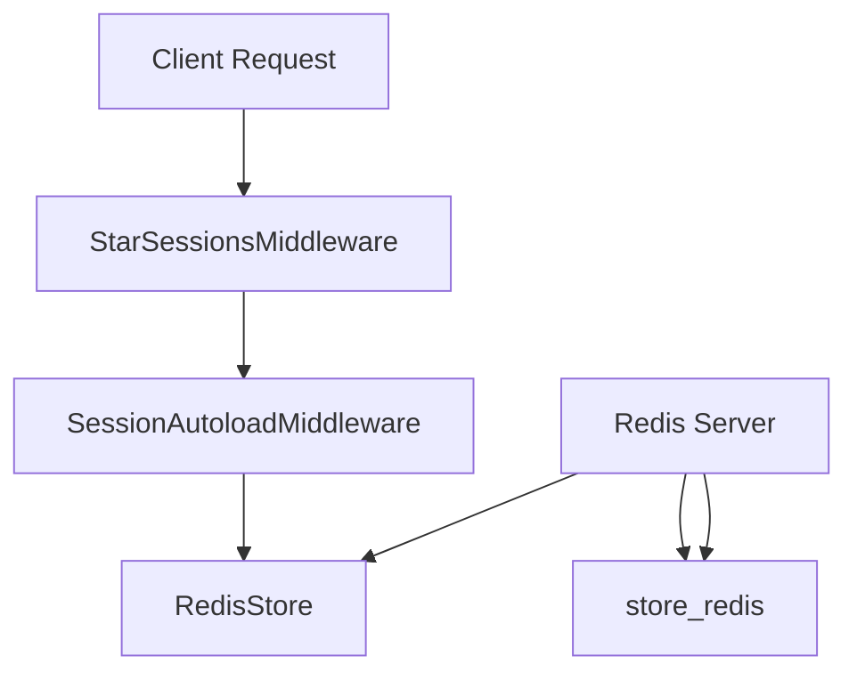
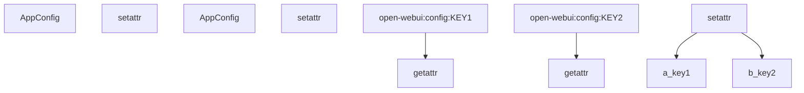
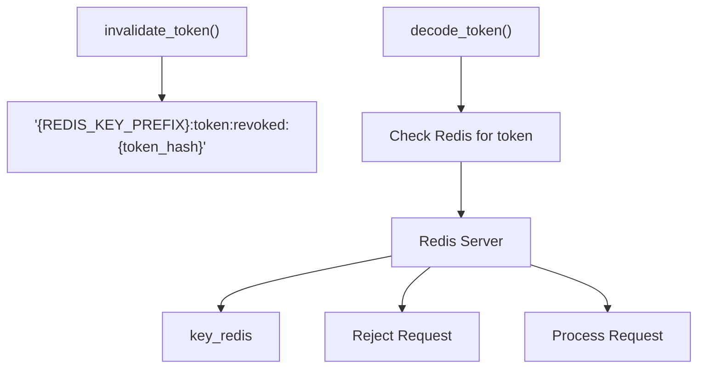
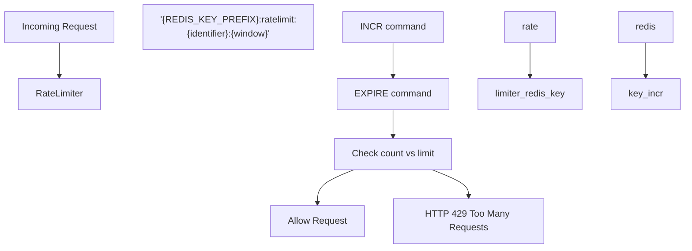
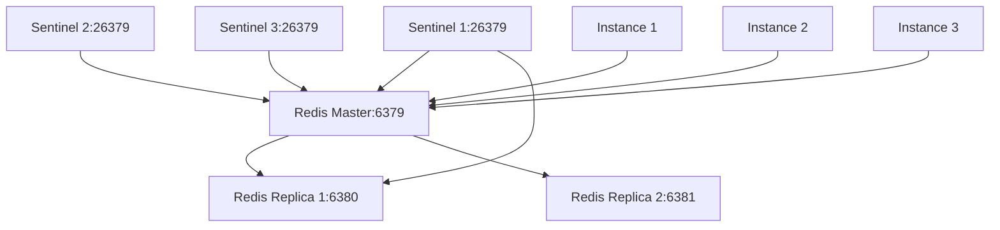

# Redis Integration for Distribution

Relevant source files

-   [backend/open\_webui/config.py](https://github.com/open-webui/open-webui/blob/a7271532/backend/open_webui/config.py)
-   [backend/open\_webui/env.py](https://github.com/open-webui/open-webui/blob/a7271532/backend/open_webui/env.py)
-   [backend/open\_webui/main.py](https://github.com/open-webui/open-webui/blob/a7271532/backend/open_webui/main.py)
-   [backend/open\_webui/retrieval/loaders/datalab\_marker.py](https://github.com/open-webui/open-webui/blob/a7271532/backend/open_webui/retrieval/loaders/datalab_marker.py)
-   [backend/open\_webui/retrieval/loaders/external\_document.py](https://github.com/open-webui/open-webui/blob/a7271532/backend/open_webui/retrieval/loaders/external_document.py)
-   [backend/open\_webui/retrieval/loaders/external\_web.py](https://github.com/open-webui/open-webui/blob/a7271532/backend/open_webui/retrieval/loaders/external_web.py)
-   [backend/open\_webui/retrieval/loaders/main.py](https://github.com/open-webui/open-webui/blob/a7271532/backend/open_webui/retrieval/loaders/main.py)
-   [backend/open\_webui/retrieval/loaders/mineru.py](https://github.com/open-webui/open-webui/blob/a7271532/backend/open_webui/retrieval/loaders/mineru.py)
-   [backend/open\_webui/retrieval/loaders/mistral.py](https://github.com/open-webui/open-webui/blob/a7271532/backend/open_webui/retrieval/loaders/mistral.py)
-   [backend/open\_webui/retrieval/utils.py](https://github.com/open-webui/open-webui/blob/a7271532/backend/open_webui/retrieval/utils.py)
-   [backend/open\_webui/routers/audio.py](https://github.com/open-webui/open-webui/blob/a7271532/backend/open_webui/routers/audio.py)
-   [backend/open\_webui/routers/auths.py](https://github.com/open-webui/open-webui/blob/a7271532/backend/open_webui/routers/auths.py)
-   [backend/open\_webui/routers/ollama.py](https://github.com/open-webui/open-webui/blob/a7271532/backend/open_webui/routers/ollama.py)
-   [backend/open\_webui/routers/openai.py](https://github.com/open-webui/open-webui/blob/a7271532/backend/open_webui/routers/openai.py)
-   [backend/open\_webui/routers/retrieval.py](https://github.com/open-webui/open-webui/blob/a7271532/backend/open_webui/routers/retrieval.py)
-   [backend/open\_webui/utils/auth.py](https://github.com/open-webui/open-webui/blob/a7271532/backend/open_webui/utils/auth.py)
-   [backend/open\_webui/utils/embeddings.py](https://github.com/open-webui/open-webui/blob/a7271532/backend/open_webui/utils/embeddings.py)
-   [backend/open\_webui/utils/middleware.py](https://github.com/open-webui/open-webui/blob/a7271532/backend/open_webui/utils/middleware.py)
-   [backend/open\_webui/utils/misc.py](https://github.com/open-webui/open-webui/blob/a7271532/backend/open_webui/utils/misc.py)
-   [backend/open\_webui/utils/oauth.py](https://github.com/open-webui/open-webui/blob/a7271532/backend/open_webui/utils/oauth.py)
-   [backend/open\_webui/utils/response.py](https://github.com/open-webui/open-webui/blob/a7271532/backend/open_webui/utils/response.py)
-   [src/lib/apis/retrieval/index.ts](https://github.com/open-webui/open-webui/blob/a7271532/src/lib/apis/retrieval/index.ts)
-   [src/lib/components/admin/Settings/Documents.svelte](https://github.com/open-webui/open-webui/blob/a7271532/src/lib/components/admin/Settings/Documents.svelte)
-   [src/lib/components/admin/Settings/WebSearch.svelte](https://github.com/open-webui/open-webui/blob/a7271532/src/lib/components/admin/Settings/WebSearch.svelte)

Redis integration in Open WebUI enables horizontal scaling and distributed deployments by providing shared state management across multiple application instances. This page covers Redis configuration, connection management, and its role in session storage, configuration synchronization, token management, and rate limiting.

For WebSocket event distribution using Redis pubsub, see [Event Handling System](/open-webui/open-webui/16.2-event-handling-system). For general WebSocket architecture, see [WebSocket Architecture](/open-webui/open-webui/16.1-websocket-architecture).

---

## Purpose and Scope

Redis serves four primary functions in distributed Open WebUI deployments:

1.  **Session Storage** - Persistent sessions shared across instances via `RedisStore`
2.  **Configuration Synchronization** - Real-time config updates propagated to all instances
3.  **Token Revocation** - Distributed blacklist for invalidated JWT tokens
4.  **Rate Limiting** - Shared rate limit counters preventing bypass through instance hopping

Redis is **optional** for single-instance deployments but **required** for horizontal scaling with multiple uvicorn workers or containerized replicas.

Sources: [backend/open\_webui/main.py1-100](https://github.com/open-webui/open-webui/blob/a7271532/backend/open_webui/main.py#L1-L100) [backend/open\_webui/config.py224-284](https://github.com/open-webui/open-webui/blob/a7271532/backend/open_webui/config.py#L224-L284)

---

## Redis Connection Initialization

### Environment Configuration

Redis connection parameters are configured through environment variables:

| Variable | Purpose | Default |
| --- | --- | --- |
| `REDIS_URL` | Connection string (e.g., `redis://localhost:6379/0`) | `""` (disabled) |
| `REDIS_CLUSTER` | Enable Redis Cluster mode | `False` |
| `REDIS_KEY_PREFIX` | Namespace prefix for all keys | `"open-webui"` |
| `REDIS_SENTINEL_HOSTS` | Comma-separated sentinel hosts | `""` |
| `REDIS_SENTINEL_PORT` | Sentinel port | `26379` |
| `REDIS_SENTINEL_MAX_RETRY_COUNT` | Max retries for sentinel failover | `2` |
| `REDIS_SOCKET_CONNECT_TIMEOUT` | Connection timeout in seconds | `None` |

Sources: [backend/open\_webui/env.py360-383](https://github.com/open-webui/open-webui/blob/a7271532/backend/open_webui/env.py#L360-L383)

### Connection Setup in Application Lifespan


**Redis Connection Initialization Flow**

The Redis connection is established during application startup in the lifespan context manager:

```
# main.py:586-598
app.state.redis = get_redis_connection(
    redis_url=REDIS_URL,
    redis_sentinels=get_sentinels_from_env(
        REDIS_SENTINEL_HOSTS, REDIS_SENTINEL_PORT
    ),
    redis_cluster=REDIS_CLUSTER,
    async_mode=True,
)

if app.state.redis is not None:
    app.state.redis_task_command_listener = asyncio.create_task(
        redis_task_command_listener(app)
    )
```
The `get_redis_connection()` function (from `open_webui.utils.redis`) returns one of three client types based on configuration:

1.  **RedisCluster** - For Redis Cluster deployments with sharding
2.  **Sentinel-backed** - For high-availability master/replica setups
3.  **Standalone** - Direct connection to single Redis instance

Sources: [backend/open\_webui/main.py586-598](https://github.com/open-webui/open-webui/blob/a7271532/backend/open_webui/main.py#L586-L598) [backend/open\_webui/env.py360-383](https://github.com/open-webui/open-webui/blob/a7271532/backend/open_webui/env.py#L360-L383)

---

## Session Middleware with RedisStore

### StarSessions Integration

Open WebUI uses the `starsessions` library with `RedisStore` backend for distributed session management:


**Session Middleware Architecture**

The session middleware is conditionally enabled via `ENABLE_STAR_SESSIONS_MIDDLEWARE` environment variable:

```
# main.py:54-58 (imports)
from starsessions import (
    SessionMiddleware as StarSessionsMiddleware,
    SessionAutoloadMiddleware,
)
from starsessions.stores.redis import RedisStore
```
When enabled, sessions are stored in Redis with keys prefixed by `REDIS_KEY_PREFIX` (default: `"open-webui"`). This allows multiple Open WebUI instances to share session state, enabling:

-   **Session persistence** across instance restarts
-   **Load balancer compatibility** with sticky sessions disabled
-   **Horizontal scaling** without session loss

The session storage integrates with OAuth flows where session tokens are stored during authentication callbacks.

Sources: [backend/open\_webui/main.py54-58](https://github.com/open-webui/open-webui/blob/a7271532/backend/open_webui/main.py#L54-L58) [backend/open\_webui/env.py197-198](https://github.com/open-webui/open-webui/blob/a7271532/backend/open_webui/env.py#L197-L198)

---

## Configuration Synchronization via AppConfig

### AppConfig Redis Cache Layer

The `AppConfig` class implements a Redis-backed caching layer for configuration values, enabling real-time synchronization across distributed instances:


**Configuration Synchronization Architecture**

### Configuration Read Path

When accessing a configuration value, `AppConfig.__getattr__` first checks Redis for an updated value:

```
# config.py:262-283
def __getattr__(self, key):
    if key not in self._state:
        raise AttributeError(f"Config key '{key}' not found")

    # If Redis is available, check for an updated value
    if self._redis:
        redis_key = f"{self._redis_key_prefix}:config:{key}"
        redis_value = self._redis.get(redis_key)

        if redis_value is not None:
            try:
                decoded_value = json.loads(redis_value)

                # Update the in-memory value if different
                if self._state[key].value != decoded_value:
                    self._state[key].value = decoded_value
                    log.info(f"Updated {key} from Redis: {decoded_value}")

            except json.JSONDecodeError:
                log.error(f"Invalid JSON format in Redis for {key}: {redis_value}")

    return self._state[key].value
```
This ensures instances always read the latest configuration, even if updated by another instance.

### Configuration Write Path

When updating a configuration value, `AppConfig.__setattr__` writes to both the database and Redis:

```
# config.py:251-260
def __setattr__(self, key, value):
    if isinstance(value, PersistentConfig):
        self._state[key] = value
    else:
        self._state[key].value = value
        self._state[key].save()  # Persist to database

        if self._redis:
            redis_key = f"{self._redis_key_prefix}:config:{key}"
            self._redis.set(redis_key, json.dumps(self._state[key].value))
```
The two-tier approach (database + Redis) provides:

-   **Database** - Persistent storage surviving Redis restarts
-   **Redis** - Fast inter-instance synchronization without database polling

Sources: [backend/open\_webui/config.py224-284](https://github.com/open-webui/open-webui/blob/a7271532/backend/open_webui/config.py#L224-L284)

---

## Token Revocation Blacklist

### JWT Invalidation with Redis

The authentication system uses Redis to maintain a distributed blacklist of revoked JWT tokens:


**Token Revocation Architecture**

### Revocation Storage

When a token is invalidated (e.g., password change, logout, admin action), it is added to Redis with an expiration matching the token's TTL:

```
# Conceptual implementation (from utils/auth.py)
def invalidate_token(token: str):
    """Add token to Redis blacklist"""
    redis_client = get_redis_client()
    if redis_client:
        token_hash = hashlib.sha256(token.encode()).hexdigest()
        key = f"{REDIS_KEY_PREFIX}:token:revoked:{token_hash}"

        # Get token expiry from JWT claims
        data = decode_token(token)
        ttl = data.get("exp") - int(time.time())

        if ttl > 0:
            redis_client.setex(key, ttl, "1")
```
### Revocation Checking

The `decode_token()` function checks Redis before validating tokens:

```
def decode_token(token: str):
    """Decode JWT and check revocation status"""
    redis_client = get_redis_client()
    if redis_client:
        token_hash = hashlib.sha256(token.encode()).hexdigest()
        key = f"{REDIS_KEY_PREFIX}:token:revoked:{token_hash}"

        if redis_client.exists(key):
            raise HTTPException(
                status_code=401,
                detail="Token has been revoked"
            )

    # Proceed with standard JWT validation
    return jwt.decode(token, WEBUI_SECRET_KEY, algorithms=[ALGORITHM])
```
Without Redis, token revocation is **not distributed** - tokens remain valid on instances that haven't processed the revocation event.

Sources: [backend/open\_webui/utils/auth.py1-100](https://github.com/open-webui/open-webui/blob/a7271532/backend/open_webui/utils/auth.py#L1-L100) [backend/open\_webui/env.py364](https://github.com/open-webui/open-webui/blob/a7271532/backend/open_webui/env.py#L364-L364)

---

## Rate Limiting with Redis Backend

### RateLimiter Implementation

The `RateLimiter` class uses Redis to enforce distributed rate limits, preventing users from bypassing limits by distributing requests across multiple instances:


**Rate Limiting Flow**

### Rate Limiter Usage Example

Rate limiting is applied to sensitive endpoints like authentication:

```
# routers/auths.py:84-86
signin_rate_limiter = RateLimiter(
    redis_client=get_redis_client(),
    limit=5 * 3,  # 15 attempts
    window=60 * 3  # 3 minutes
)
```
### Rate Limit Enforcement

The rate limiter tracks request counts per identifier (typically IP address or user ID) within a time window:

```
# Conceptual RateLimiter implementation
class RateLimiter:
    def __init__(self, redis_client, limit: int, window: int):
        self.redis = redis_client
        self.limit = limit
        self.window = window

    async def check_rate_limit(self, identifier: str):
        """Check if request exceeds rate limit"""
        if not self.redis:
            return  # Rate limiting disabled without Redis

        current_window = int(time.time()) // self.window
        key = f"{REDIS_KEY_PREFIX}:ratelimit:{identifier}:{current_window}"

        count = self.redis.incr(key)
        if count == 1:
            self.redis.expire(key, self.window)

        if count > self.limit:
            raise HTTPException(
                status_code=429,
                detail="Rate limit exceeded"
            )
```
The sliding window approach (using `current_window = timestamp // window`) ensures rate limits are enforced per time window, with automatic cleanup via Redis TTL.

Sources: [backend/open\_webui/routers/auths.py69-86](https://github.com/open-webui/open-webui/blob/a7271532/backend/open_webui/routers/auths.py#L69-L86) [backend/open\_webui/utils/auth.py1-50](https://github.com/open-webui/open-webui/blob/a7271532/backend/open_webui/utils/auth.py#L1-L50)

---

## Deployment Patterns

### Redis Sentinel for High Availability

Redis Sentinel provides automatic failover in master-replica configurations:


**Sentinel-Based High Availability Architecture**

### Sentinel Configuration

Enable Sentinel mode by providing sentinel hosts:

```
# Environment variables
REDIS_URL=""  # Leave empty when using Sentinel
REDIS_SENTINEL_HOSTS="sentinel1.example.com,sentinel2.example.com,sentinel3.example.com"
REDIS_SENTINEL_PORT="26379"
REDIS_SENTINEL_MAX_RETRY_COUNT="2"
```
The `get_sentinels_from_env()` function parses the comma-separated host list and creates sentinel connection tuples. The Redis client automatically discovers the current master and reconnects on failover.

Sources: [backend/open\_webui/env.py366-376](https://github.com/open-webui/open-webui/blob/a7271532/backend/open_webui/env.py#L366-L376) [backend/open\_webui/main.py588-590](https://github.com/open-webui/open-webui/blob/a7271532/backend/open_webui/main.py#L588-L590)

### Redis Cluster for Horizontal Scaling

Redis Cluster mode enables data sharding across multiple Redis nodes:

```
# Environment variables
REDIS_URL="redis://cluster-node1:6379,cluster-node2:6379,cluster-node3:6379"
REDIS_CLUSTER="true"
REDIS_KEY_PREFIX="open-webui"
```
When `REDIS_CLUSTER=true`, the connection factory returns a `redis.cluster.RedisCluster` client instead of a standard `redis.Redis` client. All Redis commands are automatically routed to the appropriate cluster node based on key hashing.

### Standalone Redis

For development or single-instance deployments:

```
REDIS_URL="redis://localhost:6379/0"
REDIS_KEY_PREFIX="open-webui"
```
Sources: [backend/open\_webui/env.py361-362](https://github.com/open-webui/open-webui/blob/a7271532/backend/open_webui/env.py#L361-L362)

---

## Key Namespacing Strategy

All Redis keys use a configurable prefix to support multiple Open WebUI deployments sharing a single Redis instance:

| Key Pattern | Purpose | Example |
| --- | --- | --- |
| `{prefix}:config:{key}` | Configuration values | `open-webui:config:OLLAMA_BASE_URL` |
| `{prefix}:token:revoked:{hash}` | Revoked JWT tokens | `open-webui:token:revoked:abc123...` |
| `{prefix}:ratelimit:{id}:{window}` | Rate limit counters | `open-webui:ratelimit:192.168.1.1:1234567890` |
| `{prefix}:session:{sid}` | Session data (StarSessions) | `open-webui:session:sess_xyz...` |
| `{prefix}:task:command:{id}` | Task commands (background jobs) | `open-webui:task:command:task_001` |

The prefix is set via `REDIS_KEY_PREFIX` environment variable (default: `"open-webui"`). To isolate multiple environments:

```
# Production
REDIS_KEY_PREFIX="owui-prod"

# Staging
REDIS_KEY_PREFIX="owui-staging"

# Development
REDIS_KEY_PREFIX="owui-dev"
```
Sources: [backend/open\_webui/env.py364](https://github.com/open-webui/open-webui/blob/a7271532/backend/open_webui/env.py#L364-L364) [backend/open\_webui/config.py259-260](https://github.com/open-webui/open-webui/blob/a7271532/backend/open_webui/config.py#L259-L260)

---

## Redis Absence Behavior

Open WebUI degrades gracefully when Redis is unavailable:

| Feature | Behavior Without Redis |
| --- | --- |
| **Sessions** | In-memory sessions (lost on restart, not shared across instances) |
| **Configuration** | Database-only (no real-time sync, requires restart to apply changes) |
| **Token Revocation** | Local blacklist only (tokens remain valid on other instances) |
| **Rate Limiting** | Per-instance limits (users can bypass by routing through different instances) |
| **Background Tasks** | Local-only task coordination |

For **single-instance deployments**, Redis is optional. For **multi-instance/Kubernetes deployments**, Redis is effectively **required** for correct distributed behavior.

Sources: [backend/open\_webui/main.py586-598](https://github.com/open-webui/open-webui/blob/a7271532/backend/open_webui/main.py#L586-L598) [backend/open\_webui/config.py224-284](https://github.com/open-webui/open-webui/blob/a7271532/backend/open_webui/config.py#L224-L284)
