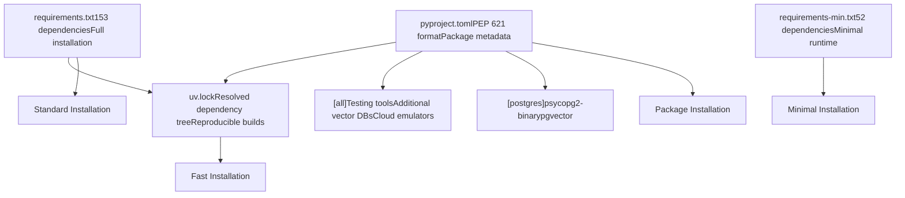
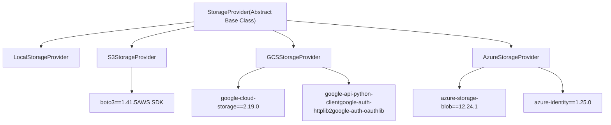

# Dependency Management

Relevant source files

-   [.github/workflows/integration-test.disabled](https://github.com/open-webui/open-webui/blob/a7271532/.github/workflows/integration-test.disabled)
-   [CHANGELOG.md](https://github.com/open-webui/open-webui/blob/a7271532/CHANGELOG.md)
-   [backend/open\_webui/storage/provider.py](https://github.com/open-webui/open-webui/blob/a7271532/backend/open_webui/storage/provider.py)
-   [backend/open\_webui/test/apps/webui/storage/test\_provider.py](https://github.com/open-webui/open-webui/blob/a7271532/backend/open_webui/test/apps/webui/storage/test_provider.py)
-   [backend/requirements-min.txt](https://github.com/open-webui/open-webui/blob/a7271532/backend/requirements-min.txt)
-   [backend/requirements.txt](https://github.com/open-webui/open-webui/blob/a7271532/backend/requirements.txt)
-   [docker-compose.playwright.yaml](https://github.com/open-webui/open-webui/blob/a7271532/docker-compose.playwright.yaml)
-   [package-lock.json](https://github.com/open-webui/open-webui/blob/a7271532/package-lock.json)
-   [package.json](https://github.com/open-webui/open-webui/blob/a7271532/package.json)
-   [pyproject.toml](https://github.com/open-webui/open-webui/blob/a7271532/pyproject.toml)
-   [src/app.css](https://github.com/open-webui/open-webui/blob/a7271532/src/app.css)
-   [src/lib/components/ChangelogModal.svelte](https://github.com/open-webui/open-webui/blob/a7271532/src/lib/components/ChangelogModal.svelte)
-   [src/lib/components/common/RichTextInput.svelte](https://github.com/open-webui/open-webui/blob/a7271532/src/lib/components/common/RichTextInput.svelte)
-   [src/lib/components/icons/XMark.svelte](https://github.com/open-webui/open-webui/blob/a7271532/src/lib/components/icons/XMark.svelte)
-   [uv.lock](https://github.com/open-webui/open-webui/blob/a7271532/uv.lock)

This document describes Open WebUI's Python dependency management system, including how dependencies are organized, categorized by subsystem, version pinning strategies, and installation methods. This covers the backend Python dependencies only. For information about frontend dependencies, see the frontend build system documentation.

**Related Pages:**

-   For environment configuration that uses these dependencies, see [Environment Configuration](/open-webui/open-webui/9.3-collaborative-editing)
-   For database setup using database-related dependencies, see [Database Configuration](/open-webui/open-webui/17.3-optional-dependencies)
-   For storage provider implementations that depend on cloud SDKs, see [Storage Provider System](/open-webui/open-webui/12.1-storage-provider-architecture)
-   For development environment setup, see [Development Environment](/open-webui/open-webui/18.1-development-environment-setup)

**Sources:** [backend/requirements.txt](https://github.com/open-webui/open-webui/blob/a7271532/backend/requirements.txt) [pyproject.toml](https://github.com/open-webui/open-webui/blob/a7271532/pyproject.toml) [backend/requirements-min.txt](https://github.com/open-webui/open-webui/blob/a7271532/backend/requirements-min.txt)

## Dependency Organization

Open WebUI uses multiple files to organize and manage Python dependencies, supporting different installation methods and use cases.

### Dependency Files


**Sources:** [backend/requirements.txt1-153](https://github.com/open-webui/open-webui/blob/a7271532/backend/requirements.txt#L1-L153) [pyproject.toml1-206](https://github.com/open-webui/open-webui/blob/a7271532/pyproject.toml#L1-L206) [backend/requirements-min.txt1-52](https://github.com/open-webui/open-webui/blob/a7271532/backend/requirements-min.txt#L1-L52) [uv.lock1-20](https://github.com/open-webui/open-webui/blob/a7271532/uv.lock#L1-L20)

### File Purposes

| File | Purpose | Use Case |
| --- | --- | --- |
| `requirements.txt` | Full dependency list with exact versions | Production deployments, Docker images |
| `pyproject.toml` | Python package metadata and dependencies | Package installation, development |
| `requirements-min.txt` | Minimal dependencies for basic functionality | Lightweight deployments, testing |
| `uv.lock` | Resolved dependency tree with hashes | Reproducible builds with `uv` package manager |

**Sources:** [backend/requirements.txt1](https://github.com/open-webui/open-webui/blob/a7271532/backend/requirements.txt#L1-L1) [pyproject.toml1-10](https://github.com/open-webui/open-webui/blob/a7271532/pyproject.toml#L1-L10) [backend/requirements-min.txt1-4](https://github.com/open-webui/open-webui/blob/a7271532/backend/requirements-min.txt#L1-L4)

## Core Dependencies by Subsystem

The following diagram maps major dependencies to their functional subsystems in the application.


**Sources:** [backend/requirements.txt1-96](https://github.com/open-webui/open-webui/blob/a7271532/backend/requirements.txt#L1-L96) [pyproject.toml9-117](https://github.com/open-webui/open-webui/blob/a7271532/pyproject.toml#L9-L117)

### Web Framework and API Layer

The core web framework stack enables the FastAPI application:

-   **fastapi==0.123.0**: Main web framework for REST API and WebSocket endpoints
-   **uvicorn\[standard\]==0.37.0**: ASGI server with performance optimizations (includes `websockets`, `httptools`)
-   **pydantic==2.12.5**: Data validation and serialization
-   **python-multipart==0.0.20**: File upload handling
-   **starlette-compress==1.6.1**: HTTP response compression middleware

**Sources:** [backend/requirements.txt1-5](https://github.com/open-webui/open-webui/blob/a7271532/backend/requirements.txt#L1-L5) [pyproject.toml9-13](https://github.com/open-webui/open-webui/blob/a7271532/pyproject.toml#L9-L13)

### Authentication and Security

Multi-layered authentication system with support for various methods:

-   **python-jose==3.5.0**: JWT token creation and validation
-   **cryptography**: Low-level cryptographic primitives (transitive, also used by cloud providers)
-   **bcrypt==5.0.0**: Password hashing with bcrypt algorithm
-   **argon2-cffi==25.1.0**: Argon2 password hashing (more secure alternative)
-   **PyJWT\[crypto\]==2.10.1**: JWT encoding/decoding with cryptographic signing
-   **authlib==1.6.5**: OAuth 2.0 and OpenID Connect client/server

**Sources:** [backend/requirements.txt7-13](https://github.com/open-webui/open-webui/blob/a7271532/backend/requirements.txt#L7-L13) [pyproject.toml15-21](https://github.com/open-webui/open-webui/blob/a7271532/pyproject.toml#L15-L21)

### Database Management

Dual ORM strategy with migration support:

-   **sqlalchemy==2.0.38**: Primary ORM for complex queries and PostgreSQL support
-   **alembic==1.17.2**: Database migration tool for SQLAlchemy
-   **peewee==3.18.3**: Lightweight ORM for SQLite operations and legacy code
-   **peewee-migrate==1.14.3**: Migration tool for Peewee

**Sources:** [backend/requirements.txt24-27](https://github.com/open-webui/open-webui/blob/a7271532/backend/requirements.txt#L24-L27) [pyproject.toml32-35](https://github.com/open-webui/open-webui/blob/a7271532/pyproject.toml#L32-L35)

### Real-time Communication

WebSocket and collaborative editing infrastructure:

-   **python-socketio==5.15.0**: Socket.IO server for WebSocket communication
-   **redis**: In-memory data store for session management and pub/sub
-   **pycrdt==0.12.25**: CRDT (Conflict-free Replicated Data Type) implementation for Yjs document collaboration
-   **starsessions\[redis\]==2.2.1**: Session middleware with Redis backend

**Sources:** [backend/requirements.txt7-30](https://github.com/open-webui/open-webui/blob/a7271532/backend/requirements.txt#L7-L30) [pyproject.toml15-38](https://github.com/open-webui/open-webui/blob/a7271532/pyproject.toml#L15-L38)

### HTTP Client Layer

Multiple HTTP clients for different use cases:

-   **requests==2.32.5**: Synchronous HTTP client for simple requests
-   **aiohttp==3.12.15**: Asynchronous HTTP client for concurrent requests
-   **httpx\[socks,http2,zstd,cli,brotli\]==0.28.1**: Modern async/sync HTTP client with advanced features:
    -   `socks`: SOCKS proxy support
    -   `http2`: HTTP/2 protocol support
    -   `zstd`: Zstandard compression
    -   `cli`: Command-line interface
    -   `brotli`: Brotli compression

Additional supporting packages:

-   **async-timeout**: Timeout context manager for asyncio
-   **aiocache**: Async caching framework
-   **aiofiles**: Async file I/O operations

**Sources:** [backend/requirements.txt15-22](https://github.com/open-webui/open-webui/blob/a7271532/backend/requirements.txt#L15-L22) [pyproject.toml23-30](https://github.com/open-webui/open-webui/blob/a7271532/pyproject.toml#L23-L30)

### AI and LLM Integration

Multi-provider LLM support:

-   **openai**: OpenAI API client (GPT-4, GPT-3.5, embeddings)
-   **anthropic**: Anthropic API client (Claude models)
-   **google-genai==1.52.0**: Google Generative AI API
-   **google-generativeai==0.8.5**: Google Gemini models
-   **tiktoken**: OpenAI's tokenizer for token counting
-   **mcp==1.22.0**: Model Context Protocol for tool integration

**Sources:** [backend/requirements.txt39-45](https://github.com/open-webui/open-webui/blob/a7271532/backend/requirements.txt#L39-L45) [pyproject.toml46-52](https://github.com/open-webui/open-webui/blob/a7271532/pyproject.toml#L46-L52)

### RAG and Embeddings

Retrieval Augmented Generation pipeline:

-   **langchain==0.3.27**: Framework for LLM application chains
-   **langchain-community==0.3.29**: Community-contributed integrations
-   **transformers==4.57.3**: Hugging Face transformer models
-   **sentence-transformers==5.1.2**: Sentence and document embeddings
-   **accelerate**: Model acceleration for large transformers
-   **chromadb==1.1.0**: Default vector database
-   **tiktoken**: Token counting for context management
-   **fake-useragent==2.2.0**: User agent spoofing for web scraping

**Sources:** [backend/requirements.txt39-57](https://github.com/open-webui/open-webui/blob/a7271532/backend/requirements.txt#L39-L57) [pyproject.toml46-67](https://github.com/open-webui/open-webui/blob/a7271532/pyproject.toml#L46-L67)

### Document Processing

Multi-format document ingestion:

```mermaid
flowchart TD
    ftfy["ftfy==6.3.1"]
    chardet["chardet==5.2.0"]
    nltk["nltk==3.9.1"]
    pypdf["pypdf==6.4.0"]
    docx2txt["docx2txt==0.8"]
    pythonPptx["python-pptx==1.0.2"]
    unstructured["unstructured==0.18.21"]
    msoffcrypto["msoffcrypto-tool==5.4.2"]
    pandas["pandas==2.2.3"]
    openpyxl["openpyxl==3.1.5"]
    pyxlsb["pyxlsb==1.0.10"]
    xlrd["xlrd==2.0.1"]
    pypandoc["pypandoc==1.16.2"]
    markdown["Markdown==3.10"]
    pymdown["pymdown-extensions==10.17.2"]
    TextDocs["Multiple Formats"]
    DataFiles["Excel/CSV"]

    pypdf --> TextDocs
    docx2txt --> TextDocs
    pythonPptx --> TextDocs
    unstructured --> TextDocs
    pandas --> DataFiles
    openpyxl --> DataFiles
    pyxlsb --> DataFiles
    xlrd --> DataFiles
    pypandoc --> Conversion
    markdown --> Conversion
```


**Sources:** [backend/requirements.txt61-85](https://github.com/open-webui/open-webui/blob/a7271532/backend/requirements.txt#L61-L85) [pyproject.toml69-95](https://github.com/open-webui/open-webui/blob/a7271532/pyproject.toml#L69-L95)

Key packages:

-   **pypdf==6.4.0**: PDF text extraction
-   **docx2txt==0.8**: Microsoft Word document parsing
-   **python-pptx==1.0.2**: PowerPoint file handling
-   **unstructured==0.18.21**: Universal document loader (supports many formats)
-   **pandas==2.2.3**: Structured data processing (CSV, Excel)
-   **pypandoc==1.16.2**: Document format conversion via Pandoc
-   **nltk==3.9.1**: Natural language processing tools

### Scheduling and Background Tasks

-   **APScheduler==3.10.4**: Cron-like job scheduling for periodic tasks
-   **RestrictedPython==8.0**: Sandboxed Python execution for user-provided code

**Sources:** [backend/requirements.txt32-33](https://github.com/open-webui/open-webui/blob/a7271532/backend/requirements.txt#L32-L33) [pyproject.toml40-41](https://github.com/open-webui/open-webui/blob/a7271532/pyproject.toml#L40-L41)

### Logging

-   **loguru==0.7.3**: Enhanced logging with colored output and structured logging

**Sources:** [backend/requirements.txt35](https://github.com/open-webui/open-webui/blob/a7271532/backend/requirements.txt#L35-L35) [pyproject.toml43](https://github.com/open-webui/open-webui/blob/a7271532/pyproject.toml#L43-L43)

## Optional Dependencies

Optional dependencies are organized into groups that can be installed separately based on deployment requirements.

### PostgreSQL Support

The `postgres` optional dependency group adds PostgreSQL-specific drivers:

```
[project.optional-dependencies]
postgres = [
    "psycopg2-binary==2.9.10",
    "pgvector==0.4.1",
]
```
-   **psycopg2-binary==2.9.10**: PostgreSQL adapter for Python (binary distribution for easy installation)
-   **pgvector==0.4.1**: PostgreSQL extension support for vector similarity search

**Installation:**

```
pip install .[postgres]
# or
pip install -r requirements.txt  # includes these in main file
```
**Sources:** [pyproject.toml131-135](https://github.com/open-webui/open-webui/blob/a7271532/pyproject.toml#L131-L135) [backend/requirements.txt112-113](https://github.com/open-webui/open-webui/blob/a7271532/backend/requirements.txt#L112-L113)

### Complete Feature Set

The `all` optional dependency group includes development, testing, and additional production features:

```
[project.optional-dependencies]
all = [
    # Database drivers
    "pymongo",
    "psycopg2-binary==2.9.9",
    "pgvector==0.4.0",

    # Testing infrastructure
    "moto[s3]>=5.0.26",
    "gcp-storage-emulator>=2024.8.3",
    "docker~=7.1.0",
    "pytest~=8.3.2",
    "pytest-docker~=3.2.5",

    # Browser automation
    "playwright==1.56.0",

    # Additional vector databases
    "elasticsearch==9.1.0",
    "qdrant-client==1.14.3",
    "weaviate-client==4.17.0",
    "pymilvus==2.6.4",
    "pinecone==6.0.2",
    "oracledb==3.2.0",

    # Advanced retrieval
    "colbert-ai==0.2.21",

    # Web scraping
    "firecrawl-py==4.10.0",

    # Search integration
    "azure-search-documents==11.6.0",
]
```
**Sources:** [pyproject.toml137-158](https://github.com/open-webui/open-webui/blob/a7271532/pyproject.toml#L137-L158)

This group is primarily used for:

1.  **Development**: Full testing suite with cloud emulators
2.  **CI/CD**: Integration tests with multiple databases
3.  **Advanced deployments**: All supported vector databases and search engines

## Cloud Storage Dependencies

Cloud storage provider support is modular, with each provider requiring specific SDK packages.


**Sources:** [backend/open\_webui/storage/provider.py1-377](https://github.com/open-webui/open-webui/blob/a7271532/backend/open_webui/storage/provider.py#L1-L377) [backend/requirements.txt99-114](https://github.com/open-webui/open-webui/blob/a7271532/backend/requirements.txt#L99-L114)

### AWS S3 Dependencies

-   **boto3==1.41.5**: AWS SDK for Python, provides S3 client
    -   Used in [backend/open\_webui/storage/provider.py108-224](https://github.com/open-webui/open-webui/blob/a7271532/backend/open_webui/storage/provider.py#L108-L224)
    -   Supports workload identity (IAM roles) when credentials not provided
    -   Configuration includes accelerate endpoint and addressing style options

### Google Cloud Storage Dependencies

-   **google-cloud-storage==2.19.0**: GCS client library
    -   Used in [backend/open\_webui/storage/provider.py226-290](https://github.com/open-webui/open-webui/blob/a7271532/backend/open_webui/storage/provider.py#L226-L290)
    -   Supports service account JSON or default credentials
-   **google-api-python-client**: Google API client (also used for Google Drive integration)
-   **google-auth-httplib2**: HTTP library for Google auth
-   **google-auth-oauthlib**: OAuth2 flow for Google services
-   **googleapis-common-protos==1.72.0**: Protocol buffer definitions

**Sources:** [backend/requirements.txt102-108](https://github.com/open-webui/open-webui/blob/a7271532/backend/requirements.txt#L102-L108) [backend/open\_webui/storage/provider.py226-290](https://github.com/open-webui/open-webui/blob/a7271532/backend/open_webui/storage/provider.py#L226-L290)

### Azure Blob Storage Dependencies

-   **azure-storage-blob==12.24.1**: Azure Blob Storage client
    -   Used in [backend/open\_webui/storage/provider.py292-360](https://github.com/open-webui/open-webui/blob/a7271532/backend/open_webui/storage/provider.py#L292-L360)
    -   Supports both explicit keys and DefaultAzureCredential (Managed Identity)
-   **azure-identity==1.25.0**: Azure authentication with multiple credential types

**Sources:** [backend/requirements.txt98-114](https://github.com/open-webui/open-webui/blob/a7271532/backend/requirements.txt#L98-L114) [backend/open\_webui/storage/provider.py292-360](https://github.com/open-webui/open-webui/blob/a7271532/backend/open_webui/storage/provider.py#L292-L360)

## Vector Database Dependencies

Open WebUI supports multiple vector databases for RAG functionality. Most are optional except ChromaDB (default).

```mermaid
flowchart TD
    chromadb["chromadb==1.1.0Default vector DB"]
    pinecone["pinecone==6.0.2Managed vector DB"]
    weaviate["weaviate-client==4.17.0Open source/cloud"]
    qdrant["qdrant-client==1.14.3Open source/cloud"]
    opensearch["opensearch-py==2.8.0Search + vectors"]
    azureSearch["azure-search-documents==11.6.0Azure AI Search"]
    milvus["pymilvus==2.6.4High performance"]
    oracledb["oracledb==3.2.0Oracle 23ai vectors"]
    elasticsearch["elasticsearch==9.1.0Search + vectors"]
    colbert["colbert-ai==0.2.21Late interaction reranking"]
    rankbm25["rank-bm25==0.2.2BM25 keyword search"]
    RAGPipeline["RAG Pipeline"]
    Reranking["Result Reranking"]
    HybridSearch["Hybrid Search"]

    chromadb --> RAGPipeline
    pinecone --> RAGPipeline
    weaviate --> RAGPipeline
    qdrant --> RAGPipeline
    opensearch --> RAGPipeline
    azureSearch --> RAGPipeline
    milvus --> RAGPipeline
    oracledb --> RAGPipeline
    elasticsearch --> RAGPipeline
    colbert --> Reranking
    rankbm25 --> HybridSearch
```


**Sources:** [backend/requirements.txt51-127](https://github.com/open-webui/open-webui/blob/a7271532/backend/requirements.txt#L51-L127)

### Core Vector Database

-   **chromadb==1.1.0**: Default embedded vector database, always installed
    -   In-memory or persistent storage
    -   Native support for embeddings
    -   No external service required

**Note:** Version pinned to 1.1.0 in requirements.txt but 1.0.20 in pyproject.toml. The requirements.txt version takes precedence.

**Sources:** [backend/requirements.txt51](https://github.com/open-webui/open-webui/blob/a7271532/backend/requirements.txt#L51-L51) [pyproject.toml58](https://github.com/open-webui/open-webui/blob/a7271532/pyproject.toml#L58-L58)

### Optional Vector Databases

These are included in the `all` optional dependency group or main requirements.txt:

-   **weaviate-client==4.17.0**: Weaviate cloud or self-hosted
-   **opensearch-py==2.8.0**: OpenSearch with vector support
-   **pymilvus==2.6.4**: Milvus high-performance vector DB
-   **qdrant-client==1.14.3**: Qdrant vector search engine
-   **pinecone==6.0.2**: Pinecone managed vector database
-   **oracledb==3.2.0**: Oracle Database 23ai with vector support
-   **elasticsearch==9.1.0**: Elasticsearch with vector search (in `all` group only)
-   **azure-search-documents==11.6.0**: Azure AI Search (in `all` group only)

**Sources:** [backend/requirements.txt52-123](https://github.com/open-webui/open-webui/blob/a7271532/backend/requirements.txt#L52-L123) [pyproject.toml147-157](https://github.com/open-webui/open-webui/blob/a7271532/pyproject.toml#L147-L157)

### Retrieval Enhancement

-   **rank-bm25==0.2.2**: BM25 algorithm for keyword-based hybrid search
-   **colbert-ai==0.2.21**: ColBERT late interaction model for reranking

**Sources:** [backend/requirements.txt85-127](https://github.com/open-webui/open-webui/blob/a7271532/backend/requirements.txt#L85-L127) [pyproject.toml94-154](https://github.com/open-webui/open-webui/blob/a7271532/pyproject.toml#L94-L154)

## Vision and OCR Dependencies

Computer vision and optical character recognition for document processing:

-   **pillow==11.3.0**: Image processing library (PIL fork)
-   **opencv-python-headless==4.11.0.86**: Computer vision without GUI dependencies
-   **rapidocr-onnxruntime==1.4.4**: Fast OCR using ONNX runtime
-   **onnxruntime==1.20.1**: ONNX model inference runtime
-   **azure-ai-documentintelligence==1.0.2**: Azure Document Intelligence OCR/extraction

**Sources:** [backend/requirements.txt82-97](https://github.com/open-webui/open-webui/blob/a7271532/backend/requirements.txt#L82-L97) [pyproject.toml89-96](https://github.com/open-webui/open-webui/blob/a7271532/pyproject.toml#L89-L96)

## Media Processing Dependencies

Audio and video processing:

-   **soundfile==0.13.1**: Read/write audio files
-   **pydub**: Audio manipulation and conversion
-   **faster-whisper==1.1.1**: Optimized Whisper speech recognition
-   **av==14.0.1**: PyAV for audio/video container manipulation
    -   Version pinned due to FIPS self-test failure issue (see [backend/requirements.txt125](https://github.com/open-webui/open-webui/blob/a7271532/backend/requirements.txt#L125-L125))
-   **youtube-transcript-api==1.2.2**: YouTube subtitle extraction
-   **pytube==15.0.0**: YouTube video download

**Sources:** [backend/requirements.txt80-125](https://github.com/open-webui/open-webui/blob/a7271532/backend/requirements.txt#L80-L125) [pyproject.toml88-103](https://github.com/open-webui/open-webui/blob/a7271532/pyproject.toml#L88-L103)

## Web Scraping and Search Dependencies

Tools for web content extraction and search integration:

-   **playwright==1.56.0**: Browser automation for JavaScript-heavy sites
    -   Version must match docker-compose.playwright.yaml
-   **firecrawl-py==4.10.0**: Firecrawl API client for web scraping
-   **ddgs==9.9.2**: DuckDuckGo search API client

**Sources:** [backend/requirements.txt95-139](https://github.com/open-webui/open-webui/blob/a7271532/backend/requirements.txt#L95-L139) [pyproject.toml104-156](https://github.com/open-webui/open-webui/blob/a7271532/pyproject.toml#L104-L156)

## Development and Testing Dependencies

Testing infrastructure and development tools:

### Testing Framework

-   **docker~=7.1.0**: Docker Python SDK for integration tests
-   **pytest~=8.4.1**: Testing framework
-   **pytest-docker~=3.2.5**: Docker containers in pytest fixtures
-   **pytest-asyncio>=1.0.0**: Async test support (in dev group)

**Sources:** [backend/requirements.txt131-133](https://github.com/open-webui/open-webui/blob/a7271532/backend/requirements.txt#L131-L133) [pyproject.toml143-145](https://github.com/open-webui/open-webui/blob/a7271532/pyproject.toml#L143-L145) [pyproject.toml203-205](https://github.com/open-webui/open-webui/blob/a7271532/pyproject.toml#L203-L205)

### Cloud Emulators (Testing)

These are in the `all` optional group for testing cloud integrations:

-   **moto\[s3\]>=5.0.26**: AWS service mocks (S3, etc.)
-   **gcp-storage-emulator>=2024.8.3**: Google Cloud Storage emulator

**Usage example in tests:**

```
# S3 testing with moto
from moto import mock_aws

@mock_aws
class TestS3StorageProvider:
    def __init__(self):
        self.Storage = provider.S3StorageProvider()
        self.s3_client = boto3.resource("s3", region_name="us-east-1")
```
**Sources:** [pyproject.toml141-142](https://github.com/open-webui/open-webui/blob/a7271532/pyproject.toml#L141-L142) [backend/open\_webui/test/apps/webui/storage/test\_provider.py100-112](https://github.com/open-webui/open-webui/blob/a7271532/backend/open_webui/test/apps/webui/storage/test_provider.py#L100-L112)

### Code Quality

-   **black==25.11.0**: Python code formatter
-   **validators==0.35.0**: Data validation library

**Sources:** [backend/requirements.txt77-90](https://github.com/open-webui/open-webui/blob/a7271532/backend/requirements.txt#L77-L90) [pyproject.toml85-99](https://github.com/open-webui/open-webui/blob/a7271532/pyproject.toml#L85-L99)

## Observability Dependencies

OpenTelemetry instrumentation for distributed tracing:

```
# Trace dependencies
opentelemetry-api==1.38.0
opentelemetry-sdk==1.38.0
opentelemetry-exporter-otlp==1.38.0
opentelemetry-instrumentation==0.59b0
opentelemetry-instrumentation-fastapi==0.59b0
opentelemetry-instrumentation-sqlalchemy==0.59b0
opentelemetry-instrumentation-redis==0.59b0
opentelemetry-instrumentation-requests==0.59b0
opentelemetry-instrumentation-logging==0.59b0
opentelemetry-instrumentation-httpx==0.59b0
opentelemetry-instrumentation-aiohttp-client==0.59b0
```
Provides automatic instrumentation for:

-   FastAPI endpoints
-   SQLAlchemy database queries
-   Redis operations
-   HTTP requests (requests, httpx, aiohttp)
-   Application logging

**Sources:** [backend/requirements.txt142-152](https://github.com/open-webui/open-webui/blob/a7271532/backend/requirements.txt#L142-L152)

## LDAP Authentication

-   **ldap3==2.9.1**: Pure Python LDAP client for Active Directory integration

**Sources:** [backend/requirements.txt136](https://github.com/open-webui/open-webui/blob/a7271532/backend/requirements.txt#L136-L136) [pyproject.toml116](https://github.com/open-webui/open-webui/blob/a7271532/pyproject.toml#L116-L116)

## Version Management Strategy

Open WebUI uses a mixed version pinning strategy optimized for stability and compatibility.

### Exact Version Pinning

Most dependencies use exact version pins (`==`) for reproducibility:

```
fastapi==0.123.0
uvicorn==0.37.0
pydantic==2.12.5
sqlalchemy==2.0.38
chromadb==1.1.0
```
This ensures consistent behavior across deployments and prevents unexpected breakage from dependency updates.

**Sources:** [backend/requirements.txt1-5](https://github.com/open-webui/open-webui/blob/a7271532/backend/requirements.txt#L1-L5)

### Package Extras

Some packages use extras to include optional features:

```
uvicorn[standard]==0.37.0          # includes websockets, httptools
PyJWT[crypto]==2.10.1              # includes cryptography
httpx[socks,http2,zstd,cli,brotli]==0.28.1  # multiple extras
```
**Sources:** [backend/requirements.txt2-21](https://github.com/open-webui/open-webui/blob/a7271532/backend/requirements.txt#L2-L21)

### Unpinned Versions

A few packages allow any version (no pin), typically transitive dependencies or very stable packages:

```
cryptography
redis
accelerate
psutil
sentencepiece
pydub
```
These are either:

1.  Stable APIs unlikely to break (e.g., `redis`)
2.  Managed by other packages' pins (e.g., `cryptography` pinned by `PyJWT[crypto]`)
3.  Optional features where latest version is acceptable

**Sources:** [backend/requirements.txt9-94](https://github.com/open-webui/open-webui/blob/a7271532/backend/requirements.txt#L9-L94)

### Special Version Constraints

Some packages have specific version constraints for compatibility:

```
# pyarrow pinned for Raspberry Pi compatibility
pyarrow==20.0.0  # fix: pin pyarrow version to 20 for rpi compatibility #15897

# av pinned due to FIPS self-test failure
av==14.0.1  # Caution: Set due to FATAL FIPS SELFTEST FAILURE

# Playwright version must match docker-compose
playwright==1.56.0  # Caution: version must match docker-compose.playwright.yaml
```
**Sources:** [backend/requirements.txt58-125](https://github.com/open-webui/open-webui/blob/a7271532/backend/requirements.txt#L58-L125)

### Python Version Requirements

The project requires Python 3.11 or 3.12 (excluding pre-releases):

```
requires-python = ">= 3.11, < 3.13.0a1"
```
**Sources:** [pyproject.toml119](https://github.com/open-webui/open-webui/blob/a7271532/pyproject.toml#L119-L119)

## Installation Methods

Open WebUI supports multiple installation methods to accommodate different workflows.

### Standard pip Installation

Full installation with all dependencies:

```
cd backend
pip install -r requirements.txt
```
This installs all 153 packages from requirements.txt, including optional dependencies like vector databases and cloud storage SDKs.

**Sources:** [backend/requirements.txt1-153](https://github.com/open-webui/open-webui/blob/a7271532/backend/requirements.txt#L1-L153) [.github/workflows/integration-test.disabled152-153](https://github.com/open-webui/open-webui/blob/a7271532/.github/workflows/integration-test.disabled#L152-L153)

### Minimal Installation

Lightweight installation for basic functionality:

```
cd backend
pip install -r requirements-min.txt
```
This installs only 52 core packages needed for:

-   Web server (FastAPI, uvicorn)
-   Authentication
-   Database (SQLAlchemy, SQLite)
-   Redis and WebSocket
-   Basic LLM integration (OpenAI)
-   ChromaDB for RAG

Excludes:

-   Additional vector databases
-   Cloud storage SDKs
-   Advanced document processing
-   Testing tools

**Sources:** [backend/requirements-min.txt1-52](https://github.com/open-webui/open-webui/blob/a7271532/backend/requirements-min.txt#L1-L52)

### Package Installation

Install as a Python package with optional groups:

```
# Base installation
pip install .

# With PostgreSQL support
pip install .[postgres]

# With all optional dependencies
pip install .[all]
```
**Sources:** [pyproject.toml8-158](https://github.com/open-webui/open-webui/blob/a7271532/pyproject.toml#L8-L158)

### UV Package Manager

Fast installation using `uv` with lock file:

```
# Install uv
pip install uv

# Install dependencies from lock file
uv pip install -r requirements.txt

# Or install as package
uv pip install .
```
The `uv.lock` file contains resolved dependency versions with cryptographic hashes for verification, ensuring reproducible builds across platforms.

**Sources:** [uv.lock1-20](https://github.com/open-webui/open-webui/blob/a7271532/uv.lock#L1-L20) [.github/workflows/integration-test.disabled141-153](https://github.com/open-webui/open-webui/blob/a7271532/.github/workflows/integration-test.disabled#L141-L153)

### CI/CD Installation

GitHub Actions workflow example:

```
- name: Set up uv
  uses: yezz123/setup-uv@v4
  with:
    uv-venv: venv

- name: Activate virtualenv
  run: |
    . venv/bin/activate
    echo PATH=$PATH >> $GITHUB_ENV

- name: Install dependencies
  run: |
    uv pip install -r backend/requirements.txt
```
**Sources:** [.github/workflows/integration-test.disabled141-153](https://github.com/open-webui/open-webui/blob/a7271532/.github/workflows/integration-test.disabled#L141-L153)

## Dependency Resolution and Lock Files

### UV Lock File Structure

The `uv.lock` file provides dependency resolution across multiple Python versions and platforms:

```
version = 1
revision = 2
requires-python = ">=3.11, <3.13.0"
resolution-markers = [
    "python_full_version < '3.12' and sys_platform == 'darwin'",
    "python_full_version < '3.12' and platform_machine == 'aarch64' and sys_platform == 'linux'",
    ...
]
```
Each package entry includes:

-   Version
-   Source URL
-   SHA256 hash
-   Platform-specific wheels
-   Dependencies

**Sources:** [uv.lock1-20](https://github.com/open-webui/open-webui/blob/a7271532/uv.lock#L1-L20)

### Build System Configuration

The `pyproject.toml` defines the build system using Hatchling:

```
[build-system]
requires = ["hatchling"]
build-backend = "hatchling.build"

[tool.hatch.version]
path = "package.json"
pattern = '"version":\s*"(?P<version>[^"]+)"'
```
Version is read from `package.json` to maintain consistency with the frontend package version.

**Sources:** [pyproject.toml163-177](https://github.com/open-webui/open-webui/blob/a7271532/pyproject.toml#L163-L177)

### Package Metadata

Project metadata in `pyproject.toml`:

```
[project]
name = "open-webui"
description = "Open WebUI"
authors = [
    { name = "Timothy Jaeryang Baek", email = "tim@openwebui.com" }
]
license = { file = "LICENSE" }
readme = "README.md"
requires-python = ">= 3.11, < 3.13.0a1"
dynamic = ["version"]
classifiers = [
    "Development Status :: 4 - Beta",
    "License :: Other/Proprietary License",
    "Programming Language :: Python :: 3",
    "Programming Language :: Python :: 3.11",
    "Programming Language :: Python :: 3.12",
    "Topic :: Communications :: Chat",
    "Topic :: Multimedia",
]
```
**Sources:** [pyproject.toml1-129](https://github.com/open-webui/open-webui/blob/a7271532/pyproject.toml#L1-L129)

## Dependency Testing Strategy

The test suite verifies proper handling of optional dependencies:

### Storage Provider Tests

The test file demonstrates how dependencies are mocked for different providers:

```
# S3 with moto
from moto import mock_aws
@mock_aws
class TestS3StorageProvider:
    # Tests S3 without real AWS credentials

# GCS with emulator
from gcp_storage_emulator.server import create_server
class TestGCSStorageProvider:
    # Tests GCS with local emulator

# Azure with mocks
from unittest.mock import MagicMock
class TestAzureStorageProvider:
    # Tests Azure with mocked clients
```
**Sources:** [backend/open\_webui/test/apps/webui/storage/test\_provider.py1-436](https://github.com/open-webui/open-webui/blob/a7271532/backend/open_webui/test/apps/webui/storage/test_provider.py#L1-L436)

### Integration Test Workflow

The CI workflow tests dependency installation across database backends:

1.  **SQLite** (default): Tests basic installation
2.  **PostgreSQL**: Tests with `DATABASE_URL` environment variable
3.  Server health checks verify successful dependency loading

**Sources:** [.github/workflows/integration-test.disabled105-229](https://github.com/open-webui/open-webui/blob/a7271532/.github/workflows/integration-test.disabled#L105-L229)

---

This dependency management system provides flexibility for different deployment scenarios while maintaining reproducibility through version pinning and lock files. The modular optional dependencies allow minimal installations for resource-constrained environments while supporting full-featured deployments with all integrations enabled.
