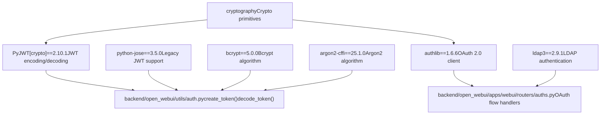
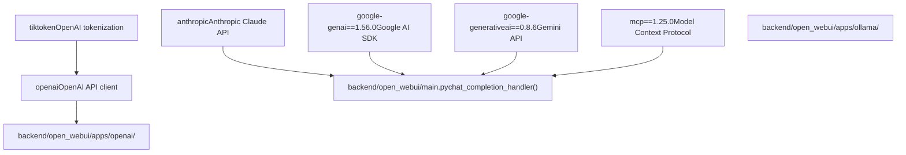
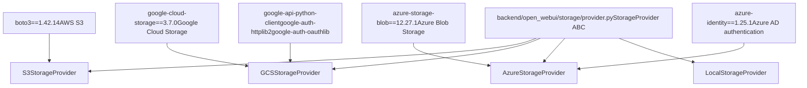

# Backend Dependencies

Relevant source files

-   [.github/workflows/integration-test.disabled](https://github.com/open-webui/open-webui/blob/a7271532/.github/workflows/integration-test.disabled)
-   [backend/open\_webui/storage/provider.py](https://github.com/open-webui/open-webui/blob/a7271532/backend/open_webui/storage/provider.py)
-   [backend/open\_webui/test/apps/webui/storage/test\_provider.py](https://github.com/open-webui/open-webui/blob/a7271532/backend/open_webui/test/apps/webui/storage/test_provider.py)
-   [backend/requirements-min.txt](https://github.com/open-webui/open-webui/blob/a7271532/backend/requirements-min.txt)
-   [backend/requirements.txt](https://github.com/open-webui/open-webui/blob/a7271532/backend/requirements.txt)
-   [docker-compose.playwright.yaml](https://github.com/open-webui/open-webui/blob/a7271532/docker-compose.playwright.yaml)
-   [pyproject.toml](https://github.com/open-webui/open-webui/blob/a7271532/pyproject.toml)
-   [uv.lock](https://github.com/open-webui/open-webui/blob/a7271532/uv.lock)

## Purpose and Scope

This document covers all Python dependencies required by the Open WebUI backend, organized by functional category. It explains the role of each major dependency, how dependencies are organized across configuration files, and which dependencies are optional versus required. For frontend JavaScript/TypeScript dependencies, see [Frontend Dependencies](/open-webui/open-webui/17.2-frontend-dependencies). For environment configuration that controls which dependencies are activated, see [Environment Configuration](/open-webui/open-webui/3.3-environment-configuration).

## Dependency Management Structure

Open WebUI uses three primary files to manage backend dependencies:

**Configuration Files:**

-   `backend/requirements.txt` - Complete production dependencies ([backend/requirements.txt1-156](https://github.com/open-webui/open-webui/blob/a7271532/backend/requirements.txt#L1-L156))
-   `pyproject.toml` - Project metadata and pip-installable package definition ([pyproject.toml1-210](https://github.com/open-webui/open-webui/blob/a7271532/pyproject.toml#L1-L210))
-   `backend/requirements-min.txt` - Minimal subset for basic functionality ([backend/requirements-min.txt1-52](https://github.com/open-webui/open-webui/blob/a7271532/backend/requirements-min.txt#L1-L52))
-   `uv.lock` - Lock file with exact resolved versions for reproducible builds ([uv.lock1-16](https://github.com/open-webui/open-webui/blob/a7271532/uv.lock#L1-L16))

**Dependency Declaration Pattern:**

```
# pyproject.toml defines core dependencies
[project]
dependencies = [
    "fastapi==0.126.0",
    "uvicorn[standard]==0.37.0",
    ...
]

# Optional dependencies for specific features
[project.optional-dependencies]
postgres = [
    "psycopg2-binary==2.9.11",
    "pgvector==0.4.2",
]
```
Sources: [pyproject.toml8-162](https://github.com/open-webui/open-webui/blob/a7271532/pyproject.toml#L8-L162) [backend/requirements.txt1-156](https://github.com/open-webui/open-webui/blob/a7271532/backend/requirements.txt#L1-L156) [backend/requirements-min.txt1-52](https://github.com/open-webui/open-webui/blob/a7271532/backend/requirements-min.txt#L1-L52)

## Dependency Category Overview


Sources: [backend/requirements.txt1-156](https://github.com/open-webui/open-webui/blob/a7271532/backend/requirements.txt#L1-L156) [pyproject.toml8-120](https://github.com/open-webui/open-webui/blob/a7271532/pyproject.toml#L8-L120)

## Core Web Framework Dependencies

### HTTP Framework Stack

| Package | Version | Purpose | Required |
| --- | --- | --- | --- |
| `fastapi` | 0.126.0 | Modern async web framework with OpenAPI support | Yes |
| `uvicorn[standard]` | 0.37.0 | ASGI server with WebSocket support and watchfiles | Yes |
| `pydantic` | 2.12.5 | Data validation and settings management | Yes |
| `python-multipart` | 0.0.21 | Multipart form data parsing for file uploads | Yes |
| `starlette-compress` | 1.6.1 | Gzip/Brotli response compression middleware | Yes |
| `itsdangerous` | 2.2.0 | Cryptographically signed session data | Yes |

**Usage in Code:** The FastAPI application is initialized in [backend/open\_webui/main.py](https://github.com/open-webui/open-webui/blob/a7271532/backend/open_webui/main.py) where all middleware and routers are registered. Pydantic models are used throughout for request/response validation, such as in [backend/open\_webui/apps/webui/models/](https://github.com/open-webui/open-webui/blob/a7271532/backend/open_webui/apps/webui/models/) for database models.

Sources: [backend/requirements.txt1-5](https://github.com/open-webui/open-webui/blob/a7271532/backend/requirements.txt#L1-L5) [pyproject.toml9-13](https://github.com/open-webui/open-webui/blob/a7271532/pyproject.toml#L9-L13)

### HTTP Client Libraries

| Package | Version | Purpose |
| --- | --- | --- |
| `requests` | 2.32.5 | Synchronous HTTP client for external APIs |
| `aiohttp` | 3.13.2 | Async HTTP client for concurrent requests |
| `httpx[socks,http2,zstd,cli,brotli]` | 0.28.1 | Modern HTTP client with HTTP/2, SOCKS proxy support |
| `async-timeout` | Latest | Timeout context manager for async operations |

**httpx Extra Features:**

-   `socks`: SOCKS proxy support for web scraping
-   `http2`: HTTP/2 protocol support
-   `zstd`: Zstandard compression
-   `brotli`: Brotli compression

Sources: [backend/requirements.txt15-24](https://github.com/open-webui/open-webui/blob/a7271532/backend/requirements.txt#L15-L24) [pyproject.toml23-30](https://github.com/open-webui/open-webui/blob/a7271532/pyproject.toml#L23-L30)

### Real-time Communication

| Package | Version | Purpose |
| --- | --- | --- |
| `python-socketio` | 5.15.1 | Socket.IO server implementation for WebSockets |
| `starsessions[redis]` | 2.2.1 | Session middleware with Redis backend support |
| `pycrdt` | 0.12.44 | CRDT data structures for collaborative editing |
| `redis` | Latest | Redis client for caching and pub/sub |

**Integration:** WebSocket events are handled in [backend/open\_webui/socket/](https://github.com/open-webui/open-webui/blob/a7271532/backend/open_webui/socket/) directory. The `pycrdt` library enables collaborative editing features in the rich text editor (see [Collaborative Editing](/open-webui/open-webui/9.3-collaborative-editing)).

Sources: [backend/requirements.txt7-32](https://github.com/open-webui/open-webui/blob/a7271532/backend/requirements.txt#L7-L32) [pyproject.toml15-39](https://github.com/open-webui/open-webui/blob/a7271532/pyproject.toml#L15-L39)

## Authentication and Security Dependencies


Sources: [backend/requirements.txt8-13](https://github.com/open-webui/open-webui/blob/a7271532/backend/requirements.txt#L8-L13) [pyproject.toml16-21](https://github.com/open-webui/open-webui/blob/a7271532/pyproject.toml#L16-L21)

### Security Package Roles

**JWT Token Libraries:**

-   `PyJWT[crypto]` (2.10.1): Primary JWT implementation with cryptographic signing support. The `[crypto]` extra includes cryptography for RSA/ECDSA algorithms.
-   `python-jose` (3.5.0): Alternative JWT library maintained for backward compatibility.
-   `cryptography`: Core cryptographic operations including Fernet encryption for OAuth client secrets.

**Password Hashing:**

-   `bcrypt` (5.0.0): Primary password hashing algorithm, CPU-intensive for security.
-   `argon2-cffi` (25.1.0): Modern memory-hard hashing algorithm, recommended for new installations.

**Authentication Protocols:**

-   `authlib` (1.6.6): OAuth 2.0 and OpenID Connect client implementation. Supports dynamic client registration and token refresh flows (see [OAuth Integration](/open-webui/open-webui/10.2-oauth-integration)).
-   `ldap3` (2.9.1): LDAP v3 protocol client for Active Directory integration (see [LDAP Integration](/open-webui/open-webui/10.3-ldap-integration)).

Sources: [backend/requirements.txt8-13](https://github.com/open-webui/open-webui/blob/a7271532/backend/requirements.txt#L8-L13) [backend/requirements.txt139](https://github.com/open-webui/open-webui/blob/a7271532/backend/requirements.txt#L139-L139) [pyproject.toml16-21](https://github.com/open-webui/open-webui/blob/a7271532/pyproject.toml#L16-L21)

## Database and ORM Dependencies

### Primary Database Stack

| Package | Version | Purpose | Database Support |
| --- | --- | --- | --- |
| `sqlalchemy` | 2.0.45 | Modern ORM with async support | PostgreSQL, MySQL, SQLite |
| `alembic` | 1.17.2 | Database migration management | All SQLAlchemy databases |
| `peewee` | 3.18.3 | Legacy lightweight ORM | SQLite (migration path) |
| `peewee-migrate` | 1.14.3 | Migration tool for Peewee | SQLite |

**Migration Strategy:** Open WebUI is transitioning from Peewee to SQLAlchemy. Both are included to support migration of existing installations. New features use SQLAlchemy exclusively.

Sources: [backend/requirements.txt25-28](https://github.com/open-webui/open-webui/blob/a7271532/backend/requirements.txt#L25-L28) [pyproject.toml33-36](https://github.com/open-webui/open-webui/blob/a7271532/pyproject.toml#L33-L36)

### Database Driver Dependencies

**PostgreSQL Support:**

```
# Optional dependencies for PostgreSQL
[project.optional-dependencies]
postgres = [
    "psycopg2-binary==2.9.11",  # PostgreSQL driver
    "pgvector==0.4.2",          # Vector extension support
]
```
**MySQL Support:**

-   `PyMySQL` (1.1.2): Pure Python MySQL client ([backend/requirements.txt118](https://github.com/open-webui/open-webui/blob/a7271532/backend/requirements.txt#L118-L118))

**Vector Database Extension:**

-   `pgvector` (0.4.2): PostgreSQL extension for vector similarity search. Enables using PostgreSQL as a vector database for RAG (see [Vector Database Integration](/open-webui/open-webui/7.5-vector-database-integration)).

Sources: [pyproject.toml135-138](https://github.com/open-webui/open-webui/blob/a7271532/pyproject.toml#L135-L138) [backend/requirements.txt115-118](https://github.com/open-webui/open-webui/blob/a7271532/backend/requirements.txt#L115-L118)

### Cache and Session Storage

| Package | Purpose |
| --- | --- |
| `redis` | Redis client for session storage, rate limiting, and distributed caching |
| `aiocache` | Async caching library with Redis backend support |

**Redis Usage Patterns:**

-   Session storage via `starsessions[redis]`
-   Token revocation blacklist
-   Rate limiting counters
-   WebSocket message distribution in multi-instance deployments

See [Redis Integration for Distribution](/open-webui/open-webui/16.3-redis-integration-for-distribution) for detailed usage.

Sources: [backend/requirements.txt31-32](https://github.com/open-webui/open-webui/blob/a7271532/backend/requirements.txt#L31-L32) [pyproject.toml39](https://github.com/open-webui/open-webui/blob/a7271532/pyproject.toml#L39-L39)

## AI and LLM Integration Dependencies

### LLM Provider SDKs


Sources: [backend/requirements.txt40-46](https://github.com/open-webui/open-webui/blob/a7271532/backend/requirements.txt#L40-L46) [pyproject.toml47-53](https://github.com/open-webui/open-webui/blob/a7271532/pyproject.toml#L47-L53)

### LLM SDK Details

| Package | Version | Purpose | API Endpoints |
| --- | --- | --- | --- |
| `openai` | Latest | Official OpenAI API client | GPT-4, GPT-3.5, DALL-E, Whisper, TTS |
| `anthropic` | Latest | Official Anthropic API client | Claude 3.5 Sonnet, Claude 3 Opus/Haiku |
| `google-genai` | 1.56.0 | Google AI Python SDK | Gemini Pro, Gemini Flash |
| `google-generativeai` | 0.8.6 | Legacy Gemini API client | Gemini models |

**Token Management:**

-   `tiktoken`: Byte Pair Encoding tokenizer for accurate token counting. Critical for context window management and billing estimation.

**Model Context Protocol:**

-   `mcp` (1.25.0): Enables integration with MCP-compliant tools and data sources. Used in tool execution system (see [Tool Execution System](/open-webui/open-webui/6.3-tool-execution-system)).

Sources: [backend/requirements.txt40-46](https://github.com/open-webui/open-webui/blob/a7271532/backend/requirements.txt#L40-L46) [pyproject.toml47-53](https://github.com/open-webui/open-webui/blob/a7271532/pyproject.toml#L47-L53)

### LangChain Ecosystem

| Package | Version | Purpose |
| --- | --- | --- |
| `langchain` | 1.2.0 | Core LangChain framework for LLM orchestration |
| `langchain-community` | 0.4.1 | Community-contributed integrations |
| `langchain-classic` | 1.0.0 | Legacy compatibility layer |
| `langchain-text-splitters` | 1.1.0 | Text chunking utilities |

**LangChain Usage:**

-   Document loaders for 40+ file formats
-   Text splitters: RecursiveCharacterTextSplitter, TokenTextSplitter, MarkdownHeaderTextSplitter
-   Retrieval chains: EnsembleRetriever for hybrid search
-   Memory management: Conversation buffer and summarization

See [Text Splitting and Chunking](/open-webui/open-webui/7.3-text-splitting-and-chunking) and [Retrieval Strategies](/open-webui/open-webui/7.6-retrieval-strategies) for implementation details.

Sources: [backend/requirements.txt48-51](https://github.com/open-webui/open-webui/blob/a7271532/backend/requirements.txt#L48-L51) [pyproject.toml55-58](https://github.com/open-webui/open-webui/blob/a7271532/pyproject.toml#L55-L58)

### Embedding and Transformer Models

| Package | Version | Purpose | Models Supported |
| --- | --- | --- | --- |
| `sentence-transformers` | 5.2.0 | Sentence/document embeddings | 6000+ models on Hugging Face |
| `transformers` | 4.57.3 | Hugging Face model hub interface | All transformer architectures |
| `accelerate` | Latest | Model parallelism and optimization | Multi-GPU inference |
| `onnxruntime` | 1.23.2 | ONNX model inference | Cross-encoder rerankers |

**Embedding Generation:** `sentence-transformers` is the primary library for local embedding generation. Supports models like:

-   `all-MiniLM-L6-v2` (default, lightweight)
-   `all-mpnet-base-v2` (higher quality)
-   `multilingual-e5-large` (multilingual support)

**Reranking:** `onnxruntime` enables fast cross-encoder reranking for RAG result refinement (see [Retrieval Strategies](/open-webui/open-webui/7.6-retrieval-strategies)).

Sources: [backend/requirements.txt58-62](https://github.com/open-webui/open-webui/blob/a7271532/backend/requirements.txt#L58-L62) [backend/requirements.txt90](https://github.com/open-webui/open-webui/blob/a7271532/backend/requirements.txt#L90-L90) [pyproject.toml66-70](https://github.com/open-webui/open-webui/blob/a7271532/pyproject.toml#L66-L70)

## Vector Database Dependencies

### Vector DB Client Libraries

```mermaid
flowchart TD
    ChromaDB["chromadb==1.3.7Default embedded DB"]
    Qdrant["qdrant-client==1.16.2Scalable vector search"]
    Milvus["pymilvus==2.6.5Large-scale production"]
    Weaviate["weaviate-client==4.19.0GraphQL vector DB"]
    OpenSearch["opensearch-py==3.1.0OpenSearch vector plugin"]
    PGVector["pgvector==0.4.2PostgreSQL extension"]
    Elasticsearch["elasticsearch==9.2.0Elastic vector search"]
    Pinecone["pinecone==6.0.2Managed service"]
    ColBERT["colbert-ai==0.2.22Late interaction retrieval"]
    RAGSystem["backend/open_webui/retrieval/"]
    VectorConfig["VECTOR_DB env variableSelects active DB"]

    ChromaDB --> RAGSystem
    Qdrant --> RAGSystem
    Milvus --> RAGSystem
    Weaviate --> RAGSystem
    OpenSearch --> RAGSystem
    PGVector --> RAGSystem
    VectorConfig --> RAGSystem
```


Sources: [backend/requirements.txt54-56](https://github.com/open-webui/open-webui/blob/a7271532/backend/requirements.txt#L54-L56) [backend/requirements.txt121-126](https://github.com/open-webui/open-webui/blob/a7271532/backend/requirements.txt#L121-L126) [pyproject.toml152-158](https://github.com/open-webui/open-webui/blob/a7271532/pyproject.toml#L152-L158)

### Vector Database Support Matrix

| Package | Version | Deployment Mode | Use Case | Optional |
| --- | --- | --- | --- | --- |
| `chromadb` | 1.3.7 | Embedded/Server | Development, small-scale | No |
| `qdrant-client` | 1.16.2 | Client/Server | Production, Docker-friendly | Yes |
| `pymilvus` | 2.6.5 | Client/Server | Large-scale, Kubernetes | Yes |
| `weaviate-client` | 4.19.0 | Client/Server | GraphQL queries, knowledge graphs | Yes |
| `opensearch-py` | 3.1.0 | Client/Server | Existing OpenSearch infrastructure | Yes |
| `pgvector` | 0.4.2 | PostgreSQL Extension | Unified relational + vector DB | Yes |
| `elasticsearch` | 9.2.0 | Client/Server | Elastic Stack integration | Yes |
| `pinecone` | 6.0.2 | Managed Cloud | Fully managed, no infrastructure | Yes |

**Default Configuration:** ChromaDB is included in base dependencies and used by default. Other vector databases are optional and activated by setting the `VECTOR_DB` environment variable.

**ColBERT Integration:**

-   `colbert-ai` (0.2.22): Late interaction retrieval model for advanced semantic search. Provides multi-vector representations for fine-grained matching.

Sources: [backend/requirements.txt54-56](https://github.com/open-webui/open-webui/blob/a7271532/backend/requirements.txt#L54-L56) [backend/requirements.txt121-126](https://github.com/open-webui/open-webui/blob/a7271532/backend/requirements.txt#L121-L126) [backend/requirements.txt130](https://github.com/open-webui/open-webui/blob/a7271532/backend/requirements.txt#L130-L130) [pyproject.toml60-64](https://github.com/open-webui/open-webui/blob/a7271532/pyproject.toml#L60-L64) [pyproject.toml152-158](https://github.com/open-webui/open-webui/blob/a7271532/pyproject.toml#L152-L158)

## Document Processing Dependencies

### Content Extraction Engines

| Package | Version | File Format Support | Purpose |
| --- | --- | --- | --- |
| `pypdf` | 6.5.0 | PDF | Text extraction from PDF files |
| `docx2txt` | 0.9 | DOCX | Microsoft Word document parsing |
| `python-pptx` | 1.0.2 | PPTX | PowerPoint presentation parsing |
| `openpyxl` | 3.1.5 | XLSX | Excel workbook reading/writing |
| `pyxlsb` | 1.0.10 | XLSB | Binary Excel format support |
| `xlrd` | 2.0.2 | XLS | Legacy Excel format support |
| `unstructured` | 0.18.21 | 40+ formats | Universal document loader framework |
| `msoffcrypto-tool` | 5.4.2 | Encrypted Office | Password-protected Office document decryption |

**Unstructured Library:** The `unstructured` package is a comprehensive framework that provides unified loaders for:

-   Office documents (DOCX, XLSX, PPTX)
-   PDFs (with layout detection)
-   Images (with OCR)
-   Email formats (EML, MSG)
-   HTML/XML
-   Markdown
-   CSV/TSV

See [Content Extraction Engines](/open-webui/open-webui/7.2-content-extraction-engines) for implementation details including Tika, Docling, MinerU, and Mistral OCR integrations.

Sources: [backend/requirements.txt66-80](https://github.com/open-webui/open-webui/blob/a7271532/backend/requirements.txt#L66-L80) [pyproject.toml72-88](https://github.com/open-webui/open-webui/blob/a7271532/pyproject.toml#L72-L88)

### OCR and Image Processing

| Package | Version | Purpose |
| --- | --- | --- |
| `rapidocr-onnxruntime` | 1.4.4 | Fast OCR engine using ONNX models |
| `pillow` | 12.0.0 | Image manipulation and format conversion |
| `opencv-python-headless` | 4.12.0.88 | Computer vision operations (no GUI) |

**OCR Capabilities:** `rapidocr-onnxruntime` provides fast, accurate OCR for:

-   Document images
-   Scanned PDFs
-   Screenshots
-   Handwritten text (limited support)

**Azure OCR Integration:**

-   `azure-ai-documentintelligence` (1.0.2): Advanced OCR with layout analysis, table extraction, and form recognition ([backend/requirements.txt100](https://github.com/open-webui/open-webui/blob/a7271532/backend/requirements.txt#L100-L100))

Sources: [backend/requirements.txt85-88](https://github.com/open-webui/open-webui/blob/a7271532/backend/requirements.txt#L85-L88) [backend/requirements.txt100](https://github.com/open-webui/open-webui/blob/a7271532/backend/requirements.txt#L100-L100) [pyproject.toml92-97](https://github.com/open-webui/open-webui/blob/a7271532/pyproject.toml#L92-L97)

### Text Processing and NLP

| Package | Version | Purpose |
| --- | --- | --- |
| `nltk` | 3.9.2 | Natural language processing toolkit |
| `Markdown` | 3.10 | Markdown to HTML conversion |
| `pymdown-extensions` | 10.19.1 | Extended Markdown syntax support |
| `pypandoc` | 1.16.2 | Universal document converter via Pandoc |
| `pandas` | 2.3.3 | Data frame operations for structured data |
| `chardet` | 5.2.0 | Character encoding detection |
| `ftfy` | 6.3.1 | Text cleanup and Unicode normalization |
| `sentencepiece` | Latest | Subword tokenization for multilingual models |

**NLTK Usage:**

-   Sentence tokenization for text splitting
-   Stopword removal for search optimization
-   Part-of-speech tagging for semantic analysis

Sources: [backend/requirements.txt64-83](https://github.com/open-webui/open-webui/blob/a7271532/backend/requirements.txt#L64-L83) [pyproject.toml72-91](https://github.com/open-webui/open-webui/blob/a7271532/pyproject.toml#L72-L91)

### Specialized Document Processing

| Package | Version | Purpose |
| --- | --- | --- |
| `youtube-transcript-api` | 1.2.3 | Extract transcripts from YouTube videos |
| `pytube` | 15.0.0 | Download YouTube video metadata |
| `validators` | 0.35.0 | URL and data validation |
| `fake-useragent` | 2.2.0 | Randomized user agent headers for web scraping |

**Web Content Loading:** These packages support the web search and content ingestion features. Combined with the `playwright` optional dependency, they enable loading web pages with JavaScript rendering.

Sources: [backend/requirements.txt53](https://github.com/open-webui/open-webui/blob/a7271532/backend/requirements.txt#L53-L53) [backend/requirements.txt94-95](https://github.com/open-webui/open-webui/blob/a7271532/backend/requirements.txt#L94-L95) [backend/requirements.txt80](https://github.com/open-webui/open-webui/blob/a7271532/backend/requirements.txt#L80-L80)

## Cloud Storage and Service Integration

### Cloud Storage Provider Dependencies


Sources: [backend/open\_webui/storage/provider.py1-375](https://github.com/open-webui/open-webui/blob/a7271532/backend/open_webui/storage/provider.py#L1-L375) [backend/requirements.txt100-120](https://github.com/open-webui/open-webui/blob/a7271532/backend/requirements.txt#L100-L120)

### Cloud Storage Package Details

**AWS S3:**

-   `boto3` (1.42.14): Official AWS SDK for Python. Supports S3, IAM role authentication, server-side encryption, multipart uploads.
-   Configuration: `S3_ACCESS_KEY_ID`, `S3_SECRET_ACCESS_KEY`, `S3_BUCKET_NAME`, `S3_ENDPOINT_URL`

**Google Cloud Storage:**

-   `google-cloud-storage` (3.7.0): Official GCS client library
-   `googleapis-common-protos` (1.72.0): Protocol buffer definitions for Google APIs
-   Authentication methods:
    -   Service account JSON via `GOOGLE_APPLICATION_CREDENTIALS_JSON`
    -   Application Default Credentials (ADC) for GKE workload identity
    -   User credentials for local development

**Azure Blob Storage:**

-   `azure-storage-blob` (12.27.1): Azure Blob Storage client
-   `azure-identity` (1.25.1): Authentication using managed identities, service principals, or storage account keys
-   `azure-core` (1.35.0): Shared Azure SDK core functionality

**Provider Selection:** The active storage provider is determined by the `STORAGE_PROVIDER` environment variable (`local`, `s3`, `gcs`, `azure`). Implementation in [backend/open\_webui/storage/provider.py360-374](https://github.com/open-webui/open-webui/blob/a7271532/backend/open_webui/storage/provider.py#L360-L374)

Sources: [backend/requirements.txt100-120](https://github.com/open-webui/open-webui/blob/a7271532/backend/requirements.txt#L100-L120) [backend/open\_webui/storage/provider.py106-375](https://github.com/open-webui/open-webui/blob/a7271532/backend/open_webui/storage/provider.py#L106-L375) [pyproject.toml109-118](https://github.com/open-webui/open-webui/blob/a7271532/pyproject.toml#L109-L118)

### Azure AI Services

| Package | Version | Service | Purpose |
| --- | --- | --- | --- |
| `azure-ai-documentintelligence` | 1.0.2 | Document Intelligence | OCR, layout analysis, form extraction |
| `azure-search-documents` | 11.6.0 | Azure Cognitive Search | Vector search integration |
| `azure-identity` | 1.25.1 | Azure AD | Unified authentication for all Azure services |

**Document Intelligence Integration:** Azure's document processing service is one of eight content extraction engines. Provides superior accuracy for complex documents with tables and forms. Activated by setting `CONTENT_EXTRACTION_ENGINE=document_intelligence`.

Sources: [backend/requirements.txt100-103](https://github.com/open-webui/open-webui/blob/a7271532/backend/requirements.txt#L100-L103) [pyproject.toml92](https://github.com/open-webui/open-webui/blob/a7271532/pyproject.toml#L92-L92) [pyproject.toml161](https://github.com/open-webui/open-webui/blob/a7271532/pyproject.toml#L161-L161)

### Google Drive Integration

| Package | Purpose |
| --- | --- |
| `google-api-python-client` | Google Drive API client |
| `google-auth-httplib2` | HTTP transport for Google API authentication |
| `google-auth-oauthlib` | OAuth 2.0 flow for Google services |

**Use Case:** Enables importing documents directly from Google Drive for RAG knowledge base population.

Sources: [backend/requirements.txt105-108](https://github.com/open-webui/open-webui/blob/a7271532/backend/requirements.txt#L105-L108) [pyproject.toml109-111](https://github.com/open-webui/open-webui/blob/a7271532/pyproject.toml#L109-L111)

## Audio Processing Dependencies

### Text-to-Speech and Speech-to-Text

| Package | Version | Feature | Purpose |
| --- | --- | --- | --- |
| `faster-whisper` | 1.2.1 | STT | Local speech-to-text using OpenAI Whisper models |
| `pydub` | Latest | Audio manipulation | Format conversion, silence removal, trimming |
| `soundfile` | 0.13.1 | Audio I/O | WAV/FLAC reading/writing |
| `av` | 12.3.0 | Video/audio codec | FFmpeg Python bindings |

**Faster Whisper:** Optimized implementation of OpenAI's Whisper model using CTranslate2 for 4x faster inference. Supports:

-   Multiple model sizes (tiny, base, small, medium, large)
-   Automatic language detection
-   Timestamp generation
-   GPU acceleration

**Audio Format Support:** Combined with `pydub` and `av`, the system supports virtually all audio formats through FFmpeg integration.

**Note on av Package:** Version 12.3.0 is used instead of 14.0.1 as specified in requirements to avoid FIPS self-test failures in certain environments ([backend/requirements.txt128](https://github.com/open-webui/open-webui/blob/a7271532/backend/requirements.txt#L128-L128)).

Sources: [backend/requirements.txt91-97](https://github.com/open-webui/open-webui/blob/a7271532/backend/requirements.txt#L91-L97) [backend/requirements.txt128](https://github.com/open-webui/open-webui/blob/a7271532/backend/requirements.txt#L128-L128) [pyproject.toml99-100](https://github.com/open-webui/open-webui/blob/a7271532/pyproject.toml#L99-L100) [pyproject.toml106](https://github.com/open-webui/open-webui/blob/a7271532/pyproject.toml#L106-L106)

## Scheduling and Background Tasks

| Package | Version | Purpose |
| --- | --- | --- |
| `APScheduler` | 3.11.1 | Cron-like job scheduling |
| `RestrictedPython` | 8.1 | Sandboxed Python execution for user scripts |
| `asgiref` | 3.11.0 | ASGI utilities and sync-to-async wrappers |

**APScheduler Usage:**

-   Periodic cleanup of expired sessions
-   Automated model list refreshes
-   Scheduled backup jobs
-   Memory management and cache invalidation

**RestrictedPython:** Enables safe execution of user-provided Python code in pipelines and custom functions. Restricts access to file system, network, and dangerous built-ins.

Sources: [backend/requirements.txt33-37](https://github.com/open-webui/open-webui/blob/a7271532/backend/requirements.txt#L33-L37) [pyproject.toml41-45](https://github.com/open-webui/open-webui/blob/a7271532/pyproject.toml#L41-L45)

## Web Scraping and Search

| Package | Version | Purpose |
| --- | --- | --- |
| `ddgs` | 9.10.0 | DuckDuckGo search API client |
| `playwright` | 1.57.0 | Browser automation for JavaScript rendering |
| `firecrawl-py` | 4.12.0 | Web crawling with LLM-friendly output |

**Playwright Integration:** Optional dependency for advanced web content loading. Requires separate Docker service for browser management. Version must match `docker-compose.playwright.yaml` ([docker-compose.playwright.yaml3](https://github.com/open-webui/open-webui/blob/a7271532/docker-compose.playwright.yaml#L3-L3)).

**Web Search Engines:** The `ddgs` package provides one of 24+ search engine integrations. See [Web Search Integration](/open-webui/open-webui/6.5-web-search-integration) for complete list including Brave, Tavily, Serper, etc.

Sources: [backend/requirements.txt98](https://github.com/open-webui/open-webui/blob/a7271532/backend/requirements.txt#L98-L98) [backend/requirements.txt123](https://github.com/open-webui/open-webui/blob/a7271532/backend/requirements.txt#L123-L123) [backend/requirements.txt142](https://github.com/open-webui/open-webui/blob/a7271532/backend/requirements.txt#L142-L142) [pyproject.toml149](https://github.com/open-webui/open-webui/blob/a7271532/pyproject.toml#L149-L149) [pyproject.toml160](https://github.com/open-webui/open-webui/blob/a7271532/pyproject.toml#L160-L160)

## Logging and Observability

| Package | Version | Purpose |
| --- | --- | --- |
| `loguru` | 0.7.3 | Advanced logging with colors and rotation |
| `opentelemetry-*` | 1.39.1/0.60b1 | Distributed tracing and metrics |

### OpenTelemetry Stack

**Core Libraries:**

-   `opentelemetry-api` (1.39.1): Core API for traces, metrics, logs
-   `opentelemetry-sdk` (1.39.1): Implementation of the API
-   `opentelemetry-exporter-otlp` (1.39.1): OTLP protocol exporter

**Automatic Instrumentation:**

-   `opentelemetry-instrumentation-fastapi` (0.60b1): FastAPI endpoint tracing
-   `opentelemetry-instrumentation-sqlalchemy` (0.60b1): Database query tracing
-   `opentelemetry-instrumentation-redis` (0.60b1): Redis operation tracing
-   `opentelemetry-instrumentation-requests` (0.60b1): HTTP client tracing
-   `opentelemetry-instrumentation-httpx` (0.60b1): HTTPX client tracing
-   `opentelemetry-instrumentation-aiohttp-client` (0.60b1): aiohttp tracing
-   `opentelemetry-instrumentation-logging` (0.60b1): Log correlation

**Usage:** Instrumentation is automatically applied when `ENABLE_OPENTELEMETRY=true`. Traces can be exported to Jaeger, Zipkin, or other OTLP-compatible backends.

Sources: [backend/requirements.txt144-155](https://github.com/open-webui/open-webui/blob/a7271532/backend/requirements.txt#L144-L155) [pyproject.toml144-155](https://github.com/open-webui/open-webui/blob/a7271532/pyproject.toml#L144-L155)

## Testing and Development Dependencies

### Test Framework

| Package | Version | Purpose | Required For |
| --- | --- | --- | --- |
| `pytest` | 8.4.1 | Test framework | All tests |
| `pytest-docker` | 3.2.5 | Docker service fixtures | Integration tests |
| `docker` | 7.1.0 | Docker SDK for Python | Container management in tests |
| `pytest-asyncio` | 1.0.0+ | Async test support | Async endpoint tests |

**Test Coverage:** Tests are located in [backend/open\_webui/test/](https://github.com/open-webui/open-webui/blob/a7271532/backend/open_webui/test/) directory:

-   Unit tests for utility functions
-   Storage provider tests with mocking ([backend/open\_webui/test/apps/webui/storage/test\_provider.py1-436](https://github.com/open-webui/open-webui/blob/a7271532/backend/open_webui/test/apps/webui/storage/test_provider.py#L1-L436))
-   Integration tests with Docker services
-   Database migration tests ([.github/workflows/integration-test.disabled105-256](https://github.com/open-webui/open-webui/blob/a7271532/.github/workflows/integration-test.disabled#L105-L256))

Sources: [backend/requirements.txt133-136](https://github.com/open-webui/open-webui/blob/a7271532/backend/requirements.txt#L133-L136) [pyproject.toml146-149](https://github.com/open-webui/open-webui/blob/a7271532/pyproject.toml#L146-L149) [dependency-groups.dev207-209](https://github.com/open-webui/open-webui/blob/a7271532/dependency-groups.dev#L207-L209)

### Code Quality Tools

| Package | Version | Purpose |
| --- | --- | --- |
| `black` | 25.12.0 | Opinionated code formatter |

**Black Configuration:** Used for consistent Python code formatting across the codebase. Configured in `pyproject.toml` (though specific config not shown in provided files).

Sources: [backend/requirements.txt93](https://github.com/open-webui/open-webui/blob/a7271532/backend/requirements.txt#L93-L93) [pyproject.toml102](https://github.com/open-webui/open-webui/blob/a7271532/pyproject.toml#L102-L102)

## Optional Dependencies Organization

### Optional Dependency Groups

```
# pyproject.toml
[project.optional-dependencies]
postgres = [
    "psycopg2-binary==2.9.11",
    "pgvector==0.4.2",
]

all = [
    "pymongo",              # MongoDB support
    "qdrant-client==1.16.2",
    "pymilvus==2.6.5",
    "weaviate-client==4.19.0",
    "pinecone==6.0.2",
    "elasticsearch==9.2.0",
    "oracledb==3.4.1",
    "colbert-ai==0.2.22",
    "firecrawl-py==4.12.0",
    "azure-search-documents==11.6.0",
    "playwright==1.57.0",
    # ... test and mock dependencies
]
```
**Installation:**

```
# Install base dependencies
pip install open-webui

# Install with PostgreSQL support
pip install open-webui[postgres]

# Install all optional dependencies
pip install open-webui[all]
```
Sources: [pyproject.toml134-162](https://github.com/open-webui/open-webui/blob/a7271532/pyproject.toml#L134-L162)

## Minimal Dependencies Configuration

The `backend/requirements-min.txt` file defines a minimal subset (52 packages vs 156 in full requirements) for:

-   Docker images with reduced size
-   Development environments
-   CI/CD pipelines
-   Embedded deployments

**Minimal Set Excludes:**

-   Vector databases (except ChromaDB)
-   Cloud storage providers
-   Advanced document processors
-   Azure/Google integrations
-   Audio processing
-   Testing frameworks

**Minimal Set Includes:**

-   Core web framework (FastAPI, Uvicorn)
-   Authentication (JWT, bcrypt, OAuth)
-   Database (SQLAlchemy, Peewee, Redis)
-   Basic LLM integration (OpenAI, LangChain core)
-   ChromaDB only for vector storage

Sources: [backend/requirements-min.txt1-52](https://github.com/open-webui/open-webui/blob/a7271532/backend/requirements-min.txt#L1-L52)

## Dependency Version Management

### Pinned vs Unpinned Versions

```mermaid
flowchart TD
    PyArrow["pyarrow==20.0.0Pinned for Raspberry Pi"]
    AV["av==12.3.0Pinned for FIPS"]
    Playwright["playwright==1.57.0Must match Docker image"]
    AI["AI Librariesopenai (latest)anthropic (latest)transformers>=4.57.3"]
    Utils["Utilitiesredis (latest)tiktoken (latest)pydub (latest)"]
    Core["Core Frameworkfastapi==0.126.0uvicorn==0.37.0pydantic==2.12.5"]
    Security["Securitybcrypt==5.0.0PyJWT==2.10.1argon2-cffi==25.1.0"]
    Database["Databasessqlalchemy==2.0.45alembic==1.17.2chromadb==1.3.7"]
```


Sources: [backend/requirements.txt61](https://github.com/open-webui/open-webui/blob/a7271532/backend/requirements.txt#L61-L61) [backend/requirements.txt123](https://github.com/open-webui/open-webui/blob/a7271532/backend/requirements.txt#L123-L123) [backend/requirements.txt128](https://github.com/open-webui/open-webui/blob/a7271532/backend/requirements.txt#L128-L128)

### Version Pinning Strategy

**Strictly Pinned (Major.Minor.Patch):**

-   Core web framework components to ensure API compatibility
-   Security-critical libraries to avoid vulnerability windows
-   Database libraries to maintain migration compatibility
-   Vector databases for index format stability

**Loosely Pinned (Major.Minor):**

-   LLM provider SDKs to get latest API features
-   Utility libraries with stable APIs
-   Development tools

**Special Version Constraints:**

-   `pyarrow==20.0.0`: Pinned to version 20 for Raspberry Pi ARM compatibility ([backend/requirements.txt61](https://github.com/open-webui/open-webui/blob/a7271532/backend/requirements.txt#L61-L61))
-   `av==12.3.0`: Pinned to avoid FIPS self-test failures in version 14.0.1 ([backend/requirements.txt128](https://github.com/open-webui/open-webui/blob/a7271532/backend/requirements.txt#L128-L128))
-   `playwright==1.57.0`: Must match Docker image in `docker-compose.playwright.yaml` ([backend/requirements.txt123](https://github.com/open-webui/open-webui/blob/a7271532/backend/requirements.txt#L123-L123) [docker-compose.playwright.yaml3](https://github.com/open-webui/open-webui/blob/a7271532/docker-compose.playwright.yaml#L3-L3))

Sources: [backend/requirements.txt1-156](https://github.com/open-webui/open-webui/blob/a7271532/backend/requirements.txt#L1-L156) [pyproject.toml8-162](https://github.com/open-webui/open-webui/blob/a7271532/pyproject.toml#L8-L162)

## Platform-Specific Considerations

### Python Version Requirements

```
# pyproject.toml
requires-python = ">= 3.11, < 3.13.0a1"
```
**Supported Versions:**

-   Python 3.11.x (fully supported)
-   Python 3.12.x (fully supported)
-   Python 3.13.x (not yet supported)

**Python 3.11 Features Used:**

-   Improved error messages
-   TOML configuration parsing
-   Exception groups
-   Task groups in asyncio

Sources: [pyproject.toml122](https://github.com/open-webui/open-webui/blob/a7271532/pyproject.toml#L122-L122)

### Dependency Extras and Markers

**Uvicorn Standard:**

```
uvicorn[standard]==0.37.0
```
The `[standard]` extra includes:

-   `uvloop`: High-performance event loop
-   `httptools`: Fast HTTP parser
-   `websockets`: WebSocket support
-   `watchfiles`: Auto-reload on file changes

**PyJWT Crypto:**

```
PyJWT[crypto]==2.10.1
```
The `[crypto]` extra includes `cryptography` for RSA/ECDSA signing algorithms.

**HTTPX Extras:**

```
httpx[socks,http2,zstd,cli,brotli]==0.28.1
```
Comprehensive extras for all HTTP features.

**StarSessions Redis:**

```
starsessions[redis]==2.2.1
```
Includes Redis client for distributed session storage.

Sources: [backend/requirements.txt2](https://github.com/open-webui/open-webui/blob/a7271532/backend/requirements.txt#L2-L2) [backend/requirements.txt12](https://github.com/open-webui/open-webui/blob/a7271532/backend/requirements.txt#L12-L12) [backend/requirements.txt21-22](https://github.com/open-webui/open-webui/blob/a7271532/backend/requirements.txt#L21-L22) [pyproject.toml10](https://github.com/open-webui/open-webui/blob/a7271532/pyproject.toml#L10-L10) [pyproject.toml20](https://github.com/open-webui/open-webui/blob/a7271532/pyproject.toml#L20-L20) [pyproject.toml29-30](https://github.com/open-webui/open-webui/blob/a7271532/pyproject.toml#L29-L30)

## Database-Specific Dependencies

| Database | Driver Package | Version | Additional Packages |
| --- | --- | --- | --- |
| SQLite | Built-in | Python stdlib | None (default) |
| PostgreSQL | `psycopg2-binary` | 2.9.11 | `pgvector==0.4.2` (optional) |
| MySQL | `PyMySQL` | 1.1.2 | None |
| MongoDB | `pymongo` | Latest | In `all` optional dependencies |
| Oracle | `oracledb` | 3.4.1 | In `all` optional dependencies |

**PostgreSQL Production Notes:**

-   `psycopg2-binary` includes compiled C extension
-   For production, consider `psycopg2` (non-binary) compiled against system libpq
-   `pgvector` enables vector similarity search within PostgreSQL

**MySQL Support:** `PyMySQL` is a pure-Python MySQL client. For better performance, consider `mysqlclient` (not included).

Sources: [backend/requirements.txt114-118](https://github.com/open-webui/open-webui/blob/a7271532/backend/requirements.txt#L114-L118) [backend/requirements.txt126](https://github.com/open-webui/open-webui/blob/a7271532/backend/requirements.txt#L126-L126) [pyproject.toml135-142](https://github.com/open-webui/open-webui/blob/a7271532/pyproject.toml#L135-L142)

## Dependency Update and Maintenance

### Lock File Management

The `uv.lock` file provides a complete resolved dependency graph with exact versions for reproducible builds across different environments. It includes:

-   Resolution markers for different Python versions
-   Platform-specific wheel URLs
-   Transitive dependency versions
-   SHA256 hashes for integrity verification

**Lock File Structure:**

```
version = 1
revision = 2
requires-python = ">=3.11, <3.13.0"
resolution-markers = [...]

[[package]]
name = "package-name"
version = "x.y.z"
source = { registry = "https://pypi.org/simple" }
dependencies = [...]
sdist = { url = "...", hash = "sha256:..." }
wheels = [...]
```
Sources: [uv.lock1-16](https://github.com/open-webui/open-webui/blob/a7271532/uv.lock#L1-L16)

### Dependency Installation Methods

**Using pip:**

```
cd backend
pip install -r requirements.txt
```
**Using uv (faster):**

```
uv pip install -r backend/requirements.txt
```
**Using pyproject.toml:**

```
pip install -e .
pip install -e .[postgres]
pip install -e .[all]
```
**Docker Build:** Dependencies are installed during Docker image build. See [Docker Deployment Options](/open-webui/open-webui/3.2-docker-deployment-options).

Sources: [pyproject.toml164-165](https://github.com/open-webui/open-webui/blob/a7271532/pyproject.toml#L164-L165)
