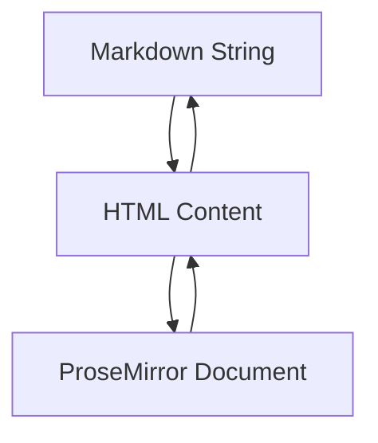
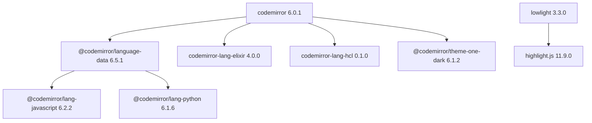
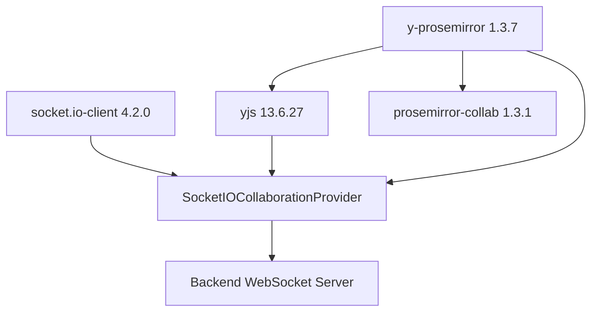
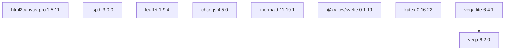
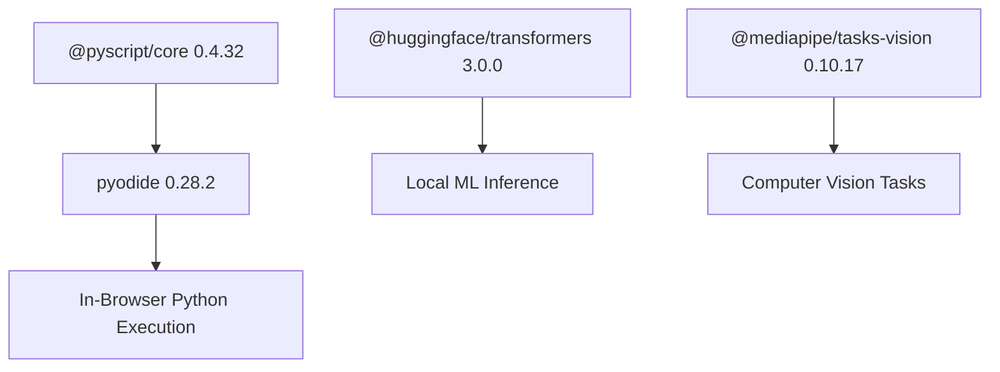
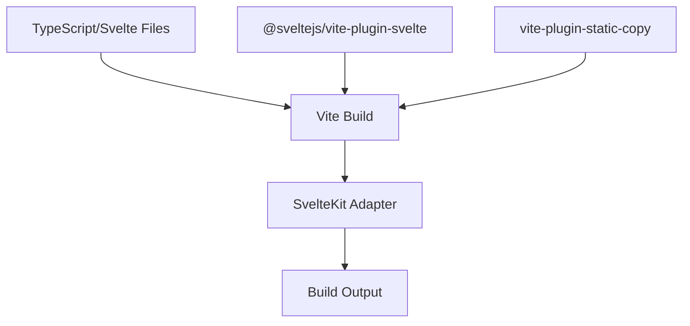

# Frontend Dependencies

Relevant source files

-   [CHANGELOG.md](https://github.com/open-webui/open-webui/blob/a7271532/CHANGELOG.md)
-   [package-lock.json](https://github.com/open-webui/open-webui/blob/a7271532/package-lock.json)
-   [package.json](https://github.com/open-webui/open-webui/blob/a7271532/package.json)
-   [src/app.css](https://github.com/open-webui/open-webui/blob/a7271532/src/app.css)
-   [src/lib/components/ChangelogModal.svelte](https://github.com/open-webui/open-webui/blob/a7271532/src/lib/components/ChangelogModal.svelte)
-   [src/lib/components/common/RichTextInput.svelte](https://github.com/open-webui/open-webui/blob/a7271532/src/lib/components/common/RichTextInput.svelte)
-   [src/lib/components/icons/XMark.svelte](https://github.com/open-webui/open-webui/blob/a7271532/src/lib/components/icons/XMark.svelte)

This document provides a comprehensive overview of the JavaScript/TypeScript dependencies used in the Open WebUI frontend. These dependencies encompass the SvelteKit framework, rich text editing (Tiptap), code editing (CodeMirror), real-time collaboration, document processing, visualization, and build tooling. For backend Python dependencies, see [Backend Dependencies](/open-webui/open-webui/17.1-backend-dependencies).

## Purpose and Scope

The frontend dependency stack is defined in [package.json1-153](https://github.com/open-webui/open-webui/blob/a7271532/package.json#L1-L153) and locked in [package-lock.json1](https://github.com/open-webui/open-webui/blob/a7271532/package-lock.json#L1-LNaN) This document catalogs the major dependency categories, their roles in the application, version constraints, and integration patterns. It serves as a reference for understanding which external libraries power specific frontend features and how they interconnect.

---

## Dependency Categories Overview

```mermaid
flowchart TD
    TypeScript["typescript 5.5.4"]
    Tailwind["tailwindcss 4.0.0"]
    Prettier["prettier 3.3.3"]
    ESLint["eslint 8.56.0"]
    HuggingFace["@huggingface/transformers 3.0.0"]
    Pyodide["pyodide 0.28.2"]
    PyScript["@pyscript/core 0.4.32"]
    Mermaid["mermaid 11.10.1"]
    ChartJS["chart.js 4.5.0"]
    Vega["vega 6.2.0"]
    XYFlow["@xyflow/svelte 0.1.19"]
    PDFjs["pdfjs-dist 5.4.149"]
    Mammoth["mammoth 1.11.0"]
    XLSX["xlsx 0.18.5"]
    CodeMirror["codemirror 6.0.1"]
    HighlightJS["highlight.js 11.9.0"]
    Lowlight["lowlight 3.3.0"]
    LanguageData["@codemirror/language-data 6.5.1"]
    Svelte["Svelte 5.0.0"]
    SvelteKit["@sveltejs/kit 2.5.27"]
    Vite["Vite 5.4.14"]
    Tiptap["@tiptap/core 3.0.7"]
    ProseMirror["ProseMirror packages"]
    Marked["marked 9.1.0"]
    Turndown["turndown 7.2.0"]
    SocketIO["socket.io-client 4.2.0"]
    Yjs["yjs 13.6.27"]
    YProseMirror["y-prosemirror 1.3.7"]

    Tiptap --> ProseMirror
    Tiptap --> Marked
    Tiptap --> Turndown
    YProseMirror --> Yjs
    YProseMirror --> ProseMirror
    CodeMirror --> HighlightJS
    CodeMirror --> Lowlight
    SvelteKit --> Svelte
    SvelteKit --> Vite
```


**Sources:** [package.json1-153](https://github.com/open-webui/open-webui/blob/a7271532/package.json#L1-L153)

---

## Core Framework Stack

The frontend is built on **SvelteKit 2.5.27** with **Svelte 5.0.0**, using **Vite 5.4.14** as the build tool. The framework dependencies are split between production and development:

| Package | Version | Purpose |
| --- | --- | --- |
| `svelte` | 5.0.0 | Core reactive framework |
| `@sveltejs/kit` | 2.5.27 | Application framework with routing, SSR |
| `@sveltejs/adapter-node` | 2.0.0 | Node.js deployment adapter |
| `@sveltejs/adapter-static` | 3.0.2 | Static site generation adapter |
| `@sveltejs/vite-plugin-svelte` | 4.0.0 | Vite integration plugin |
| `vite` | 5.4.14 | Build tool and dev server |

The adapter selection determines deployment mode: `adapter-node` for server-side rendering or `adapter-static` for pre-rendered static sites. Vite handles module resolution, hot module replacement (HMR), and production bundling.

**Sources:** [package.json24-65](https://github.com/open-webui/open-webui/blob/a7271532/package.json#L24-L65)

---

## Rich Text Editing System

The application uses **Tiptap 3.0.7** as the rich text editor, which is built on top of the **ProseMirror** framework. This system powers the chat input, notes editor, and other content creation features.

### Tiptap Extensions Ecosystem

```mermaid
flowchart TD
    TiptapCore["@tiptap/core 3.0.7"]
    StarterKit["@tiptap/starter-kit 3.0.7"]
    CodeBlock["@tiptap/extension-code-block-lowlight 3.0.7"]
    Table["@tiptap/extension-table 3.0.7"]
    Image["@tiptap/extension-image 3.0.7"]
    YouTube["@tiptap/extension-youtube 3.0.7"]
    Link["@tiptap/extension-link 3.0.7"]
    Highlight["@tiptap/extension-highlight 3.3.0"]
    Typography["@tiptap/extension-typography 3.0.7"]
    Mention["@tiptap/extension-mention 3.0.9"]
    BubbleMenu["@tiptap/extension-bubble-menu 2.26.1"]
    FloatingMenu["@tiptap/extension-floating-menu 2.26.1"]
    FileHandler["@tiptap/extension-file-handler 3.0.7"]
    DragHandle["@tiptap/extension-drag-handle 3.4.5"]
    List["@tiptap/extension-list 3.0.7"]
    PM["@tiptap/pm 3.0.7"]
    Suggestion["@tiptap/suggestion 3.4.2"]

    TiptapCore --> StarterKit
    TiptapCore --> CodeBlock
    TiptapCore --> Table
    TiptapCore --> Image
    TiptapCore --> YouTube
    TiptapCore --> Link
    TiptapCore --> Highlight
    TiptapCore --> Typography
    TiptapCore --> Mention
    TiptapCore --> BubbleMenu
    TiptapCore --> FloatingMenu
    TiptapCore --> FileHandler
    TiptapCore --> DragHandle
    TiptapCore --> List
    TiptapCore --> PM
    Mention --> Suggestion
```


**Sources:** [package.json67-84](https://github.com/open-webui/open-webui/blob/a7271532/package.json#L67-L84) [src/lib/components/common/RichTextInput.svelte117-143](https://github.com/open-webui/open-webui/blob/a7271532/src/lib/components/common/RichTextInput.svelte#L117-L143)

### ProseMirror Foundation

Tiptap is built on ProseMirror, requiring these core packages:

| Package | Version | Purpose |
| --- | --- | --- |
| `prosemirror-model` | 1.23.0 | Document schema and nodes |
| `prosemirror-state` | 1.4.3 | Editor state management |
| `prosemirror-view` | 1.34.3 | DOM rendering and interaction |
| `prosemirror-commands` | 1.6.0 | Editing commands |
| `prosemirror-keymap` | 1.2.2 | Keyboard shortcuts |
| `prosemirror-history` | 1.4.1 | Undo/redo functionality |
| `prosemirror-markdown` | 1.13.1 | Markdown parsing/serialization |
| `prosemirror-collab` | 1.3.1 | Collaborative editing |
| `prosemirror-tables` | 1.7.1 | Table support |

**Sources:** [package.json120-131](https://github.com/open-webui/open-webui/blob/a7271532/package.json#L120-L131)

### Markdown Conversion Pipeline

The rich text editor uses bidirectional Markdown conversion:


| Package | Version | Purpose |
| --- | --- | --- |
| `marked` | 9.1.0 | Markdown → HTML parsing |
| `turndown` | 7.2.0 | HTML → Markdown conversion |
| `@joplin/turndown-plugin-gfm` | 1.0.62 | GitHub Flavored Markdown support |
| `turndown-plugin-gfm` | 1.0.2 | Additional GFM features |

The conversion pipeline is implemented in [src/lib/components/common/RichTextInput.svelte2-106](https://github.com/open-webui/open-webui/blob/a7271532/src/lib/components/common/RichTextInput.svelte#L2-L106) with custom rules for task lists, tables, and mention syntax.

**Sources:** [package.json62-138](https://github.com/open-webui/open-webui/blob/a7271532/package.json#L62-L138) [src/lib/components/common/RichTextInput.svelte2-106](https://github.com/open-webui/open-webui/blob/a7271532/src/lib/components/common/RichTextInput.svelte#L2-L106)

---

## Code Editing System

**CodeMirror 6.0.1** provides code editing capabilities with syntax highlighting for 20+ languages. It powers the code block editor within Tiptap and standalone code editing features.

### CodeMirror Language Support


**Core CodeMirror Packages:**

| Package | Version | Purpose |
| --- | --- | --- |
| `@codemirror/state` | 6.4.1 | Editor state management |
| `@codemirror/view` | 6.28.0 | DOM rendering |
| `@codemirror/commands` | 6.6.0 | Editing commands |
| `@codemirror/language` | 6.10.2 | Language support infrastructure |
| `@codemirror/autocomplete` | 6.16.2 | Autocompletion |

**Language Packages:**

The `@codemirror/language-data` package aggregates 20+ language parsers. Direct dependencies include:

-   `@codemirror/lang-javascript` (6.2.2) - JavaScript/TypeScript
-   `@codemirror/lang-python` (6.1.6) - Python
-   `codemirror-lang-elixir` (4.0.0) - Elixir
-   `codemirror-lang-hcl` (0.1.0) - HashiCorp Configuration Language

**Syntax Highlighting:**

-   `highlight.js` (11.9.0) - Syntax detection and highlighting (200+ languages)
-   `lowlight` (3.3.0) - highlight.js wrapper for CodeMirror
-   `@codemirror/theme-one-dark` (6.1.2) - One Dark color theme

The integration with Tiptap's code blocks uses `@tiptap/extension-code-block-lowlight` to render syntax-highlighted code within the editor.

**Sources:** [package.json56-113](https://github.com/open-webui/open-webui/blob/a7271532/package.json#L56-L113) [src/lib/components/common/RichTextInput.svelte138-162](https://github.com/open-webui/open-webui/blob/a7271532/src/lib/components/common/RichTextInput.svelte#L138-L162)

---

## UI Component Libraries

### Component and Styling Framework

| Package | Version | Purpose |
| --- | --- | --- |
| `bits-ui` | 0.21.15 | Headless UI components (dropdowns, dialogs) |
| `alpinejs` | 3.15.0 | Lightweight reactivity for specific components |
| `@floating-ui/dom` | 1.7.2 | Positioning engine for tooltips/popovers |
| `tippy.js` | 6.3.7 | Tooltip and popover library |
| `paneforge` | 0.0.6 | Resizable pane layouts |
| `@sveltejs/svelte-virtual-list` | 3.0.1 | Virtual scrolling for large lists |
| `sortablejs` | 1.15.6 | Drag-and-drop reordering |
| `focus-trap` | 7.6.4 | Keyboard navigation for modals |

**Styling:**

-   `tailwindcss` (4.0.0) - Utility-first CSS framework
-   `@tailwindcss/typography` (0.5.13) - Prose styling plugin
-   `@tailwindcss/container-queries` (0.1.1) - Container query support
-   `postcss` (8.4.31) - CSS processing
-   `sass-embedded` (1.81.0) - Sass compilation

**Visual Effects:**

-   `svelte-confetti` (1.3.2) - Confetti animations (used in [src/lib/components/ChangelogModal.svelte5-37](https://github.com/open-webui/open-webui/blob/a7271532/src/lib/components/ChangelogModal.svelte#L5-L37))
-   `svelte-sonner` (0.3.19) - Toast notifications

**Sources:** [package.json47-143](https://github.com/open-webui/open-webui/blob/a7271532/package.json#L47-L143) [src/app.css1-810](https://github.com/open-webui/open-webui/blob/a7271532/src/app.css#L1-L810)

---

## Real-time Communication and Collaboration

The application supports real-time collaborative editing using **Yjs** CRDTs (Conflict-free Replicated Data Types) with **Socket.IO** for transport:


| Package | Version | Purpose |
| --- | --- | --- |
| `socket.io-client` | 4.2.0 | WebSocket client for real-time events |
| `yjs` | 13.6.27 | CRDT framework for collaborative editing |
| `y-prosemirror` | 1.3.7 | ProseMirror binding for Yjs |
| `prosemirror-collab` | 1.3.1 | ProseMirror collaborative editing plugin |

The `SocketIOCollaborationProvider` class (referenced in [src/lib/components/common/RichTextInput.svelte147-681](https://github.com/open-webui/open-webui/blob/a7271532/src/lib/components/common/RichTextInput.svelte#L147-L681)) bridges Socket.IO with Yjs for collaborative document editing. Cursor positions and selections are synchronized across clients, with conflict resolution handled automatically by the CRDT algorithm.

**Sources:** [package.json120-147](https://github.com/open-webui/open-webui/blob/a7271532/package.json#L120-L147) [src/lib/components/common/RichTextInput.svelte147-770](https://github.com/open-webui/open-webui/blob/a7271532/src/lib/components/common/RichTextInput.svelte#L147-L770)

---

## Document Processing Libraries

The frontend can extract and display content from various document formats:

### Document Parsing

| Package | Version | Purpose |
| --- | --- | --- |
| `pdfjs-dist` | 5.4.149 | PDF rendering and text extraction |
| `mammoth` | 1.11.0 | DOCX file parsing to HTML |
| `xlsx` | 0.18.5 | Excel file parsing and generation |

**PDF.js Integration:**

`pdfjs-dist` requires worker setup (see [package.json](https://github.com/open-webui/open-webui/blob/a7271532/package.json#LNaN-LNaN)). The worker is loaded from `/pdfjs/` in the static assets directory.

**DOCX Processing:**

The `mammoth` library converts DOCX files to HTML, preserving formatting. Used in file upload processing for extracting text content.

**Excel Processing:**

The `xlsx` library (also known as SheetJS) reads and writes Excel files (.xlsx, .xls, .csv). Used in the file viewer modal for spreadsheet rendering.

**Sources:** [package.json114-144](https://github.com/open-webui/open-webui/blob/a7271532/package.json#L114-L144) [CHANGELOG.md35](https://github.com/open-webui/open-webui/blob/a7271532/CHANGELOG.md#L35-L35)

---

## Visualization and Rendering Libraries

### Diagram and Chart Rendering


| Package | Version | Purpose |
| --- | --- | --- |
| `mermaid` | 11.10.1 | Diagram rendering (flowcharts, sequence diagrams) |
| `katex` | 0.16.22 | Mathematical notation rendering (LaTeX) |
| `chart.js` | 4.5.0 | Interactive charts (bar, line, pie) |
| `vega` | 6.2.0 | Declarative visualization grammar |
| `vega-lite` | 6.4.1 | High-level visualization specification |
| `@xyflow/svelte` | 0.1.19 | Node-based graphs and flowcharts |
| `leaflet` | 1.9.4 | Interactive map rendering |
| `html2canvas-pro` | 1.5.11 | Screenshot/export functionality |
| `jspdf` | 3.0.0 | PDF generation from JavaScript |

**Mathematical Notation:**

KaTeX is used throughout the markdown rendering pipeline to display inline and block-level mathematical expressions. Custom CSS in [src/app.css81-293](https://github.com/open-webui/open-webui/blob/a7271532/src/app.css#L81-L293) handles scrolling and visibility.

**Diagram Rendering:**

Mermaid diagrams are rendered within code blocks tagged with `mermaid` language identifier. The library version 11.10.1 supports all modern diagram types including flowcharts, sequence diagrams, class diagrams, and state diagrams.

**Sources:** [package.json89-142](https://github.com/open-webui/open-webui/blob/a7271532/package.json#L89-L142) [src/app.css81-293](https://github.com/open-webui/open-webui/blob/a7271532/src/app.css#L81-L293)

---

## AI and Code Execution

The frontend includes client-side AI/ML and Python execution capabilities:

### Pyodide and AI Integration


| Package | Version | Purpose |
| --- | --- | --- |
| `pyodide` | 0.28.2 | WebAssembly Python runtime |
| `@pyscript/core` | 0.4.32 | PyScript framework for Python in HTML |
| `@huggingface/transformers` | 3.0.0 | Browser-based transformer models |
| `@mediapipe/tasks-vision` | 0.10.17 | Computer vision tasks (face detection, etc.) |

**Pyodide Setup:**

Pyodide files are fetched during build via the `pyodide:fetch` script in [package.json22](https://github.com/open-webui/open-webui/blob/a7271532/package.json#L22-L22) The runtime enables executing Python code blocks directly in the browser without server interaction. This powers the code execution feature in [CodeBlock component](/open-webui/open-webui/5.4-code-block-execution).

**Hugging Face Transformers:**

The `@huggingface/transformers` library enables running lightweight transformer models client-side for tasks like text classification, sentiment analysis, and embeddings without backend calls.

**Sources:** [package.json6-132](https://github.com/open-webui/open-webui/blob/a7271532/package.json#L6-L132)

---

## Build and Development Tools

### TypeScript and Linting

| Package | Version | Purpose |
| --- | --- | --- |
| `typescript` | 5.5.4 | Type checking and compilation |
| `tslib` | 2.4.1 | TypeScript runtime helpers |
| `svelte-check` | 4.0.0 | Svelte type checking CLI |
| `eslint` | 8.56.0 | JavaScript/TypeScript linting |
| `@typescript-eslint/parser` | 8.31.1 | ESLint TypeScript parser |
| `@typescript-eslint/eslint-plugin` | 8.31.1 | TypeScript-specific lint rules |
| `eslint-plugin-svelte` | 2.45.1 | Svelte component linting |
| `eslint-config-prettier` | 9.1.0 | Disable conflicting Prettier rules |
| `prettier` | 3.3.3 | Code formatting |
| `prettier-plugin-svelte` | 3.2.6 | Svelte formatting plugin |

**Linting Scripts:**

The `lint` script in [package.json13-16](https://github.com/open-webui/open-webui/blob/a7271532/package.json#L13-L16) runs three checks:

1.  `lint:frontend` - ESLint on all JS/TS/Svelte files
2.  `lint:types` - TypeScript/Svelte type checking
3.  `lint:backend` - Python linting (not covered here)

**Sources:** [package.json13-130](https://github.com/open-webui/open-webui/blob/a7271532/package.json#L13-L130)

### Testing Infrastructure

| Package | Version | Purpose |
| --- | --- | --- |
| `vitest` | 1.6.1 | Unit testing framework |
| `cypress` | 13.15.0 | E2E testing framework |
| `eslint-plugin-cypress` | 3.4.0 | Cypress-specific lint rules |

**Testing Commands:**

-   `npm run test:frontend` - Run Vitest unit tests ([package.json21](https://github.com/open-webui/open-webui/blob/a7271532/package.json#L21-L21))
-   `npm run cy:open` - Launch Cypress test runner ([package.json20](https://github.com/open-webui/open-webui/blob/a7271532/package.json#L20-L20))

**Sources:** [package.json20-51](https://github.com/open-webui/open-webui/blob/a7271532/package.json#L20-L51)

### Build Pipeline


| Package | Version | Purpose |
| --- | --- | --- |
| `vite` | 5.4.14 | Build tool and dev server |
| `@sveltejs/vite-plugin-svelte` | 4.0.0 | Svelte support for Vite |
| `vite-plugin-static-copy` | 2.2.0 | Copy static assets during build |
| `@sveltejs/adapter-node` | 2.0.0 | Node.js server output |
| `@sveltejs/adapter-static` | 3.0.2 | Static site output |
| `@sveltejs/adapter-auto` | 3.2.2 | Auto-detect deployment platform |

**Build Commands:**

-   `npm run build` - Production build ([package.json8](https://github.com/open-webui/open-webui/blob/a7271532/package.json#L8-L8))
-   `npm run build:watch` - Continuous rebuild ([package.json9](https://github.com/open-webui/open-webui/blob/a7271532/package.json#L9-L9))
-   `npm run dev` - Development server ([package.json6](https://github.com/open-webui/open-webui/blob/a7271532/package.json#L6-L6))

**Sources:** [package.json6-143](https://github.com/open-webui/open-webui/blob/a7271532/package.json#L6-L143)

---

## Utility Libraries

### Data Processing and Validation

| Package | Version | Purpose |
| --- | --- | --- |
| `dompurify` | 3.2.6 | HTML sanitization (XSS prevention) |
| `fuse.js` | 7.0.0 | Fuzzy search library |
| `uuid` | 9.0.1 | UUID generation |
| `dayjs` | 1.11.10 | Date/time manipulation |
| `crc-32` | 1.2.2 | CRC32 checksums |
| `js-sha256` | 0.10.1 | SHA-256 hashing |
| `yaml` | 2.7.1 | YAML parsing/serialization |
| `async` | 3.2.5 | Async control flow utilities |
| `undici` | 7.3.0 | HTTP/1.1 client (Node.js fetch polyfill) |
| `eventsource-parser` | 1.1.2 | SSE (Server-Sent Events) parsing |

**HTML Sanitization:**

`dompurify` is critical for preventing XSS attacks when rendering user-generated content. Used throughout the application when displaying HTML from markdown or external sources, as seen in [src/lib/components/ChangelogModal.svelte2-92](https://github.com/open-webui/open-webui/blob/a7271532/src/lib/components/ChangelogModal.svelte#L2-L92)

**Search Functionality:**

`fuse.js` powers fuzzy searching in model lists, chat history, and other searchable interfaces. It provides configurable threshold and distance parameters for search precision.

**Sources:** [package.json49-146](https://github.com/open-webui/open-webui/blob/a7271532/package.json#L49-L146) [src/lib/components/ChangelogModal.svelte2-92](https://github.com/open-webui/open-webui/blob/a7271532/src/lib/components/ChangelogModal.svelte#L2-L92)

### File Handling

| Package | Version | Purpose |
| --- | --- | --- |
| `file-saver` | 2.0.5 | Client-side file saving |
| `heic2any` | 0.0.4 | HEIC image format conversion |
| `idb` | 7.1.1 | IndexedDB wrapper for client storage |
| `html-entities` | 2.5.3 | HTML entity encoding/decoding |

**Image Processing:**

`heic2any` converts HEIC images (Apple's format) to JPEG/PNG for browser compatibility before upload.

**Client-Side Storage:**

`idb` provides a Promise-based IndexedDB API for storing large amounts of structured data in the browser, used for offline chat history and file caching.

**Sources:** [package.json97-107](https://github.com/open-webui/open-webui/blob/a7271532/package.json#L97-L107)

### OAuth and Authentication

| Package | Version | Purpose |
| --- | --- | --- |
| `@azure/msal-browser` | 4.5.0 | Microsoft Authentication Library |

The MSAL library enables Azure AD/Microsoft 365 OAuth authentication flows directly from the frontend.

**Sources:** [package.json55](https://github.com/open-webui/open-webui/blob/a7271532/package.json#L55-L55)

---

## Internationalization

| Package | Version | Purpose |
| --- | --- | --- |
| `i18next` | 23.10.0 | i18n framework |
| `i18next-browser-languagedetector` | 7.2.0 | Auto-detect browser language |
| `i18next-resources-to-backend` | 1.2.0 | Dynamic resource loading |
| `i18next-parser` | 9.0.1 | Extract translatable strings (dev) |

The i18n system supports 20 locales with dynamic content placeholders. The `i18n:parse` script ([package.json19](https://github.com/open-webui/open-webui/blob/a7271532/package.json#L19-L19)) extracts translatable strings from source files. For details on translation structure and locale coverage, see [Internationalization](/open-webui/open-webui/15-internationalization).

**Sources:** [package.json19-106](https://github.com/open-webui/open-webui/blob/a7271532/package.json#L19-L106)

---

## TTS/Audio Processing

| Package | Version | Purpose |
| --- | --- | --- |
| `kokoro-js` | 1.1.1 | Text-to-speech library |

The `kokoro-js` package provides browser-based text-to-speech capabilities for local TTS without requiring backend API calls.

**Sources:** [package.json111](https://github.com/open-webui/open-webui/blob/a7271532/package.json#L111-L111)

---

## Dependency Management Strategy

### Version Constraints

The `package.json` uses **caret (^) ranges** for most dependencies, allowing automatic minor and patch updates while locking major versions:

```
{
  "@tiptap/core": "^3.0.7",    // Allows 3.0.x and 3.x.x
  "svelte": "^5.0.0",           // Allows 5.x.x
  "typescript": "^5.5.4"        // Allows 5.5.x and 5.x.x
}
```
**Exact Versions:**

Some packages use exact versions (no prefix) for stability:

-   `@sveltejs/adapter-auto`: `3.2.2`
-   Various CodeMirror language packages

### Engine Requirements

The project specifies Node.js and npm version constraints in [package.json149-152](https://github.com/open-webui/open-webui/blob/a7271532/package.json#L149-L152):

```
{
  "engines": {
    "node": ">=18.13.0 <=22.x.x",
    "npm": ">=6.0.0"
  }
}
```
This ensures compatibility with Node.js 18-22 while requiring npm 6+.

### Lock File

The `package-lock.json` (lockfileVersion 3) ensures reproducible builds by pinning exact versions and integrity hashes for all transitive dependencies. The lock file contains 100,000+ lines covering the entire dependency tree.

**Sources:** [package.json1-153](https://github.com/open-webui/open-webui/blob/a7271532/package.json#L1-L153) [package-lock.json1-4](https://github.com/open-webui/open-webui/blob/a7271532/package-lock.json#L1-L4)

---

## Summary Table: Major Dependency Groups

| Category | Key Packages | Total Package Count |
| --- | --- | --- |
| Framework | svelte, @sveltejs/kit, vite | 3 core + 2 adapters |
| Rich Text | @tiptap/*, prosemirror-*, marked, turndown | 18+ Tiptap extensions, 11 ProseMirror |
| Code Editing | codemirror, @codemirror/\*, highlight.js, lowlight | 5 core + 20+ language packs |
| Real-time | socket.io-client, yjs, y-prosemirror | 3 packages |
| Documents | pdfjs-dist, mammoth, xlsx | 3 packages |
| Visualization | mermaid, katex, chart.js, vega, @xyflow/svelte | 6 packages |
| AI/ML | pyodide, @huggingface/transformers, @mediapipe/\* | 4 packages |
| UI Components | bits-ui, tippy.js, sortablejs, focus-trap | 8+ packages |
| Build Tools | typescript, tailwindcss, prettier, eslint, vitest, cypress | 10+ packages |
| Utilities | dompurify, fuse.js, uuid, dayjs, i18next | 15+ packages |

**Total Dependencies:** 54 production dependencies, 33 devDependencies (87 direct dependencies in `package.json`).

**Sources:** [package.json1-153](https://github.com/open-webui/open-webui/blob/a7271532/package.json#L1-L153)
