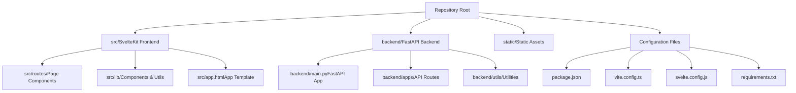
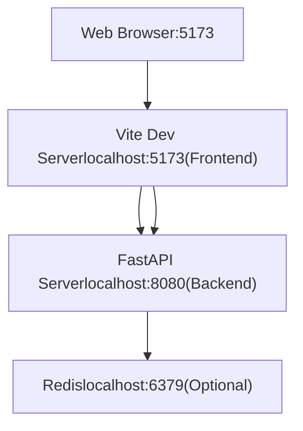
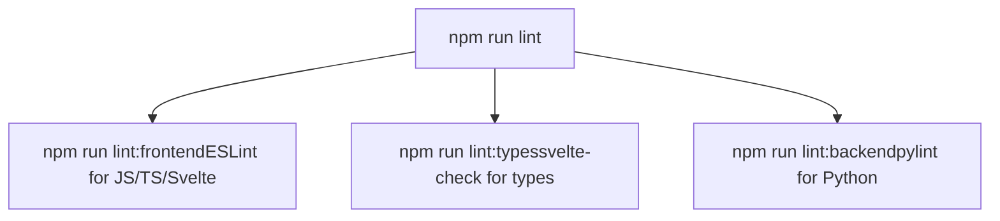

# Development Environment

Relevant source files

-   [CHANGELOG.md](https://github.com/open-webui/open-webui/blob/a7271532/CHANGELOG.md)
-   [LICENSE](https://github.com/open-webui/open-webui/blob/a7271532/LICENSE)
-   [README.md](https://github.com/open-webui/open-webui/blob/a7271532/README.md)
-   [TROUBLESHOOTING.md](https://github.com/open-webui/open-webui/blob/a7271532/TROUBLESHOOTING.md)
-   [docs/apache.md](https://github.com/open-webui/open-webui/blob/a7271532/docs/apache.md)
-   [package-lock.json](https://github.com/open-webui/open-webui/blob/a7271532/package-lock.json)
-   [package.json](https://github.com/open-webui/open-webui/blob/a7271532/package.json)
-   [src/app.css](https://github.com/open-webui/open-webui/blob/a7271532/src/app.css)
-   [src/lib/components/ChangelogModal.svelte](https://github.com/open-webui/open-webui/blob/a7271532/src/lib/components/ChangelogModal.svelte)
-   [src/lib/components/chat/Settings/About.svelte](https://github.com/open-webui/open-webui/blob/a7271532/src/lib/components/chat/Settings/About.svelte)
-   [src/lib/components/common/RichTextInput.svelte](https://github.com/open-webui/open-webui/blob/a7271532/src/lib/components/common/RichTextInput.svelte)
-   [src/lib/components/icons/XMark.svelte](https://github.com/open-webui/open-webui/blob/a7271532/src/lib/components/icons/XMark.svelte)
-   [src/lib/constants.ts](https://github.com/open-webui/open-webui/blob/a7271532/src/lib/constants.ts)

This page covers setting up a local development environment for Open WebUI, including prerequisites, dependency installation, running development servers, and debugging strategies. For information about the build system and production deployment, see [Frontend Build System](/open-webui/open-webui/18.2-testing-infrastructure) and [Docker Deployment](/open-webui/open-webui/17.2-frontend-dependencies).

## Prerequisites

Open WebUI requires the following tools to be installed on your development machine:

| Tool | Version | Purpose |
| --- | --- | --- |
| Node.js | 18.13.0 - 22.x.x | Frontend build system and development server |
| npm | ≥6.0.0 | JavaScript package management |
| Python | 3.11+ | Backend API server |
| Git | Latest | Version control |
| Redis | Latest (optional) | Real-time features and caching |

The Node.js version constraints are enforced in [package.json147-150](https://github.com/open-webui/open-webui/blob/a7271532/package.json#L147-L150) via the `engines` field.

**Sources:** [package.json147-150](https://github.com/open-webui/open-webui/blob/a7271532/package.json#L147-L150)

## Repository Structure


**Sources:** Architecture overview from system diagrams

## Frontend Development Setup

### Installing Dependencies

Clone the repository and install Node.js dependencies:

```
git clone https://github.com/open-webui/open-webui.git
cd open-webui
npm install
```
The [package.json54-146](https://github.com/open-webui/open-webui/blob/a7271532/package.json#L54-L146) file defines all frontend dependencies, including:

-   **@sveltejs/kit**: Application framework
-   **vite**: Build tool and dev server
-   **socket.io-client**: WebSocket communication
-   **marked**: Markdown parsing
-   **@tiptap/core**: Rich text editor

### Development Scripts

The following npm scripts are available for frontend development:

| Script | Command | Purpose |
| --- | --- | --- |
| `npm run dev` | `vite dev --host` | Start dev server on default port (5173) |
| `npm run dev:5050` | `vite dev --port 5050` | Start dev server on port 5050 |
| `npm run build:watch` | `vite build --watch` | Build in watch mode |
| `npm run check` | `svelte-check` | Type checking |
| `npm run lint` | ESLint + type checks | Lint all code |
| `npm run format` | Prettier | Format code |

**Sources:** [package.json5-22](https://github.com/open-webui/open-webui/blob/a7271532/package.json#L5-L22)

### Pyodide Preparation

Before running the dev server, the `pyodide:fetch` script downloads necessary Pyodide files for in-browser Python execution. This is automatically run as part of the `dev` and `build` scripts via:

```
"dev": "npm run pyodide:fetch && vite dev --host"
```
The script is implemented in `scripts/prepare-pyodide.js` and prepares assets for the [CodeBlock.svelte](https://github.com/open-webui/open-webui/blob/a7271532/CodeBlock.svelte) component's Python execution feature.

**Sources:** [package.json6](https://github.com/open-webui/open-webui/blob/a7271532/package.json#L6-L6) [package.json22](https://github.com/open-webui/open-webui/blob/a7271532/package.json#L22-L22)

### Running the Development Server

```
npm run dev
```
This command:

1.  Executes `pyodide:fetch` to prepare Python runtime assets
2.  Starts the Vite development server with HMR (Hot Module Replacement)
3.  Serves the application on `http://localhost:5173` by default
4.  Uses `--host` flag to allow network access

The development server provides:

-   **Hot Module Replacement**: Changes to Svelte components update instantly
-   **Fast Refresh**: Component state is preserved across updates where possible
-   **TypeScript compilation**: On-the-fly TypeScript to JavaScript transpilation
-   **CSS processing**: Tailwind CSS compilation with PostCSS

**Sources:** [package.json6](https://github.com/open-webui/open-webui/blob/a7271532/package.json#L6-L6)

## Backend Development Setup

### Python Virtual Environment

Create and activate a Python virtual environment:

```
python -m venv venv
source venv/bin/activate  # On Windows: venv\Scripts\activate
```
### Installing Backend Dependencies

```
pip install -r requirements.txt
```
The requirements are organized in multiple files:

-   `requirements.txt`: Full installation with all features
-   `requirements-min.txt`: Minimal installation without optional features

For specific feature sets, use optional dependency groups defined in `pyproject.toml`:

```
pip install -e ".[postgres]"  # PostgreSQL support
pip install -e ".[all]"       # All optional features
```
**Sources:** Architecture diagrams (Backend Architecture), dependency information from page 16 context

### Environment Configuration

Backend configuration is managed through environment variables. Create a `.env` file in the repository root:

```
# Database
DATABASE_URL=sqlite:///./data/webui.db

# Redis (optional for development)
REDIS_URL=redis://localhost:6379

# Authentication
WEBUI_SECRET_KEY=your-secret-key-here

# Development settings
ENV=dev
```
The configuration system is implemented in [backend/apps/webui/internal/env.py](https://github.com/open-webui/open-webui/blob/a7271532/backend/apps/webui/internal/env.py) which loads environment variables and sets global constants.

**Sources:** Architecture diagrams (Configuration System), page 9.3 context

## Running the Full Stack

### Development Architecture


### Starting the Backend Server

In a separate terminal:

```
cd backend
python main.py
```
Or using uvicorn directly:

```
uvicorn main:app --reload --host 0.0.0.0 --port 8080
```
The `--reload` flag enables auto-reloading when Python files change.

The backend server implements:

-   **FastAPI application**: REST API endpoints at [backend/main.py](https://github.com/open-webui/open-webui/blob/a7271532/backend/main.py)
-   **Socket.IO server**: Real-time communication at [backend/apps/socket/main.py](https://github.com/open-webui/open-webui/blob/a7271532/backend/apps/socket/main.py)
-   **Lifespan management**: Redis initialization and cleanup

**Sources:** Architecture diagrams (Backend Application Architecture)

### Starting the Frontend Development Server

In another terminal:

```
npm run dev
```
### API Proxying

During development, the Vite dev server proxies API requests to the backend. This is configured in `vite.config.ts`:

```
server: {
  proxy: {
    '/api': 'http://localhost:8080',
    '/socket.io': {
      target: 'http://localhost:8080',
      ws: true
    }
  }
}
```
This allows the frontend to make requests to `/api/*` which are automatically forwarded to the FastAPI backend.

**Sources:** Standard SvelteKit/Vite development pattern

## Development Workflows

### Linting and Code Quality


The linting pipeline is defined in [package.json13-16](https://github.com/open-webui/open-webui/blob/a7271532/package.json#L13-L16):

```
npm run lint          # Run all linters
npm run lint:frontend # ESLint only
npm run lint:types   # Type checking only
npm run lint:backend # Python linting only
```
**Sources:** [package.json13-16](https://github.com/open-webui/open-webui/blob/a7271532/package.json#L13-L16)

### Code Formatting

```
npm run format         # Format frontend (Prettier)
npm run format:backend # Format backend (Black)
```
Frontend formatting uses Prettier with configuration for Svelte, TypeScript, and CSS files. Backend formatting uses Black with exclusion of virtual environment directories.

**Sources:** [package.json17-18](https://github.com/open-webui/open-webui/blob/a7271532/package.json#L17-L18)

### Type Checking

```
npm run check       # One-time type check
npm run check:watch # Continuous type checking
```
Type checking uses `svelte-check` to validate TypeScript types across Svelte components and TypeScript files, ensuring type safety before committing code.

**Sources:** [package.json11-12](https://github.com/open-webui/open-webui/blob/a7271532/package.json#L11-L12)

## Debugging

### Frontend Debugging

#### Browser DevTools

1.  **Component Inspector**: Use browser extensions for Svelte/SvelteKit:

    -   Svelte DevTools (Chrome/Firefox)
    -   Vue DevTools (works with SvelteKit in some cases)
2.  **Network Tab**: Monitor API requests and WebSocket connections

    -   API calls to `/api/*` endpoints
    -   Socket.IO connections to `/socket.io`
3.  **Console Debugging**: The application logs events to the browser console:

    -   WebSocket connection status
    -   Store updates
    -   Component lifecycle events

#### Vite Debug Mode

Enable verbose logging:

```
DEBUG=vite:* npm run dev
```
This shows detailed information about:

-   Module resolution
-   HMR updates
-   Build pipeline execution

#### Svelte Component Debugging

Add debug statements in Svelte components:

```
$: console.log('Component state:', { value, editor, html });
```
The reactive statement syntax (`$:`) ensures logging happens whenever dependencies change.

**Example:** [src/lib/components/common/RichTextInput.svelte278-832](https://github.com/open-webui/open-webui/blob/a7271532/src/lib/components/common/RichTextInput.svelte#L278-L832) uses this pattern extensively.

**Sources:** [src/lib/components/common/RichTextInput.svelte278-832](https://github.com/open-webui/open-webui/blob/a7271532/src/lib/components/common/RichTextInput.svelte#L278-L832)

### Backend Debugging

#### Python Debugger (pdb)

Insert breakpoints in Python code:

```
import pdb; pdb.set_trace()
```
Or use the built-in `breakpoint()` function (Python 3.7+):

```
breakpoint()
```
#### IDE Debugging

Configure your IDE to attach to the running FastAPI server:

**VS Code launch.json example:**

```
{
  "version": "0.2.0",
  "configurations": [
    {
      "name": "Python: FastAPI",
      "type": "python",
      "request": "launch",
      "module": "uvicorn",
      "args": [
        "main:app",
        "--reload",
        "--host", "0.0.0.0",
        "--port", "8080"
      ],
      "cwd": "${workspaceFolder}/backend"
    }
  ]
}
```
#### Logging

The backend uses Python's `logging` module extensively. Enable debug logging:

```
import logging
logging.basicConfig(level=logging.DEBUG)
```
Or set via environment variable:

```
LOG_LEVEL=DEBUG python main.py
```
**Sources:** Standard Python/FastAPI debugging practices

### WebSocket Debugging

For debugging Socket.IO connections:

1.  **Browser Console**: Socket.IO client logs connection events
2.  **Network Tab**: Filter by "WS" to see WebSocket frames
3.  **Socket.IO Debug Mode**: Enable client-side debug logging:

```
import { io } from 'socket.io-client';
const socket = io(url, {
  transports: ['websocket'],
  debug: true
});
```
The WebSocket implementation is in [backend/apps/socket/main.py](https://github.com/open-webui/open-webui/blob/a7271532/backend/apps/socket/main.py) and uses Redis for distributed state management.

**Sources:** Architecture diagrams (Real-time Communication)

## Common Development Tasks

### Adding Frontend Dependencies

```
npm install <package-name>      # Production dependency
npm install -D <package-name>   # Development dependency
```
Update [package.json54-146](https://github.com/open-webui/open-webui/blob/a7271532/package.json#L54-L146) for runtime dependencies or [package.json24-52](https://github.com/open-webui/open-webui/blob/a7271532/package.json#L24-L52) for dev dependencies.

**Sources:** [package.json24-52](https://github.com/open-webui/open-webui/blob/a7271532/package.json#L24-L52) [package.json54-146](https://github.com/open-webui/open-webui/blob/a7271532/package.json#L54-L146)

### Adding Backend Dependencies

```
pip install <package-name>
pip freeze > requirements.txt  # Update requirements file
```
For optional dependencies, update `pyproject.toml` to add new feature groups.

### Running Tests

```
npm run test:frontend  # Vitest for frontend unit tests
```
The test configuration uses Vitest with [package.json21](https://github.com/open-webui/open-webui/blob/a7271532/package.json#L21-L21) defining the test script.

**Sources:** [package.json21](https://github.com/open-webui/open-webui/blob/a7271532/package.json#L21-L21)

### Building for Production

```
npm run build
```
This command:

1.  Runs `pyodide:fetch` to prepare assets
2.  Executes Vite build process
3.  Outputs optimized static files to `build/` directory
4.  Uses SvelteKit adapter specified in `svelte.config.js`

For continuous building during development:

```
npm run build:watch
```
**Sources:** [package.json8-9](https://github.com/open-webui/open-webui/blob/a7271532/package.json#L8-L9)

### Clearing Development Cache

If experiencing build issues:

```
# Clear npm cache
npm run pyodide:fetch
rm -rf node_modules/.vite

# Clear Python cache
find . -type d -name __pycache__ -exec rm -r {} +
find . -type f -name "*.pyc" -delete

# Reinstall dependencies
npm install
```
### Internationalization Development

To parse new translation keys:

```
npm run i18n:parse
```
This script uses `i18next-parser` to extract translation keys from source files and updates the translation JSON files in `src/lib/i18n/`.

**Sources:** [package.json19](https://github.com/open-webui/open-webui/blob/a7271532/package.json#L19-L19)

## Development Environment Variables

Key environment variables for development:

| Variable | Default | Purpose |
| --- | --- | --- |
| `ENV` | `dev` | Environment mode |
| `DATA_DIR` | `./data` | Data storage directory |
| `STATIC_DIR` | `./static` | Static files directory |
| `DATABASE_URL` | SQLite path | Database connection string |
| `REDIS_URL` | None | Redis connection string (optional) |
| `WEBUI_SECRET_KEY` | Auto-generated | JWT signing key |
| `PORT` | `8080` | Backend server port |
| `HOST` | `0.0.0.0` | Backend server host |

For a complete list of configuration options, see [Environment Configuration](/open-webui/open-webui/9.3-collaborative-editing).

**Sources:** Architecture diagrams (Configuration System), page 9.3 context

## Troubleshooting

### Frontend Issues

**Port Already in Use:**

```
# Use alternative port
npm run dev:5050
```
**TypeScript Errors:**

```
npm run check
```
**Stale Build Artifacts:**

```
rm -rf .svelte-kit node_modules/.vite
npm install
```
### Backend Issues

**Module Not Found:**

```
pip install -r requirements.txt
```
**Database Migration Issues:**

```
# Remove and recreate database (development only)
rm data/webui.db
python main.py
```
**Redis Connection Failed:** Redis is optional for development. The application will fall back to in-memory storage if Redis is unavailable.

### Build Issues

**Pyodide Fetch Failures:**

```
npm run pyodide:fetch
```
This manually downloads Pyodide assets required for in-browser Python execution.

**Sources:** [package.json22](https://github.com/open-webui/open-webui/blob/a7271532/package.json#L22-L22)
