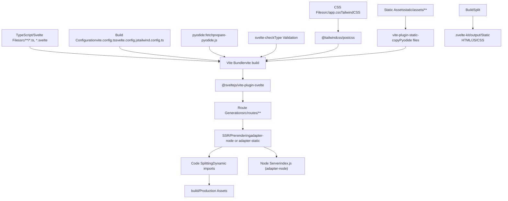
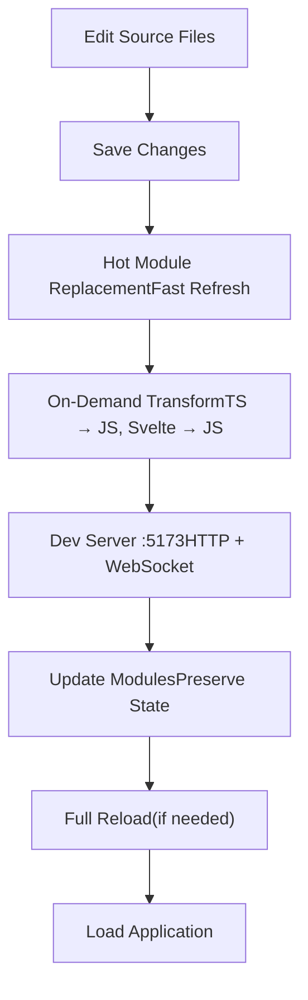
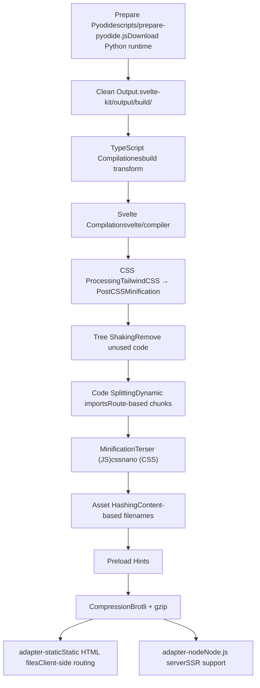
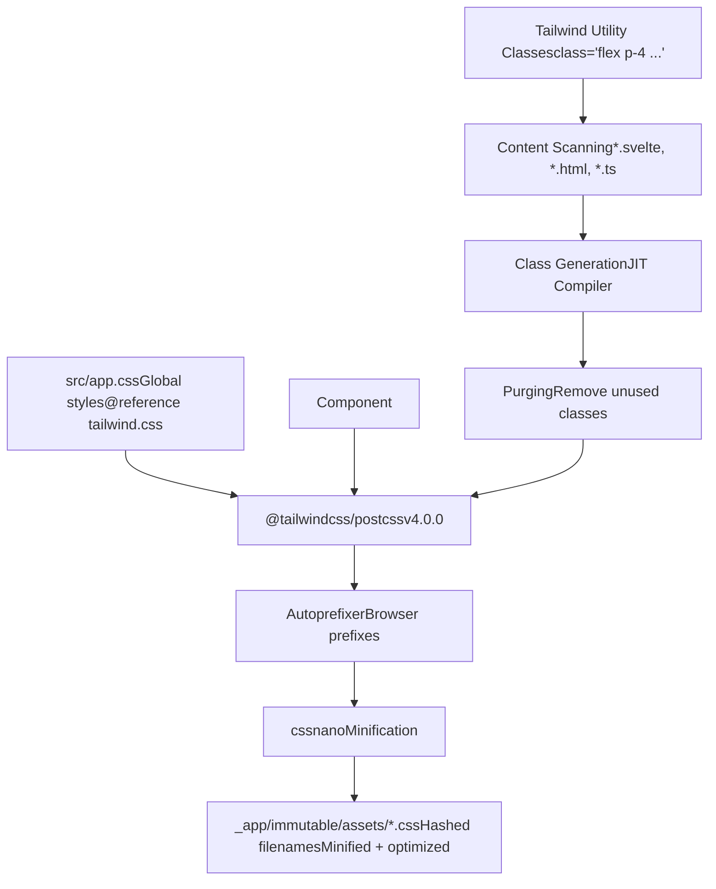
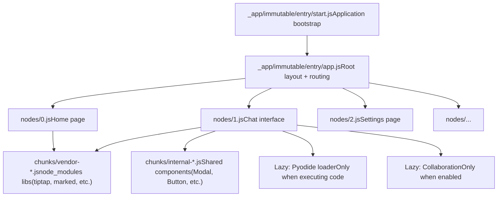

# Build System

Relevant source files

-   [CHANGELOG.md](https://github.com/open-webui/open-webui/blob/a7271532/CHANGELOG.md)
-   [package-lock.json](https://github.com/open-webui/open-webui/blob/a7271532/package-lock.json)
-   [package.json](https://github.com/open-webui/open-webui/blob/a7271532/package.json)
-   [src/app.css](https://github.com/open-webui/open-webui/blob/a7271532/src/app.css)
-   [src/lib/components/ChangelogModal.svelte](https://github.com/open-webui/open-webui/blob/a7271532/src/lib/components/ChangelogModal.svelte)
-   [src/lib/components/common/RichTextInput.svelte](https://github.com/open-webui/open-webui/blob/a7271532/src/lib/components/common/RichTextInput.svelte)
-   [src/lib/components/icons/XMark.svelte](https://github.com/open-webui/open-webui/blob/a7271532/src/lib/components/icons/XMark.svelte)

## Purpose and Scope

This document covers the frontend build system for Open WebUI, which transforms TypeScript/Svelte source code into production-ready JavaScript bundles and static assets. The build system is based on Vite and SvelteKit, configured via `package.json` and supporting both static site generation and Node.js server deployment. For backend Python packaging and execution, see Backend Architecture (#2.3). For Docker containerization and deployment configurations, see Docker Deployment Options (#3.2).

---

## Build Tools Stack

Open WebUI's frontend uses a modern JavaScript toolchain centered around Vite 5 and SvelteKit 2:

| Tool | Version | Purpose |
| --- | --- | --- |
| Vite | ^5.4.14 | Build tool and development server |
| SvelteKit | ^2.5.27 | Application framework and routing |
| Svelte | ^5.0.0 | Component framework |
| TailwindCSS | ^4.0.0 | Utility-first CSS framework |
| TypeScript | ^5.5.4 | Type checking and compilation |
| PostCSS | ^8.4.31 | CSS processing |

**SvelteKit Adapters:**

-   `@sveltejs/adapter-static` (^3.0.2): Generates static HTML/JS/CSS files for deployment to CDNs or static hosting
-   `@sveltejs/adapter-node` (^2.0.0): Creates Node.js server for SSR and dynamic routing
-   `@sveltejs/adapter-auto` (3.2.2): Automatically selects adapter based on deployment platform

The default adapter is determined by the SvelteKit configuration at build time. Static adapter is used for containerized deployments where the backend serves static assets.

**Sources:** [package.json25-51](https://github.com/open-webui/open-webui/blob/a7271532/package.json#L25-L51) [package.json105-132](https://github.com/open-webui/open-webui/blob/a7271532/package.json#L105-L132)

---

## Build Pipeline Architecture


**Sources:** [package.json6-11](https://github.com/open-webui/open-webui/blob/a7271532/package.json#L6-L11) [package.json143](https://github.com/open-webui/open-webui/blob/a7271532/package.json#L143-L143)

---

## NPM Scripts Reference

The build system is controlled through npm scripts defined in `package.json`:

### Development Scripts

```
"dev": "npm run pyodide:fetch && vite dev --host"
"dev:5050": "npm run pyodide:fetch && vite dev --port 5050"
```
Both development scripts first fetch Pyodide assets (Python runtime for in-browser code execution) via `scripts/prepare-pyodide.js`, then start the Vite development server. The `--host` flag exposes the server to the network. The dev server runs on port 5173 by default, with an alternative port 5050 available.

**Sources:** [package.json6-7](https://github.com/open-webui/open-webui/blob/a7271532/package.json#L6-L7)

### Production Build Scripts

```
"build": "npm run pyodide:fetch && vite build"
"build:watch": "npm run pyodide:fetch && vite build --watch"
```
The `build` command executes the full production build pipeline: Pyodide preparation → Vite bundling → SvelteKit adapter processing. The `--watch` variant enables incremental rebuilds for development.

**Sources:** [package.json8-9](https://github.com/open-webui/open-webui/blob/a7271532/package.json#L8-L9)

### Code Quality Scripts

```
"lint": "npm run lint:frontend ; npm run lint:types ; npm run lint:backend"
"lint:frontend": "eslint . --fix"
"lint:types": "npm run check"
"check": "svelte-kit sync && svelte-check --tsconfig ./tsconfig.json"
"format": "prettier --plugin-search-dir --write \"**/*.{js,ts,svelte,css,md,html,json}\""
```
Linting runs ESLint for JavaScript/TypeScript files, `svelte-check` for Svelte component type validation, and delegates backend linting to `pylint`. The format script uses Prettier with Svelte plugin support.

**Sources:** [package.json13-18](https://github.com/open-webui/open-webui/blob/a7271532/package.json#L13-L18)

### Testing Scripts

```
"test:frontend": "vitest --passWithNoTests"
"cy:open": "cypress open"
```
Frontend unit tests use Vitest, while Cypress handles end-to-end testing. The `--passWithNoTests` flag prevents CI failures when no tests are present.

**Sources:** [package.json20-21](https://github.com/open-webui/open-webui/blob/a7271532/package.json#L20-L21)

---

## Development Workflow


**Development Server Features:**

-   **Port Configuration**: Default 5173, configurable via `vite dev --port`
-   **Network Access**: `--host` flag binds to 0.0.0.0 for external access
-   **Hot Module Replacement**: Updates modules without full page reload
-   **Source Maps**: Inline source maps for debugging
-   **TypeScript**: On-the-fly transpilation via `esbuild`
-   **Svelte Compilation**: Real-time component transformation
-   **TailwindCSS**: JIT compilation with instant updates

The Vite dev server proxies API requests to the backend (configured in `vite.config.ts`) running on port 8080 by default, enabling full-stack development without CORS issues.

**Sources:** [package.json6-7](https://github.com/open-webui/open-webui/blob/a7271532/package.json#L6-L7)

---

## Production Build Process

The production build transforms source files through multiple optimization stages:


**Build Output Structure:**

```
build/
├── _app/
│   ├── immutable/
│   │   ├── chunks/       # Shared code chunks
│   │   ├── nodes/        # Route component bundles
│   │   ├── entry/        # Application entry points
│   │   └── assets/       # CSS and static assets
│   └── version.json      # Build manifest
├── assets/
│   ├── fonts/           # Web fonts
│   ├── pyodide/         # Python runtime
│   └── ...              # Other static assets
└── index.html           # Entry HTML (adapter-static)
```
**Build Configuration:**

-   **Target**: ES2020+ for modern browsers
-   **Chunk Size Warnings**: 500 KB threshold
-   **Source Maps**: External `.map` files in production (optional)
-   **Asset Inlining**: Files <4KB inlined as data URIs

**Sources:** [package.json8-9](https://github.com/open-webui/open-webui/blob/a7271532/package.json#L8-L9) [package.json22](https://github.com/open-webui/open-webui/blob/a7271532/package.json#L22-L22)

---

## Asset Pipeline

### Pyodide Preparation

Before every build, the `pyodide:fetch` script downloads the Pyodide JavaScript distribution (WebAssembly-based Python runtime) used for in-browser code execution:

```
"pyodide:fetch": "node scripts/prepare-pyodide.js"
```
This script:

1.  Downloads the Pyodide package matching the version in [package.json132](https://github.com/open-webui/open-webui/blob/a7271532/package.json#L132-L132) (currently ^0.28.2)
2.  Extracts distribution files to a staging directory
3.  Copies necessary files to `static/assets/pyodide/`
4.  Validates file integrity

The Pyodide assets are then served as static files and loaded on-demand when users execute Python code in the UI.

**Sources:** [package.json22](https://github.com/open-webui/open-webui/blob/a7271532/package.json#L22-L22) [package.json132](https://github.com/open-webui/open-webui/blob/a7271532/package.json#L132-L132)

### Font Loading

Custom fonts are stored in `static/assets/fonts/` and loaded via `@font-face` declarations:

```
@font-face {
    font-family: 'Inter';
    src: url('/assets/fonts/Inter-Variable.ttf');
    font-display: swap;
}
```
The `font-display: swap` property ensures text remains visible during font loading. Five font families are configured:

-   **Inter**: Default UI font (variable font)
-   **Archivo**: Alternative UI font (variable font)
-   **Mona Sans**: Display font
-   **InstrumentSerif**: Secondary/accent font
-   **Vazirmatn**: Right-to-left language support (variable font)

**Sources:** [src/app.css3-31](https://github.com/open-webui/open-webui/blob/a7271532/src/app.css#L3-L31)

### Static Asset Copying

The `vite-plugin-static-copy` plugin handles copying static assets that don't require processing:

```
"vite-plugin-static-copy": "^2.2.0"
```
This typically includes:

-   Pyodide distribution files
-   Large binary assets
-   Pre-compiled libraries
-   Service worker scripts

**Sources:** [package.json143](https://github.com/open-webui/open-webui/blob/a7271532/package.json#L143-L143)

---

## SvelteKit Adapter Configuration

Open WebUI supports two deployment modes via SvelteKit adapters:

### Adapter-Static

Generates a fully static site with client-side routing:

```
"@sveltejs/adapter-static": "^3.0.2"
```
**Output Characteristics:**

-   Pre-rendered HTML for all routes
-   No server-side code execution
-   Deployable to any static host (CDN, S3, GitHub Pages)
-   Client-side navigation via `pushState`

**Use Case:** When Open WebUI is deployed as static assets served by the Python backend, which handles all API requests. This is the default for Docker deployments.

**Sources:** [package.json107](https://github.com/open-webui/open-webui/blob/a7271532/package.json#L107-L107)

### Adapter-Node

Creates a Node.js server with SSR capabilities:

```
"@sveltejs/adapter-node": "^2.0.0"
```
**Output Characteristics:**

-   Node.js HTTP server (`index.js`)
-   Server-side rendering of pages
-   Dynamic route handling
-   Requires Node.js runtime

**Use Case:** Standalone frontend server or when SSR is required for SEO or initial page load performance.

**Sources:** [package.json65](https://github.com/open-webui/open-webui/blob/a7271532/package.json#L65-L65)

### Adapter Selection

The adapter is configured in `svelte.config.js`. For automatic platform detection:

```
"@sveltejs/adapter-auto": "3.2.2"
```
This adapter automatically selects the appropriate deployment strategy based on the deployment environment (Vercel, Netlify, Cloudflare Pages, etc.).

**Sources:** [package.json106](https://github.com/open-webui/open-webui/blob/a7271532/package.json#L106-L106)

---

## CSS Build Pipeline


**TailwindCSS v4 Features:**

-   **Lightning CSS**: Faster compilation using native Rust-based processor
-   **JIT Compilation**: Generates only used utility classes
-   **PostCSS Plugin**: `@tailwindcss/postcss` (^4.0.0) integrates with build pipeline
-   **Typography Plugin**: `@tailwindcss/typography` (^0.5.13) for prose styling
-   **Container Queries**: `@tailwindcss/container-queries` (^0.1.1) for responsive containers

**Custom CSS Architecture:** The application defines several prose classes for rich text rendering:

-   `.input-prose`: Editor input styling
-   `.markdown-prose`: Markdown content rendering
-   `.markdown-prose-sm` / `.markdown-prose-xs`: Size variants

These classes apply Tailwind's typography plugin with custom overrides for spacing and colors.

**Sources:** [src/app.css1](https://github.com/open-webui/open-webui/blob/a7271532/src/app.css#L1-L1) [src/app.css97-115](https://github.com/open-webui/open-webui/blob/a7271532/src/app.css#L97-L115) [package.json110-112](https://github.com/open-webui/open-webui/blob/a7271532/package.json#L110-L112)

---

## TypeScript Compilation

TypeScript type checking is performed separately from the build process:

```
"check": "svelte-kit sync && svelte-check --tsconfig ./tsconfig.json"
"check:watch": "svelte-kit sync && svelte-check --tsconfig ./tsconfig.json --watch"
```
**Type Checking Pipeline:**

1.  **svelte-kit sync**: Generates `.svelte-kit/types/` with route type definitions
2.  **svelte-check**: Validates TypeScript in `.ts` files and `<script lang="ts">` blocks
3.  **tsconfig.json**: Configures TypeScript compiler options (strict mode, target ES2020, etc.)

**Note:** Vite uses `esbuild` for fast transpilation without type checking. Type errors don't block the dev server or build unless `svelte-check` is explicitly run.

**TypeScript Dependencies:**

```
"typescript": "^5.5.4"
"@typescript-eslint/eslint-plugin": "^8.31.1"
"@typescript-eslint/parser": "^8.31.1"
```
**Sources:** [package.json11-12](https://github.com/open-webui/open-webui/blob/a7271532/package.json#L11-L12) [package.json130](https://github.com/open-webui/open-webui/blob/a7271532/package.json#L130-L130) [package.json113-114](https://github.com/open-webui/open-webui/blob/a7271532/package.json#L113-L114)

---

## Linting and Formatting

### ESLint Configuration

```
"lint:frontend": "eslint . --fix"
```
The linting stack includes:

-   **ESLint** (^8.56.0): Core linting engine
-   **@typescript-eslint/eslint-plugin** (^8.31.1): TypeScript-specific rules
-   **eslint-plugin-svelte** (^2.45.1): Svelte component linting
-   **eslint-config-prettier** (^9.1.0): Disables conflicting ESLint rules

ESLint with `--fix` automatically corrects issues like missing semicolons, quote style, and import ordering.

**Sources:** [package.json14](https://github.com/open-webui/open-webui/blob/a7271532/package.json#L14-L14) [package.json116-119](https://github.com/open-webui/open-webui/blob/a7271532/package.json#L116-L119)

### Prettier Formatting

```
"format": "prettier --plugin-search-dir --write \"**/*.{js,ts,svelte,css,md,html,json}\""
"format:backend": "black . --exclude \".venv/|/venv/\""
```
Prettier handles code formatting across multiple file types with Svelte plugin support:

-   **prettier** (^3.3.3): Core formatter
-   **prettier-plugin-svelte** (^3.2.6): Svelte component formatting

The backend uses `black` for Python formatting, maintaining consistent style across the codebase.

**Sources:** [package.json17-18](https://github.com/open-webui/open-webui/blob/a7271532/package.json#L17-L18) [package.json122-123](https://github.com/open-webui/open-webui/blob/a7271532/package.json#L122-L123)

---

## Testing Infrastructure

### Vitest (Unit Testing)

```
"test:frontend": "vitest --passWithNoTests"
```
Vitest provides:

-   **Fast Execution**: Native ESM support, faster than Jest
-   **Vite Integration**: Shares Vite config and transformations
-   **Component Testing**: Test Svelte components in isolation
-   **Coverage**: Built-in code coverage via c8

The `--passWithNoTests` flag ensures CI pipelines don't fail when test files are missing.

**Sources:** [package.json21](https://github.com/open-webui/open-webui/blob/a7271532/package.json#L21-L21) [package.json133](https://github.com/open-webui/open-webui/blob/a7271532/package.json#L133-L133)

### Cypress (E2E Testing)

```
"cy:open": "cypress open"
```
Cypress handles end-to-end browser testing:

-   **Browser Automation**: Tests in real browsers (Chrome, Firefox, Edge)
-   **Interactive Debugging**: Time-travel debugging in Cypress UI
-   **Network Stubbing**: Mock API responses
-   **Visual Regression**: Screenshot comparison

Cypress configuration and test files are stored in the `cypress/` directory.

**Sources:** [package.json20](https://github.com/open-webui/open-webui/blob/a7271532/package.json#L20-L20) [package.json115](https://github.com/open-webui/open-webui/blob/a7271532/package.json#L115-L115)

---

## Build Performance Optimization

### Code Splitting Strategy

SvelteKit automatically splits code based on routes and dynamic imports:


**Chunk Optimization:**

-   **Vendor Splitting**: Large libraries (Tiptap, ProseMirror, marked, etc.) are bundled separately
-   **Route-Based**: Each page loads only its required code
-   **Manual Chunks**: Critical shared components are pre-loaded to avoid waterfalls
-   **Lazy Loading**: Heavy features like Pyodide and collaboration are loaded on-demand

**Example Dynamic Import** in [src/lib/components/common/RichTextInput.svelte680](https://github.com/open-webui/open-webui/blob/a7271532/src/lib/components/common/RichTextInput.svelte#L680-L680):

```
if (collaboration && documentId && socket && user) {
    const { SocketIOCollaborationProvider } = await import('./RichTextInput/Collaboration');
    provider = new SocketIOCollaborationProvider(documentId, socket, user, content);
}
```
**Sources:** [src/lib/components/common/RichTextInput.svelte679-682](https://github.com/open-webui/open-webui/blob/a7271532/src/lib/components/common/RichTextInput.svelte#L679-L682)

### Bundle Analysis

To analyze bundle size and composition:

```
# Build with bundle analysis
npm run build
# Inspect .svelte-kit/output/client/_app/immutable/
```
Vite generates a `stats.html` report (if configured) showing:

-   Module sizes before/after minification
-   Dependency relationships
-   Duplicate code across chunks

---

## Dependency Management

### Dependency Update Strategy

The project uses npm for package management with a lockfile for reproducible builds:

```
"lockfileVersion": 3
```
**Version Constraints:**

-   **Caret (^)**: Allows minor and patch updates (e.g., `"^5.4.14"` → 5.x.x)
-   **Tilde (~)**: Allows patch updates only (e.g., `"~2.1.19"` → 2.1.x)
-   **Exact**: No automatic updates (rare in Open WebUI)

**Node.js Requirements:**

```
"engines": {
    "node": ">=18.13.0 <=22.x.x",
    "npm": ">=6.0.0"
}
```
The application requires Node.js 18.13+ (LTS) and is tested up to Node.js 22.x.

**Sources:** [package.json149-152](https://github.com/open-webui/open-webui/blob/a7271532/package.json#L149-L152) [package-lock.json4](https://github.com/open-webui/open-webui/blob/a7271532/package-lock.json#L4-L4)

### Critical Dependencies

**UI Framework:**

-   `svelte` (^5.0.0): Core reactive framework
-   `@sveltejs/kit` (^2.5.27): Full-stack framework
-   `@sveltejs/vite-plugin-svelte` (^4.0.0): Vite integration

**Build Tools:**

-   `vite` (^5.4.14): Build tool and dev server
-   `tailwindcss` (^4.0.0): Utility-first CSS
-   `postcss` (^8.4.31): CSS transformation

**Rich Text Editing:**

-   `@tiptap/core` (^3.0.7): Headless editor framework
-   `@tiptap/starter-kit` (^3.0.7): Essential extensions
-   `marked` (^9.1.0): Markdown parser
-   `turndown` (^7.2.0): HTML to Markdown converter

**Code Execution:**

-   `pyodide` (^0.28.2): Python in WebAssembly
-   `@pyscript/core` (^0.4.32): PyScript runtime

**State Management:**

-   Uses Svelte stores (no external library like Redux/Zustand)

**Sources:** [package.json44-147](https://github.com/open-webui/open-webui/blob/a7271532/package.json#L44-L147) [package.json7-51](https://github.com/open-webui/open-webui/blob/a7271532/package.json#L7-L51)

---

## Continuous Integration Build

Typical CI pipeline configuration:

```
# Example GitHub Actions workflow
- name: Install dependencies
  run: npm ci

- name: Type check
  run: npm run check

- name: Lint
  run: npm run lint:frontend

- name: Test
  run: npm run test:frontend

- name: Build
  run: npm run build
```
**Key Differences from Local Development:**

-   `npm ci` (clean install) instead of `npm install` ensures exact lockfile versions
-   All checks must pass before build proceeds
-   Build artifacts are cached for deployment

**Sources:** [package.json6-22](https://github.com/open-webui/open-webui/blob/a7271532/package.json#L6-L22)

---

## Build Output and Deployment

### Static Adapter Output

When using `adapter-static`, the build produces:

```
build/
├── index.html               # Entry point
├── _app/
│   ├── immutable/
│   │   ├── entry/
│   │   │   ├── start.*.js   # ~15 KB gzipped
│   │   │   └── app.*.js     # ~25 KB gzipped
│   │   ├── chunks/
│   │   │   ├── vendor-*.js  # ~200-400 KB gzipped
│   │   │   └── *.js         # Various shared chunks
│   │   ├── nodes/
│   │   │   └── *.js         # Per-route bundles
│   │   └── assets/
│   │       └── *.css        # Bundled styles
│   └── version.json         # Cache busting manifest
└── assets/                  # Static assets (fonts, pyodide, etc.)
```
The Python backend serves these files from the `build/` directory. All routes use client-side routing after initial HTML load.

**Sources:** [package.json107](https://github.com/open-webui/open-webui/blob/a7271532/package.json#L107-L107)

### Node Adapter Output

When using `adapter-node`, the build produces:

```
build/
├── index.js                 # Node.js server entry
├── server/
│   └── chunks/              # Server-side code
├── client/                  # Same as static adapter
│   └── _app/
└── prerendered/             # Pre-rendered static pages
```
The `index.js` server can be run directly:

```
node build/index.js
```
Environment variables configure the server (PORT, HOST, etc.).

**Sources:** [package.json65](https://github.com/open-webui/open-webui/blob/a7271532/package.json#L65-L65)

---

## Version Management and Changelog

### Version Constants

The application version is defined in multiple locations:

-   `package.json`: `"version": "0.6.43"`
-   Backend constant: `WEBUI_VERSION` (imported from Python)
-   Frontend constant: `WEBUI_VERSION` imported from `$lib/constants`

These must be kept in sync during releases.

**Sources:** [package.json3](https://github.com/open-webui/open-webui/blob/a7271532/package.json#L3-L3) [CHANGELOG.md8](https://github.com/open-webui/open-webui/blob/a7271532/CHANGELOG.md#L8-L8)

### Changelog Display

The ChangelogModal component fetches and displays release notes:

```
// Fetch changelog data from backend API
changelog = await getChangelog();
```
The changelog is sourced from [CHANGELOG.md](https://github.com/open-webui/open-webui/blob/a7271532/CHANGELOG.md) and processed by the backend into structured JSON. The modal displays version history with categorized changes (Added, Fixed, Changed, Removed) and uses DOMPurify to sanitize rendered HTML.

**Version Tracking:**

-   `localStorage.version`: User's last seen version
-   `$config.version`: Current backend version
-   When versions mismatch, the changelog modal automatically displays

**Sources:** [src/lib/components/ChangelogModal.svelte9-24](https://github.com/open-webui/open-webui/blob/a7271532/src/lib/components/ChangelogModal.svelte#L9-L24) [src/lib/components/ChangelogModal.svelte42-44](https://github.com/open-webui/open-webui/blob/a7271532/src/lib/components/ChangelogModal.svelte#L42-L44) [CHANGELOG.md1-120](https://github.com/open-webui/open-webui/blob/a7271532/CHANGELOG.md#L1-L120)

---

## Build Customization

### Vite Configuration Extensions

Common customizations in `vite.config.ts`:

**API Proxy:**

```
server: {
    proxy: {
        '/api': 'http://localhost:8080',
        '/ollama': 'http://localhost:11434'
    }
}
```
**Optimization:**

```
build: {
    rollupOptions: {
        output: {
            manualChunks: {
                'vendor-tiptap': ['@tiptap/core', '@tiptap/starter-kit', ...],
                'vendor-prose': ['marked', 'turndown', 'dompurify']
            }
        }
    },
    chunkSizeWarningLimit: 1000
}
```
### Environment-Specific Builds

Build behavior can be customized via environment variables:

```
# Development with specific backend
VITE_API_BASE_URL=https://api.example.com npm run dev

# Production build with custom base path
BASE=/app npm run build
```
**Sources:** Configuration would be in `vite.config.ts` (not provided in files)

---

## Troubleshooting Common Build Issues

### Build Failures

**Symptom:** `npm run build` fails with "Cannot find module" **Solution:** Run `npm ci` to ensure all dependencies match lockfile

**Symptom:** Type errors during build **Solution:** Run `npm run check` separately to identify TypeScript issues

**Symptom:** Out of memory during build **Solution:** Increase Node.js heap: `NODE_OPTIONS=--max-old-space-size=4096 npm run build`

### Development Server Issues

**Symptom:** HMR not working for Svelte components **Solution:** Check Vite dev server logs for compilation errors, restart server

**Symptom:** Pyodide not loading in development **Solution:** Run `npm run pyodide:fetch` to ensure files are downloaded

**Symptom:** CSS changes not reflecting **Solution:** TailwindCSS may need rebuild; restart dev server or check content paths in `tailwind.config.ts`

---

## Build System Evolution

The build system has undergone several major transitions:

1.  **Early Versions**: Webpack-based builds (no longer used)
2.  **Current (v0.6.x)**: Vite 5 + SvelteKit 2 + Svelte 5
3.  **Recent Upgrades**:
    -   Upgraded to Svelte 5 (runes-based reactivity)
    -   Migrated to TailwindCSS v4 with Lightning CSS
    -   Updated to Tiptap v3 for rich text editing

**Breaking Changes in v0.6.42+:** Per [CHANGELOG.md112-114](https://github.com/open-webui/open-webui/blob/a7271532/CHANGELOG.md#L112-L114) the build system now requires simultaneous updates in multi-node deployments due to database schema changes. This affects rolling update strategies.

**Sources:** [CHANGELOG.md112-120](https://github.com/open-webui/open-webui/blob/a7271532/CHANGELOG.md#L112-L120) [package.json44](https://github.com/open-webui/open-webui/blob/a7271532/package.json#L44-L44) [package.json128](https://github.com/open-webui/open-webui/blob/a7271532/package.json#L128-L128)
