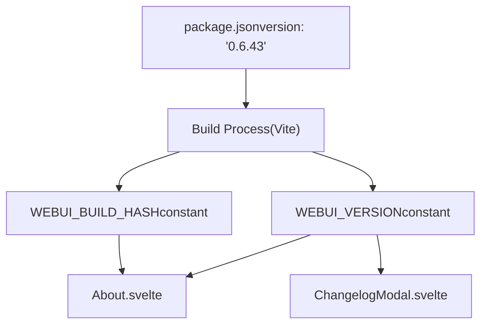
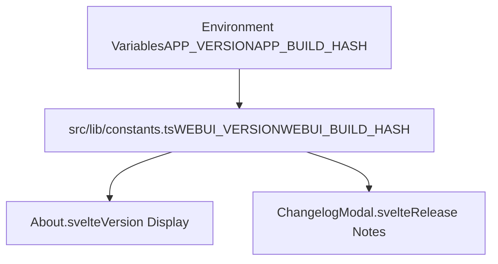
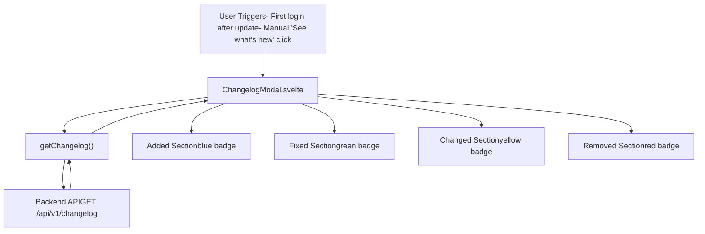
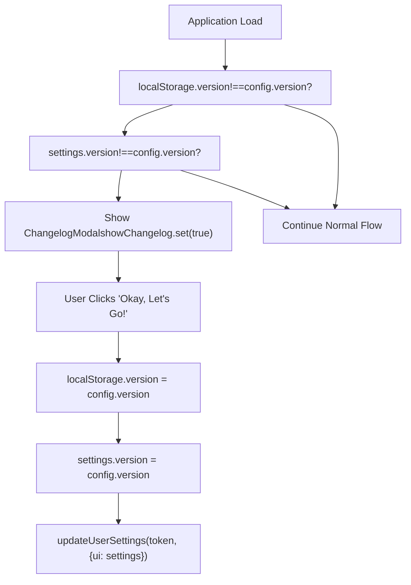
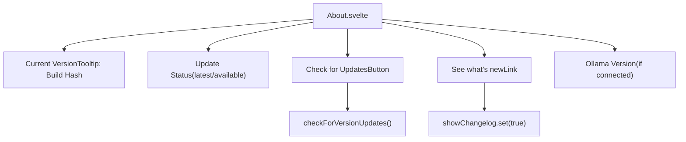

# Changelog and Versioning

Relevant source files

-   [CHANGELOG.md](https://github.com/open-webui/open-webui/blob/a7271532/CHANGELOG.md)
-   [LICENSE](https://github.com/open-webui/open-webui/blob/a7271532/LICENSE)
-   [README.md](https://github.com/open-webui/open-webui/blob/a7271532/README.md)
-   [TROUBLESHOOTING.md](https://github.com/open-webui/open-webui/blob/a7271532/TROUBLESHOOTING.md)
-   [docs/apache.md](https://github.com/open-webui/open-webui/blob/a7271532/docs/apache.md)
-   [package-lock.json](https://github.com/open-webui/open-webui/blob/a7271532/package-lock.json)
-   [package.json](https://github.com/open-webui/open-webui/blob/a7271532/package.json)
-   [src/app.css](https://github.com/open-webui/open-webui/blob/a7271532/src/app.css)
-   [src/lib/components/ChangelogModal.svelte](https://github.com/open-webui/open-webui/blob/a7271532/src/lib/components/ChangelogModal.svelte)
-   [src/lib/components/chat/Settings/About.svelte](https://github.com/open-webui/open-webui/blob/a7271532/src/lib/components/chat/Settings/About.svelte)
-   [src/lib/components/common/RichTextInput.svelte](https://github.com/open-webui/open-webui/blob/a7271532/src/lib/components/common/RichTextInput.svelte)
-   [src/lib/components/icons/XMark.svelte](https://github.com/open-webui/open-webui/blob/a7271532/src/lib/components/icons/XMark.svelte)
-   [src/lib/constants.ts](https://github.com/open-webui/open-webui/blob/a7271532/src/lib/constants.ts)

## Purpose and Scope

This document describes Open WebUI's versioning system, changelog management, and version update checking mechanisms. It covers the semantic versioning scheme, the structure and maintenance of the CHANGELOG.md file, version constant definitions, the version checking API, and the user-facing changelog display system.

For information about building and releasing versions, see [Build System](/open-webui/open-webui/18.3-build-system). For general configuration management, see [Configuration Management](/open-webui/open-webui/11-configuration-management).

---

## Semantic Versioning Scheme

Open WebUI adheres to [Semantic Versioning 2.0.0](https://semver.org/spec/v2.0.0.html) for version numbering. Versions follow the format `MAJOR.MINOR.PATCH` (e.g., `0.6.43`):

-   **MAJOR**: Incremented for incompatible API changes or significant architectural modifications
-   **MINOR**: Incremented for new features added in a backwards-compatible manner
-   **PATCH**: Incremented for backwards-compatible bug fixes

The current version is defined in [package.json3](https://github.com/open-webui/open-webui/blob/a7271532/package.json#L3-L3) and exported as a constant throughout the application. The versioning scheme is explicitly documented in [CHANGELOG.md5-6](https://github.com/open-webui/open-webui/blob/a7271532/CHANGELOG.md#L5-L6) which references both the Keep a Changelog format and Semantic Versioning specification.

### Version Number Storage


**Sources:** [package.json3](https://github.com/open-webui/open-webui/blob/a7271532/package.json#L3-L3) [src/lib/constants.ts16-17](https://github.com/open-webui/open-webui/blob/a7271532/src/lib/constants.ts#L16-L17) [src/lib/components/chat/Settings/About.svelte4](https://github.com/open-webui/open-webui/blob/a7271532/src/lib/components/chat/Settings/About.svelte#L4-L4)

---

## CHANGELOG.md Structure

The changelog follows the [Keep a Changelog](https://keepachangelog.com/en/1.1.0/) format, organizing changes by version and category. Each version entry includes:

-   **Version header**: `## [VERSION] - YYYY-MM-DD` format
-   **Category sections**: Added, Fixed, Changed, Removed
-   **Change entries**: Detailed descriptions with commit links and issue references

### Changelog Format Example

```
## [0.6.43] - 2025-12-22

### Added
- 📚 Knowledge base file management was overhauled with server-side pagination...

### Fixed
- ⚡ External reranker operations were optimized...

### Changed
- ⚠️ This release includes database schema changes...
```
Each change entry follows a consistent format:

1.  **Emoji prefix**: Categorizes the type of change visually
2.  **Description**: Clear, concise explanation of what changed
3.  **Technical details**: Implementation notes for developers
4.  **Links**: Commit hashes, issue numbers, and pull request references

**Sources:** [CHANGELOG.md1-6](https://github.com/open-webui/open-webui/blob/a7271532/CHANGELOG.md#L1-L6) [CHANGELOG.md8-120](https://github.com/open-webui/open-webui/blob/a7271532/CHANGELOG.md#L8-L120)

---

## Version Constants and Build Information

Open WebUI exposes version information through two primary constants defined in the constants module:

### Version Constants

```
export const WEBUI_VERSION = APP_VERSION;
export const WEBUI_BUILD_HASH = APP_BUILD_HASH;
```
These constants are:

-   **`WEBUI_VERSION`**: The semantic version string from package.json (e.g., `"0.6.43"`)
-   **`WEBUI_BUILD_HASH`**: A git commit hash or build identifier injected at build time

The `APP_VERSION` and `APP_BUILD_HASH` variables are injected during the build process as environment variables, making the version information available throughout the application without requiring direct package.json imports.

### Version Constant Usage Pattern


**Sources:** [src/lib/constants.ts16-17](https://github.com/open-webui/open-webui/blob/a7271532/src/lib/constants.ts#L16-L17) [src/lib/components/chat/Settings/About.svelte4](https://github.com/open-webui/open-webui/blob/a7271532/src/lib/components/chat/Settings/About.svelte#L4-L4) [src/lib/components/ChangelogModal.svelte9](https://github.com/open-webui/open-webui/blob/a7271532/src/lib/components/ChangelogModal.svelte#L9-L9)

---

## Version Checking Mechanism

Open WebUI includes an optional version update checking system that compares the current version against the latest available version from the backend API.

### Version Check Flow

> **[Mermaid sequence]**
> *(图表结构无法解析)*

### Version Comparison Logic

The `compareVersion()` utility function determines if an update is available by comparing two semantic version strings. It returns:

-   `true` if the first version is greater than the second (update available)
-   `false` if versions are equal or first is older

The version check is controlled by the `config.features.enable_version_update_check` flag and executed in the About component's `onMount` lifecycle:

```
if ($config?.features?.enable_version_update_check) {
    checkForVersionUpdates();
}
```
When an update is detected, the UI displays a link to the GitHub release page with the text `"(v{latest} available!)"`.

**Sources:** [src/lib/components/chat/Settings/About.svelte21-44](https://github.com/open-webui/open-webui/blob/a7271532/src/lib/components/chat/Settings/About.svelte#L21-L44) [src/lib/components/chat/Settings/About.svelte63-74](https://github.com/open-webui/open-webui/blob/a7271532/src/lib/components/chat/Settings/About.svelte#L63-L74)

---

## Changelog Display System

The changelog is rendered to users through a modal component that fetches and displays formatted release notes from the backend API.

### Changelog Modal Architecture


### Changelog Data Structure

The backend API returns a structured JSON object where each version is a key containing:

```
{
  "0.6.43": {
    "date": "2025-12-22",
    "added": [
      { "raw": "<p>📚 Knowledge base file management...</p>" }
    ],
    "fixed": [
      { "raw": "<p>⚡ External reranker operations...</p>" }
    ],
    "changed": [...],
    "removed": [...]
  }
}
```
Each entry's `raw` property contains pre-rendered HTML (sanitized with DOMPurify) that is directly displayed in the modal.

### Changelog Modal Component Structure

The ChangelogModal component [src/lib/components/ChangelogModal.svelte](https://github.com/open-webui/open-webui/blob/a7271532/src/lib/components/ChangelogModal.svelte) implements:

1.  **Initialization**: Fetches changelog data when modal opens ([src/lib/components/ChangelogModal.svelte22-28](https://github.com/open-webui/open-webui/blob/a7271532/src/lib/components/ChangelogModal.svelte#L22-L28))
2.  **Version Display**: Shows `WEBUI_VERSION` in the header ([src/lib/components/ChangelogModal.svelte56](https://github.com/open-webui/open-webui/blob/a7271532/src/lib/components/ChangelogModal.svelte#L56-L56))
3.  **Category Rendering**: Iterates through versions and sections with color-coded badges ([src/lib/components/ChangelogModal.svelte73-87](https://github.com/open-webui/open-webui/blob/a7271532/src/lib/components/ChangelogModal.svelte#L73-L87))
4.  **HTML Sanitization**: Uses DOMPurify to safely render changelog HTML ([src/lib/components/ChangelogModal.svelte92](https://github.com/open-webui/open-webui/blob/a7271532/src/lib/components/ChangelogModal.svelte#L92-L92))
5.  **Version Persistence**: Updates localStorage and user settings when dismissed ([src/lib/components/ChangelogModal.svelte106-109](https://github.com/open-webui/open-webui/blob/a7271532/src/lib/components/ChangelogModal.svelte#L106-L109))

**Sources:** [src/lib/components/ChangelogModal.svelte1-118](https://github.com/open-webui/open-webui/blob/a7271532/src/lib/components/ChangelogModal.svelte#L1-L118) [src/lib/components/chat/Settings/About.svelte78-84](https://github.com/open-webui/open-webui/blob/a7271532/src/lib/components/chat/Settings/About.svelte#L78-L84)

---

## Version Update Notification Flow

Open WebUI automatically displays the changelog modal to users after a version update. This behavior is controlled by comparing stored version numbers.

### Automatic Changelog Display Logic


### Version Storage Locations

The application tracks version information in three locations:

1.  **`config.version`**: Current application version from backend configuration
2.  **`localStorage.version`**: Last seen version stored in browser
3.  **`settings.version`**: User settings persisted to backend database

When the user dismisses the changelog modal, all three are synchronized:

```
localStorage.version = $config.version;
await settings.set({ ...$settings, ...{ version: $config.version } });
await updateUserSettings(localStorage.token, { ui: $settings });
```
This three-way synchronization ensures:

-   The modal doesn't reappear on page refresh
-   The user's "seen version" persists across devices
-   The notification triggers once per version update

**Sources:** [src/lib/components/ChangelogModal.svelte42-44](https://github.com/open-webui/open-webui/blob/a7271532/src/lib/components/ChangelogModal.svelte#L42-L44) [src/lib/components/ChangelogModal.svelte106-109](https://github.com/open-webui/open-webui/blob/a7271532/src/lib/components/ChangelogModal.svelte#L106-L109)

---

## Manual Changelog Access

Users can manually view the changelog at any time through the Settings interface:

### Access Path

1.  Navigate to **Settings** (gear icon)
2.  Select **About** tab
3.  Click **"See what's new"** link

The "See what's new" button is implemented as a simple action that sets the `showChangelog` store to `true`:

```
<button on:click={() => { showChangelog.set(true); }}>
    <div>{$i18n.t("See what's new")}</div>
</button>
```
This provides instant access to all version release notes without requiring users to trigger a version mismatch condition.

**Sources:** [src/lib/components/chat/Settings/About.svelte77-84](https://github.com/open-webui/open-webui/blob/a7271532/src/lib/components/chat/Settings/About.svelte#L77-L84)

---

## Version Information Display

The About component provides comprehensive version information to users:

### Displayed Information

| Field | Source | Description |
| --- | --- | --- |
| **Version Number** | `WEBUI_VERSION` | Semantic version (e.g., "0.6.43") |
| **Build Hash** | `WEBUI_BUILD_HASH` | Git commit hash (tooltip on hover) |
| **Update Status** | `compareVersion()` result | "(vX.X.X available!)" or "(latest)" |
| **Ollama Version** | `getOllamaVersion()` API | Connected Ollama server version |

### Version Display Component Structure


The version tooltip is implemented using a Tooltip component that reveals the build hash on hover:

```
<Tooltip content={WEBUI_BUILD_HASH}>
    v{WEBUI_VERSION}
</Tooltip>
```
This allows technical users to identify the exact build while keeping the interface clean for general users.

**Sources:** [src/lib/components/chat/Settings/About.svelte47-98](https://github.com/open-webui/open-webui/blob/a7271532/src/lib/components/chat/Settings/About.svelte#L47-L98) [src/lib/components/common/Tooltip.svelte](https://github.com/open-webui/open-webui/blob/a7271532/src/lib/components/common/Tooltip.svelte)
