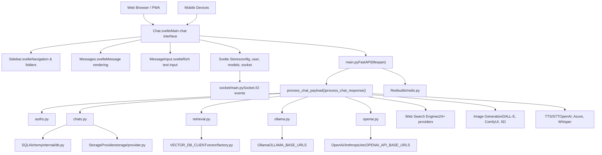
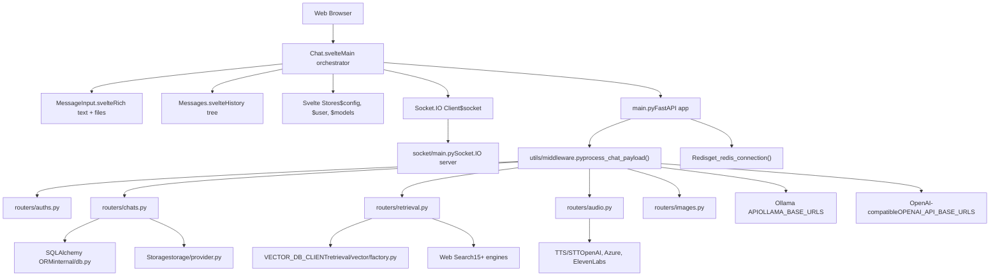
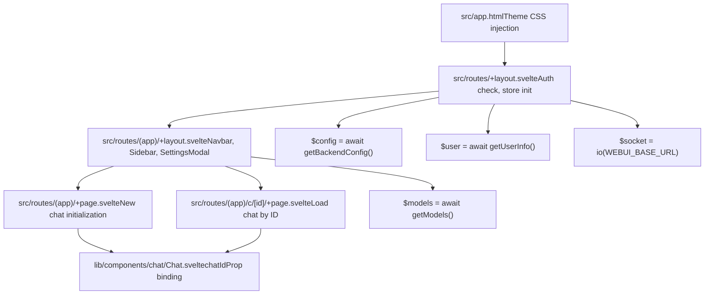
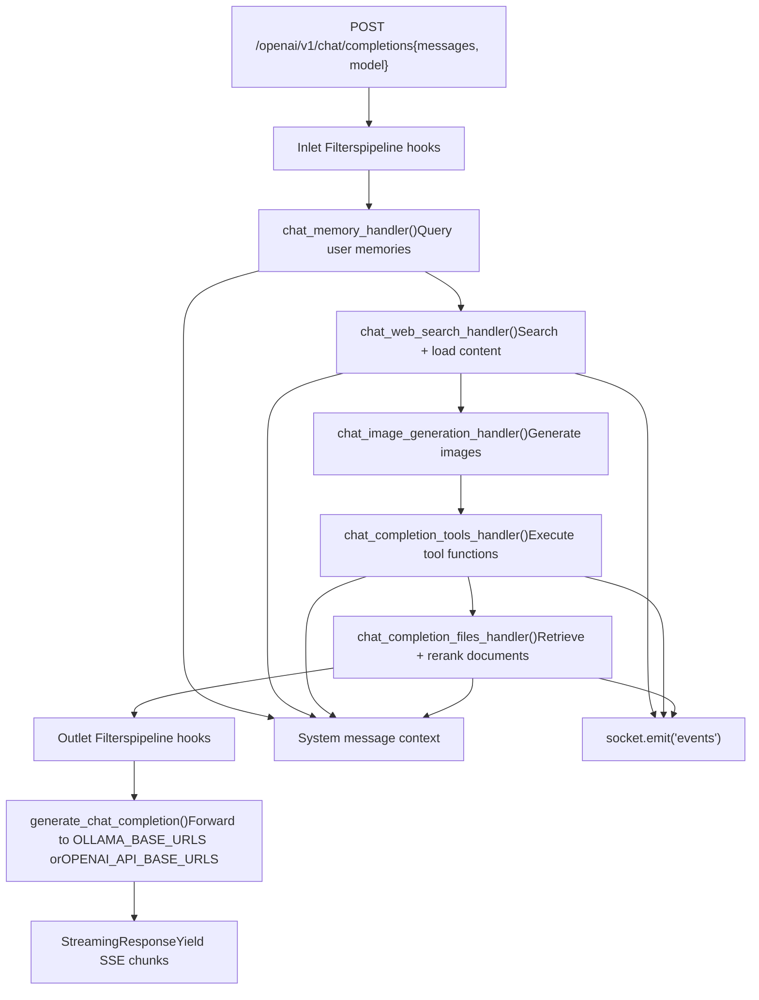
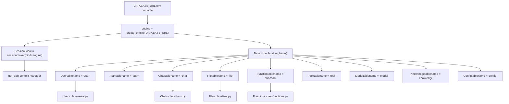
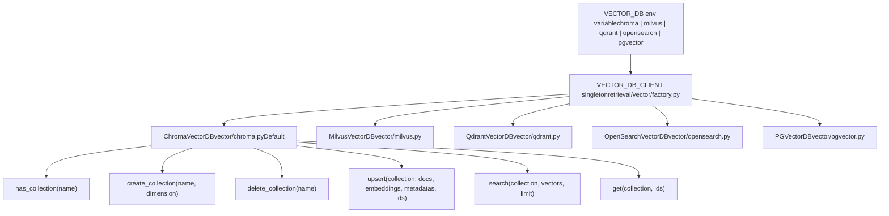
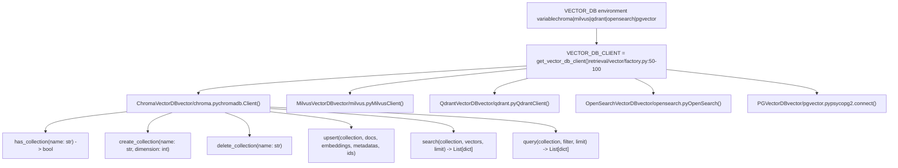
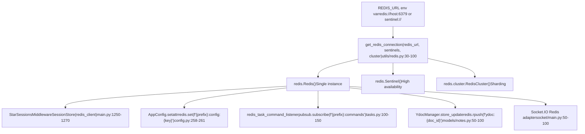
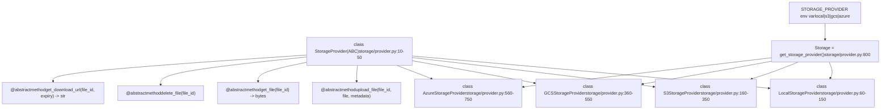
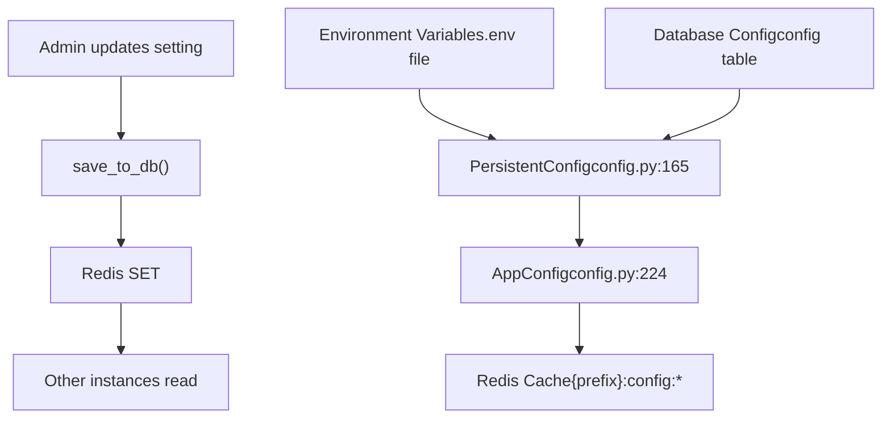

# Architecture Overview

Relevant source files

-   [.github/workflows/integration-test.disabled](https://github.com/open-webui/open-webui/blob/a7271532/.github/workflows/integration-test.disabled)
-   [backend/open\_webui/config.py](https://github.com/open-webui/open-webui/blob/a7271532/backend/open_webui/config.py)
-   [backend/open\_webui/main.py](https://github.com/open-webui/open-webui/blob/a7271532/backend/open_webui/main.py)
-   [backend/open\_webui/retrieval/loaders/datalab\_marker.py](https://github.com/open-webui/open-webui/blob/a7271532/backend/open_webui/retrieval/loaders/datalab_marker.py)
-   [backend/open\_webui/retrieval/loaders/external\_document.py](https://github.com/open-webui/open-webui/blob/a7271532/backend/open_webui/retrieval/loaders/external_document.py)
-   [backend/open\_webui/retrieval/loaders/external\_web.py](https://github.com/open-webui/open-webui/blob/a7271532/backend/open_webui/retrieval/loaders/external_web.py)
-   [backend/open\_webui/retrieval/loaders/main.py](https://github.com/open-webui/open-webui/blob/a7271532/backend/open_webui/retrieval/loaders/main.py)
-   [backend/open\_webui/retrieval/loaders/mineru.py](https://github.com/open-webui/open-webui/blob/a7271532/backend/open_webui/retrieval/loaders/mineru.py)
-   [backend/open\_webui/retrieval/loaders/mistral.py](https://github.com/open-webui/open-webui/blob/a7271532/backend/open_webui/retrieval/loaders/mistral.py)
-   [backend/open\_webui/retrieval/utils.py](https://github.com/open-webui/open-webui/blob/a7271532/backend/open_webui/retrieval/utils.py)
-   [backend/open\_webui/routers/retrieval.py](https://github.com/open-webui/open-webui/blob/a7271532/backend/open_webui/routers/retrieval.py)
-   [backend/open\_webui/storage/provider.py](https://github.com/open-webui/open-webui/blob/a7271532/backend/open_webui/storage/provider.py)
-   [backend/open\_webui/test/apps/webui/storage/test\_provider.py](https://github.com/open-webui/open-webui/blob/a7271532/backend/open_webui/test/apps/webui/storage/test_provider.py)
-   [backend/open\_webui/utils/middleware.py](https://github.com/open-webui/open-webui/blob/a7271532/backend/open_webui/utils/middleware.py)
-   [backend/requirements-min.txt](https://github.com/open-webui/open-webui/blob/a7271532/backend/requirements-min.txt)
-   [backend/requirements.txt](https://github.com/open-webui/open-webui/blob/a7271532/backend/requirements.txt)
-   [docker-compose.playwright.yaml](https://github.com/open-webui/open-webui/blob/a7271532/docker-compose.playwright.yaml)
-   [pyproject.toml](https://github.com/open-webui/open-webui/blob/a7271532/pyproject.toml)
-   [src/lib/apis/retrieval/index.ts](https://github.com/open-webui/open-webui/blob/a7271532/src/lib/apis/retrieval/index.ts)
-   [src/lib/components/admin/Settings/Documents.svelte](https://github.com/open-webui/open-webui/blob/a7271532/src/lib/components/admin/Settings/Documents.svelte)
-   [src/lib/components/admin/Settings/WebSearch.svelte](https://github.com/open-webui/open-webui/blob/a7271532/src/lib/components/admin/Settings/WebSearch.svelte)
-   [src/lib/components/channel/MessageInput.svelte](https://github.com/open-webui/open-webui/blob/a7271532/src/lib/components/channel/MessageInput.svelte)
-   [src/lib/components/chat/Chat.svelte](https://github.com/open-webui/open-webui/blob/a7271532/src/lib/components/chat/Chat.svelte)
-   [src/lib/components/chat/ChatPlaceholder.svelte](https://github.com/open-webui/open-webui/blob/a7271532/src/lib/components/chat/ChatPlaceholder.svelte)
-   [src/lib/components/chat/MessageInput.svelte](https://github.com/open-webui/open-webui/blob/a7271532/src/lib/components/chat/MessageInput.svelte)
-   [src/lib/components/chat/Placeholder.svelte](https://github.com/open-webui/open-webui/blob/a7271532/src/lib/components/chat/Placeholder.svelte)
-   [src/lib/components/chat/Suggestions.svelte](https://github.com/open-webui/open-webui/blob/a7271532/src/lib/components/chat/Suggestions.svelte)
-   [src/lib/components/common/FileItem.svelte](https://github.com/open-webui/open-webui/blob/a7271532/src/lib/components/common/FileItem.svelte)
-   [src/lib/components/common/FileItemModal.svelte](https://github.com/open-webui/open-webui/blob/a7271532/src/lib/components/common/FileItemModal.svelte)
-   [uv.lock](https://github.com/open-webui/open-webui/blob/a7271532/uv.lock)

This document provides a high-level architectural overview of Open WebUI's three-tier system: the SvelteKit frontend, FastAPI backend, and data/storage layers. It describes the major components, their responsibilities, and how they interact.

For detailed information about specific subsystems, see:

-   [System Components and Data Flow](https://github.com/open-webui/open-webui/blob/a7271532/System Components and Data Flow)
-   [Frontend Architecture](https://github.com/open-webui/open-webui/blob/a7271532/Frontend Architecture)
-   [Backend Architecture](https://github.com/open-webui/open-webui/blob/a7271532/Backend Architecture)
-   [Data and Storage Layer](https://github.com/open-webui/open-webui/blob/a7271532/Data and Storage Layer)

---

## System Overview

Open WebUI implements a three-tier web architecture separating presentation, application logic, and data persistence:

### Overall System Architecture

<old\_str>

### Application Initialization Sequence

**Sources:** [backend/open\_webui/main.py570-630](https://github.com/open-webui/open-webui/blob/a7271532/backend/open_webui/main.py#L570-L630) [backend/open\_webui/main.py633-650](https://github.com/open-webui/open-webui/blob/a7271532/backend/open_webui/main.py#L633-L650) [backend/open\_webui/main.py1200-1300](https://github.com/open-webui/open-webui/blob/a7271532/backend/open_webui/main.py#L1200-L1300)

**Critical initialization steps:**

-   **Lines 570-585**: `lifespan()` context manager handles startup/shutdown
-   **Line 579**: `install_tool_and_function_dependencies()` synchronously installs Python dependencies for custom tools/functions before serving requests
-   **Lines 586-593**: `get_redis_connection()` establishes Redis connection (if configured) for distributed session storage and config sync
-   **Lines 595-598**: `redis_task_command_listener()` subscribes to Redis pub/sub channel for cross-instance task cancellation
-   **Lines 650-655**: `AppConfig` class wraps `PersistentConfig` values, enabling database-backed configuration with Redis cache
-   **Lines 1200-1300**: Middleware stack processes requests bottom-to-top: Security → CORS → Session → Audit → Compression </old\_str> <new\_str>


**Sources:** [backend/open\_webui/main.py1-650](https://github.com/open-webui/open-webui/blob/a7271532/backend/open_webui/main.py#L1-L650) [src/lib/components/chat/Chat.svelte1-100](https://github.com/open-webui/open-webui/blob/a7271532/src/lib/components/chat/Chat.svelte#L1-L100) [backend/open\_webui/utils/middleware.py1-600](https://github.com/open-webui/open-webui/blob/a7271532/backend/open_webui/utils/middleware.py#L1-L600) [backend/open\_webui/socket/main.py1-100](https://github.com/open-webui/open-webui/blob/a7271532/backend/open_webui/socket/main.py#L1-L100)

**Key architectural characteristics:**

-   **Component-based frontend**: SvelteKit application with reactive stores (`$config`, `$user`, `$models`, `$socket`) driving UI updates across components
-   **Middleware pipeline**: `process_chat_payload()` and `process_chat_response()` in [backend/open\_webui/utils/middleware.py](https://github.com/open-webui/open-webui/blob/a7271532/backend/open_webui/utils/middleware.py) chain handlers for RAG, tools, web search, and memory augmentation
-   **Pluggable storage**: Factory pattern (`VECTOR_DB_CLIENT`) and abstract `StorageProvider` enable swapping database and storage implementations without code changes
-   **Proxy architecture**: Backend acts as intelligent reverse proxy, augmenting requests to Ollama/OpenAI with additional context and capabilities
-   **Real-time streaming**: Socket.IO in [backend/open\_webui/socket/main.py](https://github.com/open-webui/open-webui/blob/a7271532/backend/open_webui/socket/main.py) provides bidirectional event streaming for chat completions and status updates


**Sources:** [backend/open\_webui/main.py1-650](https://github.com/open-webui/open-webui/blob/a7271532/backend/open_webui/main.py#L1-L650) [src/lib/components/chat/Chat.svelte1-100](https://github.com/open-webui/open-webui/blob/a7271532/src/lib/components/chat/Chat.svelte#L1-L100) [backend/open\_webui/utils/middleware.py1-1500](https://github.com/open-webui/open-webui/blob/a7271532/backend/open_webui/utils/middleware.py#L1-L1500) [backend/open\_webui/socket/main.py1-400](https://github.com/open-webui/open-webui/blob/a7271532/backend/open_webui/socket/main.py#L1-L400)

The architecture emphasizes:

-   **Component-based frontend**: `Chat.svelte` orchestrates child components and communicates via reactive stores
-   **Middleware-driven backend**: `process_chat_payload()` function chains handlers for RAG, tools, web search, and memory
-   **Pluggable data layer**: Factory pattern (`VECTOR_DB_CLIENT`) and abstract interfaces (`StorageProvider`) enable swapping implementations
-   **Multi-service integration**: Backend proxies and augments requests to 40+ external AI services
-   **Real-time communication**: Socket.IO (`socket/main.py`) provides bidirectional streaming for chat completions and events

---

## Frontend Layer (SvelteKit)

The frontend is a SvelteKit single-page application that provides the user interface for chat interactions, model management, and configuration.

### SvelteKit Layout Hierarchy


**Sources:** [src/routes/+layout.svelte1-100](https://github.com/open-webui/open-webui/blob/a7271532/src/routes/+layout.svelte#L1-L100) [src/routes/(app)/+layout.svelte1-200](https://github.com/open-webui/open-webui/blob/a7271532/src/routes/(app)/+layout.svelte#L1-L200) [src/routes/(app)/+page.svelte1-50](https://github.com/open-webui/open-webui/blob/a7271532/src/routes/(app)/+page.svelte#L1-L50) src/routes/(app)/c/\[id\]/+page.svelte:1-50

Key initialization points:

-   `src/app.html`: Injects theme CSS variables before render to prevent FOUC (Flash of Unstyled Content)
-   `src/routes/+layout.svelte`: Calls `getBackendConfig()`, `getUserInfo()`, and initializes `io()` Socket.IO client
-   `src/routes/(app)/+layout.svelte`: Loads `getModels()`, renders `Navbar.svelte`, `Sidebar.svelte`, `SettingsModal.svelte`
-   `src/routes/(app)/+page.svelte` and `src/routes/(app)/c/[id]/+page.svelte`: Both render `Chat.svelte` with different `chatIdProp` values

### State Management

State is managed through Svelte stores defined in `$lib/stores`:

| Store | Purpose | Scope |
| --- | --- | --- |
| `$config` | Application configuration from backend | Global |
| `$user` | Current user object and permissions | Global |
| `$models` | Available LLM models | Global |
| `$chats` | Chat history list | Global |
| `$settings` | User UI preferences | Global |
| `$socket` | Socket.IO client instance | Global |
| `$temporaryChatEnabled` | Privacy mode state | Global |

Stores provide reactive data flow: when store values change, all subscribing components automatically re-render.

**Sources:** [src/lib/components/chat/Chat.svelte16-43](https://github.com/open-webui/open-webui/blob/a7271532/src/lib/components/chat/Chat.svelte#L16-L43)

### Build Output

The frontend build process (via Vite) produces static assets that are served by the FastAPI backend:

```
build/
├── index.html          # SPA entry point
├── _app/
│   ├── immutable/      # Hashed assets (JS, CSS)
│   └── version.json    # Build version
└── [other routes]      # Pre-rendered pages
```
The backend serves these via `SPAStaticFiles` which falls back to `index.html` for client-side routing.

**Sources:** [backend/open\_webui/main.py512-524](https://github.com/open-webui/open-webui/blob/a7271532/backend/open_webui/main.py#L512-L524)

---

## Backend Layer (FastAPI)

The backend is a FastAPI application that handles API requests, orchestrates chat completions, manages authentication, and interfaces with external services.

### Request Processing Pipeline

The backend middleware in [backend/open\_webui/utils/middleware.py](https://github.com/open-webui/open-webui/blob/a7271532/backend/open_webui/utils/middleware.py) implements a sequential augmentation pipeline that enhances chat requests before forwarding to LLM backends:


**Sources:** [backend/open\_webui/utils/middleware.py1-600](https://github.com/open-webui/open-webui/blob/a7271532/backend/open_webui/utils/middleware.py#L1-L600)

**Middleware handler responsibilities:**

| Handler | Location | Input | Output | Purpose |
| --- | --- | --- | --- | --- |
| `process_pipeline_inlet_filter()` | middleware.py:54-56 | `form_data` | Modified `form_data` | Apply custom pipeline transformations |
| `chat_memory_handler()` | middleware.py:516-552 | Last user message | System message with memory context | Query memories from vector store |
| `chat_web_search_handler()` | middleware.py:555-720 | Last user message | System message with search results | Generate queries, search web, load pages |
| `chat_image_generation_handler()` | middleware.py:723-817 | Last user message | Add image files to message | Generate images based on text prompt |
| `chat_completion_tools_handler()` | middleware.py:286-513 | Messages + tool specs | Tool results as context | Execute tools via function calling |
| `chat_completion_files_handler()` | middleware.py:820-1045 | Uploaded files | RAG context | Load docs, embed, search, rerank |
| `process_pipeline_outlet_filter()` | middleware.py:54-56 | LLM response | Modified response | Post-process LLM output |

Each handler:

1.  Receives `form_data` dict with `messages`, `model`, `stream` keys
2.  Conditionally executes based on configuration (e.g., `ENABLE_WEB_SEARCH`)
3.  Modifies `form_data` in-place (typically adding to system message)
4.  Accumulates citations in `extra_params["sources"]` for UI display
5.  Emits status updates via `__event_emitter__` Socket.IO callback

### Router Organization and Endpoints

The backend API is organized into routers under `backend/open_webui/routers/`:

| Router File | Prefix | Key Endpoints | Purpose |
| --- | --- | --- | --- |
| `auths.py` | `/api/auths` | `POST /signin`, `POST /signup`, `POST /signout` | Authentication, OAuth flows, API key management |
| `chats.py` | `/api/chats` | `GET /`, `POST /new`, `GET /{id}`, `POST /{id}`, `DELETE /{id}` | Chat CRUD operations |
| `users.py` | `/api/users` | `GET /`, `POST /update/profile`, `POST /update/password` | User management |
| `models.py` | `/api/models` | `GET /`, `POST /add`, `DELETE /{id}` | Model registry operations |
| `retrieval.py` | `/api/retrieval` | `POST /process/web`, `POST /process/youtube`, `GET /config`, `POST /config/update` | RAG configuration, web/document processing |
| `audio.py` | `/api/audio` | `POST /transcriptions`, `POST /speech` | Speech-to-text (STT) and text-to-speech (TTS) |
| `images.py` | `/api/images` | `POST /generations`, `POST /edits` | Image generation and editing |
| `tools.py` | `/api/tools` | `GET /`, `POST /create`, `POST /{id}/update` | Tool definitions and execution |
| `functions.py` | `/api/functions` | `GET /`, `POST /create`, `POST /{id}/update` | User-defined Python functions |
| `ollama.py` | `/ollama` | `POST /api/chat`, `POST /api/generate`, `GET /api/tags` | Reverse proxy to Ollama API |
| `openai.py` | `/openai` | `POST /v1/chat/completions`, `POST /v1/completions` | OpenAI-compatible endpoint |
| `pipelines.py` | `/api/pipelines` | `GET /`, `POST /upload`, `POST /{id}/valves/update` | External pipeline filters |

**Sources:** [backend/open\_webui/main.py1400-1550](https://github.com/open-webui/open-webui/blob/a7271532/backend/open_webui/main.py#L1400-L1550) [backend/open\_webui/routers/auths.py1-100](https://github.com/open-webui/open-webui/blob/a7271532/backend/open_webui/routers/auths.py#L1-L100) [backend/open\_webui/routers/chats.py1-100](https://github.com/open-webui/open-webui/blob/a7271532/backend/open_webui/routers/chats.py#L1-L100) [backend/open\_webui/routers/retrieval.py1-100](https://github.com/open-webui/open-webui/blob/a7271532/backend/open_webui/routers/retrieval.py#L1-L100)

Router registration pattern in [backend/open\_webui/main.py1400-1550](https://github.com/open-webui/open-webui/blob/a7271532/backend/open_webui/main.py#L1400-L1550):

```
app.include_router(auths.router, prefix="/api/auths", tags=["auths"])
app.include_router(chats.router, prefix="/api/chats", tags=["chats"])
app.include_router(retrieval.router, prefix="/api/retrieval", tags=["retrieval"])
# ... additional routers
```
The `/ollama` and `/openai` endpoints act as **reverse proxies** that intercept requests, apply middleware transformations (RAG, tools, memory), then forward to configured backend URLs (`OLLAMA_BASE_URLS`, `OPENAI_API_BASE_URLS`).

### Database Layer

Open WebUI uses SQLAlchemy ORM for relational data storage with support for SQLite (default), PostgreSQL, and MySQL:


**Sources:** [backend/open\_webui/internal/db.py1-60](https://github.com/open-webui/open-webui/blob/a7271532/backend/open_webui/internal/db.py#L1-L60) [backend/open\_webui/models/users.py1-50](https://github.com/open-webui/open-webui/blob/a7271532/backend/open_webui/models/users.py#L1-L50) [backend/open\_webui/models/chats.py1-50](https://github.com/open-webui/open-webui/blob/a7271532/backend/open_webui/models/chats.py#L1-L50)

**Key database components:**

-   **`internal/db.py`**: Defines `engine`, `Base`, `SessionLocal`, and `get_db()` context manager
-   **Table models**: SQLAlchemy declarative classes (e.g., `User`, `Chat`, `File`) map to database tables
-   **Business logic classes**: Wrapper classes (e.g., `Users`, `Chats`, `Files`) provide static methods for CRUD operations
-   **Migration system**: Alembic migrations in `migrations/versions/` directory, auto-run via `run_migrations()` in [backend/open\_webui/config.py53-68](https://github.com/open-webui/open-webui/blob/a7271532/backend/open_webui/config.py#L53-L68)

**Typical usage pattern:**

```
from open_webui.models.users import Users
from open_webui.internal.db import get_db

# Business logic wrapper (recommended)
user = Users.get_user_by_id(user_id)

# Direct ORM access
with get_db() as db:
    user = db.query(User).filter_by(id=user_id).first()
```
**Primary tables:**

| Table | Model Class | Purpose |
| --- | --- | --- |
| `user` | `Users` | User accounts, roles (`admin`/`user`/`pending`), permissions |
| `auth` | `Auths` | Password hashes, API keys (`sk-*` format) |
| `chat` | `Chats` | Chat metadata, message history tree, folder assignment |
| `file` | `Files` | Uploaded file metadata, references to storage |
| `function` | `Functions` | User-defined Python functions (admin-created) |
| `tool` | `Tools` | Tool definitions with OpenAPI specs |
| `model` | `Models` | LLM model configurations, metadata, filters |
| `knowledge` | `Knowledges` | Knowledge base metadata for RAG |
| `config` | N/A (direct access) | Persistent app configuration (database-backed) |

**Sources:** [backend/open\_webui/models/users.py](https://github.com/open-webui/open-webui/blob/a7271532/backend/open_webui/models/users.py) [backend/open\_webui/models/chats.py](https://github.com/open-webui/open-webui/blob/a7271532/backend/open_webui/models/chats.py) [backend/open\_webui/models/files.py](https://github.com/open-webui/open-webui/blob/a7271532/backend/open_webui/models/files.py)

### Authentication and Authorization Flow

> **[Mermaid sequence]**
> *(图表结构无法解析)*

**Sources:** [backend/open\_webui/routers/auths.py1-400](https://github.com/open-webui/open-webui/blob/a7271532/backend/open_webui/routers/auths.py#L1-L400) [backend/open\_webui/models/users.py1-200](https://github.com/open-webui/open-webui/blob/a7271532/backend/open_webui/models/users.py#L1-L200) [backend/open\_webui/models/auths.py1-200](https://github.com/open-webui/open-webui/blob/a7271532/backend/open_webui/models/auths.py#L1-L200) [backend/open\_webui/utils/auth.py1-300](https://github.com/open-webui/open-webui/blob/a7271532/backend/open_webui/utils/auth.py#L1-L300)

Authentication methods and code locations:

| Method | Router Endpoint | Implementation | Token Creation |
| --- | --- | --- | --- |
| **Local** | `POST /api/auths/signin` | `Users.authenticate_user()` → `Auths.authenticate_user()` | `create_token()` in [backend/open\_webui/utils/auth.py120-150](https://github.com/open-webui/open-webui/blob/a7271532/backend/open_webui/utils/auth.py#L120-L150) |
| **LDAP** | `POST /api/auths/signin` | `ldap3.Connection()` verify → `Users.insert_new_user()` | Same JWT creation |
| **OAuth/OIDC** | `GET /api/auths/oauth/{provider}/callback` | `OAuthManager.authorize_access_token()` | Same JWT creation |
| **Trusted Header** | Any endpoint | `WEBUI_AUTH_TRUSTED_EMAIL_HEADER` env check | Automatic user lookup/creation |
| **API Key** | Any endpoint | `Auths.get_user_by_api_key()` | No token; key validated per-request |

Authorization dependency chain:

1.  FastAPI endpoint parameter: `user: UserModel = Depends(get_verified_user)`
2.  `get_verified_user()` in [backend/open\_webui/utils/auth.py180-220](https://github.com/open-webui/open-webui/blob/a7271532/backend/open_webui/utils/auth.py#L180-L220) calls `decode_token()`
3.  `decode_token()` in [backend/open\_webui/utils/auth.py150-180](https://github.com/open-webui/open-webui/blob/a7271532/backend/open_webui/utils/auth.py#L150-L180) validates JWT signature and expiry
4.  Returns `UserModel` with `role` field (`"admin"`, `"user"`, `"pending"`)
5.  Route can check `user.role` or use `get_admin_user()` dependency for admin-only endpoints

---

## Data Layer

The data layer provides persistence for users, chats, files, configuration, and vector embeddings.

### Vector Database Abstraction

The RAG system supports multiple vector database backends through a factory pattern:


**Sources:** [backend/open\_webui/retrieval/vector/factory.py1-100](https://github.com/open-webui/open-webui/blob/a7271532/backend/open_webui/retrieval/vector/factory.py#L1-L100)

**Vector database selection:**

The `VECTOR_DB_CLIENT` global singleton is initialized based on the `VECTOR_DB` environment variable. All implementations expose a common interface:

```
# Factory usage
from open_webui.retrieval.vector.factory import VECTOR_DB_CLIENT

# Create collection for file
VECTOR_DB_CLIENT.create_collection(
    collection_name=f"file_{file_id}",
    dimension=384  # Embedding model dimension
)

# Insert embeddings
VECTOR_DB_CLIENT.upsert(
    collection_name=f"file_{file_id}",
    documents=chunks,
    embeddings=embedding_vectors,
    metadatas=[{"file_id": file_id, "chunk": i} for i in range(len(chunks))],
    ids=[f"{file_id}_{i}" for i in range(len(chunks))]
)

# Search for similar chunks
result = VECTOR_DB_CLIENT.search(
    collection_name=f"file_{file_id}",
    vectors=[query_embedding],
    limit=5
)
```
**Supported vector databases:**

| Database | Configuration Env Vars | Use Case |
| --- | --- | --- |
| ChromaDB (default) | `CHROMA_DATA_PATH`, `CHROMA_TENANT`, `CHROMA_DATABASE` | Development, single-instance |
| Milvus | `MILVUS_URI` | Production, high scalability |
| Qdrant | `QDRANT_URI`, `QDRANT_API_KEY` | Production, cloud-native |
| OpenSearch | `OPENSEARCH_URI`, `OPENSEARCH_SSL` | Enterprise, AWS integration |
| PGVector | `DATABASE_URL` (PostgreSQL with pgvector) | PostgreSQL users |

**Sources:** [backend/open\_webui/retrieval/vector/chroma.py](https://github.com/open-webui/open-webui/blob/a7271532/backend/open_webui/retrieval/vector/chroma.py) [backend/open\_webui/retrieval/vector/milvus.py](https://github.com/open-webui/open-webui/blob/a7271532/backend/open_webui/retrieval/vector/milvus.py) [backend/open\_webui/retrieval/vector/qdrant.py](https://github.com/open-webui/open-webui/blob/a7271532/backend/open_webui/retrieval/vector/qdrant.py)

### Vector Database Factory Pattern

Open WebUI supports multiple vector stores via a factory pattern in [backend/open\_webui/retrieval/vector/factory.py1-100](https://github.com/open-webui/open-webui/blob/a7271532/backend/open_webui/retrieval/vector/factory.py#L1-L100):


**Sources:** [backend/open\_webui/retrieval/vector/factory.py1-100](https://github.com/open-webui/open-webui/blob/a7271532/backend/open_webui/retrieval/vector/factory.py#L1-L100) [backend/open\_webui/retrieval/vector/chroma.py1-200](https://github.com/open-webui/open-webui/blob/a7271532/backend/open_webui/retrieval/vector/chroma.py#L1-L200) [backend/open\_webui/retrieval/vector/milvus.py1-200](https://github.com/open-webui/open-webui/blob/a7271532/backend/open_webui/retrieval/vector/milvus.py#L1-L200)

Factory instantiation logic in [backend/open\_webui/retrieval/vector/factory.py50-100](https://github.com/open-webui/open-webui/blob/a7271532/backend/open_webui/retrieval/vector/factory.py#L50-L100):

```
def get_vector_db_client():
    if VECTOR_DB == "milvus":
        return MilvusVectorDB()
    elif VECTOR_DB == "qdrant":
        return QdrantVectorDB()
    elif VECTOR_DB == "opensearch":
        return OpenSearchVectorDB()
    elif VECTOR_DB == "pgvector":
        return PGVectorDB()
    else:  # Default to ChromaDB
        return ChromaVectorDB()
```
Each implementation class wraps the underlying vector database client and provides:

-   **Collection management**: Create/delete collections (one per file or knowledge base)
-   **Document ingestion**: `upsert()` stores embeddings with metadata (file ID, chunk index, etc.)
-   **Similarity search**: `search()` returns top-k nearest neighbors by cosine similarity
-   **Hybrid search**: Some implementations combine vector search with BM25 keyword search

The global `VECTOR_DB_CLIENT` singleton is initialized in [backend/open\_webui/retrieval/vector/factory.py100](https://github.com/open-webui/open-webui/blob/a7271532/backend/open_webui/retrieval/vector/factory.py#L100-L100) and used throughout the codebase via `from open_webui.retrieval.vector.factory import VECTOR_DB_CLIENT`.

### Redis for Distributed Architecture

Redis provides optional features for multi-instance deployments:


**Sources:** [backend/open\_webui/utils/redis.py30-100](https://github.com/open-webui/open-webui/blob/a7271532/backend/open_webui/utils/redis.py#L30-L100) [backend/open\_webui/main.py581-588](https://github.com/open-webui/open-webui/blob/a7271532/backend/open_webui/main.py#L581-L588) [backend/open\_webui/config.py258-261](https://github.com/open-webui/open-webui/blob/a7271532/backend/open_webui/config.py#L258-L261) [backend/open\_webui/tasks.py100-150](https://github.com/open-webui/open-webui/blob/a7271532/backend/open_webui/tasks.py#L100-L150)

Redis initialization in [backend/open\_webui/main.py581-588](https://github.com/open-webui/open-webui/blob/a7271532/backend/open_webui/main.py#L581-L588):

```
app.state.redis = get_redis_connection(
    redis_url=REDIS_URL,
    redis_sentinels=get_sentinels_from_env(REDIS_SENTINEL_HOSTS, REDIS_SENTINEL_PORT),
    redis_cluster=REDIS_CLUSTER,
    async_mode=True,
)
```
Key patterns:

| Feature | Redis Key Pattern | Purpose | Code Location |
| --- | --- | --- | --- |
| **Sessions** | `{prefix}:session:{session_id}` | Store session data across instances | [backend/open\_webui/main.py1250-1270](https://github.com/open-webui/open-webui/blob/a7271532/backend/open_webui/main.py#L1250-L1270) |
| **Config Sync** | `{prefix}:config:{key}` | Broadcast configuration changes | [backend/open\_webui/config.py258-261](https://github.com/open-webui/open-webui/blob/a7271532/backend/open_webui/config.py#L258-L261) |
| **Task Queue** | `{prefix}:commands` (pub/sub channel) | Cancel tasks across instances | [backend/open\_webui/tasks.py100-150](https://github.com/open-webui/open-webui/blob/a7271532/backend/open_webui/tasks.py#L100-L150) |
| **Yjs CRDT** | `ydoc:{doc_id}` (list) | Store collaborative document updates | [backend/open\_webui/models/notes.py50-100](https://github.com/open-webui/open-webui/blob/a7271532/backend/open_webui/models/notes.py#L50-L100) |
| **Socket.IO** | Managed by Socket.IO Redis adapter | Broadcast WebSocket events | [backend/open\_webui/socket/main.py50-100](https://github.com/open-webui/open-webui/blob/a7271532/backend/open_webui/socket/main.py#L50-L100) |

When `REDIS_URL` is not set, the application operates in single-instance mode with in-memory session storage and no cross-instance synchronization.

### Storage Provider Abstraction

File storage uses an abstract interface with multiple implementations:


**Sources:** [backend/open\_webui/storage/provider.py1-800](https://github.com/open-webui/open-webui/blob/a7271532/backend/open_webui/storage/provider.py#L1-L800)

Storage provider selection in [backend/open\_webui/storage/provider.py780-800](https://github.com/open-webui/open-webui/blob/a7271532/backend/open_webui/storage/provider.py#L780-L800):

```
def get_storage_provider() -> StorageProvider:
    provider = os.getenv("STORAGE_PROVIDER", "local").lower()
    if provider == "s3":
        return S3StorageProvider()
    elif provider == "gcs":
        return GCSStorageProvider()
    elif provider == "azure":
        return AzureStorageProvider()
    else:
        return LocalStorageProvider()
```
Implementation details:

| Provider | Configuration | Remote Storage | Local Cache | Pre-signed URLs |
| --- | --- | --- | --- | --- |
| **Local** | `UPLOAD_DIR` | N/A | Files stored at `{UPLOAD_DIR}/{file_id}` | Not supported |
| **S3** | `S3_BUCKET_NAME`, `S3_ACCESS_KEY_ID`, `S3_SECRET_ACCESS_KEY` | S3 bucket (AWS, MinIO, DigitalOcean) | Also saves to `{UPLOAD_DIR}/{file_id}` | `boto3.generate_presigned_url()` |
| **GCS** | `GCS_BUCKET_NAME`, `GOOGLE_APPLICATION_CREDENTIALS` | Google Cloud Storage bucket | Also saves to `{UPLOAD_DIR}/{file_id}` | `blob.generate_signed_url()` |
| **Azure** | `AZURE_STORAGE_ACCOUNT_NAME`, `AZURE_STORAGE_CONNECTION_STRING` | Azure Blob Storage container | Also saves to `{UPLOAD_DIR}/{file_id}` | `generate_blob_sas()` |

Cloud providers use a **dual-storage strategy**: files are uploaded to remote object storage for durability, then downloaded and cached locally for fast retrieval. This allows the application to serve files directly from disk while maintaining cloud backups.

---

## Communication Patterns

## Communication Patterns

### HTTP REST API

The frontend communicates with backend via HTTP REST endpoints:

**Sources:** [src/lib/apis/chats/index.ts1-200](https://github.com/open-webui/open-webui/blob/a7271532/src/lib/apis/chats/index.ts#L1-L200) [backend/open\_webui/routers/chats.py1-500](https://github.com/open-webui/open-webui/blob/a7271532/backend/open_webui/routers/chats.py#L1-L500)

All HTTP requests include `Authorization: Bearer {token}` header. The `get_verified_user()` dependency in [backend/open\_webui/utils/auth.py180-220](https://github.com/open-webui/open-webui/blob/a7271532/backend/open_webui/utils/auth.py#L180-L220) validates the JWT token and injects the `UserModel` into route handlers.

### WebSocket (Socket.IO) Communication

Real-time bidirectional events for streaming and notifications:

**Sources:** [backend/open\_webui/socket/main.py1-400](https://github.com/open-webui/open-webui/blob/a7271532/backend/open_webui/socket/main.py#L1-L400) [src/lib/components/chat/Chat.svelte543-648](https://github.com/open-webui/open-webui/blob/a7271532/src/lib/components/chat/Chat.svelte#L543-L648) [backend/open\_webui/utils/middleware.py1050-1400](https://github.com/open-webui/open-webui/blob/a7271532/backend/open_webui/utils/middleware.py#L1050-L1400)

Socket.IO event types emitted by backend:

| Event Type | Payload | Emitted By | Frontend Handler |
| --- | --- | --- | --- |
| `"events"` | `{type: "chat:message:delta", data: {content: "..."}}` | `process_chat_response()` | Appends to message content |
| `"events"` | `{type: "status", data: {action: "web_search", ...}}` | Middleware handlers | Displays status indicator |
| `"events"` | `{type: "source", data: {name: "...", document: "..."}}` | `chat_completion_files_handler()` | Adds citation |
| `"events"` | `{type: "chat:title", data: "..."}` | `generate_title()` | Updates chat title |
| `"events"` | `{type: "usage", data: {model: "...", tokens: ...}}` | `generate_chat_completion()` | Tracks usage |

Connection pool management in [backend/open\_webui/socket/main.py100-200](https://github.com/open-webui/open-webui/blob/a7271532/backend/open_webui/socket/main.py#L100-L200):

-   `SESSION_POOL`: `{socket_id: user_id}` - Maps connections to users
-   `USER_POOL`: `{user_id: [socket_ids]}` - Maps users to their connections (supports multiple tabs)
-   `USAGE_POOL`: `{socket_id: {model_id: timestamp}}` - Tracks active LLM usage per connection

When Redis is configured, these become `RedisDict` instances for cross-instance synchronization.

### Backend-to-LLM Proxy Pattern

The backend acts as an augmenting reverse proxy for LLM APIs:

**Sources:** [backend/open\_webui/routers/openai.py200-350](https://github.com/open-webui/open-webui/blob/a7271532/backend/open_webui/routers/openai.py#L200-L350) [backend/open\_webui/utils/middleware.py820-1045](https://github.com/open-webui/open-webui/blob/a7271532/backend/open_webui/utils/middleware.py#L820-L1045) [backend/open\_webui/retrieval/loaders/main.py100-300](https://github.com/open-webui/open-webui/blob/a7271532/backend/open_webui/retrieval/loaders/main.py#L100-L300) [backend/open\_webui/utils/chat.py50-200](https://github.com/open-webui/open-webui/blob/a7271532/backend/open_webui/utils/chat.py#L50-L200)

RAG pipeline steps in `chat_completion_files_handler()` [backend/open\_webui/utils/middleware.py820-1045](https://github.com/open-webui/open-webui/blob/a7271532/backend/open_webui/utils/middleware.py#L820-L1045):

1.  **Document loading** (lines 830-880):

    -   Calls `Loader(file_path, mime_type).load()` from [backend/open\_webui/retrieval/loaders/main.py100-300](https://github.com/open-webui/open-webui/blob/a7271532/backend/open_webui/retrieval/loaders/main.py#L100-L300)
    -   Supports Tika, Docling, MinerU, Marker, PyPDF, and default text extraction
    -   Returns `List[Document]` with `page_content` and `metadata`
2.  **Chunking** (lines 885-920):

    -   `RecursiveCharacterTextSplitter(chunk_size=CHUNK_SIZE, chunk_overlap=CHUNK_OVERLAP)`
    -   Or `TokenTextSplitter` with tiktoken encoding
    -   Preserves metadata (file ID, chunk index, page number)
3.  **Embedding generation** (lines 925-960):

    -   Calls `get_embedding_function()` from [backend/open\_webui/retrieval/utils.py100-200](https://github.com/open-webui/open-webui/blob/a7271532/backend/open_webui/retrieval/utils.py#L100-L200)
    -   Returns sentence-transformers model or OpenAI/Azure/Ollama client
    -   Generates embeddings in batches (RAG\_EMBEDDING\_BATCH\_SIZE)
4.  **Vector storage** (lines 965-990):

    -   `VECTOR_DB_CLIENT.upsert(collection_name, documents, embeddings, metadatas, ids)`
    -   Collection name format: `file_{file_id}` or `knowledge_{knowledge_id}`
5.  **Retrieval** (lines 995-1020):

    -   `query_collection()` or `query_collection_with_hybrid_search()` from [backend/open\_webui/retrieval/utils.py300-500](https://github.com/open-webui/open-webui/blob/a7271532/backend/open_webui/retrieval/utils.py#L300-L500)
    -   Hybrid search combines BM25 keyword search with vector similarity
    -   Applies reranking via cross-encoder if configured
6.  **Context injection** (lines 1025-1045):

    -   Formats retrieved passages using `RAG_TEMPLATE` (configurable via admin settings)
    -   Injects into system message via `add_or_update_system_message()`
    -   Adds citations to `extra_params["sources"]` for UI display

The modified request is then forwarded to the LLM backend via `generate_chat_completion()` in [backend/open\_webui/utils/chat.py50-200](https://github.com/open-webui/open-webui/blob/a7271532/backend/open_webui/utils/chat.py#L50-L200)

### Configuration Management

Configuration follows a three-tier hierarchy:


**Sources:** [backend/open\_webui/config.py88-223](https://github.com/open-webui/open-webui/blob/a7271532/backend/open_webui/config.py#L88-L223)

The `PersistentConfig` class in [backend/open\_webui/config.py165-222](https://github.com/open-webui/open-webui/blob/a7271532/backend/open_webui/config.py#L165-L222) wraps configuration values:

-   Reads from environment variable as default
-   Overrides with database value if present
-   Registers in global `PERSISTENT_CONFIG_REGISTRY` for updates

The `AppConfig` class in [backend/open\_webui/config.py224-284](https://github.com/open-webui/open-webui/blob/a7271532/backend/open_webui/config.py#L224-L284) provides:

-   Attribute-style access to configuration values
-   Automatic Redis caching via `__setattr__` and `__getattr__`
-   Cross-instance synchronization via Redis pub/sub

When a configuration value changes:

1.  Admin updates via API → saves to database
2.  `AppConfig.__setattr__` publishes to Redis key
3.  Other instances' `AppConfig.__getattr__` reads updated value
4.  Components using config values automatically see changes

**Sources:** [backend/open\_webui/config.py224-284](https://github.com/open-webui/open-webui/blob/a7271532/backend/open_webui/config.py#L224-L284)

---

## Summary

Open WebUI's architecture is designed for modularity, scalability, and extensibility:

-   **Three-tier separation**: Presentation (SvelteKit), Application (FastAPI), Data (SQL/Vector/Redis/Storage)
-   **Middleware pipeline**: Sequential handlers augment chat requests with memory, search, tools, and RAG
-   **Pluggable components**: Swap databases, vector stores, storage providers, and LLM backends
-   **Real-time communication**: Socket.IO enables streaming responses and collaborative features
-   **Distributed config**: Redis-backed AppConfig allows zero-downtime updates across instances

The architecture supports both simple single-instance deployments (SQLite + local storage) and complex production deployments (PostgreSQL + Redis + S3 + horizontal scaling).

**Sources:** [backend/open\_webui/main.py1-650](https://github.com/open-webui/open-webui/blob/a7271532/backend/open_webui/main.py#L1-L650) [backend/open\_webui/utils/middleware.py1050-1400](https://github.com/open-webui/open-webui/blob/a7271532/backend/open_webui/utils/middleware.py#L1050-L1400) [backend/open\_webui/config.py1-300](https://github.com/open-webui/open-webui/blob/a7271532/backend/open_webui/config.py#L1-L300) [src/lib/components/chat/Chat.svelte1-100](https://github.com/open-webui/open-webui/blob/a7271532/src/lib/components/chat/Chat.svelte#L1-L100)
