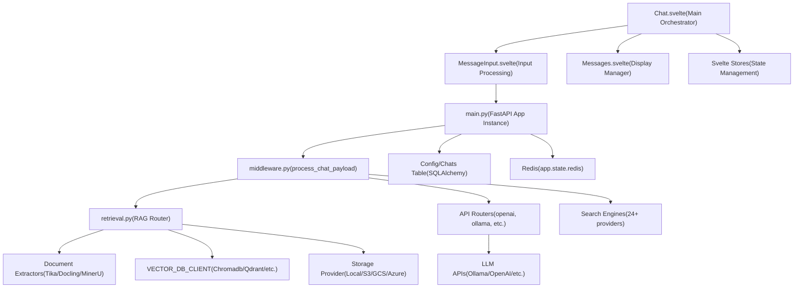
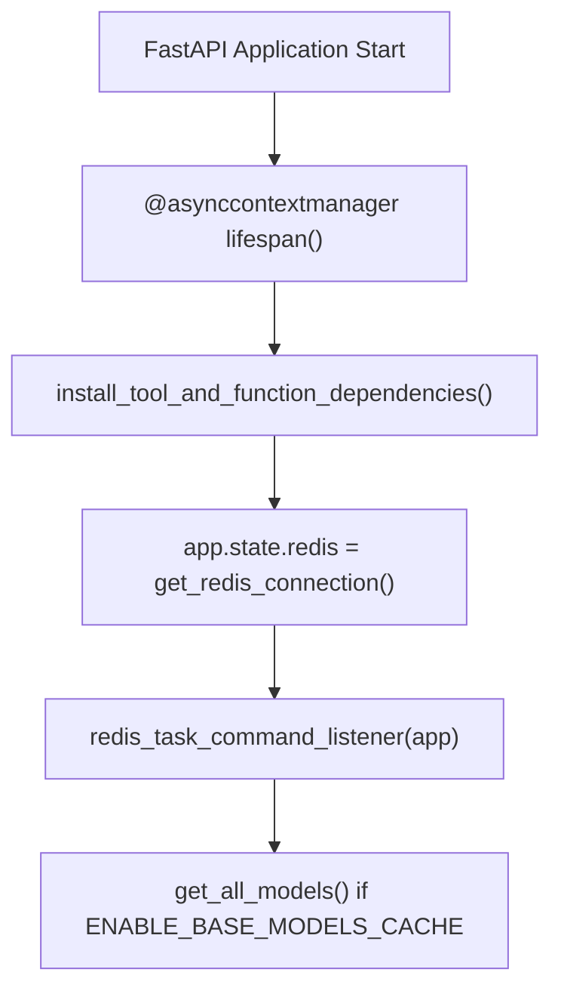
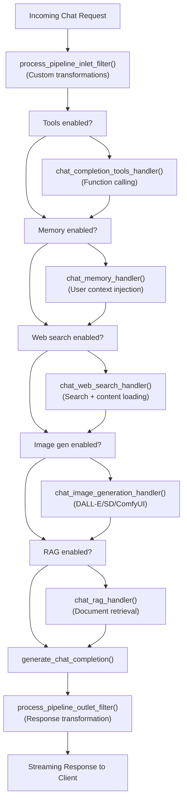
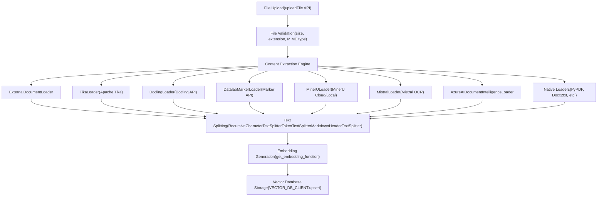
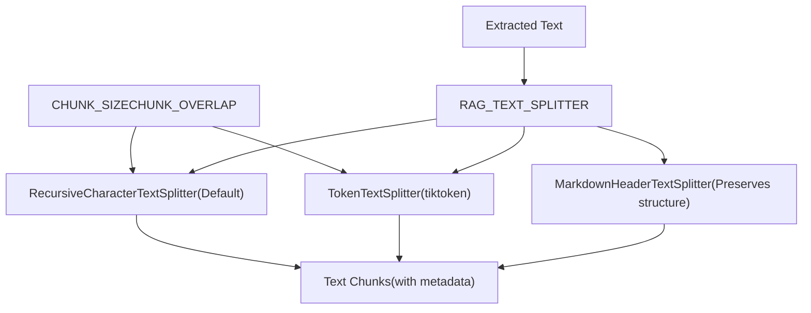
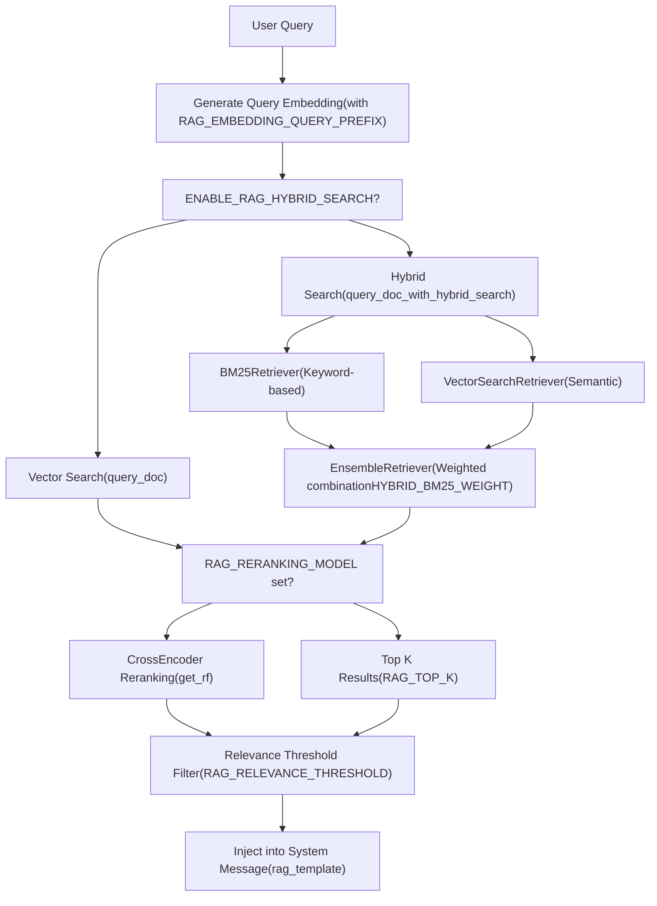
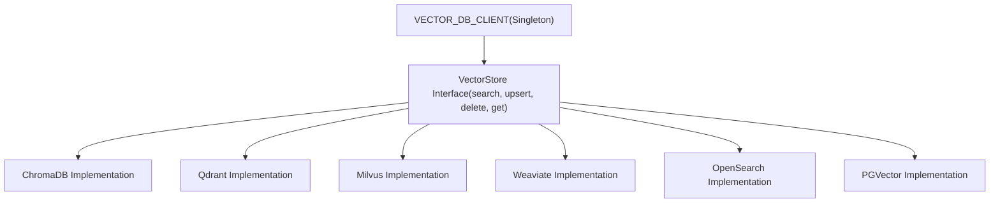
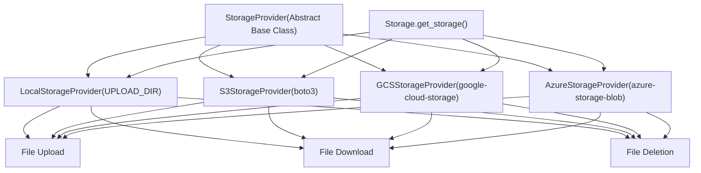

# System Components and Data Flow

Relevant source files

-   [backend/open\_webui/config.py](https://github.com/open-webui/open-webui/blob/a7271532/backend/open_webui/config.py)
-   [backend/open\_webui/main.py](https://github.com/open-webui/open-webui/blob/a7271532/backend/open_webui/main.py)
-   [backend/open\_webui/retrieval/loaders/datalab\_marker.py](https://github.com/open-webui/open-webui/blob/a7271532/backend/open_webui/retrieval/loaders/datalab_marker.py)
-   [backend/open\_webui/retrieval/loaders/external\_document.py](https://github.com/open-webui/open-webui/blob/a7271532/backend/open_webui/retrieval/loaders/external_document.py)
-   [backend/open\_webui/retrieval/loaders/external\_web.py](https://github.com/open-webui/open-webui/blob/a7271532/backend/open_webui/retrieval/loaders/external_web.py)
-   [backend/open\_webui/retrieval/loaders/main.py](https://github.com/open-webui/open-webui/blob/a7271532/backend/open_webui/retrieval/loaders/main.py)
-   [backend/open\_webui/retrieval/loaders/mineru.py](https://github.com/open-webui/open-webui/blob/a7271532/backend/open_webui/retrieval/loaders/mineru.py)
-   [backend/open\_webui/retrieval/loaders/mistral.py](https://github.com/open-webui/open-webui/blob/a7271532/backend/open_webui/retrieval/loaders/mistral.py)
-   [backend/open\_webui/retrieval/utils.py](https://github.com/open-webui/open-webui/blob/a7271532/backend/open_webui/retrieval/utils.py)
-   [backend/open\_webui/routers/retrieval.py](https://github.com/open-webui/open-webui/blob/a7271532/backend/open_webui/routers/retrieval.py)
-   [backend/open\_webui/utils/middleware.py](https://github.com/open-webui/open-webui/blob/a7271532/backend/open_webui/utils/middleware.py)
-   [src/lib/apis/retrieval/index.ts](https://github.com/open-webui/open-webui/blob/a7271532/src/lib/apis/retrieval/index.ts)
-   [src/lib/components/admin/Settings/Documents.svelte](https://github.com/open-webui/open-webui/blob/a7271532/src/lib/components/admin/Settings/Documents.svelte)
-   [src/lib/components/admin/Settings/WebSearch.svelte](https://github.com/open-webui/open-webui/blob/a7271532/src/lib/components/admin/Settings/WebSearch.svelte)
-   [src/lib/components/channel/MessageInput.svelte](https://github.com/open-webui/open-webui/blob/a7271532/src/lib/components/channel/MessageInput.svelte)
-   [src/lib/components/chat/Chat.svelte](https://github.com/open-webui/open-webui/blob/a7271532/src/lib/components/chat/Chat.svelte)
-   [src/lib/components/chat/ChatPlaceholder.svelte](https://github.com/open-webui/open-webui/blob/a7271532/src/lib/components/chat/ChatPlaceholder.svelte)
-   [src/lib/components/chat/MessageInput.svelte](https://github.com/open-webui/open-webui/blob/a7271532/src/lib/components/chat/MessageInput.svelte)
-   [src/lib/components/chat/Placeholder.svelte](https://github.com/open-webui/open-webui/blob/a7271532/src/lib/components/chat/Placeholder.svelte)
-   [src/lib/components/chat/Suggestions.svelte](https://github.com/open-webui/open-webui/blob/a7271532/src/lib/components/chat/Suggestions.svelte)
-   [src/lib/components/common/FileItem.svelte](https://github.com/open-webui/open-webui/blob/a7271532/src/lib/components/common/FileItem.svelte)
-   [src/lib/components/common/FileItemModal.svelte](https://github.com/open-webui/open-webui/blob/a7271532/src/lib/components/common/FileItemModal.svelte)

This page provides a detailed technical overview of Open WebUI's major system components and how data flows through the application. It covers the frontend-backend interaction, request processing pipeline, RAG document system, and storage architecture. For specific implementation details of the chat interface itself, see [Chat System](/open-webui/open-webui/4-chat-system). For authentication and security aspects of data flow, see [Authentication and Security](/open-webui/open-webui/10-authentication-and-security).

## Component Architecture Overview

Open WebUI consists of three primary layers that work together to process user requests and deliver AI-powered responses:

**Frontend Layer (SvelteKit)** The client application built with Svelte components that handles user interaction, rich text editing, and real-time message rendering. The primary entry point is `Chat.svelte`.

**Backend Layer (FastAPI)** A Python-based API server that orchestrates LLM interactions, applies middleware transformations, and manages system resources through `main.py`.

**Storage Layer (Multi-Database)** Persistent storage spanning relational databases (SQLite/PostgreSQL), vector databases for embeddings, Redis for caching/sessions, and file storage providers (local/S3/GCS/Azure).


Sources: [src/lib/components/chat/Chat.svelte](https://github.com/open-webui/open-webui/blob/a7271532/src/lib/components/chat/Chat.svelte) [backend/open\_webui/main.py](https://github.com/open-webui/open-webui/blob/a7271532/backend/open_webui/main.py) [backend/open\_webui/utils/middleware.py](https://github.com/open-webui/open-webui/blob/a7271532/backend/open_webui/utils/middleware.py) [backend/open\_webui/routers/retrieval.py](https://github.com/open-webui/open-webui/blob/a7271532/backend/open_webui/routers/retrieval.py)

## Frontend to Backend Data Flow

The data flow from user input to backend processing follows a structured path through Svelte components, event dispatchers, and API calls.

### User Input Processing

When a user submits a message, `Chat.svelte` coordinates the interaction:

> **[Mermaid sequence]**
> *(图表结构无法解析)*

The `submitPrompt` function in [Chat.svelte1639-1800](https://github.com/open-webui/open-webui/blob/a7271532/Chat.svelte#L1639-L1800) handles submission:

1.  Processes attached files through `chatFiles`
2.  Constructs message payload with `selectedModels`, `selectedToolIds`, `webSearchEnabled`, etc.
3.  Invokes `sendPromptOllama` or `sendPromptOpenAI` based on model type
4.  Registers WebSocket event handler via `chatEventHandler` for streaming responses

Variable substitution occurs in [MessageInput.svelte178-289](https://github.com/open-webui/open-webui/blob/a7271532/MessageInput.svelte#L178-L289) using `textVariableHandler`:

-   `{{CLIPBOARD}}` → clipboard content + image extraction
-   `{{USER_LOCATION}}` → geolocation via `getUserPosition()`
-   `{{CURRENT_DATE}}` → formatted date via `getFormattedDate()`
-   `{{USER_NAME}}`, `{{USER_BIO}}`, `{{USER_AGE}}` → session user data

Sources: [src/lib/components/chat/Chat.svelte1639-1800](https://github.com/open-webui/open-webui/blob/a7271532/src/lib/components/chat/Chat.svelte#L1639-L1800) [src/lib/components/chat/MessageInput.svelte178-289](https://github.com/open-webui/open-webui/blob/a7271532/src/lib/components/chat/MessageInput.svelte#L178-L289)

### Request Structure

The frontend constructs a standardized request payload:

| Field | Type | Description |
| --- | --- | --- |
| `model` | `string` | Selected model ID |
| `messages` | `array` | Chat history in OpenAI format |
| `stream` | `boolean` | Enable streaming responses |
| `files` | `array` | Uploaded file metadata |
| `metadata` | `object` | Contains `chat_id`, `session_id`, `filter_ids`, `tool_ids` |

Example payload structure:

```
{
  model: "gpt-4",
  messages: [{role: "user", content: "Hello"}],
  stream: true,
  metadata: {
    chat_id: "uuid",
    session_id: "socket-id",
    tool_ids: ["web_search"],
    filter_ids: []
  }
}
```
Sources: [src/lib/components/chat/Chat.svelte1639-1800](https://github.com/open-webui/open-webui/blob/a7271532/src/lib/components/chat/Chat.svelte#L1639-L1800)

## Backend Request Processing Pipeline

The backend implements a sophisticated middleware pipeline that augments requests before reaching LLM providers.

### Main Application Initialization

[main.py571-631](https://github.com/open-webui/open-webui/blob/a7271532/main.py#L571-L631) defines the application lifespan context manager:


Key initialization steps in `lifespan()`:

1.  **Line 583**: `install_tool_and_function_dependencies()` - Loads external tool/function modules
2.  **Line 586**: `app.state.redis = get_redis_connection()` - Establishes Redis connection for distributed state
3.  **Line 596**: `redis_task_command_listener(app)` - Starts background task for async operations
4.  **Line 607**: `get_all_models()` - Pre-caches model list if enabled

The application registers routers in [main.py70-96](https://github.com/open-webui/open-webui/blob/a7271532/main.py#L70-L96):

-   `openai` - OpenAI-compatible API proxy
-   `ollama` - Ollama API proxy
-   `retrieval` - RAG document processing
-   `chats`, `files`, `tools`, `users` - Core resource management
-   `auths` - Authentication endpoints

Sources: [backend/open\_webui/main.py571-631](https://github.com/open-webui/open-webui/blob/a7271532/backend/open_webui/main.py#L571-L631) [backend/open\_webui/main.py70-96](https://github.com/open-webui/open-webui/blob/a7271532/backend/open_webui/main.py#L70-L96)

### Middleware Processing Pipeline

The `process_chat_payload` function in [middleware.py571-1142](https://github.com/open-webui/open-webui/blob/a7271532/middleware.py#L571-L1142) orchestrates request augmentation:


**Pipeline Stages:**

1.  **Inlet Filters** [middleware.py651-672](https://github.com/open-webui/open-webui/blob/a7271532/middleware.py#L651-L672)

    -   Custom pipeline transformations via `process_pipeline_inlet_filter`
    -   Modifies `form_data` and `extra_params` before processing
2.  **Tool Execution** [middleware.py286-514](https://github.com/open-webui/open-webui/blob/a7271532/middleware.py#L286-L514)

    -   Function: `chat_completion_tools_handler`
    -   Extracts tool specifications from registered tools
    -   Uses task model to generate tool calls via `tools_function_calling_generation_template`
    -   Executes tools: direct (event-based), callable (Python functions), or MCP (external)
    -   Injects tool results as sources into message context
3.  **Memory Integration** [middleware.py516-552](https://github.com/open-webui/open-webui/blob/a7271532/middleware.py#L516-L552)

    -   Function: `chat_memory_handler`
    -   Queries memory system via `query_memory` with last user message
    -   Retrieves top 3 relevant memory entries
    -   Injects as "User Context" into system message
4.  **Web Search** [middleware.py555-676](https://github.com/open-webui/open-webui/blob/a7271532/middleware.py#L555-L676)

    -   Function: `chat_web_search_handler`
    -   Generates search queries via `generate_queries` task
    -   Executes searches through configured engine (24+ options)
    -   Loads web content via `get_web_loader` (Playwright/Firecrawl/Tavily)
    -   Embeds and indexes results if `BYPASS_WEB_SEARCH_EMBEDDING_AND_RETRIEVAL` is False
5.  **Image Generation** [middleware.py679-827](https://github.com/open-webui/open-webui/blob/a7271532/middleware.py#L679-L827)

    -   Function: `chat_image_generation_handler`
    -   Generates optimized image prompt via `generate_image_prompt`
    -   Calls image generation API (OpenAI/Automatic1111/ComfyUI/Gemini)
    -   Returns image URLs or base64-encoded data
6.  **RAG Processing** [middleware.py830-1017](https://github.com/open-webui/open-webui/blob/a7271532/middleware.py#L830-L1017)

    -   Function: `chat_rag_handler`
    -   Processes file uploads through document loaders
    -   Performs hybrid search (BM25 + vector) if enabled
    -   Applies reranking via CrossEncoder
    -   Injects retrieved context via `rag_template`
7.  **Outlet Filters** [middleware.py1099-1126](https://github.com/open-webui/open-webui/blob/a7271532/middleware.py#L1099-L1126)

    -   Custom response transformations via `process_pipeline_outlet_filter`
    -   Post-processes LLM output before streaming to client

Sources: [backend/open\_webui/utils/middleware.py571-1142](https://github.com/open-webui/open-webui/blob/a7271532/backend/open_webui/utils/middleware.py#L571-L1142) [backend/open\_webui/utils/middleware.py286-514](https://github.com/open-webui/open-webui/blob/a7271532/backend/open_webui/utils/middleware.py#L286-L514)

## RAG System Data Flow

The Retrieval-Augmented Generation system processes documents through multiple stages to enable semantic search.

### Document Ingestion Pipeline


**Content Extraction Engines:**

The `Loader` class in [retrieval/loaders/main.py184-343](https://github.com/open-webui/open-webui/blob/a7271532/retrieval/loaders/main.py#L184-L343) routes documents based on `CONTENT_EXTRACTION_ENGINE`:

1.  **Tika** [retrieval/loaders/main.py92-131](https://github.com/open-webui/open-webui/blob/a7271532/retrieval/loaders/main.py#L92-L131)

    -   Sends file to Tika server via PUT request
    -   Extracts text and metadata
    -   Supports `PDF_EXTRACT_IMAGES` for OCR
2.  **Docling** [retrieval/loaders/main.py134-182](https://github.com/open-webui/open-webui/blob/a7271532/retrieval/loaders/main.py#L134-L182)

    -   Posts file to Docling API `/v1/convert/file`
    -   Returns markdown content with configurable parameters
    -   Uses `DOCLING_PARAMS` for advanced configuration
3.  **Datalab Marker** [retrieval/loaders/datalab\_marker.py14-215](https://github.com/open-webui/open-webui/blob/a7271532/retrieval/loaders/datalab_marker.py#L14-L215)

    -   Submits to Datalab Marker API with polling
    -   Supports extensive configuration via `DATALAB_MARKER_ADDITIONAL_CONFIG`
    -   Options: `skip_cache`, `force_ocr`, `paginate`, `use_llm`
4.  **MinerU** [retrieval/loaders/mineru.py14-297](https://github.com/open-webui/open-webui/blob/a7271532/retrieval/loaders/mineru.py#L14-L297)

    -   Two modes: Cloud API (async task-based) and Local API (synchronous)
    -   Cloud: Creates job → polls status → downloads result
    -   Configurable via `MINERU_PARAMS` JSON
5.  **Mistral OCR** [retrieval/loaders/mistral.py18-383](https://github.com/open-webui/open-webui/blob/a7271532/retrieval/loaders/mistral.py#L18-L383)

    -   Posts file to Mistral OCR endpoint
    -   Intelligent retry with exponential backoff
    -   Memory-efficient streaming for large files
6.  **Azure Document Intelligence** [retrieval/loaders/main.py241-245](https://github.com/open-webui/open-webui/blob/a7271532/retrieval/loaders/main.py#L241-L245)

    -   Uses `AzureAIDocumentIntelligenceLoader` from LangChain
    -   Requires `DOCUMENT_INTELLIGENCE_ENDPOINT` and `DOCUMENT_INTELLIGENCE_KEY`
7.  **Native Loaders** [retrieval/loaders/main.py247-339](https://github.com/open-webui/open-webui/blob/a7271532/retrieval/loaders/main.py#L247-L339)

    -   File-type specific: PyPDFLoader, Docx2txtLoader, CSVLoader, etc.
    -   TextLoader for code files with `known_source_ext` list
    -   UnstructuredEPubLoader, UnstructuredExcelLoader, etc.

Sources: [backend/open\_webui/retrieval/loaders/main.py184-343](https://github.com/open-webui/open-webui/blob/a7271532/backend/open_webui/retrieval/loaders/main.py#L184-L343) [backend/open\_webui/retrieval/loaders/datalab\_marker.py14-215](https://github.com/open-webui/open-webui/blob/a7271532/backend/open_webui/retrieval/loaders/datalab_marker.py#L14-L215) [backend/open\_webui/retrieval/loaders/mineru.py14-297](https://github.com/open-webui/open-webui/blob/a7271532/backend/open_webui/retrieval/loaders/mineru.py#L14-L297) [backend/open\_webui/retrieval/loaders/mistral.py18-383](https://github.com/open-webui/open-webui/blob/a7271532/backend/open_webui/retrieval/loaders/mistral.py#L18-L383)

### Text Splitting and Chunking

After extraction, documents are split into chunks in [retrieval.py686-761](https://github.com/open-webui/open-webui/blob/a7271532/retrieval.py#L686-L761):


Configuration parameters in [config.py1080-1083](https://github.com/open-webui/open-webui/blob/a7271532/config.py#L1080-L1083):

-   `CHUNK_SIZE`: Default 1500 characters
-   `CHUNK_OVERLAP`: Default 100 characters
-   `RAG_TEXT_SPLITTER`: Choice of "default", "token", or "markdown\_header"

For token-based splitting, uses `tiktoken` with `TIKTOKEN_ENCODING_NAME` (default: "cl100k\_base").

Sources: [backend/open\_webui/routers/retrieval.py686-761](https://github.com/open-webui/open-webui/blob/a7271532/backend/open_webui/routers/retrieval.py#L686-L761) [backend/open\_webui/config.py1080-1083](https://github.com/open-webui/open-webui/blob/a7271532/backend/open_webui/config.py#L1080-L1083)

### Embedding and Vector Storage

Embedding function initialization in [retrieval.py126-146](https://github.com/open-webui/open-webui/blob/a7271532/retrieval.py#L126-L146):

-   `get_ef()` loads local SentenceTransformer model
-   `get_embedding_function()` wraps engine-specific implementation
-   Prefix support via `RAG_EMBEDDING_CONTENT_PREFIX` and `RAG_EMBEDDING_QUERY_PREFIX`

Vector database client initialized via `VECTOR_DB_CLIENT` singleton from [retrieval/vector/factory.py](https://github.com/open-webui/open-webui/blob/a7271532/retrieval/vector/factory.py)

Sources: [backend/open\_webui/routers/retrieval.py126-146](https://github.com/open-webui/open-webui/blob/a7271532/backend/open_webui/routers/retrieval.py#L126-L146) [backend/open\_webui/retrieval/vector/factory.py](https://github.com/open-webui/open-webui/blob/a7271532/backend/open_webui/retrieval/vector/factory.py)

### Query and Retrieval


Key retrieval functions in [retrieval/utils.py](https://github.com/open-webui/open-webui/blob/a7271532/retrieval/utils.py):

**Standard Vector Search** [retrieval/utils.py136-154](https://github.com/open-webui/open-webui/blob/a7271532/retrieval/utils.py#L136-L154)

```
def query_doc(collection_name: str, query_embedding: list[float], k: int, user: UserModel = None):
    result = VECTOR_DB_CLIENT.search(
        collection_name=collection_name,
        vectors=[query_embedding],
        limit=k,
    )
    return result
```
**Hybrid Search** [retrieval/utils.py208-338](https://github.com/open-webui/open-webui/blob/a7271532/retrieval/utils.py#L208-L338)

```
async def query_doc_with_hybrid_search(
    collection_name: str,
    collection_result: GetResult,
    query: str,
    embedding_function,
    k: int,
    reranking_function,
    k_reranker: int,
    r: float,
    hybrid_bm25_weight: float,
    enable_enriched_texts: bool = False,
):
    # Creates BM25Retriever for keyword search
    bm25_retriever = BM25Retriever.from_texts(...)

    # Creates VectorSearchRetriever for semantic search
    vector_search_retriever = VectorSearchRetriever(...)

    # Combines with EnsembleRetriever
    ensemble_retriever = EnsembleRetriever(
        retrievers=[bm25_retriever, vector_search_retriever],
        weights=[hybrid_bm25_weight, 1.0 - hybrid_bm25_weight]
    )

    # Applies reranking via ContextualCompressionRetriever
    compression_retriever = ContextualCompressionRetriever(
        base_compressor=compressor,
        base_retriever=ensemble_retriever
    )
```
**Enriched Text Features** [retrieval/utils.py170-205](https://github.com/open-webui/open-webui/blob/a7271532/retrieval/utils.py#L170-L205) When `ENABLE_RAG_HYBRID_SEARCH_ENRICHED_TEXTS` is enabled, `get_enriched_texts()` augments chunks with:

-   Filename tokens (repeated for BM25 weight boost)
-   Document titles
-   Section headings from markdown splitter
-   Source URLs/paths
-   Web search snippets

Sources: [backend/open\_webui/retrieval/utils.py136-154](https://github.com/open-webui/open-webui/blob/a7271532/backend/open_webui/retrieval/utils.py#L136-L154) [backend/open\_webui/retrieval/utils.py208-338](https://github.com/open-webui/open-webui/blob/a7271532/backend/open_webui/retrieval/utils.py#L208-L338) [backend/open\_webui/retrieval/utils.py170-205](https://github.com/open-webui/open-webui/blob/a7271532/backend/open_webui/retrieval/utils.py#L170-L205)

## Storage Layer Architecture

Open WebUI utilizes four distinct storage systems, each optimized for different data types.

### Relational Database (SQLite/PostgreSQL)

The primary database stores structured application data through SQLAlchemy ORM:

**Core Tables:**

-   `user` - User accounts and profiles
-   `chat` - Chat history and metadata
-   `file` - File metadata and references
-   `config` - Persistent configuration (see [Configuration Management](https://github.com/open-webui/open-webui/blob/a7271532/Configuration Management))
-   `oauth_sessions` - OAuth token storage
-   `folder` - Organizational structure
-   `knowledge` - Knowledge base entries
-   `tool`, `function`, `model` - Registry of extensions

Database initialization in [main.py571-631](https://github.com/open-webui/open-webui/blob/a7271532/main.py#L571-L631):

```
from open_webui.internal.db import Session, engine
```
Configuration storage via `Config` table in [config.py73-81](https://github.com/open-webui/open-webui/blob/a7271532/config.py#L73-L81):

```
class Config(Base):
    __tablename__ = "config"
    id = Column(Integer, primary_key=True)
    data = Column(JSON, nullable=False)
    version = Column(Integer, nullable=False, default=0)
    created_at = Column(DateTime, nullable=False, server_default=func.now())
    updated_at = Column(DateTime, nullable=True, onupdate=func.now())
```
Sources: [backend/open\_webui/main.py571-631](https://github.com/open-webui/open-webui/blob/a7271532/backend/open_webui/main.py#L571-L631) [backend/open\_webui/config.py73-81](https://github.com/open-webui/open-webui/blob/a7271532/backend/open_webui/config.py#L73-L81)

### Vector Database

Handles embedding storage and similarity search through the `VECTOR_DB_CLIENT` abstraction:


**Key Operations:**

-   `VECTOR_DB_CLIENT.search()` - Similarity search with vectors
-   `VECTOR_DB_CLIENT.upsert()` - Insert/update embeddings
-   `VECTOR_DB_CLIENT.delete()` - Remove collection
-   `VECTOR_DB_CLIENT.get()` - Retrieve all documents

Collections are per-file/knowledge-base with naming pattern: `collection_{file_id}` or `knowledge_{knowledge_id}`.

Sources: [backend/open\_webui/retrieval/vector/factory.py](https://github.com/open-webui/open-webui/blob/a7271532/backend/open_webui/retrieval/vector/factory.py)

### Redis Cache

Redis provides distributed caching and real-time features:

**Use Cases:**

1.  **Configuration Cache** [config.py257-283](https://github.com/open-webui/open-webui/blob/a7271532/config.py#L257-L283)

```
class AppConfig:
    def __getattr__(self, key):
        if self._redis:
            redis_key = f"{self._redis_key_prefix}:config:{key}"
            redis_value = self._redis.get(redis_key)
            if redis_value is not None:
                decoded_value = json.loads(redis_value)
                # Update in-memory value if different
```
2.  **Token Revocation** (via `REDIS_KEY_PREFIX:token_blacklist:{token}`)

3.  **WebSocket Distribution** for multi-instance deployments

4.  **Rate Limiting** state across instances

5.  **Session Storage** when using `ENABLE_STAR_SESSIONS_MIDDLEWARE`


Redis initialization in [main.py586-593](https://github.com/open-webui/open-webui/blob/a7271532/main.py#L586-L593):

```
app.state.redis = get_redis_connection(
    redis_url=REDIS_URL,
    redis_sentinels=get_sentinels_from_env(REDIS_SENTINEL_HOSTS, REDIS_SENTINEL_PORT),
    redis_cluster=REDIS_CLUSTER,
    async_mode=True,
)
```
Sources: [backend/open\_webui/config.py257-283](https://github.com/open-webui/open-webui/blob/a7271532/backend/open_webui/config.py#L257-L283) [backend/open\_webui/main.py586-593](https://github.com/open-webui/open-webui/blob/a7271532/backend/open_webui/main.py#L586-L593)

### File Storage

Polymorphic storage provider system supporting multiple backends:


**Provider Selection:** Configured via `STORAGE_PROVIDER` environment variable:

-   `local` (default) - Local filesystem at `UPLOAD_DIR`
-   `s3` - Amazon S3 (requires `S3_BUCKET_NAME`, `AWS_ACCESS_KEY_ID`, `AWS_SECRET_ACCESS_KEY`)
-   `gcs` - Google Cloud Storage (requires `GCS_BUCKET_NAME`, credentials)
-   `azure` - Azure Blob Storage (requires `AZURE_STORAGE_ACCOUNT_NAME`, `AZURE_STORAGE_KEY`)

File metadata stored in relational DB, actual file content in configured storage provider.

Sources: [backend/open\_webui/storage/provider.py](https://github.com/open-webui/open-webui/blob/a7271532/backend/open_webui/storage/provider.py)

## Configuration Management

Open WebUI implements a two-tier configuration system combining environment variables with persistent database storage.

### PersistentConfig System

The `PersistentConfig` class in [config.py165-222](https://github.com/open-webui/open-webui/blob/a7271532/config.py#L165-L222) provides database-backed configuration:

**Key Features:**

1.  **Environment Priority**: Values from environment variables take precedence on first run
2.  **Database Persistence**: Changes saved to `Config` table via `save_to_db()`
3.  **Redis Distribution**: Config changes propagate across instances via Redis pub/sub
4.  **Automatic Reload**: `PERSISTENT_CONFIG_REGISTRY` tracks all instances for batch updates

Example configuration definition in [config.py290-316](https://github.com/open-webui/open-webui/blob/a7271532/config.py#L290-L316):

```
ENABLE_API_KEYS = PersistentConfig(
    "ENABLE_API_KEYS",
    "auth.enable_api_keys",
    os.environ.get("ENABLE_API_KEYS", "False").lower() == "true",
)

JWT_EXPIRES_IN = PersistentConfig(
    "JWT_EXPIRES_IN",
    "auth.jwt_expiry",
    os.environ.get("JWT_EXPIRES_IN", "4w")
)
```
AppConfig usage in [config.py224-284](https://github.com/open-webui/open-webui/blob/a7271532/config.py#L224-L284):

```
class AppConfig:
    def __setattr__(self, key, value):
        self._state[key].value = value
        self._state[key].save()

        if self._redis:
            redis_key = f"{self._redis_key_prefix}:config:{key}"
            self._redis.set(redis_key, json.dumps(self._state[key].value))

    def __getattr__(self, key):
        if self._redis:
            redis_key = f"{self._redis_key_prefix}:config:{key}"
            redis_value = self._redis.get(redis_key)
            if redis_value is not None:
                decoded_value = json.loads(redis_value)
                if self._state[key].value != decoded_value:
                    self._state[key].value = decoded_value
        return self._state[key].value
```
Sources: [backend/open\_webui/config.py165-222](https://github.com/open-webui/open-webui/blob/a7271532/backend/open_webui/config.py#L165-L222) [backend/open\_webui/config.py290-316](https://github.com/open-webui/open-webui/blob/a7271532/backend/open_webui/config.py#L290-L316) [backend/open\_webui/config.py224-284](https://github.com/open-webui/open-webui/blob/a7271532/backend/open_webui/config.py#L224-L284)

### Application State Management

FastAPI's `app.state` object holds runtime configuration:

**Key State Variables:**

-   `app.state.config` - AppConfig instance with all PersistentConfig values
-   `app.state.redis` - Redis connection for distributed state
-   `app.state.BASE_MODELS` - Cached model list
-   `app.state.ef` - Embedding function instance
-   `app.state.EMBEDDING_FUNCTION` - Wrapper for embedding generation
-   `app.state.TOOLS` - Registered tool definitions
-   `app.state.FUNCTIONS` - Registered function modules

State initialization in [main.py649-828](https://github.com/open-webui/open-webui/blob/a7271532/main.py#L649-L828):

```
app.state.config = AppConfig(
    redis_url=REDIS_URL,
    redis_sentinels=get_sentinels_from_env(REDIS_SENTINEL_HOSTS, REDIS_SENTINEL_PORT),
    redis_cluster=REDIS_CLUSTER,
    redis_key_prefix=REDIS_KEY_PREFIX,
)

app.state.config.ENABLE_OLLAMA_API = ENABLE_OLLAMA_API
app.state.config.OLLAMA_BASE_URLS = OLLAMA_BASE_URLS
# ... hundreds of configuration assignments
```
Frontend configuration access via `/api/config` endpoint exposes selected values to client.

Sources: [backend/open\_webui/main.py649-828](https://github.com/open-webui/open-webui/blob/a7271532/backend/open_webui/main.py#L649-L828)

## WebSocket Event System

Real-time communication enables streaming responses and status updates through Socket.IO.

### Event Flow

> **[Mermaid sequence]**
> *(图表结构无法解析)*

Event handler in [Chat.svelte351-478](https://github.com/open-webui/open-webui/blob/a7271532/Chat.svelte#L351-L478):

```
const chatEventHandler = async (event, cb) => {
    if (event.chat_id === $chatId) {
        let message = history.messages[event.message_id];
        const type = event?.data?.type ?? null;
        const data = event?.data?.data ?? null;

        if (type === 'status') {
            message.statusHistory.push(data);
        } else if (type === 'chat:completion') {
            chatCompletionEventHandler(data, message, event.chat_id);
        } else if (type === 'chat:message:delta') {
            message.content += data.content;
        } else if (type === 'source') {
            message.sources.push(data);
        }
        // ... 15+ event types
    }
}
```
**Event Types:**

-   `status` - Status updates (web\_search, processing, etc.)
-   `chat:message:delta` - Streaming content chunks
-   `chat:message` - Full message replacement
-   `chat:message:files` - File attachments
-   `chat:message:embeds` - Embedded UI components
-   `chat:message:error` - Error messages
-   `chat:title` - Generated chat title
-   `source`/`citation` - Retrieved sources and code executions
-   `notification` - Toast notifications
-   `confirmation` - User confirmation prompts
-   `input` - User input requests

Sources: [src/lib/components/chat/Chat.svelte351-478](https://github.com/open-webui/open-webui/blob/a7271532/src/lib/components/chat/Chat.svelte#L351-L478) [backend/open\_webui/socket/main.py](https://github.com/open-webui/open-webui/blob/a7271532/backend/open_webui/socket/main.py)

## Summary

The Open WebUI architecture demonstrates a clear separation of concerns with well-defined data flow paths:

1.  **Frontend Layer** (`Chat.svelte`, `MessageInput.svelte`) - Handles user interaction, variable substitution, and real-time updates
2.  **Backend API** (`main.py`, `middleware.py`) - Orchestrates request processing through a sequential middleware pipeline
3.  **RAG System** (`retrieval.py`, document loaders) - Processes documents through extraction → splitting → embedding → vector storage
4.  **Storage Layer** - Multi-database architecture with specialized systems for different data types
5.  **Configuration** (`config.py`, `AppConfig`) - Two-tier system with environment variables and database persistence

Data flows from user input through frontend components, to backend middleware processing, potentially augmented with RAG/tools/web search, then to LLM APIs, with responses streaming back through WebSocket events for real-time rendering.
