# Frontend Architecture

Relevant source files

-   [CHANGELOG.md](https://github.com/open-webui/open-webui/blob/a7271532/CHANGELOG.md)
-   [package-lock.json](https://github.com/open-webui/open-webui/blob/a7271532/package-lock.json)
-   [package.json](https://github.com/open-webui/open-webui/blob/a7271532/package.json)
-   [src/app.css](https://github.com/open-webui/open-webui/blob/a7271532/src/app.css)
-   [src/lib/components/ChangelogModal.svelte](https://github.com/open-webui/open-webui/blob/a7271532/src/lib/components/ChangelogModal.svelte)
-   [src/lib/components/channel/MessageInput.svelte](https://github.com/open-webui/open-webui/blob/a7271532/src/lib/components/channel/MessageInput.svelte)
-   [src/lib/components/chat/Chat.svelte](https://github.com/open-webui/open-webui/blob/a7271532/src/lib/components/chat/Chat.svelte)
-   [src/lib/components/chat/ChatPlaceholder.svelte](https://github.com/open-webui/open-webui/blob/a7271532/src/lib/components/chat/ChatPlaceholder.svelte)
-   [src/lib/components/chat/MessageInput.svelte](https://github.com/open-webui/open-webui/blob/a7271532/src/lib/components/chat/MessageInput.svelte)
-   [src/lib/components/chat/Messages.svelte](https://github.com/open-webui/open-webui/blob/a7271532/src/lib/components/chat/Messages.svelte)
-   [src/lib/components/chat/Messages/ResponseMessage.svelte](https://github.com/open-webui/open-webui/blob/a7271532/src/lib/components/chat/Messages/ResponseMessage.svelte)
-   [src/lib/components/chat/Messages/UserMessage.svelte](https://github.com/open-webui/open-webui/blob/a7271532/src/lib/components/chat/Messages/UserMessage.svelte)
-   [src/lib/components/chat/Placeholder.svelte](https://github.com/open-webui/open-webui/blob/a7271532/src/lib/components/chat/Placeholder.svelte)
-   [src/lib/components/chat/Settings/Interface.svelte](https://github.com/open-webui/open-webui/blob/a7271532/src/lib/components/chat/Settings/Interface.svelte)
-   [src/lib/components/chat/SettingsModal.svelte](https://github.com/open-webui/open-webui/blob/a7271532/src/lib/components/chat/SettingsModal.svelte)
-   [src/lib/components/chat/Suggestions.svelte](https://github.com/open-webui/open-webui/blob/a7271532/src/lib/components/chat/Suggestions.svelte)
-   [src/lib/components/common/FileItem.svelte](https://github.com/open-webui/open-webui/blob/a7271532/src/lib/components/common/FileItem.svelte)
-   [src/lib/components/common/FileItemModal.svelte](https://github.com/open-webui/open-webui/blob/a7271532/src/lib/components/common/FileItemModal.svelte)
-   [src/lib/components/common/Modal.svelte](https://github.com/open-webui/open-webui/blob/a7271532/src/lib/components/common/Modal.svelte)
-   [src/lib/components/common/RichTextInput.svelte](https://github.com/open-webui/open-webui/blob/a7271532/src/lib/components/common/RichTextInput.svelte)
-   [src/lib/components/icons/XMark.svelte](https://github.com/open-webui/open-webui/blob/a7271532/src/lib/components/icons/XMark.svelte)
-   [src/lib/utils/index.ts](https://github.com/open-webui/open-webui/blob/a7271532/src/lib/utils/index.ts)
-   [src/routes/(app)/+layout.svelte](https://github.com/open-webui/open-webui/blob/a7271532/src/routes/(app)/+layout.svelte)/+layout.svelte)
-   [src/routes/(app)/+page.svelte](https://github.com/open-webui/open-webui/blob/a7271532/src/routes/(app)/+page.svelte)/+page.svelte)
-   [src/routes/(app)/c/\[id\]/+page.svelte](src/routes/(app)/c/%5Bid%5D/+page.svelte)

## Purpose and Scope

This document describes the frontend architecture of Open WebUI, which is built using SvelteKit. It covers the framework structure, component hierarchy, state management patterns, rich text editing system, and client-side rendering pipeline. For backend request processing and middleware, see [Backend Architecture](/open-webui/open-webui/2.3-backend-architecture). For real-time communication implementation details, see [Real-time Communication](/open-webui/open-webui/16-real-time-communication).

---

## SvelteKit Application Structure

Open WebUI uses SvelteKit as its frontend framework with Vite as the build tool. The application follows SvelteKit's file-based routing convention and supports both static and Node.js adapters.

### Framework Configuration

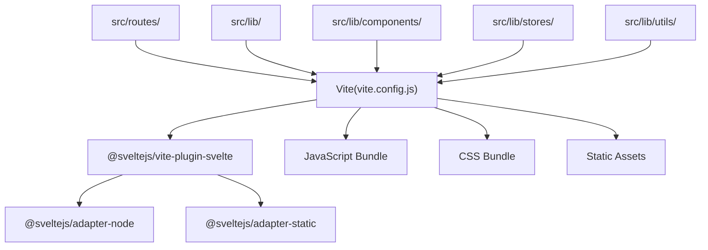
**Sources:** [package.json1-153](https://github.com/open-webui/open-webui/blob/a7271532/package.json#L1-L153) [vite.config.js](https://github.com/open-webui/open-webui/blob/a7271532/vite.config.js) (implied)

### Routing Structure

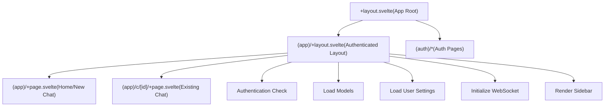
The application uses a nested layout structure where [src/routes/(app)/+layout.svelte1-300](https://github.com/open-webui/open-webui/blob/a7271532/src/routes/(app)/+layout.svelte#L1-L300) handles authentication, loads initial data, and renders the sidebar. Individual pages like [src/routes/(app)/+page.svelte1-16](https://github.com/open-webui/open-webui/blob/a7271532/src/routes/(app)/+page.svelte#L1-L16) and src/routes/(app)/c/\[id\]/+page.svelte:1-8 render the `Chat.svelte` component with appropriate props.

**Sources:** [src/routes/(app)/+layout.svelte1-300](https://github.com/open-webui/open-webui/blob/a7271532/src/routes/(app)/+layout.svelte#L1-L300) [src/routes/(app)/+page.svelte1-16](https://github.com/open-webui/open-webui/blob/a7271532/src/routes/(app)/+page.svelte#L1-L16) src/routes/(app)/c/\[id\]/+page.svelte:1-8

---

## Component Hierarchy

The frontend follows a hierarchical component structure with `Chat.svelte` as the primary orchestrator for chat functionality.

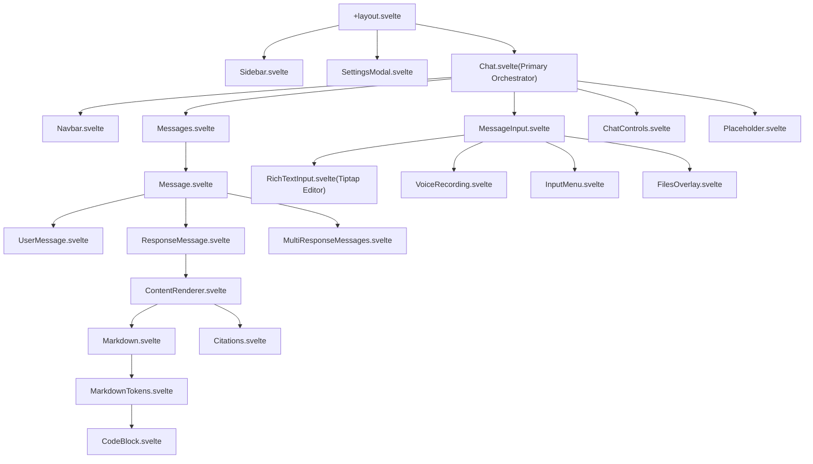
**Sources:** [src/lib/components/chat/Chat.svelte1-2070](https://github.com/open-webui/open-webui/blob/a7271532/src/lib/components/chat/Chat.svelte#L1-L2070) [src/lib/components/chat/Messages.svelte1-340](https://github.com/open-webui/open-webui/blob/a7271532/src/lib/components/chat/Messages.svelte#L1-L340) [src/lib/components/chat/MessageInput.svelte1-2075](https://github.com/open-webui/open-webui/blob/a7271532/src/lib/components/chat/MessageInput.svelte#L1-L2075) [src/lib/components/chat/Messages/ResponseMessage.svelte1-1200](https://github.com/open-webui/open-webui/blob/a7271532/src/lib/components/chat/Messages/ResponseMessage.svelte#L1-L1200)

### Chat.svelte - The Primary Orchestrator

`Chat.svelte` serves as the central component that orchestrates all chat functionality. It manages:

| Responsibility | Implementation |
| --- | --- |
| **Message History Management** | Maintains tree-based message history in `history.messages` object with parent-child relationships |
| **Model Selection** | Tracks `selectedModels` array and `atSelectedModel` for @ mentions |
| **File Handling** | Manages uploaded files array and file processing state |
| **WebSocket Events** | Subscribes to socket events via `chatEventHandler` function |
| **LLM Streaming** | Handles streaming responses and updates message state progressively |
| **User Actions** | Delegates to handler functions: `editMessage`, `deleteMessage`, `rateMessage`, `regenerateResponse` |

Key state variables in Chat.svelte:

```
// From Chat.svelte
let selectedModels = [''];           // Array of model IDs
let atSelectedModel: Model | undefined;  // Model from @ mention
let history = {
  messages: {},                      // Keyed by message ID
  currentId: null                    // Currently displayed message
};
let prompt = '';                     // Current input text
let files = [];                      // Uploaded files
let generating = false;              // Response in progress
let autoScroll = true;               // Auto-scroll behavior
```
**Sources:** [src/lib/components/chat/Chat.svelte1-150](https://github.com/open-webui/open-webui/blob/a7271532/src/lib/components/chat/Chat.svelte#L1-L150) [src/lib/components/chat/Chat.svelte549-648](https://github.com/open-webui/open-webui/blob/a7271532/src/lib/components/chat/Chat.svelte#L549-L648)

### MessageInput.svelte - Input Orchestration

`MessageInput.svelte` manages the message input area and coordinates between multiple input-related components:

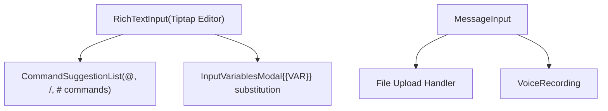
The component processes variable substitution for tokens like `{{CLIPBOARD}}`, `{{CURRENT_DATE}}`, `{{USER_NAME}}` through the `textVariableHandler` function at [src/lib/components/chat/MessageInput.svelte178-289](https://github.com/open-webui/open-webui/blob/a7271532/src/lib/components/chat/MessageInput.svelte#L178-L289)

**Sources:** [src/lib/components/chat/MessageInput.svelte1-2075](https://github.com/open-webui/open-webui/blob/a7271532/src/lib/components/chat/MessageInput.svelte#L1-L2075) [src/lib/components/chat/MessageInput.svelte178-289](https://github.com/open-webui/open-webui/blob/a7271532/src/lib/components/chat/MessageInput.svelte#L178-L289)

---

## State Management with Svelte Stores

Open WebUI uses Svelte's built-in store system for reactive state management. Stores are defined in `src/lib/stores/` and accessed throughout components using the `$` prefix syntax.

### Core Store Architecture

```mermaid
flowchart TD
    user["user(User object)"]
    config["config(Backend config)"]
    settings["settings(User preferences)"]
    models["models(Available models)"]
    chats["chats(Chat list)"]
    chatId["chatId(Current chat ID)"]
    socket["socket(Socket.io instance)"]
    showSidebar["showSidebar"]
    showSettings["showSettings"]
    showControls["showControls"]
    mobile["mobile"]
    temporaryChatEnabled["temporaryChatEnabled"]
    tools["tools(Available tools)"]
    functions["functions(Available functions)"]
    prompts["prompts(Prompt templates)"]
    knowledge["knowledge(Knowledge bases)"]
    ChatComponent["Chat.svelte"]
    SidebarComponent["Sidebar.svelte"]
    MessageInputComponent["MessageInput.svelte"]

    user --> ChatComponent
    config --> ChatComponent
    settings --> ChatComponent
    models --> ChatComponent
    socket --> ChatComponent
    chats --> SidebarComponent
    showSidebar --> SidebarComponent
    tools --> MessageInputComponent
    settings --> MessageInputComponent
```
### Store Usage Pattern

Components subscribe to stores using Svelte's reactive `$` syntax:

```
// Store definition (in src/lib/stores/index.ts)
export const user = writable(null);
export const config = writable(null);
export const settings = writable({});

// Component usage (in any .svelte file)
import { user, config, settings } from '$lib/stores';

// Reactive access with $ prefix
$: if ($user) {
  console.log($user.name);
}

// Direct update
settings.update(s => ({ ...s, theme: 'dark' }));
```
### Key Store Categories

| Store | Type | Purpose | Updated By |
| --- | --- | --- | --- |
| `user` | Writable | Current user object | [+layout.svelte85-107](https://github.com/open-webui/open-webui/blob/a7271532/+layout.svelte#L85-L107) on mount |
| `config` | Writable | Backend configuration | [+layout.svelte85-107](https://github.com/open-webui/open-webui/blob/a7271532/+layout.svelte#L85-L107) on mount |
| `settings` | Writable | User UI preferences | SettingsModal, persisted to backend |
| `models` | Writable | Available LLM models | [+layout.svelte109-116](https://github.com/open-webui/open-webui/blob/a7271532/+layout.svelte#L109-L116) on mount and refresh |
| `socket` | Writable | Socket.io connection | [+layout.svelte](https://github.com/open-webui/open-webui/blob/a7271532/+layout.svelte) WebSocket init |
| `chatId` | Writable | Current active chat ID | Chat.svelte navigation |
| `history` | Local state | Not a global store, maintained per Chat instance | Chat.svelte |

**Sources:** [src/lib/stores/index.ts](https://github.com/open-webui/open-webui/blob/a7271532/src/lib/stores/index.ts) (implied from imports), [src/routes/(app)/+layout.svelte85-136](https://github.com/open-webui/open-webui/blob/a7271532/src/routes/(app)/+layout.svelte#L85-L136) [src/lib/components/chat/Chat.svelte17-46](https://github.com/open-webui/open-webui/blob/a7271532/src/lib/components/chat/Chat.svelte#L17-L46)

---

## Rich Text Input System

The message input uses Tiptap, a headless editor framework built on ProseMirror, providing rich text editing capabilities with Markdown interoperability.

### Tiptap Editor Architecture

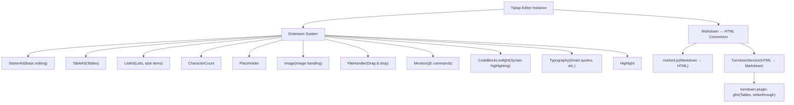
**Sources:** [src/lib/components/common/RichTextInput.svelte1-1200](https://github.com/open-webui/open-webui/blob/a7271532/src/lib/components/common/RichTextInput.svelte#L1-L1200) [src/lib/components/common/RichTextInput.svelte117-162](https://github.com/open-webui/open-webui/blob/a7271532/src/lib/components/common/RichTextInput.svelte#L117-L162)

### Markdown-HTML Bidirectional Conversion

The editor maintains bidirectional conversion between Markdown and HTML:

**Markdown → HTML** (via marked.js):

-   Custom renderer for task lists: [src/lib/components/common/RichTextInput.svelte5-29](https://github.com/open-webui/open-webui/blob/a7271532/src/lib/components/common/RichTextInput.svelte#L5-L29)
-   Converts `- [ ]` to `<li data-type="taskItem" data-checked="false">`
-   Converts tables to HTML table elements
-   Uses GFM (GitHub Flavored Markdown) extensions

**HTML → Markdown** (via TurndownService):

-   Custom rules for tables: [src/lib/components/common/RichTextInput.svelte42-82](https://github.com/open-webui/open-webui/blob/a7271532/src/lib/components/common/RichTextInput.svelte#L42-L82)
-   Custom rules for task list items: [src/lib/components/common/RichTextInput.svelte84-94](https://github.com/open-webui/open-webui/blob/a7271532/src/lib/components/common/RichTextInput.svelte#L84-L94)
-   Custom rules for mentions: [src/lib/components/common/RichTextInput.svelte97-106](https://github.com/open-webui/open-webui/blob/a7271532/src/lib/components/common/RichTextInput.svelte#L97-L106)
-   Converts `<span data-type="mention">` back to `<@modelId>` syntax

```
// Table conversion example from RichTextInput.svelte
turndownService.addRule('tables', {
  filter: 'table',
  replacement: function (content, node) {
    const rows = Array.from(node.querySelectorAll('tr'));
    let markdown = '\n';
    rows.forEach((row, rowIndex) => {
      const cells = Array.from(row.querySelectorAll('th, td'));
      const cellContents = cells.map((cell) => {
        let cellContent = turndownService.turndown(cell.innerHTML).trim();
        cellContent = cellContent.replace(/^\n+|\n+$/g, '');
        return cellContent;
      });
      markdown += '| ' + cellContents.join(' | ') + ' |\n';
      if (rowIndex === 0) {
        const separator = cells.map(() => '---').join(' | ');
        markdown += '| ' + separator + ' |\n';
      }
    });
    return markdown + '\n';
  }
});
```
**Sources:** [src/lib/components/common/RichTextInput.svelte5-106](https://github.com/open-webui/open-webui/blob/a7271532/src/lib/components/common/RichTextInput.svelte#L5-L106)

### Command Suggestions System

The editor implements a suggestion system for `@`, `/`, and `#` commands using Tiptap's Mention extension:

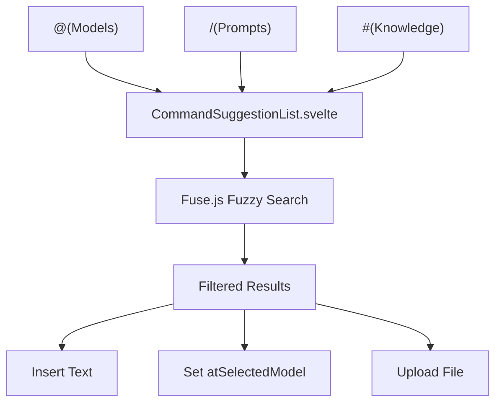
Each trigger character opens a suggestion dropdown rendered by `CommandSuggestionList.svelte` which filters available options (models, prompts, or knowledge files) and handles selection.

**Sources:** [src/lib/components/chat/MessageInput.svelte829-936](https://github.com/open-webui/open-webui/blob/a7271532/src/lib/components/chat/MessageInput.svelte#L829-L936) [src/lib/components/chat/MessageInput/CommandSuggestionList.svelte](https://github.com/open-webui/open-webui/blob/a7271532/src/lib/components/chat/MessageInput/CommandSuggestionList.svelte) (implied)

---

## Message Rendering Pipeline

The message rendering system transforms raw message content into rich, interactive displays with Markdown, code blocks, citations, and more.

### Content Rendering Flow

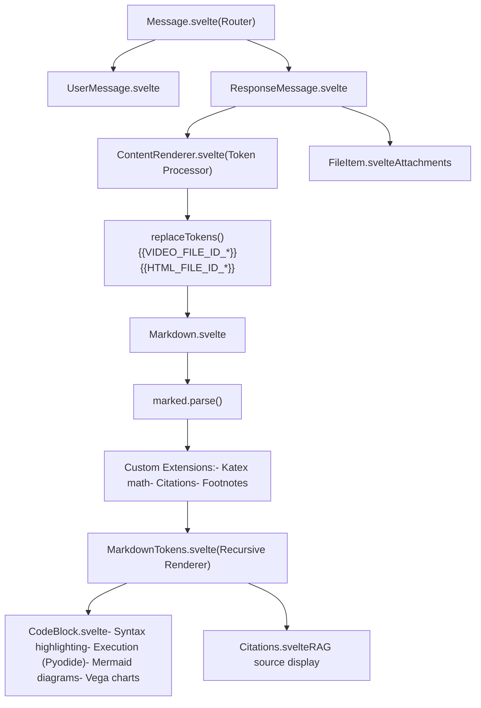
**Sources:** [src/lib/components/chat/Messages/ResponseMessage.svelte1-1200](https://github.com/open-webui/open-webui/blob/a7271532/src/lib/components/chat/Messages/ResponseMessage.svelte#L1-L1200) [src/lib/components/chat/Messages/ContentRenderer.svelte](https://github.com/open-webui/open-webui/blob/a7271532/src/lib/components/chat/Messages/ContentRenderer.svelte) (implied), [src/lib/components/chat/Messages/Markdown.svelte](https://github.com/open-webui/open-webui/blob/a7271532/src/lib/components/chat/Messages/Markdown.svelte) (implied)

### Token Replacement System

The `replaceTokens` function at [src/lib/utils/index.ts36-75](https://github.com/open-webui/open-webui/blob/a7271532/src/lib/utils/index.ts#L36-L75) processes special tokens in message content before rendering:

| Token Pattern | Replacement | Purpose |
| --- | --- | --- |
| `{{char}}` | Model name | Character replacement in roleplay |
| `{{user}}` | User name | User placeholder |
| `{{VIDEO_FILE_ID_*}}` | `<video>` element | Inline video playback |
| `{{HTML_FILE_ID_*}}` | `<file type="html">` | HTML file embedding |

The function avoids replacing tokens inside code blocks by splitting on code fence markers.

**Sources:** [src/lib/utils/index.ts36-75](https://github.com/open-webui/open-webui/blob/a7271532/src/lib/utils/index.ts#L36-L75)

### Markdown Extensions

Open WebUI extends marked.js with custom extensions for mathematical expressions (Katex), citations, and footnotes:

**Katex Math Rendering:**

-   Inline math: `$...$` or `\(...\)`
-   Block math: `$$...$$` or `\[...\]`
-   Processed by [src/lib/utils/marked/katex-extension.ts](https://github.com/open-webui/open-webui/blob/a7271532/src/lib/utils/marked/katex-extension.ts) (implied from package.json)

**Citations:**

-   Format: `【†source_id†】` or `【†1†】`
-   Rendered as interactive citation buttons linking to source sidebar
-   Processed by custom marked extension

**Footnotes:**

-   Standard Markdown footnote syntax: `[^1]` and `[^1]: footnote text`
-   Rendered at bottom of message

**Sources:** [package.json110](https://github.com/open-webui/open-webui/blob/a7271532/package.json#L110-L110) (katex dependency), [src/lib/utils/marked/extension.ts](https://github.com/open-webui/open-webui/blob/a7271532/src/lib/utils/marked/extension.ts) (implied), [src/lib/components/chat/Messages/Citations.svelte](https://github.com/open-webui/open-webui/blob/a7271532/src/lib/components/chat/Messages/Citations.svelte) (implied)

### CodeBlock Execution

`CodeBlock.svelte` provides interactive code execution capabilities:

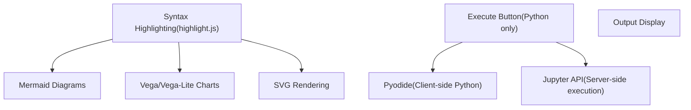
Code execution modes:

-   **Pyodide**: Client-side Python execution using WebAssembly, loaded from [package.json132](https://github.com/open-webui/open-webui/blob/a7271532/package.json#L132-L132) dependency
-   **Jupyter**: Server-side execution via `/jupyter/run` endpoint
-   **Mermaid**: Diagram rendering for code blocks with language `mermaid`
-   **Vega**: Data visualization for `vega` and `vega-lite` code blocks

**Sources:** [package.json132](https://github.com/open-webui/open-webui/blob/a7271532/package.json#L132-L132) (pyodide), [package.json116](https://github.com/open-webui/open-webui/blob/a7271532/package.json#L116-L116) (mermaid), [package.json141-142](https://github.com/open-webui/open-webui/blob/a7271532/package.json#L141-L142) (vega), [src/lib/components/chat/Messages/CodeBlock.svelte](https://github.com/open-webui/open-webui/blob/a7271532/src/lib/components/chat/Messages/CodeBlock.svelte) (implied)

---

## Real-time WebSocket Integration

The frontend maintains a persistent WebSocket connection for real-time updates using Socket.io.

### WebSocket Event Handling

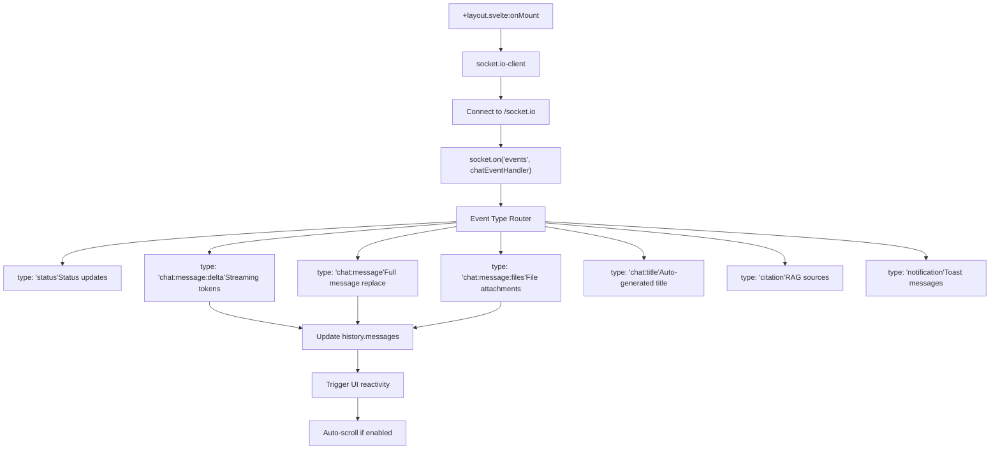
### Event Processing Implementation

The `chatEventHandler` function at [src/lib/components/chat/Chat.svelte351-478](https://github.com/open-webui/open-webui/blob/a7271532/src/lib/components/chat/Chat.svelte#L351-L478) processes incoming WebSocket events:

```
const chatEventHandler = async (event, cb) => {
  if (event.chat_id === $chatId) {
    let message = history.messages[event.message_id];

    const type = event?.data?.type ?? null;
    const data = event?.data?.data ?? null;

    if (type === 'status') {
      // Append to statusHistory array
      message.statusHistory.push(data);
    } else if (type === 'chat:message:delta') {
      // Append streaming tokens
      message.content += data.content;
    } else if (type === 'chat:message') {
      // Replace entire message
      message.content = data.content;
    } else if (type === 'citation') {
      // Add RAG source
      message.sources.push(data);
    }
    // ... more event types

    history.messages[event.message_id] = message;
  }
};
```
Events are only processed if `event.chat_id` matches the current `$chatId`, preventing cross-chat contamination.

**Sources:** [src/lib/components/chat/Chat.svelte351-478](https://github.com/open-webui/open-webui/blob/a7271532/src/lib/components/chat/Chat.svelte#L351-L478) [src/lib/components/chat/Chat.svelte552](https://github.com/open-webui/open-webui/blob/a7271532/src/lib/components/chat/Chat.svelte#L552-L552) (socket subscription), [package.json133](https://github.com/open-webui/open-webui/blob/a7271532/package.json#L133-L133) (socket.io-client)

---

## Frontend Dependencies

The frontend leverages numerous libraries for UI, content processing, and specialized features.

### Core Framework and UI

| Package | Version | Purpose |
| --- | --- | --- |
| `svelte` | ^5.0.0 | Reactive UI framework |
| `@sveltejs/kit` | ^2.5.27 | Application framework |
| `vite` | ^5.4.14 | Build tool and dev server |
| `tailwindcss` | ^4.0.0 | Utility-first CSS framework |
| `@tailwindcss/typography` | ^0.5.13 | Prose styling for Markdown |

**Sources:** [package.json44](https://github.com/open-webui/open-webui/blob/a7271532/package.json#L44-L44) [package.json27](https://github.com/open-webui/open-webui/blob/a7271532/package.json#L27-L27) [package.json50](https://github.com/open-webui/open-webui/blob/a7271532/package.json#L50-L50) [package.json47](https://github.com/open-webui/open-webui/blob/a7271532/package.json#L47-L47) [package.json31](https://github.com/open-webui/open-webui/blob/a7271532/package.json#L31-L31)

### Rich Text Editing

| Package | Purpose |
| --- | --- |
| `@tiptap/core` | Headless editor framework |
| `@tiptap/starter-kit` | Basic editing extensions |
| `@tiptap/extension-table` | Table support |
| `@tiptap/extension-mention` | @ command suggestions |
| `@tiptap/extension-file-handler` | Drag & drop files |
| `marked` | Markdown parsing |
| `turndown` | HTML to Markdown conversion |
| `dompurify` | HTML sanitization |

**Sources:** [package.json67-84](https://github.com/open-webui/open-webui/blob/a7271532/package.json#L67-L84) [package.json115](https://github.com/open-webui/open-webui/blob/a7271532/package.json#L115-L115) [package.json137-138](https://github.com/open-webui/open-webui/blob/a7271532/package.json#L137-L138) [package.json95](https://github.com/open-webui/open-webui/blob/a7271532/package.json#L95-L95)

### Content Processing and Rendering

| Package | Purpose |
| --- | --- |
| `highlight.js` | Syntax highlighting |
| `lowlight` | highlight.js integration for Tiptap |
| `katex` | Mathematical expression rendering |
| `mermaid` | Diagram generation |
| `vega` / `vega-lite` | Data visualization |
| `pyodide` | Client-side Python execution |

**Sources:** [package.json101](https://github.com/open-webui/open-webui/blob/a7271532/package.json#L101-L101) [package.json113](https://github.com/open-webui/open-webui/blob/a7271532/package.json#L113-L113) [package.json110](https://github.com/open-webui/open-webui/blob/a7271532/package.json#L110-L110) [package.json116](https://github.com/open-webui/open-webui/blob/a7271532/package.json#L116-L116) [package.json141-142](https://github.com/open-webui/open-webui/blob/a7271532/package.json#L141-L142) [package.json132](https://github.com/open-webui/open-webui/blob/a7271532/package.json#L132-L132)

### Utility Libraries

| Package | Purpose |
| --- | --- |
| `uuid` | UUID generation for message IDs |
| `dayjs` | Date formatting and manipulation |
| `fuse.js` | Fuzzy search for command suggestions |
| `socket.io-client` | WebSocket communication |
| `svelte-sonner` | Toast notifications |
| `mammoth` | DOCX file parsing |
| `pdfjs-dist` | PDF rendering |

**Sources:** [package.json140](https://github.com/open-webui/open-webui/blob/a7271532/package.json#L140-L140) [package.json94](https://github.com/open-webui/open-webui/blob/a7271532/package.json#L94-L94) [package.json99](https://github.com/open-webui/open-webui/blob/a7271532/package.json#L99-L99) [package.json133](https://github.com/open-webui/open-webui/blob/a7271532/package.json#L133-L133) [package.json135](https://github.com/open-webui/open-webui/blob/a7271532/package.json#L135-L135) [package.json114](https://github.com/open-webui/open-webui/blob/a7271532/package.json#L114-L114) [package.json119](https://github.com/open-webui/open-webui/blob/a7271532/package.json#L119-L119)

### Build and Development

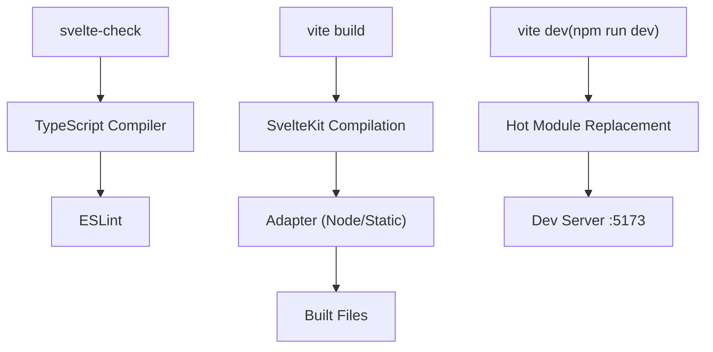
The project uses custom build scripts:

-   `npm run dev`: Starts Vite dev server with Pyodide asset preparation
-   `npm run build`: Production build with Pyodide assets
-   `npm run check`: Type checking with svelte-check
-   `npm run pyodide:fetch`: Pre-fetches Pyodide runtime files

**Sources:** [package.json5-22](https://github.com/open-webui/open-webui/blob/a7271532/package.json#L5-L22) [package.json24-51](https://github.com/open-webui/open-webui/blob/a7271532/package.json#L24-L51) (devDependencies)

---

## Internationalization (i18n)

Open WebUI supports 20 languages with a comprehensive translation system using i18next.

### Translation Architecture

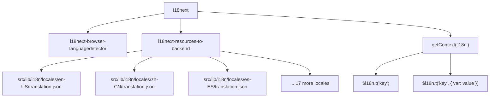
Components access translations via Svelte context:

```
import { getContext } from 'svelte';
const i18n = getContext('i18n');

// Simple translation
$i18n.t('Hello World')

// With interpolation
$i18n.t('Welcome, {{name}}!', { name: $user.name })

// With count pluralization
$i18n.t('{{count}} messages', { count: 5 })
```
**Sources:** [package.json104-106](https://github.com/open-webui/open-webui/blob/a7271532/package.json#L104-L106) (i18n packages), [src/lib/components/chat/Chat.svelte8](https://github.com/open-webui/open-webui/blob/a7271532/src/lib/components/chat/Chat.svelte#L8-L8) (usage pattern), [CHANGELOG.md58](https://github.com/open-webui/open-webui/blob/a7271532/CHANGELOG.md#L58-L58) (20 locales mentioned)

---

This document covers the core frontend architecture. For message-specific rendering details, see [Message Rendering](/open-webui/open-webui/5-message-rendering). For real-time communication implementation, see [Real-time Communication](/open-webui/open-webui/16-real-time-communication). For rich text editing collaboration features, see [Collaborative Editing](/open-webui/open-webui/9.3-collaborative-editing).
