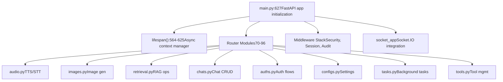
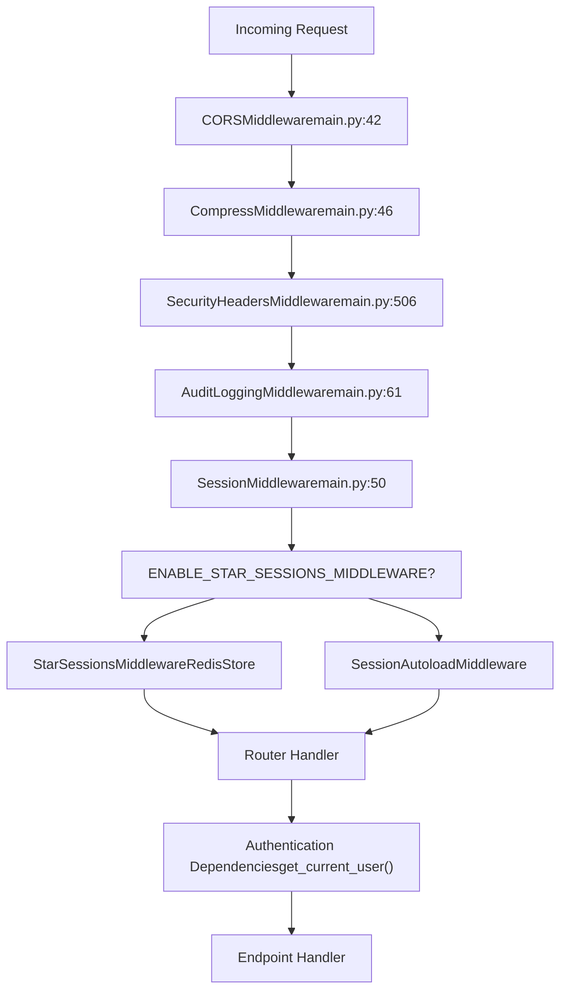
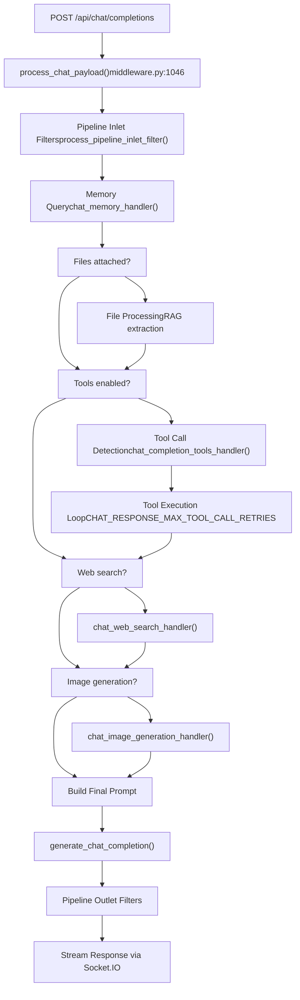
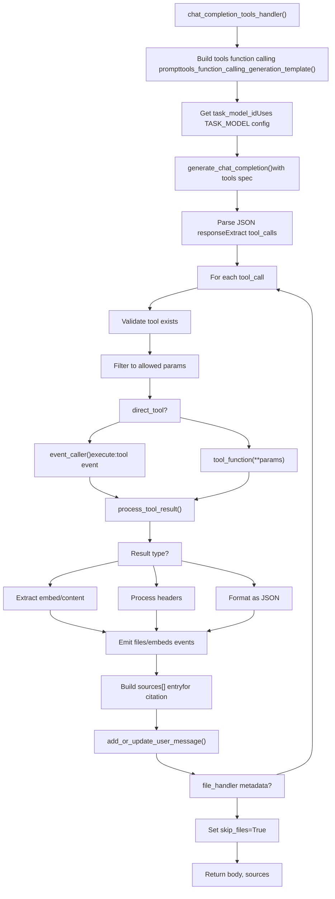
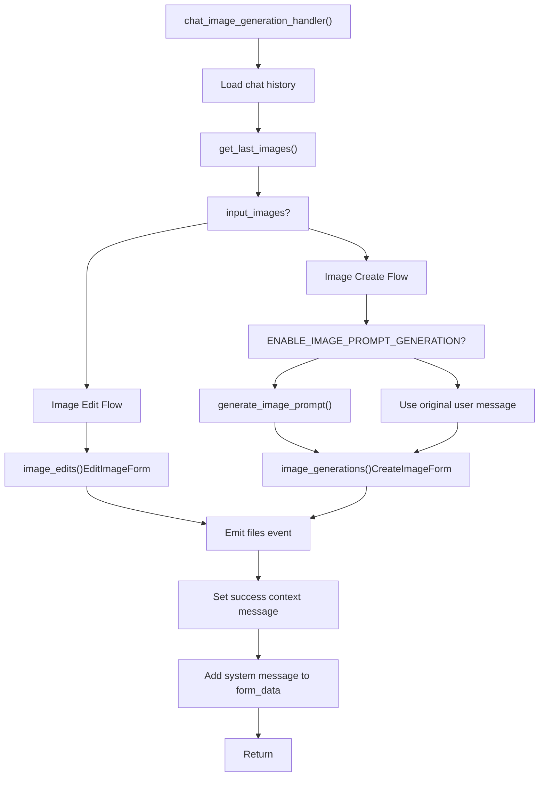
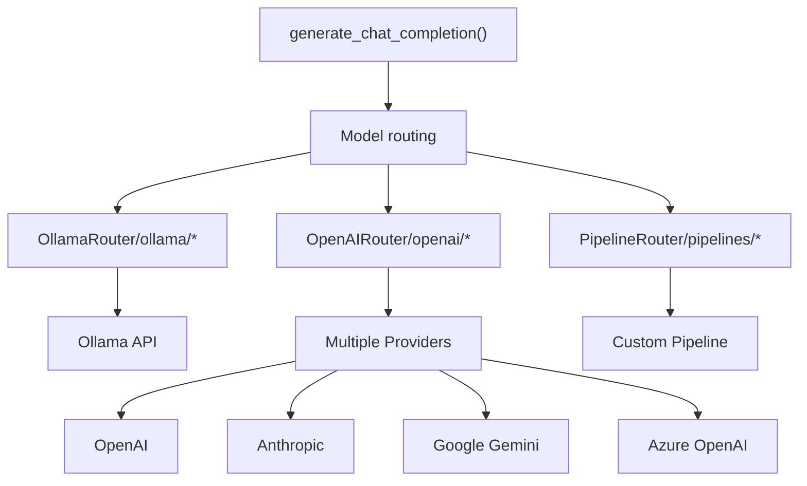
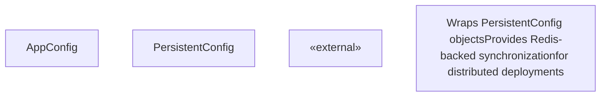

# Backend Architecture

Relevant source files

-   [backend/open\_webui/config.py](https://github.com/open-webui/open-webui/blob/a7271532/backend/open_webui/config.py)
-   [backend/open\_webui/env.py](https://github.com/open-webui/open-webui/blob/a7271532/backend/open_webui/env.py)
-   [backend/open\_webui/main.py](https://github.com/open-webui/open-webui/blob/a7271532/backend/open_webui/main.py)
-   [backend/open\_webui/retrieval/loaders/datalab\_marker.py](https://github.com/open-webui/open-webui/blob/a7271532/backend/open_webui/retrieval/loaders/datalab_marker.py)
-   [backend/open\_webui/retrieval/loaders/external\_document.py](https://github.com/open-webui/open-webui/blob/a7271532/backend/open_webui/retrieval/loaders/external_document.py)
-   [backend/open\_webui/retrieval/loaders/external\_web.py](https://github.com/open-webui/open-webui/blob/a7271532/backend/open_webui/retrieval/loaders/external_web.py)
-   [backend/open\_webui/retrieval/loaders/main.py](https://github.com/open-webui/open-webui/blob/a7271532/backend/open_webui/retrieval/loaders/main.py)
-   [backend/open\_webui/retrieval/loaders/mineru.py](https://github.com/open-webui/open-webui/blob/a7271532/backend/open_webui/retrieval/loaders/mineru.py)
-   [backend/open\_webui/retrieval/loaders/mistral.py](https://github.com/open-webui/open-webui/blob/a7271532/backend/open_webui/retrieval/loaders/mistral.py)
-   [backend/open\_webui/retrieval/utils.py](https://github.com/open-webui/open-webui/blob/a7271532/backend/open_webui/retrieval/utils.py)
-   [backend/open\_webui/routers/audio.py](https://github.com/open-webui/open-webui/blob/a7271532/backend/open_webui/routers/audio.py)
-   [backend/open\_webui/routers/auths.py](https://github.com/open-webui/open-webui/blob/a7271532/backend/open_webui/routers/auths.py)
-   [backend/open\_webui/routers/ollama.py](https://github.com/open-webui/open-webui/blob/a7271532/backend/open_webui/routers/ollama.py)
-   [backend/open\_webui/routers/openai.py](https://github.com/open-webui/open-webui/blob/a7271532/backend/open_webui/routers/openai.py)
-   [backend/open\_webui/routers/retrieval.py](https://github.com/open-webui/open-webui/blob/a7271532/backend/open_webui/routers/retrieval.py)
-   [backend/open\_webui/utils/auth.py](https://github.com/open-webui/open-webui/blob/a7271532/backend/open_webui/utils/auth.py)
-   [backend/open\_webui/utils/embeddings.py](https://github.com/open-webui/open-webui/blob/a7271532/backend/open_webui/utils/embeddings.py)
-   [backend/open\_webui/utils/middleware.py](https://github.com/open-webui/open-webui/blob/a7271532/backend/open_webui/utils/middleware.py)
-   [backend/open\_webui/utils/misc.py](https://github.com/open-webui/open-webui/blob/a7271532/backend/open_webui/utils/misc.py)
-   [backend/open\_webui/utils/oauth.py](https://github.com/open-webui/open-webui/blob/a7271532/backend/open_webui/utils/oauth.py)
-   [backend/open\_webui/utils/response.py](https://github.com/open-webui/open-webui/blob/a7271532/backend/open_webui/utils/response.py)
-   [src/lib/apis/retrieval/index.ts](https://github.com/open-webui/open-webui/blob/a7271532/src/lib/apis/retrieval/index.ts)
-   [src/lib/components/admin/Settings/Documents.svelte](https://github.com/open-webui/open-webui/blob/a7271532/src/lib/components/admin/Settings/Documents.svelte)
-   [src/lib/components/admin/Settings/WebSearch.svelte](https://github.com/open-webui/open-webui/blob/a7271532/src/lib/components/admin/Settings/WebSearch.svelte)

## Purpose and Scope

This document describes the FastAPI-based backend architecture of Open WebUI, including the application structure, router organization, middleware stack, and the complex chat completion processing pipeline. For information about the data layer (databases, vector stores, caching), see [Data Layer](/open-webui/open-webui/2.3-backend-architecture). For frontend architecture details, see [Frontend Architecture](/open-webui/open-webui/2.1-system-components-and-data-flow).

---

## Application Structure Overview

The backend is a FastAPI application with a modular router-based architecture. The main application is defined in [backend/open\_webui/main.py627-633](https://github.com/open-webui/open-webui/blob/a7271532/backend/open_webui/main.py#L627-L633) and orchestrates multiple routers, middleware components, and state management systems.

**Application Entry Point Structure**


Sources: [backend/open\_webui/main.py1-627](https://github.com/open-webui/open-webui/blob/a7271532/backend/open_webui/main.py#L1-L627)

---

## FastAPI Application Initialization

The application initialization occurs in two phases: startup configuration and lifespan management.

### Lifespan Context Manager

The `lifespan` async context manager [backend/open\_webui/main.py564-625](https://github.com/open-webui/open-webui/blob/a7271532/backend/open_webui/main.py#L564-L625) handles startup and shutdown:

> **[Mermaid sequence]**
> *(图表结构无法解析)*

**Key Initialization Steps:**

1.  **Instance Identification** [main.py566](https://github.com/open-webui/open-webui/blob/a7271532/main.py#L566-L566): Sets unique `INSTANCE_ID` for distributed deployments
2.  **License Validation** [main.py572-573](https://github.com/open-webui/open-webui/blob/a7271532/main.py#L572-L573): Validates license key if provided
3.  **Dependency Installation** [main.py577-578](https://github.com/open-webui/open-webui/blob/a7271532/main.py#L577-L578): Synchronously installs external function/tool dependencies
4.  **Redis Connection** [main.py580-587](https://github.com/open-webui/open-webui/blob/a7271532/main.py#L580-L587): Establishes Redis connection for distributed state
5.  **Task Listener** [main.py589-592](https://github.com/open-webui/open-webui/blob/a7271532/main.py#L589-L592): Starts background task command listener
6.  **Thread Pool** [main.py594-596](https://github.com/open-webui/open-webui/blob/a7271532/main.py#L594-L596): Configures AnyIO thread pool size
7.  **Model Cache** [main.py600-619](https://github.com/open-webui/open-webui/blob/a7271532/main.py#L600-L619): Optionally pre-fetches model list

Sources: [backend/open\_webui/main.py564-625](https://github.com/open-webui/open-webui/blob/a7271532/backend/open_webui/main.py#L564-L625) [backend/open\_webui/env.py142-143](https://github.com/open-webui/open-webui/blob/a7271532/backend/open_webui/env.py#L142-L143)

---

## Router Organization

The backend organizes endpoints into 17 distinct routers, each handling a specific domain of functionality:

| Router | Path Prefix | Primary Responsibility | Key File |
| --- | --- | --- | --- |
| `auths` | `/api/v1/auths` | Authentication flows, OAuth, LDAP | [routers/auths.py](https://github.com/open-webui/open-webui/blob/a7271532/routers/auths.py) |
| `chats` | `/api/v1/chats` | Chat CRUD operations, history management | [routers/chats.py](https://github.com/open-webui/open-webui/blob/a7271532/routers/chats.py) |
| `channels` | `/api/v1/channels` | Channel-based communication | [routers/channels.py](https://github.com/open-webui/open-webui/blob/a7271532/routers/channels.py) |
| `retrieval` | `/api/v1/retrieval` | RAG operations, web search, embedding | [routers/retrieval.py](https://github.com/open-webui/open-webui/blob/a7271532/routers/retrieval.py) |
| `tasks` | `/api/v1/tasks` | Background task generation (titles, tags) | [routers/tasks.py](https://github.com/open-webui/open-webui/blob/a7271532/routers/tasks.py) |
| `tools` | `/api/v1/tools` | Tool management, MCP/OpenAPI servers | [routers/tools.py](https://github.com/open-webui/open-webui/blob/a7271532/routers/tools.py) |
| `functions` | `/api/v1/functions` | Custom function management | [routers/functions.py](https://github.com/open-webui/open-webui/blob/a7271532/routers/functions.py) |
| `configs` | `/api/v1/configs` | Configuration endpoints, tool servers | [routers/configs.py](https://github.com/open-webui/open-webui/blob/a7271532/routers/configs.py) |
| `images` | `/api/v1/images` | Image generation (SD, ComfyUI, OpenAI) | [routers/images.py](https://github.com/open-webui/open-webui/blob/a7271532/routers/images.py) |
| `audio` | `/api/v1/audio` | TTS/STT services | [routers/audio.py](https://github.com/open-webui/open-webui/blob/a7271532/routers/audio.py) |
| `pipelines` | `/api/v1/pipelines` | Pipeline filters (inlet/outlet) | [routers/pipelines.py](https://github.com/open-webui/open-webui/blob/a7271532/routers/pipelines.py) |
| `models` | `/api/v1/models` | Model management operations | [routers/models.py](https://github.com/open-webui/open-webui/blob/a7271532/routers/models.py) |
| `users` | `/api/v1/users` | User management | [routers/users.py](https://github.com/open-webui/open-webui/blob/a7271532/routers/users.py) |
| `groups` | `/api/v1/groups` | Group management for RBAC | [routers/groups.py](https://github.com/open-webui/open-webui/blob/a7271532/routers/groups.py) |
| `files` | `/api/v1/files` | File upload/storage | [routers/files.py](https://github.com/open-webui/open-webui/blob/a7271532/routers/files.py) |
| `knowledge` | `/api/v1/knowledge` | Knowledge base management | [routers/knowledge.py](https://github.com/open-webui/open-webui/blob/a7271532/routers/knowledge.py) |
| `memories` | `/api/v1/memories` | Memory storage/retrieval | [routers/memories.py](https://github.com/open-webui/open-webui/blob/a7271532/routers/memories.py) |
| `prompts` | `/api/v1/prompts` | Prompt template management | [routers/prompts.py](https://github.com/open-webui/open-webui/blob/a7271532/routers/prompts.py) |
| `notes` | `/api/v1/notes` | Note-taking functionality | [routers/notes.py](https://github.com/open-webui/open-webui/blob/a7271532/routers/notes.py) |
| `folders` | `/api/v1/folders` | Chat folder organization | [routers/folders.py](https://github.com/open-webui/open-webui/blob/a7271532/routers/folders.py) |
| `evaluations` | `/api/v1/evaluations` | Model evaluation arena | [routers/evaluations.py](https://github.com/open-webui/open-webui/blob/a7271532/routers/evaluations.py) |
| `utils` | `/api/v1/utils` | Utility endpoints | [routers/utils.py](https://github.com/open-webui/open-webui/blob/a7271532/routers/utils.py) |
| `scim` | `/api/scim/v2` | SCIM user provisioning | [routers/scim.py](https://github.com/open-webui/open-webui/blob/a7271532/routers/scim.py) |
| `ollama` | `/ollama` | Ollama proxy | [routers/ollama.py](https://github.com/open-webui/open-webui/blob/a7271532/routers/ollama.py) |
| `openai` | `/openai` | OpenAI-compatible API | [routers/openai.py](https://github.com/open-webui/open-webui/blob/a7271532/routers/openai.py) |

**Router Registration Pattern** [backend/open\_webui/main.py70-96](https://github.com/open-webui/open-webui/blob/a7271532/backend/open_webui/main.py#L70-L96):

```
from open_webui.routers import (
    audio, images, ollama, openai, retrieval, pipelines,
    tasks, auths, channels, chats, notes, folders,
    configs, groups, files, functions, memories,
    models, knowledge, prompts, evaluations,
    tools, users, utils, scim,
)
```
Each router is included in the main app with its corresponding path prefix via FastAPI's `app.include_router()` mechanism. The application includes 25 distinct routers covering authentication, data management, AI operations, and utility functions.

Sources: [backend/open\_webui/main.py70-96](https://github.com/open-webui/open-webui/blob/a7271532/backend/open_webui/main.py#L70-L96)

---

## Middleware Stack

The middleware stack processes requests in a specific order, implementing security, authentication, session management, and auditing:


### Middleware Components

1.  **CORSMiddleware** [main.py - CORS configuration](https://github.com/open-webui/open-webui/blob/a7271532/main.py - CORS configuration)

    -   Configured via `CORS_ALLOW_ORIGIN` environment variable
    -   Handles cross-origin requests for frontend
2.  **CompressMiddleware** [main.py46](https://github.com/open-webui/open-webui/blob/a7271532/main.py#L46-L46)

    -   Optional via `ENABLE_COMPRESSION_MIDDLEWARE`
    -   Compresses responses to reduce bandwidth
3.  **SecurityHeadersMiddleware** [utils/security\_headers.py](https://github.com/open-webui/open-webui/blob/a7271532/utils/security_headers.py)

    -   Adds security headers (CSP, X-Frame-Options, etc.)
4.  **AuditLoggingMiddleware** [utils/audit.py](https://github.com/open-webui/open-webui/blob/a7271532/utils/audit.py)

    -   Logs requests based on `AUDIT_LOG_LEVEL`
    -   Excludes paths matching `AUDIT_EXCLUDED_PATHS`
    -   Truncates request bodies to `MAX_BODY_LOG_SIZE`
5.  **Session Management**

    -   **Standard**: `SessionMiddleware` with `WEBUI_SECRET_KEY`
    -   **Redis-backed**: `StarSessionsMiddleware` with `RedisStore` [main.py - session config](https://github.com/open-webui/open-webui/blob/a7271532/main.py - session config)
    -   Cookie configuration: `WEBUI_SESSION_COOKIE_SAME_SITE`, `WEBUI_SESSION_COOKIE_SECURE`

Sources: [backend/open\_webui/main.py](https://github.com/open-webui/open-webui/blob/a7271532/backend/open_webui/main.py) [backend/open\_webui/utils/security\_headers.py](https://github.com/open-webui/open-webui/blob/a7271532/backend/open_webui/utils/security_headers.py) [backend/open\_webui/utils/audit.py](https://github.com/open-webui/open-webui/blob/a7271532/backend/open_webui/utils/audit.py) [backend/open\_webui/env.py454-481](https://github.com/open-webui/open-webui/blob/a7271532/backend/open_webui/env.py#L454-L481)

---

## Chat Completion Processing Pipeline

The chat completion processing pipeline is the most complex component of the backend, orchestrating multiple stages of request transformation before reaching the LLM.

### Pipeline Architecture


### Middleware Entry Point

The `process_chat_payload()` function [backend/open\_webui/utils/middleware.py1046-1449](https://github.com/open-webui/open-webui/blob/a7271532/backend/open_webui/utils/middleware.py#L1046-L1449) is the central orchestrator:

**Function Signature:**

```
async def process_chat_payload(
    request: Request,
    form_data: dict,
    metadata: dict,
    user: UserModel,
    files: list = [],
)
```
**Key Responsibilities:**

1.  Extract and validate request parameters
2.  Set up event emitter for real-time updates
3.  Execute sequential processing stages
4.  Build context from multiple sources
5.  Handle streaming response

Sources: [backend/open\_webui/utils/middleware.py1046-1449](https://github.com/open-webui/open-webui/blob/a7271532/backend/open_webui/utils/middleware.py#L1046-L1449)

### Processing Stages Detail

#### Stage 1: Inlet Filters

**Function**: `process_pipeline_inlet_filter()` [backend/open\_webui/routers/pipelines.py](https://github.com/open-webui/open-webui/blob/a7271532/backend/open_webui/routers/pipelines.py)

Applies custom pipeline filters registered in the system. Filters can:

-   Modify messages
-   Add context
-   Block requests
-   Transform payloads

Sources: [backend/open\_webui/routers/pipelines.py](https://github.com/open-webui/open-webui/blob/a7271532/backend/open_webui/routers/pipelines.py)

#### Stage 2: Memory Query

**Function**: `chat_memory_handler()` [backend/open\_webui/utils/middleware.py517-554](https://github.com/open-webui/open-webui/blob/a7271532/backend/open_webui/utils/middleware.py#L517-L554)

Retrieves relevant past interactions from the user's memory store:

> **[Mermaid sequence]**
> *(图表结构无法解析)*

The memory query:

1.  Extracts last user message as query
2.  Searches user's memory collection (top-k=3)
3.  Formats results with creation timestamps
4.  Appends to system message as user context

Sources: [backend/open\_webui/utils/middleware.py517-554](https://github.com/open-webui/open-webui/blob/a7271532/backend/open_webui/utils/middleware.py#L517-L554) [backend/open\_webui/routers/memories.py56-70](https://github.com/open-webui/open-webui/blob/a7271532/backend/open_webui/routers/memories.py#L56-L70)

#### Stage 3: File/RAG Processing

**Function**: `chat_completion_files_handler()` [backend/open\_webui/utils/middleware.py997-1043](https://github.com/open-webui/open-webui/blob/a7271532/backend/open_webui/utils/middleware.py#L997-L1043)

Processes attached files and performs RAG retrieval when files are present. This stage:

-   Extracts file metadata from request
-   Generates retrieval queries (if enabled)
-   Performs vector search across file collections
-   Applies reranking to results
-   Injects relevant context into system message

The RAG system supports multiple document loaders including:

-   **PyPDFLoader**: Standard PDF processing
-   **TikaLoader**: Apache Tika server integration [backend/open\_webui/retrieval/loaders/main.py93-132](https://github.com/open-webui/open-webui/blob/a7271532/backend/open_webui/retrieval/loaders/main.py#L93-L132)
-   **DatalabMarkerLoader**: Advanced PDF/document processing with optional LLM enhancement [backend/open\_webui/retrieval/loaders/datalab\_marker.py13-204](https://github.com/open-webui/open-webui/blob/a7271532/backend/open_webui/retrieval/loaders/datalab_marker.py#L13-L204)
-   **DoclingLoader**: Docling server integration [backend/open\_webui/retrieval/loaders/main.py134-185](https://github.com/open-webui/open-webui/blob/a7271532/backend/open_webui/retrieval/loaders/main.py#L134-L185)
-   **MinerULoader**: OCR and formula detection [backend/open\_webui/retrieval/loaders/mineru.py](https://github.com/open-webui/open-webui/blob/a7271532/backend/open_webui/retrieval/loaders/mineru.py)
-   **ExternalDocumentLoader**: External service integration [backend/open\_webui/retrieval/loaders/external\_document.py15-92](https://github.com/open-webui/open-webui/blob/a7271532/backend/open_webui/retrieval/loaders/external_document.py#L15-L92)

Sources: [backend/open\_webui/utils/middleware.py997-1043](https://github.com/open-webui/open-webui/blob/a7271532/backend/open_webui/utils/middleware.py#L997-L1043) [backend/open\_webui/retrieval/loaders/main.py187-336](https://github.com/open-webui/open-webui/blob/a7271532/backend/open_webui/retrieval/loaders/main.py#L187-L336) [backend/open\_webui/retrieval/loaders/datalab\_marker.py1-204](https://github.com/open-webui/open-webui/blob/a7271532/backend/open_webui/retrieval/loaders/datalab_marker.py#L1-L204)

#### Stage 4: Tool Execution

**Function**: `chat_completion_tools_handler()` [backend/open\_webui/utils/middleware.py287-514](https://github.com/open-webui/open-webui/blob/a7271532/backend/open_webui/utils/middleware.py#L287-L514)

Implements a sophisticated tool calling mechanism with retry loop:

**Tool Detection Flow:**


**Key Features:**

-   **Spec Generation**: Creates JSON schema from tool definitions
-   **LLM-based Detection**: Uses task model to determine which tools to call
-   **Parameter Validation**: Filters parameters to only allowed ones from OpenAPI spec
-   **Direct vs Callable**: Supports both client-side (direct) and server-side tools
-   **Result Processing**: Handles HTML embeds, file attachments, JSON data
-   **Citation Support**: Builds source entries for tool results
-   **File Handler Skip**: Tools can mark themselves as file handlers to skip file processing

The tool execution supports multiple tool types:

-   **OpenAPI Tools**: Standard RESTful API tools with OpenAPI specifications
-   **MCP (Model Context Protocol) Tools**: Dynamic client registration and execution
-   **Direct Tools**: Client-side execution via Socket.IO events

Sources: [backend/open\_webui/utils/middleware.py287-514](https://github.com/open-webui/open-webui/blob/a7271532/backend/open_webui/utils/middleware.py#L287-L514) [backend/open\_webui/utils/task.py78-82](https://github.com/open-webui/open-webui/blob/a7271532/backend/open_webui/utils/task.py#L78-L82) [backend/open\_webui/utils/middleware.py144-284](https://github.com/open-webui/open-webui/blob/a7271532/backend/open_webui/utils/middleware.py#L144-L284)

#### Stage 5: Web Search

**Function**: `chat_web_search_handler()` [backend/open\_webui/utils/middleware.py556-716](https://github.com/open-webui/open-webui/blob/a7271532/backend/open_webui/utils/middleware.py#L556-L716)

Performs web search and integrates results:

**Search Flow:**

> **[Mermaid sequence]**
> *(图表结构无法解析)*

**Query Generation:**

-   Uses `generate_queries()` [backend/open\_webui/routers/tasks.py](https://github.com/open-webui/open-webui/blob/a7271532/backend/open_webui/routers/tasks.py)
-   Attempts JSON parsing, falls back to single query
-   Can be cached via `ENABLE_QUERIES_CACHE` [backend/open\_webui/env.py611-613](https://github.com/open-webui/open-webui/blob/a7271532/backend/open_webui/env.py#L611-L613)

**Search Execution:**

-   Parallel requests (configured by `WEB_SEARCH_CONCURRENT_REQUESTS`)
-   Supports 20+ search engines including:
    -   **Brave Search** [backend/open\_webui/retrieval/web/brave.py](https://github.com/open-webui/open-webui/blob/a7271532/backend/open_webui/retrieval/web/brave.py)
    -   **Tavily** [backend/open\_webui/retrieval/web/tavily.py](https://github.com/open-webui/open-webui/blob/a7271532/backend/open_webui/retrieval/web/tavily.py)
    -   **SearXNG** [backend/open\_webui/retrieval/web/searxng.py](https://github.com/open-webui/open-webui/blob/a7271532/backend/open_webui/retrieval/web/searxng.py)
    -   **Google PSE** [backend/open\_webui/retrieval/web/google\_pse.py](https://github.com/open-webui/open-webui/blob/a7271532/backend/open_webui/retrieval/web/google_pse.py)
    -   **DuckDuckGo** [backend/open\_webui/retrieval/web/duckduckgo.py](https://github.com/open-webui/open-webui/blob/a7271532/backend/open_webui/retrieval/web/duckduckgo.py)
    -   **Serper**, **Serpstack**, **SerpAPI** [backend/open\_webui/retrieval/web/serper.py](https://github.com/open-webui/open-webui/blob/a7271532/backend/open_webui/retrieval/web/serper.py)
    -   **Perplexity** [backend/open\_webui/retrieval/web/perplexity.py](https://github.com/open-webui/open-webui/blob/a7271532/backend/open_webui/retrieval/web/perplexity.py)
    -   **External** custom search engines [backend/open\_webui/retrieval/web/external.py](https://github.com/open-webui/open-webui/blob/a7271532/backend/open_webui/retrieval/web/external.py)
-   Results either embedded in vector store or returned as raw docs (controlled by `BYPASS_WEB_SEARCH_EMBEDDING_AND_RETRIEVAL`)

Sources: [backend/open\_webui/utils/middleware.py556-716](https://github.com/open-webui/open-webui/blob/a7271532/backend/open_webui/utils/middleware.py#L556-L716) [backend/open\_webui/routers/retrieval.py687-994](https://github.com/open-webui/open-webui/blob/a7271532/backend/open_webui/routers/retrieval.py#L687-L994) [backend/open\_webui/retrieval/web/](https://github.com/open-webui/open-webui/blob/a7271532/backend/open_webui/retrieval/web/)

#### Stage 6: Image Generation

**Function**: `chat_image_generation_handler()` [backend/open\_webui/utils/middleware.py755-924](https://github.com/open-webui/open-webui/blob/a7271532/backend/open_webui/utils/middleware.py#L755-L924)

Handles both image creation and editing:

**Image Operation Decision:**


**Prompt Enhancement:**

-   Uses `generate_image_prompt()` [backend/open\_webui/routers/tasks.py](https://github.com/open-webui/open-webui/blob/a7271532/backend/open_webui/routers/tasks.py) to improve prompts via LLM
-   Falls back to raw user message if generation fails

**Context Injection:**

-   Adds system message indicating image was created/edited
-   Helps LLM understand what happened and respond appropriately

Sources: [backend/open\_webui/utils/middleware.py755-924](https://github.com/open-webui/open-webui/blob/a7271532/backend/open_webui/utils/middleware.py#L755-L924) [backend/open\_webui/routers/images.py46-181](https://github.com/open-webui/open-webui/blob/a7271532/backend/open_webui/routers/images.py#L46-L181) [backend/open\_webui/routers/tasks.py142-184](https://github.com/open-webui/open-webui/blob/a7271532/backend/open_webui/routers/tasks.py#L142-L184)

### Final LLM Call

After all augmentation stages, the final prompt is sent to the LLM via `generate_chat_completion()` [backend/open\_webui/utils/chat.py74-327](https://github.com/open-webui/open-webui/blob/a7271532/backend/open_webui/utils/chat.py#L74-L327)

**Request Flow:**


**Retry Loop for Tool Calls:**

The system implements a retry loop (max retries: `CHAT_RESPONSE_MAX_TOOL_CALL_RETRIES` [backend/open\_webui/env.py602-604](https://github.com/open-webui/open-webui/blob/a7271532/backend/open_webui/env.py#L602-L604)) to handle multi-step tool interactions where the LLM needs to call tools multiple times based on previous results.

**Outlet Filters:**

After LLM response, the `process_pipeline_outlet_filter()` function [backend/open\_webui/routers/pipelines.py](https://github.com/open-webui/open-webui/blob/a7271532/backend/open_webui/routers/pipelines.py) applies post-processing filters that can:

-   Modify the final response
-   Add metadata
-   Filter content
-   Log interactions

Sources: [backend/open\_webui/utils/middleware.py1046-1449](https://github.com/open-webui/open-webui/blob/a7271532/backend/open_webui/utils/middleware.py#L1046-L1449) [backend/open\_webui/env.py602-604](https://github.com/open-webui/open-webui/blob/a7271532/backend/open_webui/env.py#L602-L604) [backend/open\_webui/utils/chat.py74-327](https://github.com/open-webui/open-webui/blob/a7271532/backend/open_webui/utils/chat.py#L74-L327)

---

## Application State Management

The FastAPI application maintains state in `app.state`, which is accessible across all requests and middleware.

### State Structure

**Core State Variables** [main.py643-976](https://github.com/open-webui/open-webui/blob/a7271532/main.py#L643-L976):

| State Variable | Type | Purpose | Initialization |
| --- | --- | --- | --- |
| `instance_id` | str | Unique instance identifier | [main.py566](https://github.com/open-webui/open-webui/blob/a7271532/main.py#L566-L566) |
| `config` | AppConfig | Centralized configuration | [main.py644-649](https://github.com/open-webui/open-webui/blob/a7271532/main.py#L644-L649) |
| `redis` | Redis/RedisCluster | Redis connection | [main.py580-587](https://github.com/open-webui/open-webui/blob/a7271532/main.py#L580-L587) |
| `oauth_manager` | OAuthManager | OAuth provider manager | [main.py636-637](https://github.com/open-webui/open-webui/blob/a7271532/main.py#L636-L637) |
| `oauth_client_manager` | OAuthClientManager | OAuth client manager | [main.py640-641](https://github.com/open-webui/open-webui/blob/a7271532/main.py#L640-L641) |
| `EMBEDDING_FUNCTION` | Callable | Embedding generator | [main.py1005-1033](https://github.com/open-webui/open-webui/blob/a7271532/main.py#L1005-L1033) |
| `RERANKING_FUNCTION` | Callable | Reranking function | [main.py1035-1039](https://github.com/open-webui/open-webui/blob/a7271532/main.py#L1035-L1039) |
| `ef` | SentenceTransformer | Local embedding model | [main.py982-986](https://github.com/open-webui/open-webui/blob/a7271532/main.py#L982-L986) |
| `rf` | CrossEncoder | Local reranking model | [main.py987-1002](https://github.com/open-webui/open-webui/blob/a7271532/main.py#L987-L1002) |
| `BASE_MODELS` | list | Cached model list | [main.py727](https://github.com/open-webui/open-webui/blob/a7271532/main.py#L727-L727) |
| `TOOLS` | dict | Loaded tool definitions | [main.py816](https://github.com/open-webui/open-webui/blob/a7271532/main.py#L816-L816) |
| `FUNCTIONS` | dict | Loaded function definitions | [main.py819](https://github.com/open-webui/open-webui/blob/a7271532/main.py#L819-L819) |

### AppConfig Class

The `AppConfig` class [backend/open\_webui/config.py224-283](https://github.com/open-webui/open-webui/blob/a7271532/backend/open_webui/config.py#L224-L283) provides a unified configuration interface with Redis synchronization:


**Configuration Flow:**

1.  **Initialization** [backend/open\_webui/config.py230-249](https://github.com/open-webui/open-webui/blob/a7271532/backend/open_webui/config.py#L230-L249)

    -   Connects to Redis if URL provided
    -   Initializes empty state dictionary
2.  **Setting Values** [backend/open\_webui/config.py251-260](https://github.com/open-webui/open-webui/blob/a7271532/backend/open_webui/config.py#L251-L260)

    -   Updates `PersistentConfig.value`
    -   Saves to database via `save_to_db()` [backend/open\_webui/config.py88-99](https://github.com/open-webui/open-webui/blob/a7271532/backend/open_webui/config.py#L88-L99)
    -   Publishes to Redis for other instances
3.  **Getting Values** [backend/open\_webui/config.py262-283](https://github.com/open-webui/open-webui/blob/a7271532/backend/open_webui/config.py#L262-L283)

    -   Checks Redis for updated value first
    -   Returns in-memory value if Redis not available
    -   Updates in-memory value if Redis has newer version

**Redis Key Pattern**: `{prefix}:config:{key}` [backend/open\_webui/config.py259](https://github.com/open-webui/open-webui/blob/a7271532/backend/open_webui/config.py#L259-L259)

The `PersistentConfig` class [backend/open\_webui/config.py165-222](https://github.com/open-webui/open-webui/blob/a7271532/backend/open_webui/config.py#L165-L222) wraps individual configuration values, supporting:

-   Environment variable defaults
-   Database persistence
-   Runtime updates
-   Automatic registry for bulk updates

Sources: [backend/open\_webui/config.py224-283](https://github.com/open-webui/open-webui/blob/a7271532/backend/open_webui/config.py#L224-L283) [backend/open\_webui/config.py165-222](https://github.com/open-webui/open-webui/blob/a7271532/backend/open_webui/config.py#L165-L222) [backend/open\_webui/config.py88-99](https://github.com/open-webui/open-webui/blob/a7271532/backend/open_webui/config.py#L88-L99) [backend/open\_webui/main.py646-651](https://github.com/open-webui/open-webui/blob/a7271532/backend/open_webui/main.py#L646-L651)

---

## Request Processing Architecture

The complete request flow through the backend combines authentication, routing, and business logic:

> **[Mermaid sequence]**
> *(图表结构无法解析)*

### Authentication Flow Detail

The authentication system [utils/auth.py](https://github.com/open-webui/open-webui/blob/a7271532/utils/auth.py) supports multiple methods:

**Token Types:**

1.  **JWT Tokens**: Standard user authentication

    -   Validated via `decode_token()` [utils/auth.py](https://github.com/open-webui/open-webui/blob/a7271532/utils/auth.py)
    -   JTI-based revocation via Redis [utils/auth.py](https://github.com/open-webui/open-webui/blob/a7271532/utils/auth.py)
    -   Expiry configured by `JWT_EXPIRES_IN` [config.py314-316](https://github.com/open-webui/open-webui/blob/a7271532/config.py#L314-L316)
2.  **API Keys**: Programmatic access

    -   Format: `sk-*` prefix [utils/auth.py](https://github.com/open-webui/open-webui/blob/a7271532/utils/auth.py)
    -   Validated via `Users.get_user_by_api_key()`
    -   Optional endpoint restrictions [config.py296-312](https://github.com/open-webui/open-webui/blob/a7271532/config.py#L296-L312)
3.  **Trusted Headers**: Reverse proxy auth

    -   `WEBUI_AUTH_TRUSTED_EMAIL_HEADER` [env.py425-431](https://github.com/open-webui/open-webui/blob/a7271532/env.py#L425-L431)
    -   Bypasses password authentication

**Dependency Hierarchy:**

```
get_current_user()
    ├─> get_verified_user()  (requires non-pending user)
    └─> get_admin_user()      (requires admin role)
```
Sources: [backend/open\_webui/utils/auth.py](https://github.com/open-webui/open-webui/blob/a7271532/backend/open_webui/utils/auth.py) [backend/open\_webui/config.py290-316](https://github.com/open-webui/open-webui/blob/a7271532/backend/open_webui/config.py#L290-L316) [backend/open\_webui/env.py425-431](https://github.com/open-webui/open-webui/blob/a7271532/backend/open_webui/env.py#L425-L431)

---

## Error Handling and Response Patterns

### Standard Error Format

All routers use consistent error responses via `ERROR_MESSAGES` constants [constants.py19-81](https://github.com/open-webui/open-webui/blob/a7271532/constants.py#L19-L81):

```
raise HTTPException(
    status_code=status.HTTP_400_BAD_REQUEST,
    detail=ERROR_MESSAGES.DEFAULT(error_message)
)
```
### Streaming Response Pattern

Chat completions use `StreamingResponse` with JSON delta chunks [env.py568-580](https://github.com/open-webui/open-webui/blob/a7271532/env.py#L568-L580):

**Chunk Format:**

```
{
  "choices": [{
    "delta": {
      "content": "text chunk",
      "role": "assistant"
    }
  }],
  "done": false
}
```
**Delta Chunk Size**: Configured by `CHAT_RESPONSE_STREAM_DELTA_CHUNK_SIZE` [env.py568-580](https://github.com/open-webui/open-webui/blob/a7271532/env.py#L568-L580)

### Background Tasks

Asynchronous operations use FastAPI's `BackgroundTasks`:

**Title Generation** [backend/open\_webui/routers/tasks.py186-240](https://github.com/open-webui/open-webui/blob/a7271532/backend/open_webui/routers/tasks.py#L186-L240):

-   Uses task model to generate concise chat titles
-   Triggered when `ENABLE_TITLE_GENERATION` is true
-   Processes chat history to create contextual title

**Tag Generation** [backend/open\_webui/routers/tasks.py242-291](https://github.com/open-webui/open-webui/blob/a7271532/backend/open_webui/routers/tasks.py#L242-L291):

-   Extracts relevant tags from conversation
-   Enabled via `ENABLE_TAGS_GENERATION`
-   Returns array of semantic tags

**Follow-up Generation** [backend/open\_webui/routers/tasks.py293-347](https://github.com/open-webui/open-webui/blob/a7271532/backend/open_webui/routers/tasks.py#L293-L347):

-   Generates suggested follow-up questions
-   Controlled by `ENABLE_FOLLOW_UP_GENERATION`
-   Helps continue conversation naturally

**Query Generation** [backend/open\_webui/routers/tasks.py415-471](https://github.com/open-webui/open-webui/blob/a7271532/backend/open_webui/routers/tasks.py#L415-L471):

-   Creates search queries for RAG/web search
-   Used by both web search and RAG retrieval
-   Supports multiple query generation for better coverage

Sources: [backend/open\_webui/routers/tasks.py186-471](https://github.com/open-webui/open-webui/blob/a7271532/backend/open_webui/routers/tasks.py#L186-L471) [backend/open\_webui/constants.py19-81](https://github.com/open-webui/open-webui/blob/a7271532/backend/open_webui/constants.py#L19-L81) [backend/open\_webui/env.py568-580](https://github.com/open-webui/open-webui/blob/a7271532/backend/open_webui/env.py#L568-L580)

---

## Integration Points

### Socket.IO Integration

The Socket.IO server [socket/main.py](https://github.com/open-webui/open-webui/blob/a7271532/socket/main.py) mounts on the FastAPI app:

**Mount Point** [main.py64-67](https://github.com/open-webui/open-webui/blob/a7271532/main.py#L64-L67):

```
from open_webui.socket.main import app as socket_app
```
**Event Flow:**

-   `chat:completion` - Streaming chat responses
-   `execute:python` - Client-side Python execution requests
-   `execute:tool` - Client-side tool execution requests
-   `notification` - User notifications

### Redis Integration

Redis provides distributed state management [utils/redis.py](https://github.com/open-webui/open-webui/blob/a7271532/utils/redis.py):

**Usage Patterns:**

1.  **Config Sync**: `AppConfig` publishes changes [config.py258-260](https://github.com/open-webui/open-webui/blob/a7271532/config.py#L258-L260)
2.  **Token Revocation**: JWT JTI blacklist [utils/auth.py](https://github.com/open-webui/open-webui/blob/a7271532/utils/auth.py)
3.  **Task Commands**: Background task coordination [tasks.py](https://github.com/open-webui/open-webui/blob/a7271532/tasks.py)
4.  **Session Storage**: `StarSessionsMiddleware` with `RedisStore`

**Connection Methods:**

-   Standard Redis: Single instance
-   Redis Cluster: Multi-node cluster
-   Redis Sentinel: High availability with failover

Sources: [backend/open\_webui/socket/main.py](https://github.com/open-webui/open-webui/blob/a7271532/backend/open_webui/socket/main.py) [backend/open\_webui/utils/redis.py](https://github.com/open-webui/open-webui/blob/a7271532/backend/open_webui/utils/redis.py) [backend/open\_webui/config.py224-283](https://github.com/open-webui/open-webui/blob/a7271532/backend/open_webui/config.py#L224-L283) [backend/open\_webui/env.py380-397](https://github.com/open-webui/open-webui/blob/a7271532/backend/open_webui/env.py#L380-L397)
