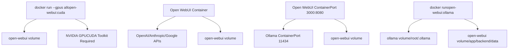
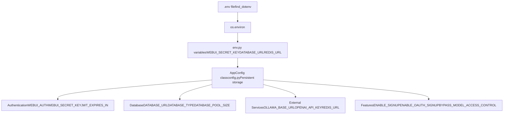
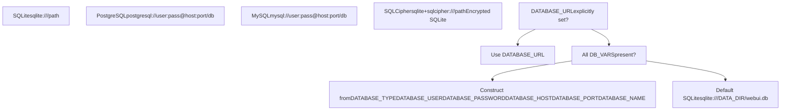
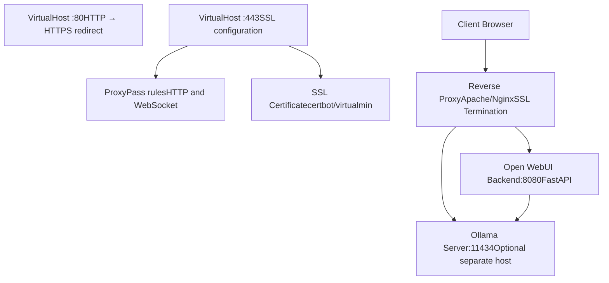

# Installation and Deployment

Relevant source files

-   [LICENSE](https://github.com/open-webui/open-webui/blob/a7271532/LICENSE)
-   [README.md](https://github.com/open-webui/open-webui/blob/a7271532/README.md)
-   [TROUBLESHOOTING.md](https://github.com/open-webui/open-webui/blob/a7271532/TROUBLESHOOTING.md)
-   [backend/open\_webui/env.py](https://github.com/open-webui/open-webui/blob/a7271532/backend/open_webui/env.py)
-   [backend/open\_webui/routers/audio.py](https://github.com/open-webui/open-webui/blob/a7271532/backend/open_webui/routers/audio.py)
-   [backend/open\_webui/routers/auths.py](https://github.com/open-webui/open-webui/blob/a7271532/backend/open_webui/routers/auths.py)
-   [backend/open\_webui/routers/ollama.py](https://github.com/open-webui/open-webui/blob/a7271532/backend/open_webui/routers/ollama.py)
-   [backend/open\_webui/routers/openai.py](https://github.com/open-webui/open-webui/blob/a7271532/backend/open_webui/routers/openai.py)
-   [backend/open\_webui/utils/auth.py](https://github.com/open-webui/open-webui/blob/a7271532/backend/open_webui/utils/auth.py)
-   [backend/open\_webui/utils/embeddings.py](https://github.com/open-webui/open-webui/blob/a7271532/backend/open_webui/utils/embeddings.py)
-   [backend/open\_webui/utils/misc.py](https://github.com/open-webui/open-webui/blob/a7271532/backend/open_webui/utils/misc.py)
-   [backend/open\_webui/utils/oauth.py](https://github.com/open-webui/open-webui/blob/a7271532/backend/open_webui/utils/oauth.py)
-   [backend/open\_webui/utils/response.py](https://github.com/open-webui/open-webui/blob/a7271532/backend/open_webui/utils/response.py)
-   [docs/apache.md](https://github.com/open-webui/open-webui/blob/a7271532/docs/apache.md)
-   [src/lib/components/chat/Settings/About.svelte](https://github.com/open-webui/open-webui/blob/a7271532/src/lib/components/chat/Settings/About.svelte)
-   [src/lib/constants.ts](https://github.com/open-webui/open-webui/blob/a7271532/src/lib/constants.ts)

This document covers installation methods, Docker deployment topologies, environment configuration, and reverse proxy setup for Open WebUI. For detailed architecture information about the frontend, backend, and storage layers, see [Architecture Overview](/open-webui/open-webui/2-architecture-overview). For specific configuration management details, see [Configuration Management](/open-webui/open-webui/11-configuration-management).

---

## Installation Methods

Open WebUI supports two primary installation methods: Python pip installation and Docker containerization. The application consists of a FastAPI backend ([backend/open\_webui/main.py](https://github.com/open-webui/open-webui/blob/a7271532/backend/open_webui/main.py)) and a SvelteKit frontend ([src/](https://github.com/open-webui/open-webui/blob/a7271532/src/)).

### Python pip Installation

Open WebUI can be installed as a Python package, requiring Python 3.11 or higher to avoid compatibility issues:

```
pip install open-webui
open-webui serve
```
This starts the server on `http://localhost:8080` by default. The `open-webui serve` command initializes the FastAPI application defined in [backend/open\_webui/main.py](https://github.com/open-webui/open-webui/blob/a7271532/backend/open_webui/main.py) and serves both the backend API and the pre-built frontend static files from `FRONTEND_BUILD_DIR` ([backend/open\_webui/env.py238-243](https://github.com/open-webui/open-webui/blob/a7271532/backend/open_webui/env.py#L238-L243)).

**Directory Structure**:

-   `DATA_DIR`: Defaults to `backend/data` or `open_webui/data` depending on installation method ([backend/open\_webui/env.py210-232](https://github.com/open-webui/open-webui/blob/a7271532/backend/open_webui/env.py#L210-L232))
-   `FRONTEND_BUILD_DIR`: Location of built frontend assets ([backend/open\_webui/env.py238-243](https://github.com/open-webui/open-webui/blob/a7271532/backend/open_webui/env.py#L238-L243))
-   Database file: `DATA_DIR/webui.db` (SQLite default) ([backend/open\_webui/env.py257](https://github.com/open-webui/open-webui/blob/a7271532/backend/open_webui/env.py#L257-L257))

### Docker Installation

Docker deployment is the recommended production method. All Docker images are hosted at `ghcr.io/open-webui/open-webui` with multiple tags:

| Tag | Description |
| --- | --- |
| `main` | Latest stable release, backend + frontend |
| `ollama` | Bundled with Ollama, single-container deployment |
| `cuda` | NVIDIA CUDA support for GPU acceleration |
| `dev` | Development branch, unstable |

**Key Docker Concepts**:

-   Port mapping: Container port `8080` maps to host port `3000` by default
-   Volume mounting: `-v open-webui:/app/backend/data` persists database and files ([README.md114](https://github.com/open-webui/open-webui/blob/a7271532/README.md#L114-L114))
-   The `OLLAMA_BASE_URL` environment variable configures backend-to-Ollama connection ([backend/open\_webui/env.py](https://github.com/open-webui/open-webui/blob/a7271532/backend/open_webui/env.py))

**Critical volume mount**: The data volume must always be mounted to prevent data loss. The backend expects persistent storage at `/app/backend/data` inside the container.

Sources: [README.md88-106](https://github.com/open-webui/open-webui/blob/a7271532/README.md#L88-L106) [README.md108-167](https://github.com/open-webui/open-webui/blob/a7271532/README.md#L108-L167) [backend/open\_webui/env.py210-243](https://github.com/open-webui/open-webui/blob/a7271532/backend/open_webui/env.py#L210-L243)

---

## Docker Deployment Topologies


### Topology 1: All-in-One Docker (Bundled Ollama)

Single container image combining Open WebUI and Ollama server. Simplest deployment for individual users.

**Docker Command**:

```
# With GPU
docker run -d -p 3000:8080 --gpus=all \
  -v ollama:/root/.ollama \
  -v open-webui:/app/backend/data \
  --name open-webui --restart always \
  ghcr.io/open-webui/open-webui:ollama

# CPU only
docker run -d -p 3000:8080 \
  -v ollama:/root/.ollama \
  -v open-webui:/app/backend/data \
  --name open-webui --restart always \
  ghcr.io/open-webui/open-webui:ollama
```
**Volume Purposes**:

-   `ollama:/root/.ollama`: Stores Ollama models
-   `open-webui:/app/backend/data`: Stores SQLite database, uploads, cache

Sources: [README.md149-167](https://github.com/open-webui/open-webui/blob/a7271532/README.md#L149-L167)

### Topology 2: Separate Containers

Open WebUI and Ollama run in separate containers. Allows Ollama to run on GPU-equipped machines while UI scales horizontally on CPU nodes.

**Docker Commands**:

```
# Ollama on same host
docker run -d -p 3000:8080 \
  --add-host=host.docker.internal:host-gateway \
  -v open-webui:/app/backend/data \
  --name open-webui --restart always \
  ghcr.io/open-webui/open-webui:main

# Ollama on different server
docker run -d -p 3000:8080 \
  -e OLLAMA_BASE_URL=https://example.com \
  -v open-webui:/app/backend/data \
  --name open-webui --restart always \
  ghcr.io/open-webui/open-webui:main
```
**Network Configuration**:

-   `--add-host=host.docker.internal:host-gateway`: Maps `host.docker.internal` to host's gateway, allowing container to reach host-based Ollama at `http://host.docker.internal:11434`
-   Alternative: Use `--network=host` (port changes from 3000 to 8080) ([TROUBLESHOOTING.md13-19](https://github.com/open-webui/open-webui/blob/a7271532/TROUBLESHOOTING.md#L13-L19))

The backend proxies requests from frontend `/ollama` routes to `OLLAMA_BASE_URL` ([backend/open\_webui/routers/ollama.py](https://github.com/open-webui/open-webui/blob/a7271532/backend/open_webui/routers/ollama.py)). For example, a request to `/ollama/api/tags` is forwarded to `{OLLAMA_BASE_URL}/api/tags`.

Sources: [README.md119-133](https://github.com/open-webui/open-webui/blob/a7271532/README.md#L119-L133) [TROUBLESHOOTING.md5-36](https://github.com/open-webui/open-webui/blob/a7271532/TROUBLESHOOTING.md#L5-L36)

### Topology 3: Cloud LLM Only

Open WebUI without Ollama, connecting only to external APIs (OpenAI, Anthropic, etc.).

**Docker Command**:

```
docker run -d -p 3000:8080 \
  -e OPENAI_API_KEY=your_secret_key \
  -v open-webui:/app/backend/data \
  --name open-webui --restart always \
  ghcr.io/open-webui/open-webui:main
```
The backend aggregates models from configured API endpoints via `get_all_models()` ([backend/open\_webui/routers/openai.py343-453](https://github.com/open-webui/open-webui/blob/a7271532/backend/open_webui/routers/openai.py#L343-L453)). Each API endpoint can be configured with:

-   `OPENAI_API_BASE_URLS`: List of base URLs ([backend/open\_webui/routers/openai.py211](https://github.com/open-webui/open-webui/blob/a7271532/backend/open_webui/routers/openai.py#L211-L211))
-   `OPENAI_API_KEYS`: Corresponding API keys ([backend/open\_webui/routers/openai.py212](https://github.com/open-webui/open-webui/blob/a7271532/backend/open_webui/routers/openai.py#L212-L212))
-   `OPENAI_API_CONFIGS`: Per-endpoint configuration ([backend/open\_webui/routers/openai.py213](https://github.com/open-webui/open-webui/blob/a7271532/backend/open_webui/routers/openai.py#L213-L213))

Sources: [README.md141-147](https://github.com/open-webui/open-webui/blob/a7271532/README.md#L141-L147) [backend/open\_webui/routers/openai.py207-265](https://github.com/open-webui/open-webui/blob/a7271532/backend/open_webui/routers/openai.py#L207-L265)

### Topology 4: GPU Support

Enables CUDA acceleration for local inference or embeddings. Requires [Nvidia CUDA container toolkit](https://docs.nvidia.com/dgx/nvidia-container-runtime-upgrade/) installed on Linux/WSL.

**Docker Command**:

```
docker run -d -p 3000:8080 --gpus all \
  --add-host=host.docker.internal:host-gateway \
  -v open-webui:/app/backend/data \
  --name open-webui --restart always \
  ghcr.io/open-webui/open-webui:cuda
```
GPU detection and configuration occurs in [backend/open\_webui/env.py44-69](https://github.com/open-webui/open-webui/blob/a7271532/backend/open_webui/env.py#L44-L69):

-   `USE_CUDA_DOCKER` environment variable triggers CUDA detection
-   Falls back to `cpu` if CUDA unavailable
-   Automatically detects Apple Silicon MPS backend

Sources: [README.md117-139](https://github.com/open-webui/open-webui/blob/a7271532/README.md#L117-L139) [backend/open\_webui/env.py44-69](https://github.com/open-webui/open-webui/blob/a7271532/backend/open_webui/env.py#L44-L69)

---

## Environment Configuration


### Core Environment Variables

Environment variables are loaded via `dotenv` from a `.env` file in `BASE_DIR` ([backend/open\_webui/env.py34-39](https://github.com/open-webui/open-webui/blob/a7271532/backend/open_webui/env.py#L34-L39)). All variables are accessed through `os.environ.get()` with defaults.

**Critical Variables**:

| Variable | Default | Purpose |
| --- | --- | --- |
| `WEBUI_SECRET_KEY` | `t0p-s3cr3t` | JWT signing key, **must be changed in production** |
| `DATABASE_URL` | `sqlite:///DATA_DIR/webui.db` | Database connection string |
| `OLLAMA_BASE_URL` | None | Backend-to-Ollama connection URL |
| `REDIS_URL` | `""` | Redis connection for distributed deployments |
| `DATA_DIR` | `backend/data` | Data storage directory |

Sources: [backend/open\_webui/env.py20-40](https://github.com/open-webui/open-webui/blob/a7271532/backend/open_webui/env.py#L20-L40) [backend/open\_webui/env.py450-455](https://github.com/open-webui/open-webui/blob/a7271532/backend/open_webui/env.py#L450-L455)

### Database Configuration


**Database URL Construction** ([backend/open\_webui/env.py257-286](https://github.com/open-webui/open-webui/blob/a7271532/backend/open_webui/env.py#L257-L286)):

1.  If `DATABASE_URL` is explicitly set, use it
2.  Else if all of `DATABASE_TYPE`, `DATABASE_USER`, `DATABASE_PASSWORD`, `DATABASE_HOST`, `DATABASE_PORT`, `DATABASE_NAME` are set, construct URL
3.  Else default to SQLite at `sqlite:///{DATA_DIR}/webui.db`

**PostgreSQL Example**:

```
DATABASE_TYPE=postgresql
DATABASE_USER=openwebui
DATABASE_PASSWORD=secret
DATABASE_HOST=localhost
DATABASE_PORT=5432
DATABASE_NAME=openwebui
```
**Connection Pool Settings** ([backend/open\_webui/env.py289-325](https://github.com/open-webui/open-webui/blob/a7271532/backend/open_webui/env.py#L289-L325)):

-   `DATABASE_POOL_SIZE`: Connection pool size (default: None, uses SQLAlchemy defaults)
-   `DATABASE_POOL_MAX_OVERFLOW`: Max overflow connections (default: 0)
-   `DATABASE_POOL_TIMEOUT`: Connection timeout in seconds (default: 30)
-   `DATABASE_POOL_RECYCLE`: Connection recycling in seconds (default: 3600)

Sources: [backend/open\_webui/env.py246-330](https://github.com/open-webui/open-webui/blob/a7271532/backend/open_webui/env.py#L246-L330)

### Redis Configuration

Redis is optional but required for distributed deployments with multiple workers or WebSocket support across nodes.

**Redis Variables** ([backend/open\_webui/env.py358-383](https://github.com/open-webui/open-webui/blob/a7271532/backend/open_webui/env.py#L358-L383)):

```
REDIS_URL=redis://localhost:6379
REDIS_CLUSTER=False  # Set to True for Redis Cluster
REDIS_KEY_PREFIX=open-webui
REDIS_SENTINEL_HOSTS=""  # Comma-separated host list for Sentinel
REDIS_SENTINEL_PORT=26379
REDIS_SOCKET_CONNECT_TIMEOUT=""  # Connection timeout (float)
```
**Use Cases**:

-   Token revocation tracking ([backend/open\_webui/utils/auth.py213-247](https://github.com/open-webui/open-webui/blob/a7271532/backend/open_webui/utils/auth.py#L213-L247))
-   WebSocket message distribution ([backend/open\_webui/env.py611-668](https://github.com/open-webui/open-webui/blob/a7271532/backend/open_webui/env.py#L611-L668))
-   Session storage
-   Rate limiting ([backend/open\_webui/routers/auths.py84-86](https://github.com/open-webui/open-webui/blob/a7271532/backend/open_webui/routers/auths.py#L84-L86))

Sources: [backend/open\_webui/env.py358-383](https://github.com/open-webui/open-webui/blob/a7271532/backend/open_webui/env.py#L358-L383) [backend/open\_webui/env.py611-668](https://github.com/open-webui/open-webui/blob/a7271532/backend/open_webui/env.py#L611-L668)

### Authentication Configuration

**JWT Settings** ([backend/open\_webui/env.py400-476](https://github.com/open-webui/open-webui/blob/a7271532/backend/open_webui/env.py#L400-L476)):

```
WEBUI_AUTH=True  # Enable authentication (required for security)
WEBUI_SECRET_KEY=your-secret-key  # JWT signing key
WEBUI_SESSION_COOKIE_SAME_SITE=lax  # Cookie SameSite attribute
WEBUI_SESSION_COOKIE_SECURE=false  # HTTPS-only cookies
ENABLE_SIGNUP=True  # Allow new user registration
```
**OAuth Configuration** ([backend/open\_webui/env.py483-500](https://github.com/open-webui/open-webui/blob/a7271532/backend/open_webui/env.py#L483-L500)):

```
ENABLE_OAUTH_SIGNUP=True
OAUTH_CLIENT_INFO_ENCRYPTION_KEY=your-encryption-key
OAUTH_PROVIDERS='[{"id": "google", "name": "Google", ...}]'
```
OAuth implementation uses dynamic client registration ([backend/open\_webui/utils/oauth.py284-400](https://github.com/open-webui/open-webui/blob/a7271532/backend/open_webui/utils/oauth.py#L284-L400)) supporting multiple providers (Google, Microsoft, GitHub, generic OIDC).

**LDAP Configuration**:

```
ENABLE_LDAP=True
LDAP_SERVER_HOST=ldap.example.com
LDAP_SERVER_PORT=389
LDAP_SEARCH_BASE=dc=example,dc=com
LDAP_APP_DN=cn=admin,dc=example,dc=com
LDAP_APP_PASSWORD=secret
```
LDAP authentication handler in [backend/open\_webui/routers/auths.py216-503](https://github.com/open-webui/open-webui/blob/a7271532/backend/open_webui/routers/auths.py#L216-L503)

Sources: [backend/open\_webui/env.py400-509](https://github.com/open-webui/open-webui/blob/a7271532/backend/open_webui/env.py#L400-L509) [backend/open\_webui/utils/oauth.py284-400](https://github.com/open-webui/open-webui/blob/a7271532/backend/open_webui/utils/oauth.py#L284-L400) [backend/open\_webui/routers/auths.py216-503](https://github.com/open-webui/open-webui/blob/a7271532/backend/open_webui/routers/auths.py#L216-L503)

### External Service Configuration

**Ollama** ([backend/open\_webui/routers/ollama.py267-303](https://github.com/open-webui/open-webui/blob/a7271532/backend/open_webui/routers/ollama.py#L267-L303)):

```
ENABLE_OLLAMA_API=True
OLLAMA_BASE_URLS='["http://localhost:11434"]'  # JSON array
OLLAMA_API_CONFIGS='{}'  # Per-URL configuration
```
**OpenAI-Compatible APIs** ([backend/open\_webui/routers/openai.py207-265](https://github.com/open-webui/open-webui/blob/a7271532/backend/open_webui/routers/openai.py#L207-L265)):

```
ENABLE_OPENAI_API=True
OPENAI_API_BASE_URLS='["https://api.openai.com/v1"]'
OPENAI_API_KEYS='["sk-..."]'
OPENAI_API_CONFIGS='{}'
```
**Audio Processing**:

```
# Text-to-Speech (<FileRef file-url="https://github.com/open-webui/open-webui/blob/a7271532/backend/open_webui/routers/audio.py#L155-L167" min=155 max=167 file-path="backend/open_webui/routers/audio.py">Hii</FileRef>)
TTS_ENGINE=openai  # openai, elevenlabs, azure, transformers
TTS_OPENAI_API_BASE_URL=https://api.openai.com/v1
TTS_OPENAI_API_KEY=sk-...

# Speech-to-Text (<FileRef file-url="https://github.com/open-webui/open-webui/blob/a7271532/backend/open_webui/routers/audio.py#L169-L185" min=169 max=185 file-path="backend/open_webui/routers/audio.py">Hii</FileRef>)
STT_ENGINE=openai  # "", openai, whisper, deepgram, azure, mistral
WHISPER_MODEL=base  # For local Whisper
```
Sources: [backend/open\_webui/env.py](https://github.com/open-webui/open-webui/blob/a7271532/backend/open_webui/env.py) [backend/open\_webui/routers/ollama.py267-303](https://github.com/open-webui/open-webui/blob/a7271532/backend/open_webui/routers/ollama.py#L267-L303) [backend/open\_webui/routers/openai.py207-265](https://github.com/open-webui/open-webui/blob/a7271532/backend/open_webui/routers/openai.py#L207-L265) [backend/open\_webui/routers/audio.py155-190](https://github.com/open-webui/open-webui/blob/a7271532/backend/open_webui/routers/audio.py#L155-L190)

### Feature Flags

**Model and Content Control**:

```
BYPASS_MODEL_ACCESS_CONTROL=False  # Skip model RBAC
ENABLE_CUSTOM_MODEL_FALLBACK=False  # Allow undefined models
MODELS_CACHE_TTL=1  # Model list cache TTL in seconds
```
**WebSocket Configuration** ([backend/open\_webui/env.py611-668](https://github.com/open-webui/open-webui/blob/a7271532/backend/open_webui/env.py#L611-L668)):

```
ENABLE_WEBSOCKET_SUPPORT=True
WEBSOCKET_MANAGER=""  # Leave empty for local, set for distributed
WEBSOCKET_REDIS_URL=$REDIS_URL
WEBSOCKET_REDIS_CLUSTER=False
WEBSOCKET_SERVER_PING_TIMEOUT=20
WEBSOCKET_SERVER_PING_INTERVAL=25
```
**Observability** ([backend/open\_webui/env.py808-875](https://github.com/open-webui/open-webui/blob/a7271532/backend/open_webui/env.py#L808-L875)):

```
# OpenTelemetry
ENABLE_OTEL=False
ENABLE_OTEL_TRACES=False
ENABLE_OTEL_METRICS=False
OTEL_EXPORTER_OTLP_ENDPOINT=http://localhost:4317

# Audit Logging
AUDIT_LOG_LEVEL=NONE  # NONE, METADATA, REQUEST, REQUEST_RESPONSE
AUDIT_LOGS_FILE_PATH=DATA_DIR/audit.log
```
Sources: [backend/open\_webui/env.py542-606](https://github.com/open-webui/open-webui/blob/a7271532/backend/open_webui/env.py#L542-L606) [backend/open\_webui/env.py611-716](https://github.com/open-webui/open-webui/blob/a7271532/backend/open_webui/env.py#L611-L716) [backend/open\_webui/env.py778-875](https://github.com/open-webui/open-webui/blob/a7271532/backend/open_webui/env.py#L778-L875)

---

## Reverse Proxy Setup


Production deployments typically use Apache or Nginx as reverse proxy for SSL termination, load balancing, and security.

### Apache Configuration

**HTTP to HTTPS Virtual Host** ([docs/apache.md12-24](https://github.com/open-webui/open-webui/blob/a7271532/docs/apache.md#L12-L24)):

```
<VirtualHost 192.168.1.100:80>
    ServerName server.com
    DocumentRoot /home/server/public_html

    ProxyPass / http://server.com:3000/ nocanon
    ProxyPassReverse / http://server.com:3000/

    # WebSocket support (required for Open WebUI 0.5+)
    ProxyPass / ws://server.com:3000/ nocanon
    ProxyPassReverse / ws://server.com:3000/
</VirtualHost>
```
**SSL Virtual Host** ([docs/apache.md31-49](https://github.com/open-webui/open-webui/blob/a7271532/docs/apache.md#L31-L49)):

```
<VirtualHost 192.168.1.100:443>
    ServerName server.com
    DocumentRoot /home/server/public_html

    ProxyPass / http://server.com:3000/ nocanon
    ProxyPassReverse / http://server.com:3000/

    # WebSocket support
    ProxyPass / ws://server.com:3000/ nocanon
    ProxyPassReverse / ws://server.com:3000/

    SSLEngine on
    SSLCertificateFile /etc/ssl/virtualmin/170514456861234/ssl.cert
    SSLCertificateKeyFile /etc/ssl/virtualmin/170514456861234/ssl.key
    SSLProtocol all -SSLv2 -SSLv3 -TLSv1 -TLSv1.1

    SSLProxyEngine on
    SSLCACertificateFile /etc/ssl/virtualmin/170514456865864/ssl.ca
</VirtualHost>
```
**Key Configuration Points**:

-   `ProxyPass` with `nocanon` flag: Prevents URL decoding/reencoding which can break API paths
-   WebSocket proxying: Required for real-time features (added in Open WebUI 0.5+)
-   SSL protocol restrictions: Disables insecure protocols (SSLv2, SSLv3, TLSv1, TLSv1.1)
-   `SSLProxyEngine on`: Required when proxying to HTTPS backends

**Enable site and request SSL certificate**:

```
# Enable the site
a2ensite server.com.conf

# Request SSL certificate with certbot
snap install certbot --classic
snap apt install python3-certbot-apache
cd /etc/apache2/sites-available/
certbot --apache -d server.com
```
This creates `server.com-le-ssl.conf` with SSL configuration.

Sources: [docs/apache.md8-68](https://github.com/open-webui/open-webui/blob/a7271532/docs/apache.md#L8-L68)

### Separate Ollama Server Proxy

When hosting Ollama on a separate server, configure additional proxy ([docs/apache.md118-154](https://github.com/open-webui/open-webui/blob/a7271532/docs/apache.md#L118-L154)):

```
<VirtualHost 192.168.254.109:443>
    DocumentRoot "/var/www/html/"
    ServerName models.server.city

    <Directory "/var/www/html/">
        Options None
        Require all granted
    </Directory>

    ProxyRequests Off
    ProxyPreserveHost On
    ProxyAddHeaders On
    SSLProxyEngine on

    ProxyPass / http://server.city:11434/ nocanon
    ProxyPassReverse / http://server.city:11434/

    SSLCertificateFile /etc/letsencrypt/live/models.server.city/fullchain.pem
    SSLCertificateKeyFile /etc/letsencrypt/live/models.server.city/privkey.pem
    Include /etc/letsencrypt/options-ssl-apache.conf
</VirtualHost>
```
**Ollama systemd service configuration** ([docs/apache.md77-111](https://github.com/open-webui/open-webui/blob/a7271532/docs/apache.md#L77-L111)):

```
sudo nano /etc/systemd/system/ollama.service
```
Add environment variables:

```
[Service]
ExecStart=/usr/local/bin/ollama serve
Environment="OLLAMA_HOST=0.0.0.0:11434"
Environment="OLLAMA_ORIGINS=http://192.168.254.106:11434,https://models.server.city"
User=ollama
Group=ollama
```
Then:

```
systemctl daemon-reload
systemctl restart ollama
```
Sources: [docs/apache.md70-194](https://github.com/open-webui/open-webui/blob/a7271532/docs/apache.md#L70-L194)

### Nginx Configuration

For Nginx deployments, equivalent configuration:

```
server {
    listen 80;
    server_name server.com;
    return 301 https://$server_name$request_uri;
}

server {
    listen 443 ssl http2;
    server_name server.com;

    ssl_certificate /etc/letsencrypt/live/server.com/fullchain.pem;
    ssl_certificate_key /etc/letsencrypt/live/server.com/privkey.pem;

    location / {
        proxy_pass http://localhost:3000;
        proxy_http_version 1.1;
        proxy_set_header Upgrade $http_upgrade;
        proxy_set_header Connection "upgrade";
        proxy_set_header Host $host;
        proxy_set_header X-Real-IP $remote_addr;
        proxy_set_header X-Forwarded-For $proxy_add_x_forwarded_for;
        proxy_set_header X-Forwarded-Proto $scheme;
    }
}
```
**Critical Nginx directives**:

-   `proxy_http_version 1.1`: Required for WebSocket support
-   `Upgrade` and `Connection` headers: Enable WebSocket upgrade
-   `X-Forwarded-*` headers: Preserve client information through proxy

Sources: [TROUBLESHOOTING.md5-36](https://github.com/open-webui/open-webui/blob/a7271532/TROUBLESHOOTING.md#L5-L36)

---

## Post-Installation Configuration

After deployment, configure the application through the web interface or environment variables:

1.  **Initial Admin Account**: First signup creates admin user ([backend/open\_webui/routers/auths.py642-684](https://github.com/open-webui/open-webui/blob/a7271532/backend/open_webui/routers/auths.py#L642-L684))
2.  **Model Configuration**: Add Ollama/OpenAI endpoints via Settings > Admin > Connections
3.  **Storage Backend**: Configure `STORAGE_PROVIDER` (local, s3, gcs, azure)
4.  **Vector Database**: Set `VECTOR_DB_TYPE` for RAG (chromadb, qdrant, milvus, etc.)

The backend serves the frontend from `FRONTEND_BUILD_DIR` ([backend/open\_webui/env.py238-243](https://github.com/open-webui/open-webui/blob/a7271532/backend/open_webui/env.py#L238-L243)), with API routes mounted at `/api/v1`, `/ollama`, and `/openai` ([backend/open\_webui/main.py](https://github.com/open-webui/open-webui/blob/a7271532/backend/open_webui/main.py)).

Sources: [backend/open\_webui/env.py238-243](https://github.com/open-webui/open-webui/blob/a7271532/backend/open_webui/env.py#L238-L243) [backend/open\_webui/routers/auths.py642-684](https://github.com/open-webui/open-webui/blob/a7271532/backend/open_webui/routers/auths.py#L642-L684)
