# Installation Methods

Relevant source files

-   [.github/workflows/integration-test.disabled](https://github.com/open-webui/open-webui/blob/a7271532/.github/workflows/integration-test.disabled)
-   [LICENSE](https://github.com/open-webui/open-webui/blob/a7271532/LICENSE)
-   [README.md](https://github.com/open-webui/open-webui/blob/a7271532/README.md)
-   [TROUBLESHOOTING.md](https://github.com/open-webui/open-webui/blob/a7271532/TROUBLESHOOTING.md)
-   [backend/open\_webui/storage/provider.py](https://github.com/open-webui/open-webui/blob/a7271532/backend/open_webui/storage/provider.py)
-   [backend/open\_webui/test/apps/webui/storage/test\_provider.py](https://github.com/open-webui/open-webui/blob/a7271532/backend/open_webui/test/apps/webui/storage/test_provider.py)
-   [backend/requirements-min.txt](https://github.com/open-webui/open-webui/blob/a7271532/backend/requirements-min.txt)
-   [backend/requirements.txt](https://github.com/open-webui/open-webui/blob/a7271532/backend/requirements.txt)
-   [docker-compose.playwright.yaml](https://github.com/open-webui/open-webui/blob/a7271532/docker-compose.playwright.yaml)
-   [docs/apache.md](https://github.com/open-webui/open-webui/blob/a7271532/docs/apache.md)
-   [pyproject.toml](https://github.com/open-webui/open-webui/blob/a7271532/pyproject.toml)
-   [src/lib/components/chat/Settings/About.svelte](https://github.com/open-webui/open-webui/blob/a7271532/src/lib/components/chat/Settings/About.svelte)
-   [src/lib/constants.ts](https://github.com/open-webui/open-webui/blob/a7271532/src/lib/constants.ts)
-   [uv.lock](https://github.com/open-webui/open-webui/blob/a7271532/uv.lock)

## Purpose and Scope

This page documents the three primary installation methods for Open WebUI: Python pip installation, Docker container deployment, and local development setup. Each method has different requirements and use cases. For information about specific Docker deployment topologies (bundled Ollama, GPU support, cloud-only), see [Docker Deployment Options](/open-webui/open-webui/3.2-docker-deployment-options). For environment variable configuration, see [Environment Configuration](/open-webui/open-webui/3.3-environment-configuration). For detailed development workflows, see [Development Environment Setup](/open-webui/open-webui/18.1-development-environment-setup).

---

## Installation Overview


**Installation Method Decision Tree**

Sources: [README.md86-176](https://github.com/open-webui/open-webui/blob/a7271532/README.md#L86-L176) [pyproject.toml1-210](https://github.com/open-webui/open-webui/blob/a7271532/pyproject.toml#L1-L210)

---

## Python Version Requirements

Open WebUI requires **Python 3.11 or 3.12**. Python 3.13 is explicitly excluded due to dependency compatibility.


**Python Version Compatibility Matrix**

The version constraint is defined in `pyproject.toml`:

| Configuration | Value |
| --- | --- |
| Minimum Version | `>= 3.11` |
| Maximum Version | `< 3.13.0a1` |
| Supported Versions | 3.11.x, 3.12.x |

Sources: [pyproject.toml122](https://github.com/open-webui/open-webui/blob/a7271532/pyproject.toml#L122-L122) [uv.lock3](https://github.com/open-webui/open-webui/blob/a7271532/uv.lock#L3-L3)

---

## Installation Method 1: pip Package Installation

### Installation Command

The simplest installation method uses Python's package manager:

```
pip install open-webui
```
This installs the `open-webui` package from PyPI, which includes all required dependencies defined in [backend/requirements.txt1-156](https://github.com/open-webui/open-webui/blob/a7271532/backend/requirements.txt#L1-L156)

### Package Configuration

The package is configured via `pyproject.toml` with the following structure:


**Package Architecture and Dependencies**

Sources: [pyproject.toml1-210](https://github.com/open-webui/open-webui/blob/a7271532/pyproject.toml#L1-L210) [backend/requirements.txt1-156](https://github.com/open-webui/open-webui/blob/a7271532/backend/requirements.txt#L1-L156)

### Starting the Server

After installation, start Open WebUI using the console script entry point:

```
open-webui serve
```
This command is mapped to `open_webui:app` in [pyproject.toml165](https://github.com/open-webui/open-webui/blob/a7271532/pyproject.toml#L165-L165) The server starts on port **8080** by default and can be accessed at `http://localhost:8080`.

### Key Characteristics

| Aspect | Detail |
| --- | --- |
| Installation Target | System or virtual environment |
| Dependencies | ~150+ packages automatically installed |
| Data Directory | `./data` in working directory |
| Port | 8080 (default) |
| Process Management | Manual (foreground process) |
| Updates | `pip install --upgrade open-webui` |

Sources: [README.md88-106](https://github.com/open-webui/open-webui/blob/a7271532/README.md#L88-L106) [pyproject.toml164-165](https://github.com/open-webui/open-webui/blob/a7271532/pyproject.toml#L164-L165)

---

## Installation Method 2: Docker Container Deployment

### Base Docker Command Structure


**Docker Command Component Breakdown**

### Docker Image Tags

Open WebUI provides multiple image variants:

| Tag | Purpose | Size | Use Case |
| --- | --- | --- | --- |
| `:main` | Stable release | Smaller | Production deployments |
| `:ollama` | Bundled with Ollama | Larger | All-in-one single-container setup |
| `:cuda` | NVIDIA GPU support | Largest | GPU-accelerated inference |
| `:dev` | Development branch | Variable | Testing unreleased features |

### Standard Installation (Separate Ollama)

When Ollama runs on the same host:

```
docker run -d \
  -p 3000:8080 \
  --add-host=host.docker.internal:host-gateway \
  -v open-webui:/app/backend/data \
  --name open-webui \
  --restart always \
  ghcr.io/open-webui/open-webui:main
```
**Key flags:**

-   `-p 3000:8080`: Maps container port 8080 to host port 3000
-   `--add-host=host.docker.internal:host-gateway`: Allows container to reach host network (for Ollama at `localhost:11434`)
-   `-v open-webui:/app/backend/data`: **Critical** - persists database and uploaded files

### Remote Ollama Server

When Ollama runs on a different server:

```
docker run -d \
  -p 3000:8080 \
  -e OLLAMA_BASE_URL=https://ollama.example.com \
  -v open-webui:/app/backend/data \
  --name open-webui \
  --restart always \
  ghcr.io/open-webui/open-webui:main
```
### OpenAI API Only

For cloud LLM providers without local Ollama:

```
docker run -d \
  -p 3000:8080 \
  -e OPENAI_API_KEY=your_secret_key \
  -v open-webui:/app/backend/data \
  --name open-webui \
  --restart always \
  ghcr.io/open-webui/open-webui:main
```
### GPU Support

For NVIDIA GPU acceleration (requires [NVIDIA Container Toolkit](https://docs.nvidia.com/dgx/nvidia-container-runtime-upgrade/)):

```
docker run -d \
  -p 3000:8080 \
  --gpus all \
  --add-host=host.docker.internal:host-gateway \
  -v open-webui:/app/backend/data \
  --name open-webui \
  --restart always \
  ghcr.io/open-webui/open-webui:cuda
```
### Bundled Ollama Installation

Single-container deployment with integrated Ollama:

```
# With GPU
docker run -d \
  -p 3000:8080 \
  --gpus=all \
  -v ollama:/root/.ollama \
  -v open-webui:/app/backend/data \
  --name open-webui \
  --restart always \
  ghcr.io/open-webui/open-webui:ollama

# CPU Only
docker run -d \
  -p 3000:8080 \
  -v ollama:/root/.ollama \
  -v open-webui:/app/backend/data \
  --name open-webui \
  --restart always \
  ghcr.io/open-webui/open-webui:ollama
```
**Note:** This image requires two volumes: `ollama` for model storage and `open-webui` for application data.

### Docker Volume Persistence


**Critical Volume Mount for Data Persistence**

The volume mount `-v open-webui:/app/backend/data` is **mandatory** for data persistence. Without it:

-   Database is ephemeral
-   Uploaded files are lost
-   Configuration resets on container recreation

Sources: [README.md108-169](https://github.com/open-webui/open-webui/blob/a7271532/README.md#L108-L169) [TROUBLESHOOTING.md11-19](https://github.com/open-webui/open-webui/blob/a7271532/TROUBLESHOOTING.md#L11-L19)

---

## Installation Method 3: Development Setup

### Development Architecture


**Development Environment Request Flow**

### Prerequisites

-   **Node.js** and **npm** (for frontend)
-   **Python 3.11 or 3.12** (for backend)
-   **Ollama** (optional, for local LLM inference)

### Frontend Setup

1.  Install dependencies:

```
npm install
```
2.  Start development server:

```
npm run dev
```
The frontend server starts on port **5173** with hot module replacement enabled. The Vite configuration proxies API requests to the backend at `localhost:8080`:

Sources: [src/lib/constants.ts6-7](https://github.com/open-webui/open-webui/blob/a7271532/src/lib/constants.ts#L6-L7)

### Backend Setup

1.  Install Python dependencies:

```
pip install -r backend/requirements.txt
```
For minimal installation (core functionality only):

```
pip install -r backend/requirements-min.txt
```
2.  Start backend server:

```
open-webui serve
```
Or directly with uvicorn:

```
cd backend
uvicorn open_webui.main:app --port 8080 --reload
```
The `--reload` flag enables auto-restart on code changes.

### Development Configuration

| Component | Port | Hot Reload | Command |
| --- | --- | --- | --- |
| Frontend (Vite) | 5173 | Yes | `npm run dev` |
| Backend (FastAPI) | 8080 | Yes (with `--reload`) | `open-webui serve` or `uvicorn` |
| Access URL | 5173 | \- | `http://localhost:5173` |

### Environment Variables for Development

Create a `.env` file in the backend directory:

```
# Backend configuration
WEBUI_SECRET_KEY=development-secret-key
GLOBAL_LOG_LEVEL=debug

# LLM Provider
OLLAMA_BASE_URL=http://localhost:11434

# Database (optional, defaults to SQLite)
DATABASE_URL=sqlite:///./webui.db

# Storage (optional, defaults to local)
STORAGE_PROVIDER=local
UPLOAD_DIR=./data/uploads
```
Sources: [README.md175](https://github.com/open-webui/open-webui/blob/a7271532/README.md#L175-L175) [backend/requirements.txt1-156](https://github.com/open-webui/open-webui/blob/a7271532/backend/requirements.txt#L1-L156) [backend/requirements-min.txt1-52](https://github.com/open-webui/open-webui/blob/a7271532/backend/requirements-min.txt#L1-L52)

---

## Installation Verification

### Version Checking

The application exposes version information through the UI and API:

```mermaid
flowchart TD
    PackageJSON["package.jsonversion field"]
    BuildHash["Git commit hashAPP_BUILD_HASH"]
    Constants["constants.tsWEBUI_VERSIONWEBUI_BUILD_HASH"]
    AboutUI["About.svelteUI Display"]
    VersionAPI["GET /api/versionAPI Endpoint"]
    User["User sees versionin Settings"]
    AutoUpdate["Version update check"]

    PackageJSON --> Constants
    BuildHash --> Constants
    Constants --> AboutUI
    Constants --> VersionAPI
    AboutUI --> User
    VersionAPI --> AutoUpdate
```


**Version Information Flow**

The version is defined in `package.json` and exposed through:

-   **UI**: Settings → About → "Open WebUI Version" section
-   **API**: `/api/version` endpoint
-   **Constants**: `WEBUI_VERSION` and `WEBUI_BUILD_HASH` in [src/lib/constants.ts16-17](https://github.com/open-webui/open-webui/blob/a7271532/src/lib/constants.ts#L16-L17)

### Health Check Endpoints

| Endpoint | Purpose | Expected Response |
| --- | --- | --- |
| `/health` | Application health | `{"status": "ok"}` |
| `/health/db` | Database connectivity | `{"status": "ok"}` |
| `/api/config` | Configuration loaded | Config object |

### Testing Installation

#### pip Installation Test

```
# Start server
open-webui serve

# In another terminal, test endpoint
curl http://localhost:8080/api/config
```
#### Docker Installation Test

```
# Check container status
docker ps | grep open-webui

# Check logs
docker logs open-webui

# Test endpoint
curl http://localhost:3000/api/config
```
#### Development Setup Test

```
# Frontend accessible
curl http://localhost:5173

# Backend API accessible
curl http://localhost:8080/api/config

# Check Ollama connectivity (if installed)
curl http://localhost:11434/api/tags
```
Sources: [src/lib/components/chat/Settings/About.svelte1-177](https://github.com/open-webui/open-webui/blob/a7271532/src/lib/components/chat/Settings/About.svelte#L1-L177) [.github/workflows/integration-test.disabled156-210](https://github.com/open-webui/open-webui/blob/a7271532/.github/workflows/integration-test.disabled#L156-L210)

---

## Post-Installation Configuration

After successful installation, configure:

1.  **LLM Provider Connection**: Set `OLLAMA_BASE_URL` or API keys (see [Environment Configuration](/open-webui/open-webui/3.3-environment-configuration))
2.  **Storage Backend**: Configure local or cloud storage (see [Data and Storage Layer](/open-webui/open-webui/2.4-data-and-storage-layer))
3.  **Authentication**: Set up user management and access control (see [Authentication Methods](/open-webui/open-webui/10.1-authentication-methods))
4.  **Reverse Proxy**: For production deployments behind Apache/Nginx (see [Reverse Proxy Setup](/open-webui/open-webui/3.4-reverse-proxy-setup))

---

## Troubleshooting Common Installation Issues

### Connection Errors with Ollama

**Symptom**: "Unable to connect to Ollama server"

**Solution for Docker installations**:

```
# Use --network=host for direct host network access
docker run -d --network=host \
  -v open-webui:/app/backend/data \
  -e OLLAMA_BASE_URL=http://127.0.0.1:11434 \
  --name open-webui \
  --restart always \
  ghcr.io/open-webui/open-webui:main
```
**Note**: With `--network=host`, the port changes from 3000 to 8080, so access at `http://localhost:8080`.

### Missing Data After Container Restart

**Cause**: Volume not mounted

**Solution**: Always include `-v open-webui:/app/backend/data` in Docker commands

### Python Version Incompatibility

**Symptom**: Installation fails with dependency errors

**Solution**: Verify Python version:

```
python --version  # Should be 3.11.x or 3.12.x
```
If wrong version, use virtual environment or pyenv:

```
# Using venv
python3.11 -m venv venv
source venv/bin/activate
pip install open-webui
```
### Offline Installation

For air-gapped environments, set `HF_HUB_OFFLINE=1` to prevent Hugging Face model downloads:

```
export HF_HUB_OFFLINE=1
docker run -d -p 3000:8080 \
  -e HF_HUB_OFFLINE=1 \
  -v open-webui:/app/backend/data \
  --name open-webui \
  ghcr.io/open-webui/open-webui:main
```
Sources: [README.md178-212](https://github.com/open-webui/open-webui/blob/a7271532/README.md#L178-L212) [TROUBLESHOOTING.md1-36](https://github.com/open-webui/open-webui/blob/a7271532/TROUBLESHOOTING.md#L1-L36)

---

## Installation Comparison Matrix

| Feature | pip Install | Docker Standard | Docker Bundled | Development |
| --- | --- | --- | --- | --- |
| **Complexity** | Low | Medium | Low | High |
| **Isolation** | None | Full | Full | None |
| **Update Process** | `pip install -U` | `docker pull` | `docker pull` | `git pull` |
| **Data Persistence** | Local filesystem | Docker volume | Docker volume | Local filesystem |
| **Resource Usage** | Minimal | Medium | High | Medium |
| **Ollama Integration** | Separate | Separate | Bundled | Separate |
| **GPU Support** | Native | With `:cuda` tag | With `--gpus` flag | Native |
| **Port** | 8080 | 3000 → 8080 | 3000 → 8080 | 5173 (frontend), 8080 (backend) |
| **Best For** | Testing, simple setups | Production, isolated | Quick start | Contributing code |

Sources: [README.md86-176](https://github.com/open-webui/open-webui/blob/a7271532/README.md#L86-L176) [pyproject.toml1-210](https://github.com/open-webui/open-webui/blob/a7271532/pyproject.toml#L1-L210) [backend/requirements.txt1-156](https://github.com/open-webui/open-webui/blob/a7271532/backend/requirements.txt#L1-L156)
