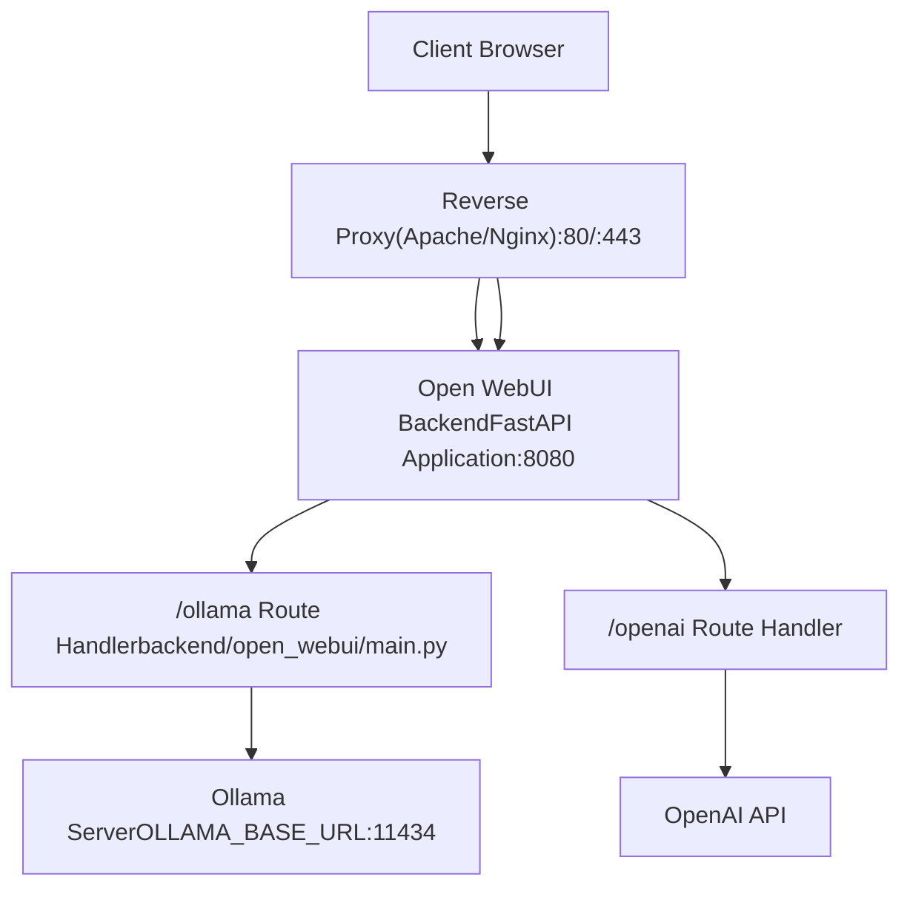
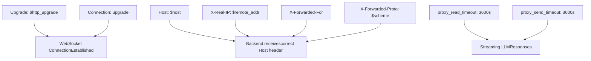
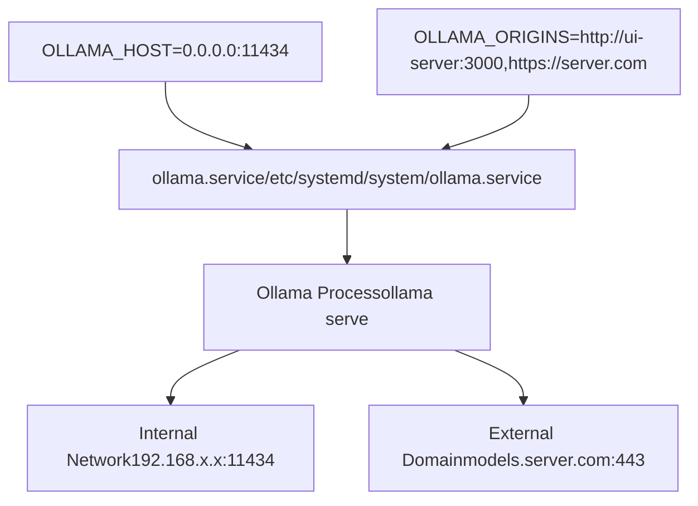
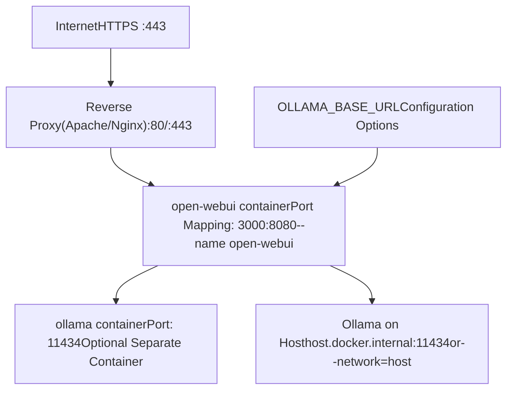
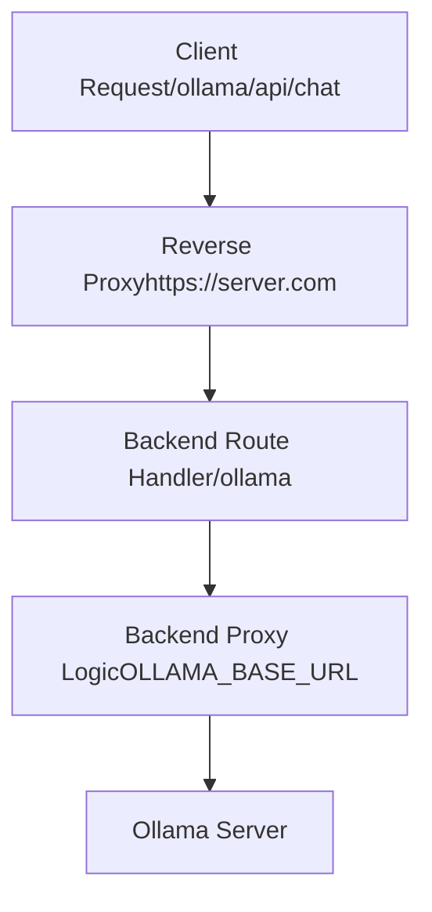

# Reverse Proxy Setup

Relevant source files

-   [LICENSE](https://github.com/open-webui/open-webui/blob/a7271532/LICENSE)
-   [README.md](https://github.com/open-webui/open-webui/blob/a7271532/README.md)
-   [TROUBLESHOOTING.md](https://github.com/open-webui/open-webui/blob/a7271532/TROUBLESHOOTING.md)
-   [docs/apache.md](https://github.com/open-webui/open-webui/blob/a7271532/docs/apache.md)
-   [src/lib/components/chat/Settings/About.svelte](https://github.com/open-webui/open-webui/blob/a7271532/src/lib/components/chat/Settings/About.svelte)
-   [src/lib/constants.ts](https://github.com/open-webui/open-webui/blob/a7271532/src/lib/constants.ts)

This document covers the configuration of reverse proxy servers (Apache, Nginx) for production deployments of Open WebUI. A reverse proxy provides SSL termination, enhanced security, load balancing, and proper handling of WebSocket connections required for real-time features.

For general installation and deployment options, see [Installation and Deployment](/open-webui/open-webui/3-installation-and-deployment). For environment configuration details, see [Environment Configuration](/open-webui/open-webui/3.3-environment-configuration). For the internal backend proxy architecture that routes requests to LLM providers, see [Backend Architecture](/open-webui/open-webui/2.3-backend-architecture) and [LLM Provider Integration](/open-webui/open-webui/13-llm-provider-integration).

## Reverse Proxy Architecture

Open WebUI operates with a dual-proxy architecture. The application backend itself acts as a reverse proxy to LLM providers (Ollama, OpenAI, etc.), while an external reverse proxy (Apache/Nginx) handles SSL termination, routing, and external access.

### Request Flow Diagram


Sources: [TROUBLESHOOTING.md1-10](https://github.com/open-webui/open-webui/blob/a7271532/TROUBLESHOOTING.md#L1-L10) [docs/apache.md1-50](https://github.com/open-webui/open-webui/blob/a7271532/docs/apache.md#L1-L50)

The external reverse proxy terminates SSL and forwards requests to the Open WebUI container on port 8080 (internal) or 3000 (Docker exposed port). The backend then proxies requests to configured LLM providers through routes like `/ollama` and `/openai`.

## Apache Configuration

Apache requires `mod_proxy`, `mod_proxy_http`, `mod_proxy_wstunnel`, and `mod_ssl` modules enabled for full functionality.

### Basic HTTP Configuration

```
<VirtualHost *:80>
    ServerName server.com
    DocumentRoot /var/www/html

    ProxyPreserveHost On
    ProxyRequests Off

    # HTTP request proxying
    ProxyPass / http://localhost:3000/ nocanon
    ProxyPassReverse / http://localhost:3000/

    # WebSocket support (required for version 0.5+)
    ProxyPass / ws://localhost:3000/ nocanon
    ProxyPassReverse / ws://localhost:3000/
</VirtualHost>
```
Sources: [docs/apache.md11-24](https://github.com/open-webui/open-webui/blob/a7271532/docs/apache.md#L11-L24)

**Configuration Elements:**

| Directive | Purpose |
| --- | --- |
| `ProxyPreserveHost On` | Forwards original `Host` header to backend |
| `ProxyRequests Off` | Disables forward proxy mode (security) |
| `ProxyPass / http://localhost:3000/` | Routes all requests to Open WebUI backend |
| `ProxyPass / ws://localhost:3000/` | Enables WebSocket connections for real-time events |
| `nocanon` | Prevents URL decoding/re-encoding (preserves path) |

The WebSocket proxy configuration is critical for real-time features including streaming responses, status updates, and collaborative editing. Without WebSocket support, features documented in [WebSocket Event Handling](/open-webui/open-webui/4.5-websocket-event-handling) and [Real-time Communication](/open-webui/open-webui/16-real-time-communication) will fail.

Sources: [docs/apache.md11-24](https://github.com/open-webui/open-webui/blob/a7271532/docs/apache.md#L11-L24) [README.md183-189](https://github.com/open-webui/open-webui/blob/a7271532/README.md#L183-L189)

### SSL/HTTPS Configuration

#### Automated SSL with Certbot

```
# Install certbot
snap install certbot --classic
apt install python3-certbot-apache

# Navigate to Apache configuration directory
cd /etc/apache2/sites-available/

# Create initial HTTP configuration (server.com.conf)
# Then request SSL certificate
certbot --apache -d server.com
```
Sources: [docs/apache.md53-68](https://github.com/open-webui/open-webui/blob/a7271532/docs/apache.md#L53-L68)

Certbot automatically creates a separate SSL configuration file (`server.com-le-ssl.conf`) and configures HTTPS redirection.

#### Manual SSL Configuration

```
<VirtualHost *:443>
    ServerName server.com
    DocumentRoot /var/www/html

    # Proxy configuration
    ProxyPreserveHost On
    ProxyRequests Off
    ProxyPass / http://localhost:3000/ nocanon
    ProxyPassReverse / http://localhost:3000/

    # WebSocket support
    ProxyPass / ws://localhost:3000/ nocanon
    ProxyPassReverse / ws://localhost:3000/

    # SSL Engine
    SSLEngine on
    SSLCertificateFile /etc/ssl/certs/ssl.cert
    SSLCertificateKeyFile /etc/ssl/private/ssl.key
    SSLProtocol all -SSLv2 -SSLv3 -TLSv1 -TLSv1.1

    # Proxy SSL settings
    SSLProxyEngine on
    SSLCACertificateFile /etc/ssl/certs/ssl.ca
</VirtualHost>
```
Sources: [docs/apache.md30-50](https://github.com/open-webui/open-webui/blob/a7271532/docs/apache.md#L30-L50)

**SSL Configuration Parameters:**

| Parameter | Value | Purpose |
| --- | --- | --- |
| `SSLEngine` | `on` | Enables SSL/TLS |
| `SSLProtocol` | `all -SSLv2 -SSLv3 -TLSv1 -TLSv1.1` | Uses TLS 1.2+ only (security) |
| `SSLProxyEngine` | `on` | Enables SSL for backend proxy connections |
| `SSLCertificateFile` | Certificate path | Public certificate |
| `SSLCertificateKeyFile` | Key path | Private key |
| `SSLCACertificateFile` | CA bundle path | Certificate authority chain |

#### Enabling the Configuration

```
# Enable the site
a2ensite server.com.conf

# Enable required modules
a2enmod proxy
a2enmod proxy_http
a2enmod proxy_wstunnel
a2enmod ssl

# Test configuration
apache2ctl configtest

# Reload Apache
systemctl reload apache2
```
Sources: [docs/apache.md28](https://github.com/open-webui/open-webui/blob/a7271532/docs/apache.md#L28-L28) [docs/apache.md193](https://github.com/open-webui/open-webui/blob/a7271532/docs/apache.md#L193-L193)

## Nginx Configuration

Nginx is an alternative to Apache with efficient handling of concurrent connections and WebSocket support.

### Basic Nginx Configuration

```
server {
    listen 80;
    server_name server.com;

    location / {
        proxy_pass http://localhost:3000;
        proxy_http_version 1.1;

        # WebSocket support
        proxy_set_header Upgrade $http_upgrade;
        proxy_set_header Connection "upgrade";

        # Preserve headers
        proxy_set_header Host $host;
        proxy_set_header X-Real-IP $remote_addr;
        proxy_set_header X-Forwarded-For $proxy_add_x_forwarded_for;
        proxy_set_header X-Forwarded-Proto $scheme;

        # Timeout settings for streaming
        proxy_read_timeout 3600s;
        proxy_send_timeout 3600s;
    }
}
```
**WebSocket Configuration Elements:**


The `proxy_read_timeout` and `proxy_send_timeout` values must be sufficient for long-running LLM streaming responses. The default timeout in Open WebUI is 300 seconds (5 minutes), configurable via `AIOHTTP_CLIENT_TIMEOUT` environment variable.

Sources: [TROUBLESHOOTING.md22-23](https://github.com/open-webui/open-webui/blob/a7271532/TROUBLESHOOTING.md#L22-L23)

### SSL Configuration with Nginx

```
server {
    listen 443 ssl http2;
    server_name server.com;

    ssl_certificate /etc/letsencrypt/live/server.com/fullchain.pem;
    ssl_certificate_key /etc/letsencrypt/live/server.com/privkey.pem;

    ssl_protocols TLSv1.2 TLSv1.3;
    ssl_ciphers HIGH:!aNULL:!MD5;
    ssl_prefer_server_ciphers on;

    location / {
        proxy_pass http://localhost:3000;
        proxy_http_version 1.1;

        proxy_set_header Upgrade $http_upgrade;
        proxy_set_header Connection "upgrade";
        proxy_set_header Host $host;
        proxy_set_header X-Real-IP $remote_addr;
        proxy_set_header X-Forwarded-For $proxy_add_x_forwarded_for;
        proxy_set_header X-Forwarded-Proto $scheme;

        proxy_read_timeout 3600s;
        proxy_send_timeout 3600s;
    }
}

# HTTP to HTTPS redirect
server {
    listen 80;
    server_name server.com;
    return 301 https://$server_name$request_uri;
}
```
#### Certbot with Nginx

```
# Install certbot
snap install certbot --classic
apt install python3-certbot-nginx

# Request and configure SSL
certbot --nginx -d server.com
```
Certbot automatically modifies the Nginx configuration to add SSL directives and HTTPS redirection.

## Separate Ollama Server Configuration

In enterprise deployments, Ollama often runs on a separate GPU-equipped server. This requires configuring both the Ollama server for external access and a reverse proxy for the Ollama API.

### Ollama Server Configuration


Sources: [docs/apache.md70-115](https://github.com/open-webui/open-webui/blob/a7271532/docs/apache.md#L70-L115)

Edit `/etc/systemd/system/ollama.service`:

```
[Unit]
Description=Ollama Service
After=network-online.target

[Service]
ExecStart=/usr/local/bin/ollama serve
Environment="OLLAMA_HOST=0.0.0.0:11434"
Environment="OLLAMA_ORIGINS=http://192.168.1.100:3000,https://server.com"
User=ollama
Group=ollama
Restart=always
RestartSec=3

[Install]
WantedBy=default.target
```
Sources: [docs/apache.md80-111](https://github.com/open-webui/open-webui/blob/a7271532/docs/apache.md#L80-L111)

**Configuration Parameters:**

| Parameter | Value | Purpose |
| --- | --- | --- |
| `OLLAMA_HOST` | `0.0.0.0:11434` | Listens on all interfaces (required for external access) |
| `OLLAMA_ORIGINS` | Comma-separated URLs | CORS allowed origins (include UI server URLs) |

After editing, reload the systemd configuration:

```
sudo systemctl daemon-reload
sudo systemctl restart ollama
```
### Apache Configuration for Ollama API

```
<VirtualHost *:443>
    ServerName models.server.com
    DocumentRoot /var/www/html

    ProxyRequests Off
    ProxyPreserveHost On
    ProxyAddHeaders On
    SSLProxyEngine on

    ProxyPass / http://ollama-server:11434/ nocanon
    ProxyPassReverse / http://ollama-server:11434/

    SSLEngine on
    SSLCertificateFile /etc/letsencrypt/live/models.server.com/fullchain.pem
    SSLCertificateKeyFile /etc/letsencrypt/live/models.server.com/privkey.pem
    Include /etc/letsencrypt/options-ssl-apache.conf
</VirtualHost>

<VirtualHost *:80>
    ServerName models.server.com
    RewriteEngine on
    RewriteRule ^ https://%{SERVER_NAME}%{REQUEST_URI} [END,NE,R=permanent]
</VirtualHost>
```
Sources: [docs/apache.md129-190](https://github.com/open-webui/open-webui/blob/a7271532/docs/apache.md#L129-L190)

The Open WebUI backend then uses `OLLAMA_BASE_URL=https://models.server.com` to connect to the Ollama API through the reverse proxy.

## Docker Deployment Integration

When Open WebUI runs in Docker, the reverse proxy configuration must account for container networking.

### Deployment Topology


Sources: [README.md108-170](https://github.com/open-webui/open-webui/blob/a7271532/README.md#L108-L170) [TROUBLESHOOTING.md11-19](https://github.com/open-webui/open-webui/blob/a7271532/TROUBLESHOOTING.md#L11-L19)

### Docker Port Mapping

Open WebUI exposes port 8080 internally, mapped to port 3000 externally:

```
docker run -d \
  -p 3000:8080 \
  -v open-webui:/app/backend/data \
  --name open-webui \
  --restart always \
  ghcr.io/open-webui/open-webui:main
```
Sources: [README.md124-125](https://github.com/open-webui/open-webui/blob/a7271532/README.md#L124-L125)

The reverse proxy must forward to `localhost:3000`, not `localhost:8080`, because port 3000 is the host-exposed port.

### Network Mode Considerations

**Bridge Mode (Default):**

```
docker run -d -p 3000:8080 \
  --add-host=host.docker.internal:host-gateway \
  -e OLLAMA_BASE_URL=http://host.docker.internal:11434 \
  -v open-webui:/app/backend/data \
  --name open-webui \
  ghcr.io/open-webui/open-webui:main
```
Sources: [README.md124-125](https://github.com/open-webui/open-webui/blob/a7271532/README.md#L124-L125) [TROUBLESHOOTING.md16-18](https://github.com/open-webui/open-webui/blob/a7271532/TROUBLESHOOTING.md#L16-L18)

**Host Mode (Alternative):**

```
docker run -d --network=host \
  -e OLLAMA_BASE_URL=http://127.0.0.1:11434 \
  -v open-webui:/app/backend/data \
  --name open-webui \
  ghcr.io/open-webui/open-webui:main
```
Sources: [README.md188-189](https://github.com/open-webui/open-webui/blob/a7271532/README.md#L188-L189) [TROUBLESHOOTING.md16-18](https://github.com/open-webui/open-webui/blob/a7271532/TROUBLESHOOTING.md#L16-L18)

With `--network=host`, the container uses the host's network stack directly. The application listens on port 8080 (not 3000), so the reverse proxy must use `http://localhost:8080`.

## Frontend URL Configuration

The frontend dynamically constructs API URLs based on the environment. These constants in [src/lib/constants.ts1-14](https://github.com/open-webui/open-webui/blob/a7271532/src/lib/constants.ts#L1-L14) define the URL structure:

```
export const WEBUI_HOSTNAME = browser ? (dev ? `${location.hostname}:8080` : ``) : '';
export const WEBUI_BASE_URL = browser ? (dev ? `http://${WEBUI_HOSTNAME}` : ``) : ``;
export const WEBUI_API_BASE_URL = `${WEBUI_BASE_URL}/api/v1`;

export const OLLAMA_API_BASE_URL = `${WEBUI_BASE_URL}/ollama`;
export const OPENAI_API_BASE_URL = `${WEBUI_BASE_URL}/openai`;
export const AUDIO_API_BASE_URL = `${WEBUI_BASE_URL}/api/v1/audio`;
export const IMAGES_API_BASE_URL = `${WEBUI_BASE_URL}/api/v1/images`;
export const RETRIEVAL_API_BASE_URL = `${WEBUI_BASE_URL}/api/v1/retrieval`;
```
Sources: [src/lib/constants.ts6-14](https://github.com/open-webui/open-webui/blob/a7271532/src/lib/constants.ts#L6-L14)

In production (when not in dev mode), `WEBUI_BASE_URL` is empty, causing the frontend to use relative URLs. This ensures requests route through the reverse proxy regardless of the domain name.

**URL Resolution Examples:**

| Environment | Frontend Request | Resolved URL |
| --- | --- | --- |
| Development | `/api/v1/chats` | `http://localhost:8080/api/v1/chats` |
| Production (via proxy) | `/api/v1/chats` | `https://server.com/api/v1/chats` |
| Production (via proxy) | `/ollama/api/tags` | `https://server.com/ollama/api/tags` |

The backend at `/ollama` then forwards to the configured `OLLAMA_BASE_URL`.

## Environment Variables

Key environment variables for reverse proxy deployments:

| Variable | Default | Description |
| --- | --- | --- |
| `OLLAMA_BASE_URL` | `http://localhost:11434` | Ollama API endpoint (internal routing) |
| `OPENAI_API_BASE_URL` | \- | OpenAI-compatible API endpoint |
| `WEBUI_URL` | \- | External URL for callbacks (OAuth, webhooks) |
| `AIOHTTP_CLIENT_TIMEOUT` | `300` | Backend HTTP client timeout (seconds) |
| `ENABLE_WEBSOCKET_SUPPORT` | `true` | WebSocket functionality toggle |

Sources: [README.md129-133](https://github.com/open-webui/open-webui/blob/a7271532/README.md#L129-L133) [TROUBLESHOOTING.md22-23](https://github.com/open-webui/open-webui/blob/a7271532/TROUBLESHOOTING.md#L22-L23)

The `WEBUI_URL` should be set to the external HTTPS URL (e.g., `https://server.com`) for features requiring absolute URLs like OAuth callbacks and shared chat links.

## Troubleshooting

### Connection Errors

**Issue:** "Server Connection Error" or "Failed to fetch"

**Common Causes:**

1.  **WebSocket proxy not configured**: Version 0.5+ requires WebSocket support
2.  **OLLAMA\_BASE\_URL misconfigured**: Container cannot reach specified URL
3.  **Timeout too short**: Streaming responses exceed `AIOHTTP_CLIENT_TIMEOUT`

Sources: [TROUBLESHOOTING.md11-36](https://github.com/open-webui/open-webui/blob/a7271532/TROUBLESHOOTING.md#L11-L36)

**Diagnostic Steps:**

```
# Check if reverse proxy is forwarding requests
curl -I https://server.com

# Check WebSocket connection (requires wscat)
wscat -c wss://server.com

# Check Ollama accessibility from container
docker exec open-webui curl http://host.docker.internal:11434/api/tags

# View container logs
docker logs open-webui
```
### Timeout Configuration

For slow model responses or large context windows:

```
# Increase backend timeout to 10 minutes
docker run -d -p 3000:8080 \
  -e AIOHTTP_CLIENT_TIMEOUT=600 \
  -v open-webui:/app/backend/data \
  --name open-webui \
  ghcr.io/open-webui/open-webui:main
```
The reverse proxy timeout must also accommodate long responses:

**Apache:**

```
ProxyTimeout 600
```
**Nginx:**

```
proxy_read_timeout 600s;
proxy_send_timeout 600s;
```
Sources: [TROUBLESHOOTING.md22-23](https://github.com/open-webui/open-webui/blob/a7271532/TROUBLESHOOTING.md#L22-L23)

### CORS Issues

If experiencing CORS errors when Ollama is on a separate server:

1.  Set `OLLAMA_ORIGINS` in `/etc/systemd/system/ollama.service` to include the Open WebUI URL
2.  Restart Ollama: `systemctl restart ollama`
3.  Verify configuration: `systemctl status ollama`

Sources: [docs/apache.md89](https://github.com/open-webui/open-webui/blob/a7271532/docs/apache.md#L89-L89) [docs/apache.md102](https://github.com/open-webui/open-webui/blob/a7271532/docs/apache.md#L102-L102)

### SSL Certificate Issues

**Apache SSL test:**

```
apache2ctl configtest
```
**Common SSL errors:**

-   **Certificate mismatch**: ServerName doesn't match certificate CN/SAN
-   **Missing intermediate certificates**: Include full chain in SSLCertificateFile
-   **Weak ciphers**: Use modern cipher suites (TLS 1.2+)

**Verify SSL configuration:**

```
openssl s_client -connect server.com:443 -servername server.com
```
### Backend Proxy Architecture

The internal proxy architecture (how Open WebUI forwards to LLM providers) is separate from the external reverse proxy. The backend receives requests at routes like `/ollama` and `/openai`, then forwards them using the configured `*_BASE_URL` environment variables.


Sources: [TROUBLESHOOTING.md1-9](https://github.com/open-webui/open-webui/blob/a7271532/TROUBLESHOOTING.md#L1-L9)

The backend proxy provides security benefits including CORS handling, authentication enforcement, and request augmentation documented in [Backend Processing Pipeline](/open-webui/open-webui/6-backend-processing-pipeline).
