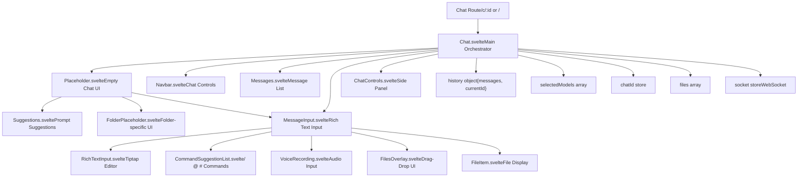
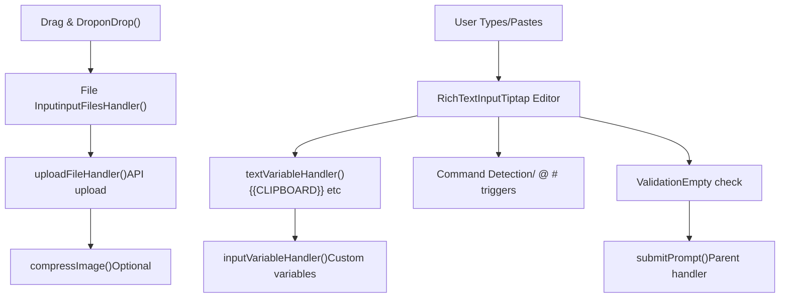
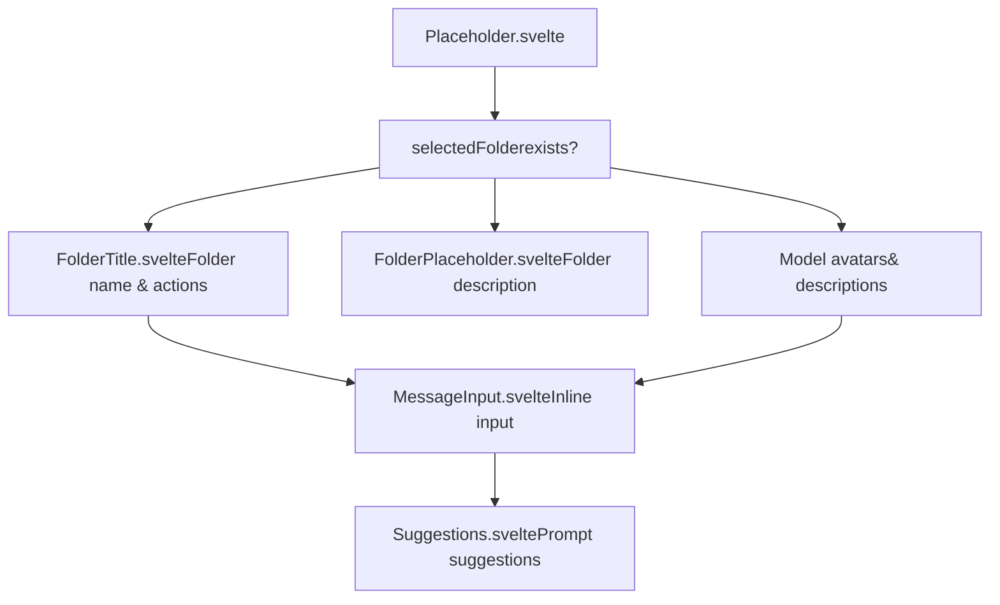

# Chat System

Relevant source files

-   [src/lib/components/channel/MessageInput.svelte](https://github.com/open-webui/open-webui/blob/a7271532/src/lib/components/channel/MessageInput.svelte)
-   [src/lib/components/chat/Chat.svelte](https://github.com/open-webui/open-webui/blob/a7271532/src/lib/components/chat/Chat.svelte)
-   [src/lib/components/chat/ChatPlaceholder.svelte](https://github.com/open-webui/open-webui/blob/a7271532/src/lib/components/chat/ChatPlaceholder.svelte)
-   [src/lib/components/chat/MessageInput.svelte](https://github.com/open-webui/open-webui/blob/a7271532/src/lib/components/chat/MessageInput.svelte)
-   [src/lib/components/chat/Placeholder.svelte](https://github.com/open-webui/open-webui/blob/a7271532/src/lib/components/chat/Placeholder.svelte)
-   [src/lib/components/chat/Suggestions.svelte](https://github.com/open-webui/open-webui/blob/a7271532/src/lib/components/chat/Suggestions.svelte)
-   [src/lib/components/common/FileItem.svelte](https://github.com/open-webui/open-webui/blob/a7271532/src/lib/components/common/FileItem.svelte)
-   [src/lib/components/common/FileItemModal.svelte](https://github.com/open-webui/open-webui/blob/a7271532/src/lib/components/common/FileItemModal.svelte)

## Purpose and Scope

The Chat System is the primary user interface for interacting with language models in Open WebUI. This document covers the frontend chat interface architecture, including the main Chat component orchestration, message input handling, file attachments, real-time event processing, and empty state management.

For backend chat processing and middleware augmentation (tools, RAG, web search), see [Backend Processing Pipeline](/open-webui/open-webui/6-backend-processing-pipeline). For message rendering and display, see [Message Rendering](/open-webui/open-webui/5-message-rendering). For navigation and chat organization, see [Navigation and Organization](/open-webui/open-webui/8-navigation-and-organization).

## Overview

The Chat System is built around `Chat.svelte` as the central orchestrator component that manages:

-   **Chat lifecycle**: Initialization, loading existing chats, creating new conversations
-   **Model selection**: Single or multiple model selection with capability detection
-   **Message input**: Rich text editing with variable substitution and file attachments
-   **History management**: Tree-based message structure with branching support
-   **Real-time updates**: WebSocket event handling for streaming responses
-   **Empty state**: Placeholder UI with model information and suggested prompts

The system operates in two primary modes:

1.  **New Chat Mode**: Displays `Placeholder.svelte` with suggestions and model information
2.  **Active Chat Mode**: Shows message history via `Messages.svelte` and input via `MessageInput.svelte`

Sources: [src/lib/components/chat/Chat.svelte1-2747](https://github.com/open-webui/open-webui/blob/a7271532/src/lib/components/chat/Chat.svelte#L1-L2747)

## Component Architecture


**Key Component Responsibilities:**

| Component | File | Primary Responsibility |
| --- | --- | --- |
| `Chat.svelte` | `src/lib/components/chat/Chat.svelte` | Orchestrates entire chat interface, manages lifecycle and state |
| `Placeholder.svelte` | `src/lib/components/chat/Placeholder.svelte` | Displays empty state with model info and suggestions |
| `MessageInput.svelte` | `src/lib/components/chat/MessageInput.svelte` | Handles user input, file uploads, variable substitution |
| `Messages.svelte` | `src/lib/components/chat/Messages.svelte` | Renders message history tree |
| `Suggestions.svelte` | `src/lib/components/chat/Suggestions.svelte` | Shows prompt suggestions with fuzzy search |

Sources: [src/lib/components/chat/Chat.svelte1-100](https://github.com/open-webui/open-webui/blob/a7271532/src/lib/components/chat/Chat.svelte#L1-L100) [src/lib/components/chat/Placeholder.svelte1-251](https://github.com/open-webui/open-webui/blob/a7271532/src/lib/components/chat/Placeholder.svelte#L1-L251) [src/lib/components/chat/MessageInput.svelte1-100](https://github.com/open-webui/open-webui/blob/a7271532/src/lib/components/chat/MessageInput.svelte#L1-L100)

## Chat Orchestrator Component

### Chat.svelte Structure

`Chat.svelte` serves as the central orchestrator with a complex component lifecycle:

> **[Mermaid stateDiagram]**
> *(图表结构无法解析)*

**Component Properties:**

```
export let chatIdProp = '';  // Chat ID from route parameter
```
**Key Internal State:**

```
let loading = true;                    // Initial load state
let autoScroll = true;                // Auto-scroll to bottom
let generating = false;                // LLM generation active
let generationController = null;      // AbortController for cancellation

let selectedModels = [''];            // Selected model IDs
let atSelectedModel: Model | undefined; // @-selected model override

let history = {                       // Message tree structure
  messages: {},
  currentId: null
};

let prompt = '';                      // Current input text
let files = [];                       // Attached files
let chatFiles = [];                   // Files from loaded chat
let params = {};                      // Model parameters

let selectedToolIds = [];             // Selected tools
let selectedFilterIds = [];           // Selected filters
let imageGenerationEnabled = false;   // Image generation toggle
let webSearchEnabled = false;         // Web search toggle
let codeInterpreterEnabled = false;   // Code execution toggle
```
Sources: [src/lib/components/chat/Chat.svelte101-162](https://github.com/open-webui/open-webui/blob/a7271532/src/lib/components/chat/Chat.svelte#L101-L162)

### Lifecycle Hooks

**`onMount` Initialization:**

The component registers WebSocket event handlers, initializes audio queue, and sets up subscriptions:

```
onMount(async () => {
  window.addEventListener('message', onMessageHandler);
  $socket?.on('events', chatEventHandler);

  audioQueue.set(new AudioQueue(document.getElementById('audioElement')));

  pageSubscribe = page.subscribe(async (p) => {
    if (p.url.pathname === '/') {
      initNewChat();
    }
    stopAudio();
  });

  // ... additional subscriptions
});
```
Sources: [src/lib/components/chat/Chat.svelte548-634](https://github.com/open-webui/open-webui/blob/a7271532/src/lib/components/chat/Chat.svelte#L548-L634)

**Route Navigation Handler:**

The `navigateHandler` function manages chat loading when route parameters change:

```
const navigateHandler = async () => {
  loading = true;

  prompt = '';
  messageInput?.setText('');
  files = [];
  selectedToolIds = [];
  // ... reset state

  if (chatIdProp && (await loadChat())) {
    await tick();
    loading = false;
    window.setTimeout(() => scrollToBottom(), 0);

    // Restore saved input from sessionStorage
    const storageChatInput = sessionStorage.getItem(`chat-input-${chatIdProp}`);
    // ... restore logic
  } else {
    await goto('/');
  }
};
```
Sources: [src/lib/components/chat/Chat.svelte167-213](https://github.com/open-webui/open-webui/blob/a7271532/src/lib/components/chat/Chat.svelte#L167-L213)

## Chat Initialization and Loading

### New Chat Initialization

The `initNewChat` function sets up a new conversation with model selection logic:

```
const initNewChat = async () => {
  // Check temporary chat permissions
  if ($user?.role !== 'admin') {
    if ($user?.permissions?.chat?.temporary_enforced) {
      await temporaryChatEnabled.set(true);
    }
  }

  // Apply default temporary chat setting
  if ($settings?.temporaryChatByDefault ?? false) {
    // ... temporary chat logic
  }

  const availableModels = $models
    .filter((m) => !(m?.info?.meta?.hidden ?? false))
    .map((m) => m.id);

  // Model selection priority:
  // 1. URL parameters (?models=id1,id2)
  // 2. Selected folder models
  // 3. Session storage
  // 4. User settings
  // 5. Config default_models
  // 6. First available model

  if ($page.url.searchParams.get('models')) {
    selectedModels = $page.url.searchParams.get('models').split(',');
  } else if ($selectedFolder?.data?.model_ids) {
    selectedModels = $selectedFolder.data.model_ids;
  } else if (sessionStorage.selectedModels) {
    selectedModels = JSON.parse(sessionStorage.selectedModels);
  } else if ($settings?.models) {
    selectedModels = $settings.models;
  } else if ($config?.default_models) {
    selectedModels = $config.default_models.split(',');
  }

  // Filter to available models only
  selectedModels = selectedModels.filter(id => availableModels.includes(id));

  // Apply URL parameters for features
  if ($page.url.searchParams.get('web-search') === 'true') {
    webSearchEnabled = true;
  }
  // ... other URL parameters
};
```
Sources: [src/lib/components/chat/Chat.svelte890-1056](https://github.com/open-webui/open-webui/blob/a7271532/src/lib/components/chat/Chat.svelte#L890-L1056)

### Existing Chat Loading

The `loadChat` function retrieves and reconstructs chat state:

```
const loadChat = async () => {
  chatId.set(chatIdProp);

  if ($temporaryChatEnabled) {
    temporaryChatEnabled.set(false);
  }

  chat = await getChatById(localStorage.token, $chatId).catch(async (error) => {
    await goto('/');
    return null;
  });

  if (chat) {
    tags = await getTagsById(localStorage.token, $chatId);
    const chatContent = chat.chat;

    if (chatContent) {
      selectedModels = (chatContent?.models ?? undefined) !== undefined
        ? chatContent.models
        : [chatContent.models ?? ''];

      history = (chatContent?.history ?? undefined) !== undefined
        ? chatContent.history
        : convertMessagesToHistory(chatContent.messages);

      chatTitle.set(chatContent.title);
      params = chatContent?.params ?? {};
      chatFiles = chatContent?.files ?? [];

      autoScroll = true;
      await tick();

      // Mark all assistant messages as done (prevent re-generation)
      if (history.currentId) {
        for (const message of Object.values(history.messages)) {
          if (message.role === 'assistant') {
            message.done = true;
          }
        }
      }

      // Load any active tasks
      const taskRes = await getTaskIdsByChatId(localStorage.token, $chatId);
      if (taskRes) {
        taskIds = taskRes.task_ids;
      }

      return true;
    }
  }
};
```
Sources: [src/lib/components/chat/Chat.svelte1058-1127](https://github.com/open-webui/open-webui/blob/a7271532/src/lib/components/chat/Chat.svelte#L1058-L1127)

## Message Input System

### MessageInput.svelte Architecture

`MessageInput.svelte` is a complex component handling rich text input, file uploads, variable substitution, and command suggestions:


**Component Props:**

```
export let onUpload: Function = (e) => {};
export let onChange: Function = () => {};
export let createMessagePair: Function;
export let stopResponse: Function;

export let autoScroll = false;
export let generating = false;

export let atSelectedModel: Model | undefined = undefined;
export let selectedModels: [''];

export let history;
export let taskIds = null;

export let prompt = '';
export let files = [];

export let selectedToolIds = [];
export let selectedFilterIds = [];

export let imageGenerationEnabled = false;
export let webSearchEnabled = false;
export let codeInterpreterEnabled = false;
```
Sources: [src/lib/components/chat/MessageInput.svelte96-122](https://github.com/open-webui/open-webui/blob/a7271532/src/lib/components/chat/MessageInput.svelte#L96-L122)

### Variable Substitution

The input system supports two types of variable substitution:

**1\. Text Variables (Built-in):**

These are automatically replaced when text is entered:

```
const textVariableHandler = async (text: string) => {
  if (text.includes('{{CLIPBOARD}}')) {
    const clipboardText = await navigator.clipboard.readText();
    const clipboardItems = await navigator.clipboard.read();

    // Handle both text and images from clipboard
    for (const item of clipboardItems) {
      for (const type of item.types) {
        if (type.startsWith('image/')) {
          const blob = await item.getType(type);
          const file = new File([blob], `clipboard-image.${type.split('/')[1]}`, {
            type: type
          });
          inputFilesHandler([file]);
        }
      }
    }

    text = text.replaceAll('{{CLIPBOARD}}', clipboardText);
  }

  if (text.includes('{{USER_LOCATION}}')) {
    let location = await getUserPosition();
    text = text.replaceAll('{{USER_LOCATION}}', String(location));
  }

  if (text.includes('{{CURRENT_DATE}}')) {
    const date = getFormattedDate();
    text = text.replaceAll('{{CURRENT_DATE}}', date);
  }

  // ... additional variables:
  // {{USER_NAME}}, {{USER_BIO}}, {{USER_GENDER}}, {{USER_BIRTH_DATE}},
  // {{USER_AGE}}, {{USER_LANGUAGE}}, {{CURRENT_TIME}}, {{CURRENT_DATETIME}},
  // {{CURRENT_TIMEZONE}}, {{CURRENT_WEEKDAY}}

  return text;
};
```
Sources: [src/lib/components/chat/MessageInput.svelte178-289](https://github.com/open-webui/open-webui/blob/a7271532/src/lib/components/chat/MessageInput.svelte#L178-L289)

**2\. Input Variables (Custom):**

Custom variables trigger a modal for user input:

```
const inputVariableHandler = async (text: string): Promise<string> => {
  inputVariables = extractInputVariables(text);

  // No variables? Return immediately
  if (Object.keys(inputVariables).length === 0) {
    return text;
  }

  // Show modal and wait for user's input
  showInputVariablesModal = true;
  return await new Promise<string>((resolve) => {
    inputVariablesModalCallback = (variableValues) => {
      inputVariableValues = { ...inputVariableValues, ...variableValues };
      replaceVariables(inputVariableValues);
      showInputVariablesModal = false;
      resolve(text);
    };
  });
};
```
Sources: [src/lib/components/chat/MessageInput.svelte158-176](https://github.com/open-webui/open-webui/blob/a7271532/src/lib/components/chat/MessageInput.svelte#L158-L176)

### File Upload Processing

**File Upload Flow:**

> **[Mermaid sequence]**
> *(图表结构无法解析)*

**Upload Handler Implementation:**

```
const uploadFileHandler = async (file, process = true, itemData = {}) => {
  // Permission check
  if ($_user?.role !== 'admin' && !($_user?.permissions?.chat?.file_upload ?? true)) {
    toast.error($i18n.t('You do not have permission to upload files.'));
    return null;
  }

  // Capability check
  if (fileUploadCapableModels.length !== selectedModels.length) {
    toast.error($i18n.t('Model(s) do not support file upload'));
    return null;
  }

  const tempItemId = uuidv4();
  const fileItem = {
    type: 'file',
    file: '',
    id: null,
    url: '',
    name: file.name,
    collection_name: '',
    status: 'uploading',
    size: file.size,
    error: '',
    itemId: tempItemId,
    ...itemData
  };

  if (fileItem.size == 0) {
    toast.error($i18n.t('You cannot upload an empty file.'));
    return null;
  }

  files = [...files, fileItem];

  if (!$temporaryChatEnabled) {
    try {
      // Add language metadata for audio files (STT)
      let metadata = null;
      if ((file.type.startsWith('audio/') || file.type.startsWith('video/')) &&
          $settings?.audio?.stt?.language) {
        metadata = {
          language: $settings?.audio?.stt?.language
        };
      }

      // Upload with automatic content extraction
      const uploadedFile = await uploadFile(localStorage.token, file, metadata, process);

      if (uploadedFile) {
        fileItem.status = 'uploaded';
        fileItem.file = uploadedFile;
        fileItem.id = uploadedFile.id;
        fileItem.collection_name = uploadedFile?.meta?.collection_name;
        fileItem.content_type = uploadedFile.meta?.content_type;
        fileItem.url = `${uploadedFile.id}`;

        files = files;
      } else {
        files = files.filter((item) => item?.itemId !== tempItemId);
      }
    } catch (e) {
      toast.error(`${e}`);
      files = files.filter((item) => item?.itemId !== tempItemId);
    }
  } else {
    // Temporary chat: extract content client-side without uploading
    const content = await extractContentFromFile(file);

    if (content === null) {
      toast.error($i18n.t('Failed to extract content from the file.'));
      files = files.filter((item) => item?.itemId !== tempItemId);
      return null;
    } else {
      fileItem.status = 'uploaded';
      fileItem.type = 'text';
      fileItem.content = content;
      fileItem.id = uuidv4();

      files = files;
    }
  }
};
```
Sources: [src/lib/components/chat/MessageInput.svelte535-641](https://github.com/open-webui/open-webui/blob/a7271532/src/lib/components/chat/MessageInput.svelte#L535-L641)

### Image Compression

Images are optionally compressed based on user settings and server configuration:

```
const compressImageHandler = async (imageUrl, settings = {}, config = {}) => {
  const settingsCompression = settings?.imageCompression ?? false;
  const configWidth = config?.file?.image_compression?.width ?? null;
  const configHeight = config?.file?.image_compression?.height ?? null;

  // If neither settings nor config wants compression, return original
  if (!settingsCompression && !configWidth && !configHeight) {
    return imageUrl;
  }

  let width = null;
  let height = null;

  // If user/settings want compression, pick their preferred size
  if (settingsCompression) {
    width = settings?.imageCompressionSize?.width ?? null;
    height = settings?.imageCompressionSize?.height ?? null;
  }

  // Apply config limits as upper bound
  if (configWidth && (width === null || width > configWidth)) {
    width = configWidth;
  }
  if (configHeight && (height === null || height > configHeight)) {
    height = configHeight;
  }

  // Perform compression if required
  if (width || height) {
    return await compressImage(imageUrl, width, height);
  }
  return imageUrl;
};
```
Sources: [src/lib/components/chat/MessageInput.svelte688-722](https://github.com/open-webui/open-webui/blob/a7271532/src/lib/components/chat/MessageInput.svelte#L688-L722)

## WebSocket Event Handling

The Chat System uses WebSocket connections for real-time updates during LLM generation:

### Event Registration

WebSocket events are registered in `Chat.svelte`'s `onMount`:

```
onMount(async () => {
  $socket?.on('events', chatEventHandler);
  // ... other initialization
});

onDestroy(() => {
  $socket?.off('events', chatEventHandler);
  // ... cleanup
});
```
Sources: [src/lib/components/chat/Chat.svelte552](https://github.com/open-webui/open-webui/blob/a7271532/src/lib/components/chat/Chat.svelte#L552-L552) [src/lib/components/chat/Chat.svelte643](https://github.com/open-webui/open-webui/blob/a7271532/src/lib/components/chat/Chat.svelte#L643-L643)

### Event Handler Implementation

The `chatEventHandler` processes various event types:

```mermaid
flowchart TD
    Event["WebSocket Event{chat_id, message_id, data}"]
    CheckChatId["chat_id matches$chatId?"]
    Ignore["Ignore Event"]
    GetMessage["Get message from history"]
    EventType["Event Type?"]
    Status["Append to statusHistory[]"]
    Completion["chatCompletionEventHandler()"]
    TaskCancel["Set taskIds = nullMark messages done"]
    Delta["Append to message.content"]
    Replace["Replace message.content"]
    Files["Update message.files"]
    Embeds["Update message.embeds"]
    Error["Set message.error"]
    FollowUps["Update message.followUps"]
    Title["Update chat titleRefresh chat list"]
    Tags["Reload chat tags"]
    Source["Add to message.sourcesor code_executions"]
    Toast["Show toast notification"]
    Confirm["Show confirmation dialog"]
    Execute["Execute code via Function()"]
    Input["Show input modal"]
    UpdateHistory["Update history.messages"]

    Event --> CheckChatId
    CheckChatId --> Ignore
    CheckChatId --> GetMessage
    GetMessage --> EventType
    EventType --> Status
    EventType --> Completion
    EventType --> TaskCancel
    EventType --> Delta
    EventType --> Replace
    EventType --> Files
    EventType --> Embeds
    EventType --> Error
    EventType --> FollowUps
    EventType --> Title
    EventType --> Tags
    EventType --> Source
    EventType --> Toast
    EventType --> Confirm
    EventType --> Execute
    EventType --> Input
    Status --> UpdateHistory
    Completion --> UpdateHistory
    TaskCancel --> UpdateHistory
    Delta --> UpdateHistory
    Replace --> UpdateHistory
    Files --> UpdateHistory
    Embeds --> UpdateHistory
    Error --> UpdateHistory
    FollowUps --> UpdateHistory
    Source --> UpdateHistory
```


**Event Type Details:**

| Event Type | Purpose | Data Structure |
| --- | --- | --- |
| `status` | Status updates during generation | `{type: 'status', data: statusObject}` |
| `chat:completion` | Final completion event | Triggers `chatCompletionEventHandler` |
| `chat:message:delta` | Streaming content chunk | `{content: string}` - appended to message |
| `chat:message` | Full message replacement | `{content: string}` - replaces message |
| `chat:message:files` | File attachments | `{files: FileObject[]}` |
| `chat:message:error` | Error occurred | `{error: string}` |
| `chat:title` | Chat title generated | `{title: string}` |
| `source` | Citation/code execution | `{type?: 'code_execution', ...}` |
| `notification` | Toast notification | \`{type: 'info' |
| `confirmation` | User confirmation needed | `{title: string, message: string}` |
| `input` | User input required | `{title: string, message: string, placeholder: string}` |

**Implementation:**

```
const chatEventHandler = async (event, cb) => {
  console.log(event);

  if (event.chat_id === $chatId) {
    await tick();
    let message = history.messages[event.message_id];

    if (message) {
      const type = event?.data?.type ?? null;
      const data = event?.data?.data ?? null;

      if (type === 'status') {
        if (message?.statusHistory) {
          message.statusHistory.push(data);
        } else {
          message.statusHistory = [data];
        }
      } else if (type === 'chat:completion') {
        chatCompletionEventHandler(data, message, event.chat_id);
      } else if (type === 'chat:message:delta' || type === 'message') {
        message.content += data.content;
      } else if (type === 'chat:message' || type === 'replace') {
        message.content = data.content;
      } else if (type === 'source' || type === 'citation') {
        if (data?.type === 'code_execution') {
          // Code execution - update by ID or add new
          if (!message?.code_executions) {
            message.code_executions = [];
          }

          const existingIdx = message.code_executions.findIndex(
            (execution) => execution.id === data.id
          );

          if (existingIdx !== -1) {
            message.code_executions[existingIdx] = data;
          } else {
            message.code_executions.push(data);
          }

          message.code_executions = message.code_executions;
        } else {
          // Regular source/citation
          if (message?.sources) {
            message.sources.push(data);
          } else {
            message.sources = [data];
          }
        }
      } else if (type === 'notification') {
        const toastType = data?.type ?? 'info';
        const toastContent = data?.content ?? '';

        if (toastType === 'success') {
          toast.success(toastContent);
        } else if (toastType === 'error') {
          toast.error(toastContent);
        } // ... other toast types
      }
      // ... handle other event types

      history.messages[event.message_id] = message;
    }
  }
};
```
Sources: [src/lib/components/chat/Chat.svelte351-478](https://github.com/open-webui/open-webui/blob/a7271532/src/lib/components/chat/Chat.svelte#L351-L478)

## Empty State and Placeholder

When no messages exist, the Chat System displays a placeholder UI with model information and suggested prompts.

### Placeholder Component Structure


**Model Display:**

When models are selected, the placeholder shows model avatars with metadata:

```
// Model avatar display with description tooltip
{#each models as model, modelIdx}
  <Tooltip
    content={(models[modelIdx]?.info?.meta?.tags ?? [])
      .map((tag) => tag.name.toUpperCase())
      .join(', ')}
    placement="top"
  >
    <button
      on:click={() => {
        selectedModelIdx = modelIdx;
      }}
    >
      
    </button>
  </Tooltip>
{/each}
```
Sources: [src/lib/components/chat/Placeholder.svelte106-132](https://github.com/open-webui/open-webui/blob/a7271532/src/lib/components/chat/Placeholder.svelte#L106-L132)

### Suggestions Component

`Suggestions.svelte` provides fuzzy-searchable prompt suggestions:

**Features:**

-   **Fuzzy search** using Fuse.js on suggestion content and titles
-   **Dynamic filtering** based on current input value
-   **Waterfall animation** for suggestion cards
-   **Random ordering** to encourage exploration

**Implementation:**

```
let sortedPrompts = [];
let filteredPrompts = [];

const fuseOptions = {
  keys: ['content', 'title'],
  threshold: 0.5
};

let fuse;

// Initialize Fuse with sorted prompts
$: fuse = new Fuse(sortedPrompts, fuseOptions);

// Filter prompts based on input
const getFilteredPrompts = (inputValue) => {
  if (inputValue.length > 500) {
    filteredPrompts = [];
  } else {
    const newFilteredPrompts =
      inputValue.trim() && fuse
        ? fuse.search(inputValue.trim()).map((result) => result.item)
        : sortedPrompts;

    // Only update if changed (optimization)
    if (!arraysEqual(filteredPrompts, newFilteredPrompts)) {
      filteredPrompts = newFilteredPrompts;
    }
  }
};

// Randomize order on mount
$: if (suggestionPrompts) {
  sortedPrompts = [...(suggestionPrompts ?? [])].sort(() => Math.random() - 0.5);
  getFilteredPrompts(inputValue);
}
```
Sources: [src/lib/components/chat/Suggestions.svelte15-64](https://github.com/open-webui/open-webui/blob/a7271532/src/lib/components/chat/Suggestions.svelte#L15-L64)

**Display with Waterfall Animation:**

```
<div role="list" class="max-h-40 overflow-auto scrollbar-none items-start {className}">
  {#each filteredPrompts as prompt, idx (prompt.id || `${prompt.content}-${idx}`)}
    <button
      role="listitem"
      class="waterfall flex flex-col flex-1 shrink-0 w-full justify-between
             px-3 py-2 rounded-xl bg-transparent hover:bg-black/5
             dark:hover:bg-white/5 transition group"
      style="animation-delay: {idx * 60}ms"
      on:click={() => onSelect({ type: 'prompt', data: prompt.content })}
    >
      <div class="flex flex-col text-left">
        {#if prompt.title && prompt.title[0] !== ''}
          <div class="font-medium dark:text-gray-300 dark:group-hover:text-gray-200 transition line-clamp-1">
            {prompt.title[0]}
          </div>
          <div class="text-xs text-gray-600 dark:text-gray-400 font-normal line-clamp-1">
            {prompt.title[1]}
          </div>
        {:else}
          <div class="font-medium dark:text-gray-300 dark:group-hover:text-gray-200 transition line-clamp-1">
            {prompt.content}
          </div>
        {/if}
      </div>
    </button>
  {/each}
</div>
```
Sources: [src/lib/components/chat/Suggestions.svelte84-122](https://github.com/open-webui/open-webui/blob/a7271532/src/lib/components/chat/Suggestions.svelte#L84-L122)

## State Management

The Chat System uses Svelte stores for reactive state management:

**Key Stores:**

| Store | Type | Purpose |
| --- | --- | --- |
| `chatId` | `Writable<string>` | Current chat ID |
| `chatTitle` | `Writable<string>` | Current chat title |
| `chats` | `Writable<Chat[]>` | List of all chats |
| `models` | `Writable<Model[]>` | Available models |
| `selectedFolder` | `Writable<Folder>` | Currently selected folder |
| `temporaryChatEnabled` | `Writable<boolean>` | Temporary chat mode |
| `socket` | `Writable<Socket>` | WebSocket connection |
| `showControls` | `Writable<boolean>` | Show side panel |
| `showOverview` | `Writable<boolean>` | Show overview panel |
| `showArtifacts` | `Writable<boolean>` | Show artifacts panel |

**Local State:**

The `history` object is local component state (not a store) with this structure:

```
type History = {
  messages: {
    [messageId: string]: {
      id: string;
      parentId: string | null;
      childrenIds: string[];
      role: 'user' | 'assistant';
      content: string;
      done: boolean;
      timestamp: number;
      model?: string;
      modelName?: string;
      files?: File[];
      sources?: Source[];
      statusHistory?: Status[];
      error?: ErrorObject;
    }
  };
  currentId: string | null;
};
```
This tree-based structure enables message branching and navigation. For details on the message history tree, see [Message History Tree](/open-webui/open-webui/4.3-message-history-tree).

Sources: [src/lib/components/chat/Chat.svelte17-46](https://github.com/open-webui/open-webui/blob/a7271532/src/lib/components/chat/Chat.svelte#L17-L46) [src/lib/components/chat/Chat.svelte150-154](https://github.com/open-webui/open-webui/blob/a7271532/src/lib/components/chat/Chat.svelte#L150-L154)

## File Display Components

### FileItem.svelte

`FileItem.svelte` provides a compact file display with preview capabilities:

**Component Props:**

```
export let className = 'w-60';
export let colorClassName = 'bg-white dark:bg-gray-850 border border-gray-50/30';
export let url: string | null = null;

export let dismissible = false;  // Show X button
export let modal = false;         // Click opens modal
export let loading = false;       // Show spinner
export let small = false;         // Compact mode

export let item = null;          // Full item object
export let edit = false;         // Enable editing

export let name: string;         // File name
export let type: string;         // File type (file, collection, note, chat)
export let size: number;         // File size in bytes
```
**Type-specific Icons:**

The component displays different icons based on file type:

```
{#if type === 'collection'}
  <Database />
{:else if type === 'note'}
  <PageEdit />
{:else if type === 'chat'}
  <ChatBubble />
{:else if type === 'folder'}
  <Folder />
{:else}
  <DocumentPage />
{/if}
```
Sources: [src/lib/components/common/FileItem.svelte17-48](https://github.com/open-webui/open-webui/blob/a7271532/src/lib/components/common/FileItem.svelte#L17-L48)

### FileItemModal.svelte

`FileItemModal.svelte` provides detailed file preview with content rendering:

**Supported Preview Types:**

-   **PDF**: Embedded iframe viewer
-   **Audio**: HTML5 audio player
-   **Excel/CSV**: Rendered table with sheet tabs (using xlsx library)
-   **Code files**: Syntax-highlighted code blocks
-   **Markdown**: Rendered markdown preview
-   **Text**: Plain text display

**Excel/CSV Rendering:**

```
const loadExcelContent = async () => {
  try {
    const response = await fetch(`${WEBUI_API_BASE_URL}/files/${item.id}/content`, {
      headers: {
        Authorization: `Bearer ${localStorage.token}`
      }
    });

    const arrayBuffer = await response.arrayBuffer();
    excelWorkbook = XLSX.read(arrayBuffer, { type: 'array' });
    excelSheetNames = excelWorkbook.SheetNames;

    if (excelSheetNames.length > 0) {
      selectedSheet = excelSheetNames[0];
      renderExcelSheet();
    }
  } catch (error) {
    console.error('Error loading Excel/CSV file:', error);
    excelError = 'Failed to load Excel/CSV file. Please try downloading it instead.';
  }
};

const renderExcelSheet = () => {
  if (!excelWorkbook || !selectedSheet) return;

  const worksheet = excelWorkbook.Sheets[selectedSheet];
  // Calculate row count
  const range = XLSX.utils.decode_range(worksheet['!ref'] || 'A1:A1');
  rowCount = range.e.r - range.s.r + 1;

  excelHtml = XLSX.utils.sheet_to_html(worksheet, {
    id: 'excel-table',
    editable: false,
    header: ''
  });
};
```
Sources: [src/lib/components/common/FileItemModal.svelte93-133](https://github.com/open-webui/open-webui/blob/a7271532/src/lib/components/common/FileItemModal.svelte#L93-L133)

## Session Storage Integration

The Chat System persists input state across navigation using `sessionStorage`:

**Saved Input State:**

```
$: onChange({
  prompt,
  files: files
    .filter((file) => file.type !== 'image')
    .map((file) => {
      return {
        ...file,
        user: undefined,
        access_control: undefined
      };
    }),
  selectedToolIds,
  selectedFilterIds,
  imageGenerationEnabled,
  webSearchEnabled,
  codeInterpreterEnabled
});
```
This state is stored in `sessionStorage` with the key pattern:

-   `chat-input` for new chats
-   `chat-input-{chatId}` for existing chats

**Restoration on Load:**

```
const storageChatInput = sessionStorage.getItem(
  `chat-input${chatIdProp ? `-${chatIdProp}` : ''}`
);

if (storageChatInput) {
  try {
    const input = JSON.parse(storageChatInput);

    if (!$temporaryChatEnabled) {
      messageInput?.setText(input.prompt);
      files = input.files;
      selectedToolIds = input.selectedToolIds;
      selectedFilterIds = input.selectedFilterIds;
      webSearchEnabled = input.webSearchEnabled;
      imageGenerationEnabled = input.imageGenerationEnabled;
      codeInterpreterEnabled = input.codeInterpreterEnabled;
    }
  } catch (e) {}
}
```
Sources: [src/lib/components/chat/MessageInput.svelte140-156](https://github.com/open-webui/open-webui/blob/a7271532/src/lib/components/chat/MessageInput.svelte#L140-L156) [src/lib/components/chat/Chat.svelte179-206](https://github.com/open-webui/open-webui/blob/a7271532/src/lib/components/chat/Chat.svelte#L179-L206)

---

**Primary Sources:**

-   [src/lib/components/chat/Chat.svelte1-2747](https://github.com/open-webui/open-webui/blob/a7271532/src/lib/components/chat/Chat.svelte#L1-L2747)
-   [src/lib/components/chat/MessageInput.svelte1-2047](https://github.com/open-webui/open-webui/blob/a7271532/src/lib/components/chat/MessageInput.svelte#L1-L2047)
-   [src/lib/components/chat/Placeholder.svelte1-251](https://github.com/open-webui/open-webui/blob/a7271532/src/lib/components/chat/Placeholder.svelte#L1-L251)
-   [src/lib/components/chat/Suggestions.svelte1-145](https://github.com/open-webui/open-webui/blob/a7271532/src/lib/components/chat/Suggestions.svelte#L1-L145)
-   [src/lib/components/common/FileItem.svelte1-206](https://github.com/open-webui/open-webui/blob/a7271532/src/lib/components/common/FileItem.svelte#L1-L206)
-   [src/lib/components/common/FileItemModal.svelte1-484](https://github.com/open-webui/open-webui/blob/a7271532/src/lib/components/common/FileItemModal.svelte#L1-L484)
