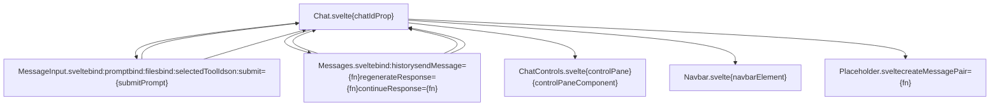
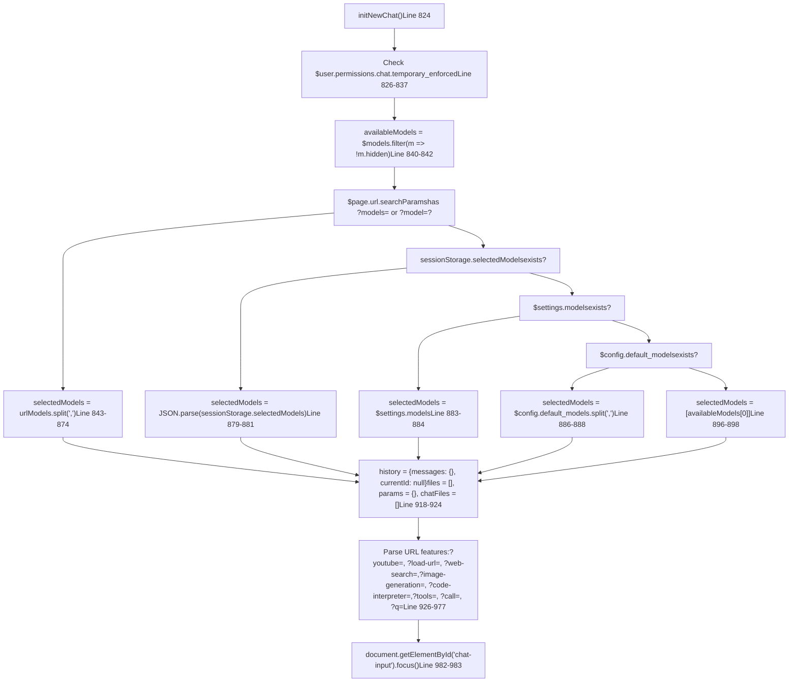
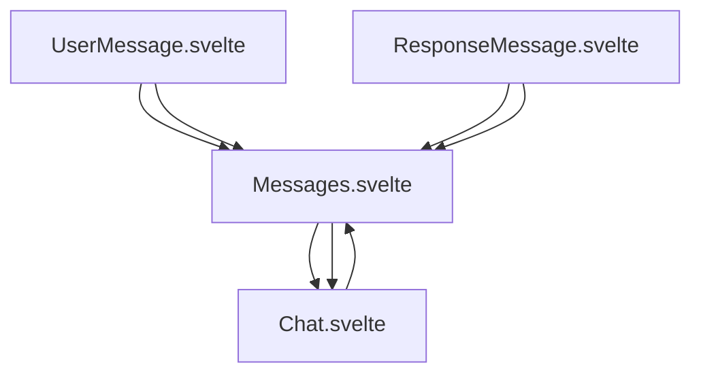
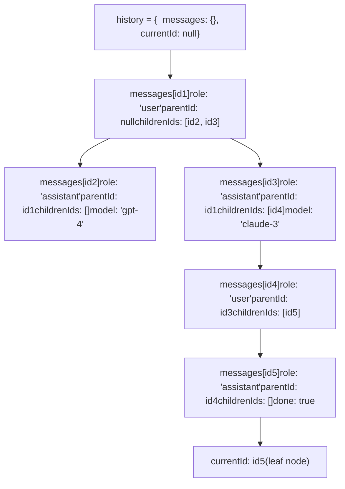
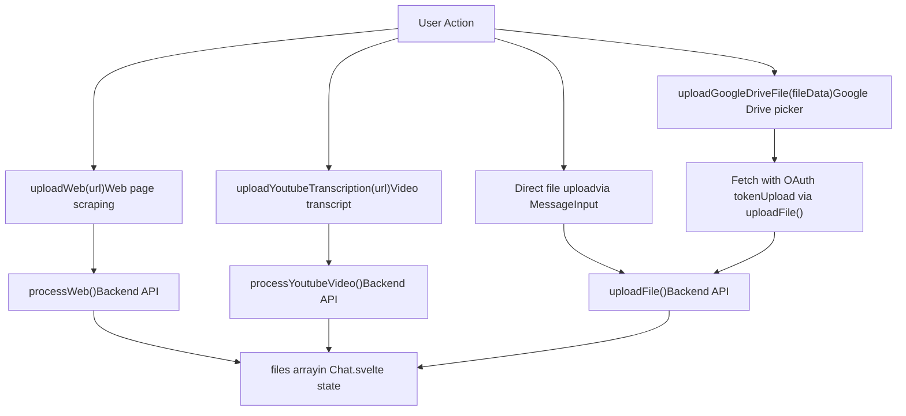

# Chat Component Architecture

Relevant source files

-   [src/lib/components/channel/MessageInput.svelte](https://github.com/open-webui/open-webui/blob/a7271532/src/lib/components/channel/MessageInput.svelte)
-   [src/lib/components/chat/Chat.svelte](https://github.com/open-webui/open-webui/blob/a7271532/src/lib/components/chat/Chat.svelte)
-   [src/lib/components/chat/ChatPlaceholder.svelte](https://github.com/open-webui/open-webui/blob/a7271532/src/lib/components/chat/ChatPlaceholder.svelte)
-   [src/lib/components/chat/MessageInput.svelte](https://github.com/open-webui/open-webui/blob/a7271532/src/lib/components/chat/MessageInput.svelte)
-   [src/lib/components/chat/Placeholder.svelte](https://github.com/open-webui/open-webui/blob/a7271532/src/lib/components/chat/Placeholder.svelte)
-   [src/lib/components/chat/Suggestions.svelte](https://github.com/open-webui/open-webui/blob/a7271532/src/lib/components/chat/Suggestions.svelte)
-   [src/lib/components/common/FileItem.svelte](https://github.com/open-webui/open-webui/blob/a7271532/src/lib/components/common/FileItem.svelte)
-   [src/lib/components/common/FileItemModal.svelte](https://github.com/open-webui/open-webui/blob/a7271532/src/lib/components/common/FileItemModal.svelte)

## Overview

`Chat.svelte` [src/lib/components/chat/Chat.svelte1-2618](https://github.com/open-webui/open-webui/blob/a7271532/src/lib/components/chat/Chat.svelte#L1-L2618) orchestrates the entire chat lifecycle in Open WebUI. It manages message history as a directed acyclic graph, coordinates child components, processes Socket.IO streaming events, and persists chat state to both the backend database and browser sessionStorage.

### Core Responsibilities

| Responsibility | Key Variables/Functions | Lines |
| --- | --- | --- |
| State Management | `history`, `selectedModels`, `files`, `prompt`, `generating` | [src/lib/components/chat/Chat.svelte141-161](https://github.com/open-webui/open-webui/blob/a7271532/src/lib/components/chat/Chat.svelte#L141-L161) |
| Child Coordination | `<MessageInput>`, `<Messages>`, `<ChatControls>`, `<Navbar>` | [src/lib/components/chat/Chat.svelte2748-2799](https://github.com/open-webui/open-webui/blob/a7271532/src/lib/components/chat/Chat.svelte#L2748-L2799) |
| Event Processing | `chatEventHandler()`, `$socket.on('events')` | [src/lib/components/chat/Chat.svelte340-467](https://github.com/open-webui/open-webui/blob/a7271532/src/lib/components/chat/Chat.svelte#L340-L467) |
| Chat Lifecycle | `initNewChat()`, `loadChat()`, `submitPrompt()`, `sendMessage()` | [src/lib/components/chat/Chat.svelte824-2182](https://github.com/open-webui/open-webui/blob/a7271532/src/lib/components/chat/Chat.svelte#L824-L2182) |
| Session Persistence | `sessionStorage.setItem('chat-input-{id}')`, `sessionStorage.selectedModels` | [src/lib/components/chat/Chat.svelte170-195](https://github.com/open-webui/open-webui/blob/a7271532/src/lib/components/chat/Chat.svelte#L170-L195) |
| URL Routing | `?models=`, `?q=`, `?submit=`, `?youtube=`, `?load-url=` | [src/lib/components/chat/Chat.svelte843-977](https://github.com/open-webui/open-webui/blob/a7271532/src/lib/components/chat/Chat.svelte#L843-L977) |

**Sources:** [src/lib/components/chat/Chat.svelte1-2618](https://github.com/open-webui/open-webui/blob/a7271532/src/lib/components/chat/Chat.svelte#L1-L2618)

---

## Component Hierarchy and Data Flow

**Diagram: Chat.svelte Component Composition**


**Binding Patterns:**

| Component | Binding Type | Variable | Purpose |
| --- | --- | --- | --- |
| `MessageInput` | Two-way | `bind:prompt` | User input text synchronized |
| `MessageInput` | Two-way | `bind:files` | Attached files array |
| `MessageInput` | Two-way | `bind:selectedToolIds` | Enabled tools |
| `MessageInput` | Event | `on:submit` | Triggers `submitPrompt(e.detail)` |
| `Messages` | Two-way | `bind:history` | Message graph structure |
| `Messages` | Callback | `sendMessage={fn}` | Generate AI responses |
| `Messages` | Callback | `regenerateResponse={fn}` | Create message variants |
| `Messages` | Ref | `bind:messagesContainerElement` | Scroll control |

**Sources:** [src/lib/components/chat/Chat.svelte2688-2815](https://github.com/open-webui/open-webui/blob/a7271532/src/lib/components/chat/Chat.svelte#L2688-L2815)

---

## Initialization and Lifecycle

## State Management

**Diagram: Chat.svelte State Variables**

```mermaid
flowchart TD
    autoScroll["autoScrollLine 103"]
    showCommands["showCommandsLine 133"]
    loading["loadingLine 94"]
    generating["generatingLine 135boolean"]
    generationController["generationControllerLine 136AbortController"]
    taskIds["taskIdsLine 146string[] | null"]
    selectedToolIds["selectedToolIds[]Line 127"]
    selectedFilterIds["selectedFilterIds[]Line 128"]
    imageGenerationEnabled["imageGenerationEnabledLine 129"]
    webSearchEnabled["webSearchEnabledLine 130"]
    codeInterpreterEnabled["codeInterpreterEnabledLine 131"]
    selectedModels["selectedModels[]Line 118string[]"]
    atSelectedModel["atSelectedModelLine 119Model | undefined"]
    selectedModelIds["selectedModelIds[]Line 120-125computed"]
    history["historyLine 141-144{messages: {}, currentId: null}"]
    chat["chatLine 138DB metadata object"]
    tags["tags[]Line 139Chat tags"]
    prompt["promptLine 149string"]
    files["files[]Line 150FileItem[]"]
    chatFiles["chatFiles[]Line 151Persisted files"]
    params["paramsLine 152Chat parameters"]
    MessageInput["MessageInput.svelte"]
    Messages["Messages.svelte"]

    prompt --> MessageInput
    files --> MessageInput
    history --> Messages
    atSelectedModel --> selectedModelIds
    selectedModels --> selectedModelIds
```


**Key Reactive Statements:**

```
// Line 121-125: Compute selectedModelIds
$: if (atSelectedModel !== undefined) {
  selectedModelIds = [atSelectedModel.id];
} else {
  selectedModelIds = selectedModels;
}

// Line 220-235: Save models to sessionStorage
$: if (selectedModels && chatIdProp !== '') {
  saveSessionSelectedModels();
}

// Line 237-244: Reset input on model change
$: if (JSON.stringify(selectedModelIds) !== JSON.stringify(oldSelectedModelIds)) {
  onSelectedModelIdsChange();
}

// Line 514-516: Save models to folder
$: if (selectedModels !== null) {
  savedModelIds();
}
```
**Sources:** [src/lib/components/chat/Chat.svelte94-152](https://github.com/open-webui/open-webui/blob/a7271532/src/lib/components/chat/Chat.svelte#L94-L152) [src/lib/components/chat/Chat.svelte121-125](https://github.com/open-webui/open-webui/blob/a7271532/src/lib/components/chat/Chat.svelte#L121-L125) [src/lib/components/chat/Chat.svelte220-244](https://github.com/open-webui/open-webui/blob/a7271532/src/lib/components/chat/Chat.svelte#L220-L244) [src/lib/components/chat/Chat.svelte514-516](https://github.com/open-webui/open-webui/blob/a7271532/src/lib/components/chat/Chat.svelte#L514-L516)

## Lifecycle: Initialization and Loading

### initNewChat() - New Chat Setup

**Diagram: initNewChat() Execution Flow**


**Model Selection Priority (Lines 843-901):**

1.  `$page.url.searchParams.get('models')` or `get('model')` - comma-separated list
2.  `sessionStorage.selectedModels` - JSON-parsed array
3.  `$settings.models` - user preference
4.  `$config.default_models` - system default (comma-separated)
5.  `availableModels[0]` - first available model

**Sources:** [src/lib/components/chat/Chat.svelte824-993](https://github.com/open-webui/open-webui/blob/a7271532/src/lib/components/chat/Chat.svelte#L824-L993)

### loadChat() - Load Existing Chat

**Diagram: loadChat() Database Restoration**

> **[Mermaid sequence]**
> *(图表结构无法解析)*

**Sources:** [src/lib/components/chat/Chat.svelte995-1072](https://github.com/open-webui/open-webui/blob/a7271532/src/lib/components/chat/Chat.svelte#L995-L1072)

The `initNewChat` function [src/lib/components/chat/Chat.svelte824-993](https://github.com/open-webui/open-webui/blob/a7271532/src/lib/components/chat/Chat.svelte#L824-L993) handles:

1.  **Temporary Chat Mode**: Enforces temporary chat if user permissions require it [src/lib/components/chat/Chat.svelte826-837](https://github.com/open-webui/open-webui/blob/a7271532/src/lib/components/chat/Chat.svelte#L826-L837)
2.  **Model Selection Priority**: URL params → session storage → user settings → config defaults [src/lib/components/chat/Chat.svelte843-901](https://github.com/open-webui/open-webui/blob/a7271532/src/lib/components/chat/Chat.svelte#L843-L901)
3.  **URL Parameter Processing**: Handles `?models=`, `?q=`, `?youtube=`, `?load-url=`, `?web-search=`, `?image-generation=`, `?code-interpreter=`, `?tools=`, `?call=` [src/lib/components/chat/Chat.svelte926-977](https://github.com/open-webui/open-webui/blob/a7271532/src/lib/components/chat/Chat.svelte#L926-L977)
4.  **State Reset**: Clears history, files, and params for fresh chat [src/lib/components/chat/Chat.svelte918-924](https://github.com/open-webui/open-webui/blob/a7271532/src/lib/components/chat/Chat.svelte#L918-L924)

### Loading Existing Chat: loadChat()

**Diagram: Chat Loading from Database**

> **[Mermaid sequence]**
> *(图表结构无法解析)*

**Implementation Details:**

-   **History format handling** [src/lib/components/chat/Chat.svelte1028-1031](https://github.com/open-webui/open-webui/blob/a7271532/src/lib/components/chat/Chat.svelte#L1028-L1031): Checks `chat.chat.history` first, falls back to `convertMessagesToHistory(chat.chat.messages)` for legacy format
-   **Model normalization** [src/lib/components/chat/Chat.svelte1017-1023](https://github.com/open-webui/open-webui/blob/a7271532/src/lib/components/chat/Chat.svelte#L1017-L1023): Converts single model string to array, enforces single-model constraint for non-admin users
-   **Message finalization** [src/lib/components/chat/Chat.svelte1049-1055](https://github.com/open-webui/open-webui/blob/a7271532/src/lib/components/chat/Chat.svelte#L1049-L1055): Sets `done: true` on all assistant messages to prevent re-streaming
-   **Task restoration** [src/lib/components/chat/Chat.svelte1057-1063](https://github.com/open-webui/open-webui/blob/a7271532/src/lib/components/chat/Chat.svelte#L1057-L1063): Fetches active background task IDs for title generation, tag extraction, etc.

**Sources:** [src/lib/components/chat/Chat.svelte995-1072](https://github.com/open-webui/open-webui/blob/a7271532/src/lib/components/chat/Chat.svelte#L995-L1072)

The `loadChat` function:

1.  Fetches chat data via `getChatById` [src/lib/components/chat/Chat.svelte1002-1005](https://github.com/open-webui/open-webui/blob/a7271532/src/lib/components/chat/Chat.svelte#L1002-L1005)
2.  Handles both modern graph-based history and legacy message arrays [src/lib/components/chat/Chat.svelte1028-1031](https://github.com/open-webui/open-webui/blob/a7271532/src/lib/components/chat/Chat.svelte#L1028-L1031)
3.  Restores model selection, files, and parameters [src/lib/components/chat/Chat.svelte1017-1044](https://github.com/open-webui/open-webui/blob/a7271532/src/lib/components/chat/Chat.svelte#L1017-L1044)
4.  Marks in-progress messages as done [src/lib/components/chat/Chat.svelte1049-1055](https://github.com/open-webui/open-webui/blob/a7271532/src/lib/components/chat/Chat.svelte#L1049-L1055)
5.  Retrieves active background tasks [src/lib/components/chat/Chat.svelte1057-1063](https://github.com/open-webui/open-webui/blob/a7271532/src/lib/components/chat/Chat.svelte#L1057-L1063)

---

## Message Submission Pipeline

**Diagram: submitPrompt() → sendMessage() → Backend Streaming**

> **[Mermaid sequence]**
> *(图表结构无法解析)*

**Key Function Signatures:**

```
// Line 1598-1782
const submitPrompt = async (prompt: string, command?: string) => {
  // 1. Validate models selected
  // 2. Process {{VARIABLE}} replacements
  // 3. Create message graph nodes
  // 4. Call sendMessage()
}

// Line 1784-2182
const sendMessage = async (history: History, messageId: string) => {
  // 1. createMessagesList(history, messageId) - flatten graph
  // 2. Loop selectedModels
  // 3. Call generateOpenAIChatCompletion() for each
  // 4. Process streaming via chatEventHandler
  // 5. Call chatCompletedHandler() when done
}

// Line 1083-1141
const chatCompletedHandler = async (
  chatId: string,
  modelId: string,
  responseMessageId: string,
  messages: Message[]
) => {
  // 1. POST /api/chat/completed
  // 2. Merge backend-updated messages
  // 3. Persist to DB via updateChatById()
}
```
**Sources:** [src/lib/components/chat/Chat.svelte1598-1782](https://github.com/open-webui/open-webui/blob/a7271532/src/lib/components/chat/Chat.svelte#L1598-L1782) [src/lib/components/chat/Chat.svelte1784-2182](https://github.com/open-webui/open-webui/blob/a7271532/src/lib/components/chat/Chat.svelte#L1784-L2182) [src/lib/components/chat/Chat.svelte1083-1141](https://github.com/open-webui/open-webui/blob/a7271532/src/lib/components/chat/Chat.svelte#L1083-L1141) [src/lib/components/chat/Chat.svelte340-467](https://github.com/open-webui/open-webui/blob/a7271532/src/lib/components/chat/Chat.svelte#L340-L467)

### submitPrompt Function

The `submitPrompt` function [src/lib/components/chat/Chat.svelte1598-1782](https://github.com/open-webui/open-webui/blob/a7271532/src/lib/components/chat/Chat.svelte#L1598-L1782) orchestrates:

1.  **Validation**:

    -   Checks if models are selected [src/lib/components/chat/Chat.svelte1608-1611](https://github.com/open-webui/open-webui/blob/a7271532/src/lib/components/chat/Chat.svelte#L1608-L1611)
    -   Validates message is not empty [src/lib/components/chat/Chat.svelte1613-1616](https://github.com/open-webui/open-webui/blob/a7271532/src/lib/components/chat/Chat.svelte#L1613-L1616)
2.  **Variable Processing**:

    -   Processes curly brace variables like `{{USER_NAME}}` via `getPromptVariables()` [src/lib/components/chat/Chat.svelte1624-1639](https://github.com/open-webui/open-webui/blob/a7271532/src/lib/components/chat/Chat.svelte#L1624-L1639)
    -   Handles conditional variable replacement [src/lib/components/chat/Chat.svelte1641-1662](https://github.com/open-webui/open-webui/blob/a7271532/src/lib/components/chat/Chat.svelte#L1641-L1662)
3.  **Message Creation**:

    -   Creates user message with unique ID [src/lib/components/chat/Chat.svelte1672-1691](https://github.com/open-webui/open-webui/blob/a7271532/src/lib/components/chat/Chat.svelte#L1672-L1691)
    -   Creates response message placeholders for each selected model [src/lib/components/chat/Chat.svelte1694-1710](https://github.com/open-webui/open-webui/blob/a7271532/src/lib/components/chat/Chat.svelte#L1694-L1710)
    -   Links messages in history graph [src/lib/components/chat/Chat.svelte1712-1731](https://github.com/open-webui/open-webui/blob/a7271532/src/lib/components/chat/Chat.svelte#L1712-L1731)
4.  **Backend Call**:

    -   Invokes `sendMessage(history, userMessageId)` [src/lib/components/chat/Chat.svelte1750](https://github.com/open-webui/open-webui/blob/a7271532/src/lib/components/chat/Chat.svelte#L1750-L1750)
    -   Passes full message history and context

**Sources:** [src/lib/components/chat/Chat.svelte1598-1782](https://github.com/open-webui/open-webui/blob/a7271532/src/lib/components/chat/Chat.svelte#L1598-L1782)

### sendMessage Function

> **[Mermaid sequence]**
> *(图表结构无法解析)*

**Sources:** [src/lib/components/chat/Chat.svelte1784-2182](https://github.com/open-webui/open-webui/blob/a7271532/src/lib/components/chat/Chat.svelte#L1784-L2182)

Key aspects of `sendMessage`:

-   Creates flat message list from graph via `createMessagesList()` [src/lib/components/chat/Chat.svelte1792](https://github.com/open-webui/open-webui/blob/a7271532/src/lib/components/chat/Chat.svelte#L1792-L1792)
-   Iterates over selected models for multi-model responses [src/lib/components/chat/Chat.svelte1805-1810](https://github.com/open-webui/open-webui/blob/a7271532/src/lib/components/chat/Chat.svelte#L1805-L1810)
-   Calls `generateChatCompletion()` with full context [src/lib/components/chat/Chat.svelte1942-1969](https://github.com/open-webui/open-webui/blob/a7271532/src/lib/components/chat/Chat.svelte#L1942-L1969)
-   Handles streaming via `createOpenAITextStream()` [src/lib/components/chat/Chat.svelte1971-2044](https://github.com/open-webui/open-webui/blob/a7271532/src/lib/components/chat/Chat.svelte#L1971-L2044)
-   Processes various event types in `chatEventHandler` [src/lib/components/chat/Chat.svelte340-467](https://github.com/open-webui/open-webui/blob/a7271532/src/lib/components/chat/Chat.svelte#L340-L467)

---

## Socket.IO Event Handling

**Diagram: chatEventHandler() Event Routing**

**Event Registration (Lines 534, 621):**

```
// onMount - Line 534
$socket?.on('events', chatEventHandler);

// onDestroy - Line 621
$socket?.off('events', chatEventHandler);
```
**Sources:** [src/lib/components/chat/Chat.svelte340-467](https://github.com/open-webui/open-webui/blob/a7271532/src/lib/components/chat/Chat.svelte#L340-L467) [src/lib/components/chat/Chat.svelte534](https://github.com/open-webui/open-webui/blob/a7271532/src/lib/components/chat/Chat.svelte#L534-L534) [src/lib/components/chat/Chat.svelte621](https://github.com/open-webui/open-webui/blob/a7271532/src/lib/components/chat/Chat.svelte#L621-L621)

### Socket.IO Lifecycle

**Diagram: Socket.IO Event Listener Lifecycle**

> **[Mermaid sequence]**
> *(图表结构无法解析)*

**Listener Registration:**

-   **Mount** [src/lib/components/chat/Chat.svelte534](https://github.com/open-webui/open-webui/blob/a7271532/src/lib/components/chat/Chat.svelte#L534-L534): `$socket?.on('events', chatEventHandler)`
-   **Destroy** [src/lib/components/chat/Chat.svelte621](https://github.com/open-webui/open-webui/blob/a7271532/src/lib/components/chat/Chat.svelte#L621-L621): `$socket?.off('events', chatEventHandler)`
-   **Filter** [src/lib/components/chat/Chat.svelte343](https://github.com/open-webui/open-webui/blob/a7271532/src/lib/components/chat/Chat.svelte#L343-L343): `if (event.chat_id === $chatId)` ensures only relevant events are processed

**Sources:** [src/lib/components/chat/Chat.svelte534](https://github.com/open-webui/open-webui/blob/a7271532/src/lib/components/chat/Chat.svelte#L534-L534) [src/lib/components/chat/Chat.svelte621](https://github.com/open-webui/open-webui/blob/a7271532/src/lib/components/chat/Chat.svelte#L621-L621) [src/lib/components/chat/Chat.svelte343](https://github.com/open-webui/open-webui/blob/a7271532/src/lib/components/chat/Chat.svelte#L343-L343)

---

## Sub-Component Integration

### MessageInput Integration

Chat.svelte coordinates with MessageInput.svelte via **two-way bindings** and **event dispatching**:

**Component Binding ([src/lib/components/chat/Chat.svelte2748-2778](https://github.com/open-webui/open-webui/blob/a7271532/src/lib/components/chat/Chat.svelte#L2748-L2778)):**

```
<MessageInput
  bind:this={messageInput}
  bind:prompt
  bind:files
  bind:selectedToolIds
  bind:selectedFilterIds
  bind:imageGenerationEnabled
  bind:webSearchEnabled
  bind:codeInterpreterEnabled
  {history}
  {selectedModels}
  {atSelectedModel}
  {autoScroll}
  {generating}
  {taskIds}
  onChange={handleInputChange}
  {createMessagePair}
  {stopResponse}
  on:submit={async (e) => { await submitPrompt(e.detail ?? prompt); }}
  on:upload={handleUploadEvent}
/>
```
**Binding Semantics:**

-   **`bind:this={messageInput}`**: Stores component instance reference for programmatic access
-   **`bind:prompt`**: Two-way binding - updates when user types, writable from Chat.svelte
-   **`bind:files`**: Array of attached files, mutated by both components
-   **`bind:selectedToolIds`**, etc.: Feature toggles modified by both sides

**Programmatic Control Methods:**

-   `messageInput?.setText(text, callback?)` [src/lib/components/chat/MessageInput.svelte294-312](https://github.com/open-webui/open-webui/blob/a7271532/src/lib/components/chat/MessageInput.svelte#L294-L312) - Set input text with optional completion callback
-   `messageInput?.focus()` - Focus the input element
-   `messageInput?.getWordAtDocPos()` - Get word at cursor position for command completion

**Event Flow:**

> **[Mermaid sequence]**
> *(图表结构无法解析)*

**Sources:** [src/lib/components/chat/Chat.svelte2748-2778](https://github.com/open-webui/open-webui/blob/a7271532/src/lib/components/chat/Chat.svelte#L2748-L2778) [src/lib/components/chat/MessageInput.svelte86-142](https://github.com/open-webui/open-webui/blob/a7271532/src/lib/components/chat/MessageInput.svelte#L86-L142) [src/lib/components/chat/MessageInput.svelte294-312](https://github.com/open-webui/open-webui/blob/a7271532/src/lib/components/chat/MessageInput.svelte#L294-L312)

### Messages Component Coordination

Chat.svelte passes **callback functions** to Messages.svelte for upward communication:

**Component Binding ([src/lib/components/chat/Chat.svelte2780-2799](https://github.com/open-webui/open-webui/blob/a7271532/src/lib/components/chat/Chat.svelte#L2780-L2799)):**

```
<Messages
  {className}
  {chatId}
  {user}
  bind:history
  bind:prompt
  {selectedModels}
  {atSelectedModel}
  {autoScroll}
  {setInputText}
  {sendMessage}
  {continueResponse}
  {regenerateResponse}
  {mergeResponses}
  {chatActionHandler}
  {showMessage}
  {submitMessage}
  {addMessages}
  {readOnly}
  {editCodeBlock}
  {topPadding}
  {bottomPadding}
  {onSelect}
  bind:messagesContainerElement
/>
```
**Callback Reference Table:**

| Callback | Signature | Purpose | Implementation |
| --- | --- | --- | --- |
| `sendMessage` | `(history, userMessageId) => Promise<void>` | Generate new AI response | [src/lib/components/chat/Chat.svelte1784-2182](https://github.com/open-webui/open-webui/blob/a7271532/src/lib/components/chat/Chat.svelte#L1784-L2182) |
| `continueResponse` | `(messageId) => Promise<void>` | Continue incomplete response from cursor position | [src/lib/components/chat/Chat.svelte2184-2283](https://github.com/open-webui/open-webui/blob/a7271532/src/lib/components/chat/Chat.svelte#L2184-L2283) |
| `regenerateResponse` | `(message, prompt?) => Promise<void>` | Create new variant of existing message | [src/lib/components/chat/Chat.svelte2285-2404](https://github.com/open-webui/open-webui/blob/a7271532/src/lib/components/chat/Chat.svelte#L2285-L2404) |
| `mergeResponses` | `(messageId, responses[], chatId) => Promise<void>` | Combine multi-model outputs via MoA | [src/lib/components/chat/Chat.svelte2406-2505](https://github.com/open-webui/open-webui/blob/a7271532/src/lib/components/chat/Chat.svelte#L2406-L2505) |
| `chatActionHandler` | `(chatId, actionId, modelId, responseMessageId, event?) => Promise<void>` | Execute custom model actions | [src/lib/components/chat/Chat.svelte1143-1194](https://github.com/open-webui/open-webui/blob/a7271532/src/lib/components/chat/Chat.svelte#L1143-L1194) |
| `showMessage` | `(message, ignoreSettings?) => Promise<void>` | Navigate to specific message in graph | [src/lib/components/chat/Chat.svelte303-338](https://github.com/open-webui/open-webui/blob/a7271532/src/lib/components/chat/Chat.svelte#L303-L338) |
| `submitMessage` | `(userMessage, command?) => Promise<void>` | Submit message programmatically | Wrapper for `submitPrompt()` |
| `addMessages` | `({modelId, parentId, messages}) => Promise<void>` | Insert messages into history graph | [src/lib/components/chat/Chat.svelte1266-1327](https://github.com/open-webui/open-webui/blob/a7271532/src/lib/components/chat/Chat.svelte#L1266-L1327) |
| `setInputText` | `(text) => void` | Update MessageInput programmatically | Sets `prompt` and calls `messageInput?.setText()` |

**Data Flow Pattern:**


**Why Callbacks Instead of Events:**

-   **Type safety**: Functions passed as props have explicit signatures
-   **Async handling**: Callbacks can be awaited for error handling
-   **Direct invocation**: No need for event dispatch boilerplate
-   **Prop drilling**: Callbacks propagate through Message.svelte → UserMessage/ResponseMessage

**Sources:** [src/lib/components/chat/Chat.svelte2780-2799](https://github.com/open-webui/open-webui/blob/a7271532/src/lib/components/chat/Chat.svelte#L2780-L2799) [src/lib/components/chat/Messages.svelte39-52](https://github.com/open-webui/open-webui/blob/a7271532/src/lib/components/chat/Messages.svelte#L39-L52)

### History Graph Structure

The `history` object [src/lib/components/chat/Chat.svelte141-144](https://github.com/open-webui/open-webui/blob/a7271532/src/lib/components/chat/Chat.svelte#L141-L144) implements a **directed acyclic graph (DAG)** enabling message branching and variant tracking.

**Diagram: Message History Graph Structure**


**Message Object Schema:**

```
history.messages[messageId] = {
  id: string,                   // UUID
  parentId: string | null,      // Parent message ID (null for root)
  childrenIds: string[],        // Array of child message IDs
  role: 'user' | 'assistant',
  content: string,              // Message text/markdown
  timestamp: number,            // Unix epoch seconds

  // Assistant-specific fields
  model?: string,               // Model ID (e.g., 'gpt-4')
  modelIdx?: number,            // Index in multi-model array
  modelName?: string,           // Display name
  done?: boolean,               // Completion status

  // Attachments and context
  files?: FileItem[],           // Uploaded files
  sources?: Source[],           // RAG citations
  code_executions?: Execution[], // Code execution results
  embeds?: string[],            // Embedded iframe URLs
  followUps?: string[],         // Suggested follow-ups

  // Metadata
  annotation?: {                // User feedback
    rating: number,
    comment?: string,
    tags?: string[]
  },
  statusHistory?: Status[],     // Progress updates
  error?: {content: string} | boolean,
  usage?: {                     // Token usage
    prompt_tokens: number,
    completion_tokens: number
  }
}
```
**Graph Operations:**

-   **createMessagesList(history, messageId)** [src/lib/utils/index.ts818-851](https://github.com/open-webui/open-webui/blob/a7271532/src/lib/utils/index.ts#L818-L851): Walk from root to `messageId` via `parentId`, return flat array
-   **showPreviousMessage(message)** [src/lib/components/chat/Messages.svelte157-202](https://github.com/open-webui/open-webui/blob/a7271532/src/lib/components/chat/Messages.svelte#L157-L202): Navigate to previous sibling in `childrenIds`
-   **showNextMessage(message)** [src/lib/components/chat/Messages.svelte204-253](https://github.com/open-webui/open-webui/blob/a7271532/src/lib/components/chat/Messages.svelte#L204-L253): Navigate to next sibling
-   **showMessage(message)** [src/lib/components/chat/Chat.svelte303-338](https://github.com/open-webui/open-webui/blob/a7271532/src/lib/components/chat/Chat.svelte#L303-L338): Traverse to deepest leaf, set `history.currentId`

**Sources:** [src/lib/components/chat/Chat.svelte141-144](https://github.com/open-webui/open-webui/blob/a7271532/src/lib/components/chat/Chat.svelte#L141-L144) [src/lib/utils/index.ts818-851](https://github.com/open-webui/open-webui/blob/a7271532/src/lib/utils/index.ts#L818-L851) [src/lib/components/chat/Chat.svelte303-338](https://github.com/open-webui/open-webui/blob/a7271532/src/lib/components/chat/Chat.svelte#L303-L338)

---

## File Upload Orchestration

### Multi-Source Upload Support

`Chat.svelte` handles file uploads from multiple sources:


**Sources:** [src/lib/components/chat/Chat.svelte754-818](https://github.com/open-webui/open-webui/blob/a7271532/src/lib/components/chat/Chat.svelte#L754-L818) [src/lib/components/chat/Chat.svelte787-818](https://github.com/open-webui/open-webui/blob/a7271532/src/lib/components/chat/Chat.svelte#L787-L818) [src/lib/components/chat/Chat.svelte629-752](https://github.com/open-webui/open-webui/blob/a7271532/src/lib/components/chat/Chat.svelte#L629-L752)

### Upload Functions

**uploadWeb** [src/lib/components/chat/Chat.svelte754-785](https://github.com/open-webui/open-webui/blob/a7271532/src/lib/components/chat/Chat.svelte#L754-L785):

-   Creates file item with `type: 'text'`
-   Calls `processWeb(token, '', url)` backend API
-   Updates file item with collection\_name on success

**uploadYoutubeTranscription** [src/lib/components/chat/Chat.svelte787-818](https://github.com/open-webui/open-webui/blob/a7271532/src/lib/components/chat/Chat.svelte#L787-L818):

-   Similar to uploadWeb but for YouTube URLs
-   Calls `processYoutubeVideo(token, url)`
-   Sets `context: 'full'` to include entire transcript

**uploadGoogleDriveFile** [src/lib/components/chat/Chat.svelte629-752](https://github.com/open-webui/open-webui/blob/a7271532/src/lib/components/chat/Chat.svelte#L629-L752):

-   Fetches file from Google Drive URL with OAuth Authorization header
-   Converts response to Blob, then to File object
-   Calls `uploadFile(token, file, metadata)` to process server-side
-   Handles audio/video files with STT language metadata [src/lib/components/chat/Chat.svelte713-721](https://github.com/open-webui/open-webui/blob/a7271532/src/lib/components/chat/Chat.svelte#L713-L721)

### File State Management

Files in `Chat.svelte` use this structure:

```
files = [
  {
    type: 'file' | 'text' | 'image',
    file: object,           // Backend file response
    id: string | null,      // Backend file ID
    url: string,            // File URL
    name: string,           // Display name
    collection_name: string,// RAG collection ID
    status: 'uploading' | 'uploaded',
    error: string,
    itemId: string,         // Temporary client ID
    size: number,
    context?: 'full'        // Full context flag for transcripts
  }
]
```
**Sources:** [src/lib/components/chat/Chat.svelte645-656](https://github.com/open-webui/open-webui/blob/a7271532/src/lib/components/chat/Chat.svelte#L645-L656)

---

## URL Parameters and Deep Linking

`Chat.svelte` processes extensive URL parameters for deep linking:

| Parameter | Purpose | Processing |
| --- | --- | --- |
| `?models=` or `?model=` | Pre-select models | Parse comma-separated list, validate against available models [src/lib/components/chat/Chat.svelte843-874](https://github.com/open-webui/open-webui/blob/a7271532/src/lib/components/chat/Chat.svelte#L843-L874) |
| `?q=` | Pre-fill input text | Set via `messageInput?.setText()` [src/lib/components/chat/Chat.svelte967-977](https://github.com/open-webui/open-webui/blob/a7271532/src/lib/components/chat/Chat.svelte#L967-L977) |
| `?submit=true` | Auto-submit query | Call `submitPrompt(q)` after setting text [src/lib/components/chat/Chat.svelte972-975](https://github.com/open-webui/open-webui/blob/a7271532/src/lib/components/chat/Chat.svelte#L972-L975) |
| `?youtube=` | Load YouTube video | Call `uploadYoutubeTranscription()` [src/lib/components/chat/Chat.svelte926-929](https://github.com/open-webui/open-webui/blob/a7271532/src/lib/components/chat/Chat.svelte#L926-L929) |
| `?load-url=` | Scrape web page | Call `uploadWeb()` [src/lib/components/chat/Chat.svelte932-934](https://github.com/open-webui/open-webui/blob/a7271532/src/lib/components/chat/Chat.svelte#L932-L934) |
| `?web-search=true` | Enable web search | Set `webSearchEnabled = true` [src/lib/components/chat/Chat.svelte936-938](https://github.com/open-webui/open-webui/blob/a7271532/src/lib/components/chat/Chat.svelte#L936-L938) |
| `?image-generation=true` | Enable image gen | Set `imageGenerationEnabled = true` [src/lib/components/chat/Chat.svelte940-942](https://github.com/open-webui/open-webui/blob/a7271532/src/lib/components/chat/Chat.svelte#L940-L942) |
| `?code-interpreter=true` | Enable code exec | Set `codeInterpreterEnabled = true` [src/lib/components/chat/Chat.svelte944-946](https://github.com/open-webui/open-webui/blob/a7271532/src/lib/components/chat/Chat.svelte#L944-L946) |
| `?tools=` or `?tool-ids=` | Pre-select tools | Parse comma-separated tool IDs [src/lib/components/chat/Chat.svelte948-960](https://github.com/open-webui/open-webui/blob/a7271532/src/lib/components/chat/Chat.svelte#L948-L960) |
| `?call=true` | Start call mode | Show call overlay and controls [src/lib/components/chat/Chat.svelte962-965](https://github.com/open-webui/open-webui/blob/a7271532/src/lib/components/chat/Chat.svelte#L962-L965) |

**Sources:** [src/lib/components/chat/Chat.svelte824-993](https://github.com/open-webui/open-webui/blob/a7271532/src/lib/components/chat/Chat.svelte#L824-L993)

---

## Function Reference

### Lifecycle Functions

| Function | Lines | Purpose | Key Steps |
| --- | --- | --- | --- |
| `initNewChat()` | [src/lib/components/chat/Chat.svelte824-993](https://github.com/open-webui/open-webui/blob/a7271532/src/lib/components/chat/Chat.svelte#L824-L993) | Initialize new chat session | 1\. Check temporary chat permissions
2\. Select models (URL → session → settings → config)
3\. Reset `history`, `files`, `params`
4\. Process URL features (?youtube, ?load-url, ?q)
5\. Focus input |
| `loadChat()` | [src/lib/components/chat/Chat.svelte995-1072](https://github.com/open-webui/open-webui/blob/a7271532/src/lib/components/chat/Chat.svelte#L995-L1072) | Load chat from database | 1\. Call `getChatById(token, chatId)`
2\. Parse models array
3\. Restore `history` or convert legacy `messages`
4\. Set `chatTitle`, `params`, `chatFiles`
5\. Fetch `taskIds` via `getTaskIdsByChatId()` |
| `navigateHandler()` | [src/lib/components/chat/Chat.svelte158-202](https://github.com/open-webui/open-webui/blob/a7271532/src/lib/components/chat/Chat.svelte#L158-L202) | Handle route changes | 1\. Set `loading = true`
2\. Call `loadChat()` if `chatIdProp`
3\. Restore session input from sessionStorage
4\. `goto('/')` if load fails |

### Message Pipeline Functions

| Function | Lines | Purpose | Key Steps |
| --- | --- | --- | --- |
| `submitPrompt(prompt, command?)` | [src/lib/components/chat/Chat.svelte1598-1782](https://github.com/open-webui/open-webui/blob/a7271532/src/lib/components/chat/Chat.svelte#L1598-L1782) | Submit user message | 1\. Validate `selectedModels.length > 0`
2\. Call `getPromptVariables()` for {{VAR}} substitution
3\. Create `userMessage` and `responseMessage` nodes
4\. Link in `history.messages` graph
5\. Invoke `sendMessage(history, userMessageId)` |
| `sendMessage(history, messageId)` | [src/lib/components/chat/Chat.svelte1784-2182](https://github.com/open-webui/open-webui/blob/a7271532/src/lib/components/chat/Chat.svelte#L1784-L2182) | Generate AI responses | 1\. Call `createMessagesList(history, messageId)`
2\. Loop through `selectedModels`
3\. Call `generateOpenAIChatCompletion()` per model
4\. Process streaming via `chatEventHandler`
5\. Call `chatCompletedHandler()` when done |
| `chatCompletedHandler(chatId, modelId, responseMessageId, messages)` | [src/lib/components/chat/Chat.svelte1083-1141](https://github.com/open-webui/open-webui/blob/a7271532/src/lib/components/chat/Chat.svelte#L1083-L1141) | Post-generation processing | 1\. POST `/api/chat/completed`
2\. Merge backend-updated messages into `history`
3\. Call `updateChatById()` to persist
4\. Refresh chat list via `getChatList()` |

### Message Manipulation Functions

| Function | Lines | Purpose |
| --- | --- | --- |
| `createMessagePair(userPrompt)` | [src/lib/components/chat/Chat.svelte1206-1264](https://github.com/open-webui/open-webui/blob/a7271532/src/lib/components/chat/Chat.svelte#L1206-L1264) | Create user + assistant message pair with placeholder content |
| `addMessages({modelId, parentId, messages})` | [src/lib/components/chat/Chat.svelte1266-1327](https://github.com/open-webui/open-webui/blob/a7271532/src/lib/components/chat/Chat.svelte#L1266-L1327) | Programmatically insert messages into history graph at `parentId` |
| `showMessage(message, ignoreSettings?)` | [src/lib/components/chat/Chat.svelte303-338](https://github.com/open-webui/open-webui/blob/a7271532/src/lib/components/chat/Chat.svelte#L303-L338) | Navigate to message: traverse to leaf, set `history.currentId`, scroll |
| `continueResponse(messageId)` | [src/lib/components/chat/Chat.svelte2184-2283](https://github.com/open-webui/open-webui/blob/a7271532/src/lib/components/chat/Chat.svelte#L2184-L2283) | Continue partial response: append to existing `message.content` |
| `regenerateResponse(message, prompt?)` | [src/lib/components/chat/Chat.svelte2285-2404](https://github.com/open-webui/open-webui/blob/a7271532/src/lib/components/chat/Chat.svelte#L2285-L2404) | Create new variant: new message ID, add to parent's `childrenIds` |
| `mergeResponses(messageId, responses, chatId)` | [src/lib/components/chat/Chat.svelte2406-2505](https://github.com/open-webui/open-webui/blob/a7271532/src/lib/components/chat/Chat.svelte#L2406-L2505) | Merge multi-model responses via `generateMoACompletion()` |

### Event Handling Functions

| Function | Lines | Purpose |
| --- | --- | --- |
| `chatEventHandler(event, cb?)` | [src/lib/components/chat/Chat.svelte340-467](https://github.com/open-webui/open-webui/blob/a7271532/src/lib/components/chat/Chat.svelte#L340-L467) | Process Socket.IO events: dispatch by `event.data.type` |
| `chatCompletionEventHandler(data, message, chatId)` | [src/lib/components/chat/Chat.svelte1329-1396](https://github.com/open-webui/open-webui/blob/a7271532/src/lib/components/chat/Chat.svelte#L1329-L1396) | Handle `'chat:completion'` event: finalize response, set `done=true` |
| `chatActionHandler(chatId, actionId, modelId, responseMessageId, event?)` | [src/lib/components/chat/Chat.svelte1143-1194](https://github.com/open-webui/open-webui/blob/a7271532/src/lib/components/chat/Chat.svelte#L1143-L1194) | Execute chat action: POST `/api/chat/actions/{actionId}` |

### File Upload Functions

| Function | Lines | Purpose |
| --- | --- | --- |
| `uploadGoogleDriveFile(fileData)` | [src/lib/components/chat/Chat.svelte629-752](https://github.com/open-webui/open-webui/blob/a7271532/src/lib/components/chat/Chat.svelte#L629-L752) | Fetch from Google Drive URL with OAuth, upload via `uploadFile()` |
| `uploadWeb(urls)` | [src/lib/components/chat/Chat.svelte754-785](https://github.com/open-webui/open-webui/blob/a7271532/src/lib/components/chat/Chat.svelte#L754-L785) | Scrape web pages via `processWeb()` API |
| `uploadYoutubeTranscription(url)` | [src/lib/components/chat/Chat.svelte787-818](https://github.com/open-webui/open-webui/blob/a7271532/src/lib/components/chat/Chat.svelte#L787-L818) | Extract YouTube transcript via `processYoutubeVideo()` API |

### Control Functions

| Function | Lines | Purpose |
| --- | --- | --- |
| `stopResponse(messageId?)` | [src/lib/components/chat/Chat.svelte2562-2618](https://github.com/open-webui/open-webui/blob/a7271532/src/lib/components/chat/Chat.svelte#L2562-L2618) | Cancel generation: abort `generationController`, call `stopTask()` |
| `setDefaults()` | [src/lib/components/chat/Chat.svelte257-301](https://github.com/open-webui/open-webui/blob/a7271532/src/lib/components/chat/Chat.svelte#L257-L301) | Initialize tools/filters from `model.info.meta.toolIds` |
| `resetInput()` | [src/lib/components/chat/Chat.svelte247-255](https://github.com/open-webui/open-webui/blob/a7271532/src/lib/components/chat/Chat.svelte#L247-L255) | Clear all input state: tools, filters, feature flags |
| `scrollToBottom(behavior?)` | [src/lib/components/chat/Chat.svelte1074-1082](https://github.com/open-webui/open-webui/blob/a7271532/src/lib/components/chat/Chat.svelte#L1074-L1082) | Scroll `messagesContainerElement` to bottom |
| `saveChatHandler(chatId, history)` | [src/lib/components/chat/Chat.svelte2507-2560](https://github.com/open-webui/open-webui/blob/a7271532/src/lib/components/chat/Chat.svelte#L2507-L2560) | Save chat: call `createNewChat()` or `updateChatById()` |

**Sources:** [src/lib/components/chat/Chat.svelte1-2618](https://github.com/open-webui/open-webui/blob/a7271532/src/lib/components/chat/Chat.svelte#L1-L2618)

---

## Session Storage and State Persistence

### Chat Input Persistence

`Chat.svelte` saves and restores input state via sessionStorage:

```
// Save on input change
sessionStorage.setItem(
  `chat-input${chatIdProp ? `-${chatIdProp}` : ''}`,
  JSON.stringify({
    prompt,
    files,
    selectedToolIds,
    selectedFilterIds,
    webSearchEnabled,
    imageGenerationEnabled,
    codeInterpreterEnabled
  })
);

// Restore on mount/navigation
const storageChatInput = sessionStorage.getItem(`chat-input${chatIdProp ? `-${chatIdProp}` : ''}`);
if (storageChatInput) {
  const input = JSON.parse(storageChatInput);
  messageInput?.setText(input.prompt);
  files = input.files;
  selectedToolIds = input.selectedToolIds;
  // ... restore other fields
}
```
**Sources:** [src/lib/components/chat/Chat.svelte170-195](https://github.com/open-webui/open-webui/blob/a7271532/src/lib/components/chat/Chat.svelte#L170-L195) [src/lib/components/chat/Chat.svelte543-576](https://github.com/open-webui/open-webui/blob/a7271532/src/lib/components/chat/Chat.svelte#L543-L576)

### Selected Models Persistence

Selected models persist across navigation via sessionStorage:

```
// Save on model change
$: if (selectedModels && chatIdProp !== '') {
  sessionStorage.selectedModels = JSON.stringify(selectedModels);
}

// Restore in initNewChat
if (sessionStorage.selectedModels) {
  selectedModels = JSON.parse(sessionStorage.selectedModels);
  sessionStorage.removeItem('selectedModels');
}
```
**Sources:** [src/lib/components/chat/Chat.svelte222-233](https://github.com/open-webui/open-webui/blob/a7271532/src/lib/components/chat/Chat.svelte#L222-L233) [src/lib/components/chat/Chat.svelte879-881](https://github.com/open-webui/open-webui/blob/a7271532/src/lib/components/chat/Chat.svelte#L879-L881)

---

## Reactive State Subscriptions

`Chat.svelte` subscribes to multiple store changes:

### Page Route Subscription

```
pageSubscribe = page.subscribe(async (p) => {
  if (p.url.pathname === '/') {
    await tick();
    initNewChat();
  }
});
```
Automatically initializes new chat when navigating to root path.

**Sources:** [src/lib/components/chat/Chat.svelte536-541](https://github.com/open-webui/open-webui/blob/a7271532/src/lib/components/chat/Chat.svelte#L536-L541)

### Controls Panel Subscription

```
showControlsSubscribe = showControls.subscribe(async (value) => {
  if (controlPane && !$mobile) {
    if (value) {
      controlPaneComponent.openPane();
    } else {
      controlPane.collapse();
    }
  }

  if (!value) {
    showCallOverlay.set(false);
    showOverview.set(false);
    showArtifacts.set(false);
    showEmbeds.set(false);
  }
});
```
Manages side panel (ChatControls) visibility and resets overlay states.

**Sources:** [src/lib/components/chat/Chat.svelte578-597](https://github.com/open-webui/open-webui/blob/a7271532/src/lib/components/chat/Chat.svelte#L578-L597)

### Selected Folder Subscription

```
selectedFolderSubscribe = selectedFolder.subscribe(async (folder) => {
  if (folder?.data?.model_ids &&
      JSON.stringify(selectedModels) !== JSON.stringify(folder.data.model_ids)) {
    selectedModels = folder.data.model_ids;
  }
});
```
Automatically selects models associated with the current folder.

**Sources:** [src/lib/components/chat/Chat.svelte599-608](https://github.com/open-webui/open-webui/blob/a7271532/src/lib/components/chat/Chat.svelte#L599-L608)

---

## Component Lifecycle

### onMount Hook

The `onMount` lifecycle [src/lib/components/chat/Chat.svelte530-612](https://github.com/open-webui/open-webui/blob/a7271532/src/lib/components/chat/Chat.svelte#L530-L612) performs:

1.  **Event Listener Registration**:

    -   `window.addEventListener('message', onMessageHandler)` for iframe postMessage API [src/lib/components/chat/Chat.svelte533](https://github.com/open-webui/open-webui/blob/a7271532/src/lib/components/chat/Chat.svelte#L533-L533)
    -   `$socket?.on('events', chatEventHandler)` for Socket.IO events [src/lib/components/chat/Chat.svelte534](https://github.com/open-webui/open-webui/blob/a7271532/src/lib/components/chat/Chat.svelte#L534-L534)
2.  **Store Subscriptions**:

    -   Page route changes [src/lib/components/chat/Chat.svelte536-541](https://github.com/open-webui/open-webui/blob/a7271532/src/lib/components/chat/Chat.svelte#L536-L541)
    -   Control panel visibility [src/lib/components/chat/Chat.svelte578-597](https://github.com/open-webui/open-webui/blob/a7271532/src/lib/components/chat/Chat.svelte#L578-L597)
    -   Selected folder changes [src/lib/components/chat/Chat.svelte599-608](https://github.com/open-webui/open-webui/blob/a7271532/src/lib/components/chat/Chat.svelte#L599-L608)
3.  **State Restoration**:

    -   Restore chat input from sessionStorage [src/lib/components/chat/Chat.svelte543-576](https://github.com/open-webui/open-webui/blob/a7271532/src/lib/components/chat/Chat.svelte#L543-L576)
    -   Apply to MessageInput component if not in temporary chat mode
4.  **Focus Management**:

    -   Focus chat input element [src/lib/components/chat/Chat.svelte610-611](https://github.com/open-webui/open-webui/blob/a7271532/src/lib/components/chat/Chat.svelte#L610-L611)

### onDestroy Hook

The `onDestroy` lifecycle [src/lib/components/chat/Chat.svelte614-625](https://github.com/open-webui/open-webui/blob/a7271532/src/lib/components/chat/Chat.svelte#L614-L625) cleans up:

-   Unsubscribe from all store subscriptions [src/lib/components/chat/Chat.svelte616-619](https://github.com/open-webui/open-webui/blob/a7271532/src/lib/components/chat/Chat.svelte#L616-L619)
-   Remove window message event listener [src/lib/components/chat/Chat.svelte620](https://github.com/open-webui/open-webui/blob/a7271532/src/lib/components/chat/Chat.svelte#L620-L620)
-   Remove Socket.IO event listener [src/lib/components/chat/Chat.svelte621](https://github.com/open-webui/open-webui/blob/a7271532/src/lib/components/chat/Chat.svelte#L621-L621)

**Sources:** [src/lib/components/chat/Chat.svelte530-625](https://github.com/open-webui/open-webui/blob/a7271532/src/lib/components/chat/Chat.svelte#L530-L625)

---

## Integration with Backend APIs

### Primary API Calls

`Chat.svelte` makes direct calls to these backend APIs:

| API Function | Module | Purpose |
| --- | --- | --- |
| `getChatById(token, chatId)` | [src/lib/apis/chats](https://github.com/open-webui/open-webui/blob/a7271532/src/lib/apis/chats) | Fetch chat data [src/lib/components/chat/Chat.svelte1002](https://github.com/open-webui/open-webui/blob/a7271532/src/lib/components/chat/Chat.svelte#L1002-L1002) |
| `updateChatById(token, chatId, data)` | [src/lib/apis/chats](https://github.com/open-webui/open-webui/blob/a7271532/src/lib/apis/chats) | Save chat changes [src/lib/components/chat/Chat.svelte1127](https://github.com/open-webui/open-webui/blob/a7271532/src/lib/components/chat/Chat.svelte#L1127-L1127) |
| `createNewChat(token, data)` | [src/lib/apis/chats](https://github.com/open-webui/open-webui/blob/a7271532/src/lib/apis/chats) | Create new chat entry [src/lib/components/chat/Chat.svelte2526](https://github.com/open-webui/open-webui/blob/a7271532/src/lib/components/chat/Chat.svelte#L2526-L2526) |
| `getChatList(token, page)` | [src/lib/apis/chats](https://github.com/open-webui/open-webui/blob/a7271532/src/lib/apis/chats) | Refresh sidebar chat list [src/lib/components/chat/Chat.svelte1136](https://github.com/open-webui/open-webui/blob/a7271532/src/lib/components/chat/Chat.svelte#L1136-L1136) |
| `getTagsById(token, chatId)` | [src/lib/apis/chats](https://github.com/open-webui/open-webui/blob/a7271532/src/lib/apis/chats) | Fetch chat tags [src/lib/components/chat/Chat.svelte1008](https://github.com/open-webui/open-webui/blob/a7271532/src/lib/components/chat/Chat.svelte#L1008-L1008) |
| `generateOpenAIChatCompletion(...)` | [src/lib/apis/openai](https://github.com/open-webui/open-webui/blob/a7271532/src/lib/apis/openai) | Generate AI responses [src/lib/components/chat/Chat.svelte1942](https://github.com/open-webui/open-webui/blob/a7271532/src/lib/components/chat/Chat.svelte#L1942-L1942) |
| `generateMoACompletion(...)` | [src/lib/apis](https://github.com/open-webui/open-webui/blob/a7271532/src/lib/apis) | Merge multiple responses [src/lib/components/chat/Chat.svelte2459](https://github.com/open-webui/open-webui/blob/a7271532/src/lib/components/chat/Chat.svelte#L2459-L2459) |
| `chatCompleted(token, data)` | [src/lib/apis](https://github.com/open-webui/open-webui/blob/a7271532/src/lib/apis) | Post-completion processing [src/lib/components/chat/Chat.svelte1084](https://github.com/open-webui/open-webui/blob/a7271532/src/lib/components/chat/Chat.svelte#L1084-L1084) |
| `chatAction(token, actionId, data)` | [src/lib/apis](https://github.com/open-webui/open-webui/blob/a7271532/src/lib/apis) | Execute chat actions [src/lib/components/chat/Chat.svelte1146](https://github.com/open-webui/open-webui/blob/a7271532/src/lib/components/chat/Chat.svelte#L1146-L1146) |
| `stopTask(token, taskId)` | [src/lib/apis](https://github.com/open-webui/open-webui/blob/a7271532/src/lib/apis) | Cancel background tasks [src/lib/components/chat/Chat.svelte2586](https://github.com/open-webui/open-webui/blob/a7271532/src/lib/components/chat/Chat.svelte#L2586-L2586) |
| `processWeb(token, collectionName, url)` | [src/lib/apis/retrieval](https://github.com/open-webui/open-webui/blob/a7271532/src/lib/apis/retrieval) | Scrape web page [src/lib/components/chat/Chat.svelte768](https://github.com/open-webui/open-webui/blob/a7271532/src/lib/components/chat/Chat.svelte#L768-L768) |
| `processYoutubeVideo(token, url)` | [src/lib/apis/retrieval](https://github.com/open-webui/open-webui/blob/a7271532/src/lib/apis/retrieval) | Extract YouTube transcript [src/lib/components/chat/Chat.svelte802](https://github.com/open-webui/open-webui/blob/a7271532/src/lib/components/chat/Chat.svelte#L802-L802) |
| `uploadFile(token, file, metadata)` | [src/lib/apis/files](https://github.com/open-webui/open-webui/blob/a7271532/src/lib/apis/files) | Upload file to server [src/lib/components/chat/Chat.svelte725](https://github.com/open-webui/open-webui/blob/a7271532/src/lib/components/chat/Chat.svelte#L725-L725) |

**Sources:** [src/lib/components/chat/Chat.svelte54-77](https://github.com/open-webui/open-webui/blob/a7271532/src/lib/components/chat/Chat.svelte#L54-L77)
