# Message Input System

Relevant source files

-   [src/lib/components/channel/MessageInput.svelte](https://github.com/open-webui/open-webui/blob/a7271532/src/lib/components/channel/MessageInput.svelte)
-   [src/lib/components/chat/Chat.svelte](https://github.com/open-webui/open-webui/blob/a7271532/src/lib/components/chat/Chat.svelte)
-   [src/lib/components/chat/ChatPlaceholder.svelte](https://github.com/open-webui/open-webui/blob/a7271532/src/lib/components/chat/ChatPlaceholder.svelte)
-   [src/lib/components/chat/MessageInput.svelte](https://github.com/open-webui/open-webui/blob/a7271532/src/lib/components/chat/MessageInput.svelte)
-   [src/lib/components/chat/Placeholder.svelte](https://github.com/open-webui/open-webui/blob/a7271532/src/lib/components/chat/Placeholder.svelte)
-   [src/lib/components/chat/Suggestions.svelte](https://github.com/open-webui/open-webui/blob/a7271532/src/lib/components/chat/Suggestions.svelte)
-   [src/lib/components/common/FileItem.svelte](https://github.com/open-webui/open-webui/blob/a7271532/src/lib/components/common/FileItem.svelte)
-   [src/lib/components/common/FileItemModal.svelte](https://github.com/open-webui/open-webui/blob/a7271532/src/lib/components/common/FileItemModal.svelte)

This document explains the `MessageInput.svelte` component's role in handling user input for the chat interface. The component manages text entry, file attachments, voice recording, command suggestions, and input variable processing, serving as the primary interface between users and the AI chat system.

For information about message rendering and display after submission, see page 3.3. For details about the orchestrating Chat component, see page 3.1.

## Input Component Architecture

The message input system centers on `MessageInput.svelte`, which orchestrates text editing, file handling, and command suggestions through multiple child components.

### MessageInput Component Structure

**Diagram: MessageInput.svelte Component Hierarchy**

```mermaid
flowchart TD
    setTextFunc["setText(text, cb)lines 302-320"]
    uploadFileHandlerFunc["uploadFileHandler(file, process)lines 535-641"]
    inputFilesHandlerFunc["inputFilesHandler(inputFiles)lines 643-755"]
    textVariableHandlerFunc["textVariableHandler(text)lines 178-289"]
    inputVariableHandlerFunc["inputVariableHandler(text)lines 158-176"]
    insertTextAtCursorFunc["insertTextAtCursor(text)lines 340-375"]
    screenCaptureHandlerFunc["screenCaptureHandler()lines 497-533"]
    onUpload["onUpload: Functionline 96"]
    onChange["onChange: Functionline 97"]
    createMessagePair["createMessagePair: Functionline 99"]
    stopResponse["stopResponse: Functionline 100"]
    promptProp["prompt: stringline 114"]
    filesProp["files: arrayline 115"]
    selectedToolIdsProp["selectedToolIds: arrayline 117"]
    selectedFilterIdsProp["selectedFilterIds: arrayline 118"]
    imageGenerationEnabled["imageGenerationEnabled: booleanline 120"]
    webSearchEnabled["webSearchEnabled: booleanline 121"]
    codeInterpreterEnabled["codeInterpreterEnabled: booleanline 122"]
    ChatParent["Chat.sveltebind:this={messageInput}line 109"]
    RichTextInputComp["RichTextInput.sveltebind:this={chatInputElement}lines 1157-1174"]
    VoiceRecordingComp["VoiceRecording.sveltebind:recordinglines 1120-1145"]
    FilesOverlayComp["FilesOverlay.svelteshow={dragged}line 979"]
    InputMenuComp["InputMenu.sveltelines 1054-1118"]
    CommandSuggestionListComp["CommandSuggestionList.sveltevia suggestions arraylines 830-936"]
    InputVariablesModalComp["InputVariablesModal.sveltebind:showlines 982-986"]
    IntegrationsMenuComp["IntegrationsMenu.sveltelines 1020-1051"]

    ChatParent --> MessageInputSvelte
    MessageInputSvelte --> RichTextInputComp
    MessageInputSvelte --> VoiceRecordingComp
    MessageInputSvelte --> FilesOverlayComp
    MessageInputSvelte --> InputMenuComp
    MessageInputSvelte --> CommandSuggestionListComp
    MessageInputSvelte --> InputVariablesModalComp
    MessageInputSvelte --> IntegrationsMenuComp
```
Sources: [src/lib/components/chat/MessageInput.svelte1-100](https://github.com/open-webui/open-webui/blob/a7271532/src/lib/components/chat/MessageInput.svelte#L1-L100) [src/lib/components/chat/MessageInput.svelte96-123](https://github.com/open-webui/open-webui/blob/a7271532/src/lib/components/chat/MessageInput.svelte#L96-L123) [src/lib/components/chat/Chat.svelte89-109](https://github.com/open-webui/open-webui/blob/a7271532/src/lib/components/chat/Chat.svelte#L89-L109)

### Input State Management

The component manages state through exported props and local variables, synchronized with `Chat.svelte` via the `onChange` reactive statement:

| State Variable | Type | Declaration | Purpose |
| --- | --- | --- | --- |
| `prompt` | string | line 114 | Current text content from RichTextInput |
| `files` | array | line 115 | Uploaded files with metadata structure |
| `selectedToolIds` | array | line 117 | Active tool IDs for function calling |
| `selectedFilterIds` | array | line 118 | Active filter IDs for pipeline processing |
| `imageGenerationEnabled` | boolean | line 120 | DALL-E/ComfyUI generation toggle |
| `webSearchEnabled` | boolean | line 121 | Web search middleware toggle |
| `codeInterpreterEnabled` | boolean | line 122 | Pyodide/Jupyter execution toggle |
| `inputContent` | object | line 124 | Rich text content ({md, html, json}) |
| `recording` | boolean | line 385 | Voice recording active state |
| `showCommands` | boolean | line 378 | Command dropdown visibility |
| `command` | string | line 377 | Current trigger character + text |
| `dragged` | boolean | line 423 | Drag-over state for FilesOverlay |

**State Synchronization Flow:**

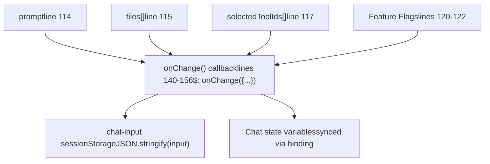
Sources: [src/lib/components/chat/MessageInput.svelte114-124](https://github.com/open-webui/open-webui/blob/a7271532/src/lib/components/chat/MessageInput.svelte#L114-L124) [src/lib/components/chat/MessageInput.svelte140-156](https://github.com/open-webui/open-webui/blob/a7271532/src/lib/components/chat/MessageInput.svelte#L140-L156) [src/lib/components/chat/MessageInput.svelte377-385](https://github.com/open-webui/open-webui/blob/a7271532/src/lib/components/chat/MessageInput.svelte#L377-L385) [src/lib/components/chat/Chat.svelte158-162](https://github.com/open-webui/open-webui/blob/a7271532/src/lib/components/chat/Chat.svelte#L158-L162)

## Text Input and Variable Processing

The text input system uses `RichTextInput.svelte` for the editor and processes template variables through a two-stage pipeline.

### Variable Substitution Pipeline

The system processes variables through a two-stage pipeline: built-in template variables first, then custom input variables.

**Diagram: Variable Processing Pipeline**

```mermaid
flowchart TD
    UserInput["User InputRichTextInput"]
    setTextEntry["setText(text, cb)lines 302-320"]
    textVarHandler["textVariableHandler(text)lines 178-289"]
    CLIPBOARD["{{CLIPBOARD}}navigator.clipboard.readText()lines 179-203"]
    USER_LOCATION["{{USER_LOCATION}}getUserPosition() from utilslines 206-214"]
    USER_NAME["{{USER_NAME}}sessionUser.namelines 219-222"]
    USER_BIO["{{USER_BIO}}sessionUser.biolines 224-230"]
    USER_GENDER["{{USER_GENDER}}sessionUser.genderlines 232-238"]
    USER_BIRTH_DATE["{{USER_BIRTH_DATE}}sessionUser.date_of_birthlines 240-246"]
    USER_AGE["{{USER_AGE}}getAge(birthDate)lines 248-256"]
    USER_LANGUAGE["{{USER_LANGUAGE}}localStorage.localelines 258-261"]
    CURRENT_DATE["{{CURRENT_DATE}}getFormattedDate()lines 263-266"]
    CURRENT_TIME["{{CURRENT_TIME}}getFormattedTime()lines 268-271"]
    CURRENT_DATETIME["{{CURRENT_DATETIME}}getCurrentDateTime()lines 273-276"]
    CURRENT_TIMEZONE["{{CURRENT_TIMEZONE}}getUserTimezone()lines 278-281"]
    CURRENT_WEEKDAY["{{CURRENT_WEEKDAY}}getWeekday()lines 283-286"]
    inputVarHandler["inputVariableHandler(text)lines 158-176"]
    extractInputVars["extractInputVariables(text)from $lib/utilsParses {{var|description}}"]
    showModal["showInputVariablesModal = truelines 167-175InputVariablesModal.svelte"]
    replaceVars["replaceVariables(variables)lines 291-300chatInputElement.replaceVariables()"]

    UserInput --> setTextEntry
    setTextEntry --> textVarHandler
    textVarHandler --> CLIPBOARD
    textVarHandler --> USER_LOCATION
    textVarHandler --> USER_NAME
    textVarHandler --> USER_BIO
    textVarHandler --> USER_GENDER
    textVarHandler --> USER_BIRTH_DATE
    textVarHandler --> USER_AGE
    textVarHandler --> USER_LANGUAGE
    textVarHandler --> CURRENT_DATE
    textVarHandler --> CURRENT_TIME
    textVarHandler --> CURRENT_DATETIME
    textVarHandler --> CURRENT_TIMEZONE
    textVarHandler --> CURRENT_WEEKDAY
    textVarHandler --> inputVarHandler
    inputVarHandler --> extractInputVars
    extractInputVars --> showModal
    showModal --> replaceVars
    extractInputVars --> replaceVars
    replaceVars --> UserInput
```
Sources: [src/lib/components/chat/MessageInput.svelte178-289](https://github.com/open-webui/open-webui/blob/a7271532/src/lib/components/chat/MessageInput.svelte#L178-L289) [src/lib/components/chat/MessageInput.svelte158-176](https://github.com/open-webui/open-webui/blob/a7271532/src/lib/components/chat/MessageInput.svelte#L158-L176) [src/lib/components/chat/MessageInput.svelte291-300](https://github.com/open-webui/open-webui/blob/a7271532/src/lib/components/chat/MessageInput.svelte#L291-L300) [src/lib/components/chat/MessageInput.svelte302-320](https://github.com/open-webui/open-webui/blob/a7271532/src/lib/components/chat/MessageInput.svelte#L302-L320) [src/lib/utils/index.ts](https://github.com/open-webui/open-webui/blob/a7271532/src/lib/utils/index.ts)

### Rich Text Editor Integration

`MessageInput` integrates `RichTextInput.svelte` (built on TipTap/ProseMirror) via the `chatInputElement` binding for advanced text editing.

**Editor Methods Called by MessageInput**

| Method | Purpose | Call Sites |
| --- | --- | --- |
| `setText(text)` | Set editor markdown content | lines 310, 589, 1262 |
| `focus()` | Focus the editor programmatically | lines 311, 842, 877, 912, 1322 |
| `getWordAtDocPos()` | Get word at cursor (for command detection) | line 327 |
| `replaceCommandWithText(text)` | Replace slash command with text | line 338 |
| `insertContent(text)` | Insert content at cursor position | line 349 |
| `replaceVariables(variables)` | Substitute {{var}} placeholders in editor | line 297 |
| `setContent(content)` | Set ProseMirror JSON content | line 1007 |

**Editor Component Configuration:**

```mermaid
flowchart TD
    RichTextInputComponent["RichTextInput.sveltelines 1157-1174"]
    thisBinding["bind:this={chatInputElement}line 1158"]
    contentBinding["bind:value={inputContent}line 1159"]
    promptBinding["bind:text={prompt}line 1160"]
    placeholderProp["placeholderline 1161"]
    suggestionsProp["suggestions={suggestions}line 1162"]
    onFileDrop["on:fileline 1165"]
    onCommandChange["on:command-changeline 1171"]
    fileDropHandler["on:file={(e) => inputFilesHandler(e.detail)}lines 1165-1167"]
    commandChangeHandler["on:command-change={(e) => command = e.detail}lines 1171-1173"]
    inputFilesHandler["inputFilesHandler()lines 643-755"]
    commandState["command variableline 377"]

    RichTextInputComponent --> thisBinding
    RichTextInputComponent --> contentBinding
    RichTextInputComponent --> promptBinding
    RichTextInputComponent --> placeholderProp
    RichTextInputComponent --> suggestionsProp
    RichTextInputComponent --> onFileDrop
    RichTextInputComponent --> onCommandChange
    fileDropHandler --> inputFilesHandler
    commandChangeHandler --> commandState
```
The editor is mounted in the DOM with `id="chat-input"` (line 1157) and supports collaborative editing via Yjs when configured with Socket.IO in the parent application.

Sources: [src/lib/components/chat/MessageInput.svelte1157-1174](https://github.com/open-webui/open-webui/blob/a7271532/src/lib/components/chat/MessageInput.svelte#L1157-L1174) [src/lib/components/chat/MessageInput.svelte302-320](https://github.com/open-webui/open-webui/blob/a7271532/src/lib/components/chat/MessageInput.svelte#L302-L320) [src/lib/components/chat/MessageInput.svelte322-375](https://github.com/open-webui/open-webui/blob/a7271532/src/lib/components/chat/MessageInput.svelte#L322-L375) [src/lib/components/common/RichTextInput.svelte](https://github.com/open-webui/open-webui/blob/a7271532/src/lib/components/common/RichTextInput.svelte)

## File Upload System

The file upload system handles multiple input methods and processes different file types through a unified pipeline.

### File Upload Architecture

**Diagram: File Upload Processing Flow**

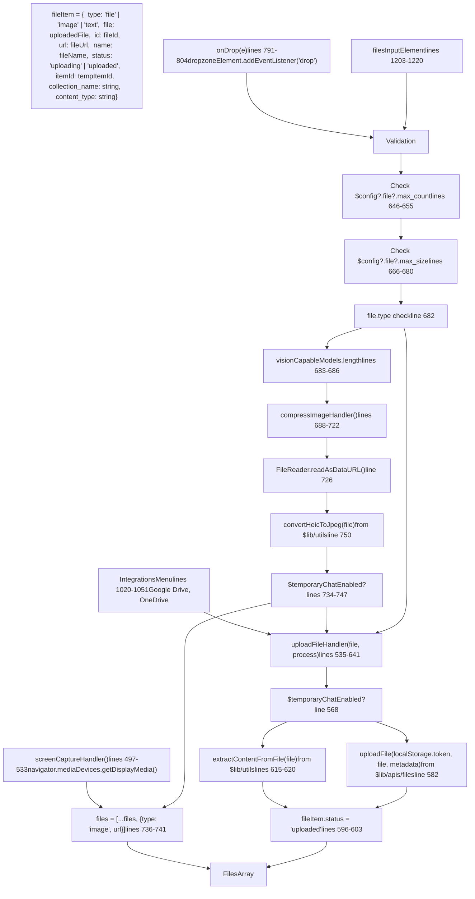
Sources: [src/lib/components/chat/MessageInput.svelte643-755](https://github.com/open-webui/open-webui/blob/a7271532/src/lib/components/chat/MessageInput.svelte#L643-L755) [src/lib/components/chat/MessageInput.svelte535-641](https://github.com/open-webui/open-webui/blob/a7271532/src/lib/components/chat/MessageInput.svelte#L535-L641) [src/lib/components/chat/MessageInput.svelte791-804](https://github.com/open-webui/open-webui/blob/a7271532/src/lib/components/chat/MessageInput.svelte#L791-L804) [src/lib/components/chat/MessageInput.svelte497-533](https://github.com/open-webui/open-webui/blob/a7271532/src/lib/components/chat/MessageInput.svelte#L497-L533) [src/lib/apis/files/index.ts](https://github.com/open-webui/open-webui/blob/a7271532/src/lib/apis/files/index.ts)

### File Type Processing

Different file types follow distinct processing paths with model capability checks:

| File Type | Detection Logic | Processing Function | Metadata | Result in `files[]` |
| --- | --- | --- | --- | --- |
| Images (PNG, JPG, WebP) | `file.type.startsWith('image/')` line 682 | `FileReader.readAsDataURL()` + `compressImage()` lines 688-750 | None | `{type: 'image', url: dataURL}` |
| HEIC Images | `file.type === 'image/heic'` line 750 | `convertHeicToJpeg()` from utils + compression | None | `{type: 'image', url: dataURL}` |
| PDFs, DOCX, TXT | Other types | `uploadFile(token, file, metadata)` API line 582 | `{channel_id}` (channels only) | `{type: 'file', file: {id, meta}, collection_name, status: 'uploaded'}` |
| Audio Files | `file.type.startsWith('audio/')` | `uploadFile()` with language metadata lines 571-579 | `{language: $settings?.audio?.stt?.language}` | `{type: 'file', file: {id}, status: 'uploaded'}` |
| Video Files | `file.type.startsWith('video/')` | Same as audio (STT extraction) | `{language: $settings?.audio?.stt?.language}` | `{type: 'file', file: {id}, status: 'uploaded'}` |

**Model Capability Checks:**

The component computes reactive capability arrays to validate uploads against selected models:

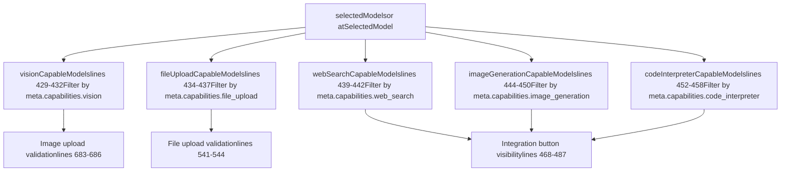
Sources: [src/lib/components/chat/MessageInput.svelte429-458](https://github.com/open-webui/open-webui/blob/a7271532/src/lib/components/chat/MessageInput.svelte#L429-L458) [src/lib/components/chat/MessageInput.svelte682-750](https://github.com/open-webui/open-webui/blob/a7271532/src/lib/components/chat/MessageInput.svelte#L682-L750) [src/lib/components/chat/MessageInput.svelte535-641](https://github.com/open-webui/open-webui/blob/a7271532/src/lib/components/chat/MessageInput.svelte#L535-L641) [src/lib/apis/files/index.ts](https://github.com/open-webui/open-webui/blob/a7271532/src/lib/apis/files/index.ts)

### Drag and Drop System

The drag-and-drop interface attaches event listeners to the `#chat-container` element for file uploads:

**Event Listener Lifecycle:**

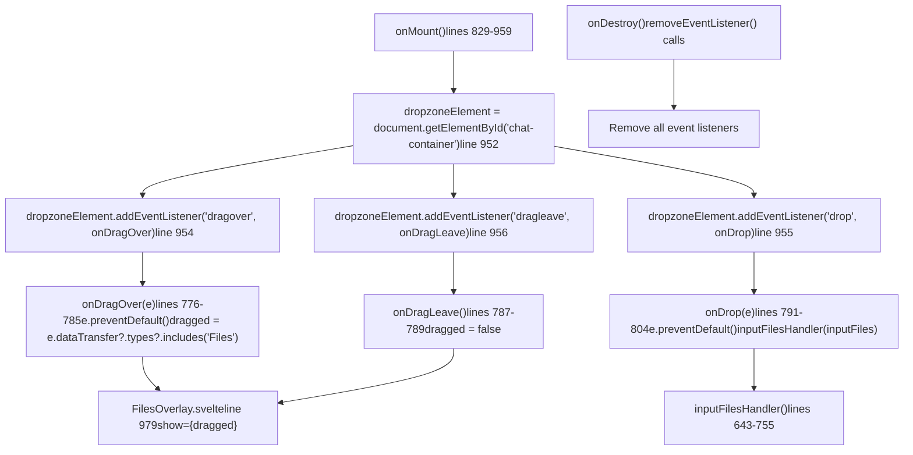
The `dragged` state variable (line 423) triggers `FilesOverlay.svelte` to display a full-screen drop zone indicator when files are dragged over the chat container.

Sources: [src/lib/components/chat/MessageInput.svelte776-804](https://github.com/open-webui/open-webui/blob/a7271532/src/lib/components/chat/MessageInput.svelte#L776-L804) [src/lib/components/chat/MessageInput.svelte952-956](https://github.com/open-webui/open-webui/blob/a7271532/src/lib/components/chat/MessageInput.svelte#L952-L956) [src/lib/components/chat/MessageInput.svelte961-976](https://github.com/open-webui/open-webui/blob/a7271532/src/lib/components/chat/MessageInput.svelte#L961-L976) [src/lib/components/chat/MessageInput/FilesOverlay.svelte](https://github.com/open-webui/open-webui/blob/a7271532/src/lib/components/chat/MessageInput/FilesOverlay.svelte)

## Command Suggestion System

The command system provides autocomplete for models, prompts, and files using TipTap's suggestion extension.

### Command Triggers and Processing

**Diagram: Command Suggestion System**

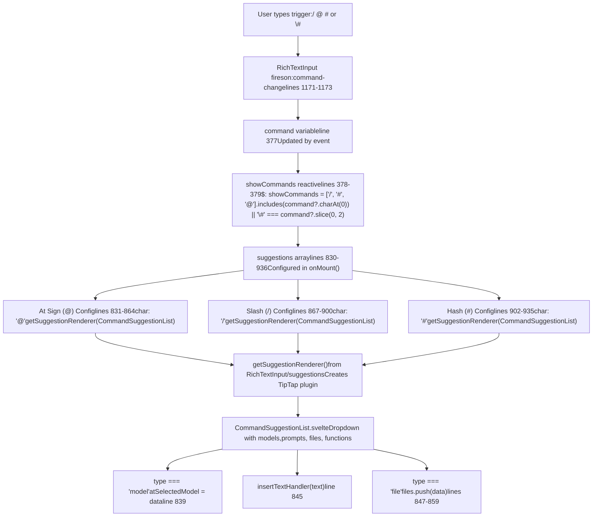
The `suggestions` array is initialized in `onMount()` (lines 830-936) with three configurations passed to `RichTextInput.svelte` (line 1162). Each uses `getSuggestionRenderer()` from `src/lib/components/common/RichTextInput/suggestions.ts` to create a TipTap Suggestion plugin that renders `CommandSuggestionList.svelte` in a floating dropdown.

Sources: [src/lib/components/chat/MessageInput.svelte830-936](https://github.com/open-webui/open-webui/blob/a7271532/src/lib/components/chat/MessageInput.svelte#L830-L936) [src/lib/components/chat/MessageInput.svelte378-379](https://github.com/open-webui/open-webui/blob/a7271532/src/lib/components/chat/MessageInput.svelte#L378-L379) [src/lib/components/chat/MessageInput.svelte1171-1173](https://github.com/open-webui/open-webui/blob/a7271532/src/lib/components/chat/MessageInput.svelte#L1171-L1173) [src/lib/components/chat/MessageInput/CommandSuggestionList.svelte](https://github.com/open-webui/open-webui/blob/a7271532/src/lib/components/chat/MessageInput/CommandSuggestionList.svelte) [src/lib/components/common/RichTextInput/suggestions.ts](https://github.com/open-webui/open-webui/blob/a7271532/src/lib/components/common/RichTextInput/suggestions.ts)

### Command Selection Actions

When a user selects an item from the command dropdown, different handlers execute based on selection type:

| Selection Type | Handler Logic | Location | Result |
| --- | --- | --- | --- |
| Model selection | `if (type === 'model') { atSelectedModel = data; }` | lines 838-840 | Sets `@model` override for single-model chat |
| Prompt text | `insertTextHandler(text)` call | line 845 | Calls `insertTextAtCursor()` to insert prompt content |
| Knowledge file | `if (type === 'file') { files = [...files, {...data, status: 'processed'}]; }` | lines 847-859 | Adds existing file to `files[]` without upload |
| Function/Tool | `insertTextHandler(text)` with function content | line 845 | Inserts function invocation syntax |
| Web URL | `onUpload(e)` dispatch | line 861 | Calls `uploadWeb()` or `uploadGoogleDriveFile()` in Chat.svelte |

**insertTextAtCursor Flow:**

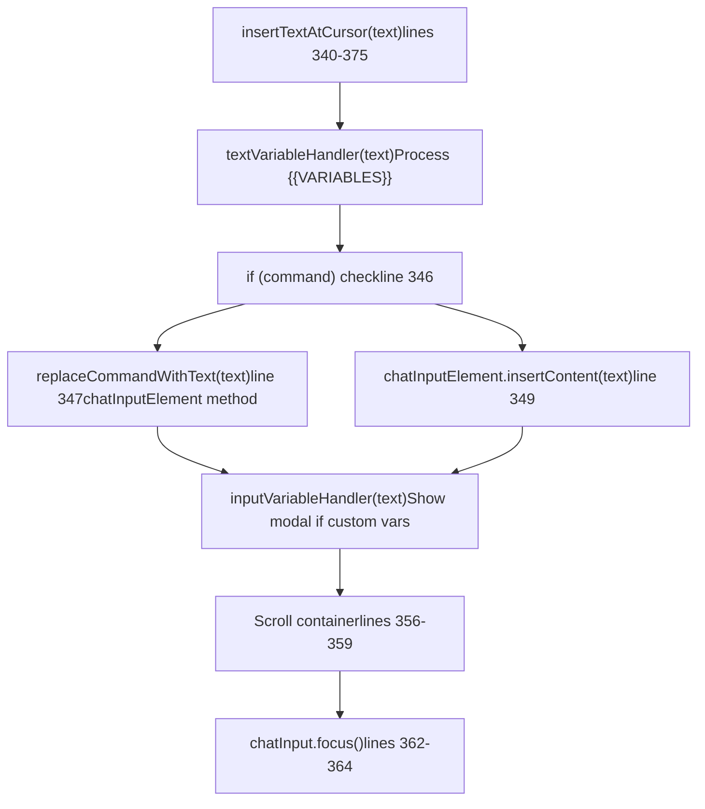
Sources: [src/lib/components/chat/MessageInput.svelte835-862](https://github.com/open-webui/open-webui/blob/a7271532/src/lib/components/chat/MessageInput.svelte#L835-L862) [src/lib/components/chat/MessageInput.svelte340-375](https://github.com/open-webui/open-webui/blob/a7271532/src/lib/components/chat/MessageInput.svelte#L340-L375) [src/lib/components/chat/MessageInput/CommandSuggestionList.svelte](https://github.com/open-webui/open-webui/blob/a7271532/src/lib/components/chat/MessageInput/CommandSuggestionList.svelte)

## Message Submission Flow

The submission process coordinates input validation, file processing, and triggers the message generation pipeline in the parent `Chat.svelte`.

### Submission Trigger and Validation

**Submit Form Handler:**

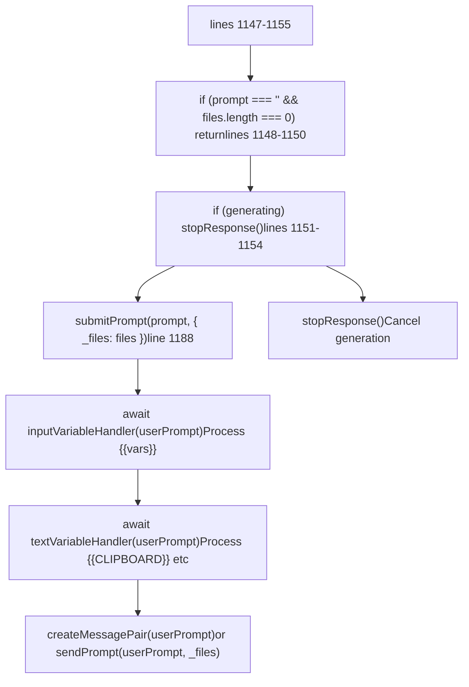
The `submitPrompt` function is defined in `Chat.svelte` and called via the prop binding. It receives the processed prompt and files array.

Sources: [src/lib/components/chat/MessageInput.svelte1147-1190](https://github.com/open-webui/open-webui/blob/a7271532/src/lib/components/chat/MessageInput.svelte#L1147-L1190) [src/lib/components/chat/Chat.svelte1761-1862](https://github.com/open-webui/open-webui/blob/a7271532/src/lib/components/chat/Chat.svelte#L1761-L1862)

### Input Component Actions

The `InputMenu.svelte` component (lines 1054-1118) provides quick actions that populate the message input:

**InputMenu Component:**

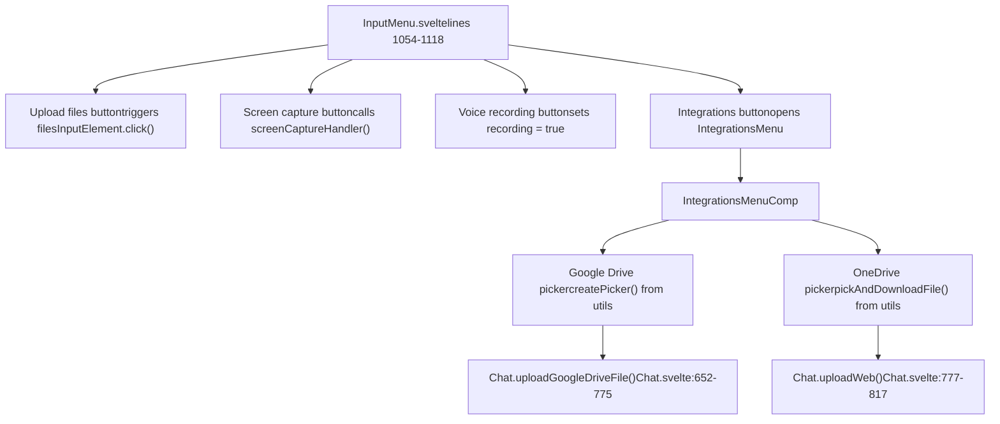
Sources: [src/lib/components/chat/MessageInput.svelte1054-1118](https://github.com/open-webui/open-webui/blob/a7271532/src/lib/components/chat/MessageInput.svelte#L1054-L1118) [src/lib/components/chat/MessageInput/IntegrationsMenu.svelte](https://github.com/open-webui/open-webui/blob/a7271532/src/lib/components/chat/MessageInput/IntegrationsMenu.svelte) [src/lib/components/chat/Chat.svelte652-817](https://github.com/open-webui/open-webui/blob/a7271532/src/lib/components/chat/Chat.svelte#L652-L817)

### Input State Integration

The `onChange` callback synchronizes input state with the parent chat component:

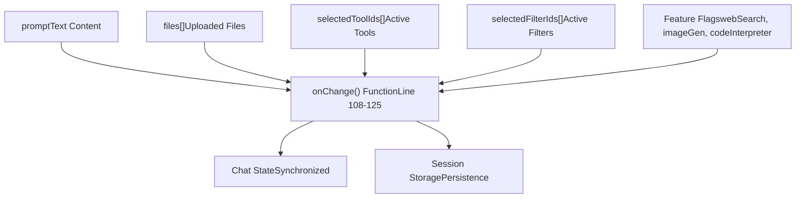
Sources: [src/lib/components/chat/MessageInput.svelte108-125](https://github.com/open-webui/open-webui/blob/a7271532/src/lib/components/chat/MessageInput.svelte#L108-L125) [src/lib/components/chat/Chat.svelte166-191](https://github.com/open-webui/open-webui/blob/a7271532/src/lib/components/chat/Chat.svelte#L166-L191)

The message input and processing system provides a comprehensive interface for user interaction, handling everything from simple text input to complex file uploads and variable substitution, ensuring that all user content is properly processed before being sent to AI models for generation.
