# Message History Tree

Relevant source files

-   [src/lib/components/channel/MessageInput.svelte](https://github.com/open-webui/open-webui/blob/a7271532/src/lib/components/channel/MessageInput.svelte)
-   [src/lib/components/chat/Chat.svelte](https://github.com/open-webui/open-webui/blob/a7271532/src/lib/components/chat/Chat.svelte)
-   [src/lib/components/chat/ChatPlaceholder.svelte](https://github.com/open-webui/open-webui/blob/a7271532/src/lib/components/chat/ChatPlaceholder.svelte)
-   [src/lib/components/chat/MessageInput.svelte](https://github.com/open-webui/open-webui/blob/a7271532/src/lib/components/chat/MessageInput.svelte)
-   [src/lib/components/chat/Messages.svelte](https://github.com/open-webui/open-webui/blob/a7271532/src/lib/components/chat/Messages.svelte)
-   [src/lib/components/chat/Messages/ResponseMessage.svelte](https://github.com/open-webui/open-webui/blob/a7271532/src/lib/components/chat/Messages/ResponseMessage.svelte)
-   [src/lib/components/chat/Messages/UserMessage.svelte](https://github.com/open-webui/open-webui/blob/a7271532/src/lib/components/chat/Messages/UserMessage.svelte)
-   [src/lib/components/chat/Placeholder.svelte](https://github.com/open-webui/open-webui/blob/a7271532/src/lib/components/chat/Placeholder.svelte)
-   [src/lib/components/chat/Settings/Interface.svelte](https://github.com/open-webui/open-webui/blob/a7271532/src/lib/components/chat/Settings/Interface.svelte)
-   [src/lib/components/chat/SettingsModal.svelte](https://github.com/open-webui/open-webui/blob/a7271532/src/lib/components/chat/SettingsModal.svelte)
-   [src/lib/components/chat/Suggestions.svelte](https://github.com/open-webui/open-webui/blob/a7271532/src/lib/components/chat/Suggestions.svelte)
-   [src/lib/components/common/FileItem.svelte](https://github.com/open-webui/open-webui/blob/a7271532/src/lib/components/common/FileItem.svelte)
-   [src/lib/components/common/FileItemModal.svelte](https://github.com/open-webui/open-webui/blob/a7271532/src/lib/components/common/FileItemModal.svelte)
-   [src/lib/components/common/Modal.svelte](https://github.com/open-webui/open-webui/blob/a7271532/src/lib/components/common/Modal.svelte)
-   [src/lib/utils/index.ts](https://github.com/open-webui/open-webui/blob/a7271532/src/lib/utils/index.ts)
-   [src/routes/(app)/+layout.svelte](https://github.com/open-webui/open-webui/blob/a7271532/src/routes/(app)/+layout.svelte)/+layout.svelte)
-   [src/routes/(app)/+page.svelte](https://github.com/open-webui/open-webui/blob/a7271532/src/routes/(app)/+page.svelte)/+page.svelte)
-   [src/routes/(app)/c/\[id\]/+page.svelte](src/routes/(app)/c/%5Bid%5D/+page.svelte)

## Purpose and Scope

This document explains the tree-based message history structure used in Open WebUI's chat system. The message history tree enables branching conversations, allowing users to regenerate responses, edit messages, and navigate between different conversation paths while preserving all variants.

For information about rendering individual messages, see [Message Rendering](/open-webui/open-webui/5-message-rendering). For details on how messages are created and submitted, see [Message Input System](/open-webui/open-webui/4.2-message-input-system).

---

## Overview

Open WebUI implements chat history as a tree structure rather than a linear list. This design choice enables:

-   **Multiple response variants**: When regenerating an assistant response, the new response becomes a sibling branch
-   **Conversation editing**: Users can edit any message and create alternate conversation paths
-   **Full history preservation**: All message variants are retained, not overwritten
-   **Branch navigation**: Users can navigate between different conversation paths

The tree is stored as a flat dictionary with parent-child relationships, combined with a pointer to the currently visible message path.

**Sources:** [src/lib/components/chat/Chat.svelte150-153](https://github.com/open-webui/open-webui/blob/a7271532/src/lib/components/chat/Chat.svelte#L150-L153) [src/lib/utils/index.ts187-218](https://github.com/open-webui/open-webui/blob/a7271532/src/lib/utils/index.ts#L187-L218)

---

## Data Structure

### History Object Schema

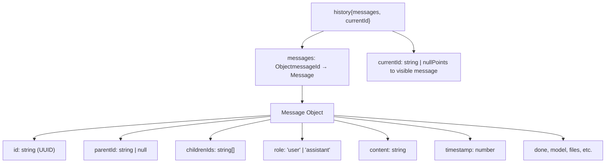
**Sources:** [src/lib/components/chat/Chat.svelte150-153](https://github.com/open-webui/open-webui/blob/a7271532/src/lib/components/chat/Chat.svelte#L150-L153) [src/lib/components/chat/Messages.svelte76-88](https://github.com/open-webui/open-webui/blob/a7271532/src/lib/components/chat/Messages.svelte#L76-L88)

### Message Object Properties

| Property | Type | Description |
| --- | --- | --- |
| `id` | `string` | UUID identifying this message |
| `parentId` | `string | null` | ID of parent message; `null` for root messages |
| `childrenIds` | `string[]` | Array of child message IDs (siblings when regenerated) |
| `role` | `'user' | 'assistant'` | Message author role |
| `content` | `string` | Message text content |
| `timestamp` | `number` | Unix epoch timestamp |
| `done` | `boolean` | Whether message generation is complete |
| `model` | `string` | Model ID (for assistant messages) |
| `files` | `array` | Attached files (optional) |
| `sources` | `array` | RAG sources/citations (optional) |
| `annotation` | `object` | User feedback rating (optional) |

**Sources:** [src/lib/components/chat/Messages/ResponseMessage.svelte66-115](https://github.com/open-webui/open-webui/blob/a7271532/src/lib/components/chat/Messages/ResponseMessage.svelte#L66-L115)

---

## Tree Structure Example

The following diagram illustrates how the message tree works when a user regenerates responses:

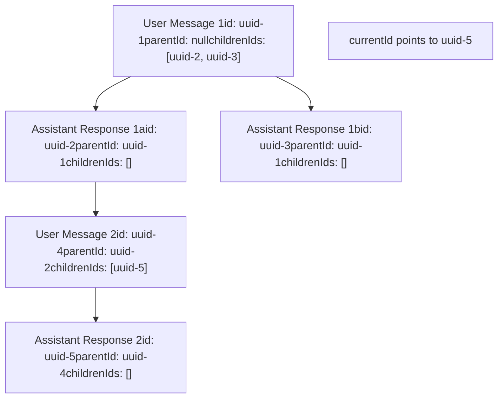
In this example:

-   User sends message (uuid-1)
-   Assistant responds (uuid-2)
-   User regenerates the response → creates sibling (uuid-3)
-   From the first response path, user continues with uuid-4
-   Assistant responds (uuid-5)
-   `currentId` points to uuid-5, making the path: uuid-1 → uuid-2 → uuid-4 → uuid-5 visible

**Sources:** [src/lib/components/chat/Chat.svelte1261-1318](https://github.com/open-webui/open-webui/blob/a7271532/src/lib/components/chat/Chat.svelte#L1261-L1318)

---

## Navigation Functions

### showMessage: Navigate to Specific Message

The `showMessage()` function navigates to a message and automatically follows the tree to the deepest child in that branch.

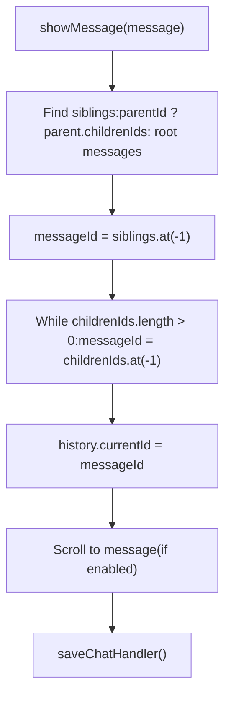
**Algorithm:**

1.  If `messageId` is null, find root messages; otherwise get parent's children
2.  Select the last sibling (most recent variant)
3.  Drill down to the deepest child by repeatedly selecting the last child
4.  Update `history.currentId`
5.  Scroll to message (if `settings.scrollOnBranchChange` is enabled)
6.  Save chat state to database

**Sources:** [src/lib/components/chat/Chat.svelte314-349](https://github.com/open-webui/open-webui/blob/a7271532/src/lib/components/chat/Chat.svelte#L314-L349)

### showPreviousMessage / showNextMessage: Sibling Navigation

These functions navigate between sibling messages (alternate responses/branches):

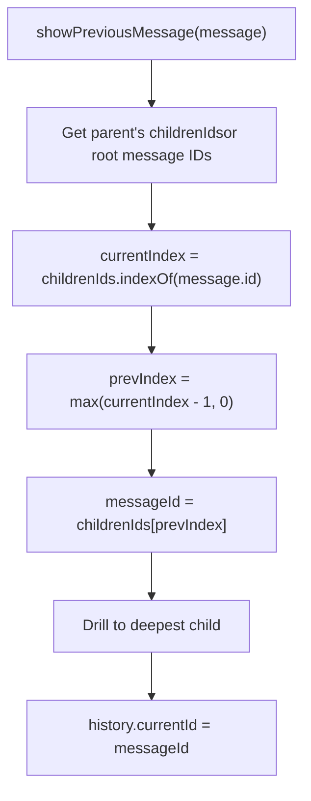
**Key behaviors:**

-   `showPreviousMessage()`: Moves to previous sibling (lower index), clamped at 0
-   `showNextMessage()`: Moves to next sibling (higher index), clamped at array length-1
-   After selecting sibling, drills down to deepest child on that branch
-   Updates `currentId` and optionally scrolls

**Sources:** [src/lib/components/chat/Messages.svelte157-253](https://github.com/open-webui/open-webui/blob/a7271532/src/lib/components/chat/Messages.svelte#L157-L253)

### gotoMessage: Jump to Specific Sibling Index

The `gotoMessage()` function allows direct navigation to a specific sibling by index:

| Parameter | Type | Description |
| --- | --- | --- |
| `message` | `Message` | Starting message |
| `idx` | `number` | Target sibling index (0-based) |

**Process:**

1.  Determine sibling list (parent's children or root messages)
2.  Clamp index to valid range: `[0, siblings.length-1]`
3.  Select message at index
4.  Drill to deepest child
5.  Update `currentId`
6.  Auto-scroll if enabled

**Sources:** [src/lib/components/chat/Messages.svelte116-155](https://github.com/open-webui/open-webui/blob/a7271532/src/lib/components/chat/Messages.svelte#L116-L155)

---

## Creating and Modifying the Tree

### Converting Linear Messages to Tree

When loading old chats or migrating from linear message format, `convertMessagesToHistory()` creates the tree structure:

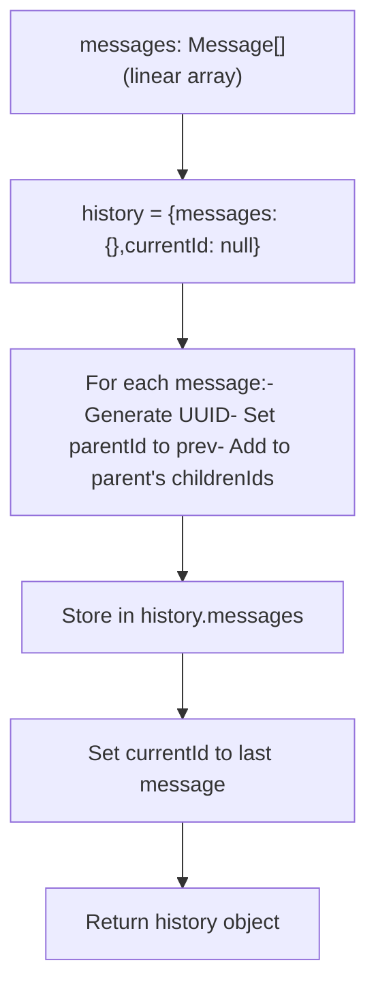
**Sources:** [src/lib/utils/index.ts187-218](https://github.com/open-webui/open-webui/blob/a7271532/src/lib/utils/index.ts#L187-L218) [src/lib/components/chat/Chat.svelte1091-1094](https://github.com/open-webui/open-webui/blob/a7271532/src/lib/components/chat/Chat.svelte#L1091-L1094)

### Adding Messages: Branching Points

When a message is edited or regenerated, new branches are created:

#### User Message Edit (Submit)

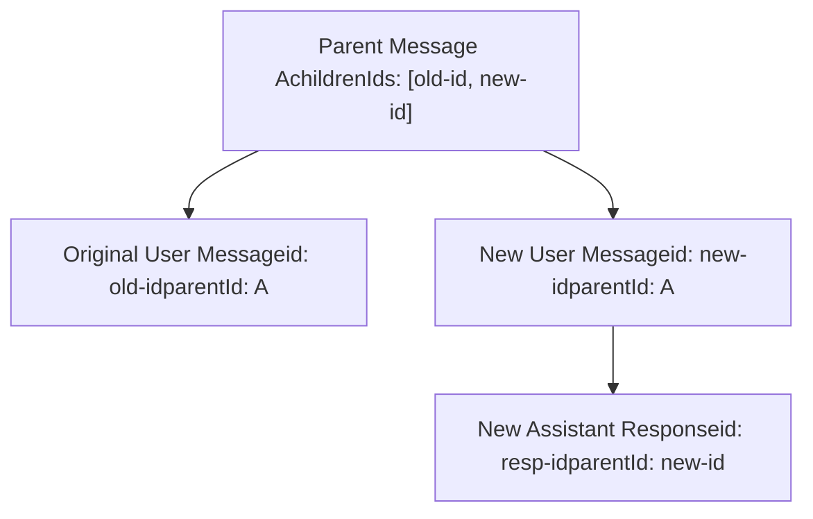
**Process:**

1.  Create new user message with new UUID
2.  Set `parentId` to original message's parent
3.  Add new message ID to parent's `childrenIds`
4.  Set `currentId` to new user message
5.  Trigger `sendMessage()` to generate response

**Sources:** [src/lib/components/chat/Messages.svelte264-305](https://github.com/open-webui/open-webui/blob/a7271532/src/lib/components/chat/Messages.svelte#L264-L305)

#### Response Regeneration

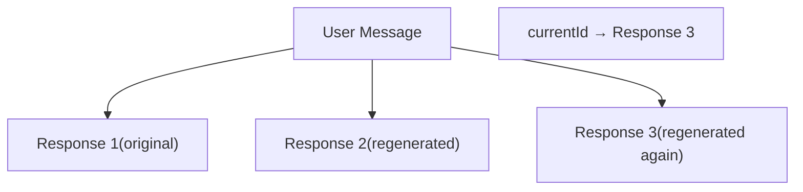
**Process:**

1.  Create new assistant message with new UUID
2.  Set `parentId` to user message
3.  Append to user message's `childrenIds` array
4.  Generate response content
5.  Update `currentId` to new response

**Sources:** [src/lib/components/chat/Chat.svelte1321-1368](https://github.com/open-webui/open-webui/blob/a7271532/src/lib/components/chat/Chat.svelte#L1321-L1368)

---

## Extracting Linear Message List

The UI needs a linear array of messages for rendering. The `createMessagesList()` utility traverses from `currentId` up to the root:

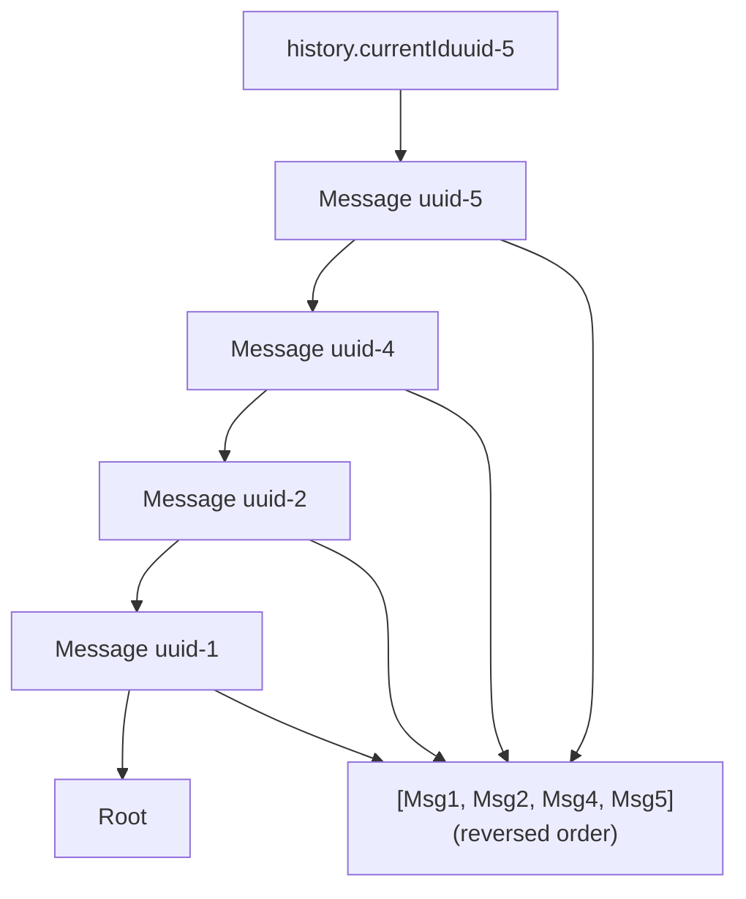
**Algorithm:**

1.  Start with message at `history.currentId`
2.  While message exists and not exceeding count limit:
    -   Add message to result array (at beginning)
    -   Move to parent: `message = history.messages[message.parentId]`
3.  Return reversed array (root → current)

**Sources:** [src/lib/utils/index.ts1076-1094](https://github.com/open-webui/open-webui/blob/a7271532/src/lib/utils/index.ts#L1076-L1094) [src/lib/components/chat/Messages.svelte76-88](https://github.com/open-webui/open-webui/blob/a7271532/src/lib/components/chat/Messages.svelte#L76-L88)

---

## Message Deletion and Tree Maintenance

Deleting a message requires careful tree restructuring to maintain integrity:

### Deletion Algorithm

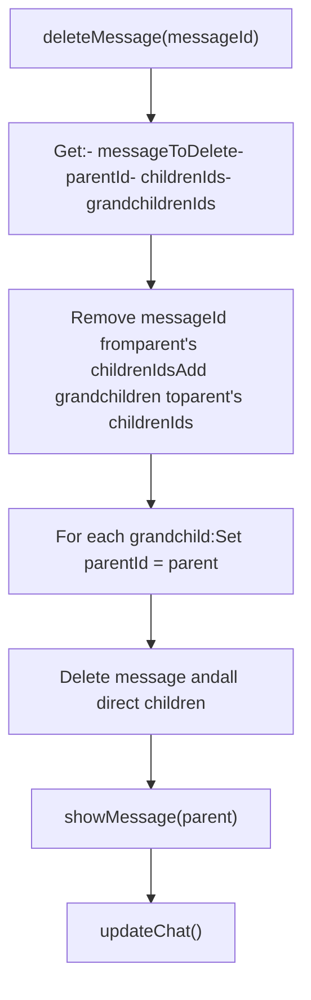
**Key operations:**

1.  Collect grandchildren (children of children)
2.  Remove target from parent's `childrenIds`
3.  Add grandchildren to parent's `childrenIds` (bypass deleted node)
4.  Update grandchildren's `parentId` to point to grandparent
5.  Delete target message and its direct children
6.  Navigate to parent message
7.  Save updated history

**Sources:** [src/lib/components/chat/Messages.svelte353-389](https://github.com/open-webui/open-webui/blob/a7271532/src/lib/components/chat/Messages.svelte#L353-L389)

---

## UI Components and Navigation Controls

### Branch Navigation UI

Users navigate branches through UI controls rendered in message components:

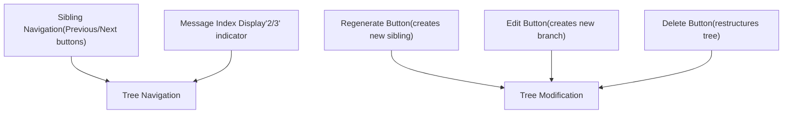
**Components:**

-   **ResponseMessage**: Shows navigation controls for assistant messages with siblings
-   **UserMessage**: Shows navigation controls for user messages with siblings
-   **Message**: Orchestrates rendering based on role and branch position

**Sources:** [src/lib/components/chat/Messages/ResponseMessage.svelte843-970](https://github.com/open-webui/open-webui/blob/a7271532/src/lib/components/chat/Messages/ResponseMessage.svelte#L843-L970) [src/lib/components/chat/Messages/UserMessage.svelte223-334](https://github.com/open-webui/open-webui/blob/a7271532/src/lib/components/chat/Messages/UserMessage.svelte#L223-L334)

### Sibling Count Display

The UI displays branch position as "currentIndex / totalSiblings":

```
// Calculate sibling position
let siblings;
if (message.parentId !== null) {
    siblings = history.messages[message.parentId].childrenIds;
} else {
    siblings = Object.values(history.messages)
        .filter(m => m.parentId === null)
        .map(m => m.id);
}
const currentIndex = siblings.indexOf(message.id) + 1;
const totalSiblings = siblings.length;
```
**Sources:** [src/lib/components/chat/Messages/ResponseMessage.svelte129-135](https://github.com/open-webui/open-webui/blob/a7271532/src/lib/components/chat/Messages/ResponseMessage.svelte#L129-L135)

---

## Persistence and Serialization

### Database Storage

The entire history object is serialized to JSON and stored in the database:

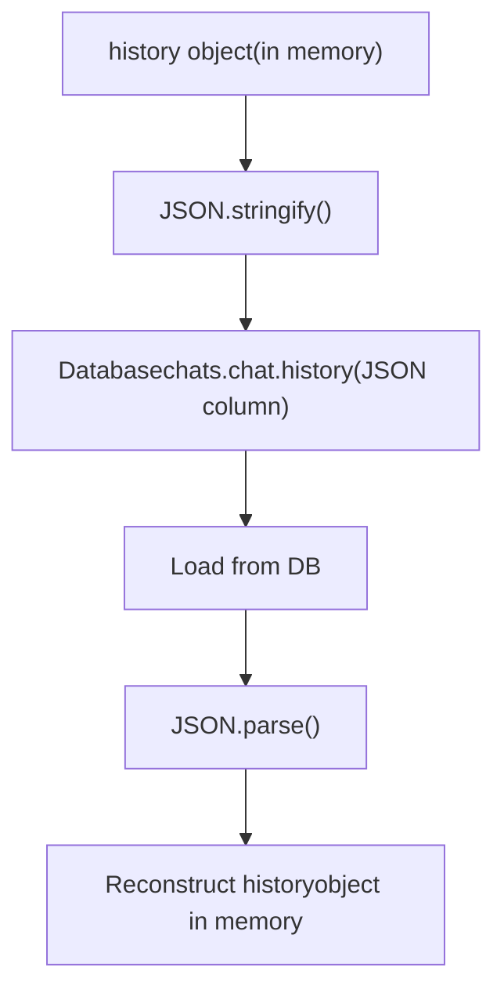
**Storage location:** `chats` table, `chat` column (JSON), `history` field

**Fallback:** If `history` field is missing (old chats), `convertMessagesToHistory()` migrates from `messages` array.

**Sources:** [src/lib/components/chat/Chat.svelte1058-1127](https://github.com/open-webui/open-webui/blob/a7271532/src/lib/components/chat/Chat.svelte#L1058-L1127) [src/lib/apis/chats/index.ts](https://github.com/open-webui/open-webui/blob/a7271532/src/lib/apis/chats/index.ts)

### Session Storage

Current input is saved to session storage to preserve state across navigation:

| Key | Value | Purpose |
| --- | --- | --- |
| `chat-input` | Input content | Preserve unsent message text |
| `chat-input-{chatId}` | Input content | Preserve per-chat drafts |

**Sources:** [src/lib/components/chat/Chat.svelte179-206](https://github.com/open-webui/open-webui/blob/a7271532/src/lib/components/chat/Chat.svelte#L179-L206)

---

## Performance Considerations

### Lazy Message Loading

To handle very long conversations, the system supports pagination:

```
// In Messages.svelte
let messagesCount: number | null = 20;

$: if (history.currentId) {
    let _messages = [];
    let message = history.messages[history.currentId];

    // Walk up tree, limiting to messagesCount
    while (message &&
           (messagesCount !== null ? _messages.length <= messagesCount : true)) {
        _messages.unshift({ ...message });
        message = message.parentId !== null ?
            history.messages[message.parentId] : null;
    }
    messages = _messages;
}
```
**Behavior:**

-   Initially loads 20 most recent messages in current branch
-   "Load More" button increments `messagesCount` by 20
-   `null` value loads entire history

**Sources:** [src/lib/components/chat/Messages.svelte63-88](https://github.com/open-webui/open-webui/blob/a7271532/src/lib/components/chat/Messages.svelte#L63-L88)

### Message Object Cloning

Deep cloning prevents reactive update issues:

```
let message = JSON.parse(JSON.stringify(history.messages[messageId]));
$: if (history.messages) {
    if (JSON.stringify(message) !==
        JSON.stringify(history.messages[messageId])) {
        message = JSON.parse(JSON.stringify(history.messages[messageId]));
    }
}
```
**Sources:** [src/lib/components/chat/Messages/ResponseMessage.svelte122-127](https://github.com/open-webui/open-webui/blob/a7271532/src/lib/components/chat/Messages/ResponseMessage.svelte#L122-L127)

---

## Integration Points

### Code Symbols Reference

| Symbol | Location | Purpose |
| --- | --- | --- |
| `history` | Chat.svelte:150-153 | Main history state object |
| `history.messages` | \- | Dictionary of all messages |
| `history.currentId` | \- | Pointer to visible message |
| `showMessage()` | Chat.svelte:314-349 | Navigate to message branch |
| `showPreviousMessage()` | Messages.svelte:157-202 | Previous sibling |
| `showNextMessage()` | Messages.svelte:204-253 | Next sibling |
| `gotoMessage()` | Messages.svelte:116-155 | Jump to sibling index |
| `createMessagesList()` | utils/index.ts:1076-1094 | Extract linear array |
| `convertMessagesToHistory()` | utils/index.ts:187-218 | Migrate old format |
| `editMessage()` | Messages.svelte:264-342 | Create new branch |
| `deleteMessage()` | Messages.svelte:353-389 | Remove node, restructure |
| `saveMessage()` | Messages.svelte:348-351 | Update single message |
| `updateChat()` | Messages.svelte:102-114 | Persist to database |

**Sources:** All file references as listed above
