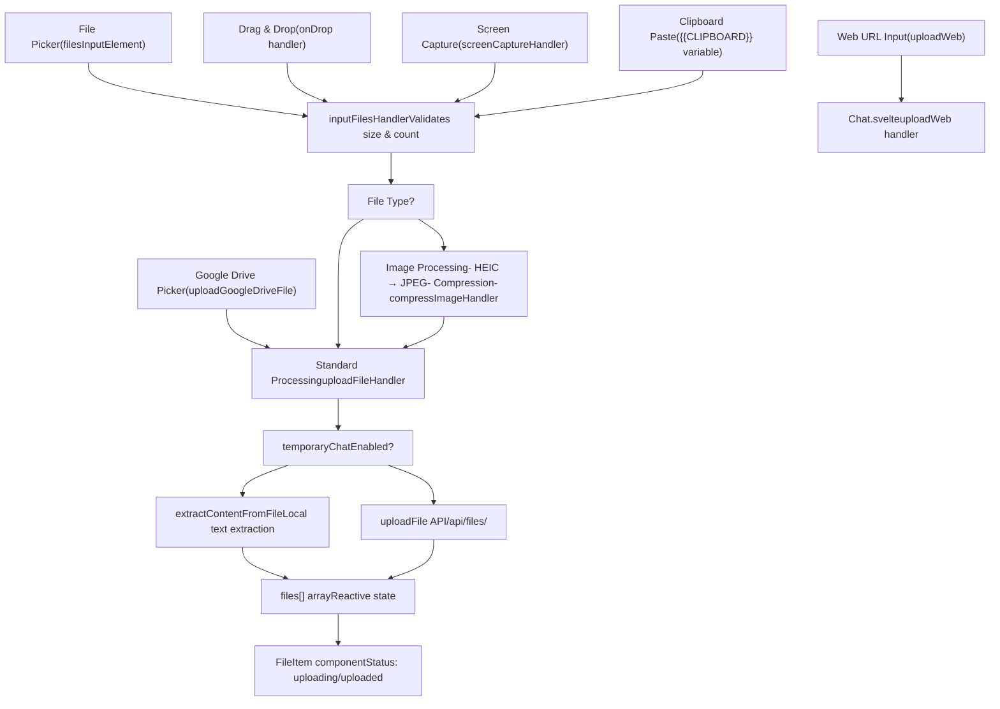
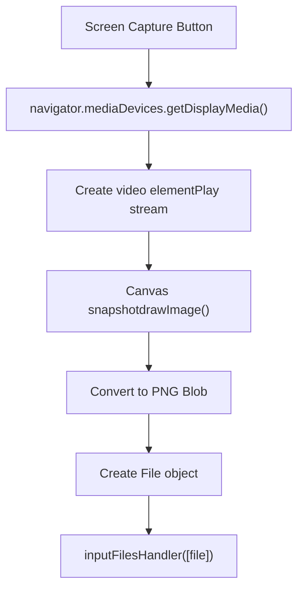
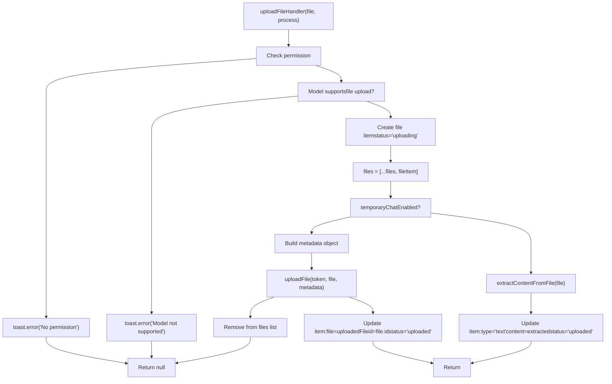
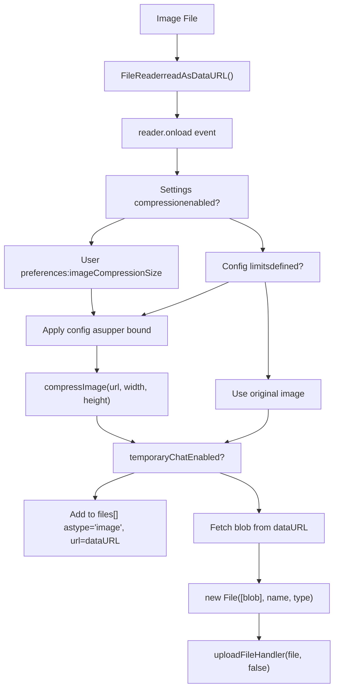
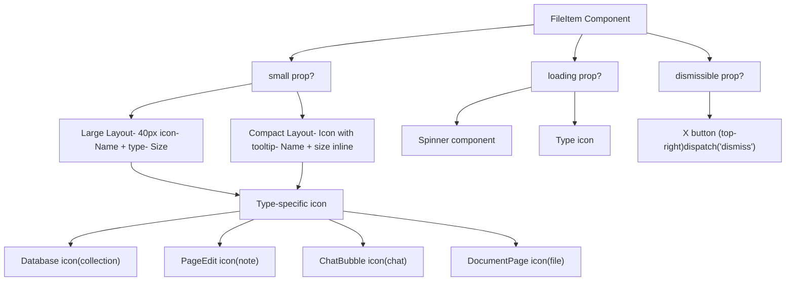

# File Upload and Processing

Relevant source files

-   [src/lib/components/channel/MessageInput.svelte](https://github.com/open-webui/open-webui/blob/a7271532/src/lib/components/channel/MessageInput.svelte)
-   [src/lib/components/chat/Chat.svelte](https://github.com/open-webui/open-webui/blob/a7271532/src/lib/components/chat/Chat.svelte)
-   [src/lib/components/chat/ChatPlaceholder.svelte](https://github.com/open-webui/open-webui/blob/a7271532/src/lib/components/chat/ChatPlaceholder.svelte)
-   [src/lib/components/chat/MessageInput.svelte](https://github.com/open-webui/open-webui/blob/a7271532/src/lib/components/chat/MessageInput.svelte)
-   [src/lib/components/chat/Placeholder.svelte](https://github.com/open-webui/open-webui/blob/a7271532/src/lib/components/chat/Placeholder.svelte)
-   [src/lib/components/chat/Suggestions.svelte](https://github.com/open-webui/open-webui/blob/a7271532/src/lib/components/chat/Suggestions.svelte)
-   [src/lib/components/common/FileItem.svelte](https://github.com/open-webui/open-webui/blob/a7271532/src/lib/components/common/FileItem.svelte)
-   [src/lib/components/common/FileItemModal.svelte](https://github.com/open-webui/open-webui/blob/a7271532/src/lib/components/common/FileItemModal.svelte)

## Purpose and Scope

This document covers the file upload and processing system in Open WebUI's chat interface. It explains how users attach files to chat messages, how those files are validated, processed, and uploaded to the server, and how different file types receive specialized handling. For information about how uploaded files are used in RAG retrieval after processing, see [Document Ingestion Pipeline](/open-webui/open-webui/7.1-document-ingestion-pipeline). For details about the file storage backend, see [Storage Provider Architecture](/open-webui/open-webui/12.1-storage-provider-architecture).

The system supports 40+ file types including images, documents, audio, video, and web content. Key features include drag-and-drop upload, image compression, HEIC conversion, screen capture, clipboard integration, and a temporary chat mode that processes files locally without server upload.

---

## System Architecture Overview

The file upload system is implemented primarily in the `MessageInput` component with support from the parent `Chat` component. Files flow through a multi-stage pipeline: input collection, validation, transformation (for images), upload to server, and status tracking.

### File Upload Architecture


**Sources:**

-   [src/lib/components/chat/MessageInput.svelte643-755](https://github.com/open-webui/open-webui/blob/a7271532/src/lib/components/chat/MessageInput.svelte#L643-L755)
-   [src/lib/components/chat/MessageInput.svelte535-641](https://github.com/open-webui/open-webui/blob/a7271532/src/lib/components/chat/MessageInput.svelte#L535-L641)
-   [src/lib/components/chat/Chat.svelte652-827](https://github.com/open-webui/open-webui/blob/a7271532/src/lib/components/chat/Chat.svelte#L652-L827)

---

## File Input Methods

### Drag-and-Drop

The system monitors drag events on the chat container to provide visual feedback and handle file drops.

> **[Mermaid sequence]**
> *(图表结构无法解析)*

The drag-and-drop implementation uses native HTML5 events registered on the `chat-container` element:

-   **onDragOver** [src/lib/components/chat/MessageInput.svelte776-785](https://github.com/open-webui/open-webui/blob/a7271532/src/lib/components/chat/MessageInput.svelte#L776-L785): Sets `dragged = true` if files are detected
-   **onDrop** [src/lib/components/chat/MessageInput.svelte791-804](https://github.com/open-webui/open-webui/blob/a7271532/src/lib/components/chat/MessageInput.svelte#L791-L804): Extracts files from `dataTransfer` and calls `inputFilesHandler`
-   **onDragLeave** [src/lib/components/chat/MessageInput.svelte787-789](https://github.com/open-webui/open-webui/blob/a7271532/src/lib/components/chat/MessageInput.svelte#L787-L789): Clears visual feedback

The `FilesOverlay` component displays a full-screen overlay when `dragged` is true, providing visual feedback that files can be dropped.

**Sources:**

-   [src/lib/components/chat/MessageInput.svelte776-804](https://github.com/open-webui/open-webui/blob/a7271532/src/lib/components/chat/MessageInput.svelte#L776-L804)
-   [src/lib/components/chat/MessageInput.svelte952-956](https://github.com/open-webui/open-webui/blob/a7271532/src/lib/components/chat/MessageInput.svelte#L952-L956)

### File Picker

Standard file input element allows users to select multiple files from their filesystem:

```
<input bind:this={filesInputElement}
       bind:files={inputFiles}
       type="file"
       hidden
       multiple
       on:change={...} />
```
When triggered by UI button clicks, the file picker opens and selected files are processed through `inputFilesHandler`.

**Sources:**

-   [src/lib/components/chat/MessageInput.svelte1269-1285](https://github.com/open-webui/open-webui/blob/a7271532/src/lib/components/chat/MessageInput.svelte#L1269-L1285)

### Screen Capture

The `screenCaptureHandler` allows users to capture a screenshot or window:


The handler [src/lib/components/chat/MessageInput.svelte497-533](https://github.com/open-webui/open-webui/blob/a7271532/src/lib/components/chat/MessageInput.svelte#L497-L533):

1.  Requests screen sharing via `getDisplayMedia()`
2.  Creates a temporary video element to capture a frame
3.  Draws the frame to a canvas
4.  Converts canvas to PNG data URL
5.  Creates a File object with name `screen-capture-{timestamp}.png`
6.  Passes to `inputFilesHandler`

**Sources:**

-   [src/lib/components/chat/MessageInput.svelte497-533](https://github.com/open-webui/open-webui/blob/a7271532/src/lib/components/chat/MessageInput.svelte#L497-L533)

### Clipboard Integration

The `{{CLIPBOARD}}` variable in prompts triggers clipboard access [src/lib/components/chat/MessageInput.svelte179-203](https://github.com/open-webui/open-webui/blob/a7271532/src/lib/components/chat/MessageInput.svelte#L179-L203):

```
if (text.includes('{{CLIPBOARD}}')) {
    const clipboardText = await navigator.clipboard.readText();
    const clipboardItems = await navigator.clipboard.read();

    for (const item of clipboardItems) {
        for (const type of item.types) {
            if (type.startsWith('image/')) {
                const blob = await item.getType(type);
                const file = new File([blob], `clipboard-image.${type.split('/')[1]}`, {
                    type: type
                });
                inputFilesHandler([file]);
            }
        }
    }

    text = text.replaceAll('{{CLIPBOARD}}', clipboardText);
}
```
This extracts both text and images from the clipboard. Text replaces the variable, while images are added to the files list.

**Sources:**

-   [src/lib/components/chat/MessageInput.svelte179-203](https://github.com/open-webui/open-webui/blob/a7271532/src/lib/components/chat/MessageInput.svelte#L179-L203)

### Google Drive and OneDrive

Integration with cloud storage providers:

-   **Google Drive**: Uses Google Drive Picker API via `createPicker` utility [src/lib/components/chat/Chat.svelte652-775](https://github.com/open-webui/open-webui/blob/a7271532/src/lib/components/chat/Chat.svelte#L652-L775)
-   **OneDrive**: Uses `pickAndDownloadFile` utility [src/lib/components/chat/MessageInput.svelte17](https://github.com/open-webui/open-webui/blob/a7271532/src/lib/components/chat/MessageInput.svelte#L17-L17)

The `uploadGoogleDriveFile` function [src/lib/components/chat/Chat.svelte652-775](https://github.com/open-webui/open-webui/blob/a7271532/src/lib/components/chat/Chat.svelte#L652-L775):

1.  Validates file data (id, name, url, authorization header)
2.  Fetches file content from Google Drive with OAuth token
3.  Converts response to Blob, then File object
4.  Calls standard `uploadFile` API
5.  Updates file item with uploaded file metadata

**Sources:**

-   [src/lib/components/chat/Chat.svelte652-775](https://github.com/open-webui/open-webui/blob/a7271532/src/lib/components/chat/Chat.svelte#L652-L775)
-   [src/lib/components/chat/MessageInput.svelte16-17](https://github.com/open-webui/open-webui/blob/a7271532/src/lib/components/chat/MessageInput.svelte#L16-L17)

### Web URL Upload

The `uploadWeb` function handles web URLs and YouTube videos [src/lib/components/chat/Chat.svelte777-817](https://github.com/open-webui/open-webui/blob/a7271532/src/lib/components/chat/Chat.svelte#L777-L817):

```
const uploadWeb = async (urls) => {
    if (!Array.isArray(urls)) {
        urls = [urls];
    }

    const fileItems = urls.map((url) => ({
        type: 'text',
        name: url,
        collection_name: '',
        status: 'uploading',
        context: 'full',
        url,
        error: ''
    }));

    files = [...files, ...fileItems];

    for (const fileItem of fileItems) {
        try {
            const res = isYoutubeUrl(fileItem.url)
                ? await processYoutubeVideo(localStorage.token, fileItem.url)
                : await processWeb(localStorage.token, '', fileItem.url);

            if (res) {
                fileItem.status = 'uploaded';
                fileItem.collection_name = res.collection_name;
                fileItem.file = { ...res.file, ...fileItem.file };
            }

            files = [...files];
        } catch (e) {
            files = files.filter((f) => f.name !== url);
            toast.error(`${e}`);
        }
    }
};
```
This calls backend APIs `processWeb` or `processYoutubeVideo` which extract content and create document collections.

**Sources:**

-   [src/lib/components/chat/Chat.svelte777-817](https://github.com/open-webui/open-webui/blob/a7271532/src/lib/components/chat/Chat.svelte#L777-L817)

---

## File Upload Pipeline

### Input Validation

The `inputFilesHandler` function [src/lib/components/chat/MessageInput.svelte643-755](https://github.com/open-webui/open-webui/blob/a7271532/src/lib/components/chat/MessageInput.svelte#L643-L755) performs validation before processing:

| Validation | Configuration | Behavior |
| --- | --- | --- |
| **File count limit** | `$config?.file?.max_count` | Rejects upload if `files.length + inputFiles.length > max_count` |
| **File size limit** | `$config?.file?.max_size` (MB) | Rejects individual files exceeding `max_size * 1024 * 1024` bytes |
| **Empty file check** | N/A | Rejects files with `size === 0` |
| **Model capability check** | `visionCapableModels` | For images, verifies selected model supports vision |
| **File upload permission** | `$_user?.permissions?.chat?.file_upload` | Non-admin users require this permission |

**Sources:**

-   [src/lib/components/chat/MessageInput.svelte643-680](https://github.com/open-webui/open-webui/blob/a7271532/src/lib/components/chat/MessageInput.svelte#L643-L680)
-   [src/lib/components/chat/MessageInput.svelte535-544](https://github.com/open-webui/open-webui/blob/a7271532/src/lib/components/chat/MessageInput.svelte#L535-L544)

### File Upload State Machine

Each file moves through a state machine tracked in the `files` array:

> **[Mermaid stateDiagram]**
> *(图表结构无法解析)*

The file item structure:

```
{
    type: 'file',        // or 'image', 'text'
    file: '',            // Populated after upload
    id: null,            // File ID from server
    url: '',             // File URL or data URL
    name: string,        // Original filename
    collection_name: '', // RAG collection name
    status: 'uploading' | 'uploaded',
    size: number,
    error: '',
    itemId: string       // Temporary UUID for tracking
}
```
**Sources:**

-   [src/lib/components/chat/MessageInput.svelte546-559](https://github.com/open-webui/open-webui/blob/a7271532/src/lib/components/chat/MessageInput.svelte#L546-L559)
-   [src/lib/components/chat/Chat.svelte668-679](https://github.com/open-webui/open-webui/blob/a7271532/src/lib/components/chat/Chat.svelte#L668-L679)

### Upload Handler Function

The core `uploadFileHandler` function [src/lib/components/chat/MessageInput.svelte535-641](https://github.com/open-webui/open-webui/blob/a7271532/src/lib/components/chat/MessageInput.svelte#L535-L641):


Key steps:

1.  **Permission check**: Verifies user has `chat.file_upload` permission
2.  **Capability check**: Ensures selected models support file uploads
3.  **Temporary ID**: Generates `uuidv4()` for tracking during upload
4.  **Empty file check**: Rejects files with `size === 0`
5.  **Metadata construction**: For audio/video, includes STT language setting
6.  **Upload or extract**: Calls `uploadFile` API or `extractContentFromFile` based on temporary chat mode
7.  **Update file item**: Populates `id`, `collection_name`, `content_type` on success

**Sources:**

-   [src/lib/components/chat/MessageInput.svelte535-641](https://github.com/open-webui/open-webui/blob/a7271532/src/lib/components/chat/MessageInput.svelte#L535-L641)

---

## Image Processing

Images receive special handling including format conversion and compression before upload.

### HEIC to JPEG Conversion

HEIC images (iOS format) are converted to JPEG using the `convertHeicToJpeg` utility:

```
reader.readAsDataURL(
    file['type'] === 'image/heic'
        ? await convertHeicToJpeg(file)
        : file
);
```
This conversion happens before compression, ensuring compatibility across browsers and models.

**Sources:**

-   [src/lib/components/chat/MessageInput.svelte750](https://github.com/open-webui/open-webui/blob/a7271532/src/lib/components/chat/MessageInput.svelte#L750-L750)
-   [src/lib/components/channel/MessageInput.svelte425](https://github.com/open-webui/open-webui/blob/a7271532/src/lib/components/channel/MessageInput.svelte#L425-L425)

### Image Compression Pipeline


The compression logic [src/lib/components/chat/MessageInput.svelte688-722](https://github.com/open-webui/open-webui/blob/a7271532/src/lib/components/chat/MessageInput.svelte#L688-L722):

```
const compressImageHandler = async (imageUrl, settings = {}, config = {}) => {
    const settingsCompression = settings?.imageCompression ?? false;
    const configWidth = config?.file?.image_compression?.width ?? null;
    const configHeight = config?.file?.image_compression?.height ?? null;

    // If neither settings nor config wants compression, return original URL.
    if (!settingsCompression && !configWidth && !configHeight) {
        return imageUrl;
    }

    let width = null;
    let height = null;

    // If user/settings want compression, pick their preferred size.
    if (settingsCompression) {
        width = settings?.imageCompressionSize?.width ?? null;
        height = settings?.imageCompressionSize?.height ?? null;
    }

    // Apply config limits as an upper bound if any
    if (configWidth && (width === null || width > configWidth)) {
        width = configWidth;
    }
    if (configHeight && (height === null || height > configHeight)) {
        height = configHeight;
    }

    // Do the compression if required
    if (width || height) {
        return await compressImage(imageUrl, width, height);
    }
    return imageUrl;
};
```
**Configuration hierarchy:**

1.  User setting: `$settings.imageCompression` and `$settings.imageCompressionSize`
2.  Server config: `$config.file.image_compression.width` and `.height` act as maximum bounds
3.  No compression if neither is enabled

**Sources:**

-   [src/lib/components/chat/MessageInput.svelte688-722](https://github.com/open-webui/open-webui/blob/a7271532/src/lib/components/chat/MessageInput.svelte#L688-L722)
-   [src/lib/components/chat/MessageInput.svelte724-747](https://github.com/open-webui/open-webui/blob/a7271532/src/lib/components/chat/MessageInput.svelte#L724-L747)

### Vision Model Validation

Before processing images, the system checks that selected models support vision:

```
let visionCapableModels = [];
$: visionCapableModels = (atSelectedModel?.id ? [atSelectedModel.id] : selectedModels).filter(
    (model) => $models.find((m) => m.id === model)?.info?.meta?.capabilities?.vision ?? true
);

// In inputFilesHandler:
if (file['type'].startsWith('image/')) {
    if (visionCapableModels.length === 0) {
        toast.error($i18n.t('Selected model(s) do not support image inputs'));
        return;
    }
    // ... process image
}
```
**Sources:**

-   [src/lib/components/chat/MessageInput.svelte429-432](https://github.com/open-webui/open-webui/blob/a7271532/src/lib/components/chat/MessageInput.svelte#L429-L432)
-   [src/lib/components/chat/MessageInput.svelte682-686](https://github.com/open-webui/open-webui/blob/a7271532/src/lib/components/chat/MessageInput.svelte#L682-L686)

---

## Temporary Chat Mode

When `temporaryChatEnabled` is true, files are processed locally without server upload. This is used for privacy-sensitive scenarios where chat history shouldn't be saved.

### Local Content Extraction

Instead of calling `uploadFile`, the system extracts content locally:

```
if ($temporaryChatEnabled) {
    const content = await extractContentFromFile(file).catch((error) => {
        toast.error(
            $i18n.t('Failed to extract content from the file: {{error}}', { error: error })
        );
        return null;
    });

    if (content === null) {
        toast.error($i18n.t('Failed to extract content from the file.'));
        files = files.filter((item) => item?.itemId !== tempItemId);
        return null;
    } else {
        fileItem.status = 'uploaded';
        fileItem.type = 'text';
        fileItem.content = content;
        fileItem.id = uuidv4(); // Temporary ID for the file

        files = files;
    }
}
```
The `extractContentFromFile` utility handles various file types:

-   **Text files**: Reads as text
-   **PDF**: Uses PDF.js to extract text
-   **Office documents**: Attempts text extraction
-   **Images**: Returns base64 data URL

For images in temporary chat mode, they're added directly as data URLs without extraction:

```
if ($temporaryChatEnabled) {
    files = [
        ...files,
        {
            type: 'image',
            url: imageUrl  // base64 data URL
        }
    ];
}
```
**Sources:**

-   [src/lib/components/chat/MessageInput.svelte612-640](https://github.com/open-webui/open-webui/blob/a7271532/src/lib/components/chat/MessageInput.svelte#L612-L640)
-   [src/lib/components/chat/MessageInput.svelte734-741](https://github.com/open-webui/open-webui/blob/a7271532/src/lib/components/chat/MessageInput.svelte#L734-L741)

---

## File Display and Management

### FileItem Component

Uploaded files are displayed using the `FileItem` component [src/lib/components/common/FileItem.svelte](https://github.com/open-webui/open-webui/blob/a7271532/src/lib/components/common/FileItem.svelte) which renders different layouts based on file type and size:


Props:

-   `item`: Full file object with metadata
-   `name`, `type`, `size`: Display properties
-   `loading`: Shows spinner during upload
-   `dismissible`: Adds X button to remove file
-   `small`: Compact layout for message input
-   `edit`: Enables editing in modal
-   `modal`: Opens `FileItemModal` on click

**Sources:**

-   [src/lib/components/common/FileItem.svelte1-206](https://github.com/open-webui/open-webui/blob/a7271532/src/lib/components/common/FileItem.svelte#L1-L206)

### FileItemModal Component

Clicking a file item opens `FileItemModal` [src/lib/components/common/FileItemModal.svelte](https://github.com/open-webui/open-webui/blob/a7271532/src/lib/components/common/FileItemModal.svelte) which displays file content with different renderers based on file type:

| File Type | Detection | Renderer |
| --- | --- | --- |
| **PDF** | `content_type === 'application/pdf'` or `.pdf` extension | `<iframe>` with `/files/{id}/content` |
| **Audio** | `content_type` starts with `audio/` or audio extensions | `<audio>` element |
| **Excel/CSV** | Excel/CSV content types or extensions | XLSX.js renders to HTML table with sheet tabs |
| **Markdown** | `.md` extension or `text/markdown` | `Markdown` component |
| **Code** | Code file extensions (`.py`, `.js`, etc.) | `CodeBlock` component with syntax highlighting |
| **Collection** | `type === 'collection'` | List of files in knowledge base |
| **Text** | Default | Plain text in `<pre>` |

**Excel/CSV Rendering:**

> **[Mermaid sequence]**
> *(图表结构无法解析)*

**Sources:**

-   [src/lib/components/common/FileItemModal.svelte1-484](https://github.com/open-webui/open-webui/blob/a7271532/src/lib/components/common/FileItemModal.svelte#L1-L484)
-   [src/lib/components/common/FileItemModal.svelte93-133](https://github.com/open-webui/open-webui/blob/a7271532/src/lib/components/common/FileItemModal.svelte#L93-L133)

### File Management UI

In the message input area, files are displayed in a horizontal scrollable list:

```
{#if files.length > 0}
    <div class="mx-2 mt-2.5 -mb-1 flex flex-wrap gap-2">
        {#each files as file, fileIdx}
            {#if file.type === 'image' || (file?.content_type ?? '').startsWith('image/')}
                <!-- Image preview with X button -->
                <div class="relative group">
                    <Image src={fileUrl} imageClassName="size-10 rounded-xl" />
                    <button class="absolute -top-1 -right-1"
                            on:click={() => { files.splice(fileIdx, 1); files = files; }}>
                        <XMark />
                    </button>
                </div>
            {:else}
                <!-- FileItem component -->
                <FileItem {file} small={true} dismissible={true}
                          on:dismiss={() => { files.splice(fileIdx, 1); files = files; }} />
            {/if}
        {/each}
    </div>
{/if}
```
Images show thumbnail previews while other files display with the `FileItem` component. All files can be removed via the dismiss button.

**Sources:**

-   [src/lib/components/chat/MessageInput.svelte1287-1350](https://github.com/open-webui/open-webui/blob/a7271532/src/lib/components/chat/MessageInput.svelte#L1287-L1350)
-   [src/lib/components/channel/MessageInput.svelte800-856](https://github.com/open-webui/open-webui/blob/a7271532/src/lib/components/channel/MessageInput.svelte#L800-L856)

---

## Integration with Chat System

### File Persistence

Files are persisted in chat history through the `files` field:

```
// In Chat.svelte saveChatHandler:
chat = await updateChatById(localStorage.token, _chatId, {
    models: selectedModels,
    messages: messages,
    history: history,
    params: params,
    files: chatFiles  // Global files array separate from per-message files
});
```
**Two file storage locations:**

1.  **Chat-level files** (`chatFiles`): Persistent across the chat session
2.  **Message-level files** (`files`): Attached to individual messages, passed in `submitPrompt`

When a message is submitted, the `files` array is converted to file references:

```
// In submitPrompt:
const userMessageContent = buildMessageContent(prompt, files);
```
Files with `context === 'full'` have their entire content injected into the prompt context, while others use segmented retrieval.

**Sources:**

-   [src/lib/components/chat/Chat.svelte1180-1192](https://github.com/open-webui/open-webui/blob/a7271532/src/lib/components/chat/Chat.svelte#L1180-L1192)
-   [src/lib/components/chat/MessageInput.svelte140-156](https://github.com/open-webui/open-webui/blob/a7271532/src/lib/components/chat/MessageInput.svelte#L140-L156)

### onChange Event Handler

The `MessageInput` component emits an `onChange` event whenever files or prompt changes:

```
$: onChange({
    prompt,
    files: files
        .filter((file) => file.type !== 'image')
        .map((file) => {
            return {
                ...file,
                user: undefined,
                access_control: undefined
            };
        }),
    selectedToolIds,
    selectedFilterIds,
    imageGenerationEnabled,
    webSearchEnabled,
    codeInterpreterEnabled
});
```
Images are excluded from this event since they're embedded directly in the message content as base64. The parent `Chat` component saves this state to `sessionStorage` for persistence across page reloads.

**Sources:**

-   [src/lib/components/chat/MessageInput.svelte140-156](https://github.com/open-webui/open-webui/blob/a7271532/src/lib/components/chat/MessageInput.svelte#L140-L156)
-   [src/lib/components/chat/Chat.svelte179-212](https://github.com/open-webui/open-webui/blob/a7271532/src/lib/components/chat/Chat.svelte#L179-L212)

### Audio File Language Metadata

When uploading audio or video files, the system includes the user's preferred STT language:

```
let metadata = null;
if (
    (file.type.startsWith('audio/') || file.type.startsWith('video/')) &&
    $settings?.audio?.stt?.language
) {
    metadata = {
        language: $settings?.audio?.stt?.language
    };
}

const uploadedFile = await uploadFile(localStorage.token, file, metadata);
```
This metadata is used by the backend's speech-to-text processing to improve transcription accuracy.

**Sources:**

-   [src/lib/components/chat/MessageInput.svelte570-579](https://github.com/open-webui/open-webui/blob/a7271532/src/lib/components/chat/MessageInput.svelte#L570-L579)
-   [src/lib/components/chat/Chat.svelte735-744](https://github.com/open-webui/open-webui/blob/a7271532/src/lib/components/chat/Chat.svelte#L735-L744)

---

## File Upload API Integration

### uploadFile API Function

The `uploadFile` function from `$lib/apis/files` handles the HTTP request:

```
const uploadedFile = await uploadFile(
    localStorage.token,  // Authentication token
    file,                // File object
    metadata,           // Optional: { language, channel_id, etc. }
    process             // Boolean: whether to extract content
);
```
**Request format:**

-   Method: `POST`
-   Endpoint: `/api/files/`
-   Content-Type: `multipart/form-data`
-   Body: File data + metadata JSON

**Response format:**

```
{
    id: string,                 // Unique file identifier
    filename: string,           // Original filename
    meta: {
        name: string,
        content_type: string,
        size: number,
        collection_name?: string  // For RAG-processed files
    },
    data?: {
        content: string          // Extracted text content
    }
}
```
The `process` parameter controls whether the server extracts text content. When `false` (for images), the file is stored but content extraction is skipped.

**Sources:**

-   [src/lib/components/chat/MessageInput.svelte582](https://github.com/open-webui/open-webui/blob/a7271532/src/lib/components/chat/MessageInput.svelte#L582-L582)
-   [src/lib/components/chat/Chat.svelte748](https://github.com/open-webui/open-webui/blob/a7271532/src/lib/components/chat/Chat.svelte#L748-L748)

---

## Summary

The file upload system provides a comprehensive multi-modal input experience:

**Key Components:**

-   `MessageInput.svelte`: Primary upload orchestration
-   `Chat.svelte`: Special handlers for web/cloud sources
-   `FileItem.svelte`: Display component
-   `FileItemModal.svelte`: Content preview modal

**Upload Methods:**

-   File picker, drag-and-drop, screen capture, clipboard paste
-   Google Drive, OneDrive integration
-   Web URL and YouTube video processing

**Processing Pipeline:**

1.  Input validation (size, count, permissions)
2.  Image transformation (HEIC→JPEG, compression)
3.  Upload or local extraction (temporary chat mode)
4.  Status tracking with reactive UI updates
5.  Persistence in chat history

**Special Features:**

-   Configurable image compression with user and server limits
-   Model capability validation (vision, file upload)
-   Temporary chat mode for privacy-sensitive scenarios
-   Rich file preview with type-specific renderers (PDF, Excel, audio, code)
-   STT language metadata for audio files
