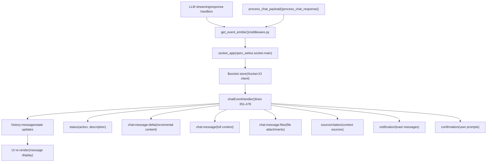
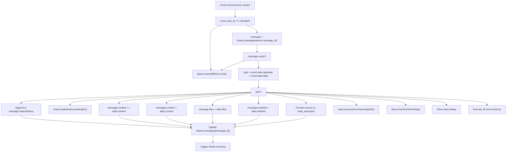
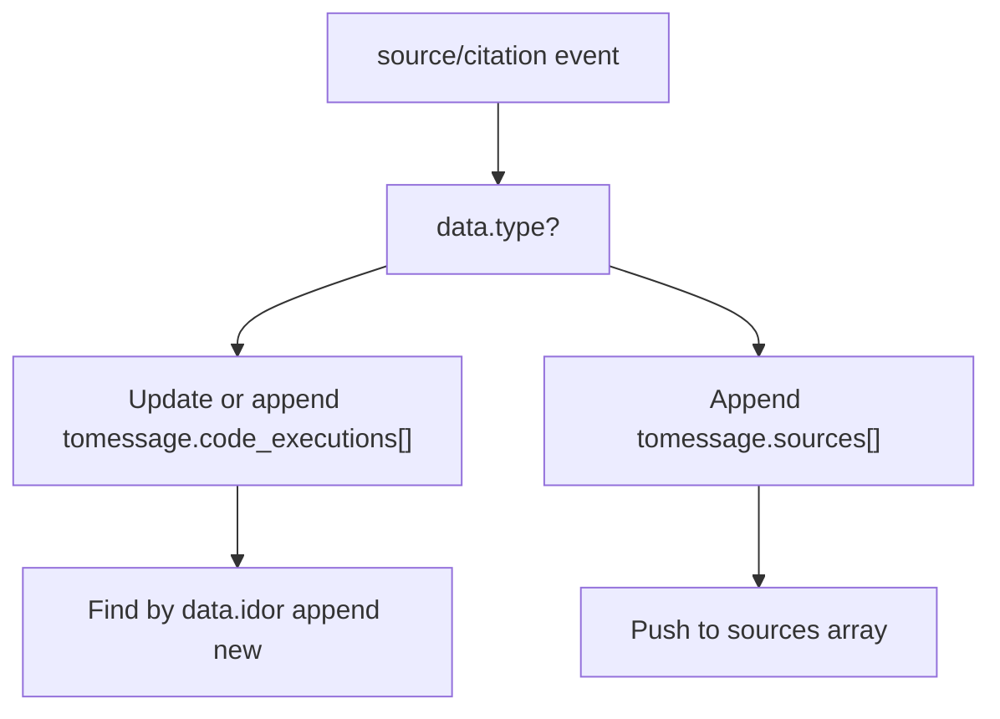
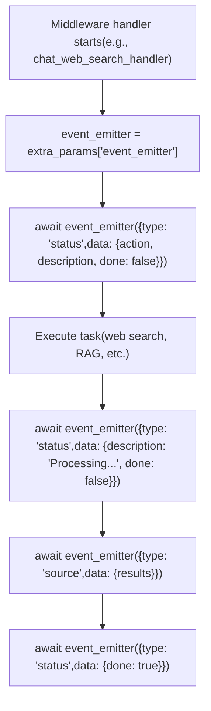

# WebSocket Event Handling

Relevant source files

-   [backend/open\_webui/config.py](https://github.com/open-webui/open-webui/blob/a7271532/backend/open_webui/config.py)
-   [backend/open\_webui/main.py](https://github.com/open-webui/open-webui/blob/a7271532/backend/open_webui/main.py)
-   [backend/open\_webui/retrieval/loaders/datalab\_marker.py](https://github.com/open-webui/open-webui/blob/a7271532/backend/open_webui/retrieval/loaders/datalab_marker.py)
-   [backend/open\_webui/retrieval/loaders/external\_document.py](https://github.com/open-webui/open-webui/blob/a7271532/backend/open_webui/retrieval/loaders/external_document.py)
-   [backend/open\_webui/retrieval/loaders/external\_web.py](https://github.com/open-webui/open-webui/blob/a7271532/backend/open_webui/retrieval/loaders/external_web.py)
-   [backend/open\_webui/retrieval/loaders/main.py](https://github.com/open-webui/open-webui/blob/a7271532/backend/open_webui/retrieval/loaders/main.py)
-   [backend/open\_webui/retrieval/loaders/mineru.py](https://github.com/open-webui/open-webui/blob/a7271532/backend/open_webui/retrieval/loaders/mineru.py)
-   [backend/open\_webui/retrieval/loaders/mistral.py](https://github.com/open-webui/open-webui/blob/a7271532/backend/open_webui/retrieval/loaders/mistral.py)
-   [backend/open\_webui/retrieval/utils.py](https://github.com/open-webui/open-webui/blob/a7271532/backend/open_webui/retrieval/utils.py)
-   [backend/open\_webui/routers/retrieval.py](https://github.com/open-webui/open-webui/blob/a7271532/backend/open_webui/routers/retrieval.py)
-   [backend/open\_webui/utils/middleware.py](https://github.com/open-webui/open-webui/blob/a7271532/backend/open_webui/utils/middleware.py)
-   [src/lib/apis/retrieval/index.ts](https://github.com/open-webui/open-webui/blob/a7271532/src/lib/apis/retrieval/index.ts)
-   [src/lib/components/admin/Settings/Documents.svelte](https://github.com/open-webui/open-webui/blob/a7271532/src/lib/components/admin/Settings/Documents.svelte)
-   [src/lib/components/admin/Settings/WebSearch.svelte](https://github.com/open-webui/open-webui/blob/a7271532/src/lib/components/admin/Settings/WebSearch.svelte)
-   [src/lib/components/channel/MessageInput.svelte](https://github.com/open-webui/open-webui/blob/a7271532/src/lib/components/channel/MessageInput.svelte)
-   [src/lib/components/chat/Chat.svelte](https://github.com/open-webui/open-webui/blob/a7271532/src/lib/components/chat/Chat.svelte)
-   [src/lib/components/chat/ChatPlaceholder.svelte](https://github.com/open-webui/open-webui/blob/a7271532/src/lib/components/chat/ChatPlaceholder.svelte)
-   [src/lib/components/chat/MessageInput.svelte](https://github.com/open-webui/open-webui/blob/a7271532/src/lib/components/chat/MessageInput.svelte)
-   [src/lib/components/chat/Placeholder.svelte](https://github.com/open-webui/open-webui/blob/a7271532/src/lib/components/chat/Placeholder.svelte)
-   [src/lib/components/chat/Suggestions.svelte](https://github.com/open-webui/open-webui/blob/a7271532/src/lib/components/chat/Suggestions.svelte)
-   [src/lib/components/common/FileItem.svelte](https://github.com/open-webui/open-webui/blob/a7271532/src/lib/components/common/FileItem.svelte)
-   [src/lib/components/common/FileItemModal.svelte](https://github.com/open-webui/open-webui/blob/a7271532/src/lib/components/common/FileItemModal.svelte)

This document describes the real-time event system that enables bidirectional communication between the Open WebUI frontend and backend during chat interactions. The WebSocket event handling system manages streaming responses, status updates, file notifications, and interactive prompts during chat sessions.

For information about the overall chat component architecture, see [Chat Component Architecture](/open-webui/open-webui/4.1-chat-component-architecture). For message rendering of WebSocket-delivered content, see [Response Message Component](/open-webui/open-webui/5.1-response-message-component).

---

## Architecture Overview

Open WebUI uses a Socket.IO-based WebSocket system to deliver real-time updates during chat interactions. The backend emits events through the `socket` store, and the frontend subscribes to these events in the main Chat component.

### WebSocket Communication Architecture


**Sources:** [src/lib/components/chat/Chat.svelte29](https://github.com/open-webui/open-webui/blob/a7271532/src/lib/components/chat/Chat.svelte#L29-L29) [src/lib/components/chat/Chat.svelte351-478](https://github.com/open-webui/open-webui/blob/a7271532/src/lib/components/chat/Chat.svelte#L351-L478) [backend/open\_webui/main.py63-69](https://github.com/open-webui/open-webui/blob/a7271532/backend/open_webui/main.py#L63-L69) [backend/open\_webui/utils/middleware.py332-334](https://github.com/open-webui/open-webui/blob/a7271532/backend/open_webui/utils/middleware.py#L332-L334)

---

## Event Subscription and Lifecycle

### Frontend Event Subscription

The Chat component subscribes to WebSocket events during the `onMount` lifecycle and unsubscribes on component destruction:

> **[Mermaid sequence]**
> *(图表结构无法解析)*

**Event Subscription Code:**

-   Subscription: [src/lib/components/chat/Chat.svelte552](https://github.com/open-webui/open-webui/blob/a7271532/src/lib/components/chat/Chat.svelte#L552-L552)
-   Unsubscription: [src/lib/components/chat/Chat.svelte643](https://github.com/open-webui/open-webui/blob/a7271532/src/lib/components/chat/Chat.svelte#L643-L643)
-   Handler function: [src/lib/components/chat/Chat.svelte351-478](https://github.com/open-webui/open-webui/blob/a7271532/src/lib/components/chat/Chat.svelte#L351-L478)

**Sources:** [src/lib/components/chat/Chat.svelte548-634](https://github.com/open-webui/open-webui/blob/a7271532/src/lib/components/chat/Chat.svelte#L548-L634) [src/lib/components/chat/Chat.svelte636-648](https://github.com/open-webui/open-webui/blob/a7271532/src/lib/components/chat/Chat.svelte#L636-L648)

---

## Event Types Reference

The `chatEventHandler` processes events based on the `type` field in `event.data`. The following table lists all supported event types:

| Event Type | Purpose | Data Payload | State Update |
| --- | --- | --- | --- |
| `status` | Display processing status (e.g., "Searching the web") | `{action, description, done}` | Appends to `message.statusHistory` |
| `chat:completion` | Trigger post-completion tasks (title generation, tags) | `{content}` | Calls `chatCompletionEventHandler()` |
| `chat:tasks:cancel` | Cancel running tasks and mark messages complete | `{}` | Sets `done: true` on messages |
| `chat:message:delta` | Stream incremental content chunks | `{content}` | Appends to `message.content` |
| `chat:message` (or `replace`) | Replace full message content | `{content}` | Replaces `message.content` |
| `chat:message:files` (or `files`) | Add file attachments to message | `{files: [...]}` | Sets `message.files` |
| `chat:message:embeds` (or `embeds`) | Add embedded UI components | `{embeds: [...]}` | Sets `message.embeds` |
| `chat:message:error` | Display error in message | `{error}` | Sets `message.error` |
| `chat:message:follow_ups` | Show follow-up suggestion buttons | `{follow_ups: [...]}` | Sets `message.followUps` |
| `chat:title` | Update chat title | `{title}` | Updates `chatTitle` store |
| `chat:tags` | Regenerate chat tags | `{}` | Refetches chat and tags |
| `source` or `citation` | Add retrieval source or code execution result | `{type, ...}` | Appends to `message.sources` or `message.code_executions` |
| `notification` | Show toast notification | `{type, content}` | Triggers toast UI |
| `confirmation` | Request user confirmation | `{title, message}` | Shows `EventConfirmDialog` |
| `input` | Request user text input | `{title, message, placeholder, value}` | Shows input dialog |
| `execute` | Execute client-side JavaScript | `{code}` | Executes code via `Function()` |

**Sources:** [src/lib/components/chat/Chat.svelte357-473](https://github.com/open-webui/open-webui/blob/a7271532/src/lib/components/chat/Chat.svelte#L357-L473)

---

## Event Data Structure

### Event Envelope

All WebSocket events follow a consistent envelope structure:

```
{
  chat_id: string,           // Current chat session ID
  message_id: string,        // Target message ID in history tree
  data: {
    type: string,            // Event type (from table above)
    data: object            // Type-specific payload
  }
}
```
### Event Filtering

The `chatEventHandler` only processes events matching the current `$chatId`:

```
if (event.chat_id === $chatId) {
  // Process event
  let message = history.messages[event.message_id];
  // ...
}
```
This ensures events from other chat sessions (e.g., in different browser tabs) are ignored.

**Sources:** [src/lib/components/chat/Chat.svelte354-356](https://github.com/open-webui/open-webui/blob/a7271532/src/lib/components/chat/Chat.svelte#L354-L356)

---

## Event Processing Flow

### Main Event Handler Flow


**Sources:** [src/lib/components/chat/Chat.svelte351-478](https://github.com/open-webui/open-webui/blob/a7271532/src/lib/components/chat/Chat.svelte#L351-L478)

---

## Special Event Handlers

### Status Event Handling

Status events maintain a history array showing the progression of backend processing:

```
if (type === 'status') {
  if (message?.statusHistory) {
    message.statusHistory.push(data);
  } else {
    message.statusHistory = [data];
  }
}
```
Example status data:

```
{
  action: "web_search",
  description: "Searching the web",
  done: false
}
```
**Sources:** [src/lib/components/chat/Chat.svelte362-367](https://github.com/open-webui/open-webui/blob/a7271532/src/lib/components/chat/Chat.svelte#L362-L367)

### Source and Citation Handling

The `source` or `citation` event type handles two distinct data structures:


**Code Execution Source:**

-   Tracks execution ID for updates: [src/lib/components/chat/Chat.svelte407-417](https://github.com/open-webui/open-webui/blob/a7271532/src/lib/components/chat/Chat.svelte#L407-L417)
-   Structure: `{type: 'code_execution', id, result, ...}`

**Regular Source:**

-   RAG retrieval sources
-   Web search results
-   Tool outputs

**Sources:** [src/lib/components/chat/Chat.svelte400-425](https://github.com/open-webui/open-webui/blob/a7271532/src/lib/components/chat/Chat.svelte#L400-L425)

### Notification Event Handling

Notifications are mapped to toast severity levels:

```
if (type === 'notification') {
  const toastType = data?.type ?? 'info';
  const toastContent = data?.content ?? '';

  if (toastType === 'success') {
    toast.success(toastContent);
  } else if (toastType === 'error') {
    toast.error(toastContent);
  } else if (toastType === 'warning') {
    toast.warning(toastContent);
  } else {
    toast.info(toastContent);
  }
}
```
**Sources:** [src/lib/components/chat/Chat.svelte426-438](https://github.com/open-webui/open-webui/blob/a7271532/src/lib/components/chat/Chat.svelte#L426-L438)

### Interactive Event Handling

**Confirmation Dialog:**

```
if (type === 'confirmation') {
  eventCallback = cb;
  showEventConfirmation = true;
  eventConfirmationTitle = data.title;
  eventConfirmationMessage = data.message;
}
```
**Input Dialog:**

```
if (type === 'input') {
  eventCallback = cb;
  eventConfirmationInput = true;
  showEventConfirmation = true;
  eventConfirmationTitle = data.title;
  eventConfirmationMessage = data.message;
  eventConfirmationInputPlaceholder = data.placeholder;
  eventConfirmationInputValue = data?.value ?? '';
}
```
Both store a callback function (`cb`) that is invoked when the user responds, allowing the backend to continue processing based on user input.

**Sources:** [src/lib/components/chat/Chat.svelte439-471](https://github.com/open-webui/open-webui/blob/a7271532/src/lib/components/chat/Chat.svelte#L439-L471)

---

## Backend Event Emission

### Event Emitter Function

The backend uses `event_emitter` functions passed through the middleware pipeline:

```
# In middleware.py
event_emitter = extra_params["__event_emitter__"]

await event_emitter({
    "type": "status",
    "data": {
        "action": "web_search",
        "description": "Searching the web",
        "done": False
    }
})
```
The `__event_emitter__` is created by `get_event_emitter()` from `open_webui.socket.main` and passed through the `extra_params` dictionary to all middleware handlers.

**Sources:** [backend/open\_webui/utils/middleware.py332-334](https://github.com/open-webui/open-webui/blob/a7271532/backend/open_webui/utils/middleware.py#L332-L334) [backend/open\_webui/utils/middleware.py558-568](https://github.com/open-webui/open-webui/blob/a7271532/backend/open_webui/utils/middleware.py#L558-L568)

### Event Emitter Usage Pattern


**Sources:** [backend/open\_webui/utils/middleware.py555-620](https://github.com/open-webui/open-webui/blob/a7271532/backend/open_webui/utils/middleware.py#L555-L620)

---

## Integration with Chat State

### Message State Updates

The `history.messages` object is the single source of truth for all message state. WebSocket events mutate this object, triggering Svelte reactivity:

```
// Event handler updates the message
history.messages[event.message_id] = message;

// Svelte detects the mutation and re-renders
```
**Key State Properties Updated by Events:**

| Property | Event Type | Purpose |
| --- | --- | --- |
| `content` | `chat:message:delta`, `chat:message` | Message text |
| `statusHistory` | `status` | Processing steps |
| `sources` | `source`, `citation` | Context sources |
| `code_executions` | `source` (type: code\_execution) | Code execution results |
| `files` | `chat:message:files` | File attachments |
| `embeds` | `chat:message:embeds` | Embedded UI |
| `error` | `chat:message:error` | Error state |
| `followUps` | `chat:message:follow_ups` | Suggestion buttons |
| `done` | `chat:tasks:cancel` | Completion flag |

**Sources:** [src/lib/components/chat/Chat.svelte147-153](https://github.com/open-webui/open-webui/blob/a7271532/src/lib/components/chat/Chat.svelte#L147-L153) [src/lib/components/chat/Chat.svelte475](https://github.com/open-webui/open-webui/blob/a7271532/src/lib/components/chat/Chat.svelte#L475-L475)

### Auto-scroll Behavior

After updating message state, the system checks if auto-scroll is enabled and scrolls to show new content:

```
if (type === 'chat:message:follow_ups') {
  message.followUps = data.follow_ups;

  if (autoScroll) {
    scrollToBottom('smooth');
  }
}
```
**Sources:** [src/lib/components/chat/Chat.svelte387-392](https://github.com/open-webui/open-webui/blob/a7271532/src/lib/components/chat/Chat.svelte#L387-L392)

---

## Redis-Based Distribution

In distributed deployments, WebSocket events are broadcast via Redis to ensure all connected clients receive updates:

```
# In main.py
app.state.redis = get_redis_connection(
    redis_url=REDIS_URL,
    redis_sentinels=get_sentinels_from_env(
        REDIS_SENTINEL_HOSTS, REDIS_SENTINEL_PORT
    ),
    redis_cluster=REDIS_CLUSTER,
    async_mode=True,
)
```
This allows horizontal scaling where multiple backend servers can emit events to clients connected to any server instance.

**Sources:** [backend/open\_webui/main.py586-593](https://github.com/open-webui/open-webui/blob/a7271532/backend/open_webui/main.py#L586-L593) [backend/open\_webui/main.py656](https://github.com/open-webui/open-webui/blob/a7271532/backend/open_webui/main.py#L656-L656)

---

## Error Handling

The event handler includes error recovery:

1.  **Event filtering:** Only processes events matching `$chatId`
2.  **Message existence check:** Verifies message exists in `history.messages` before updating
3.  **Safe property access:** Uses optional chaining (`message?.property`)
4.  **Graceful degradation:** Unknown event types are logged but don't crash the handler

```
if (event.chat_id === $chatId) {
  await tick();
  let message = history.messages[event.message_id];

  if (message) {
    // Process event
  }
}
```
**Sources:** [src/lib/components/chat/Chat.svelte354-476](https://github.com/open-webui/open-webui/blob/a7271532/src/lib/components/chat/Chat.svelte#L354-L476)
