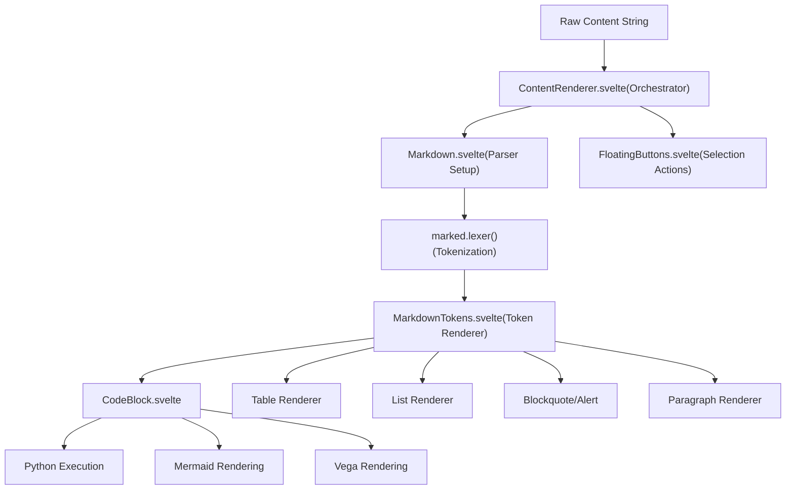
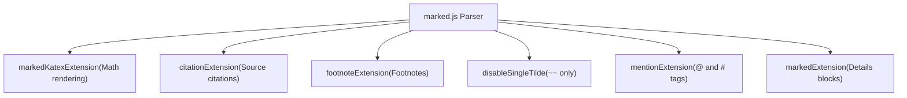
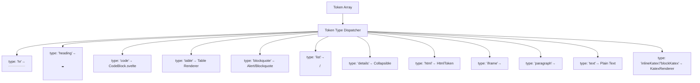
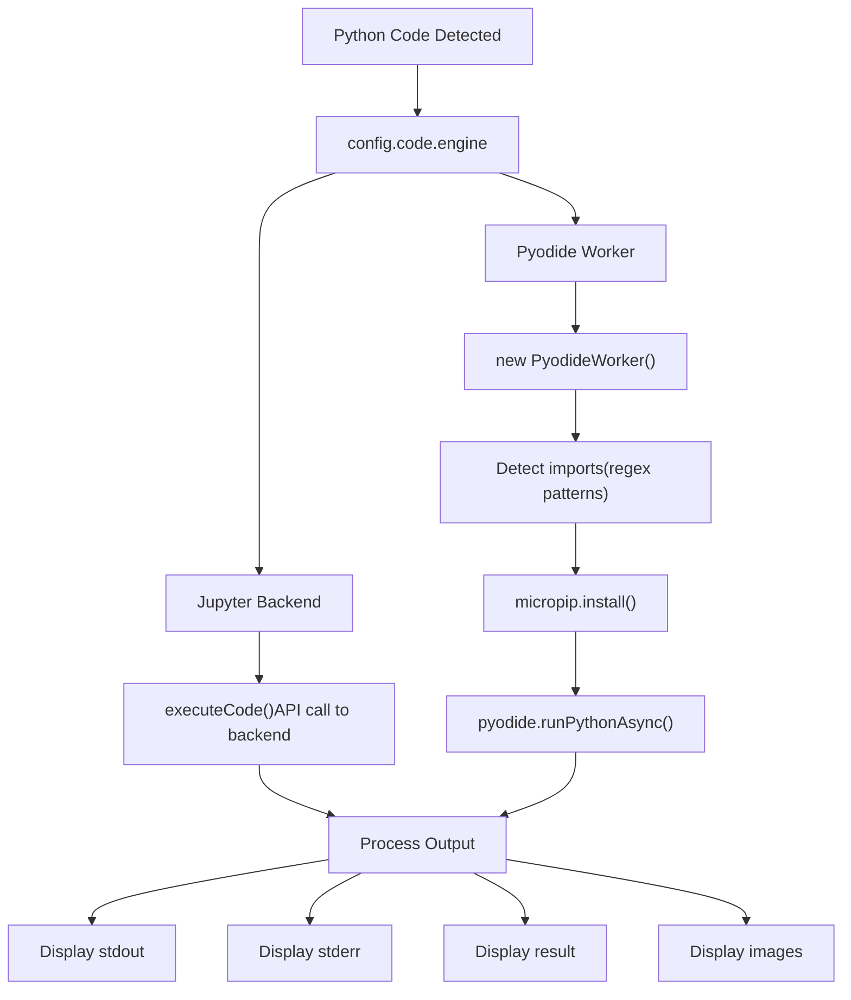
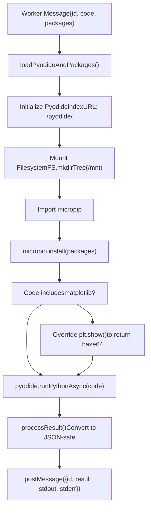
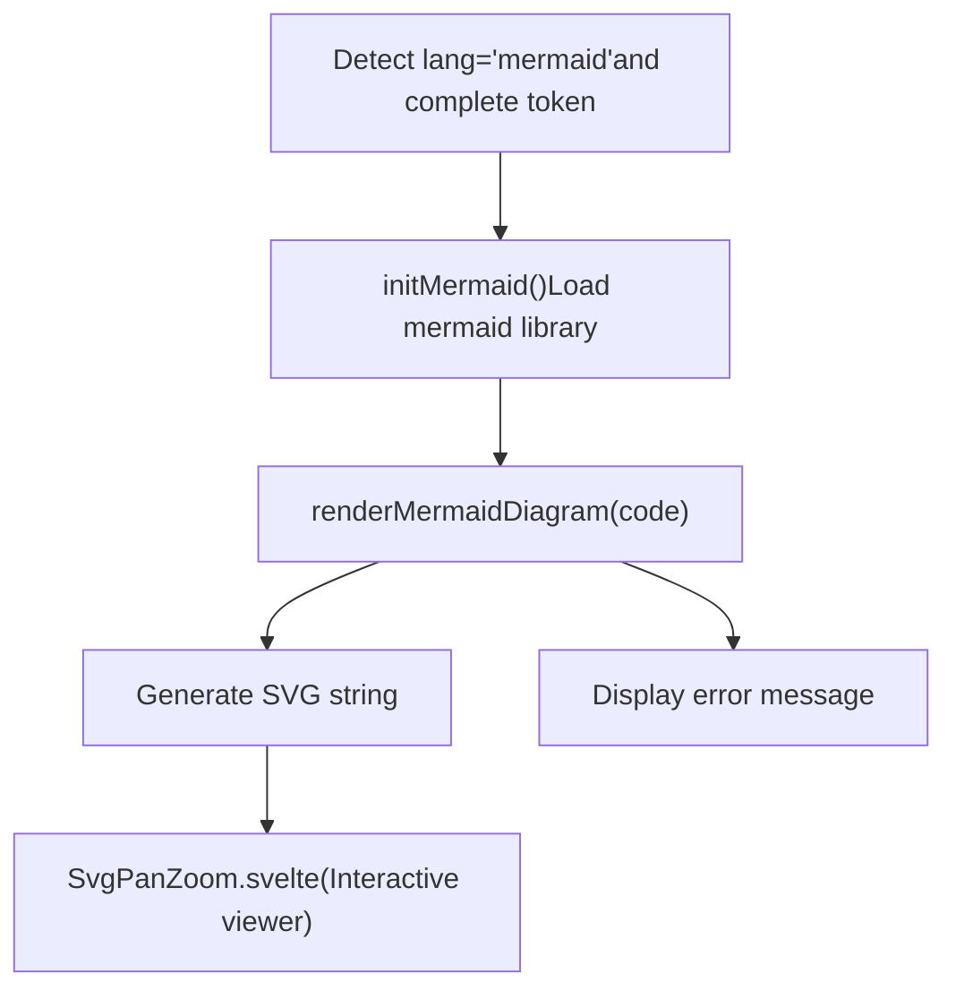
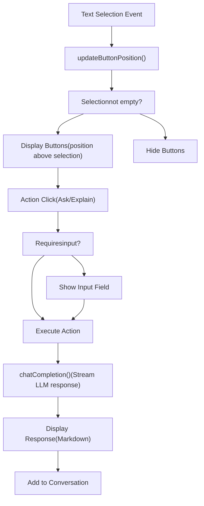
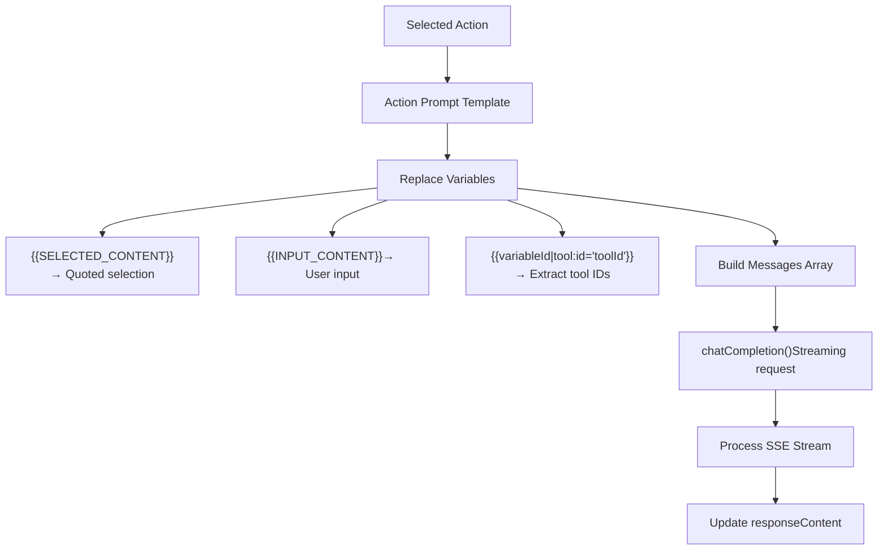
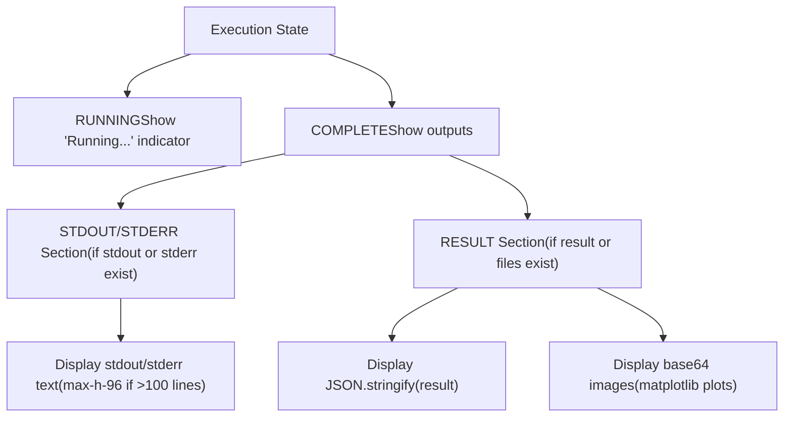

# Message Content Rendering

Relevant source files

-   [src/lib/components/chat/ContentRenderer/FloatingButtons.svelte](https://github.com/open-webui/open-webui/blob/a7271532/src/lib/components/chat/ContentRenderer/FloatingButtons.svelte)
-   [src/lib/components/chat/Messages.svelte](https://github.com/open-webui/open-webui/blob/a7271532/src/lib/components/chat/Messages.svelte)
-   [src/lib/components/chat/Messages/CodeBlock.svelte](https://github.com/open-webui/open-webui/blob/a7271532/src/lib/components/chat/Messages/CodeBlock.svelte)
-   [src/lib/components/chat/Messages/ContentRenderer.svelte](https://github.com/open-webui/open-webui/blob/a7271532/src/lib/components/chat/Messages/ContentRenderer.svelte)
-   [src/lib/components/chat/Messages/Markdown.svelte](https://github.com/open-webui/open-webui/blob/a7271532/src/lib/components/chat/Messages/Markdown.svelte)
-   [src/lib/components/chat/Messages/Markdown/AlertRenderer.svelte](https://github.com/open-webui/open-webui/blob/a7271532/src/lib/components/chat/Messages/Markdown/AlertRenderer.svelte)
-   [src/lib/components/chat/Messages/Markdown/MarkdownTokens.svelte](https://github.com/open-webui/open-webui/blob/a7271532/src/lib/components/chat/Messages/Markdown/MarkdownTokens.svelte)
-   [src/lib/components/chat/Messages/Message.svelte](https://github.com/open-webui/open-webui/blob/a7271532/src/lib/components/chat/Messages/Message.svelte)
-   [src/lib/components/chat/Messages/MultiResponseMessages.svelte](https://github.com/open-webui/open-webui/blob/a7271532/src/lib/components/chat/Messages/MultiResponseMessages.svelte)
-   [src/lib/components/chat/Messages/ResponseMessage.svelte](https://github.com/open-webui/open-webui/blob/a7271532/src/lib/components/chat/Messages/ResponseMessage.svelte)
-   [src/lib/components/chat/Messages/UserMessage.svelte](https://github.com/open-webui/open-webui/blob/a7271532/src/lib/components/chat/Messages/UserMessage.svelte)
-   [src/lib/components/chat/Settings/Interface.svelte](https://github.com/open-webui/open-webui/blob/a7271532/src/lib/components/chat/Settings/Interface.svelte)
-   [src/lib/components/chat/SettingsModal.svelte](https://github.com/open-webui/open-webui/blob/a7271532/src/lib/components/chat/SettingsModal.svelte)
-   [src/lib/components/common/Modal.svelte](https://github.com/open-webui/open-webui/blob/a7271532/src/lib/components/common/Modal.svelte)
-   [src/lib/utils/index.ts](https://github.com/open-webui/open-webui/blob/a7271532/src/lib/utils/index.ts)
-   [src/lib/utils/marked/strikethrough-extension.ts](https://github.com/open-webui/open-webui/blob/a7271532/src/lib/utils/marked/strikethrough-extension.ts)
-   [src/lib/workers/pyodide.worker.ts](https://github.com/open-webui/open-webui/blob/a7271532/src/lib/workers/pyodide.worker.ts)
-   [src/routes/(app)/+layout.svelte](https://github.com/open-webui/open-webui/blob/a7271532/src/routes/(app)/+layout.svelte)/+layout.svelte)
-   [src/routes/(app)/+page.svelte](https://github.com/open-webui/open-webui/blob/a7271532/src/routes/(app)/+page.svelte)/+page.svelte)
-   [src/routes/(app)/c/\[id\]/+page.svelte](src/routes/(app)/c/%5Bid%5D/+page.svelte)

## Purpose and Scope

This document describes the rich content rendering system that transforms Markdown text with embedded code, diagrams, and mathematics into fully-rendered, interactive HTML. The rendering pipeline handles:

-   Markdown parsing with custom extensions (KaTeX math, citations, footnotes)
-   Code block syntax highlighting and execution (Python via Jupyter or in-browser)
-   Diagram rendering (Mermaid, Vega/Vega-Lite)
-   Table rendering with CSV export
-   Contextual actions on selected text (Ask, Explain)

For information about how messages are displayed and organized in the chat interface, see [Response Message Rendering](/open-webui/open-webui/3.4-reverse-proxy-setup). For the chat component that orchestrates message flow, see [Chat Component Architecture](/open-webui/open-webui/3.1-installation-methods).

---

## Architecture Overview

The message content rendering system follows a multi-stage pipeline from raw Markdown text to fully-rendered interactive content:

### Content Rendering Pipeline


**Sources:** [src/lib/components/chat/Messages/ContentRenderer.svelte1-223](https://github.com/open-webui/open-webui/blob/a7271532/src/lib/components/chat/Messages/ContentRenderer.svelte#L1-L223) [src/lib/components/chat/Messages/Markdown.svelte1-79](https://github.com/open-webui/open-webui/blob/a7271532/src/lib/components/chat/Messages/Markdown.svelte#L1-L79) [src/lib/components/chat/Messages/Markdown/MarkdownTokens.svelte1-416](https://github.com/open-webui/open-webui/blob/a7271532/src/lib/components/chat/Messages/Markdown/MarkdownTokens.svelte#L1-L416)

---

## Component Hierarchy

### ContentRenderer Component

`ContentRenderer.svelte` serves as the top-level orchestrator for content rendering. It wraps the Markdown component and manages floating button positioning for contextual actions.

**Key Responsibilities:**

-   Manages the Markdown rendering lifecycle
-   Positions `FloatingButtons` based on text selection
-   Detects artifacts (HTML/SVG code) and triggers artifact panel display
-   Handles mouse events for selection tracking

**Props:**

| Prop | Type | Description |
| --- | --- | --- |
| `content` | string | Raw Markdown content to render |
| `history` | object | Message history for context |
| `messageId` | string | ID of current message |
| `done` | boolean | Whether streaming is complete |
| `sources` | array | RAG sources with citations |
| `save` | boolean | Enable save button on code blocks |
| `editCodeBlock` | boolean | Enable code editing |
| `floatingButtons` | boolean | Enable selection actions |

**Sources:** [src/lib/components/chat/Messages/ContentRenderer.svelte1-223](https://github.com/open-webui/open-webui/blob/a7271532/src/lib/components/chat/Messages/ContentRenderer.svelte#L1-L223)

---

### Markdown Component

`Markdown.svelte` configures the `marked.js` parser with custom extensions and initiates tokenization.

**Extension Configuration:**


**Extension Loading:**

```
// Lines 43-50 in Markdown.svelte
marked.use(markedKatexExtension(options));
marked.use(markedExtension(options));
marked.use(citationExtension(options));
marked.use(footnoteExtension(options));
marked.use(disableSingleTilde);
marked.use({
    extensions: [mentionExtension({ triggerChar: '@' }),
                 mentionExtension({ triggerChar: '#' })]
});
```
**Token Processing:** The component uses `marked.lexer()` to convert Markdown into a token tree, then passes these tokens to `MarkdownTokens` for rendering.

**Sources:** [src/lib/components/chat/Messages/Markdown.svelte1-79](https://github.com/open-webui/open-webui/blob/a7271532/src/lib/components/chat/Messages/Markdown.svelte#L1-L79) [src/lib/utils/marked/strikethrough-extension.ts1-30](https://github.com/open-webui/open-webui/blob/a7271532/src/lib/utils/marked/strikethrough-extension.ts#L1-L30)

---

## Token Rendering System

### MarkdownTokens Component

`MarkdownTokens.svelte` recursively renders the token tree produced by `marked.lexer()`. Each token type has specialized rendering logic.

**Token Type Dispatch:**


**Key Token Handlers:**

| Token Type | Handler | Description |
| --- | --- | --- |
| `code` | `CodeBlock.svelte` | Syntax highlighting, execution, diagrams |
| `table` | Table renderer | Renders tables with CSV export |
| `blockquote` | Alert or blockquote | GitHub-style alerts (NOTE, TIP, etc.) |
| `list` | List renderer | Ordered/unordered lists with task checkboxes |
| `details` | `Collapsible.svelte` | Expandable details blocks |
| `inlineKatex`/`blockKatex` | `KatexRenderer.svelte` | Math formula rendering |

**Sources:** [src/lib/components/chat/Messages/Markdown/MarkdownTokens.svelte1-416](https://github.com/open-webui/open-webui/blob/a7271532/src/lib/components/chat/Messages/Markdown/MarkdownTokens.svelte#L1-L416)

---

### Table Rendering and Export

Tables are rendered with interactive features:

**Table Features:**

-   Sortable columns with alignment support
-   Copy table as Markdown
-   Export to CSV format

**CSV Export Implementation:**

```
// Lines 53-87 in MarkdownTokens.svelte
const exportTableToCSVHandler = (token, tokenIdx = 0) => {
    const header = token.header.map((headerCell) =>
        `"${headerCell.text.replace(/"/g, '""')}"`);

    const rows = token.rows.map((row) =>
        row.map((cell) => {
            const cellContent = cell.tokens.map((token) => token.text).join('');
            return `"${cellContent.replace(/"/g, '""')}"`;
        })
    );

    const csvData = [header, ...rows];
    const csvContent = csvData.map((row) => row.join(',')).join('\n');
    const bom = '\uFEFF'; // UTF-8 BOM
    const blob = new Blob([bom + csvContent], { type: 'text/csv;charset=UTF-8' });
    saveAs(blob, `table-${id}-${tokenIdx}.csv`);
};
```
**Sources:** [src/lib/components/chat/Messages/Markdown/MarkdownTokens.svelte53-87](https://github.com/open-webui/open-webui/blob/a7271532/src/lib/components/chat/Messages/Markdown/MarkdownTokens.svelte#L53-L87)

---

### Alert Rendering

GitHub-style alerts are detected and rendered with colored borders and icons:

**Alert Types:**

| Type | Icon | Border Color | Use Case |
| --- | --- | --- | --- |
| `NOTE` | Info | Sky Blue | Informational content |
| `TIP` | LightBulb | Emerald | Helpful suggestions |
| `IMPORTANT` | Star | Purple | Critical information |
| `WARNING` | ArrowRightCircle | Yellow | Cautionary notes |
| `CAUTION` | Bolt | Rose | Danger warnings |

**Detection Pattern:**

```
// Lines 46-62 in AlertRenderer.svelte
export function alertComponent(token: Token): AlertData | false {
    const regExpStr = `^(?:\\[!(NOTE|TIP|IMPORTANT|WARNING|CAUTION)\\])\\s*?\n*`;
    const regExp = new RegExp(regExpStr);
    const matches = token.text?.match(regExp);

    if (matches && matches.length) {
        const alertType = matches[1] as AlertType;
        const newText = token.text.replace(regExp, '');
        const newTokens = marked.lexer(newText);
        return { type: alertType, text: newText, tokens: newTokens };
    }
    return false;
}
```
**Sources:** [src/lib/components/chat/Messages/Markdown/AlertRenderer.svelte1-111](https://github.com/open-webui/open-webui/blob/a7271532/src/lib/components/chat/Messages/Markdown/AlertRenderer.svelte#L1-L111)

---

## CodeBlock Component

### Component Architecture

`CodeBlock.svelte` is the most complex rendering component, handling code display, execution, and specialized visualizations.

**CodeBlock State and Props:**

```mermaid
flowchart TD
    Props["Component Props"]
    State["Component State"]
    Actions["Actions"]
    Lang["lang: Language identifier"]
    Code["code: Source code"]
    Token["token: Marked token"]
    Attributes["attributes: Execution output"]
    Edit["edit: Enable editing"]
    Run["run: Enable execution"]
    Save["save: Enable save"]
    Preview["preview: Enable preview"]
    Executing["executing: Execution status"]
    Stdout["stdout: Standard output"]
    Stderr["stderr: Error output"]
    Result["result: Return value"]
    Files["files: Generated images"]
    RenderHTML["renderHTML: Diagram SVG"]
    RenderError["renderError: Render errors"]
    Collapse["collapseCodeBlock()"]
    Copy["copyCode()"]
    SaveCode["saveCode()"]
    ExecutePython["executePython()"]
    RenderMermaid["renderMermaid()"]
    RenderVega["renderVegaVisualization()"]

    Props --> Lang
    Props --> Code
    Props --> Token
    Props --> Attributes
    Props --> Edit
    Props --> Run
    Props --> Save
    Props --> Preview
    State --> Executing
    State --> Stdout
    State --> Stderr
    State --> Result
    State --> Files
    State --> RenderHTML
    State --> RenderError
    Actions --> Collapse
    Actions --> Copy
    Actions --> SaveCode
    Actions --> ExecutePython
    Actions --> RenderMermaid
    Actions --> RenderVega
```


**Sources:** [src/lib/components/chat/Messages/CodeBlock.svelte1-616](https://github.com/open-webui/open-webui/blob/a7271532/src/lib/components/chat/Messages/CodeBlock.svelte#L1-L616)

---

### Code Execution Flow

**Python Execution Decision Tree:**


**Jupyter Backend Execution:**

```
// Lines 146-218 in CodeBlock.svelte
if ($config?.code?.engine === 'jupyter') {
    const output = await executeCode(localStorage.token, code).catch((error) => {
        toast.error(`${error}`);
        return null;
    });

    if (output) {
        output['stdout'] && (stdout = output['stdout']);
        output['result'] && (result = output['result']);
        output['stderr'] && (stderr = output['stderr']);

        // Extract base64 images from output
        // Lines 158-209 handle image extraction
    }
}
```
**Pyodide Worker Execution:**

```
// Lines 220-329 in CodeBlock.svelte
const executePythonAsWorker = async (code) => {
    let packages = [
        /\bimport\s+requests\b|\bfrom\s+requests\b/.test(code) ? 'requests' : null,
        /\bimport\s+numpy\b|\bfrom\s+numpy\b/.test(code) ? 'numpy' : null,
        /\bimport\s+pandas\b|\bfrom\s+pandas\b/.test(code) ? 'pandas' : null,
        /\bimport\s+matplotlib\b|\bfrom\s+matplotlib\b/.test(code) ? 'matplotlib' : null,
        // ... more packages
    ].filter(Boolean);

    pyodideWorker = new PyodideWorker();
    pyodideWorker.postMessage({ id: id, code: code, packages: packages });

    // 60 second timeout
    setTimeout(() => {
        if (executing) {
            executing = false;
            stderr = 'Execution Time Limit Exceeded';
            pyodideWorker.terminate();
        }
    }, 60000);

    pyodideWorker.onmessage = (event) => {
        const { id, ...data } = event.data;
        stdout = data['stdout'];
        result = data['result'];
        stderr = data['stderr'];
        executing = false;
    };
};
```
**Sources:** [src/lib/components/chat/Messages/CodeBlock.svelte139-329](https://github.com/open-webui/open-webui/blob/a7271532/src/lib/components/chat/Messages/CodeBlock.svelte#L139-L329)

---

### Pyodide Worker Implementation

The Pyodide worker runs Python in a Web Worker for isolation and non-blocking execution.

**Worker Initialization and Execution:**


**Matplotlib Image Capture:** The worker overrides `matplotlib.pyplot.show()` to capture plots as base64-encoded PNG images:

```
# Lines 83-106 in pyodide.worker.ts
await self.pyodide.runPythonAsync(`import base64
import os
from io import BytesIO

os.environ["MPLBACKEND"] = "AGG"
import matplotlib.pyplot

_old_show = matplotlib.pyplot.show

def show(*, block=None):
    buf = BytesIO()
    matplotlib.pyplot.savefig(buf, format="png")
    buf.seek(0)
    img_str = base64.b64encode(buf.read()).decode('utf-8')
    matplotlib.pyplot.clf()
    buf.close()
    print(f"data:image/png;base64,{img_str}")

matplotlib.pyplot.show = show`);
```
**Result Serialization:** The `processResult()` function recursively converts Python objects to JSON-safe values:

```
// Lines 135-174 in pyodide.worker.ts
function processResult(result: any): any {
    if (result == null) return null;
    if (typeof result === 'string' || typeof result === 'number' ||
        typeof result === 'boolean') return result;
    if (typeof result === 'bigint') return result.toString();
    if (Array.isArray(result)) return result.map((item) => processResult(item));

    // Convert Pyodide proxy objects
    if (typeof result.toJs === 'function') {
        return processResult(result.toJs());
    }

    // Recursively process objects
    if (typeof result === 'object') {
        const processedObject = {};
        for (const key in result) {
            if (Object.prototype.hasOwnProperty.call(result, key)) {
                processedObject[key] = processResult(result[key]);
            }
        }
        return processedObject;
    }

    return JSON.stringify(result);
}
```
**Sources:** [src/lib/workers/pyodide.worker.ts1-177](https://github.com/open-webui/open-webui/blob/a7271532/src/lib/workers/pyodide.worker.ts#L1-L177)

---

## Diagram and Visualization Rendering

### Mermaid Diagrams

When a code block has `lang="mermaid"` and is complete (ends with ` ``` `), the CodeBlock component renders it as an interactive diagram.

**Mermaid Rendering Flow:**


**Implementation:**

```
// Lines 331-363 in CodeBlock.svelte
const render = async () => {
    if (lang === 'mermaid' && (token?.raw ?? '').slice(-4).includes('```')) {
        try {
            renderHTML = await renderMermaid(code);
        } catch (error) {
            console.error('Failed to render mermaid diagram:', error);
            const errorMsg = error instanceof Error ? error.message : String(error);
            renderError = $i18n.t('Failed to render diagram') + `: ${errorMsg}`;
            renderHTML = null;
        }
    }
};

const renderMermaid = async (code) => {
    if (!mermaid) {
        mermaid = await initMermaid();
    }
    return await renderMermaidDiagram(mermaid, code);
};
```
**Sources:** [src/lib/components/chat/Messages/CodeBlock.svelte331-363](https://github.com/open-webui/open-webui/blob/a7271532/src/lib/components/chat/Messages/CodeBlock.svelte#L331-L363)

---

### Vega and Vega-Lite Visualizations

Data visualizations using Vega or Vega-Lite grammar are rendered as interactive charts.

**Vega Rendering:**

```
// Lines 350-362 in CodeBlock.svelte
if ((lang === 'vega' || lang === 'vega-lite') &&
    (token?.raw ?? '').slice(-4).includes('```')) {
    try {
        renderHTML = await renderVegaVisualization(code);
    } catch (error) {
        console.error('Failed to render Vega visualization:', error);
        const errorMsg = error instanceof Error ? error.message : String(error);
        renderError = $i18n.t('Failed to render visualization') + `: ${errorMsg}`;
        renderHTML = null;
    }
}
```
**Display Component:** Both Mermaid and Vega visualizations use `SvgPanZoom.svelte` for interactive pan/zoom:

```
<!-- Lines 423-430 in CodeBlock.svelte -->
{#if renderHTML}
    <SvgPanZoom
        className="rounded-3xl max-h-fit overflow-hidden"
        svg={renderHTML}
        content={_token.text}
    />
{/if}
```
**Sources:** [src/lib/components/chat/Messages/CodeBlock.svelte350-441](https://github.com/open-webui/open-webui/blob/a7271532/src/lib/components/chat/Messages/CodeBlock.svelte#L350-L441)

---

## Floating Action Buttons

### FloatingButtons Component

`FloatingButtons.svelte` provides contextual actions when text is selected within a message. The buttons appear above the selection with customizable actions.

**Component Architecture:**


**Default Actions:**

```
// Lines 41-55 in FloatingButtons.svelte
const DEFAULT_ACTIONS = [
    {
        id: 'ask',
        label: $i18n.t('Ask'),
        icon: ChatBubble,
        input: true,
        prompt: `{{SELECTED_CONTENT}}\n\n\n{{INPUT_CONTENT}}`
    },
    {
        id: 'explain',
        label: $i18n.t('Explain'),
        icon: LightBulb,
        prompt: `{{SELECTED_CONTENT}}\n\n\n${$i18n.t('Explain')}`
    }
];
```
**Sources:** [src/lib/components/chat/ContentRenderer/FloatingButtons.svelte1-365](https://github.com/open-webui/open-webui/blob/a7271532/src/lib/components/chat/ContentRenderer/FloatingButtons.svelte#L1-L365)

---

### Action Execution Flow

**Prompt Template Processing:**


**Variable Replacement:**

```
// Lines 87-115 in FloatingButtons.svelte
let selectedContent = selectedText
    .split('\n')
    .map((line) => `> ${line}`)
    .join('\n');

let prompt = selectedAction?.prompt ?? '';
let toolIds = [];

// Extract tool IDs from {{variableId|tool:id="toolId"}} pattern
const varToolPattern = /\{\{(.*?)\|tool:id="([^"]+)"\}\}/g;
prompt = prompt.replace(varToolPattern, (match, variableId, toolId) => {
    toolIds.push(toolId);
    return variableId;
});

// Legacy {{TOOL:toolId}} pattern
let toolIdPattern = /\{\{TOOL:([^\}]+)\}\}/g;
let match;
while ((match = toolIdPattern.exec(prompt)) !== null) {
    toolIds.push(match[1]);
}
prompt = prompt.replace(toolIdPattern, '');

if (prompt.includes('{{INPUT_CONTENT}}') && floatingInput) {
    prompt = prompt.replace('{{INPUT_CONTENT}}', floatingInputValue);
}

prompt = prompt.replace('{{CONTENT}}', selectedText);
prompt = prompt.replace('{{SELECTED_CONTENT}}', selectedContent);
```
**Streaming Response:**

```
// Lines 119-203 in FloatingButtons.svelte
let res;
[res, controller] = await chatCompletion(localStorage.token, {
    model: model,
    messages: [
        ...messages,
        { role: 'user', content: content }
    ],
    ...(toolIds.length > 0 ? { tool_ids: toolIds } : {}),
    stream: true
});

if (res && res.ok) {
    const reader = res.body.getReader();
    const decoder = new TextDecoder();

    const processStream = async () => {
        while (true) {
            const { done, value } = await reader.read();
            if (done) break;

            const chunk = decoder.decode(value, { stream: true });
            const lines = chunk.split('\n').filter((line) => line.trim() !== '');

            for (const line of lines) {
                if (line.startsWith('data: ')) {
                    if (line.startsWith('data: [DONE]')) {
                        responseDone = true;
                    } else {
                        const data = JSON.parse(line.slice(6));
                        if (data.choices && data.choices[0]?.delta?.content) {
                            responseContent += data.choices[0].delta.content;
                        }
                    }
                }
            }
        }
    };

    await processStream();
}
```
**Sources:** [src/lib/components/chat/ContentRenderer/FloatingButtons.svelte70-223](https://github.com/open-webui/open-webui/blob/a7271532/src/lib/components/chat/ContentRenderer/FloatingButtons.svelte#L70-L223)

---

## Extension System

### Custom Marked Extensions

The Markdown parser is extended with custom tokenizers and renderers for specialized syntax:

**Extension Summary:**

| Extension | File | Purpose |
| --- | --- | --- |
| KaTeX | `katex-extension.ts` | Inline (`$...$`) and block (`$$...$$`) math |
| Citations | `citation-extension.ts` | Source citations `【source】` |
| Footnotes | `footnote-extension.ts` | Footnote references and definitions |
| Details | `extension.ts` | Collapsible `<details>` blocks |
| Mentions | `mention-extension.ts` | User mentions (`@user`) and hashtags (`#tag`) |
| Strikethrough | `strikethrough-extension.ts` | Disable single tilde, keep double tilde |

**Strikethrough Extension Example:**

```
// Lines 1-29 in strikethrough-extension.ts
export const disableSingleTilde = {
    tokenizer: {
        del(src) {
            // Match double tilde: ~~text~~
            const doubleMatch = /^~~(?=\S)([\s\S]*?\S)~~/.exec(src);
            if (doubleMatch) {
                return {
                    type: 'del',
                    raw: doubleMatch[0],
                    text: doubleMatch[1],
                    tokens: this.lexer.inlineTokens(doubleMatch[1])
                };
            }

            // Single tilde: ~text~ → return as plain text
            const singleMatch = /^~(?=\S)([\s\S]*?\S)~/.exec(src);
            if (singleMatch) {
                return {
                    type: 'text',
                    raw: singleMatch[0],
                    text: singleMatch[0] // include tildes as literal
                };
            }

            return false;
        }
    }
};
```
**Sources:** [src/lib/utils/marked/strikethrough-extension.ts1-30](https://github.com/open-webui/open-webui/blob/a7271532/src/lib/utils/marked/strikethrough-extension.ts#L1-L30)

---

## Code Editing and Saving

### CodeEditor Integration

When `edit={true}`, CodeBlock embeds `CodeEditor.svelte` (Monaco Editor wrapper) for code editing:

```
<!-- Lines 525-537 in CodeBlock.svelte -->
{#if edit}
    <CodeEditor
        value={code}
        {id}
        {lang}
        onSave={() => {
            saveCode();
        }}
        onChange={(value) => {
            _code = value;
        }}
    />
{:else}
    <pre class="hljs p-4 px-5 overflow-x-auto">
        <code class="language-{lang}">
            {@html hljs.highlightAuto(code, hljs.getLanguage(lang)?.aliases).value || code}
        </code>
    </pre>
{/if}
```
**Save Handler:**

```
// Lines 80-89 in CodeBlock.svelte
const saveCode = () => {
    saved = true;
    code = _code;
    onSave(code);

    setTimeout(() => {
        saved = false;
    }, 1000);
};
```
**Sources:** [src/lib/components/chat/Messages/CodeBlock.svelte80-550](https://github.com/open-webui/open-webui/blob/a7271532/src/lib/components/chat/Messages/CodeBlock.svelte#L80-L550)

---

## Output Display

### Execution Output Rendering

Python execution results are displayed in a structured format below the code block:

**Output Structure:**


**Output Display Component:**

```
<!-- Lines 570-611 in CodeBlock.svelte -->
{#if executing || stdout || stderr || result || files}
    <div class="bg-gray-50 dark:bg-black rounded-b-3xl py-4 px-4 flex flex-col gap-2">
        {#if executing}
            <div class="text-gray-500 text-sm mb-1">{$i18n.t('STDOUT/STDERR')}</div>
            <div class="text-sm">{$i18n.t('Running...')}</div>
        {:else}
            {#if stdout || stderr}
                <div>
                    <div class="text-gray-500 text-sm mb-1">{$i18n.t('STDOUT/STDERR')}</div>
                    <div class="text-sm font-mono whitespace-pre-wrap
                                {stdout?.split('\n')?.length > 100 ? 'max-h-96' : ''}
                                overflow-y-auto">
                        {stdout || stderr}
                    </div>
                </div>
            {/if}
            {#if result || files}
                <div>
                    <div class="text-gray-500 text-sm mb-1">{$i18n.t('RESULT')}</div>
                    {#if result}
                        <div class="text-sm">{`${JSON.stringify(result)}`}</div>
                    {/if}
                    {#if files}
                        <div class="flex flex-col gap-2">
                            {#each files as file}
                                {#if file.type.startsWith('image')}
                                    
                                {/if}
                            {/each}
                        </div>
                    {/if}
                </div>
            {/if}
        {/if}
    </div>
{/if}
```
**Sources:** [src/lib/components/chat/Messages/CodeBlock.svelte570-611](https://github.com/open-webui/open-webui/blob/a7271532/src/lib/components/chat/Messages/CodeBlock.svelte#L570-L611)

---

## Summary

The message content rendering system transforms raw Markdown into richly-formatted, interactive content through a multi-stage pipeline:

1.  **ContentRenderer** orchestrates the rendering process and manages floating actions
2.  **Markdown** component configures marked.js with custom extensions (KaTeX, citations, footnotes)
3.  **MarkdownTokens** recursively renders the token tree with specialized handlers for each type
4.  **CodeBlock** handles syntax highlighting, Python execution, and diagram rendering
5.  **PyodideWorker** executes Python in-browser with package management and matplotlib support
6.  **FloatingButtons** provides contextual LLM-powered actions on selected text

The system supports:

-   Standard Markdown with GFM extensions
-   Mathematical notation (KaTeX)
-   Code execution (Jupyter backend or in-browser Pyodide)
-   Interactive diagrams (Mermaid, Vega/Vega-Lite)
-   Tables with CSV export
-   GitHub-style alerts
-   Contextual AI assistance on selected text

This architecture enables Open WebUI to provide a rich, notebook-like experience directly in the chat interface while maintaining flexibility through the extension system and modular component design.
