# Response Message Component

Relevant source files

-   [src/lib/components/chat/Messages.svelte](https://github.com/open-webui/open-webui/blob/a7271532/src/lib/components/chat/Messages.svelte)
-   [src/lib/components/chat/Messages/ResponseMessage.svelte](https://github.com/open-webui/open-webui/blob/a7271532/src/lib/components/chat/Messages/ResponseMessage.svelte)
-   [src/lib/components/chat/Messages/UserMessage.svelte](https://github.com/open-webui/open-webui/blob/a7271532/src/lib/components/chat/Messages/UserMessage.svelte)
-   [src/lib/components/chat/Settings/Interface.svelte](https://github.com/open-webui/open-webui/blob/a7271532/src/lib/components/chat/Settings/Interface.svelte)
-   [src/lib/components/chat/SettingsModal.svelte](https://github.com/open-webui/open-webui/blob/a7271532/src/lib/components/chat/SettingsModal.svelte)
-   [src/lib/components/common/Modal.svelte](https://github.com/open-webui/open-webui/blob/a7271532/src/lib/components/common/Modal.svelte)
-   [src/lib/utils/index.ts](https://github.com/open-webui/open-webui/blob/a7271532/src/lib/utils/index.ts)
-   [src/routes/(app)/+layout.svelte](https://github.com/open-webui/open-webui/blob/a7271532/src/routes/(app)/+layout.svelte)/+layout.svelte)
-   [src/routes/(app)/+page.svelte](https://github.com/open-webui/open-webui/blob/a7271532/src/routes/(app)/+page.svelte)/+page.svelte)
-   [src/routes/(app)/c/\[id\]/+page.svelte](src/routes/(app)/c/%5Bid%5D/+page.svelte)

## Purpose and Scope

The Response Message Component (`ResponseMessage.svelte`) is responsible for rendering individual assistant/model messages within the chat interface. It manages the display of message content, handles user interactions (edit, copy, rate, TTS), and integrates with various features including citations, code execution, web search results, and follow-ups.

For information about the overall message rendering pipeline, see [Content Rendering Pipeline](/open-webui/open-webui/5.2-content-rendering-pipeline). For user-initiated messages, see the UserMessage component in the Messages system. For handling multiple model responses, see [Multi-Model Response Display](/open-webui/open-webui/5.5-multi-model-response-display).

---

## Component Architecture

### Component Role and Responsibilities

`ResponseMessage.svelte` serves as the orchestrator for rendering assistant responses. It is instantiated by `Message.svelte` for each assistant message in the conversation tree and manages:

-   Message content display through `ContentRenderer`
-   Action buttons (edit, copy, rate, TTS, regenerate)
-   Status updates and streaming indicators
-   Citations and code execution results
-   File attachments and embedded iframes
-   Sibling message navigation
-   Feedback/rating collection

**Component Hierarchy:**

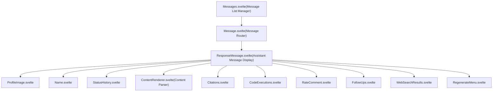
Sources: [src/lib/components/chat/Messages/ResponseMessage.svelte1-65](https://github.com/open-webui/open-webui/blob/a7271532/src/lib/components/chat/Messages/ResponseMessage.svelte#L1-L65) [src/lib/components/chat/Messages.svelte1-50](https://github.com/open-webui/open-webui/blob/a7271532/src/lib/components/chat/Messages.svelte#L1-L50)

---

## Props and Data Interface

### Message Data Structure

The component receives a `MessageType` interface that defines the message structure:

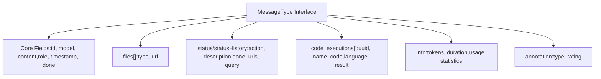
**Key Props:**

| Prop | Type | Purpose |
| --- | --- | --- |
| `chatId` | string | Current chat identifier |
| `history` | object | Complete message tree structure |
| `messageId` | string | ID of this specific message |
| `siblings` | array | IDs of sibling messages at same tree level |
| `selectedModels` | array | Currently selected model IDs |
| `isLastMessage` | boolean | Whether this is the most recent message |
| `readOnly` | boolean | Disables editing capabilities |
| `editCodeBlock` | boolean | Enables code block editing |

Sources: [src/lib/components/chat/Messages/ResponseMessage.svelte66-152](https://github.com/open-webui/open-webui/blob/a7271532/src/lib/components/chat/Messages/ResponseMessage.svelte#L66-L152)

---

## Action Handler System

### Action Handler Flow

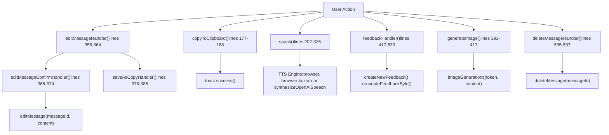
### Copy to Clipboard Handler

The copy function removes `<details>` tags and optionally adds a watermark before copying:

-   **Function:** `copyToClipboard` [src/lib/components/chat/Messages/ResponseMessage.svelte177-188](https://github.com/open-webui/open-webui/blob/a7271532/src/lib/components/chat/Messages/ResponseMessage.svelte#L177-L188)
-   **Process:**
    1.  Removes all `<details>` blocks via `removeAllDetails()`
    2.  Appends `$config?.ui?.response_watermark` if configured
    3.  Calls `_copyToClipboard()` with formatted content
    4.  Supports formatted copying via `$settings?.copyFormatted`

### Text-to-Speech Handler

The TTS system supports multiple engines and streaming audio playback:

**TTS Features:**

-   **Content splitting:** Messages split by punctuation or newlines for progressive playback
-   **Browser Kokoro:** Local TTS using WebAssembly worker [src/lib/components/chat/Messages/ResponseMessage.svelte270-299](https://github.com/open-webui/open-webui/blob/a7271532/src/lib/components/chat/Messages/ResponseMessage.svelte#L270-L299)
-   **OpenAI TTS:** Server-side synthesis via API [src/lib/components/chat/Messages/ResponseMessage.svelte301-323](https://github.com/open-webui/open-webui/blob/a7271532/src/lib/components/chat/Messages/ResponseMessage.svelte#L301-L323)
-   **Audio queue:** Progressive streaming with playback rate control [src/lib/components/chat/Messages/ResponseMessage.svelte247-252](https://github.com/open-webui/open-webui/blob/a7271532/src/lib/components/chat/Messages/ResponseMessage.svelte#L247-L252)
-   **Conversation mode:** Automatically triggers voice input after TTS completes [src/lib/components/chat/Messages/ResponseMessage.svelte234-236](https://github.com/open-webui/open-webui/blob/a7271532/src/lib/components/chat/Messages/ResponseMessage.svelte#L234-L236)

Sources: [src/lib/components/chat/Messages/ResponseMessage.svelte202-326](https://github.com/open-webui/open-webui/blob/a7271532/src/lib/components/chat/Messages/ResponseMessage.svelte#L202-L326)

### Edit Message System

The edit system preserves `<details>` blocks during editing:

**Edit Flow:**

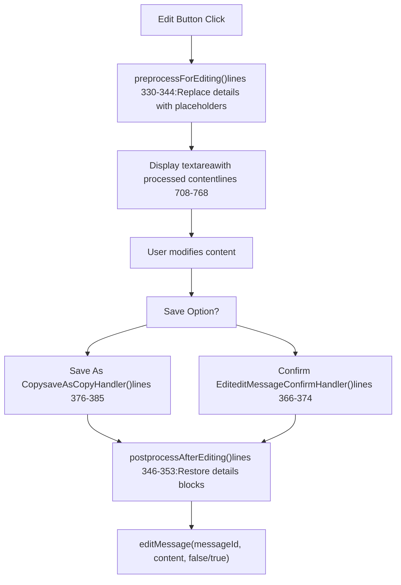
**Details Block Handling:**

-   `preprocessForEditing()` replaces `<details>...</details>` with placeholders like `<details id="__DETAIL_0__"/>`
-   Blocks stored in `preprocessedDetailsCache` array
-   `postprocessAfterEditing()` restores original blocks by ID
-   Enables editing without corrupting structured content

Sources: [src/lib/components/chat/Messages/ResponseMessage.svelte330-391](https://github.com/open-webui/open-webui/blob/a7271532/src/lib/components/chat/Messages/ResponseMessage.svelte#L330-L391)

### Feedback and Rating System

The feedback handler creates or updates evaluation records:

**Feedback Data Flow:**

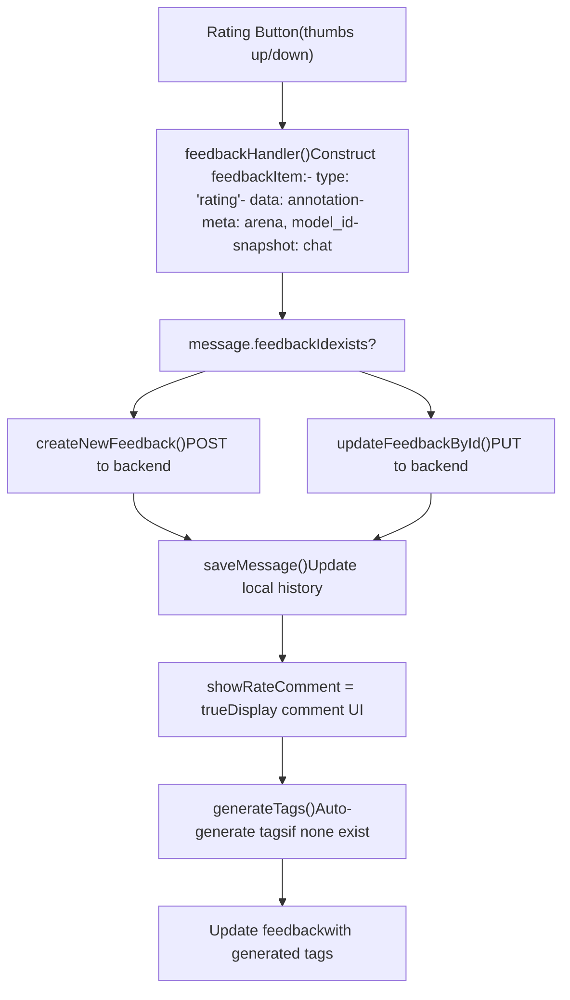
**Feedback Item Structure:**

```
{
  type: 'rating',
  data: {
    rating: number,
    model_id: string,
    sibling_model_ids?: string[],  // For arena comparisons
    tags?: string[]
  },
  meta: {
    arena: boolean,
    model_id: string,
    message_id: string,
    message_index: number,
    chat_id: string,
    base_models: { [modelId]: base_model_id }
  },
  snapshot: {
    chat: ChatObject
  }
}
```
Sources: [src/lib/components/chat/Messages/ResponseMessage.svelte417-533](https://github.com/open-webui/open-webui/blob/a7271532/src/lib/components/chat/Messages/ResponseMessage.svelte#L417-L533)

---

## Content Display System

### Rendering Flow

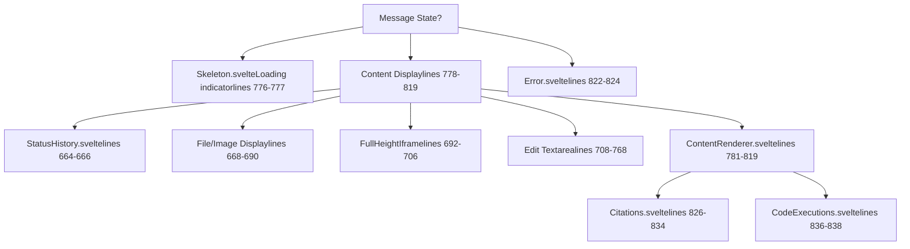
### ContentRenderer Integration

The component delegates content parsing to `ContentRenderer.svelte`:

**ContentRenderer Props:**

| Prop | Value | Purpose |
| --- | --- | --- |
| `id` | `${chatId}-${message.id}` | Unique identifier |
| `messageId` | message.id | Message reference |
| `history` | history | Full message tree |
| `selectedModels` | selectedModels | Model context |
| `content` | message.content | Raw message text |
| `sources` | message.sources | Citation sources |
| `floatingButtons` | Conditional | Show text selection actions |
| `save` | !readOnly | Enable save functionality |
| `preview` | !readOnly | Enable preview mode |
| `editCodeBlock` | editCodeBlock | Code block editing |
| `done` | message.done | Streaming complete flag |
| `model` | model | Model metadata |

**Event Handlers:**

-   `onSourceClick`: Opens citation modal via `citationsElement?.showSourceModal(id)` [src/lib/components/chat/Messages/ResponseMessage.svelte802-808](https://github.com/open-webui/open-webui/blob/a7271532/src/lib/components/chat/Messages/ResponseMessage.svelte#L802-L808)
-   `onAddMessages`: Adds messages to tree via `addMessages({ modelId, parentId, messages })` [src/lib/components/chat/Messages/ResponseMessage.svelte809-811](https://github.com/open-webui/open-webui/blob/a7271532/src/lib/components/chat/Messages/ResponseMessage.svelte#L809-L811)
-   `onSave`: Updates message content and persists via `updateChat()` [src/lib/components/chat/Messages/ResponseMessage.svelte812-818](https://github.com/open-webui/open-webui/blob/a7271532/src/lib/components/chat/Messages/ResponseMessage.svelte#L812-L818)

Sources: [src/lib/components/chat/Messages/ResponseMessage.svelte771-819](https://github.com/open-webui/open-webui/blob/a7271532/src/lib/components/chat/Messages/ResponseMessage.svelte#L771-L819)

---

## Action Button Layout

### Button Container System

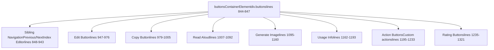
### Horizontal Scroll Handler

The button container supports horizontal scrolling for overflow:

-   **Element:** `buttonsContainerElement` [src/lib/components/chat/Messages/ResponseMessage.svelte157](https://github.com/open-webui/open-webui/blob/a7271532/src/lib/components/chat/Messages/ResponseMessage.svelte#L157-L157)
-   **Handler:** `buttonsWheelHandler` [src/lib/components/chat/Messages/ResponseMessage.svelte545-559](https://github.com/open-webui/open-webui/blob/a7271532/src/lib/components/chat/Messages/ResponseMessage.svelte#L545-L559)
-   **Logic:** Converts vertical wheel events to horizontal scroll when content overflows
-   **Lifecycle:** Added in `onMount()`, removed in `onDestroy()`

Sources: [src/lib/components/chat/Messages/ResponseMessage.svelte545-610](https://github.com/open-webui/open-webui/blob/a7271532/src/lib/components/chat/Messages/ResponseMessage.svelte#L545-L610)

---

## Sibling Message Navigation

### Navigation System

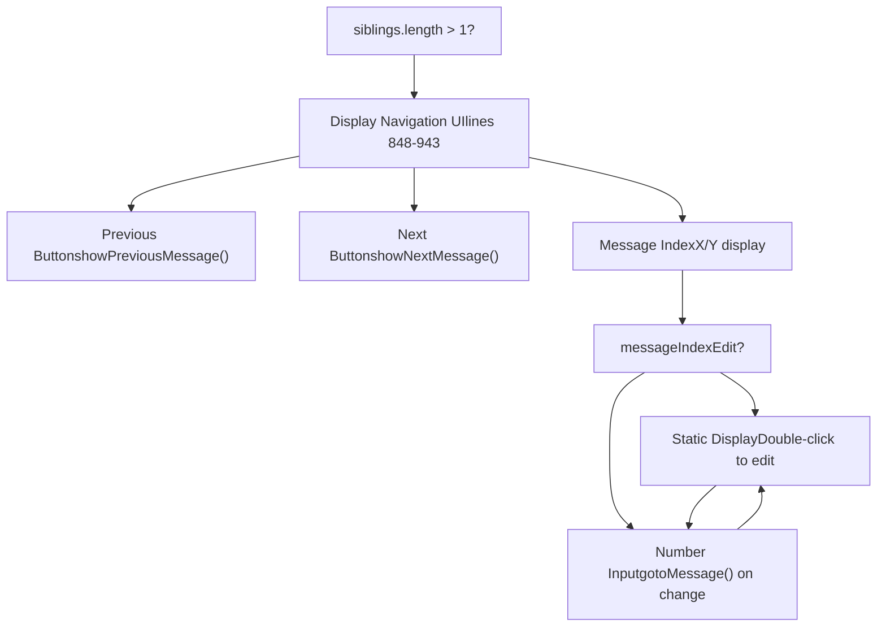
**Navigation Functions:**

-   `showPreviousMessage(message)`: Navigates to previous sibling \[passed as prop\]
-   `showNextMessage(message)`: Navigates to next sibling \[passed as prop\]
-   `gotoMessage(message, idx)`: Jumps to specific sibling index \[passed as prop\]

**Index Editor:**

-   Double-click index number to activate edit mode
-   Type number and press Enter or blur to navigate
-   Provides direct jump capability for messages with many siblings

Sources: [src/lib/components/chat/Messages/ResponseMessage.svelte848-943](https://github.com/open-webui/open-webui/blob/a7271532/src/lib/components/chat/Messages/ResponseMessage.svelte#L848-L943)

---

## Status Updates and Streaming

### Status Display Mechanism

The component shows real-time status updates during message generation:

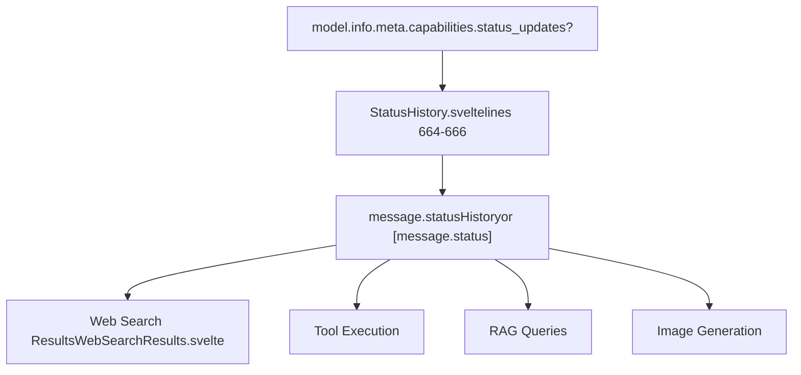
**Status History Structure:**

```
statusHistory?: {
  done: boolean;
  action: string;
  description: string;
  urls?: string[];
  query?: string;
}[]
```
**Display Logic:**

-   Shows `Skeleton.svelte` when `content === ''` and no status updates visible [src/lib/components/chat/Messages/ResponseMessage.svelte776-777](https://github.com/open-webui/open-webui/blob/a7271532/src/lib/components/chat/Messages/ResponseMessage.svelte#L776-L777)
-   Hidden status updates (`.hidden === true`) don't prevent skeleton display
-   Capability can be disabled per-model via `model.info.meta.capabilities.status_updates`

Sources: [src/lib/components/chat/Messages/ResponseMessage.svelte664-690](https://github.com/open-webui/open-webui/blob/a7271532/src/lib/components/chat/Messages/ResponseMessage.svelte#L664-L690) [src/lib/components/chat/Messages/ResponseMessage/StatusHistory.svelte](https://github.com/open-webui/open-webui/blob/a7271532/src/lib/components/chat/Messages/ResponseMessage/StatusHistory.svelte)

---

## Additional Features Integration

### Follow-Ups System

Follow-up suggestions display after message completion:

-   **Component:** `FollowUps.svelte` [src/lib/components/chat/Messages/ResponseMessage.svelte1323-1340](https://github.com/open-webui/open-webui/blob/a7271532/src/lib/components/chat/Messages/ResponseMessage.svelte#L1323-L1340)
-   **Condition:** `message.done && message.followUps?.length > 0`
-   **Props:**
    -   `chatId`: Current chat ID
    -   `followUps`: Array of follow-up prompts
    -   `submitMessage`: Callback to send follow-up as new message

### Regenerate Menu

Provides regeneration options when message is complete:

-   **Component:** `RegenerateMenu.svelte` [src/lib/components/chat/Messages/ResponseMessage.svelte1343-1360](https://github.com/open-webui/open-webui/blob/a7271532/src/lib/components/chat/Messages/ResponseMessage.svelte#L1343-L1360)
-   **Display Conditions:**
    -   `isLastMessage === true`
    -   `!readOnly`
    -   User has regenerate permissions
    -   `$settings?.regenerateMenu !== false`
-   **Actions:**
    -   `regenerateResponse(message, mergeMode)`
    -   `continueResponse(message)`

### Content Copy Handler

Custom copy behavior for styled content:

-   **Handler:** `contentCopyHandler` [src/lib/components/chat/Messages/ResponseMessage.svelte561-587](https://github.com/open-webui/open-webui/blob/a7271532/src/lib/components/chat/Messages/ResponseMessage.svelte#L561-L587)
-   **Function:** Intercepts copy events to clean HTML styling
-   **Process:**
    1.  Captures selected content from DOM
    2.  Removes background/color/font styles
    3.  Formats tables with consistent styling
    4.  Sets clipboard data with both HTML and plain text

Sources: [src/lib/components/chat/Messages/ResponseMessage.svelte1323-1360](https://github.com/open-webui/open-webui/blob/a7271532/src/lib/components/chat/Messages/ResponseMessage.svelte#L1323-L1360) [src/lib/components/chat/Messages/ResponseMessage.svelte561-610](https://github.com/open-webui/open-webui/blob/a7271532/src/lib/components/chat/Messages/ResponseMessage.svelte#L561-L610)

---

## State Management

### Local State Variables

| Variable | Type | Purpose |
| --- | --- | --- |
| `message` | MessageType | Local copy of message data, reactively synced |
| `model` | object | Model metadata from `$models` store |
| `edit` | boolean | Edit mode toggle |
| `editedContent` | string | Content during editing |
| `speaking` | boolean | TTS playback active |
| `loadingSpeech` | boolean | TTS generation in progress |
| `generatingImage` | boolean | Image generation in progress |
| `showRateComment` | boolean | Rating comment UI visible |
| `feedbackLoading` | boolean | Feedback submission in progress |
| `messageIndexEdit` | boolean | Message index input active |

### Reactive Sync Pattern

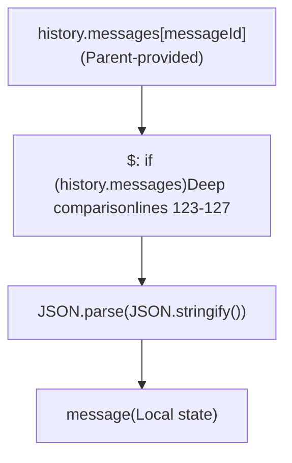
**Sync Logic:**

-   Compares stringified JSON to detect changes [src/lib/components/chat/Messages/ResponseMessage.svelte123-127](https://github.com/open-webui/open-webui/blob/a7271532/src/lib/components/chat/Messages/ResponseMessage.svelte#L123-L127)
-   Creates deep copy to prevent reference mutations
-   Ensures UI reflects latest message state from parent

Sources: [src/lib/components/chat/Messages/ResponseMessage.svelte122-152](https://github.com/open-webui/open-webui/blob/a7271532/src/lib/components/chat/Messages/ResponseMessage.svelte#L122-L152)

---

## Integration Points

### Parent Communication

**Props from Messages.svelte:**

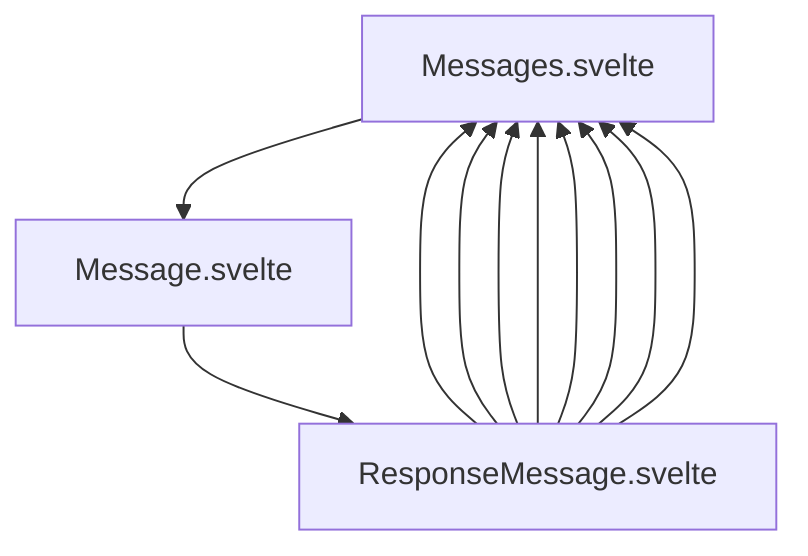
**Callback Functions:**

-   `editMessage(messageId, content, submit)`: Modifies message content \[prop\]
-   `deleteMessage(messageId)`: Removes message from tree \[prop\]
-   `rateMessage(messageId, rating)`: Updates rating \[prop\]
-   `saveMessage(messageId, message)`: Persists message changes \[prop\]
-   `updateChat()`: Syncs changes to backend \[prop\]
-   `submitMessage()`: Sends new message \[prop\]
-   `regenerateResponse(message, mergeMode)`: Regenerates response \[prop\]
-   `continueResponse(message)`: Continues partial response \[prop\]
-   `addMessages(params)`: Adds messages to tree \[prop\]

Sources: [src/lib/components/chat/Messages/ResponseMessage.svelte131-148](https://github.com/open-webui/open-webui/blob/a7271532/src/lib/components/chat/Messages/ResponseMessage.svelte#L131-L148) [src/lib/components/chat/Messages.svelte255-389](https://github.com/open-webui/open-webui/blob/a7271532/src/lib/components/chat/Messages.svelte#L255-L389)

---

## Summary

`ResponseMessage.svelte` is a feature-rich component that orchestrates assistant message display with extensive action handling capabilities. It integrates with multiple subsystems (TTS, citations, code execution, feedback) while maintaining clean separation of concerns through component composition. The reactive state management ensures UI consistency, and the edit system preserves complex content structures during modification.

Key architectural patterns:

-   **Deep copy sync** for safe local state management
-   **Conditional rendering** based on message state and capabilities
-   **Event delegation** to parent for tree modifications
-   **Progressive enhancement** through feature flags and permissions
-   **Preprocessing/postprocessing** for content preservation during edits

Sources: [src/lib/components/chat/Messages/ResponseMessage.svelte1-1791](https://github.com/open-webui/open-webui/blob/a7271532/src/lib/components/chat/Messages/ResponseMessage.svelte#L1-L1791)
