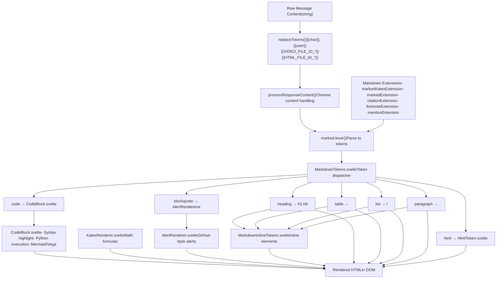
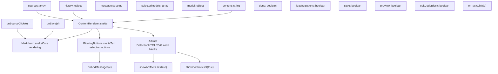
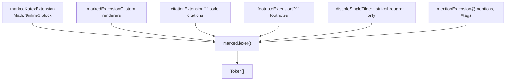
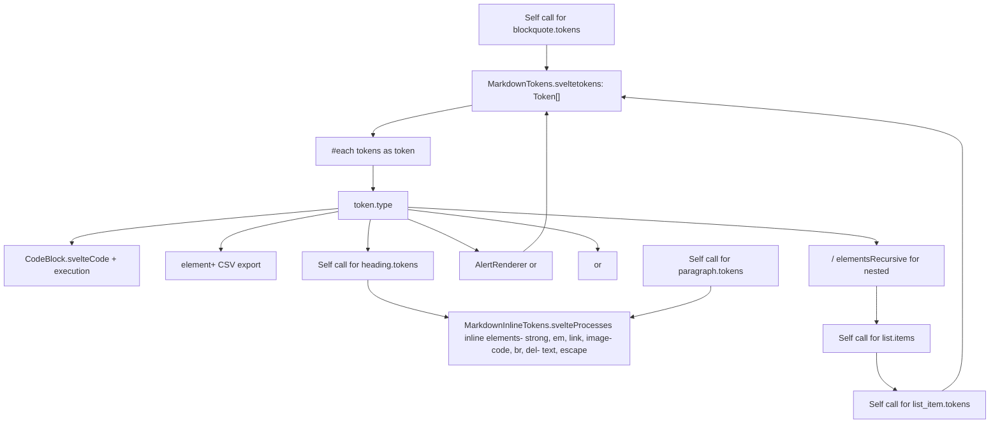
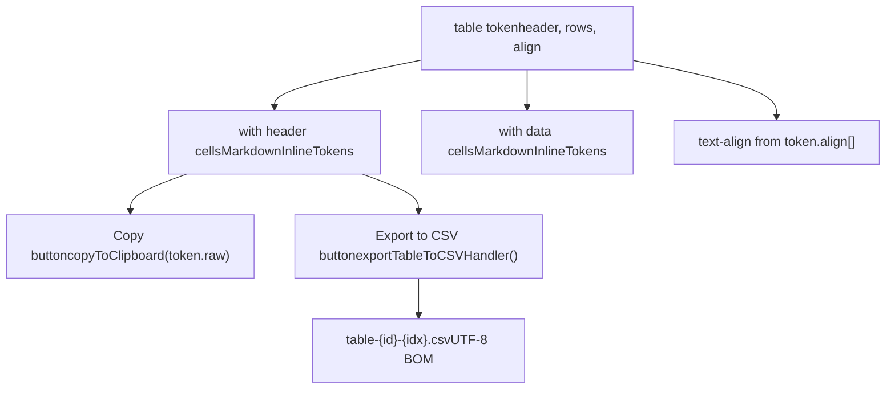
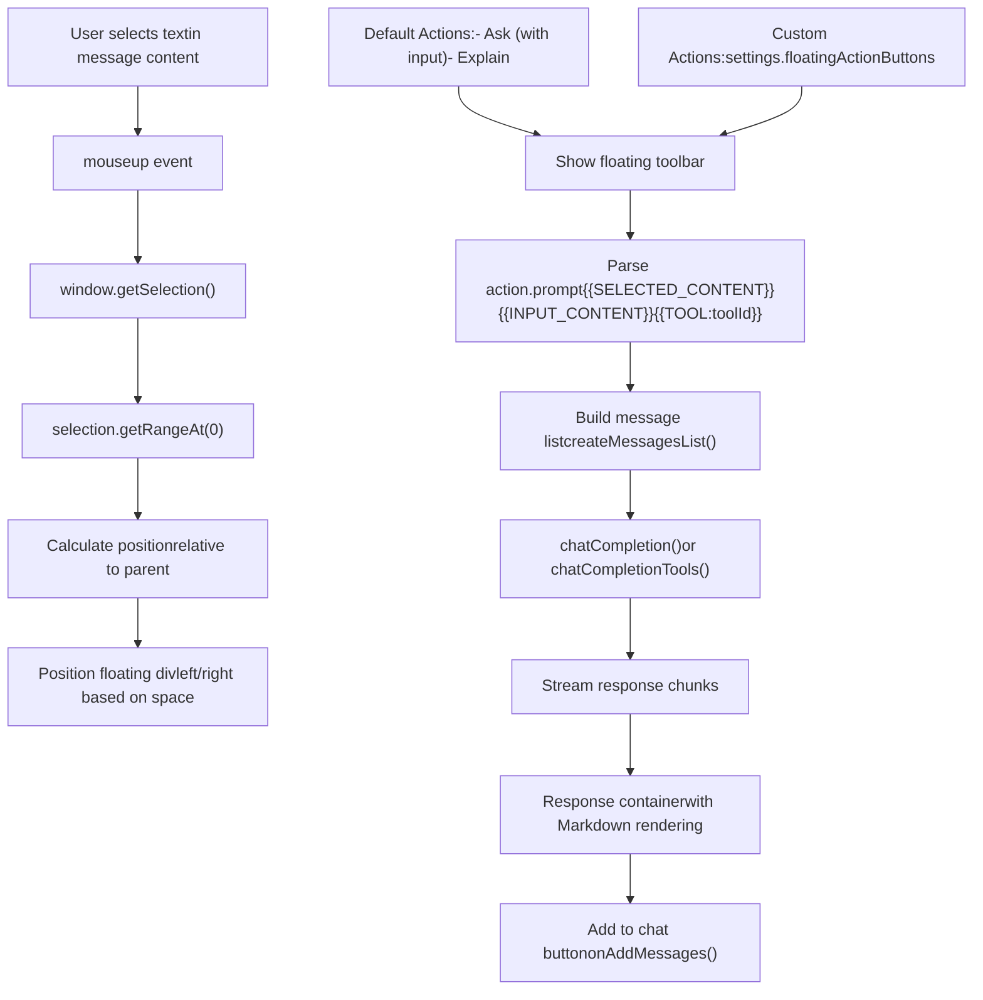
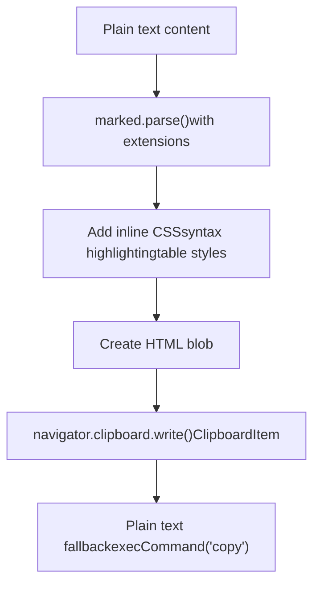

# Content Rendering Pipeline

Relevant source files

-   [src/lib/components/chat/ContentRenderer/FloatingButtons.svelte](https://github.com/open-webui/open-webui/blob/a7271532/src/lib/components/chat/ContentRenderer/FloatingButtons.svelte)
-   [src/lib/components/chat/Messages.svelte](https://github.com/open-webui/open-webui/blob/a7271532/src/lib/components/chat/Messages.svelte)
-   [src/lib/components/chat/Messages/CodeBlock.svelte](https://github.com/open-webui/open-webui/blob/a7271532/src/lib/components/chat/Messages/CodeBlock.svelte)
-   [src/lib/components/chat/Messages/ContentRenderer.svelte](https://github.com/open-webui/open-webui/blob/a7271532/src/lib/components/chat/Messages/ContentRenderer.svelte)
-   [src/lib/components/chat/Messages/Markdown.svelte](https://github.com/open-webui/open-webui/blob/a7271532/src/lib/components/chat/Messages/Markdown.svelte)
-   [src/lib/components/chat/Messages/Markdown/AlertRenderer.svelte](https://github.com/open-webui/open-webui/blob/a7271532/src/lib/components/chat/Messages/Markdown/AlertRenderer.svelte)
-   [src/lib/components/chat/Messages/Markdown/MarkdownTokens.svelte](https://github.com/open-webui/open-webui/blob/a7271532/src/lib/components/chat/Messages/Markdown/MarkdownTokens.svelte)
-   [src/lib/components/chat/Messages/Message.svelte](https://github.com/open-webui/open-webui/blob/a7271532/src/lib/components/chat/Messages/Message.svelte)
-   [src/lib/components/chat/Messages/MultiResponseMessages.svelte](https://github.com/open-webui/open-webui/blob/a7271532/src/lib/components/chat/Messages/MultiResponseMessages.svelte)
-   [src/lib/components/chat/Messages/ResponseMessage.svelte](https://github.com/open-webui/open-webui/blob/a7271532/src/lib/components/chat/Messages/ResponseMessage.svelte)
-   [src/lib/components/chat/Messages/UserMessage.svelte](https://github.com/open-webui/open-webui/blob/a7271532/src/lib/components/chat/Messages/UserMessage.svelte)
-   [src/lib/components/chat/Settings/Interface.svelte](https://github.com/open-webui/open-webui/blob/a7271532/src/lib/components/chat/Settings/Interface.svelte)
-   [src/lib/components/chat/SettingsModal.svelte](https://github.com/open-webui/open-webui/blob/a7271532/src/lib/components/chat/SettingsModal.svelte)
-   [src/lib/components/common/Modal.svelte](https://github.com/open-webui/open-webui/blob/a7271532/src/lib/components/common/Modal.svelte)
-   [src/lib/utils/index.ts](https://github.com/open-webui/open-webui/blob/a7271532/src/lib/utils/index.ts)
-   [src/lib/utils/marked/strikethrough-extension.ts](https://github.com/open-webui/open-webui/blob/a7271532/src/lib/utils/marked/strikethrough-extension.ts)
-   [src/lib/workers/pyodide.worker.ts](https://github.com/open-webui/open-webui/blob/a7271532/src/lib/workers/pyodide.worker.ts)
-   [src/routes/(app)/+layout.svelte](https://github.com/open-webui/open-webui/blob/a7271532/src/routes/(app)/+layout.svelte)/+layout.svelte)
-   [src/routes/(app)/+page.svelte](https://github.com/open-webui/open-webui/blob/a7271532/src/routes/(app)/+page.svelte)/+page.svelte)
-   [src/routes/(app)/c/\[id\]/+page.svelte](src/routes/(app)/c/%5Bid%5D/+page.svelte)

## Purpose and Scope

The Content Rendering Pipeline transforms raw message content (typically Markdown text) from LLM responses into rich, interactive HTML with support for mathematical formulas, code execution, diagrams, citations, and contextual actions. This pipeline handles the complete transformation from plain text to fully-rendered UI components.

For information about the ResponseMessage component that orchestrates message display and user interactions, see [5.1](/open-webui/open-webui/5.1-response-message-component). For details on Markdown syntax and extensions, see [5.3](/open-webui/open-webui/5.3-markdown-processing). For code execution capabilities, see [5.4](/open-webui/open-webui/5.4-code-block-execution). For text selection actions, see [5.6](/open-webui/open-webui/5.6-content-selection-actions).

---

## Pipeline Architecture Overview

The rendering pipeline consists of three major stages: preprocessing, token generation, and recursive rendering with specialized handlers for different content types.

**Pipeline Flow Diagram**


**Sources:**

-   [src/lib/components/chat/Messages/ContentRenderer.svelte1-217](https://github.com/open-webui/open-webui/blob/a7271532/src/lib/components/chat/Messages/ContentRenderer.svelte#L1-L217)
-   [src/lib/components/chat/Messages/Markdown.svelte1-79](https://github.com/open-webui/open-webui/blob/a7271532/src/lib/components/chat/Messages/Markdown.svelte#L1-L79)
-   [src/lib/components/chat/Messages/Markdown/MarkdownTokens.svelte1-448](https://github.com/open-webui/open-webui/blob/a7271532/src/lib/components/chat/Messages/Markdown/MarkdownTokens.svelte#L1-L448)
-   [src/lib/utils/index.ts36-75](https://github.com/open-webui/open-webui/blob/a7271532/src/lib/utils/index.ts#L36-L75)
-   [src/lib/utils/index.ts88-135](https://github.com/open-webui/open-webui/blob/a7271532/src/lib/utils/index.ts#L88-L135)

---

## ContentRenderer Component

`ContentRenderer.svelte` serves as the entry point to the rendering pipeline. It wraps the Markdown component and manages interactive features like floating action buttons and artifact detection.

**Component Responsibilities**


**Source ID Processing**

ContentRenderer transforms `sources` array into `sourceIds` for citation linking. Each source's documents are processed to extract identifiable names or URLs.

Sources:

-   [src/lib/components/chat/Messages/ContentRenderer.svelte1-217](https://github.com/open-webui/open-webui/blob/a7271532/src/lib/components/chat/Messages/ContentRenderer.svelte#L1-L217)
-   [src/lib/components/chat/Messages/ContentRenderer.svelte136-202](https://github.com/open-webui/open-webui/blob/a7271532/src/lib/components/chat/Messages/ContentRenderer.svelte#L136-L202)

---

## Token Replacement and Preprocessing

Before markdown parsing, raw content undergoes token replacement and preprocessing to handle special placeholders and language-specific formatting issues.

**replaceTokens Function**

The `replaceTokens` function in `utils/index.ts` processes placeholder tokens while preserving code blocks:

| Token Pattern | Replacement | Purpose |
| --- | --- | --- |
| `{{char}}` | Model name | Model personification |
| `{{user}}` | User name | User identification |
| `{{VIDEO_FILE_ID_*}}` | `<video>` tag | Embedded video |
| `{{HTML_FILE_ID_*}}` | `<file type="html">` | HTML file reference |

The function splits content by code blocks (` ``` ` and `` ` ``) to avoid replacing tokens inside code.

**processResponseContent Function**

Handles Chinese content formatting issues where markdown bold/italic syntax (`**text**`, `*text*`) fails to parse correctly when surrounded by Chinese parentheses or quotations. It adds spaces around the markers to ensure proper parsing.

Sources:

-   [src/lib/utils/index.ts36-75](https://github.com/open-webui/open-webui/blob/a7271532/src/lib/utils/index.ts#L36-L75)
-   [src/lib/utils/index.ts88-161](https://github.com/open-webui/open-webui/blob/a7271532/src/lib/utils/index.ts#L88-L161)

---

## Markdown Processing with Extensions

`Markdown.svelte` uses the `marked` library with multiple custom extensions to parse content into tokens. The extensions add support for mathematical formulas, citations, footnotes, mentions, and specialized formatting.

**Extension Architecture**


**Extension Capabilities**

-   **markedKatexExtension**: Renders LaTeX math using KaTeX library for both inline (`$x^2$`) and block (`$$\int$$`) equations
-   **markedExtension**: Custom rendering logic for special elements
-   **citationExtension**: Processes citation links `[1]`, `[2]` etc. with custom styling
-   **footnoteExtension**: Converts `[^1]` syntax into clickable footnote references
-   **disableSingleTilde**: Prevents single tilde (`~text~`) from being interpreted as strikethrough, only allows double tilde (`~~text~~`)
-   **mentionExtension**: Handles `@user` mentions and `#tag` references

Sources:

-   [src/lib/components/chat/Messages/Markdown.svelte1-79](https://github.com/open-webui/open-webui/blob/a7271532/src/lib/components/chat/Messages/Markdown.svelte#L1-L79)
-   [src/lib/components/chat/Messages/Markdown.svelte38-50](https://github.com/open-webui/open-webui/blob/a7271532/src/lib/components/chat/Messages/Markdown.svelte#L38-L50)
-   [src/lib/utils/marked/strikethrough-extension.ts1-30](https://github.com/open-webui/open-webui/blob/a7271532/src/lib/utils/marked/strikethrough-extension.ts#L1-L30)

---

## Token-Based Recursive Rendering

`MarkdownTokens.svelte` implements recursive token rendering by dispatching each token type to its appropriate handler. This component is the core dispatcher of the rendering pipeline.

**Token Type Dispatch Table**

| Token Type | Handler | Component/Element | Description |
| --- | --- | --- | --- |
| `hr` | Direct | `<hr>` | Horizontal rule |
| `heading` | Component | `<h1>`\-`<h6>` | Headers with depth 1-6 |
| `code` | Component | `CodeBlock.svelte` | Code blocks with execution |
| `table` | Template | `<table>` | Tables with export to CSV |
| `blockquote` | Conditional | `AlertRenderer.svelte` or `<blockquote>` | Quotes or GitHub alerts |
| `list` | Recursive | `<ul>`/`<ol>` | Ordered/unordered lists |
| `list_item` | Recursive | `<li>` | List items with task support |
| `paragraph` | Component | `<p>` or `<div>` | Text paragraphs |
| `html` | Component | `HtmlToken.svelte` | Raw HTML with sanitization |
| `space` | Ignored | \- | Whitespace tokens |

**Recursive Rendering Flow**


**Task List Support**

List items with checkbox syntax are rendered with interactive checkboxes:

-   `[ ]` unchecked task → `<input type="checkbox" disabled />`
-   `[x]` checked task → `<input type="checkbox" checked disabled />`

The `onTaskClick` callback allows handling of task click events for potential future interactivity.

Sources:

-   [src/lib/components/chat/Messages/Markdown/MarkdownTokens.svelte1-448](https://github.com/open-webui/open-webui/blob/a7271532/src/lib/components/chat/Messages/Markdown/MarkdownTokens.svelte#L1-L448)
-   [src/lib/components/chat/Messages/Markdown/MarkdownTokens.svelte91-448](https://github.com/open-webui/open-webui/blob/a7271532/src/lib/components/chat/Messages/Markdown/MarkdownTokens.svelte#L91-L448)

---

## CodeBlock Component

`CodeBlock.svelte` is a sophisticated component that handles code syntax highlighting, execution, and visualization rendering. It supports multiple execution engines and diagram formats.

**CodeBlock Feature Matrix**

**Python Execution Flow**

The `executePython` function routes to either Jupyter backend or Pyodide worker based on configuration:

1.  **Jupyter Backend** (`$config?.code?.engine === 'jupyter'`):

    -   Calls `executeCode(localStorage.token, code)` API
    -   Server-side execution with full Python environment
    -   Returns structured output: `{ stdout, stderr, result }`
2.  **Pyodide Worker** (default):

    -   Creates `PyodideWorker` instance from web worker
    -   Auto-detects required packages from imports (numpy, pandas, matplotlib, etc.)
    -   Client-side execution with 60-second timeout
    -   Intercepts matplotlib plots and converts to base64 images

**Diagram Rendering**

-   **Mermaid**: Uses `initMermaid()` and `renderMermaidDiagram()` utilities, rendered in `SvgPanZoom` component with pan/zoom controls
-   **Vega/Vega-lite**: Uses `renderVegaVisualization()` for declarative data visualizations

Sources:

-   [src/lib/components/chat/Messages/CodeBlock.svelte1-616](https://github.com/open-webui/open-webui/blob/a7271532/src/lib/components/chat/Messages/CodeBlock.svelte#L1-L616)
-   [src/lib/components/chat/Messages/CodeBlock.svelte139-329](https://github.com/open-webui/open-webui/blob/a7271532/src/lib/components/chat/Messages/CodeBlock.svelte#L139-L329)
-   [src/lib/components/chat/Messages/CodeBlock.svelte332-363](https://github.com/open-webui/open-webui/blob/a7271532/src/lib/components/chat/Messages/CodeBlock.svelte#L332-L363)
-   [src/lib/workers/pyodide.worker.ts1-141](https://github.com/open-webui/open-webui/blob/a7271532/src/lib/workers/pyodide.worker.ts#L1-L141)

---

## Specialized Token Renderers

### AlertRenderer

`AlertRenderer.svelte` implements GitHub-style alert syntax for blockquotes:

**Alert Syntax Detection**

```
> [!NOTE]
> This is a note

> [!TIP]
> This is a tip
```
The `alertComponent()` function uses regex to detect alert type prefix and extracts content for custom rendering.

**Alert Type Styling**

| Alert Type | Border Color | Icon Component |
| --- | --- | --- |
| `NOTE` | `border-sky-500` | `Info` |
| `TIP` | `border-emerald-500` | `LightBulb` |
| `IMPORTANT` | `border-purple-500` | `Star` |
| `WARNING` | `border-yellow-500` | `ArrowRightCircle` |
| `CAUTION` | `border-rose-500` | `Bolt` |

Sources:

-   [src/lib/components/chat/Messages/Markdown/AlertRenderer.svelte1-148](https://github.com/open-webui/open-webui/blob/a7271532/src/lib/components/chat/Messages/Markdown/AlertRenderer.svelte#L1-L148)
-   [src/lib/components/chat/Messages/Markdown/AlertRenderer.svelte46-62](https://github.com/open-webui/open-webui/blob/a7271532/src/lib/components/chat/Messages/Markdown/AlertRenderer.svelte#L46-L62)

### KatexRenderer

Renders mathematical formulas using KaTeX library. Supports both inline and block math with error handling.

### HtmlToken

Renders raw HTML tokens with DOMPurify sanitization for XSS prevention. Handles special file embedding tokens:

-   `<file type="html" id="{fileId}" />` - Renders HTML files in iframe
-   Configurable iframe sandbox attributes via settings

Sources:

-   [src/lib/components/chat/Messages/Markdown/MarkdownTokens.svelte286-307](https://github.com/open-webui/open-webui/blob/a7271532/src/lib/components/chat/Messages/Markdown/MarkdownTokens.svelte#L286-L307)

---

## Table Rendering and Export

Tables are rendered with enhanced functionality including CSV export capability.

**Table Features**


The `exportTableToCSVHandler` function:

1.  Extracts header text and escapes quotes for CSV format
2.  Maps row cells to text and escapes quotes
3.  Joins with commas and newlines
4.  Adds UTF-8 BOM for Unicode support
5.  Uses FileSaver.js to download file

Sources:

-   [src/lib/components/chat/Messages/Markdown/MarkdownTokens.svelte130-215](https://github.com/open-webui/open-webui/blob/a7271532/src/lib/components/chat/Messages/Markdown/MarkdownTokens.svelte#L130-L215)
-   [src/lib/components/chat/Messages/Markdown/MarkdownTokens.svelte53-87](https://github.com/open-webui/open-webui/blob/a7271532/src/lib/components/chat/Messages/Markdown/MarkdownTokens.svelte#L53-L87)

---

## Interactive Features

### FloatingButtons Component

`FloatingButtons.svelte` provides contextual actions on selected text. It appears as a floating toolbar when users select content within a message.

**FloatingButtons Architecture**


**Action Prompt Variables**

| Variable | Replacement | Description |
| --- | --- | --- |
| `{{SELECTED_CONTENT}}` | Selected text in quote blocks | User's selection |
| `{{INPUT_CONTENT}}` | User's input from text field | Additional prompt |
| `{{TOOL:toolId}}` | Empty string | Tool ID extraction (legacy) |
| `{{variable|tool:id="toolId"}}` | variable | Tool ID extraction (new format) |

The component maintains its own response state and can add responses to the main chat using the `onAddMessages` callback.

Sources:

-   [src/lib/components/chat/ContentRenderer/FloatingButtons.svelte1-404](https://github.com/open-webui/open-webui/blob/a7271532/src/lib/components/chat/ContentRenderer/FloatingButtons.svelte#L1-L404)
-   [src/lib/components/chat/ContentRenderer/FloatingButtons.svelte70-224](https://github.com/open-webui/open-webui/blob/a7271532/src/lib/components/chat/ContentRenderer/FloatingButtons.svelte#L70-L224)
-   [src/lib/components/chat/Messages/ContentRenderer.svelte46-133](https://github.com/open-webui/open-webui/blob/a7271532/src/lib/components/chat/Messages/ContentRenderer.svelte#L46-L133)

### Artifact Detection

ContentRenderer monitors code block rendering to detect potential artifacts (HTML/SVG code). When detected, it automatically opens the artifact panel:

```
if (
  ($settings?.detectArtifacts ?? true) &&
  (['html', 'svg'].includes(lang) || (lang === 'xml' && code.includes('svg'))) &&
  !$mobile &&
  $chatId
) {
  showArtifacts.set(true);
  showControls.set(true);
}
```
This triggers the artifact viewer in the right panel for preview and interaction.

Sources:

-   [src/lib/components/chat/Messages/ContentRenderer.svelte179-202](https://github.com/open-webui/open-webui/blob/a7271532/src/lib/components/chat/Messages/ContentRenderer.svelte#L179-L202)

---

## Content Sanitization

### sanitizeResponseContent

Cleans raw LLM response content by:

1.  Removing incomplete special tokens: `<|*$`, `<|*|$`, `<$`
2.  Escaping HTML entities: `<` → `&lt;`, `>` → `&gt;`
3.  Removing complete special tokens: `<|*|>`

### removeDetails / removeAllDetails

Removes `<details>` HTML tags from content:

-   `removeDetails(content, types)` - Removes details tags with specific type attributes
-   `removeAllDetails(content)` - Removes all details tags regardless of type

Used when copying content to clipboard or generating TTS to exclude expandable sections.

Sources:

-   [src/lib/utils/index.ts77-86](https://github.com/open-webui/open-webui/blob/a7271532/src/lib/utils/index.ts#L77-L86)
-   [src/lib/utils/index.ts844-858](https://github.com/open-webui/open-webui/blob/a7271532/src/lib/utils/index.ts#L844-L858)

---

## Content Copying with Formatting

The `copyToClipboard` function supports both plain text and formatted HTML copying:

**Formatted Copy Pipeline**


The formatted copy includes:

-   Syntax-highlighted code blocks
-   Styled tables with borders
-   Blockquote formatting
-   Link preservation

When pasting into rich text editors (Word, Google Docs, Notion), the formatting is preserved.

Sources:

-   [src/lib/utils/index.ts383-513](https://github.com/open-webui/open-webui/blob/a7271532/src/lib/utils/index.ts#L383-L513)
-   [src/lib/components/chat/Messages/ResponseMessage.svelte177-188](https://github.com/open-webui/open-webui/blob/a7271532/src/lib/components/chat/Messages/ResponseMessage.svelte#L177-L188)

---

## Integration with ResponseMessage

The rendering pipeline integrates with `ResponseMessage.svelte` which orchestrates the complete message display:

**ResponseMessage Integration Points**

```mermaid
flowchart TD
    ResponseMessage["ResponseMessage.svelte"]
    StatusHistory["StatusHistorystatusHistory array"]
    Files["File attachmentsImages, documents"]
    Embeds["Iframe embeds"]
    ContentRenderer["ContentRenderer.svelteMain content pipeline"]
    Citations["Citations.sveltesource links"]
    CodeExecutions["CodeExecutions.svelteexecution results"]
    Error["Error.svelteerror display"]
    EditButton["Edit message"]
    CopyButton["Copy content"]
    TTSButton["Read aloud"]
    RegenerateButton["Regenerate"]
    RateButton["Rate response"]

    ResponseMessage --> StatusHistory
    ResponseMessage --> Files
    ResponseMessage --> Embeds
    ResponseMessage --> ContentRenderer
    ResponseMessage --> Citations
    ResponseMessage --> CodeExecutions
    ResponseMessage --> Error
    ResponseMessage --> EditButton
    ResponseMessage --> CopyButton
    ResponseMessage --> TTSButton
    ResponseMessage --> RegenerateButton
    ResponseMessage --> RateButton
```


ResponseMessage handles:

-   Message metadata (model name, timestamp)
-   Edit mode with textarea
-   Action buttons (copy, TTS, image generation, rate)
-   Sibling navigation for multiple response variants
-   Integration with feedback system

Sources:

-   [src/lib/components/chat/Messages/ResponseMessage.svelte1-1891](https://github.com/open-webui/open-webui/blob/a7271532/src/lib/components/chat/Messages/ResponseMessage.svelte#L1-L1891)
-   [src/lib/components/chat/Messages/ResponseMessage.svelte661-840](https://github.com/open-webui/open-webui/blob/a7271532/src/lib/components/chat/Messages/ResponseMessage.svelte#L661-L840)

---

## Performance Considerations

### Lazy Rendering

-   Code blocks render on-demand with collapse functionality
-   Large stdout/stderr outputs (>100 lines) use scrollable containers with `max-h-96`
-   Tables use `scrollbar-hidden` class for horizontal scrolling without visible scrollbar

### Token Streaming

The pipeline supports streaming responses where `done=false`:

-   Incomplete tokens are handled gracefully
-   Code blocks wait for closing \`\`\` to render
-   Math formulas require complete delimiters
-   Settings control fade effect: `chatFadeStreamingText` setting toggles opacity during streaming

### Markdown Caching

The `marked.lexer()` call is reactive but results are not cached between renders. Each content change triggers complete re-parsing through the extension chain.

Sources:

-   [src/lib/components/chat/Messages/CodeBlock.svelte564-611](https://github.com/open-webui/open-webui/blob/a7271532/src/lib/components/chat/Messages/CodeBlock.svelte#L564-L611)
-   [src/lib/components/chat/Settings/Interface.svelte69](https://github.com/open-webui/open-webui/blob/a7271532/src/lib/components/chat/Settings/Interface.svelte#L69-L69)
-   [src/lib/components/chat/Messages/ResponseMessage.svelte795-797](https://github.com/open-webui/open-webui/blob/a7271532/src/lib/components/chat/Messages/ResponseMessage.svelte#L795-L797)
