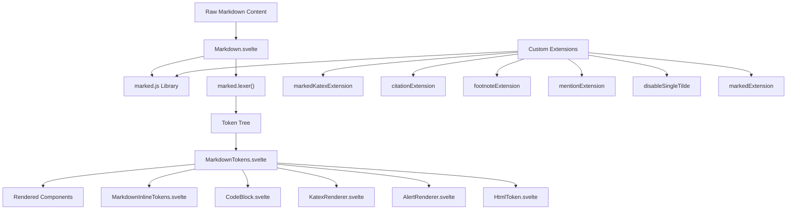
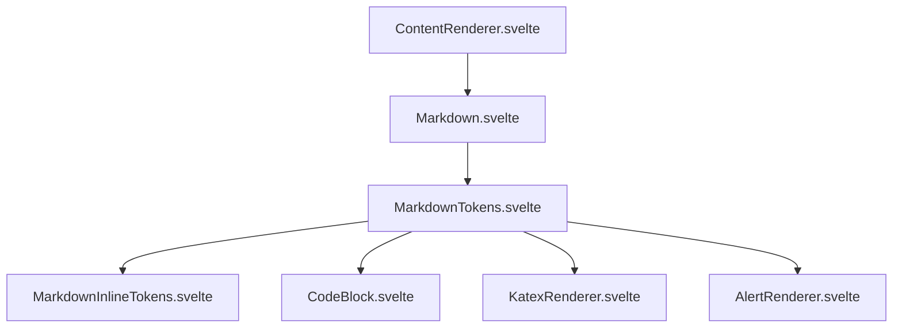
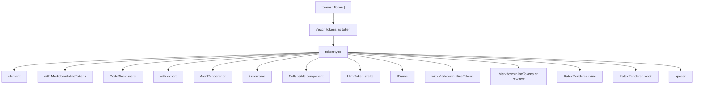
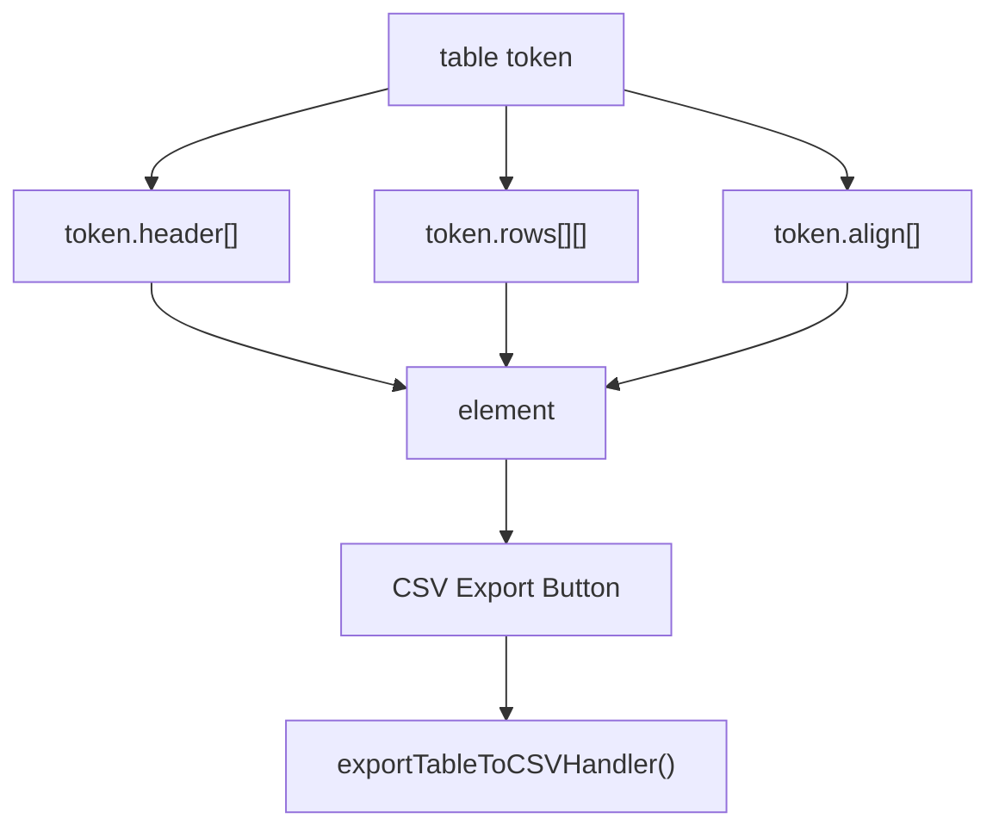
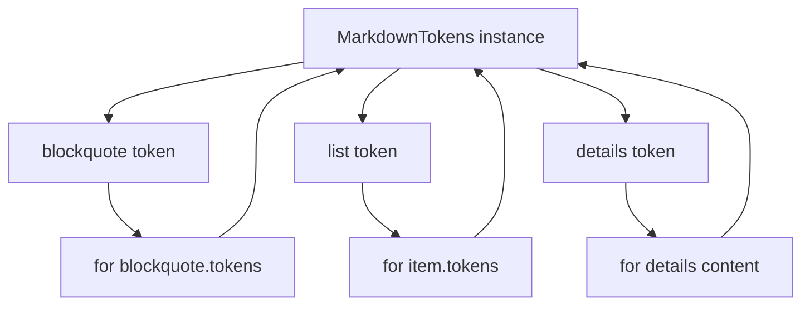
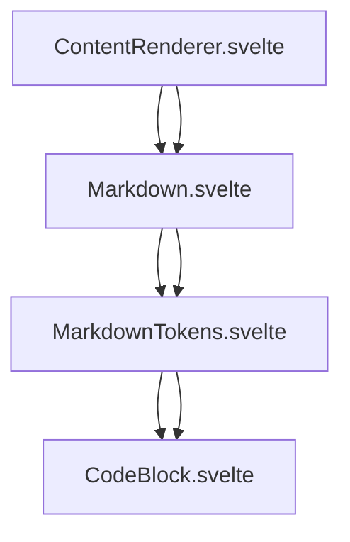

# Markdown Processing

Relevant source files

-   [src/lib/components/chat/ContentRenderer/FloatingButtons.svelte](https://github.com/open-webui/open-webui/blob/a7271532/src/lib/components/chat/ContentRenderer/FloatingButtons.svelte)
-   [src/lib/components/chat/Messages/CodeBlock.svelte](https://github.com/open-webui/open-webui/blob/a7271532/src/lib/components/chat/Messages/CodeBlock.svelte)
-   [src/lib/components/chat/Messages/ContentRenderer.svelte](https://github.com/open-webui/open-webui/blob/a7271532/src/lib/components/chat/Messages/ContentRenderer.svelte)
-   [src/lib/components/chat/Messages/Markdown.svelte](https://github.com/open-webui/open-webui/blob/a7271532/src/lib/components/chat/Messages/Markdown.svelte)
-   [src/lib/components/chat/Messages/Markdown/AlertRenderer.svelte](https://github.com/open-webui/open-webui/blob/a7271532/src/lib/components/chat/Messages/Markdown/AlertRenderer.svelte)
-   [src/lib/components/chat/Messages/Markdown/MarkdownTokens.svelte](https://github.com/open-webui/open-webui/blob/a7271532/src/lib/components/chat/Messages/Markdown/MarkdownTokens.svelte)
-   [src/lib/components/chat/Messages/Message.svelte](https://github.com/open-webui/open-webui/blob/a7271532/src/lib/components/chat/Messages/Message.svelte)
-   [src/lib/components/chat/Messages/MultiResponseMessages.svelte](https://github.com/open-webui/open-webui/blob/a7271532/src/lib/components/chat/Messages/MultiResponseMessages.svelte)
-   [src/lib/utils/marked/strikethrough-extension.ts](https://github.com/open-webui/open-webui/blob/a7271532/src/lib/utils/marked/strikethrough-extension.ts)
-   [src/lib/workers/pyodide.worker.ts](https://github.com/open-webui/open-webui/blob/a7271532/src/lib/workers/pyodide.worker.ts)

## Purpose and Scope

This page documents the markdown processing system that converts raw markdown text into rendered HTML components. The system uses the marked.js library enhanced with custom extensions to support mathematical equations (KaTeX), citations, footnotes, mentions, and GitHub-style alerts. The rendering pipeline tokenizes markdown content and recursively processes the token tree to generate Svelte components.

For information about code block execution capabilities, see [Code Block Execution](/open-webui/open-webui/5.4-code-block-execution). For the broader content rendering pipeline that invokes markdown processing, see [Content Rendering Pipeline](/open-webui/open-webui/5.2-content-rendering-pipeline).

## Markdown Processing Architecture

The markdown processing system consists of three main layers: parsing, extension enhancement, and recursive rendering.

### High-Level Processing Flow


**Sources:** [src/lib/components/chat/Messages/Markdown.svelte1-79](https://github.com/open-webui/open-webui/blob/a7271532/src/lib/components/chat/Messages/Markdown.svelte#L1-L79) [src/lib/components/chat/Messages/Markdown/MarkdownTokens.svelte1-416](https://github.com/open-webui/open-webui/blob/a7271532/src/lib/components/chat/Messages/Markdown/MarkdownTokens.svelte#L1-L416)

### Component Hierarchy


**Sources:** [src/lib/components/chat/Messages/ContentRenderer.svelte1-223](https://github.com/open-webui/open-webui/blob/a7271532/src/lib/components/chat/Messages/ContentRenderer.svelte#L1-L223) [src/lib/components/chat/Messages/Markdown.svelte1-79](https://github.com/open-webui/open-webui/blob/a7271532/src/lib/components/chat/Messages/Markdown.svelte#L1-L79)

## Markdown.svelte: Entry Point

The `Markdown.svelte` component serves as the entry point for markdown processing. It configures the marked.js library with custom extensions and generates the initial token tree.

### Configuration and Extension Loading

[src/lib/components/chat/Messages/Markdown.svelte38-50](https://github.com/open-webui/open-webui/blob/a7271532/src/lib/components/chat/Messages/Markdown.svelte#L38-L50) configures marked.js with six custom extensions:

| Extension | Purpose | Configuration |
| --- | --- | --- |
| `markedKatexExtension` | Renders mathematical equations using KaTeX | `throwOnError: false, breaks: true` |
| `markedExtension` | Base custom extension for Open WebUI | Same options |
| `citationExtension` | Handles citation references `[^1]` | Same options |
| `footnoteExtension` | Processes footnote definitions | Same options |
| `disableSingleTilde` | Prevents single `~` from triggering strikethrough | Applied via `marked.use()` |
| `mentionExtension` | Supports `@` and `#` mention syntax | Two instances with different trigger characters |

### Tokenization Process

The tokenization occurs reactively when content changes [src/lib/components/chat/Messages/Markdown.svelte52-58](https://github.com/open-webui/open-webui/blob/a7271532/src/lib/components/chat/Messages/Markdown.svelte#L52-L58):

```
content (raw markdown string)
    ↓
processResponseContent() - Cleans/formats content
    ↓
replaceTokens() - Substitutes {{MODEL_NAME}}, {{USER_NAME}}
    ↓
marked.lexer() - Converts to token tree
    ↓
tokens[] - Array of Token objects
```
The `marked.lexer()` function parses the markdown and returns an array of token objects. Each token has a `type` field and type-specific properties like `text`, `tokens` (for nested content), `raw` (original markdown), etc.

**Sources:** [src/lib/components/chat/Messages/Markdown.svelte52-58](https://github.com/open-webui/open-webui/blob/a7271532/src/lib/components/chat/Messages/Markdown.svelte#L52-L58)

## Custom Marked Extensions

### KaTeX Extension

Renders inline and block mathematical equations using KaTeX syntax. Supports both delimiters:

-   Inline: `$...$` or `\(...\)`
-   Block: `$$...$$` or `\[...\]`

### Citation Extension

Processes citation references in the format `[^identifier]` and links them to source documents. The extension generates `inlineKatex` tokens that are later rendered by `KatexRenderer.svelte`.

### Footnote Extension

Handles footnote definitions `[^note]: description` and references. Footnotes can appear anywhere in the document and are collected for display at the end.

### Mention Extension

Detects mentions with configurable trigger characters (`@` for users, `#` for channels/tags). The extension is instantiated twice with different triggers [src/lib/components/chat/Messages/Markdown.svelte48-50](https://github.com/open-webui/open-webui/blob/a7271532/src/lib/components/chat/Messages/Markdown.svelte#L48-L50):

```
{
  extensions: [
    mentionExtension({ triggerChar: '@' }),
    mentionExtension({ triggerChar: '#' })
  ]
}
```
### Strikethrough Extension

The `disableSingleTilde` extension [src/lib/utils/marked/strikethrough-extension.ts1-30](https://github.com/open-webui/open-webui/blob/a7271532/src/lib/utils/marked/strikethrough-extension.ts#L1-L30) modifies default strikethrough behavior to require double tildes `~~text~~` and prevents single tildes `~text~` from being interpreted as strikethrough. Single tildes are returned as plain text tokens.

**Sources:** [src/lib/components/chat/Messages/Markdown.svelte43-50](https://github.com/open-webui/open-webui/blob/a7271532/src/lib/components/chat/Messages/Markdown.svelte#L43-L50) [src/lib/utils/marked/strikethrough-extension.ts1-30](https://github.com/open-webui/open-webui/blob/a7271532/src/lib/utils/marked/strikethrough-extension.ts#L1-L30)

## MarkdownTokens.svelte: Recursive Token Renderer

`MarkdownTokens.svelte` implements the core recursive rendering engine that converts token trees into Svelte components. It handles 14 distinct token types.

### Token Type Dispatch System


**Sources:** [src/lib/components/chat/Messages/Markdown/MarkdownTokens.svelte91-415](https://github.com/open-webui/open-webui/blob/a7271532/src/lib/components/chat/Messages/Markdown/MarkdownTokens.svelte#L91-L415)

### Token Type Implementations

#### Heading Tokens

[src/lib/components/chat/Messages/Markdown/MarkdownTokens.svelte94-103](https://github.com/open-webui/open-webui/blob/a7271532/src/lib/components/chat/Messages/Markdown/MarkdownTokens.svelte#L94-L103) renders headings using the `headerComponent()` helper that returns `'h' + depth` (h1-h6). Heading content is delegated to `MarkdownInlineTokens` for inline element processing.

#### Code Tokens

[src/lib/components/chat/Messages/Markdown/MarkdownTokens.svelte104-129](https://github.com/open-webui/open-webui/blob/a7271532/src/lib/components/chat/Messages/Markdown/MarkdownTokens.svelte#L104-L129) conditionally renders code blocks:

-   If `token.raw` contains triple backticks: renders `CodeBlock.svelte` with full editing/execution capabilities
-   Otherwise: renders plain text (for inline code)

The `CodeBlock` component receives:

-   `id`: Unique identifier combining message ID and token index
-   `collapsed`: User preference from `$settings?.collapseCodeBlocks`
-   `token`: Full token object for rendering updates
-   `lang`: Language identifier from fenced code block
-   `code`: Code content
-   `attributes`: Metadata for pre-executed code
-   `save`, `preview`, `edit`: Capability flags
-   `onSave`, `onUpdate`, `onPreview`: Callback handlers

#### Table Tokens

[src/lib/components/chat/Messages/Markdown/MarkdownTokens.svelte130-215](https://github.com/open-webui/open-webui/blob/a7271532/src/lib/components/chat/Messages/Markdown/MarkdownTokens.svelte#L130-L215) renders tables with export functionality:


The export handler [src/lib/components/chat/Messages/Markdown/MarkdownTokens.svelte53-87](https://github.com/open-webui/open-webui/blob/a7271532/src/lib/components/chat/Messages/Markdown/MarkdownTokens.svelte#L53-L87) extracts table data and generates a UTF-8 CSV file with BOM prefix for proper encoding. Each cell's tokens are mapped to text, escaped, and wrapped in quotes.

#### Blockquote and Alert Tokens

[src/lib/components/chat/Messages/Markdown/MarkdownTokens.svelte216-232](https://github.com/open-webui/open-webui/blob/a7271532/src/lib/components/chat/Messages/Markdown/MarkdownTokens.svelte#L216-L232) checks if a blockquote is a GitHub-style alert:

```
> [!NOTE]
> Content
```
The `alertComponent()` function [src/lib/components/chat/Messages/Markdown/AlertRenderer.svelte46-62](https://github.com/open-webui/open-webui/blob/a7271532/src/lib/components/chat/Messages/Markdown/AlertRenderer.svelte#L46-L62) uses regex to detect alert types (NOTE, TIP, IMPORTANT, WARNING, CAUTION) and extracts the alert content. If matched, it renders `AlertRenderer.svelte`; otherwise, it renders a standard `<blockquote>`.

Alert styles are defined in [src/lib/components/chat/Messages/Markdown/AlertRenderer.svelte18-44](https://github.com/open-webui/open-webui/blob/a7271532/src/lib/components/chat/Messages/Markdown/AlertRenderer.svelte#L18-L44) with border colors, text colors, and icons for each type.

#### List Tokens

[src/lib/components/chat/Messages/Markdown/MarkdownTokens.svelte233-317](https://github.com/open-webui/open-webui/blob/a7271532/src/lib/components/chat/Messages/Markdown/MarkdownTokens.svelte#L233-L317) handles both ordered (`<ol>`) and unordered (`<ul>`) lists. Task lists (checkboxes) are detected via `item?.task` property. The component:

1.  Renders `<input type="checkbox">` for task items
2.  Invokes `onTaskClick()` callback when checked state changes
3.  Recursively renders child tokens via `<svelte:self>`

#### Details Tokens

[src/lib/components/chat/Messages/Markdown/MarkdownTokens.svelte318-338](https://github.com/open-webui/open-webui/blob/a7271532/src/lib/components/chat/Messages/Markdown/MarkdownTokens.svelte#L318-L338) renders collapsible sections using the `Collapsible` component. The token contains:

-   `token.summary`: Clickable summary text
-   `token.text`: Collapsible content
-   `token.attributes`: Custom attributes

The content is re-lexed with `marked.lexer(decode(token.text))` before recursive rendering.

#### HTML and IFrame Tokens

[src/lib/components/chat/Messages/Markdown/MarkdownTokens.svelte339-353](https://github.com/open-webui/open-webui/blob/a7271532/src/lib/components/chat/Messages/Markdown/MarkdownTokens.svelte#L339-L353):

-   **HTML tokens**: Delegated to `HtmlToken.svelte` for sanitization and safe rendering
-   **IFrame tokens**: Special token type for embedding files via `<iframe src="/api/v1/files/{fileId}/content">`

The iframe auto-adjusts height based on content [src/lib/components/chat/Messages/Markdown/MarkdownTokens.svelte347-352](https://github.com/open-webui/open-webui/blob/a7271532/src/lib/components/chat/Messages/Markdown/MarkdownTokens.svelte#L347-L352):

```
on:load={(e) => {
  e.currentTarget.style.height =
    e.currentTarget.contentWindow.document.body.scrollHeight + 20 + 'px';
}}
```
#### Paragraph and Text Tokens

[src/lib/components/chat/Messages/Markdown/MarkdownTokens.svelte354-401](https://github.com/open-webui/open-webui/blob/a7271532/src/lib/components/chat/Messages/Markdown/MarkdownTokens.svelte#L354-L401):

-   **Paragraph**: Can render as `<p>` or `<span>` based on `paragraphTag` prop
-   **Text**: Rendered differently based on `top` prop (whether at top level). Top-level text gets wrapped in `<p>`, nested text doesn't.

Both delegate to `MarkdownInlineTokens` if the token contains sub-tokens, otherwise uses `unescapeHtml()` utility.

#### Math Tokens

[src/lib/components/chat/Messages/Markdown/MarkdownTokens.svelte402-409](https://github.com/open-webui/open-webui/blob/a7271532/src/lib/components/chat/Messages/Markdown/MarkdownTokens.svelte#L402-L409) renders both inline and block KaTeX:

-   `inlineKatex`: Math in paragraph flow
-   `blockKatex`: Standalone equation display

Both use `KatexRenderer` with `displayMode` flag controlling inline vs block rendering.

**Sources:** [src/lib/components/chat/Messages/Markdown/MarkdownTokens.svelte91-415](https://github.com/open-webui/open-webui/blob/a7271532/src/lib/components/chat/Messages/Markdown/MarkdownTokens.svelte#L91-L415)

## Recursive Rendering and Self-Reference

`MarkdownTokens.svelte` uses Svelte's `<svelte:self>` feature to recursively render nested token structures. This pattern appears in several token types:


Examples from the codebase:

**Blockquote** [src/lib/components/chat/Messages/Markdown/MarkdownTokens.svelte221-231](https://github.com/open-webui/open-webui/blob/a7271532/src/lib/components/chat/Messages/Markdown/MarkdownTokens.svelte#L221-L231):

```
<svelte:self
  id={`${id}-${tokenIdx}`}
  tokens={token.tokens}
  {done}
  {editCodeBlock}
  {onTaskClick}
  {sourceIds}
  {onSourceClick}
/>
```
**List items** [src/lib/components/chat/Messages/Markdown/MarkdownTokens.svelte256-265](https://github.com/open-webui/open-webui/blob/a7271532/src/lib/components/chat/Messages/Markdown/MarkdownTokens.svelte#L256-L265):

```
<svelte:self
  id={`${id}-${tokenIdx}-${itemIdx}`}
  tokens={item.tokens}
  top={token.loose}
  {done}
  {editCodeBlock}
  {onTaskClick}
  {sourceIds}
  {onSourceClick}
/>
```
Each recursive call generates a unique ID by appending token and item indices: `${id}-${tokenIdx}-${itemIdx}`. This ensures proper component keying and event handling.

**Sources:** [src/lib/components/chat/Messages/Markdown/MarkdownTokens.svelte221-231](https://github.com/open-webui/open-webui/blob/a7271532/src/lib/components/chat/Messages/Markdown/MarkdownTokens.svelte#L221-L231) [src/lib/components/chat/Messages/Markdown/MarkdownTokens.svelte256-265](https://github.com/open-webui/open-webui/blob/a7271532/src/lib/components/chat/Messages/Markdown/MarkdownTokens.svelte#L256-L265)

## Special Features

### Table CSV Export

The table export feature [src/lib/components/chat/Messages/Markdown/MarkdownTokens.svelte53-87](https://github.com/open-webui/open-webui/blob/a7271532/src/lib/components/chat/Messages/Markdown/MarkdownTokens.svelte#L53-L87) implements the following algorithm:

1.  Extract header cells: `token.header.map(cell => escape(cell.text))`
2.  Extract row cells: `token.rows.map(row => row.map(cell => joinTokens(cell.tokens)))`
3.  Escape double quotes: `text.replace(/"/g, '""')`
4.  Wrap in quotes: `"${escaped}"`
5.  Join with commas and newlines
6.  Prepend UTF-8 BOM: `'\uFEFF'`
7.  Create Blob and trigger download via FileSaver.js

The filename format is `table-{messageId}-{tokenIdx}.csv`.

### Source Citations

Citation links are processed by passing `sourceIds` prop through the rendering chain [src/lib/components/chat/Messages/Markdown/MarkdownTokens.svelte30](https://github.com/open-webui/open-webui/blob/a7271532/src/lib/components/chat/Messages/Markdown/MarkdownTokens.svelte#L30-L30):

```
ContentRenderer calculates sourceIds from sources prop
    ↓
Passed to Markdown.svelte
    ↓
Passed to MarkdownTokens
    ↓
Passed to MarkdownInlineTokens
    ↓
Rendered as clickable citations with onSourceClick callback
```
The `sourceIds` array contains names or URLs of source documents that can be referenced in the markdown using citation syntax.

### Code Block Integration

When a code token is detected [src/lib/components/chat/Messages/Markdown/MarkdownTokens.svelte106-126](https://github.com/open-webui/open-webui/blob/a7271532/src/lib/components/chat/Messages/Markdown/MarkdownTokens.svelte#L106-L126) the component instantiates `CodeBlock.svelte` with configuration from parent components:

-   `collapsed`: From `$settings?.collapseCodeBlocks` store
-   `save`, `preview`: Propagated from parent props
-   `edit`: From `editCodeBlock` prop (can disable editing in read-only contexts)
-   `stickyButtonsClassName`: Adjusts button positioning based on `topPadding` prop

The `onSave` callback [src/lib/components/chat/Messages/Markdown/MarkdownTokens.svelte117-123](https://github.com/open-webui/open-webui/blob/a7271532/src/lib/components/chat/Messages/Markdown/MarkdownTokens.svelte#L117-L123) returns an object with:

-   `raw`: Original markdown
-   `oldContent`: Previous code
-   `newContent`: New code to save

This allows parent components to perform find-and-replace operations on the original markdown content.

**Sources:** [src/lib/components/chat/Messages/Markdown/MarkdownTokens.svelte53-87](https://github.com/open-webui/open-webui/blob/a7271532/src/lib/components/chat/Messages/Markdown/MarkdownTokens.svelte#L53-L87) [src/lib/components/chat/Messages/Markdown/MarkdownTokens.svelte106-126](https://github.com/open-webui/open-webui/blob/a7271532/src/lib/components/chat/Messages/Markdown/MarkdownTokens.svelte#L106-L126)

## Props and Configuration Flow

### MarkdownTokens Props

[src/lib/components/chat/Messages/Markdown/MarkdownTokens.svelte26-48](https://github.com/open-webui/open-webui/blob/a7271532/src/lib/components/chat/Messages/Markdown/MarkdownTokens.svelte#L26-L48) defines the component's interface:

| Prop | Type | Purpose |
| --- | --- | --- |
| `id` | string | Unique identifier for component instances |
| `tokens` | Token\[\] | Array of marked tokens to render |
| `top` | boolean | Whether tokens are at top level (affects text wrapping) |
| `attributes` | object | Custom attributes passed to code blocks |
| `sourceIds` | string\[\] | Citation source identifiers |
| `done` | boolean | Whether streaming is complete |
| `save` | boolean | Enable save functionality for code blocks |
| `preview` | boolean | Enable preview for HTML/SVG code |
| `paragraphTag` | string | Tag for paragraphs ('p' or 'span') |
| `editCodeBlock` | boolean | Allow code block editing |
| `topPadding` | boolean | Adjust sticky button positioning |
| `onSave` | Function | Code save callback |
| `onUpdate` | Function | Token update callback |
| `onPreview` | Function | Preview trigger callback |
| `onTaskClick` | Function | Checkbox click handler |
| `onSourceClick` | Function | Citation click handler |

### Configuration Cascade


The props flow from `ContentRenderer` (which receives them from `ResponseMessage`) through `Markdown` to `MarkdownTokens` and finally to specialized components like `CodeBlock`. This allows centralized control of rendering capabilities while maintaining component modularity.

**Sources:** [src/lib/components/chat/Messages/Markdown/MarkdownTokens.svelte26-48](https://github.com/open-webui/open-webui/blob/a7271532/src/lib/components/chat/Messages/Markdown/MarkdownTokens.svelte#L26-L48) [src/lib/components/chat/Messages/Markdown.svelte15-35](https://github.com/open-webui/open-webui/blob/a7271532/src/lib/components/chat/Messages/Markdown.svelte#L15-L35) [src/lib/components/chat/Messages/ContentRenderer.svelte19-41](https://github.com/open-webui/open-webui/blob/a7271532/src/lib/components/chat/Messages/ContentRenderer.svelte#L19-L41)
