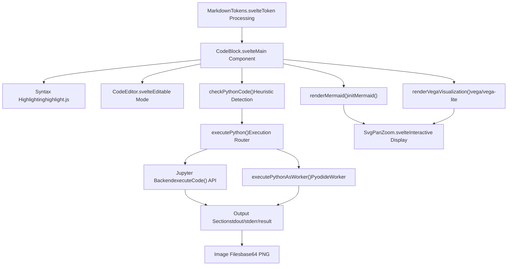
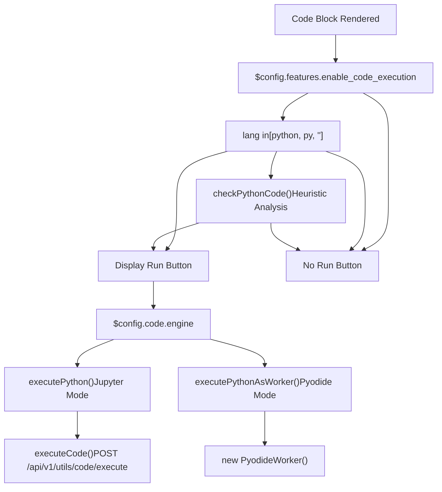
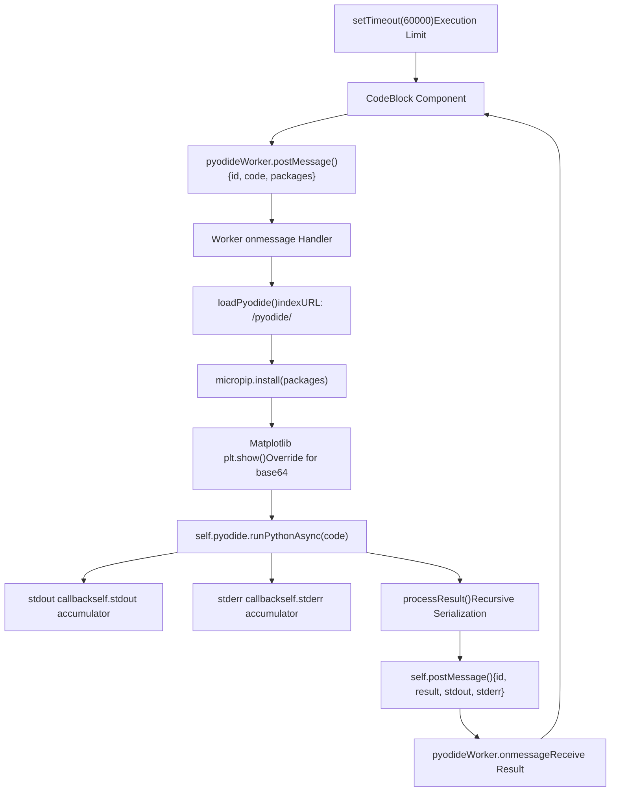
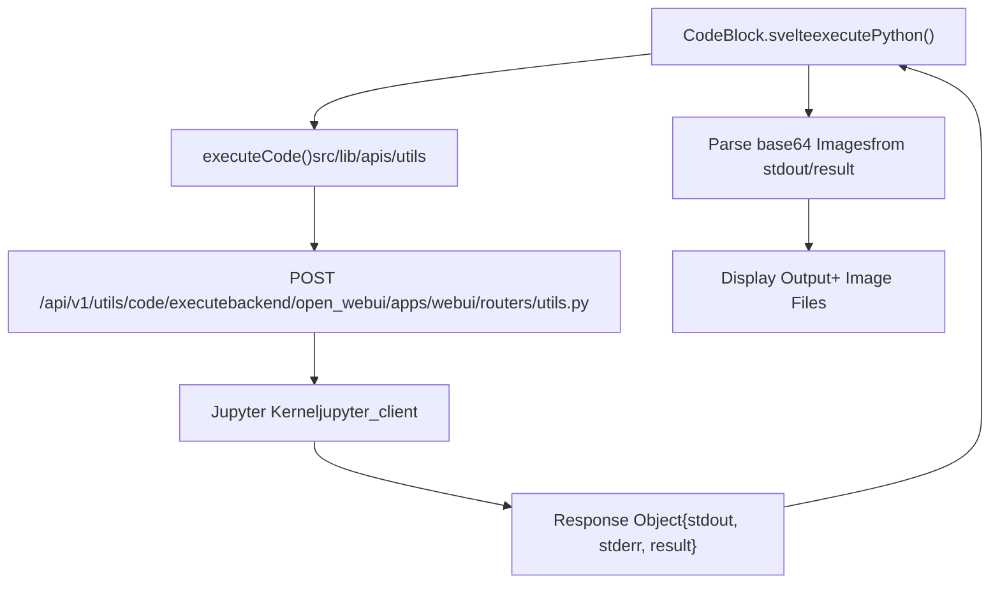
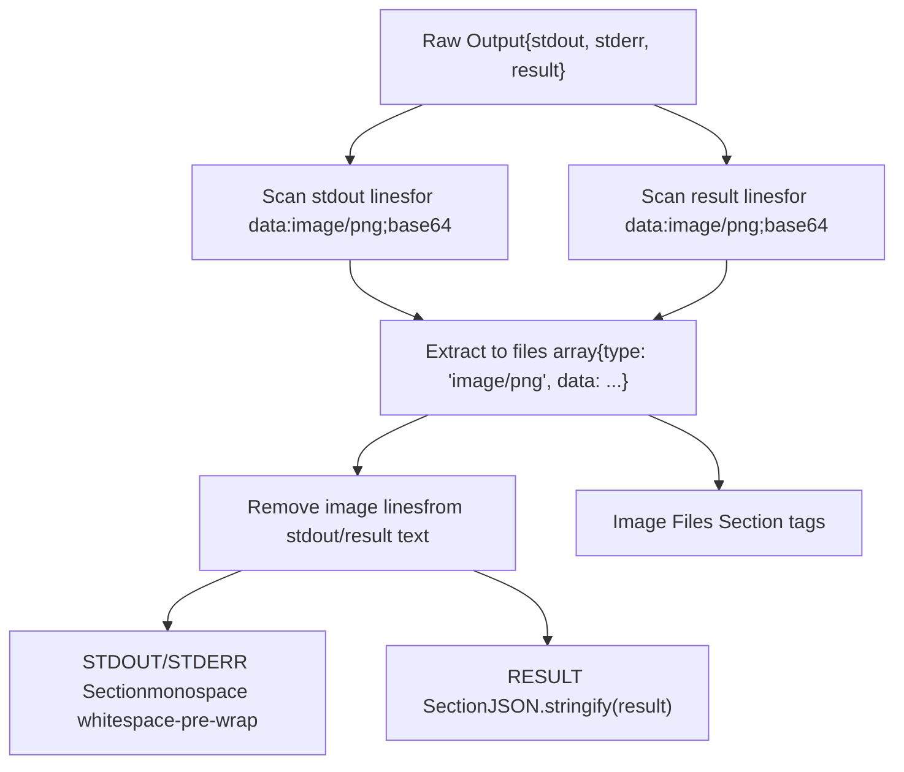
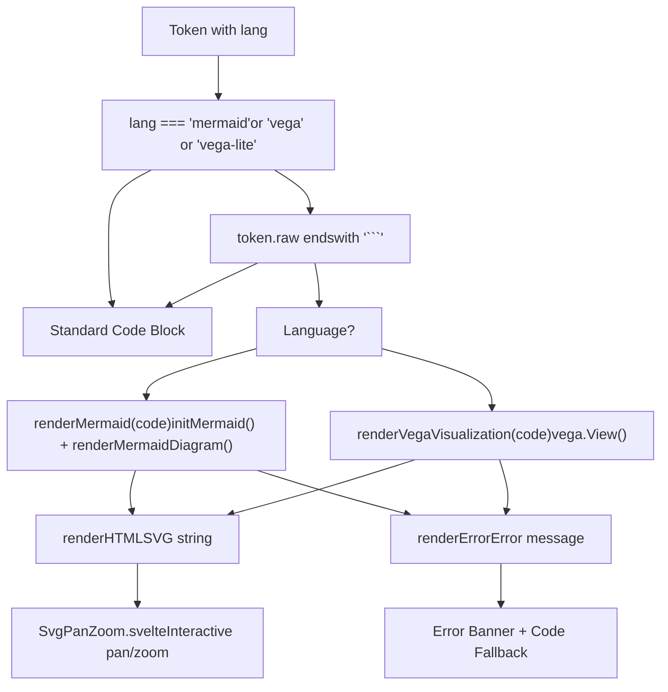
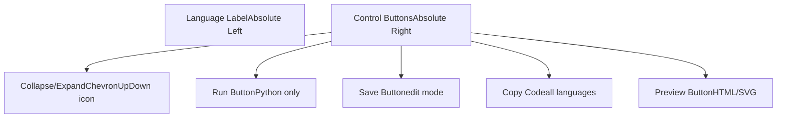
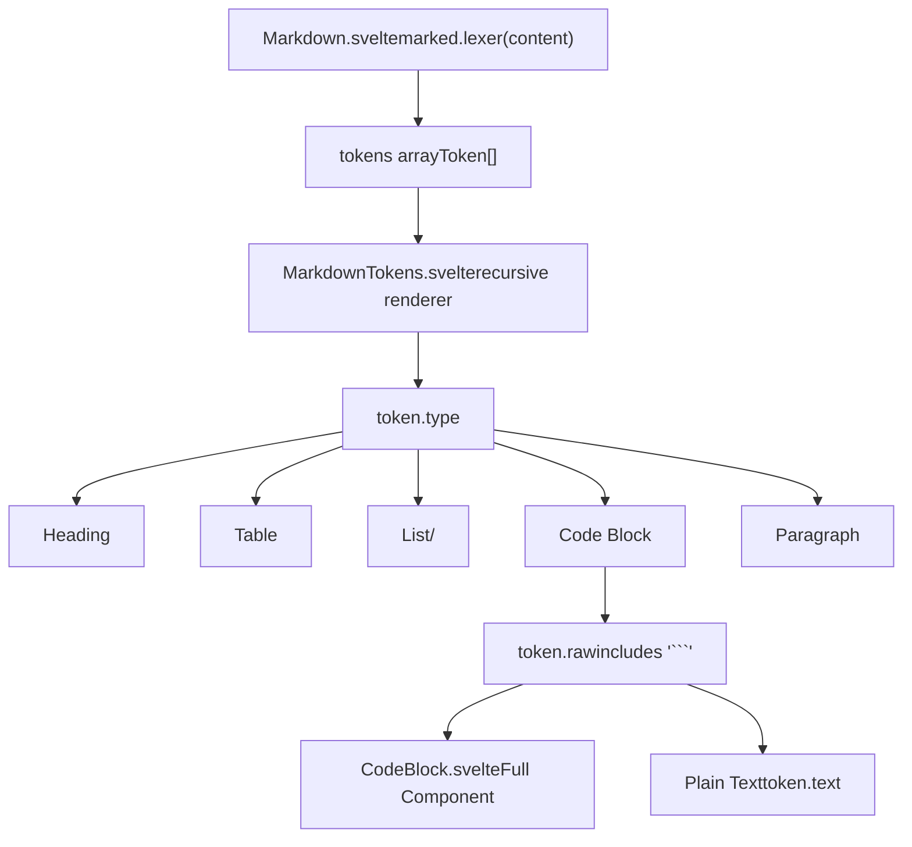

# Code Block Execution

Relevant source files

-   [src/lib/components/chat/ContentRenderer/FloatingButtons.svelte](https://github.com/open-webui/open-webui/blob/a7271532/src/lib/components/chat/ContentRenderer/FloatingButtons.svelte)
-   [src/lib/components/chat/Messages/CodeBlock.svelte](https://github.com/open-webui/open-webui/blob/a7271532/src/lib/components/chat/Messages/CodeBlock.svelte)
-   [src/lib/components/chat/Messages/ContentRenderer.svelte](https://github.com/open-webui/open-webui/blob/a7271532/src/lib/components/chat/Messages/ContentRenderer.svelte)
-   [src/lib/components/chat/Messages/Markdown.svelte](https://github.com/open-webui/open-webui/blob/a7271532/src/lib/components/chat/Messages/Markdown.svelte)
-   [src/lib/components/chat/Messages/Markdown/AlertRenderer.svelte](https://github.com/open-webui/open-webui/blob/a7271532/src/lib/components/chat/Messages/Markdown/AlertRenderer.svelte)
-   [src/lib/components/chat/Messages/Markdown/MarkdownTokens.svelte](https://github.com/open-webui/open-webui/blob/a7271532/src/lib/components/chat/Messages/Markdown/MarkdownTokens.svelte)
-   [src/lib/components/chat/Messages/Message.svelte](https://github.com/open-webui/open-webui/blob/a7271532/src/lib/components/chat/Messages/Message.svelte)
-   [src/lib/components/chat/Messages/MultiResponseMessages.svelte](https://github.com/open-webui/open-webui/blob/a7271532/src/lib/components/chat/Messages/MultiResponseMessages.svelte)
-   [src/lib/utils/marked/strikethrough-extension.ts](https://github.com/open-webui/open-webui/blob/a7271532/src/lib/utils/marked/strikethrough-extension.ts)
-   [src/lib/workers/pyodide.worker.ts](https://github.com/open-webui/open-webui/blob/a7271532/src/lib/workers/pyodide.worker.ts)

## Purpose and Scope

This document describes the code block execution system in Open WebUI, which enables rendering and interactive execution of code within chat messages. The system supports syntax highlighting for all languages, in-browser Python execution via Pyodide, server-side Python execution via Jupyter, and specialized rendering for Mermaid diagrams and Vega/Vega-Lite visualizations.

For information about how code blocks are parsed from Markdown, see [Markdown Processing](/open-webui/open-webui/5.3-markdown-processing). For general message rendering architecture, see [Response Message Component](/open-webui/open-webui/5.1-response-message-component).

Sources: [src/lib/components/chat/Messages/CodeBlock.svelte1-616](https://github.com/open-webui/open-webui/blob/a7271532/src/lib/components/chat/Messages/CodeBlock.svelte#L1-L616)

---

## Component Architecture

The `CodeBlock.svelte` component serves as the primary interface for code block rendering and execution. It is invoked by `MarkdownTokens.svelte` when processing `code` tokens from the Markdown lexer.

### CodeBlock Component Flow


**Key Component Props**

| Prop | Type | Purpose |
| --- | --- | --- |
| `lang` | string | Language identifier for syntax highlighting and execution routing |
| `code` | string | Source code content |
| `token` | Token | Marked.js token containing raw markdown |
| `edit` | boolean | Enable code editing via CodeEditor component |
| `run` | boolean | Show execution button for Python code |
| `save` | boolean | Show save button for code modifications |
| `preview` | boolean | Show preview button for HTML/SVG |
| `collapsed` | boolean | Initial collapse state |
| `attributes` | object | Additional metadata (e.g., saved output) |

Sources: [src/lib/components/chat/Messages/CodeBlock.svelte28-47](https://github.com/open-webui/open-webui/blob/a7271532/src/lib/components/chat/Messages/CodeBlock.svelte#L28-L47) [src/lib/components/chat/Messages/Markdown/MarkdownTokens.svelte104-129](https://github.com/open-webui/open-webui/blob/a7271532/src/lib/components/chat/Messages/Markdown/MarkdownTokens.svelte#L104-L129)

---

## Execution Mode Selection

The system determines execution mode based on configuration and language detection.

### Execution Decision Flow


The `checkPythonCode()` function uses heuristic pattern matching to detect Python syntax when no language is specified. It searches for common Python keywords like `def`, `import`, `lambda`, `True`, `False`, `None`, and operators like `and`, `or`, `not`, `in`, `is`.

Sources: [src/lib/components/chat/Messages/CodeBlock.svelte104-137](https://github.com/open-webui/open-webui/blob/a7271532/src/lib/components/chat/Messages/CodeBlock.svelte#L104-L137) [src/lib/components/chat/Messages/CodeBlock.svelte466-486](https://github.com/open-webui/open-webui/blob/a7271532/src/lib/components/chat/Messages/CodeBlock.svelte#L466-L486)

---

## Pyodide Worker Implementation

Pyodide execution runs entirely in the browser via a Web Worker, providing sandboxed Python execution without server dependencies.

### Pyodide Worker Architecture


### Package Detection and Installation

The `executePythonAsWorker()` function analyzes code using regular expressions to detect common library imports and automatically includes them in the package list sent to the worker:

| Pattern | Package |
| --- | --- |
| `\bimport\s+requests\b` | `requests` |
| `\bimport\s+numpy\b` | `numpy` |
| `\bimport\s+pandas\b` | `pandas` |
| `\bimport\s+matplotlib\b` | `matplotlib` |
| `\bimport\s+seaborn\b` | `seaborn` |
| `\bimport\s+sklearn\b` | `scikit-learn` |
| `\bimport\s+scipy\b` | `scipy` |
| `\bimport\s+sympy\b` | `sympy` |
| `\bimport\s+tiktoken\b` | `tiktoken` |
| `\bfrom\s+bs4\b` | `beautifulsoup4` |

The worker uses `micropip.install()` to fetch and install these packages from PyPI.

Sources: [src/lib/components/chat/Messages/CodeBlock.svelte220-246](https://github.com/open-webui/open-webui/blob/a7271532/src/lib/components/chat/Messages/CodeBlock.svelte#L220-L246) [src/lib/workers/pyodide.worker.ts16-64](https://github.com/open-webui/open-webui/blob/a7271532/src/lib/workers/pyodide.worker.ts#L16-L64)

### Matplotlib Integration

For matplotlib plots, the worker patches `plt.show()` to capture figure output as base64-encoded PNG data instead of attempting to display in a non-existent browser window:

```
def show(*, block=None):
    buf = BytesIO()
    matplotlib.pyplot.savefig(buf, format="png")
    buf.seek(0)
    img_str = base64.b64encode(buf.read()).decode('utf-8')
    matplotlib.pyplot.clf()
    buf.close()
    print(f"data:image/png;base64,{img_str}")
```
This patched function prints the image as a data URI to stdout, which is then captured and extracted by the main thread.

Sources: [src/lib/workers/pyodide.worker.ts81-106](https://github.com/open-webui/open-webui/blob/a7271532/src/lib/workers/pyodide.worker.ts#L81-L106)

### Result Serialization

The `processResult()` function recursively converts Python objects to JSON-safe representations:

1.  **Primitives**: strings, numbers, booleans pass through
2.  **BigInt**: converted to string
3.  **Arrays**: recursively process items
4.  **Pyodide Proxies**: call `.toJs()` method and recurse
5.  **Objects**: recursively process all properties
6.  **Fallback**: JSON.stringify() for unhandled types

Sources: [src/lib/workers/pyodide.worker.ts135-174](https://github.com/open-webui/open-webui/blob/a7271532/src/lib/workers/pyodide.worker.ts#L135-L174)

---

## Jupyter Backend Integration

When `$config.code.engine` is set to `"jupyter"`, execution is delegated to a backend Jupyter kernel via the `/api/v1/utils/code/execute` endpoint.

### Jupyter Execution Flow


The backend execution provides:

-   **Persistent kernel**: Variables persist across executions within a session
-   **Rich output**: Supports IPython display objects and matplotlib integration
-   **Server resources**: Access to server filesystem, GPUs, and installed packages

The response format matches Pyodide output structure:

```
{
  stdout: string,  // Standard output
  stderr: string,  // Standard error
  result: any      // Return value or last expression
}
```
Sources: [src/lib/components/chat/Messages/CodeBlock.svelte139-218](https://github.com/open-webui/open-webui/blob/a7271532/src/lib/components/chat/Messages/CodeBlock.svelte#L139-L218) [src/lib/apis/utils/index.ts1-30](https://github.com/open-webui/open-webui/blob/a7271532/src/lib/apis/utils/index.ts#L1-L30) (implied)

---

## Output Handling and Display

Both execution modes produce output in a consistent format that is parsed and displayed by the CodeBlock component.

### Output Processing Pipeline


### Image Extraction Logic

The component scans both `stdout` and `result` for lines starting with `"data:image/png;base64"`. When found:

1.  Line is added to `files` array with type `"image/png"`
2.  Line is removed from the text output (with or without trailing newline)
3.  Images are rendered at full width (max 36rem) below the result

This allows matplotlib plots from Pyodide or Jupyter to be seamlessly integrated into the output display.

Sources: [src/lib/components/chat/Messages/CodeBlock.svelte153-209](https://github.com/open-webui/open-webui/blob/a7271532/src/lib/components/chat/Messages/CodeBlock.svelte#L153-L209) [src/lib/components/chat/Messages/CodeBlock.svelte261-317](https://github.com/open-webui/open-webui/blob/a7271532/src/lib/components/chat/Messages/CodeBlock.svelte#L261-L317) [src/lib/components/chat/Messages/CodeBlock.svelte570-611](https://github.com/open-webui/open-webui/blob/a7271532/src/lib/components/chat/Messages/CodeBlock.svelte#L570-L611)

---

## Diagram Rendering

The CodeBlock component provides specialized rendering for Mermaid diagrams and Vega/Vega-Lite visualizations.

### Diagram Rendering Flow


### Mermaid Initialization

Mermaid is lazy-loaded and initialized only when first needed:

```
let mermaid = null;
const renderMermaid = async (code) => {
    if (!mermaid) {
        mermaid = await initMermaid();  // from $lib/utils
    }
    return await renderMermaidDiagram(mermaid, code);
};
```
The `render()` function is called reactively when the token updates and checks if the code block is complete (ends with closing backticks) before attempting visualization.

Sources: [src/lib/components/chat/Messages/CodeBlock.svelte331-363](https://github.com/open-webui/open-webui/blob/a7271532/src/lib/components/chat/Messages/CodeBlock.svelte#L331-L363) [src/lib/components/chat/Messages/CodeBlock.svelte423-441](https://github.com/open-webui/open-webui/blob/a7271532/src/lib/components/chat/Messages/CodeBlock.svelte#L423-L441)

### SVG Pan and Zoom

All rendered diagrams are wrapped in the `SvgPanZoom` component which provides:

-   **Pan**: Click and drag to move the diagram
-   **Zoom**: Scroll wheel or pinch to zoom
-   **Reset**: Button to restore original view
-   **Fullscreen**: Expand to full viewport

The component receives the raw SVG string and the original token text for reference.

Sources: [src/lib/components/chat/Messages/CodeBlock.svelte425-429](https://github.com/open-webui/open-webui/blob/a7271532/src/lib/components/chat/Messages/CodeBlock.svelte#L425-L429) [src/lib/components/common/SVGPanZoom.svelte1-100](https://github.com/open-webui/open-webui/blob/a7271532/src/lib/components/common/SVGPanZoom.svelte#L1-L100) (implied)

---

## Code Editing and UI Controls

The CodeBlock component provides a rich UI with multiple interactive controls.

### Control Bar Layout


### Button Conditions

| Button | Condition | Action |
| --- | --- | --- |
| **Collapse/Expand** | Always shown | Toggles `collapsed` state; shows "X hidden lines" message |
| **Run** | `lang in [python, py]` AND `enable_code_execution` | Calls `executePython(code)` |
| **Save** | `save=true` prop | Calls `onSave(code)` callback |
| **Copy** | Always shown | Calls `copyToClipboard(_code)` |
| **Preview** | `preview=true` AND `lang in [html, svg]` | Calls `onPreview(code)` callback |

### Collapse State

When `collapsed=true`:

-   Code display is hidden
-   Shows gray text: "{{COUNT}} hidden lines" where COUNT is `code.split('\n').length`
-   Execution output (if any) is still hidden
-   Clicking Collapse/Expand button toggles state

Sources: [src/lib/components/chat/Messages/CodeBlock.svelte449-514](https://github.com/open-webui/open-webui/blob/a7271532/src/lib/components/chat/Messages/CodeBlock.svelte#L449-L514) [src/lib/components/chat/Messages/CodeBlock.svelte552-561](https://github.com/open-webui/open-webui/blob/a7271532/src/lib/components/chat/Messages/CodeBlock.svelte#L552-L561)

### Edit Mode

When `edit=true`, the code is rendered using `CodeEditor.svelte` instead of syntax-highlighted `<pre>` blocks. The editor provides:

-   **Syntax highlighting**: Monaco-editor or CodeMirror-based editing
-   **Save callback**: Triggered on explicit save or Ctrl+S
-   **Change callback**: Updates internal `_code` state as user types

This enables inline code modification within the message, useful for regenerating responses with edited code.

Sources: [src/lib/components/chat/Messages/CodeBlock.svelte526-537](https://github.com/open-webui/open-webui/blob/a7271532/src/lib/components/chat/Messages/CodeBlock.svelte#L526-L537)

---

## Integration with Markdown Pipeline

The CodeBlock component is instantiated by `MarkdownTokens.svelte` during recursive token rendering.

### Invocation Context


The check for `token.raw.includes('```')` ensures that only actual code blocks (with triple backticks) are rendered as interactive CodeBlock components. Inline code snippets without backticks are rendered as plain text.

### Prop Mapping

The MarkdownTokens component passes through several props:

```
<CodeBlock
    id={`${id}-${tokenIdx}`}
    collapsed={$settings?.collapseCodeBlocks ?? false}
    {token}
    lang={token?.lang ?? ''}
    code={token?.text ?? ''}
    {attributes}
    {save}
    {preview}
    edit={editCodeBlock}
    stickyButtonsClassName={topPadding ? 'top-10' : 'top-0'}
    onSave={(value) => { ... }}
    {onUpdate}
    {onPreview}
/>
```
Key mappings:

-   `token.lang` → `lang` prop (language identifier)
-   `token.text` → `code` prop (raw code content)
-   `token` → `token` prop (full token for raw access)
-   Global `$settings.collapseCodeBlocks` → `collapsed` initial state

Sources: [src/lib/components/chat/Messages/Markdown/MarkdownTokens.svelte104-127](https://github.com/open-webui/open-webui/blob/a7271532/src/lib/components/chat/Messages/Markdown/MarkdownTokens.svelte#L104-L127) [src/lib/components/chat/Messages/Markdown.svelte1-79](https://github.com/open-webui/open-webui/blob/a7271532/src/lib/components/chat/Messages/Markdown.svelte#L1-L79)

---

## Saved Output Persistence

Code execution output can be persisted in message metadata via the `attributes` prop.

### Attributes Format

The `attributes.output` field contains an HTML-escaped JSON string:

```
{
  output: "&quot;{...}&quot;"  // Double-encoded JSON
}
```
The component unescapes and parses this on mount:

```
const unescapeHtml = (html) => {
    const textArea = document.createElement('textarea');
    textArea.innerHTML = html;
    return textArea.value;
};

const output = JSON.parse(unescapeHtml(attributes.output));
stdout = output.stdout;
stderr = output.stderr;
result = output.result;
```
This allows previously executed code blocks to display their output immediately without re-execution, which is critical for:

-   **Shared chats**: Recipients see execution results without running code
-   **Message history**: Results persist across sessions
-   **Regenerated responses**: Original execution state is preserved

Sources: [src/lib/components/chat/Messages/CodeBlock.svelte379-403](https://github.com/open-webui/open-webui/blob/a7271532/src/lib/components/chat/Messages/CodeBlock.svelte#L379-L403)

---

## Configuration Settings

Code execution behavior is controlled by configuration values and user settings.

### Configuration Flags

| Config Path | Type | Default | Purpose |
| --- | --- | --- | --- |
| `$config.features.enable_code_execution` | boolean | `true` | Master switch for execution feature |
| `$config.code.engine` | string | undefined | Execution engine: `"jupyter"` or undefined (Pyodide) |
| `$settings.collapseCodeBlocks` | boolean | `false` | Initial collapse state for all code blocks |

### Execution Timeout

Pyodide execution has a hardcoded 60-second timeout:

```
setTimeout(() => {
    if (executing) {
        executing = false;
        stderr = 'Execution Time Limit Exceeded';
        pyodideWorker.terminate();
    }
}, 60000);
```
This prevents runaway loops from hanging the browser. Jupyter execution timeout is controlled server-side.

Sources: [src/lib/components/chat/Messages/CodeBlock.svelte247-253](https://github.com/open-webui/open-webui/blob/a7271532/src/lib/components/chat/Messages/CodeBlock.svelte#L247-L253) [src/lib/components/chat/Messages/CodeBlock.svelte466](https://github.com/open-webui/open-webui/blob/a7271532/src/lib/components/chat/Messages/CodeBlock.svelte#L466-L466) [src/lib/components/chat/Messages/Markdown/MarkdownTokens.svelte108](https://github.com/open-webui/open-webui/blob/a7271532/src/lib/components/chat/Messages/Markdown/MarkdownTokens.svelte#L108-L108)

---

## Error Handling

The system handles errors at multiple levels to provide graceful degradation.

### Error Categories

1.  **Diagram Rendering Errors**

    -   Mermaid syntax errors display red banner with error message
    -   Falls back to showing raw code in `<pre>` block
2.  **Python Execution Errors**

    -   Captured in `stderr` output
    -   Displayed in "STDOUT/STDERR" section with monospace font
    -   Worker errors trigger `pyodideWorker.onerror` handler
3.  **Timeout Errors**

    -   Pyodide worker terminated after 60 seconds
    -   Sets `stderr = 'Execution Time Limit Exceeded'`
    -   Worker cleanup via `terminate()`
4.  **Network Errors** (Jupyter mode)

    -   API call failures caught and displayed via `toast.error()`
    -   Returns `null` to prevent further processing

Sources: [src/lib/components/chat/Messages/CodeBlock.svelte342-361](https://github.com/open-webui/open-webui/blob/a7271532/src/lib/components/chat/Messages/CodeBlock.svelte#L342-L361) [src/lib/components/chat/Messages/CodeBlock.svelte325-328](https://github.com/open-webui/open-webui/blob/a7271532/src/lib/components/chat/Messages/CodeBlock.svelte#L325-L328) [src/lib/components/chat/Messages/CodeBlock.svelte147-150](https://github.com/open-webui/open-webui/blob/a7271532/src/lib/components/chat/Messages/CodeBlock.svelte#L147-L150) [src/lib/components/chat/Messages/CodeBlock.svelte432-438](https://github.com/open-webui/open-webui/blob/a7271532/src/lib/components/chat/Messages/CodeBlock.svelte#L432-L438)
