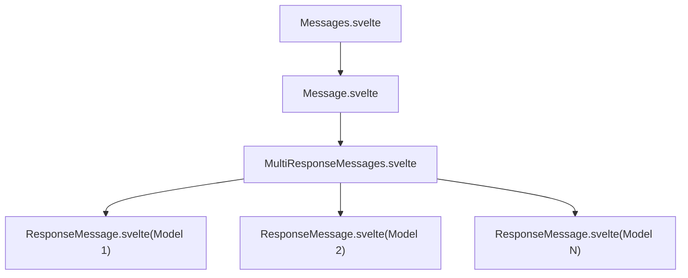
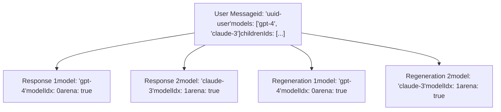
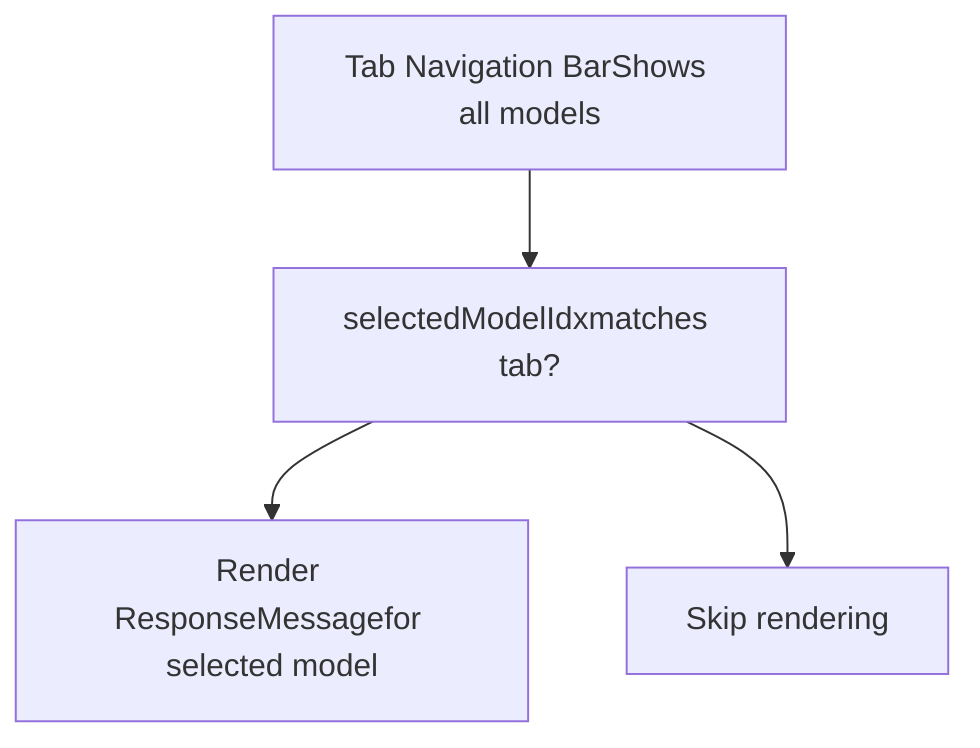
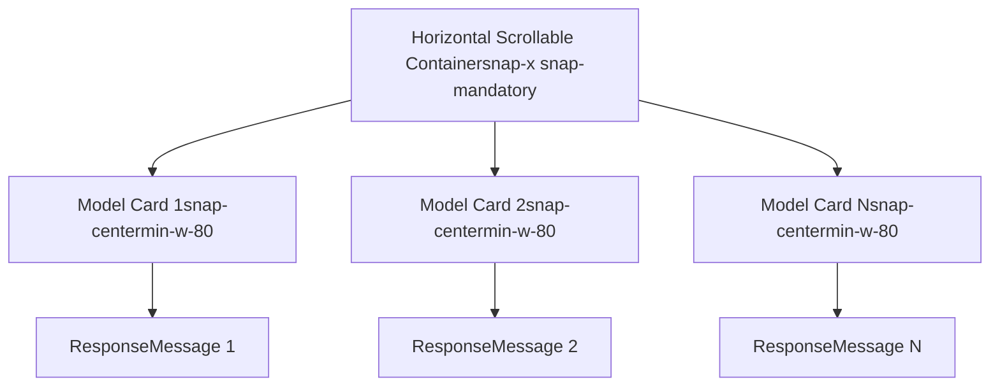
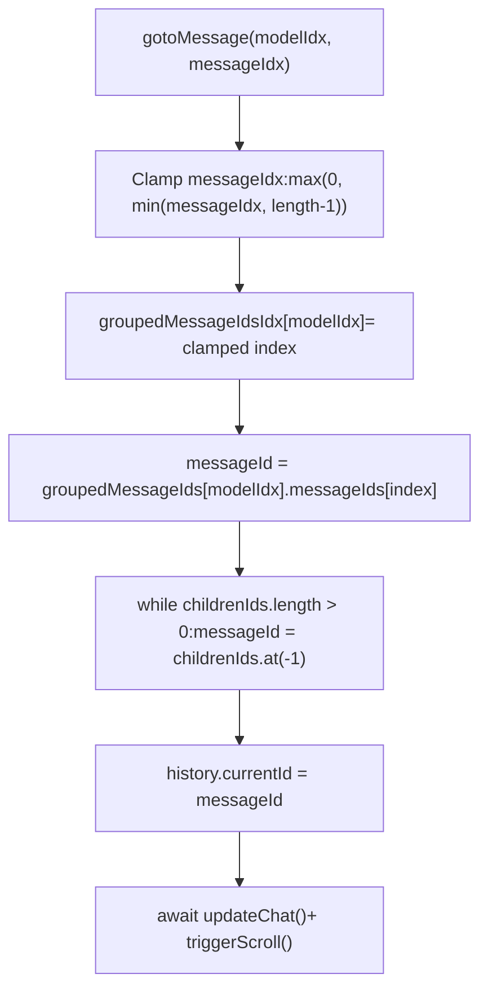
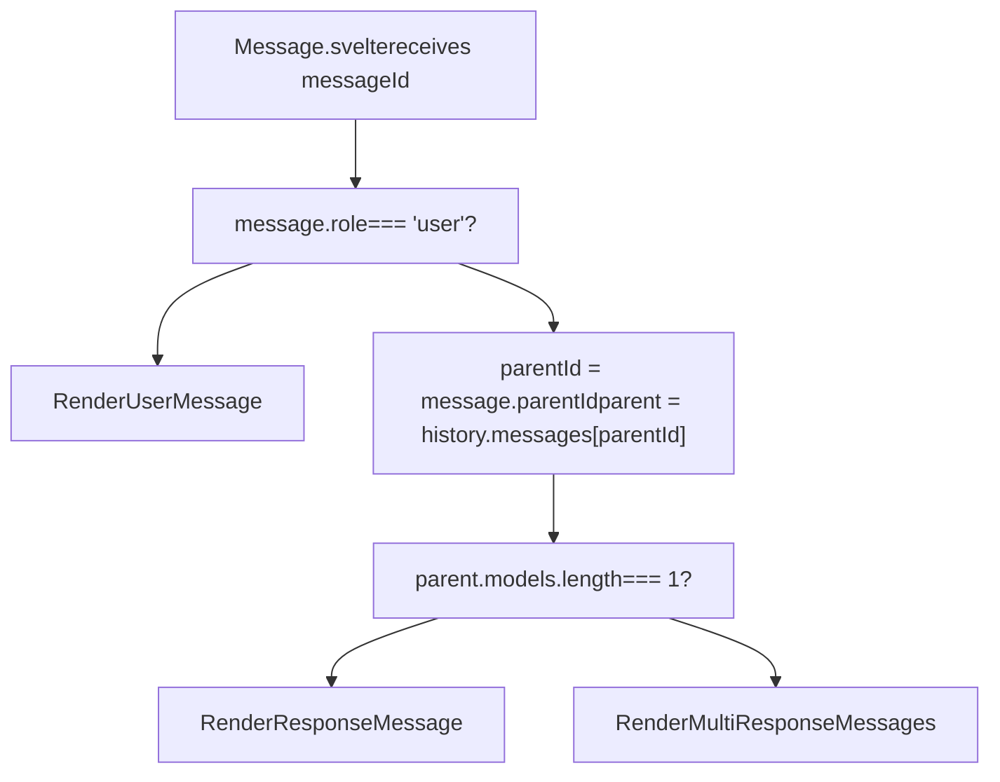
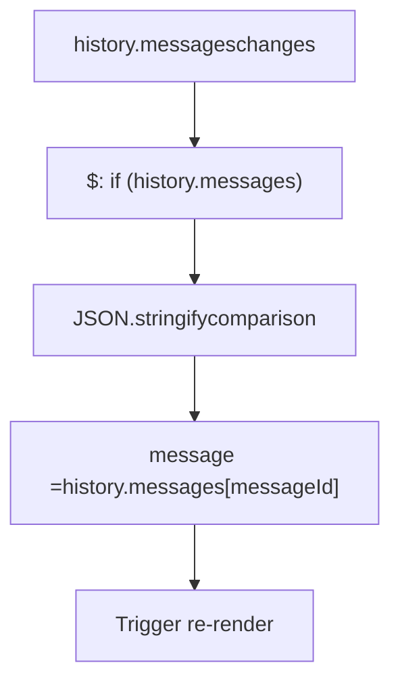
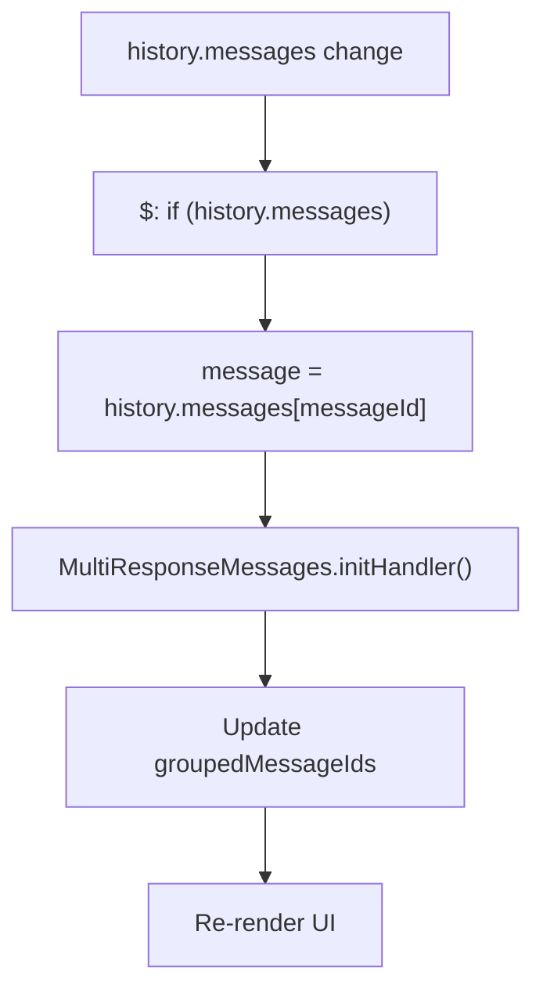

# Multi-Model Response Display

Relevant source files

-   [src/lib/components/chat/ContentRenderer/FloatingButtons.svelte](https://github.com/open-webui/open-webui/blob/a7271532/src/lib/components/chat/ContentRenderer/FloatingButtons.svelte)
-   [src/lib/components/chat/Messages.svelte](https://github.com/open-webui/open-webui/blob/a7271532/src/lib/components/chat/Messages.svelte)
-   [src/lib/components/chat/Messages/CodeBlock.svelte](https://github.com/open-webui/open-webui/blob/a7271532/src/lib/components/chat/Messages/CodeBlock.svelte)
-   [src/lib/components/chat/Messages/ContentRenderer.svelte](https://github.com/open-webui/open-webui/blob/a7271532/src/lib/components/chat/Messages/ContentRenderer.svelte)
-   [src/lib/components/chat/Messages/Markdown.svelte](https://github.com/open-webui/open-webui/blob/a7271532/src/lib/components/chat/Messages/Markdown.svelte)
-   [src/lib/components/chat/Messages/Markdown/AlertRenderer.svelte](https://github.com/open-webui/open-webui/blob/a7271532/src/lib/components/chat/Messages/Markdown/AlertRenderer.svelte)
-   [src/lib/components/chat/Messages/Markdown/MarkdownTokens.svelte](https://github.com/open-webui/open-webui/blob/a7271532/src/lib/components/chat/Messages/Markdown/MarkdownTokens.svelte)
-   [src/lib/components/chat/Messages/Message.svelte](https://github.com/open-webui/open-webui/blob/a7271532/src/lib/components/chat/Messages/Message.svelte)
-   [src/lib/components/chat/Messages/MultiResponseMessages.svelte](https://github.com/open-webui/open-webui/blob/a7271532/src/lib/components/chat/Messages/MultiResponseMessages.svelte)
-   [src/lib/components/chat/Messages/ResponseMessage.svelte](https://github.com/open-webui/open-webui/blob/a7271532/src/lib/components/chat/Messages/ResponseMessage.svelte)
-   [src/lib/components/chat/Messages/UserMessage.svelte](https://github.com/open-webui/open-webui/blob/a7271532/src/lib/components/chat/Messages/UserMessage.svelte)
-   [src/lib/components/chat/Settings/Interface.svelte](https://github.com/open-webui/open-webui/blob/a7271532/src/lib/components/chat/Settings/Interface.svelte)
-   [src/lib/components/chat/SettingsModal.svelte](https://github.com/open-webui/open-webui/blob/a7271532/src/lib/components/chat/SettingsModal.svelte)
-   [src/lib/components/common/Modal.svelte](https://github.com/open-webui/open-webui/blob/a7271532/src/lib/components/common/Modal.svelte)
-   [src/lib/utils/index.ts](https://github.com/open-webui/open-webui/blob/a7271532/src/lib/utils/index.ts)
-   [src/lib/utils/marked/strikethrough-extension.ts](https://github.com/open-webui/open-webui/blob/a7271532/src/lib/utils/marked/strikethrough-extension.ts)
-   [src/lib/workers/pyodide.worker.ts](https://github.com/open-webui/open-webui/blob/a7271532/src/lib/workers/pyodide.worker.ts)
-   [src/routes/(app)/+layout.svelte](https://github.com/open-webui/open-webui/blob/a7271532/src/routes/(app)/+layout.svelte)/+layout.svelte)
-   [src/routes/(app)/+page.svelte](https://github.com/open-webui/open-webui/blob/a7271532/src/routes/(app)/+page.svelte)/+page.svelte)
-   [src/routes/(app)/c/\[id\]/+page.svelte](src/routes/(app)/c/%5Bid%5D/+page.svelte)

## Purpose and Scope

This page documents the `MultiResponseMessages` component, which displays and manages navigation between responses from multiple models or multiple regenerations of the same model. When a user message has responses from different models (arena mode), this component organizes and presents them in either a tabbed interface or side-by-side cards.

The component handles:

-   Grouping responses by model using `modelIdx` field
-   Independent navigation history for each model's responses
-   Two display modes: tabbed interface or side-by-side cards
-   Response merging using Mixture of Agents (MoA)

**Note:** For information about model selection and message distribution, see page [4.1 Chat Component Architecture](/open-webui/open-webui/4.1-chat-component-architecture). For the overall message rendering system, see page [5 Message Rendering](/open-webui/open-webui/5-message-rendering).

---

## Component Architecture

The `MultiResponseMessages` component receives a message ID and organizes its sibling response messages by model. It maintains independent navigation state for each model, allowing users to browse different regenerations without affecting other models' displayed responses.

### Component Hierarchy


### Key Props and State

| Variable | Type | Purpose | Initialized |
| --- | --- | --- | --- |
| `history` | `object` | Message tree structure | External prop |
| `messageId` | `string` | Current message ID | External prop |
| `parentMessage` | `object` | User message with `models` array | `initHandler()` |
| `groupedMessageIds` | `object` | Messages grouped by `modelIdx` | `initHandler()` |
| `groupedMessageIdsIdx` | `object` | Current display index per model | `initHandler()` |
| `selectedModelIdx` | `number | null` | Active model in tab mode | `initHandler()` |

**Sources:**

-   [src/lib/components/chat/Messages/MultiResponseMessages.svelte1-68](https://github.com/open-webui/open-webui/blob/a7271532/src/lib/components/chat/Messages/MultiResponseMessages.svelte#L1-L68)
-   [src/lib/components/chat/Messages.svelte76-88](https://github.com/open-webui/open-webui/blob/a7271532/src/lib/components/chat/Messages.svelte#L76-L88)
-   [src/lib/components/chat/Messages/Message.svelte76-126](https://github.com/open-webui/open-webui/blob/a7271532/src/lib/components/chat/Messages/Message.svelte#L76-L126)

---

## Message Structure

The component expects messages in a tree structure where a user message with multiple models has multiple response children, each tagged with a `modelIdx`.

### Arena Message Structure


### Key Message Fields

| Field | Type | Location | Purpose |
| --- | --- | --- | --- |
| `models` | `string[]` | User message | Array of model IDs for arena |
| `modelIdx` | `number` | Response message | Index into parent's `models` array |
| `arena` | `boolean` | Response message | Flag indicating arena mode |
| `childrenIds` | `string[]` | Any message | References to child messages |
| `parentId` | `string` | Any message | Reference to parent message |

**Sources:**

-   [src/lib/components/chat/Messages/MultiResponseMessages.svelte147-176](https://github.com/open-webui/open-webui/blob/a7271532/src/lib/components/chat/Messages/MultiResponseMessages.svelte#L147-L176)
-   [src/lib/components/chat/Chat.svelte1471-1555](https://github.com/open-webui/open-webui/blob/a7271532/src/lib/components/chat/Chat.svelte#L1471-L1555)

---

## Response Grouping and Organization

The `MultiResponseMessages` component organizes responses by model and supports independent navigation within each model's response history.

### Initialization Process: `initHandler()`

> **[Mermaid sequence]**
> *(图表结构无法解析)*

### Data Structure: `groupedMessageIds`

The `groupedMessageIds` object organizes messages by model index:

```
// Structure
groupedMessageIds = {
  0: { messageIds: ['uuid1', 'uuid3', 'uuid5'] },  // All responses for models[0]
  1: { messageIds: ['uuid2', 'uuid4', 'uuid6'] },  // All responses for models[1]
  2: { messageIds: ['uuid7', 'uuid8'] }             // All responses for models[2]
}

// Corresponding index tracker
groupedMessageIdsIdx = {
  0: 2,  // Currently showing 3rd response (uuid5) for model 0
  1: 0,  // Currently showing 1st response (uuid2) for model 1
  2: 1   // Currently showing 2nd response (uuid8) for model 2
}
```
The initialization at [src/lib/components/chat/Messages/MultiResponseMessages.svelte142-198](https://github.com/open-webui/open-webui/blob/a7271532/src/lib/components/chat/Messages/MultiResponseMessages.svelte#L142-L198) performs:

1.  **Parent Retrieval** (lines 147-149): Reads `history.messages[message.parentId]` to get user message
2.  **Grouping Logic** (lines 151-176): For each model in `parentMessage.models`:
    -   Filters `childrenIds` by matching `modelIdx`
    -   Falls back to `model` field for legacy messages (pre-modelIdx)
    -   Updates legacy messages with correct `modelIdx`
    -   Stores filtered message IDs in `groupedMessageIds[modelIdx]`
3.  **Index Initialization** (lines 178-191): Sets `groupedMessageIdsIdx[modelIdx]` to the index of the currently displayed message within each group
4.  **Tab Selection** (lines 193-196): Sets `selectedModelIdx = 0` if tabbed mode, otherwise `null`

**Sources:**

-   [src/lib/components/chat/Messages/MultiResponseMessages.svelte142-198](https://github.com/open-webui/open-webui/blob/a7271532/src/lib/components/chat/Messages/MultiResponseMessages.svelte#L142-L198)

---

## Display Modes

The component supports two display modes controlled by `$settings?.displayMultiModelResponsesInTabs`.

### Tab-Based Display

When `$settings?.displayMultiModelResponsesInTabs` is `true`:

**Tab Rendering Flow:**


**Implementation** ([src/lib/components/chat/Messages/MultiResponseMessages.svelte246-324](https://github.com/open-webui/open-webui/blob/a7271532/src/lib/components/chat/Messages/MultiResponseMessages.svelte#L246-L324)):

-   Lines 246-288: Renders tab buttons for each model
    -   Model name extracted via `$models.find(m => m.id === parentMessage.models[modelIdx])`
    -   Tab count badge shows `groupedMessageIds[modelIdx].messageIds.length`
    -   Click handler sets `selectedModelIdx` and calls `onGroupClick(modelIdx)`
-   Lines 290-324: Renders single `ResponseMessage` for selected model only
    -   Uses conditional `{#if selectedModelIdx === modelIdx}`
    -   Message ID from `groupedMessageIds[modelIdx].messageIds[groupedMessageIdsIdx[modelIdx]]`

### Side-by-Side Card Display

When tabbed display is disabled:

**Card Layout Flow:**


**Implementation** ([src/lib/components/chat/Messages/MultiResponseMessages.svelte325-383](https://github.com/open-webui/open-webui/blob/a7271532/src/lib/components/chat/Messages/MultiResponseMessages.svelte#L325-L383)):

-   Line 325: Container with `flex snap-x snap-mandatory overflow-x-auto`
-   Lines 327-383: Loop through models, render card for each:
    -   Line 331-335: Card styling `min-w-80` (desktop) or `min-w-full` (mobile)
    -   Line 336-340: Border style `border-2` if active, `border-dashed` otherwise
    -   Line 342-348: Model header with name and navigation controls
    -   Line 350-378: Renders `ResponseMessage` component
-   All cards rendered simultaneously; browser handles off-screen optimization

**Sources:**

-   [src/lib/components/chat/Messages/MultiResponseMessages.svelte246-383](https://github.com/open-webui/open-webui/blob/a7271532/src/lib/components/chat/Messages/MultiResponseMessages.svelte#L246-L383)
-   [src/lib/stores/index.ts](https://github.com/open-webui/open-webui/blob/a7271532/src/lib/stores/index.ts) (settings store)

---

## Navigation System

Each model maintains independent navigation state via `groupedMessageIdsIdx`, allowing users to browse different regenerations without affecting other models' displayed messages.

### Navigation Functions

| Function | Signature | Purpose |
| --- | --- | --- |
| `gotoMessage` | `(modelIdx, messageIdx)` | Jump to specific response index |
| `showPreviousMessage` | `(modelIdx)` | Decrement index for model |
| `showNextMessage` | `(modelIdx)` | Increment index for model |

### Navigation Flow: `gotoMessage()`


**Implementation** ([src/lib/components/chat/Messages/MultiResponseMessages.svelte70-97](https://github.com/open-webui/open-webui/blob/a7271532/src/lib/components/chat/Messages/MultiResponseMessages.svelte#L70-L97)):

1.  **Index Clamping** (lines 72-75): Ensures `messageIdx` is within valid range `[0, length-1]`
2.  **State Update** (line 72): Updates `groupedMessageIdsIdx[modelIdx]` to new index
3.  **Message Lookup** (line 78): Gets message ID from `groupedMessageIds[modelIdx].messageIds[index]`
4.  **Branch Traversal** (lines 83-86): Walks to deepest child using `while` loop
    -   Always follows last child: `messageId = messageChildrenIds.at(-1)`
    -   Ensures `history.currentId` points to leaf node
5.  **Synchronization** (lines 89-95): Updates history, calls `updateChat()`, triggers scroll

### Independent Navigation Example

```
Model 0 (GPT-4): [Resp1, Resp2, Resp3] → Currently at index 2 (Resp3)
Model 1 (Claude): [Resp1, Resp2]       → Currently at index 0 (Resp1)

User clicks "Next" on Model 1:
- groupedMessageIdsIdx[1] changes from 0 to 1
- Model 0 remains at index 2
- history.currentId updates to Model 1's Resp2
```
**Sources:**

-   [src/lib/components/chat/Messages/MultiResponseMessages.svelte70-140](https://github.com/open-webui/open-webui/blob/a7271532/src/lib/components/chat/Messages/MultiResponseMessages.svelte#L70-L140)

---

## Response Merging

The component supports merging responses from all models using Mixture of Agents (MoA) approach.

### Merge Button Visibility

The merge button appears when:

-   `isLastMessage === true` (this is the latest message in chat)
-   All model responses are complete (`done === true`)

Located at [src/lib/components/chat/Messages/MultiResponseMessages.svelte421-439](https://github.com/open-webui/open-webui/blob/a7271532/src/lib/components/chat/Messages/MultiResponseMessages.svelte#L421-L439)

### Merge Flow

> **[Mermaid sequence]**
> *(图表结构无法解析)*

### Implementation

**mergeResponsesHandler()** ([src/lib/components/chat/Messages/MultiResponseMessages.svelte217-225](https://github.com/open-webui/open-webui/blob/a7271532/src/lib/components/chat/Messages/MultiResponseMessages.svelte#L217-L225)):

1.  **Response Collection** (lines 218-223):

    ```
    const responses = [];
    for (const [modelIdx, model] of Object.entries(groupedMessageIds)) {
      const messageId = model.messageIds[groupedMessageIdsIdx[modelIdx]];
      const message = history.messages[messageId];
      responses.push(message.content);
    }
    ```

2.  **API Invocation** (line 224):
    -   Calls `mergeResponses(messageId, responses, chatId)`
    -   Triggers `generateMoACompletion()` API from [src/lib/apis/index.ts](https://github.com/open-webui/open-webui/blob/a7271532/src/lib/apis/index.ts)
3.  **Result Storage**: Merged response stored in `history.messages[messageId].merged`:

    ```
    merged: {
      status: boolean,
      content: string,
      timestamp: number
    }
    ```


**Display** ([src/lib/components/chat/Messages/MultiResponseMessages.svelte394-418](https://github.com/open-webui/open-webui/blob/a7271532/src/lib/components/chat/Messages/MultiResponseMessages.svelte#L394-L418)):

-   Renders below all model responses
-   Shows "Merged Response" header with profile image
-   Uses `Markdown` component to render merged content

**Sources:**

-   [src/lib/components/chat/Messages/MultiResponseMessages.svelte217-225](https://github.com/open-webui/open-webui/blob/a7271532/src/lib/components/chat/Messages/MultiResponseMessages.svelte#L217-L225)
-   [src/lib/components/chat/Messages/MultiResponseMessages.svelte394-439](https://github.com/open-webui/open-webui/blob/a7271532/src/lib/components/chat/Messages/MultiResponseMessages.svelte#L394-L439)
-   [src/lib/apis/index.ts](https://github.com/open-webui/open-webui/blob/a7271532/src/lib/apis/index.ts) (generateMoACompletion)

---

## Message Grouping Algorithm

The component groups sibling response messages by their `modelIdx` field, which corresponds to the model's position in the parent's `models` array.

### Grouping Logic

**Algorithm** ([src/lib/components/chat/Messages/MultiResponseMessages.svelte151-176](https://github.com/open-webui/open-webui/blob/a7271532/src/lib/components/chat/Messages/MultiResponseMessages.svelte#L151-L176)):

```
For each modelIdx in parentMessage.models:
  1. Filter childrenIds where message.modelIdx === modelIdx
  2. If no matches found (legacy messages):
     - Filter by message.model === parentMessage.models[modelIdx]
     - Update found messages with modelIdx
  3. Store result in groupedMessageIds[modelIdx]
```
**Code Structure:**

```
for (const [idx, model] of parentMessage.models.entries()) {
  let modelMessageIds = parentMessage.childrenIds.filter(
    (id) => history.messages[id]?.modelIdx === idx
  );

  // Legacy support
  if (modelMessageIds.length === 0) {
    modelMessageIds = parentMessage.childrenIds.filter(
      (id) => history.messages[id].model === model
    );
    // Update legacy messages
    modelMessageIds.forEach(id => {
      history.messages[id].modelIdx = idx;
    });
  }

  groupedMessageIds[idx] = { messageIds: modelMessageIds };
}
```
### Example Grouping

```
Parent Message:
  models: ['gpt-4', 'claude-3-opus']
  childrenIds: ['msg1', 'msg2', 'msg3', 'msg4']

Child Messages:
  msg1: { model: 'gpt-4', modelIdx: 0 }
  msg2: { model: 'claude-3-opus', modelIdx: 1 }
  msg3: { model: 'gpt-4', modelIdx: 0 }       (regeneration)
  msg4: { model: 'claude-3-opus', modelIdx: 1 } (regeneration)

Result:
  groupedMessageIds = {
    0: { messageIds: ['msg1', 'msg3'] },  // GPT-4 responses
    1: { messageIds: ['msg2', 'msg4'] }   // Claude responses
  }
```
**Sources:**

-   [src/lib/components/chat/Messages/MultiResponseMessages.svelte151-176](https://github.com/open-webui/open-webui/blob/a7271532/src/lib/components/chat/Messages/MultiResponseMessages.svelte#L151-L176)

---

## Component Routing

The `Message` component routes to `MultiResponseMessages` when the parent message has multiple models.

### Routing Logic


**Implementation** ([src/lib/components/chat/Messages/Message.svelte54-127](https://github.com/open-webui/open-webui/blob/a7271532/src/lib/components/chat/Messages/Message.svelte#L54-L127)):

-   **Lines 55-75:** If `message.role === 'user'`, render `UserMessage`
-   **Line 76:** Check `history.messages[message.parentId]?.models?.length`
-   **Lines 77-101:** If length is 1, render single `ResponseMessage`
-   **Lines 102-126:** If length > 1, render `MultiResponseMessages`

This conditional routing ensures the multi-model interface only appears when a user message was sent to multiple models.

**Sources:**

-   [src/lib/components/chat/Messages/Message.svelte54-127](https://github.com/open-webui/open-webui/blob/a7271532/src/lib/components/chat/Messages/Message.svelte#L54-L127)
-   [src/lib/components/chat/Messages.svelte76-88](https://github.com/open-webui/open-webui/blob/a7271532/src/lib/components/chat/Messages.svelte#L76-L88)

---

## State Synchronization

The component maintains consistency with the message tree through reactive updates and event handling.

### Reactive Message Update


**Implementation** ([src/lib/components/chat/Messages/MultiResponseMessages.svelte63-68](https://github.com/open-webui/open-webui/blob/a7271532/src/lib/components/chat/Messages/MultiResponseMessages.svelte#L63-L68)):

```
$: if (history.messages) {
  if (JSON.stringify(message) !== JSON.stringify(history.messages[messageId])) {
    message = JSON.parse(JSON.stringify(history.messages[messageId]));
  }
}
```
This reactive statement:

1.  Watches for changes to `history.messages`
2.  Deep-compares current `message` with `history.messages[messageId]`
3.  Updates local `message` if different
4.  Triggers component re-render

### Event-Driven Updates

The component responds to chat events via `chatEventHandler` ([src/lib/components/chat/Chat.svelte350-477](https://github.com/open-webui/open-webui/blob/a7271532/src/lib/components/chat/Chat.svelte#L350-L477)):

| Event Type | Effect on MultiResponseMessages |
| --- | --- |
| `chat:completion` | Updates message content for specific model |
| `status` | Adds to message.statusHistory |
| `chat:tasks:cancel` | Marks all responses as done |
| `chat:message` | Replaces entire message content |

All updates modify `history.messages[messageId]`, triggering the reactive update above.

**Sources:**

-   [src/lib/components/chat/Messages/MultiResponseMessages.svelte63-68](https://github.com/open-webui/open-webui/blob/a7271532/src/lib/components/chat/Messages/MultiResponseMessages.svelte#L63-L68)
-   [src/lib/components/chat/Messages/ResponseMessage.svelte122-127](https://github.com/open-webui/open-webui/blob/a7271532/src/lib/components/chat/Messages/ResponseMessage.svelte#L122-L127)
-   [src/lib/components/chat/Chat.svelte350-477](https://github.com/open-webui/open-webui/blob/a7271532/src/lib/components/chat/Chat.svelte#L350-L477)

---

## State Synchronization

The arena system maintains consistency between the UI state and the underlying message tree through reactive updates and event handling.

### Reactive Update Flow


### Event-Driven Updates

The `chatEventHandler` at [src/lib/components/chat/Chat.svelte350-477](https://github.com/open-webui/open-webui/blob/a7271532/src/lib/components/chat/Chat.svelte#L350-L477) processes real-time events:

| Event Type | Action | Line |
| --- | --- | --- |
| `chat:completion` | Updates message content | 368 |
| `status` | Adds to statusHistory | 361-366 |
| `chat:tasks:cancel` | Marks all responses as done | 369-375 |
| `chat:message` | Replaces message content | 378-379 |

All updates modify `history.messages[messageId]` directly, triggering reactive re-renders in child components.

**Sources:**

-   [src/lib/components/chat/Chat.svelte350-477](https://github.com/open-webui/open-webui/blob/a7271532/src/lib/components/chat/Chat.svelte#L350-L477)
-   [src/lib/components/chat/Messages/MultiResponseMessages.svelte63-68](https://github.com/open-webui/open-webui/blob/a7271532/src/lib/components/chat/Messages/MultiResponseMessages.svelte#L63-L68)
-   [src/lib/components/chat/Messages/ResponseMessage.svelte122-127](https://github.com/open-webui/open-webui/blob/a7271532/src/lib/components/chat/Messages/ResponseMessage.svelte#L122-L127)

---

## Configuration Settings

The component's behavior is controlled by user settings from the `$settings` store.

### Display Settings

| Setting Key | Type | Default | Effect |
| --- | --- | --- | --- |
| `displayMultiModelResponsesInTabs` | `boolean` | `false` | Tabs vs side-by-side cards |
| `scrollOnBranchChange` | `boolean` | `true` | Auto-scroll when navigating |
| `widescreenMode` | `boolean` | `null` | Full-width message layout |
| `chatBubble` | `boolean` | `true` | Bubble-style formatting |

**Usage Pattern:**

```
$settings?.displayMultiModelResponsesInTabs ?? false
```
Optional chaining (`?.`) with nullish coalescing (`??`) provides safe defaults when settings are undefined.

### Settings References in Code

-   **Tab mode check** ([src/lib/components/chat/Messages/MultiResponseMessages.svelte246](https://github.com/open-webui/open-webui/blob/a7271532/src/lib/components/chat/Messages/MultiResponseMessages.svelte#L246-L246)): `$settings?.displayMultiModelResponsesInTabs`
-   **Scroll behavior** ([src/lib/components/chat/Messages/MultiResponseMessages.svelte93-95](https://github.com/open-webui/open-webui/blob/a7271532/src/lib/components/chat/Messages/MultiResponseMessages.svelte#L93-L95)): `$settings?.scrollOnBranchChange ?? true`
-   **Layout width** ([src/lib/components/chat/Messages/Message.svelte51](https://github.com/open-webui/open-webui/blob/a7271532/src/lib/components/chat/Messages/Message.svelte#L51-L51)): `$settings?.widescreenMode`

**Sources:**

-   [src/lib/components/chat/Messages/MultiResponseMessages.svelte246](https://github.com/open-webui/open-webui/blob/a7271532/src/lib/components/chat/Messages/MultiResponseMessages.svelte#L246-L246)
-   [src/lib/components/chat/Messages/MultiResponseMessages.svelte93-95](https://github.com/open-webui/open-webui/blob/a7271532/src/lib/components/chat/Messages/MultiResponseMessages.svelte#L93-L95)
-   [src/lib/stores/index.ts](https://github.com/open-webui/open-webui/blob/a7271532/src/lib/stores/index.ts) (settings store)

---

## Error Handling

The component handles several edge cases to ensure robust operation.

### Legacy Message Migration

**Problem:** Messages created before `modelIdx` field was introduced lack this grouping key.

**Solution** ([src/lib/components/chat/Messages/MultiResponseMessages.svelte158-170](https://github.com/open-webui/open-webui/blob/a7271532/src/lib/components/chat/Messages/MultiResponseMessages.svelte#L158-L170)):

```
// First attempt: filter by modelIdx
let modelMessageIds = childrenIds.filter(
  (id) => history.messages[id]?.modelIdx === idx
);

// Fallback for legacy messages
if (modelMessageIds.length === 0) {
  modelMessageIds = childrenIds.filter(
    (id) => history.messages[id].model === parentMessage.models[idx]
  );

  // Migrate legacy messages
  modelMessageIds.forEach(id => {
    history.messages[id].modelIdx = idx;
  });
}
```
This ensures backward compatibility while gradually migrating old messages.

### Boundary Conditions

| Condition | Handling | Location |
| --- | --- | --- |
| Invalid `messageIdx` | Clamped to `[0, length-1]` | Lines 72-74 |
| Missing parent | Conditional render `{#if parentMessage}` | Line 240 |
| Empty message group | Displays 0 in navigation counter | Line 281 |
| No models | Component not rendered (routed to `ResponseMessage`) | Message.svelte:76 |

### Independent Regeneration

When a user regenerates a single model's response:

-   Other models preserve their current `groupedMessageIdsIdx`
-   New message appends to `groupedMessageIds[modelIdx].messageIds`
-   UI updates only affected model's display

**Sources:**

-   [src/lib/components/chat/Messages/MultiResponseMessages.svelte72-74](https://github.com/open-webui/open-webui/blob/a7271532/src/lib/components/chat/Messages/MultiResponseMessages.svelte#L72-L74)
-   [src/lib/components/chat/Messages/MultiResponseMessages.svelte158-170](https://github.com/open-webui/open-webui/blob/a7271532/src/lib/components/chat/Messages/MultiResponseMessages.svelte#L158-L170)
-   [src/lib/components/chat/Messages/MultiResponseMessages.svelte240](https://github.com/open-webui/open-webui/blob/a7271532/src/lib/components/chat/Messages/MultiResponseMessages.svelte#L240-L240)

---

## Performance Considerations

The arena system optimizes performance through several strategies:

### Lazy Rendering

-   Only active tab renders in tabbed mode
-   Uses `{#key history.currentId}` to force remounts on navigation
-   Card mode renders all, but browser handles off-screen cards efficiently

### Scroll Optimization

Horizontal scrolling uses `snap-x snap-mandatory` CSS for smooth navigation:

```
<div class="flex snap-x snap-mandatory overflow-x-auto scrollbar-hidden">
```
Cards are `snap-center` aligned for precise positioning.

### Message Tree Traversal

Navigation functions use `while` loops to traverse to leaf nodes efficiently:

```
while (messageChildrenIds.length !== 0) {
  messageId = messageChildrenIds.at(-1);
  messageChildrenIds = history.messages[messageId].childrenIds;
}
```
This ensures O(depth) complexity rather than searching the entire tree.

**Sources:**

-   [src/lib/components/chat/Messages/MultiResponseMessages.svelte243-383](https://github.com/open-webui/open-webui/blob/a7271532/src/lib/components/chat/Messages/MultiResponseMessages.svelte#L243-L383)
-   [src/lib/components/chat/Messages/MultiResponseMessages.svelte82-86](https://github.com/open-webui/open-webui/blob/a7271532/src/lib/components/chat/Messages/MultiResponseMessages.svelte#L82-L86)
