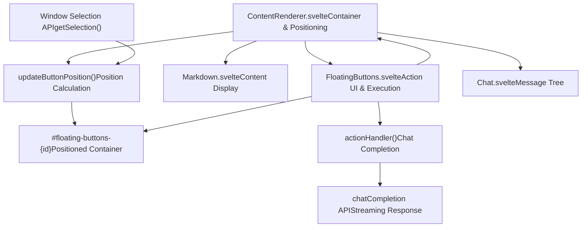
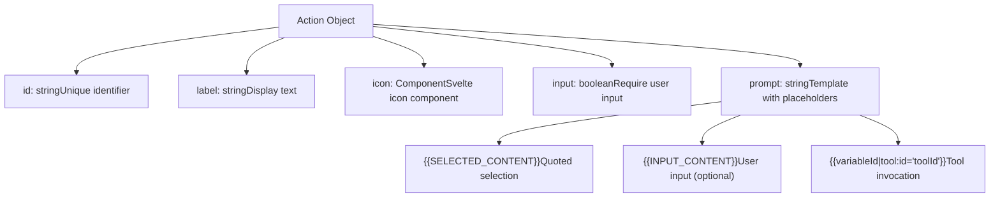
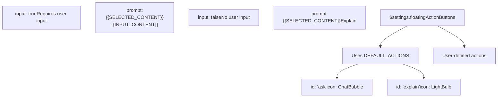
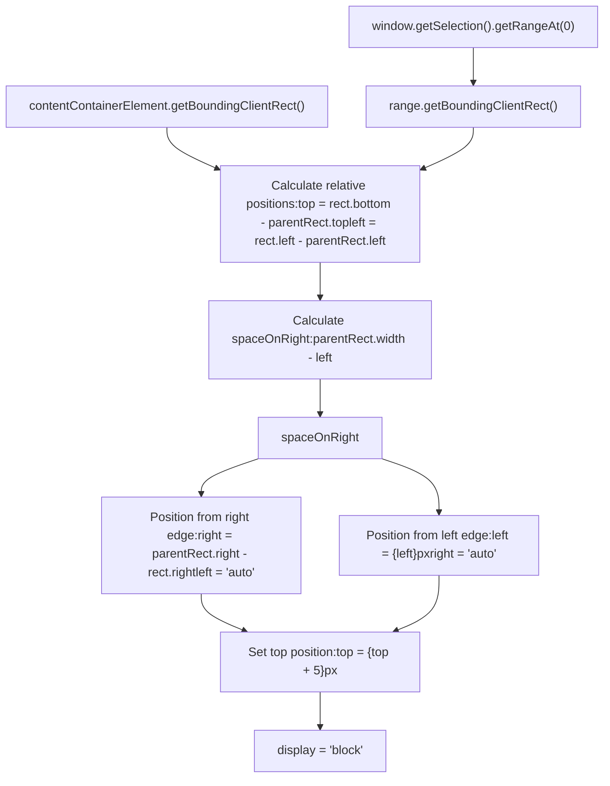
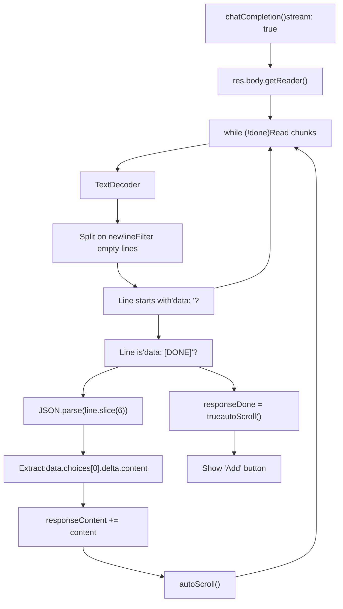
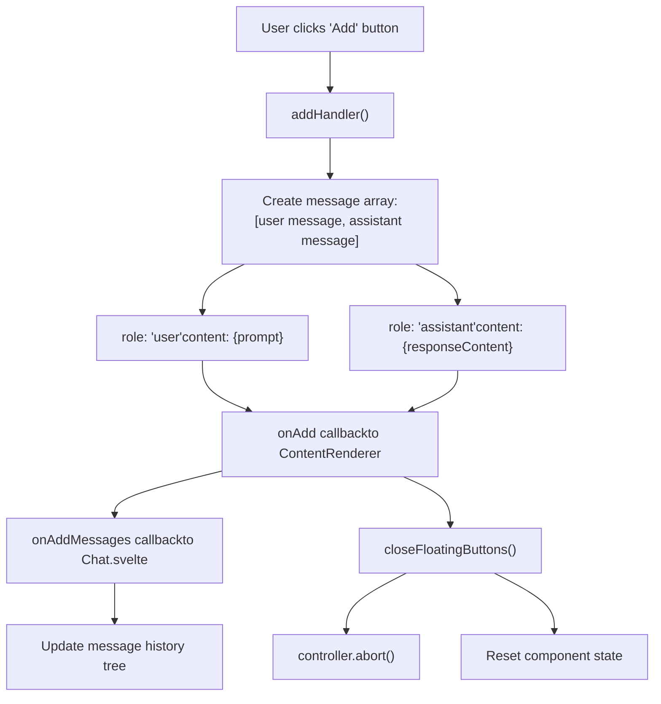
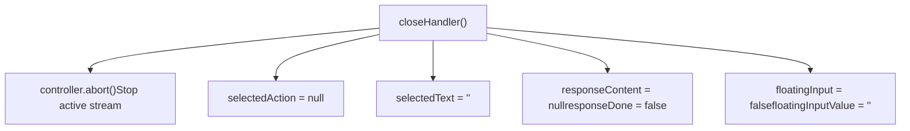

# Content Selection Actions

Relevant source files

-   [src/lib/components/chat/ContentRenderer/FloatingButtons.svelte](https://github.com/open-webui/open-webui/blob/a7271532/src/lib/components/chat/ContentRenderer/FloatingButtons.svelte)
-   [src/lib/components/chat/Messages/CodeBlock.svelte](https://github.com/open-webui/open-webui/blob/a7271532/src/lib/components/chat/Messages/CodeBlock.svelte)
-   [src/lib/components/chat/Messages/ContentRenderer.svelte](https://github.com/open-webui/open-webui/blob/a7271532/src/lib/components/chat/Messages/ContentRenderer.svelte)
-   [src/lib/components/chat/Messages/Markdown.svelte](https://github.com/open-webui/open-webui/blob/a7271532/src/lib/components/chat/Messages/Markdown.svelte)
-   [src/lib/components/chat/Messages/Markdown/AlertRenderer.svelte](https://github.com/open-webui/open-webui/blob/a7271532/src/lib/components/chat/Messages/Markdown/AlertRenderer.svelte)
-   [src/lib/components/chat/Messages/Markdown/MarkdownTokens.svelte](https://github.com/open-webui/open-webui/blob/a7271532/src/lib/components/chat/Messages/Markdown/MarkdownTokens.svelte)
-   [src/lib/components/chat/Messages/Message.svelte](https://github.com/open-webui/open-webui/blob/a7271532/src/lib/components/chat/Messages/Message.svelte)
-   [src/lib/components/chat/Messages/MultiResponseMessages.svelte](https://github.com/open-webui/open-webui/blob/a7271532/src/lib/components/chat/Messages/MultiResponseMessages.svelte)
-   [src/lib/utils/marked/strikethrough-extension.ts](https://github.com/open-webui/open-webui/blob/a7271532/src/lib/utils/marked/strikethrough-extension.ts)
-   [src/lib/workers/pyodide.worker.ts](https://github.com/open-webui/open-webui/blob/a7271532/src/lib/workers/pyodide.worker.ts)

## Purpose and Scope

The Content Selection Actions system provides contextual interaction capabilities when users select text within AI response messages. When text is highlighted, a floating toolbar appears offering actions like "Ask" (for follow-up questions) and "Explain" (for clarification). These actions trigger new AI completions with the selected text as context, displaying results in an inline preview before optionally adding them to the conversation history.

This document covers the `FloatingButtons` component and its integration with the content rendering pipeline. For information about the overall message rendering system, see [Message Content Rendering](/open-webui/open-webui/4-chat-system). For chat completion processing, see [Chat Request Processing](/open-webui/open-webui/5.1-response-message-component).

## System Architecture

The Content Selection Actions system consists of two primary components that work together to provide contextual interactions:

### Component Integration Diagram


**Sources:**

-   [src/lib/components/chat/ContentRenderer/FloatingButtons.svelte1-365](https://github.com/open-webui/open-webui/blob/a7271532/src/lib/components/chat/ContentRenderer/FloatingButtons.svelte#L1-L365)
-   [src/lib/components/chat/Messages/ContentRenderer.svelte1-223](https://github.com/open-webui/open-webui/blob/a7271532/src/lib/components/chat/Messages/ContentRenderer.svelte#L1-L223)

### Component Responsibilities

| Component | File | Primary Responsibilities |
| --- | --- | --- |
| `ContentRenderer` | `ContentRenderer.svelte` | \- Selection detection via mouseup events
\- Positioning calculation for floating UI
\- Event handler registration/cleanup
\- Integration with Chat component |
| `FloatingButtons` | `FloatingButtons.svelte` | \- Action button rendering
\- Optional input field for parameterized actions
\- Chat completion execution
\- Response streaming and display
\- Result message creation |

**Sources:**

-   [src/lib/components/chat/Messages/ContentRenderer.svelte1-223](https://github.com/open-webui/open-webui/blob/a7271532/src/lib/components/chat/Messages/ContentRenderer.svelte#L1-L223)
-   [src/lib/components/chat/ContentRenderer/FloatingButtons.svelte1-365](https://github.com/open-webui/open-webui/blob/a7271532/src/lib/components/chat/ContentRenderer/FloatingButtons.svelte#L1-L365)

## Action Definition System

Actions are defined as objects with a specific schema that controls their behavior and appearance. The system supports both default actions and custom user-defined actions.

### Action Schema


**Sources:**

-   [src/lib/components/chat/ContentRenderer/FloatingButtons.svelte41-55](https://github.com/open-webui/open-webui/blob/a7271532/src/lib/components/chat/ContentRenderer/FloatingButtons.svelte#L41-L55)

### Default Actions

The system provides two built-in actions defined in `DEFAULT_ACTIONS`:


**Implementation details:**

-   Default actions defined at [src/lib/components/chat/ContentRenderer/FloatingButtons.svelte41-55](https://github.com/open-webui/open-webui/blob/a7271532/src/lib/components/chat/ContentRenderer/FloatingButtons.svelte#L41-L55)
-   Action list resolved via reactive statement: `$: if (actions.length === 0) { actions = DEFAULT_ACTIONS; }` at [line 37-39](https://github.com/open-webui/open-webui/blob/a7271532/line 37-39)
-   Icons imported: `ChatBubble` and `LightBulb` at [lines 12-13](https://github.com/open-webui/open-webui/blob/a7271532/lines 12-13)

**Sources:**

-   [src/lib/components/chat/ContentRenderer/FloatingButtons.svelte37-55](https://github.com/open-webui/open-webui/blob/a7271532/src/lib/components/chat/ContentRenderer/FloatingButtons.svelte#L37-L55)

## Selection Detection and Positioning

The `ContentRenderer` component manages the lifecycle of detecting text selection and positioning the floating buttons UI.

### Event Flow Diagram

> **[Mermaid sequence]**
> *(图表结构无法解析)*

**Sources:**

-   [src/lib/components/chat/Messages/ContentRenderer.svelte46-95](https://github.com/open-webui/open-webui/blob/a7271532/src/lib/components/chat/Messages/ContentRenderer.svelte#L46-L95)

### Position Calculation Logic

The positioning algorithm ensures the floating buttons appear near the selected text while remaining within viewport bounds:


**Key positioning logic:**

-   Mobile/desktop threshold calculated as `$mobile ? window.innerWidth / 2 : window.innerWidth / 3` at [src/lib/components/chat/Messages/ContentRenderer.svelte78](https://github.com/open-webui/open-webui/blob/a7271532/src/lib/components/chat/Messages/ContentRenderer.svelte#L78-L78)
-   Conditional right-alignment when insufficient space at [lines 80-88](https://github.com/open-webui/open-webui/blob/a7271532/lines 80-88)
-   5px spacing offset added to top position at [line 89](https://github.com/open-webui/open-webui/blob/a7271532/line 89)

**Sources:**

-   [src/lib/components/chat/Messages/ContentRenderer.svelte61-90](https://github.com/open-webui/open-webui/blob/a7271532/src/lib/components/chat/Messages/ContentRenderer.svelte#L61-L90)

## Action Execution Flow

When a user clicks an action button, the system processes the prompt template, executes a chat completion, and displays the streamed response.

### Execution Sequence Diagram

> **[Mermaid sequence]**
> *(图表结构无法解析)*

**Sources:**

-   [src/lib/components/chat/ContentRenderer/FloatingButtons.svelte70-204](https://github.com/open-webui/open-webui/blob/a7271532/src/lib/components/chat/ContentRenderer/FloatingButtons.svelte#L70-L204)

### Prompt Template Processing

The `actionHandler` function processes template placeholders in a specific order:

**Processing Pipeline:**

1.  **Tool ID Extraction** ([lines 92-106](https://github.com/open-webui/open-webui/blob/a7271532/lines 92-106)):

    -   Pattern: `{{variableId|tool:id="toolId"}}` extracts tool IDs and replaces with variableId
    -   Legacy pattern: `{{TOOL:toolId}}` (backward compatibility)
    -   Extracted tool IDs passed to chat completion as `tool_ids` parameter
2.  **Input Content Replacement** ([lines 108-111](https://github.com/open-webui/open-webui/blob/a7271532/lines 108-111)):

    -   If action has `input: true` and prompt contains `{{INPUT_CONTENT}}`
    -   Replaced with `floatingInputValue` from user input field
3.  **Selected Content Replacement** ([lines 113-114](https://github.com/open-webui/open-webui/blob/a7271532/lines 113-114)):

    -   `{{CONTENT}}`: Raw selected text
    -   `{{SELECTED_CONTENT}}`: Text with each line prefixed by `>` (markdown quote format)
    -   Quote formatting applied at [lines 76-79](https://github.com/open-webui/open-webui/blob/a7271532/lines 76-79)

**Sources:**

-   [src/lib/components/chat/ContentRenderer/FloatingButtons.svelte70-114](https://github.com/open-webui/open-webui/blob/a7271532/src/lib/components/chat/ContentRenderer/FloatingButtons.svelte#L70-L114)
-   [src/lib/components/chat/ContentRenderer/FloatingButtons.svelte76-79](https://github.com/open-webui/open-webui/blob/a7271532/src/lib/components/chat/ContentRenderer/FloatingButtons.svelte#L76-L79)

## Response Streaming and Display

The system uses Server-Sent Events (SSE) to stream AI responses incrementally, providing real-time feedback.

### Stream Processing Flow


**Implementation details:**

-   Stream reader initialized at [src/lib/components/chat/ContentRenderer/FloatingButtons.svelte148](https://github.com/open-webui/open-webui/blob/a7271532/src/lib/components/chat/ContentRenderer/FloatingButtons.svelte#L148-L148)
-   Line-by-line processing loop at [lines 151-191](https://github.com/open-webui/open-webui/blob/a7271532/lines 151-191)
-   Content extraction from delta at [lines 179-183](https://github.com/open-webui/open-webui/blob/a7271532/lines 179-183)
-   Auto-scroll logic at [lines 57-68](https://github.com/open-webui/open-webui/blob/a7271532/lines 57-68) ensures response container scrolls to bottom if already near bottom (within 50px buffer)

**Sources:**

-   [src/lib/components/chat/ContentRenderer/FloatingButtons.svelte119-204](https://github.com/open-webui/open-webui/blob/a7271532/src/lib/components/chat/ContentRenderer/FloatingButtons.svelte#L119-L204)
-   [src/lib/components/chat/ContentRenderer/FloatingButtons.svelte57-68](https://github.com/open-webui/open-webui/blob/a7271532/src/lib/components/chat/ContentRenderer/FloatingButtons.svelte#L57-L68)

### UI State Transitions

The `FloatingButtons` component renders different UI states based on execution progress:

| State | Condition | Rendered UI |
| --- | --- | --- |
| **Action Selection** | `responseContent === null && !floatingInput` | Action buttons with icons and labels |
| **Input Mode** | `responseContent === null && floatingInput` | Rounded input field with submit button |
| **Response Streaming** | `responseContent !== null` | Response container with Markdown rendering |
| **Response Complete** | `responseContent !== null && responseDone` | Response container + "Add" button |

**Conditional rendering logic:**

-   Top-level condition at [src/lib/components/chat/ContentRenderer/FloatingButtons.svelte250](https://github.com/open-webui/open-webui/blob/a7271532/src/lib/components/chat/ContentRenderer/FloatingButtons.svelte#L250-L250)
-   Input field rendering at [lines 285-326](https://github.com/open-webui/open-webui/blob/a7271532/lines 285-326)
-   Response container at [lines 327-363](https://github.com/open-webui/open-webui/blob/a7271532/lines 327-363)
-   "Add" button shown when `responseDone` at [lines 350-359](https://github.com/open-webui/open-webui/blob/a7271532/lines 350-359)

**Sources:**

-   [src/lib/components/chat/ContentRenderer/FloatingButtons.svelte250-363](https://github.com/open-webui/open-webui/blob/a7271532/src/lib/components/chat/ContentRenderer/FloatingButtons.svelte#L250-L363)

## Message Integration

When the user clicks the "Add" button after receiving a response, the system creates new messages and integrates them into the chat history tree.

### Add Handler Flow


**Message structure created:**

```
const messages = [
  {
    role: 'user',
    content: content  // The final prompt with replaced placeholders
  },
  {
    role: 'assistant',
    content: responseContent  // The streamed AI response
  }
];
```
**Callback chain:**

1.  `addHandler()` creates messages at [src/lib/components/chat/ContentRenderer/FloatingButtons.svelte206-223](https://github.com/open-webui/open-webui/blob/a7271532/src/lib/components/chat/ContentRenderer/FloatingButtons.svelte#L206-L223)
2.  Calls `onAdd({ modelId, parentId, messages })` at [lines 218-222](https://github.com/open-webui/open-webui/blob/a7271532/lines 218-222)
3.  `ContentRenderer` receives callback and calls `onAddMessages` at [src/lib/components/chat/Messages/ContentRenderer.svelte216-220](https://github.com/open-webui/open-webui/blob/a7271532/src/lib/components/chat/Messages/ContentRenderer.svelte#L216-L220)
4.  `Chat.svelte` receives the callback and adds messages to the history tree (not shown in provided files)
5.  `closeFloatingButtons()` resets state at [src/lib/components/chat/Messages/ContentRenderer.svelte219](https://github.com/open-webui/open-webui/blob/a7271532/src/lib/components/chat/Messages/ContentRenderer.svelte#L219-L219)

**Sources:**

-   [src/lib/components/chat/ContentRenderer/FloatingButtons.svelte206-223](https://github.com/open-webui/open-webui/blob/a7271532/src/lib/components/chat/ContentRenderer/FloatingButtons.svelte#L206-L223)
-   [src/lib/components/chat/Messages/ContentRenderer.svelte216-220](https://github.com/open-webui/open-webui/blob/a7271532/src/lib/components/chat/Messages/ContentRenderer.svelte#L216-L220)
-   [src/lib/components/chat/ContentRenderer/FloatingButtons.svelte225-236](https://github.com/open-webui/open-webui/blob/a7271532/src/lib/components/chat/ContentRenderer/FloatingButtons.svelte#L225-L236)

### State Cleanup

The `closeHandler()` function (exposed for parent component access) performs cleanup:


**Called from:**

-   Parent `ContentRenderer` when closing buttons at [src/lib/components/chat/Messages/ContentRenderer.svelte106-109](https://github.com/open-webui/open-webui/blob/a7271532/src/lib/components/chat/Messages/ContentRenderer.svelte#L106-L109)
-   When Escape key pressed at [lines 113-116](https://github.com/open-webui/open-webui/blob/a7271532/lines 113-116)
-   Component destroy lifecycle at [src/lib/components/chat/ContentRenderer/FloatingButtons.svelte238-242](https://github.com/open-webui/open-webui/blob/a7271532/src/lib/components/chat/ContentRenderer/FloatingButtons.svelte#L238-L242)

**Sources:**

-   [src/lib/components/chat/ContentRenderer/FloatingButtons.svelte225-236](https://github.com/open-webui/open-webui/blob/a7271532/src/lib/components/chat/ContentRenderer/FloatingButtons.svelte#L225-L236)
-   [src/lib/components/chat/Messages/ContentRenderer.svelte97-117](https://github.com/open-webui/open-webui/blob/a7271532/src/lib/components/chat/Messages/ContentRenderer.svelte#L97-L117)

## Configuration and Settings

The floating buttons feature is controlled by user settings stored in the `$settings` store.

### Settings Integration

| Setting Key | Type | Default | Purpose |
| --- | --- | --- | --- |
| `floatingActionButtons` | `Array<Action>` | `[]` (uses `DEFAULT_ACTIONS`) | Custom action definitions |
| `detectArtifacts` | `boolean` | `true` | Auto-show artifacts panel for HTML/SVG (affects ContentRenderer behavior) |

**Settings access:**

-   Actions resolved from settings at [src/lib/components/chat/ContentRenderer/FloatingButtons.svelte37-39](https://github.com/open-webui/open-webui/blob/a7271532/src/lib/components/chat/ContentRenderer/FloatingButtons.svelte#L37-L39)
-   Passed to `FloatingButtons` from `ContentRenderer` at [src/lib/components/chat/Messages/ContentRenderer.svelte209](https://github.com/open-webui/open-webui/blob/a7271532/src/lib/components/chat/Messages/ContentRenderer.svelte#L209-L209)
-   Settings imported from `$lib/stores` at [line 15](https://github.com/open-webui/open-webui/blob/a7271532/line 15)

**Conditional rendering:**

The entire floating buttons system can be disabled by setting the `floatingButtons` prop to `false` on `ContentRenderer`:

```
{#if floatingButtons && model}
  <FloatingButtons ... />
{/if}
```
Located at [src/lib/components/chat/Messages/ContentRenderer.svelte204-222](https://github.com/open-webui/open-webui/blob/a7271532/src/lib/components/chat/Messages/ContentRenderer.svelte#L204-L222)

**Sources:**

-   [src/lib/components/chat/ContentRenderer/FloatingButtons.svelte37-39](https://github.com/open-webui/open-webui/blob/a7271532/src/lib/components/chat/ContentRenderer/FloatingButtons.svelte#L37-L39)
-   [src/lib/components/chat/Messages/ContentRenderer.svelte204-222](https://github.com/open-webui/open-webui/blob/a7271532/src/lib/components/chat/Messages/ContentRenderer.svelte#L204-L222)
-   [src/lib/components/chat/Messages/ContentRenderer.svelte9-15](https://github.com/open-webui/open-webui/blob/a7271532/src/lib/components/chat/Messages/ContentRenderer.svelte#L9-L15)
