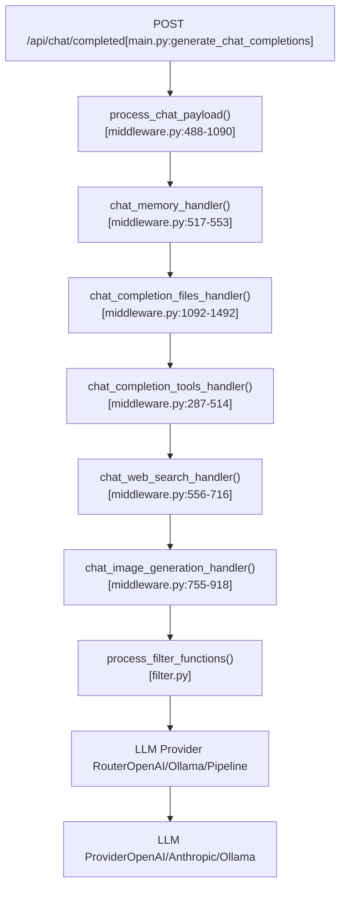
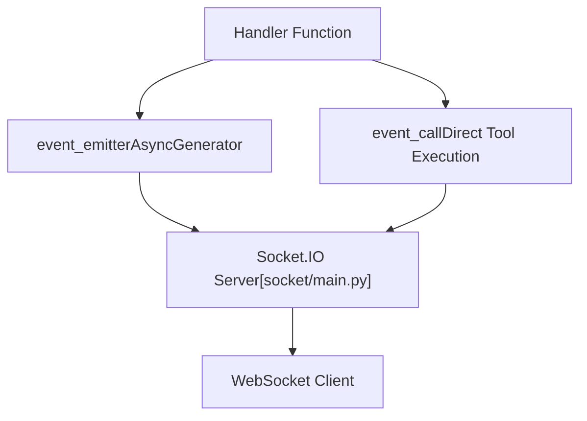
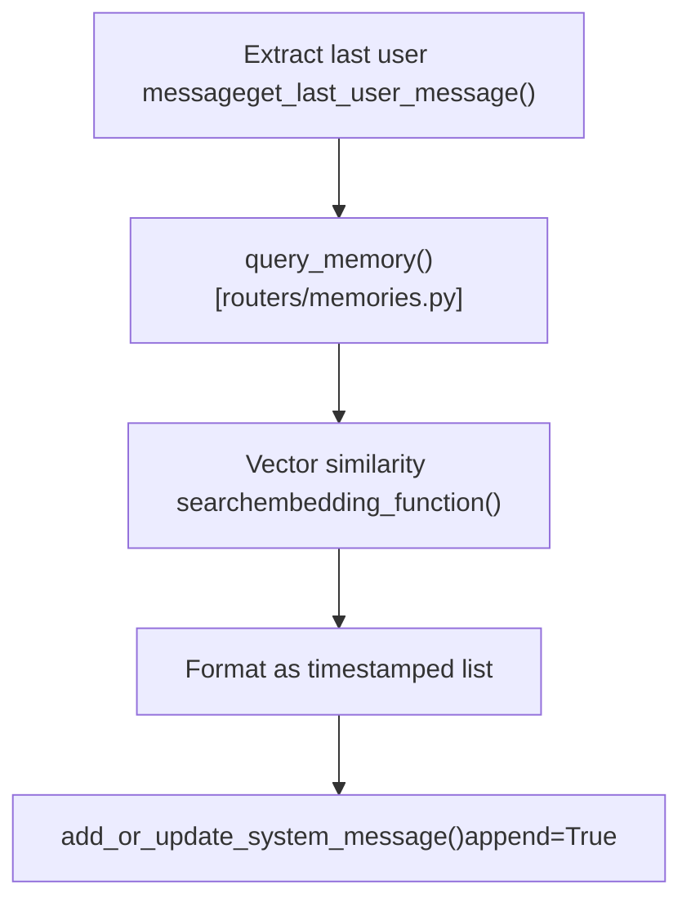
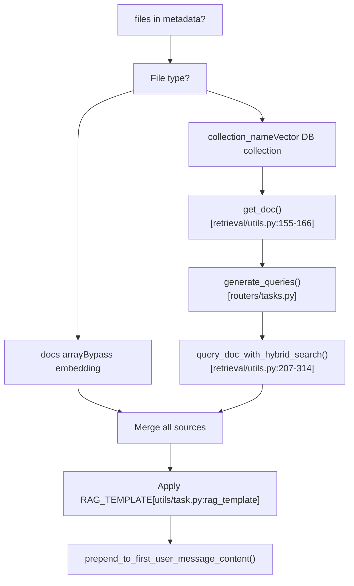
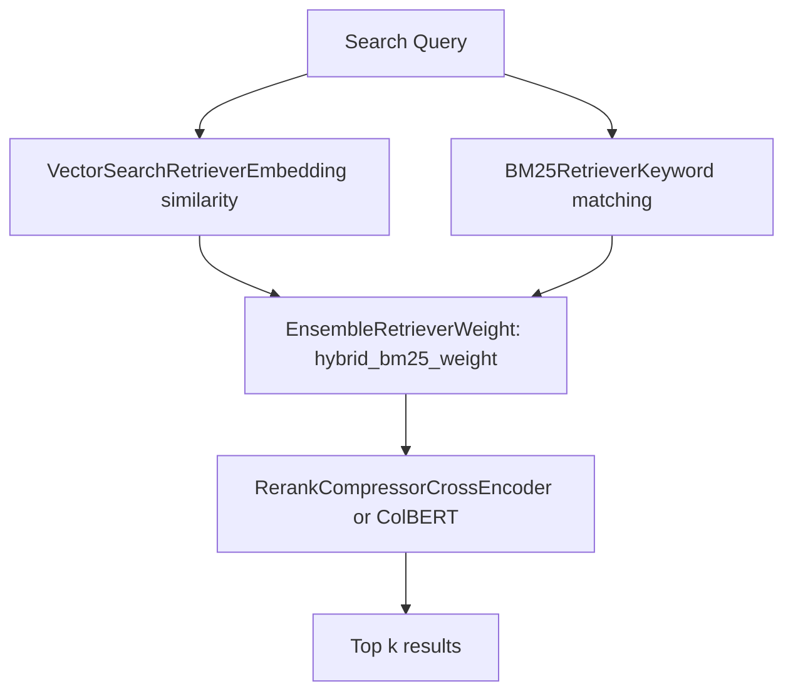
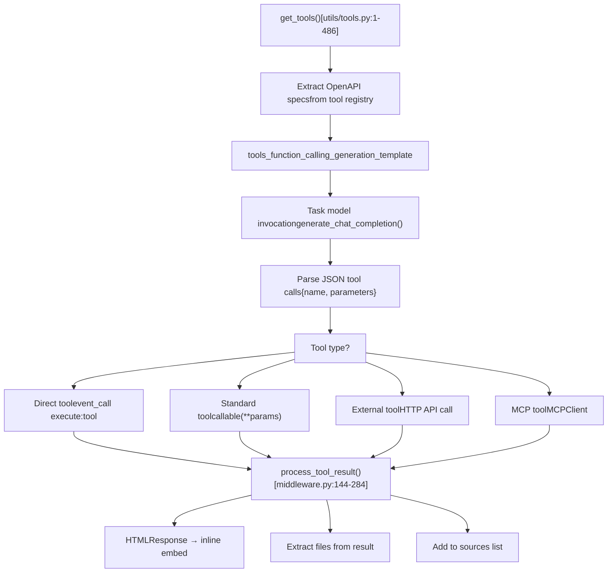
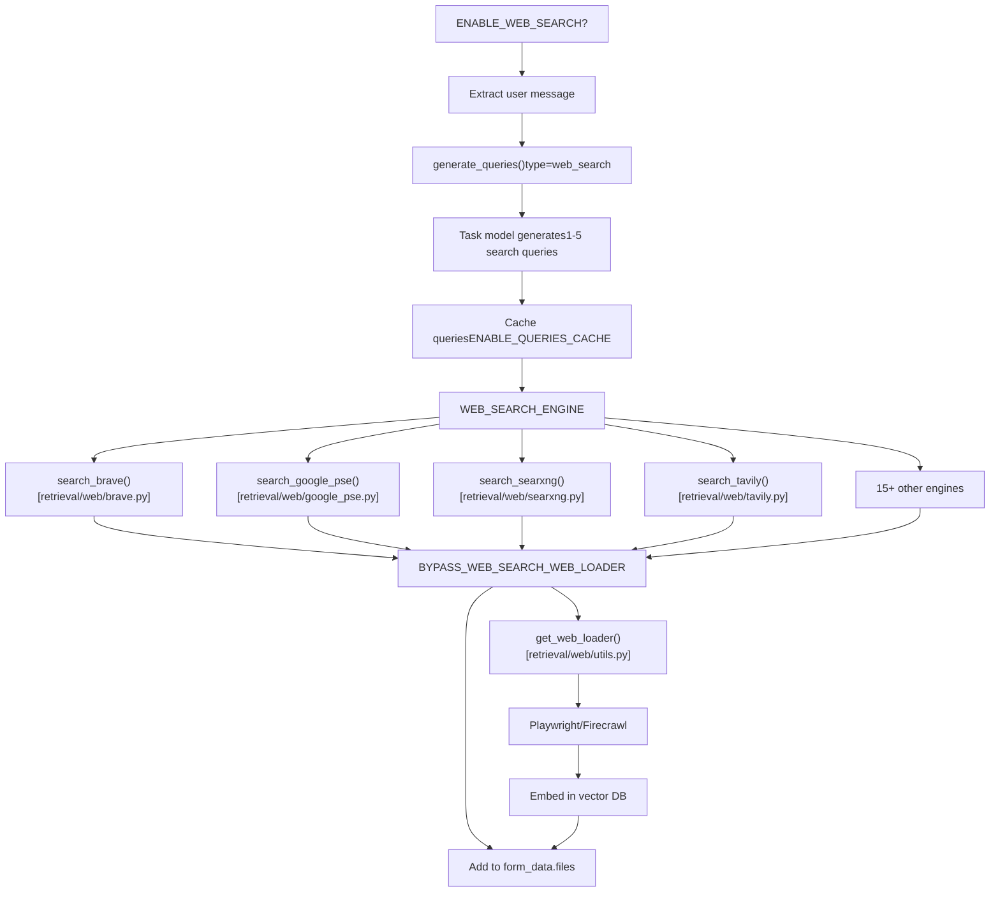
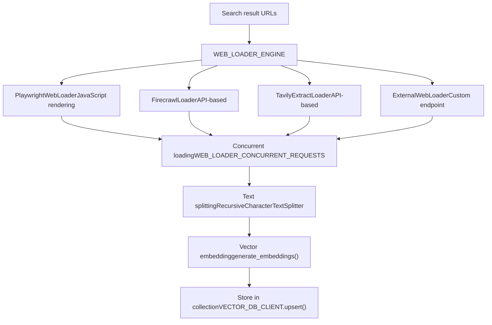
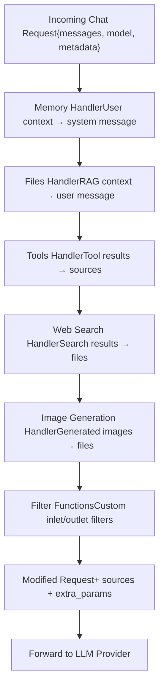
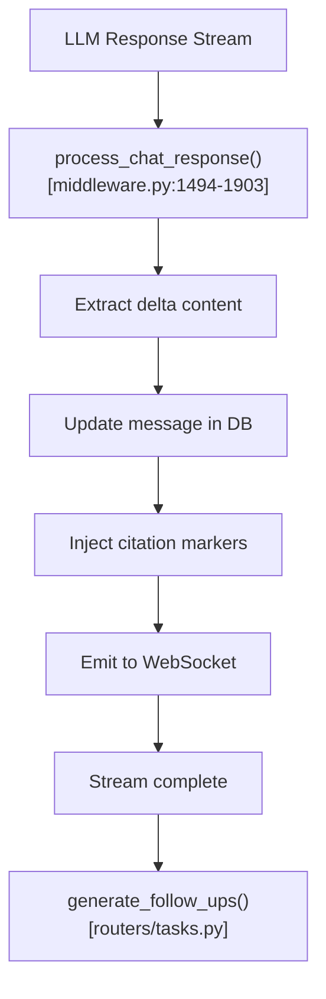

# Backend Processing Pipeline

Relevant source files

-   [backend/open\_webui/config.py](https://github.com/open-webui/open-webui/blob/a7271532/backend/open_webui/config.py)
-   [backend/open\_webui/main.py](https://github.com/open-webui/open-webui/blob/a7271532/backend/open_webui/main.py)
-   [backend/open\_webui/retrieval/loaders/datalab\_marker.py](https://github.com/open-webui/open-webui/blob/a7271532/backend/open_webui/retrieval/loaders/datalab_marker.py)
-   [backend/open\_webui/retrieval/loaders/external\_document.py](https://github.com/open-webui/open-webui/blob/a7271532/backend/open_webui/retrieval/loaders/external_document.py)
-   [backend/open\_webui/retrieval/loaders/external\_web.py](https://github.com/open-webui/open-webui/blob/a7271532/backend/open_webui/retrieval/loaders/external_web.py)
-   [backend/open\_webui/retrieval/loaders/main.py](https://github.com/open-webui/open-webui/blob/a7271532/backend/open_webui/retrieval/loaders/main.py)
-   [backend/open\_webui/retrieval/loaders/mineru.py](https://github.com/open-webui/open-webui/blob/a7271532/backend/open_webui/retrieval/loaders/mineru.py)
-   [backend/open\_webui/retrieval/loaders/mistral.py](https://github.com/open-webui/open-webui/blob/a7271532/backend/open_webui/retrieval/loaders/mistral.py)
-   [backend/open\_webui/retrieval/utils.py](https://github.com/open-webui/open-webui/blob/a7271532/backend/open_webui/retrieval/utils.py)
-   [backend/open\_webui/routers/retrieval.py](https://github.com/open-webui/open-webui/blob/a7271532/backend/open_webui/routers/retrieval.py)
-   [backend/open\_webui/utils/middleware.py](https://github.com/open-webui/open-webui/blob/a7271532/backend/open_webui/utils/middleware.py)
-   [src/lib/apis/retrieval/index.ts](https://github.com/open-webui/open-webui/blob/a7271532/src/lib/apis/retrieval/index.ts)
-   [src/lib/components/admin/Settings/Documents.svelte](https://github.com/open-webui/open-webui/blob/a7271532/src/lib/components/admin/Settings/Documents.svelte)
-   [src/lib/components/admin/Settings/WebSearch.svelte](https://github.com/open-webui/open-webui/blob/a7271532/src/lib/components/admin/Settings/WebSearch.svelte)

This document describes the backend middleware system that intercepts and augments chat completion requests before they reach LLM providers. The pipeline enables features like Retrieval Augmented Generation (RAG), tool execution, web search, and user memory by injecting additional context into prompts.

For information about the frontend chat system that initiates these requests, see [Chat System](/open-webui/open-webui/3-installation-and-deployment). For details on the RAG document processing and vector storage subsystems, see [RAG and Knowledge System](/open-webui/open-webui/6-backend-processing-pipeline). For LLM provider integration and routing, see [Model Management](/open-webui/open-webui/11-configuration-management).

## Pipeline Overview

The backend processing pipeline is implemented as a middleware layer that sits between the chat API endpoint and the LLM provider proxy routers. When a chat completion request is received, it passes through multiple handler functions that can modify the request payload before forwarding it to the LLM.

### Request Flow Architecture


**Sources:** [backend/open\_webui/utils/middleware.py488-1090](https://github.com/open-webui/open-webui/blob/a7271532/backend/open_webui/utils/middleware.py#L488-L1090) [backend/open\_webui/main.py1-2826](https://github.com/open-webui/open-webui/blob/a7271532/backend/open_webui/main.py#L1-L2826)

### Handler Execution Control

Each handler is conditionally invoked based on configuration flags, user permissions, and request metadata. The pipeline supports early termination if a handler generates a response directly (e.g., image generation).

| Handler | Configuration Flag | Trigger Condition |
| --- | --- | --- |
| Memory | Always enabled | User has memory permission |
| Files (RAG) | N/A | `files` present in request metadata |
| Tools | `ENABLE_RAG_WEB_LOADER_SSL_VERIFICATION` | `tool_ids` present in request body |
| Web Search | `ENABLE_WEB_SEARCH` | Web search enabled for model |
| Image Generation | `ENABLE_IMAGE_GENERATION` | Request tagged with image generation |
| Filters | N/A | User has filters assigned |

**Sources:** [backend/open\_webui/utils/middleware.py488-1090](https://github.com/open-webui/open-webui/blob/a7271532/backend/open_webui/utils/middleware.py#L488-L1090) [backend/open\_webui/config.py1-3533](https://github.com/open-webui/open-webui/blob/a7271532/backend/open_webui/config.py#L1-L3533)

## Entry Point: process\_chat\_payload

The `process_chat_payload` function in [backend/open\_webui/utils/middleware.py488-1090](https://github.com/open-webui/open-webui/blob/a7271532/backend/open_webui/utils/middleware.py#L488-L1090) is the central orchestrator of the processing pipeline. It receives the chat completion request, user context, and application state, then sequentially invokes handlers.

### Function Signature and Key Parameters

```
async def process_chat_payload(
    request: Request,
    form_data: dict,
    user: UserModel,
    metadata: dict
) -> tuple[dict, dict]
```
**Key Parameters:**

-   `form_data`: The chat completion request body containing `messages`, `model`, and optional `metadata`
-   `user`: The authenticated user making the request
-   `metadata`: Request metadata including `chat_id`, `message_id`, `session_id`, and feature flags
-   Returns: Tuple of `(modified_form_data, extra_params)` where extra\_params contains `sources` and other handler outputs

**Sources:** [backend/open\_webui/utils/middleware.py488-550](https://github.com/open-webui/open-webui/blob/a7271532/backend/open_webui/utils/middleware.py#L488-L550)

### Event Emitter and Caller Pattern

The pipeline uses an event-driven architecture to stream status updates and results back to the client in real-time:


The `__event_emitter__` is passed to all handlers and allows them to send events:

```
await event_emitter({
    "type": "status",
    "data": {
        "action": "web_search",
        "description": "Searching the web",
        "done": False
    }
})
```
**Sources:** [backend/open\_webui/utils/middleware.py559-569](https://github.com/open-webui/open-webui/blob/a7271532/backend/open_webui/utils/middleware.py#L559-L569) [backend/open\_webui/socket/main.py1-1167](https://github.com/open-webui/open-webui/blob/a7271532/backend/open_webui/socket/main.py#L1-L1167)

## Memory Handler: User Context Injection

The `chat_memory_handler` function retrieves relevant past context from the user's memory store and injects it into the system message. This occurs before all other handlers to provide consistent background context.

### Memory Retrieval Process


**Memory Context Format:**

```
User Context:
1. [2024-01-15] User prefers Python for scripting tasks
2. [2024-01-20] Working on a machine learning project using PyTorch
3. [2024-02-01] Uses VS Code as primary editor
```
The handler queries up to `k=3` most relevant memory documents based on semantic similarity to the current user message. Each memory entry includes a creation timestamp for temporal context.

**Sources:** [backend/open\_webui/utils/middleware.py517-553](https://github.com/open-webui/open-webui/blob/a7271532/backend/open_webui/utils/middleware.py#L517-L553) [backend/open\_webui/routers/memories.py1-338](https://github.com/open-webui/open-webui/blob/a7271532/backend/open_webui/routers/memories.py#L1-L338)

## Files Handler: RAG Integration

The files handler implements Retrieval Augmented Generation by processing attached documents, extracting relevant chunks, and injecting them into the prompt. This is the most complex handler in the pipeline.

### Document Processing Flow


**Sources:** [backend/open\_webui/utils/middleware.py1092-1492](https://github.com/open-webui/open-webui/blob/a7271532/backend/open_webui/utils/middleware.py#L1092-L1492) [backend/open\_webui/retrieval/utils.py1-879](https://github.com/open-webui/open-webui/blob/a7271532/backend/open_webui/retrieval/utils.py#L1-L879)

### Query Generation

For files stored in vector databases, the system generates multiple optimized search queries from the user's message using the task model:

```
queries = await generate_queries(
    request,
    {
        "model": form_data["model"],
        "messages": messages,
        "prompt": user_message,
        "type": "retrieval"
    },
    user
)
```
The task model analyzes the conversation history and generates 1-5 search queries that capture different aspects of the information need. This improves retrieval quality compared to using the raw user message.

**Sources:** [backend/open\_webui/utils/middleware.py1142-1180](https://github.com/open-webui/open-webui/blob/a7271532/backend/open_webui/utils/middleware.py#L1142-L1180) [backend/open\_webui/routers/tasks.py1-1215](https://github.com/open-webui/open-webui/blob/a7271532/backend/open_webui/routers/tasks.py#L1-L1215)

### Hybrid Search and Reranking

Document retrieval combines vector similarity search with BM25 keyword matching:


**Configuration Parameters:**

-   `TOP_K`: Number of documents to retrieve (default: 4)
-   `TOP_K_RERANKER`: Number to rerank before selecting top k (default: 4)
-   `RELEVANCE_THRESHOLD`: Minimum similarity score (0.0-1.0)
-   `HYBRID_BM25_WEIGHT`: Balance between BM25 and vector search (0.0-1.0)

**Sources:** [backend/open\_webui/retrieval/utils.py207-314](https://github.com/open-webui/open-webui/blob/a7271532/backend/open_webui/retrieval/utils.py#L207-L314) [backend/open\_webui/config.py832-835](https://github.com/open-webui/open-webui/blob/a7271532/backend/open_webui/config.py#L832-L835)

### RAG Context Injection

Retrieved documents are formatted using a configurable template and injected into the first user message:

```
context_string = rag_template(
    template=request.app.state.config.RAG_TEMPLATE,
    context="\n\n".join(docs),
    query=user_message
)
```
**Default RAG Template:**

```
Use the following context as your learned knowledge:
[context]

Query: [query]

Based on the above context, provide a response to the query.
```
The context is prepended to the user's message content while sources are tracked separately for citation display in the UI.

**Sources:** [backend/open\_webui/utils/middleware.py1336-1370](https://github.com/open-webui/open-webui/blob/a7271532/backend/open_webui/utils/middleware.py#L1336-L1370) [backend/open\_webui/utils/task.py1-274](https://github.com/open-webui/open-webui/blob/a7271532/backend/open_webui/utils/task.py#L1-L274)

## Tools Handler: Function Calling

The tools handler implements a two-phase execution model: first, a task model generates structured tool calls from available specifications; second, the system executes those calls and formats results for the LLM.

### Tool Execution Architecture


**Sources:** [backend/open\_webui/utils/middleware.py287-514](https://github.com/open-webui/open-webui/blob/a7271532/backend/open_webui/utils/middleware.py#L287-L514) [backend/open\_webui/utils/tools.py1-486](https://github.com/open-webui/open-webui/blob/a7271532/backend/open_webui/utils/tools.py#L1-L486)

### Tool Call Generation Prompt

The system sends a specialized prompt to the task model with all available tool specifications:

```
prompt = tools_function_calling_generation_template(
    template=TOOLS_FUNCTION_CALLING_PROMPT_TEMPLATE,
    tools_specs=json.dumps(specs)
)

payload = {
    "model": task_model_id,
    "messages": [
        {"role": "system", "content": prompt},
        {"role": "user", "content": user_message}
    ],
    "stream": False,
    "metadata": {"task": str(TASKS.FUNCTION_CALLING)}
}
```
The task model responds with structured JSON containing tool calls:

```
{
  "tool_calls": [
    {
      "name": "get_weather",
      "parameters": {
        "location": "San Francisco",
        "units": "celsius"
      }
    }
  ]
}
```
**Sources:** [backend/open\_webui/utils/middleware.py303-366](https://github.com/open-webui/open-webui/blob/a7271532/backend/open_webui/utils/middleware.py#L303-L366) [backend/open\_webui/utils/task.py78-99](https://github.com/open-webui/open-webui/blob/a7271532/backend/open_webui/utils/task.py#L78-L99)

### Tool Types and Execution

The system supports four tool types, each with different execution mechanisms:

| Tool Type | Execution Method | Use Case |
| --- | --- | --- |
| Standard | In-process callable | Python functions loaded as plugins |
| Direct | Event-based via Socket.IO | Browser-side tools, UI interactions |
| External (OpenAPI) | HTTP requests | REST API tool servers |
| MCP | Model Context Protocol | Structured tool servers |

**Standard Tool Execution:**

```
tool_function = tool["callable"]
tool_result = await tool_function(**tool_function_params)
```
**Direct Tool Execution:**

```
tool_result = await event_caller({
    "type": "execute:tool",
    "data": {
        "id": str(uuid4()),
        "name": tool_function_name,
        "params": tool_function_params,
        "server": tool.get("server", {}),
        "session_id": metadata.get("session_id")
    }
})
```
**Sources:** [backend/open\_webui/utils/middleware.py389-426](https://github.com/open-webui/open-webui/blob/a7271532/backend/open_webui/utils/middleware.py#L389-L426) [backend/open\_webui/utils/tools.py220-486](https://github.com/open-webui/open-webui/blob/a7271532/backend/open_webui/utils/tools.py#L220-L486)

### Tool Result Processing

Tool results undergo transformation before being added to sources:

1.  **HTML Response Handling:** If the tool returns an `HTMLResponse` with `Content-Disposition: inline`, the HTML content is extracted as an embed and a success/error message is generated
2.  **File Extraction:** Data URLs and base64 images are extracted and converted to file references
3.  **Source Building:** Results are formatted as sources with metadata for citation

```
tool_result, tool_result_files, tool_result_embeds = process_tool_result(
    request, tool_function_name, tool_result,
    tool_type, direct_tool, metadata, user
)

sources.append({
    "source": {"name": f"{tool_id}/{tool_function_name}"},
    "document": [str(tool_result)],
    "metadata": [{
        "source": f"{tool_id}/{tool_function_name}",
        "parameters": tool_function_params
    }],
    "tool_result": True
})
```
**Sources:** [backend/open\_webui/utils/middleware.py144-284](https://github.com/open-webui/open-webui/blob/a7271532/backend/open_webui/utils/middleware.py#L144-L284) [backend/open\_webui/utils/middleware.py428-486](https://github.com/open-webui/open-webui/blob/a7271532/backend/open_webui/utils/middleware.py#L428-L486)

## Web Search Handler

The web search handler generates search queries, executes searches via configured search engines, and optionally loads and embeds the full content of result pages.

### Web Search Processing Flow


**Sources:** [backend/open\_webui/utils/middleware.py556-716](https://github.com/open-webui/open-webui/blob/a7271532/backend/open_webui/utils/middleware.py#L556-L716) [backend/open\_webui/routers/retrieval.py655-1005](https://github.com/open-webui/open-webui/blob/a7271532/backend/open_webui/routers/retrieval.py#L655-L1005)

### Search Query Generation

The task model analyzes the conversation to generate optimized search queries:

```
res = await generate_queries(
    request,
    {
        "model": form_data["model"],
        "messages": messages,
        "prompt": user_message,
        "type": "web_search"
    },
    user
)

# Example response:
{
  "queries": [
    "Python web scraping best practices 2024",
    "BeautifulSoup vs Scrapy comparison",
    "legal considerations web scraping"
  ]
}
```
If query generation fails, the system falls back to using the raw user message as a single query.

**Sources:** [backend/open\_webui/utils/middleware.py575-611](https://github.com/open-webui/open-webui/blob/a7271532/backend/open_webui/utils/middleware.py#L575-L611) [backend/open\_webui/routers/tasks.py274-408](https://github.com/open-webui/open-webui/blob/a7271532/backend/open_webui/routers/tasks.py#L274-L408)

### Search Engine Support

The system supports 20+ search engines through a plugin architecture. Each engine implements a `search_*` function that returns a `SearchResult` object:

```
@dataclass
class SearchResult:
    link: str
    title: Optional[str] = None
    snippet: Optional[str] = None
```
**Supported Engines:**

-   **Commercial APIs:** Brave, Google PSE, Bing, Tavily, Kagi, Perplexity, Serper, SerpAPI
-   **Self-hosted:** SearxNG, YaCy
-   **Free/Basic:** DuckDuckGo, Mojeek
-   **External:** Custom endpoint support

**Sources:** [backend/open\_webui/retrieval/web/main.py1-21](https://github.com/open-webui/open-webui/blob/a7271532/backend/open_webui/retrieval/web/main.py#L1-L21) [backend/open\_webui/retrieval/web/brave.py1-66](https://github.com/open-webui/open-webui/blob/a7271532/backend/open_webui/retrieval/web/brave.py#L1-L66) [backend/open\_webui/retrieval/web/searxng.py1-71](https://github.com/open-webui/open-webui/blob/a7271532/backend/open_webui/retrieval/web/searxng.py#L1-L71)

### Content Loading and Embedding

When `BYPASS_WEB_SEARCH_WEB_LOADER` is disabled (default), the system loads full page content:


**Configuration:**

-   `WEB_SEARCH_CONCURRENT_REQUESTS`: Number of parallel search queries (default: 10)
-   `WEB_LOADER_CONCURRENT_REQUESTS`: Number of parallel page loads (default: 10)
-   `WEB_SEARCH_RESULT_COUNT`: Results per query (default: 3)
-   `BYPASS_WEB_SEARCH_EMBEDDING_AND_RETRIEVAL`: Skip vector DB, use raw text

**Sources:** [backend/open\_webui/routers/retrieval.py777-1005](https://github.com/open-webui/open-webui/blob/a7271532/backend/open_webui/routers/retrieval.py#L777-L1005) [backend/open\_webui/retrieval/web/utils.py1-274](https://github.com/open-webui/open-webui/blob/a7271532/backend/open_webui/retrieval/web/utils.py#L1-L274)

### File Entry Structure

Web search results are added to `form_data["files"]` in one of two formats:

**With Vector DB (default):**

```
{
    "collection_name": "web_search_uuid",
    "name": "query1, query2, query3",
    "type": "web_search",
    "urls": ["url1", "url2", "url3"],
    "queries": ["query1", "query2", "query3"]
}
```
**Bypass Mode:**

```
{
    "docs": [
        {"page_content": "...", "metadata": {...}},
        {"page_content": "...", "metadata": {...}}
    ],
    "name": "query1, query2",
    "type": "web_search",
    "urls": ["url1", "url2"],
    "queries": ["query1", "query2"]
}
```
These entries are then processed by the files handler using the same RAG pipeline as uploaded documents.

**Sources:** [backend/open\_webui/utils/middleware.py646-674](https://github.com/open-webui/open-webui/blob/a7271532/backend/open_webui/utils/middleware.py#L646-L674)

## Pipeline Integration

The complete pipeline integrates all handlers in sequence, with each handler having the opportunity to modify the request and add context:


### Extra Parameters Structure

Handlers communicate results through the `extra_params` dictionary returned from `process_chat_payload`:

```
extra_params = {
    "__event_emitter__": event_emitter,
    "__event_caller__": event_caller,
    "__metadata__": metadata,
    "sources": [
        {
            "source": {"name": "document.pdf"},
            "document": ["Retrieved text chunk..."],
            "metadata": [{"page": 1, "score": 0.95}]
        },
        {
            "source": {"name": "web_search/get_weather"},
            "document": ["Weather is sunny, 72°F"],
            "metadata": [{"source": "weather_api", "parameters": {...}}],
            "tool_result": True
        }
    ],
    "citation": True,  # Enable citation display
    "skip_files": False  # Whether RAG was bypassed
}
```
**Sources:** [backend/open\_webui/utils/middleware.py488-550](https://github.com/open-webui/open-webui/blob/a7271532/backend/open_webui/utils/middleware.py#L488-L550)

### Response Streaming and Database Updates

After the pipeline completes, the modified request is sent to the LLM provider. Responses are streamed back through the `process_chat_response` middleware which:

1.  Emits token deltas to the WebSocket client
2.  Updates the database with message content
3.  Injects source citations
4.  Handles reasoning tags for chain-of-thought models
5.  Triggers follow-up generation


**Sources:** [backend/open\_webui/utils/middleware.py1494-1903](https://github.com/open-webui/open-webui/blob/a7271532/backend/open_webui/utils/middleware.py#L1494-L1903) [backend/open\_webui/utils/chat.py1-1251](https://github.com/open-webui/open-webui/blob/a7271532/backend/open_webui/utils/chat.py#L1-L1251)

## Handler Configuration

Each handler's behavior is controlled by application configuration stored in [backend/open\_webui/config.py](https://github.com/open-webui/open-webui/blob/a7271532/backend/open_webui/config.py):

### RAG Configuration

| Setting | Description | Default |
| --- | --- | --- |
| `RAG_TEMPLATE` | Template for context injection | Default RAG template |
| `TOP_K` | Documents to retrieve | 4 |
| `TOP_K_RERANKER` | Documents to rerank | 4 |
| `RELEVANCE_THRESHOLD` | Minimum similarity score | 0.0 |
| `ENABLE_RAG_HYBRID_SEARCH` | Use BM25 + vector search | False |
| `HYBRID_BM25_WEIGHT` | BM25 weight in hybrid search | 0.5 |
| `BYPASS_EMBEDDING_AND_RETRIEVAL` | Skip vector DB, use full docs | False |

### Web Search Configuration

| Setting | Description | Default |
| --- | --- | --- |
| `ENABLE_WEB_SEARCH` | Enable web search | False |
| `WEB_SEARCH_ENGINE` | Search engine to use | "" |
| `WEB_SEARCH_RESULT_COUNT` | Results per query | 3 |
| `BYPASS_WEB_SEARCH_WEB_LOADER` | Skip content loading | False |
| `BYPASS_WEB_SEARCH_EMBEDDING_AND_RETRIEVAL` | Skip vector DB | False |
| `WEB_SEARCH_CONCURRENT_REQUESTS` | Parallel queries | 10 |

### Tool Execution Configuration

| Setting | Description | Default |
| --- | --- | --- |
| `TOOLS_FUNCTION_CALLING_PROMPT_TEMPLATE` | Tool selection prompt | Default template |
| `CHAT_RESPONSE_MAX_TOOL_CALL_RETRIES` | Max tool execution retries | 3 |

**Sources:** [backend/open\_webui/config.py832-1012](https://github.com/open-webui/open-webui/blob/a7271532/backend/open_webui/config.py#L832-L1012) [backend/open\_webui/env.py1-516](https://github.com/open-webui/open-webui/blob/a7271532/backend/open_webui/env.py#L1-L516)

## Error Handling and Resilience

The pipeline implements several error handling patterns:

### Handler Isolation

Each handler is wrapped in try-except blocks to prevent one handler from breaking the entire pipeline:

```
try:
    form_data = await chat_memory_handler(
        request, form_data, extra_params, user
    )
except Exception as e:
    log.exception(f"Error in memory handler: {e}")
    # Continue with next handler
```
### Graceful Degradation

When external services fail (web search, document loading), the system degrades gracefully:

-   Web search failure → Continue without web results
-   Tool execution failure → Return error message to LLM
-   RAG query failure → Fall back to raw documents or continue without context

### Status Event Reporting

Handlers emit status events for user visibility:

```
await event_emitter({
    "type": "status",
    "data": {
        "action": "web_search",
        "description": "An error occurred while searching the web",
        "queries": queries,
        "done": True,
        "error": True
    }
})
```
**Sources:** [backend/open\_webui/utils/middleware.py517-716](https://github.com/open-webui/open-webui/blob/a7271532/backend/open_webui/utils/middleware.py#L517-L716) [backend/open\_webui/utils/middleware.py1092-1492](https://github.com/open-webui/open-webui/blob/a7271532/backend/open_webui/utils/middleware.py#L1092-L1492)
