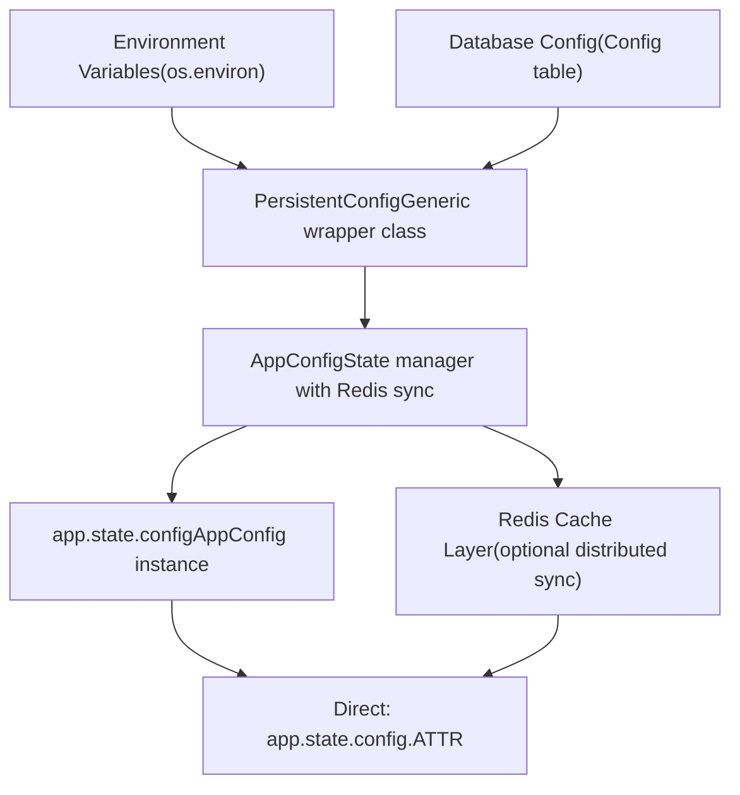
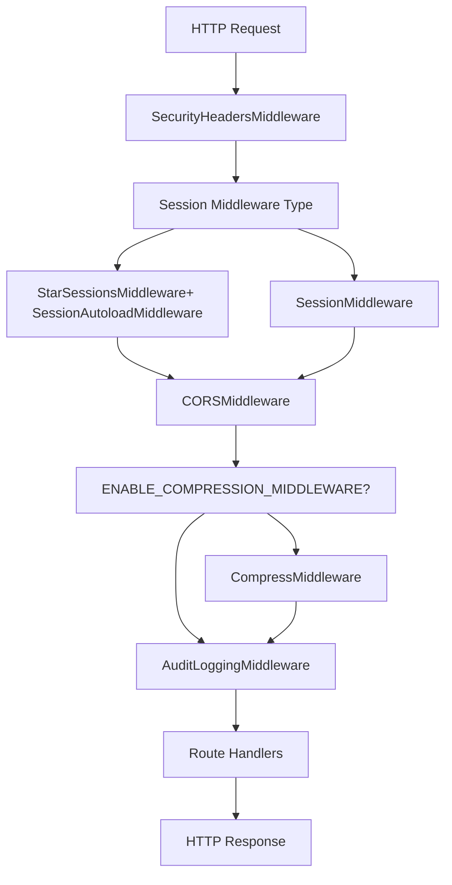
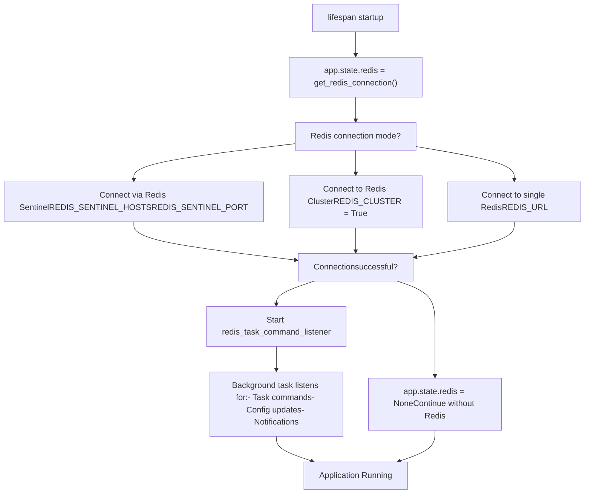
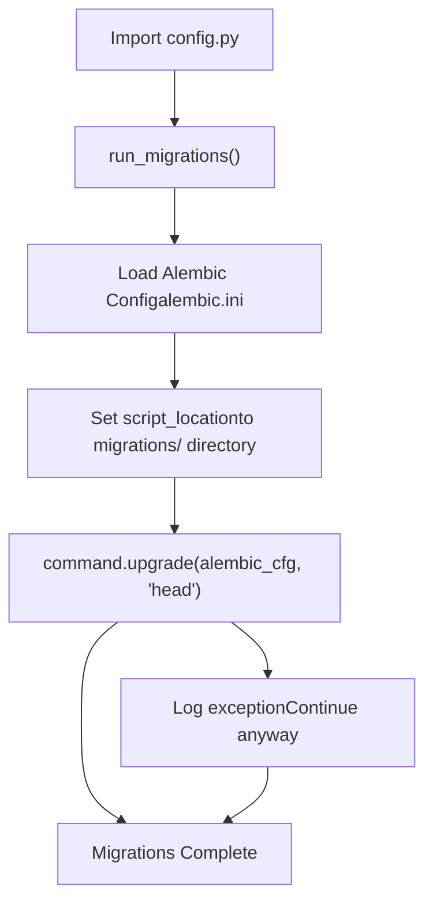

# FastAPI Application Core

Relevant source files

-   [backend/open\_webui/config.py](https://github.com/open-webui/open-webui/blob/a7271532/backend/open_webui/config.py)
-   [backend/open\_webui/main.py](https://github.com/open-webui/open-webui/blob/a7271532/backend/open_webui/main.py)
-   [backend/open\_webui/retrieval/loaders/datalab\_marker.py](https://github.com/open-webui/open-webui/blob/a7271532/backend/open_webui/retrieval/loaders/datalab_marker.py)
-   [backend/open\_webui/retrieval/loaders/external\_document.py](https://github.com/open-webui/open-webui/blob/a7271532/backend/open_webui/retrieval/loaders/external_document.py)
-   [backend/open\_webui/retrieval/loaders/external\_web.py](https://github.com/open-webui/open-webui/blob/a7271532/backend/open_webui/retrieval/loaders/external_web.py)
-   [backend/open\_webui/retrieval/loaders/main.py](https://github.com/open-webui/open-webui/blob/a7271532/backend/open_webui/retrieval/loaders/main.py)
-   [backend/open\_webui/retrieval/loaders/mineru.py](https://github.com/open-webui/open-webui/blob/a7271532/backend/open_webui/retrieval/loaders/mineru.py)
-   [backend/open\_webui/retrieval/loaders/mistral.py](https://github.com/open-webui/open-webui/blob/a7271532/backend/open_webui/retrieval/loaders/mistral.py)
-   [backend/open\_webui/retrieval/utils.py](https://github.com/open-webui/open-webui/blob/a7271532/backend/open_webui/retrieval/utils.py)
-   [backend/open\_webui/routers/retrieval.py](https://github.com/open-webui/open-webui/blob/a7271532/backend/open_webui/routers/retrieval.py)
-   [backend/open\_webui/utils/middleware.py](https://github.com/open-webui/open-webui/blob/a7271532/backend/open_webui/utils/middleware.py)
-   [src/lib/apis/retrieval/index.ts](https://github.com/open-webui/open-webui/blob/a7271532/src/lib/apis/retrieval/index.ts)
-   [src/lib/components/admin/Settings/Documents.svelte](https://github.com/open-webui/open-webui/blob/a7271532/src/lib/components/admin/Settings/Documents.svelte)
-   [src/lib/components/admin/Settings/WebSearch.svelte](https://github.com/open-webui/open-webui/blob/a7271532/src/lib/components/admin/Settings/WebSearch.svelte)

## Purpose and Scope

This document covers the core FastAPI application initialization, configuration, middleware stack, and router registration for Open WebUI's backend. The main application entry point is [backend/open\_webui/main.py](https://github.com/open-webui/open-webui/blob/a7271532/backend/open_webui/main.py) which orchestrates the entire backend system.

For information about specific backend processing pipelines (RAG, tools, memory), see [Backend Processing Pipeline](/open-webui/open-webui/6-backend-processing-pipeline). For information about authentication mechanisms, see [Authentication Methods](/open-webui/open-webui/10.1-authentication-methods). For configuration management details beyond initialization, see [Configuration Management](/open-webui/open-webui/11-configuration-management).

## Application Initialization and Instance Creation

The FastAPI application is created as a global instance with specific configuration for development and production environments:

```
app = FastAPI(
    title="Open WebUI",
    docs_url="/docs" if ENV == "dev" else None,
    openapi_url="/openapi.json" if ENV == "dev" else None,
    redoc_url=None,
    lifespan=lifespan,
)
```
Key aspects of the initialization:

-   **Documentation endpoints**: Enabled only in development mode (`ENV == "dev"`)
-   **Lifespan context manager**: Handles startup and shutdown tasks via the `lifespan` function
-   **Title**: Set to "Open WebUI" for API documentation

Sources: [backend/open\_webui/main.py633-639](https://github.com/open-webui/open-webui/blob/a7271532/backend/open_webui/main.py#L633-L639)

## Lifespan Management

The application lifespan is managed through an async context manager that coordinates startup and shutdown tasks:

```mermaid
flowchart TD
    Start["Application Start"]
    Lifespan["lifespan(app)"]
    SetInstanceId["Set app.state.instance_id = INSTANCE_ID"]
    StartLogger["start_logger()"]
    ResetConfig["RESET_CONFIG_ON_START?"]
    DoReset["reset_config()"]
    CheckLicense["LICENSE_KEY exists?"]
    LoadLicense["get_license_data(app, LICENSE_KEY)"]
    InstallDeps["install_tool_and_function_dependencies()"]
    SetupRedis["app.state.redis = get_redis_connection()"]
    RedisListener["Redis available?"]
    StartListener["Start redis_task_command_listener task"]
    ThreadPool["THREAD_POOL_SIZE > 0?"]
    LimitTokens["Set anyio thread limiter tokens"]
    StartCleanup["Start periodic_usage_pool_cleanup task"]
    CacheModels["ENABLE_BASE_MODELS_CACHE?"]
    GetAllModels["await get_all_models()"]
    Yield["yield (App Running)"]
    Shutdown["Shutdown Triggered"]
    CancelRedis["redis_task_command_listener exists?"]
    CancelTask["Cancel Redis listener task"]
    End["Application Stopped"]

    Start --> Lifespan
    Lifespan --> SetInstanceId
    SetInstanceId --> StartLogger
    StartLogger --> ResetConfig
    ResetConfig --> DoReset
    ResetConfig --> CheckLicense
    DoReset --> CheckLicense
    CheckLicense --> LoadLicense
    CheckLicense --> InstallDeps
    LoadLicense --> InstallDeps
    InstallDeps --> SetupRedis
    SetupRedis --> RedisListener
    RedisListener --> StartListener
    RedisListener --> ThreadPool
    StartListener --> ThreadPool
    ThreadPool --> LimitTokens
    ThreadPool --> StartCleanup
    LimitTokens --> StartCleanup
    StartCleanup --> CacheModels
    CacheModels --> GetAllModels
    CacheModels --> Yield
    GetAllModels --> Yield
    Yield --> Shutdown
    Shutdown --> CancelRedis
    CancelRedis --> CancelTask
    CancelRedis --> End
    CancelTask --> End
```


### Startup Sequence

The lifespan manager executes the following startup tasks in order:

1.  **Instance identification**: Sets `app.state.instance_id` to uniquely identify this instance
2.  **Logger initialization**: Calls `start_logger()` to configure logging
3.  **Configuration reset** (optional): If `RESET_CONFIG_ON_START` is enabled, clears persistent config
4.  **License validation**: Loads and validates license key if provided
5.  **Plugin dependencies**: Installs required dependencies for tools and functions (blocking call)
6.  **Redis connection**: Establishes connection to Redis for distributed features
7.  **Redis task listener**: Starts background task for processing Redis commands
8.  **Thread pool configuration**: Configures AnyIO thread pool size if `THREAD_POOL_SIZE` is set
9.  **Usage cleanup**: Starts periodic cleanup task for model usage tracking
10.  **Model cache warmup**: Pre-fetches all models if `ENABLE_BASE_MODELS_CACHE` is enabled

### Shutdown Sequence

On shutdown, the lifespan manager:

-   Cancels the Redis task command listener if it was started
-   Allows background tasks to complete gracefully

Sources: [backend/open\_webui/main.py570-631](https://github.com/open-webui/open-webui/blob/a7271532/backend/open_webui/main.py#L570-L631)

## Configuration System Architecture

Open WebUI implements a sophisticated two-tier configuration system that combines environment variables with persistent database storage:


### PersistentConfig Class

`PersistentConfig` is a generic wrapper that manages individual configuration values with automatic persistence:

| Property | Type | Description |
| --- | --- | --- |
| `env_name` | str | Environment variable name |
| `config_path` | str | Dot-separated path in database JSON |
| `env_value` | T | Value from environment variable |
| `config_value` | T | Value from database (if available) |
| `value` | T | Effective value (database overrides env) |

The class automatically registers itself in `PERSISTENT_CONFIG_REGISTRY` for global config updates.

**Load Priority**: Database value takes precedence over environment variable if `ENABLE_PERSISTENT_CONFIG` is true and a database value exists.

Sources: [backend/open\_webui/config.py165-222](https://github.com/open-webui/open-webui/blob/a7271532/backend/open_webui/config.py#L165-L222)

### AppConfig State Manager

`AppConfig` provides Redis-backed distributed configuration with automatic synchronization:

```
class AppConfig:
    _redis: Union[redis.Redis, redis.cluster.RedisCluster]
    _redis_key_prefix: str
    _state: dict[str, PersistentConfig]
```
**Key features**:

-   **Getters**: Check Redis for updated values before returning local state
-   **Setters**: Write to database and propagate to Redis for cluster sync
-   **Key format**: `{_redis_key_prefix}:config:{key}`

**Example usage**:

```
# Initial setup in main.py
app.state.config = AppConfig(
    redis_url=REDIS_URL,
    redis_sentinels=get_sentinels_from_env(...),
    redis_cluster=REDIS_CLUSTER,
    redis_key_prefix=REDIS_KEY_PREFIX,
)

# Later access
chunk_size = app.state.config.CHUNK_SIZE  # Checks Redis, returns cached value
app.state.config.CHUNK_SIZE = 1500  # Writes to DB and Redis
```
Sources: [backend/open\_webui/config.py224-283](https://github.com/open-webui/open-webui/blob/a7271532/backend/open_webui/config.py#L224-L283) [backend/open\_webui/main.py650-655](https://github.com/open-webui/open-webui/blob/a7271532/backend/open_webui/main.py#L650-L655)

## Application State Initialization

The `app.state` object serves as the central repository for runtime state, configuration, and shared resources. State initialization occurs immediately after the FastAPI instance is created:


### State Categories

**Core State** [backend/open\_webui/main.py649-660](https://github.com/open-webui/open-webui/blob/a7271532/backend/open_webui/main.py#L649-L660):

-   `instance_id`: Unique identifier for this application instance (`INSTANCE_ID`)
-   `config`: AppConfig instance managing all persistent configuration
-   `redis`: Redis connection for distributed features (set during lifespan startup)
-   `WEBUI_NAME`: Display name for the application
-   `LICENSE_METADATA`: License validation data (if applicable)
-   `USER_COUNT`: Cached user count (initialized to `None`)

**OAuth Managers** [backend/open\_webui/main.py641-647](https://github.com/open-webui/open-webui/blob/a7271532/backend/open_webui/main.py#L641-L647):

-   `oauth_manager`: Handles Open WebUI's own OAuth/OIDC authentication
-   `oauth_client_manager`: Manages OAuth clients for third-party integrations (Google Drive, OneDrive)

**Model Caches** [backend/open\_webui/main.py685-733](https://github.com/open-webui/open-webui/blob/a7271532/backend/open_webui/main.py#L685-L733):

-   `OLLAMA_MODELS`: Dictionary of Ollama models (populated dynamically)
-   `OPENAI_MODELS`: Dictionary of OpenAI-compatible models
-   `BASE_MODELS`: Cached list of all available base models

**RAG Components** [backend/open\_webui/main.py985-1050](https://github.com/open-webui/open-webui/blob/a7271532/backend/open_webui/main.py#L985-L1050):

-   `EMBEDDING_FUNCTION`: Wrapper function for generating embeddings
-   `RERANKING_FUNCTION`: Wrapper function for reranking results
-   `ef`: Raw SentenceTransformer model (for local embeddings)
-   `rf`: Raw CrossEncoder model (for local reranking)

**Tool & Function State** [backend/open\_webui/main.py706-827](https://github.com/open-webui/open-webui/blob/a7271532/backend/open_webui/main.py#L706-L827):

-   `TOOLS`: Dictionary of available tools
-   `TOOL_CONTENTS`: Tool source code contents
-   `FUNCTIONS`: Dictionary of available functions
-   `FUNCTION_CONTENTS`: Function source code contents
-   `TOOL_SERVERS`: List of connected MCP tool servers

**SCIM State** [backend/open\_webui/main.py723-724](https://github.com/open-webui/open-webui/blob/a7271532/backend/open_webui/main.py#L723-L724):

-   `ENABLE_SCIM`: Whether SCIM provisioning is enabled
-   `SCIM_TOKEN`: Bearer token for SCIM API authentication

Sources: [backend/open\_webui/main.py641-827](https://github.com/open-webui/open-webui/blob/a7271532/backend/open_webui/main.py#L641-L827) [backend/open\_webui/main.py985-1050](https://github.com/open-webui/open-webui/blob/a7271532/backend/open_webui/main.py#L985-L1050)

## Middleware Stack

The middleware stack is registered in reverse order of execution (last registered executes first). Open WebUI's middleware layers handle security, sessions, CORS, compression, and audit logging:


### Middleware Registration Order

The middleware stack is built in the following order (reverse execution order):

1.  **SecurityHeadersMiddleware** [backend/open\_webui/main.py1298-1299](https://github.com/open-webui/open-webui/blob/a7271532/backend/open_webui/main.py#L1298-L1299)

    -   Adds security headers to all responses
    -   Configures CSP, X-Frame-Options, etc.
2.  **Session Middleware** [backend/open\_webui/main.py1301-1334](https://github.com/open-webui/open-webui/blob/a7271532/backend/open_webui/main.py#L1301-L1334)

    -   **StarSessionsMiddleware** (if `ENABLE_STAR_SESSIONS_MIDDLEWARE`):
        -   Uses Redis-backed session storage via `RedisStore`
        -   Requires `SessionAutoloadMiddleware` for proper session loading
        -   Configured with `WEBUI_SECRET_KEY`, cookie settings, and session lifetime
    -   **SessionMiddleware** (standard Starlette):
        -   In-memory session storage
        -   Uses same secret key and cookie configuration
3.  **CORSMiddleware** [backend/open\_webui/main.py1336-1343](https://github.com/open-webui/open-webui/blob/a7271532/backend/open_webui/main.py#L1336-L1343)

    -   Configured with `CORS_ALLOW_ORIGIN` (defaults to "\*")
    -   Allows credentials and all methods/headers
4.  **CompressMiddleware** (optional) [backend/open\_webui/main.py1345-1346](https://github.com/open-webui/open-webui/blob/a7271532/backend/open_webui/main.py#L1345-L1346)

    -   Gzip compression for responses
    -   Only added if `ENABLE_COMPRESSION_MIDDLEWARE` is true
5.  **AuditLoggingMiddleware** [backend/open\_webui/main.py1348-1354](https://github.com/open-webui/open-webui/blob/a7271532/backend/open_webui/main.py#L1348-L1354)

    -   Logs requests based on `AUDIT_LOG_LEVEL` (METADATA, REQUEST, REQUEST\_RESPONSE)
    -   Excludes paths matching `AUDIT_EXCLUDED_PATHS`
    -   Limits body logging to `MAX_BODY_LOG_SIZE`

### Session Configuration

Session middleware configuration includes:

| Parameter | Source | Description |
| --- | --- | --- |
| `secret_key` | `WEBUI_SECRET_KEY` | Encryption key for sessions |
| `session_cookie` | `"open-webui-session"` | Cookie name |
| `same_site` | `WEBUI_SESSION_COOKIE_SAME_SITE` | SameSite attribute |
| `https_only` | `WEBUI_SESSION_COOKIE_SECURE` | Secure flag (HTTPS only) |
| `max_age` | From `JWT_EXPIRES_IN` | Session lifetime in seconds |

Sources: [backend/open\_webui/main.py1298-1354](https://github.com/open-webui/open-webui/blob/a7271532/backend/open_webui/main.py#L1298-L1354)

## Router Registration and Organization

Open WebUI organizes its API endpoints into modular routers, each handling a specific domain of functionality. Routers are registered with the FastAPI application using `app.include_router()`:


### Router Registration Code

Routers are imported at the top of [backend/open\_webui/main.py70-96](https://github.com/open-webui/open-webui/blob/a7271532/backend/open_webui/main.py#L70-L96) and registered conditionally based on configuration:

```
# SCIM router (conditional)
if app.state.ENABLE_SCIM:
    app.include_router(scim.router, prefix="/api/v1/scim", tags=["scim"])

# Core routers (always included)
app.include_router(users.router, prefix="/api/v1/users", tags=["users"])
app.include_router(auths.router, prefix="/api/v1/auths", tags=["auths"])
app.include_router(chats.router, prefix="/api/v1/chats", tags=["chats"])
# ... (pattern continues for all routers)
```
### Router Categorization

**Core APIs**:

-   `utils`: System utilities (health check, version info, task management)
-   `configs`: Application configuration endpoints (admin only)

**Authentication & Users**:

-   `auths`: Authentication flows (OAuth, JWT, LDAP, API keys)
-   `users`: User CRUD operations, profile management
-   `scim`: SCIM 2.0 provisioning (conditional, enterprise feature)

**Chat & Messaging**:

-   `chats`: Conversation management, message history
-   `channels`: Group messaging and collaboration
-   `notes`: Personal note-taking
-   `memories`: Long-term user context storage for personalization

**Organization**:

-   `folders`: Hierarchical chat organization
-   `groups`: User group management for permissions

**Knowledge & RAG**:

-   `files`: File upload, storage, and metadata
-   `retrieval`: RAG operations (embedding, search, reranking)
-   `knowledge`: Knowledge base management

**LLM Integration**:

-   `ollama`: Proxy for Ollama API (model inference)
-   `openai`: Proxy for OpenAI-compatible APIs
-   `models`: Model metadata and access control
-   `pipelines`: Custom pipeline plugin framework

**AI Features**:

-   `functions`: User-defined Python functions (sandbox execution)
-   `tools`: Tool definitions for function calling
-   `tasks`: Background task execution (title generation, etc.)
-   `evaluations`: Model comparison and evaluation arena

**Content Generation**:

-   `audio`: Text-to-Speech and Speech-to-Text
-   `images`: Image generation and editing (DALL-E, Stable Diffusion)

**Templates**:

-   `prompts`: System prompt templates and management

Sources: [backend/open\_webui/main.py70-96](https://github.com/open-webui/open-webui/blob/a7271532/backend/open_webui/main.py#L70-L96) [backend/open\_webui/main.py1361-1426](https://github.com/open-webui/open-webui/blob/a7271532/backend/open_webui/main.py#L1361-L1426)

## Redis Integration

Redis provides distributed features including session storage, configuration synchronization, and task coordination. The Redis connection is established during application startup:


### Redis Connection Setup

The Redis connection is configured with the following parameters [backend/open\_webui/main.py586-593](https://github.com/open-webui/open-webui/blob/a7271532/backend/open_webui/main.py#L586-L593):

| Parameter | Environment Variable | Description |
| --- | --- | --- |
| `redis_url` | `REDIS_URL` | Connection string for standalone/cluster |
| `redis_sentinels` | `REDIS_SENTINEL_HOSTS`, `REDIS_SENTINEL_PORT` | Sentinel configuration for HA |
| `redis_cluster` | `REDIS_CLUSTER` | Whether to use Redis Cluster mode |
| `async_mode` | \- | Set to `True` for async Redis client |

**Sentinel Configuration**: If `REDIS_SENTINEL_HOSTS` is provided, the system uses `get_sentinels_from_env()` to parse sentinel host/port pairs and establish a highly-available connection.

### Redis Task Command Listener

When Redis is available, a background task is started to listen for commands:

```
if app.state.redis is not None:
    app.state.redis_task_command_listener = asyncio.create_task(
        redis_task_command_listener(app)
    )
```
This listener handles:

-   **Task management commands**: Start, stop, and monitor background tasks
-   **Configuration updates**: Propagate config changes across instances
-   **Real-time notifications**: WebSocket message distribution

The listener task is cancelled during shutdown [backend/open\_webui/main.py629-630](https://github.com/open-webui/open-webui/blob/a7271532/backend/open_webui/main.py#L629-L630)

### Redis Use Cases in Application

**Session Storage** [backend/open\_webui/main.py1319-1325](https://github.com/open-webui/open-webui/blob/a7271532/backend/open_webui/main.py#L1319-L1325):

```
store = RedisStore(
    app.state.redis,
    prefix=REDIS_KEY_PREFIX,
    ttl=max_age,
)
```
**Configuration Synchronization** [backend/open\_webui/config.py258-260](https://github.com/open-webui/open-webui/blob/a7271532/backend/open_webui/config.py#L258-L260):

-   When `AppConfig` properties are updated, values are written to Redis
-   All instances check Redis before returning config values
-   Key format: `{REDIS_KEY_PREFIX}:config:{key}`

**Task Coordination** [backend/open\_webui/tasks.py](https://github.com/open-webui/open-webui/blob/a7271532/backend/open_webui/tasks.py):

-   Task creation, status updates, and cancellation commands
-   Distributed task queue for background operations

**Graceful Degradation**: If Redis is unavailable (`app.state.redis = None`), the application continues with reduced functionality:

-   Sessions fall back to in-memory storage
-   Config updates are local-only
-   Tasks run in single-instance mode

Sources: [backend/open\_webui/main.py586-598](https://github.com/open-webui/open-webui/blob/a7271532/backend/open_webui/main.py#L586-L598) [backend/open\_webui/main.py629-630](https://github.com/open-webui/open-webui/blob/a7271532/backend/open_webui/main.py#L629-L630) [backend/open\_webui/config.py224-283](https://github.com/open-webui/open-webui/blob/a7271532/backend/open_webui/config.py#L224-L283)

## Special HTTP Endpoints

Beyond the registered routers, the main application defines several special-purpose HTTP endpoints:

### Health Check Endpoint

```
@app.get("/health")
async def get_health():
    return {"status": True}
```
Simple health check that returns a 200 OK with `{"status": true}`. Used by load balancers and monitoring systems.

### Manifest and PWA Endpoints

**Dynamic Manifest** [backend/open\_webui/main.py1618-1671](https://github.com/open-webui/open-webui/blob/a7271532/backend/open_webui/main.py#L1618-L1671):

```
@app.get("/manifest.json")
async def get_manifest_json() -> Response:
    # ... generates PWA manifest with app name, icons, theme colors
```
Generates a Progressive Web App manifest dynamically, using `WEBUI_NAME` for the application name and configured theme colors. If `EXTERNAL_PWA_MANIFEST_URL` is set, the endpoint proxies to that URL instead.

**Service Worker** [backend/open\_webui/main.py1674-1684](https://github.com/open-webui/open-webui/blob/a7271532/backend/open_webui/main.py#L1674-L1684):

```
@app.get("/sw.js")
async def get_service_worker():
    # Returns the PWA service worker script
```
Serves the service worker JavaScript for offline functionality.

### Static File Serving

**Frontend SPA** [backend/open\_webui/main.py1698-1705](https://github.com/open-webui/open-webui/blob/a7271532/backend/open_webui/main.py#L1698-L1705):

```
app.mount(
    "/",
    SPAStaticFiles(directory=FRONTEND_BUILD_DIR, html=True),
    name="spa-static-files",
)
```
Uses custom `SPAStaticFiles` class [backend/open\_webui/main.py538-550](https://github.com/open-webui/open-webui/blob/a7271532/backend/open_webui/main.py#L538-L550) which:

-   Serves files from `FRONTEND_BUILD_DIR`
-   Returns `index.html` for 404s (SPA routing)
-   Returns 404 for missing `.js` files (prevents false positives)

**Static Assets** [backend/open\_webui/main.py1687-1695](https://github.com/open-webui/open-webui/blob/a7271532/backend/open_webui/main.py#L1687-L1695):

```
app.mount("/static", StaticFiles(directory=STATIC_DIR), name="static")
app.mount("/cache", StaticFiles(directory=CACHE_DIR), name="cache")
```
Mounts directories for static assets and cache files.

Sources: [backend/open\_webui/main.py538-550](https://github.com/open-webui/open-webui/blob/a7271532/backend/open_webui/main.py#L538-L550) [backend/open\_webui/main.py1618-1705](https://github.com/open-webui/open-webui/blob/a7271532/backend/open_webui/main.py#L1618-L1705)

## Database Migration System

Database migrations are automatically executed during application initialization using Alembic:


The migration system is triggered automatically when `config.py` is imported [backend/open\_webui/config.py53-70](https://github.com/open-webui/open-webui/blob/a7271532/backend/open_webui/config.py#L53-L70):

```
def run_migrations():
    log.info("Running migrations")
    try:
        from alembic import command
        from alembic.config import Config

        alembic_cfg = Config(OPEN_WEBUI_DIR / "alembic.ini")
        migrations_path = OPEN_WEBUI_DIR / "migrations"
        alembic_cfg.set_main_option("script_location", str(migrations_path))
        command.upgrade(alembic_cfg, "head")
    except Exception as e:
        log.exception(f"Error running migrations: {e}")

run_migrations()  # Executed at import time
```
**Key characteristics**:

-   Runs synchronously during import (blocking)
-   Upgrades to latest revision ("head")
-   Errors are logged but don't prevent startup
-   Migration scripts located in `backend/open_webui/migrations/`

Sources: [backend/open\_webui/config.py53-70](https://github.com/open-webui/open-webui/blob/a7271532/backend/open_webui/config.py#L53-L70)
