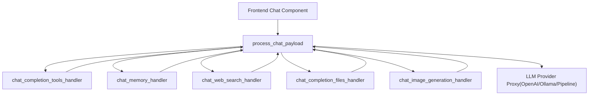
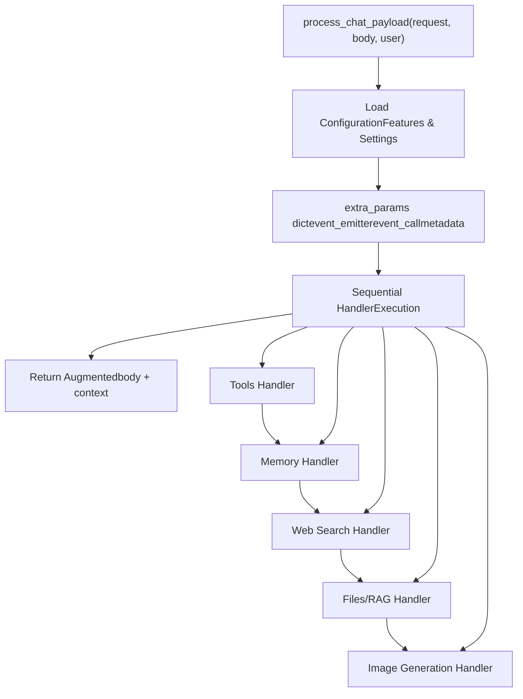
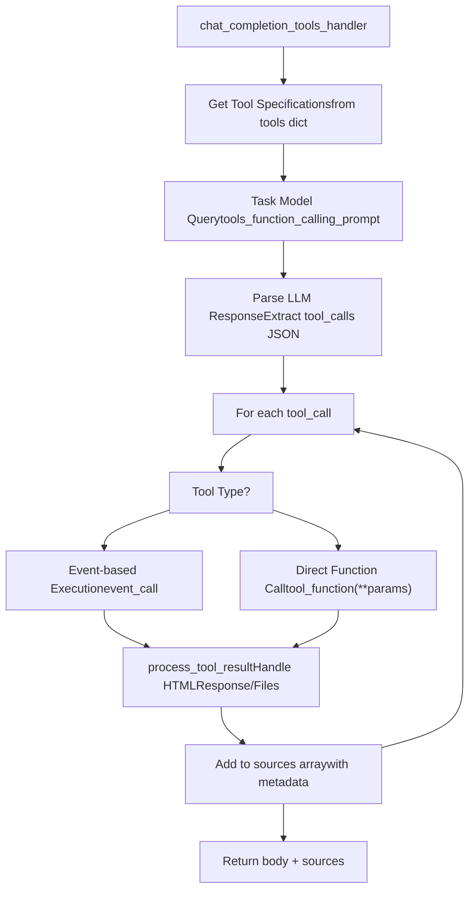
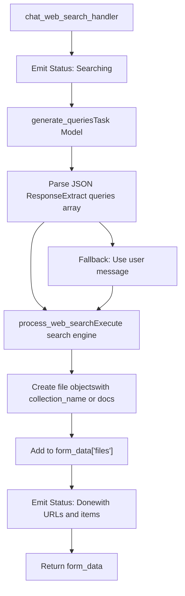
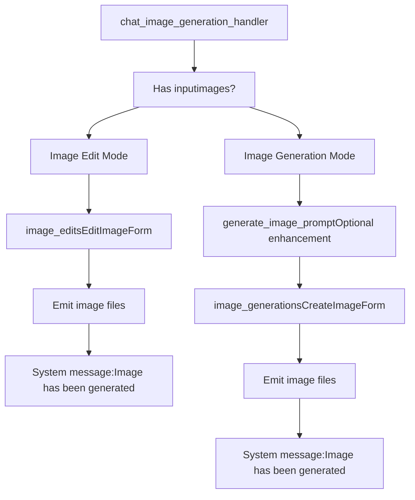
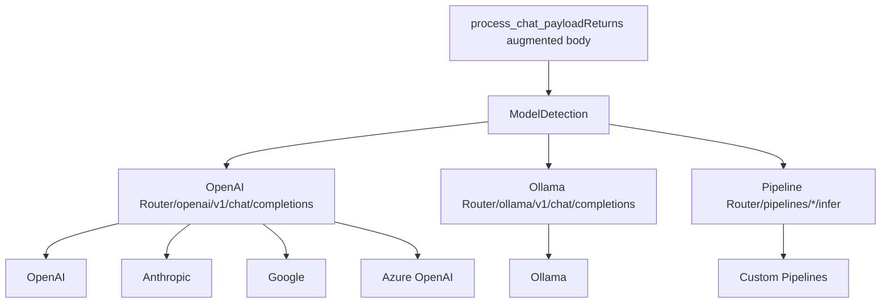

# Chat Request Processing

Relevant source files

-   [backend/open\_webui/config.py](https://github.com/open-webui/open-webui/blob/a7271532/backend/open_webui/config.py)
-   [backend/open\_webui/main.py](https://github.com/open-webui/open-webui/blob/a7271532/backend/open_webui/main.py)
-   [backend/open\_webui/retrieval/loaders/datalab\_marker.py](https://github.com/open-webui/open-webui/blob/a7271532/backend/open_webui/retrieval/loaders/datalab_marker.py)
-   [backend/open\_webui/retrieval/loaders/external\_document.py](https://github.com/open-webui/open-webui/blob/a7271532/backend/open_webui/retrieval/loaders/external_document.py)
-   [backend/open\_webui/retrieval/loaders/external\_web.py](https://github.com/open-webui/open-webui/blob/a7271532/backend/open_webui/retrieval/loaders/external_web.py)
-   [backend/open\_webui/retrieval/loaders/main.py](https://github.com/open-webui/open-webui/blob/a7271532/backend/open_webui/retrieval/loaders/main.py)
-   [backend/open\_webui/retrieval/loaders/mineru.py](https://github.com/open-webui/open-webui/blob/a7271532/backend/open_webui/retrieval/loaders/mineru.py)
-   [backend/open\_webui/retrieval/loaders/mistral.py](https://github.com/open-webui/open-webui/blob/a7271532/backend/open_webui/retrieval/loaders/mistral.py)
-   [backend/open\_webui/retrieval/utils.py](https://github.com/open-webui/open-webui/blob/a7271532/backend/open_webui/retrieval/utils.py)
-   [backend/open\_webui/routers/retrieval.py](https://github.com/open-webui/open-webui/blob/a7271532/backend/open_webui/routers/retrieval.py)
-   [backend/open\_webui/utils/middleware.py](https://github.com/open-webui/open-webui/blob/a7271532/backend/open_webui/utils/middleware.py)
-   [src/lib/apis/retrieval/index.ts](https://github.com/open-webui/open-webui/blob/a7271532/src/lib/apis/retrieval/index.ts)
-   [src/lib/components/admin/Settings/Documents.svelte](https://github.com/open-webui/open-webui/blob/a7271532/src/lib/components/admin/Settings/Documents.svelte)
-   [src/lib/components/admin/Settings/WebSearch.svelte](https://github.com/open-webui/open-webui/blob/a7271532/src/lib/components/admin/Settings/WebSearch.svelte)

## Purpose and Scope

This page documents the `process_chat_payload` middleware system that intercepts and augments chat completion requests before they are sent to LLM providers. The middleware acts as the central orchestration layer that enriches user prompts with context from multiple sources including RAG-retrieved documents, tool execution results, web search findings, and user memory.

For detailed information about specific augmentation subsystems, see:

-   RAG context injection: [RAG Integration](/open-webui/open-webui/5.2-content-rendering-pipeline)
-   Tool execution mechanics: [Tool Execution System](/open-webui/open-webui/5.3-markdown-processing)
-   Web search processing: [Web Search Integration](/open-webui/open-webui/5.4-code-block-execution)
-   Memory retrieval: [Memory and Context Management](/open-webui/open-webui/5.5-multi-model-response-display)

## Overview

The chat request processing pipeline transforms a basic chat completion request into an augmented request enriched with contextual information. This middleware layer sits between the frontend chat interface and the LLM provider proxies, enabling retrieval-augmented generation, function calling, web search, and memory integration without requiring changes to the underlying LLM APIs.

**Request Flow Diagram**


Sources: [backend/open\_webui/utils/middleware.py1-1200](https://github.com/open-webui/open-webui/blob/a7271532/backend/open_webui/utils/middleware.py#L1-L1200)

## Architecture Components

### Core Middleware Function

The `process_chat_payload` function in [backend/open\_webui/utils/middleware.py](https://github.com/open-webui/open-webui/blob/a7271532/backend/open_webui/utils/middleware.py) serves as the main entry point for request augmentation. It receives the raw chat completion request body and coordinates the execution of various handler functions.

**Middleware Structure**


Sources: [backend/open\_webui/utils/middleware.py900-1200](https://github.com/open-webui/open-webui/blob/a7271532/backend/open_webui/utils/middleware.py#L900-L1200)

### Extra Parameters Object

The middleware creates an `extra_params` dictionary that is passed to all handler functions, providing them with shared context and communication channels:

| Parameter | Type | Purpose |
| --- | --- | --- |
| `__event_emitter__` | Function | WebSocket callback for streaming status updates to frontend |
| `__event_call__` | Function | Event caller for executing direct tools via WebSocket |
| `__metadata__` | Dict | Contains `chat_id`, `message_id`, `session_id` for context tracking |
| `__user__` | UserModel | Current user object for access control |

These parameters enable real-time status updates and coordination between asynchronous handler operations.

Sources: [backend/open\_webui/utils/middleware.py900-950](https://github.com/open-webui/open-webui/blob/a7271532/backend/open_webui/utils/middleware.py#L900-L950)

## Handler Execution Flow

### 1\. Tools Handler

**Function**: `chat_completion_tools_handler`
**Location**: [backend/open\_webui/utils/middleware.py287-514](https://github.com/open-webui/open-webui/blob/a7271532/backend/open_webui/utils/middleware.py#L287-L514)

The tools handler implements a two-phase execution model:

1.  **Tool Selection Phase**: Uses a task model to analyze the user's query and available tool specifications to generate structured tool calls
2.  **Tool Execution Phase**: Executes the selected tools and collects their results

**Tool Execution Flow**


**Key Functions**:

-   `get_tools_function_calling_payload`: Constructs the prompt for the task model [middleware.py304-331](https://github.com/open-webui/open-webui/blob/a7271532/middleware.py#L304-L331)
-   `get_content_from_response`: Extracts content from streaming or non-streaming responses [middleware.py290-302](https://github.com/open-webui/open-webui/blob/a7271532/middleware.py#L290-L302)
-   `process_tool_result`: Handles various tool result formats including HTMLResponse and embedded content [middleware.py144-284](https://github.com/open-webui/open-webui/blob/a7271532/middleware.py#L144-L284)

The handler returns:

-   Modified `body` (with `files` potentially removed if a file handler tool was used)
-   A `sources` array containing tool results formatted as RAG-style sources

Sources: [backend/open\_webui/utils/middleware.py287-514](https://github.com/open-webui/open-webui/blob/a7271532/backend/open_webui/utils/middleware.py#L287-L514)

### 2\. Memory Handler

**Function**: `chat_memory_handler`
**Location**: [backend/open\_webui/utils/middleware.py517-553](https://github.com/open-webui/open-webui/blob/a7271532/backend/open_webui/utils/middleware.py#L517-L553)

Retrieves relevant past context from the user's memory system and injects it into the system message.

**Implementation**:

```
async def chat_memory_handler(
    request: Request, form_data: dict, extra_params: dict, user
):
    # Query memory with user's last message
    results = await query_memory(
        request,
        QueryMemoryForm(
            content=get_last_user_message(form_data["messages"]) or "",
            k=3,
        ),
        user,
    )

    # Format memory documents with timestamps
    user_context = ""
    for doc_idx, doc in enumerate(results.documents[0]):
        created_at_date = format_timestamp(results.metadatas[0][doc_idx]["created_at"])
        user_context += f"{doc_idx + 1}. [{created_at_date}] {doc}\n"

    # Inject into system message
    form_data["messages"] = add_or_update_system_message(
        f"User Context:\n{user_context}\n", form_data["messages"], append=True
    )
```
The memory is appended to the system message rather than prepended, ensuring it appears after any existing system instructions.

Sources: [backend/open\_webui/utils/middleware.py517-553](https://github.com/open-webui/open-webui/blob/a7271532/backend/open_webui/utils/middleware.py#L517-L553) [backend/open\_webui/routers/memories.py](https://github.com/open-webui/open-webui/blob/a7271532/backend/open_webui/routers/memories.py)

### 3\. Web Search Handler

**Function**: `chat_web_search_handler`
**Location**: [backend/open\_webui/utils/middleware.py556-716](https://github.com/open-webui/open-webui/blob/a7271532/backend/open_webui/utils/middleware.py#L556-L716)

Generates search queries from the user's message, executes web searches, and adds results as file context.

**Web Search Pipeline**


**Query Generation**: Uses the task model to generate 1-3 optimized search queries based on conversation context [middleware.py575-607](https://github.com/open-webui/open-webui/blob/a7271532/middleware.py#L575-L607)

**Result Formats**: The handler creates file objects in two possible formats:

1.  **Collection-based**: When embedding is enabled, results are stored in a vector collection
2.  **Direct docs**: When `BYPASS_WEB_SEARCH_EMBEDDING_AND_RETRIEVAL` is true, raw documents are passed directly

Sources: [backend/open\_webui/utils/middleware.py556-716](https://github.com/open-webui/open-webui/blob/a7271532/backend/open_webui/utils/middleware.py#L556-L716) [backend/open\_webui/routers/tasks.py](https://github.com/open-webui/open-webui/blob/a7271532/backend/open_webui/routers/tasks.py#LNaN-LNaN)

### 4\. Files/RAG Handler

**Function**: `chat_completion_files_handler`
**Location**: [backend/open\_webui/utils/middleware.py1000](https://github.com/open-webui/open-webui/blob/a7271532/backend/open_webui/utils/middleware.py#L1000-L1000)

Processes files attached to messages, performs RAG retrieval, and injects context into the system message. This handler is documented in detail in [RAG Integration](/open-webui/open-webui/5.2-content-rendering-pipeline).

**Key Operations**:

-   Collection resolution (file collections, knowledge bases, chats, notes)
-   Query generation for retrieval
-   Hybrid search with reranking
-   Context injection via RAG template
-   Source citation formatting

Sources: [backend/open\_webui/utils/middleware.py1000-1300](https://github.com/open-webui/open-webui/blob/a7271532/backend/open_webui/utils/middleware.py#L1000-L1300)

### 5\. Image Generation Handler

**Function**: `chat_image_generation_handler`
**Location**: [backend/open\_webui/utils/middleware.py755-950](https://github.com/open-webui/open-webui/blob/a7271532/backend/open_webui/utils/middleware.py#L755-L950)

Detects image generation requests and generates images either from scratch or by editing existing images.

**Logic Flow**:


The handler emits generated images via the `__event_emitter__` and injects a context message informing the LLM that images have been created.

Sources: [backend/open\_webui/utils/middleware.py755-950](https://github.com/open-webui/open-webui/blob/a7271532/backend/open_webui/utils/middleware.py#L755-L950) [backend/open\_webui/routers/images.py](https://github.com/open-webui/open-webui/blob/a7271532/backend/open_webui/routers/images.py)

## Request Augmentation Details

### System Message Injection

Multiple handlers inject content into the system message using utility functions from [backend/open\_webui/utils/misc.py](https://github.com/open-webui/open-webui/blob/a7271532/backend/open_webui/utils/misc.py):

| Function | Purpose |
| --- | --- |
| `add_or_update_system_message` | Adds or updates system message, optionally appending |
| `add_or_update_user_message` | Modifies user message content |
| `prepend_to_first_user_message_content` | Adds content to start of first user message |
| `get_system_message` | Retrieves current system message |

**Injection Order**:

1.  User memory context (appended to system message)
2.  RAG context (prepended to system message via template)
3.  Image generation context (as new system message)

### Metadata Tracking

The `__metadata__` dictionary tracks context across the request lifecycle:

```
metadata = {
    "chat_id": str,        # Chat identifier (or "local:" for temporary chats)
    "message_id": str,     # Current message ID in chat tree
    "session_id": str,     # WebSocket session ID
}
```
This metadata enables:

-   File URL generation with proper ownership
-   WebSocket event targeting
-   Chat history retrieval for RAG
-   Tool result storage

Sources: [backend/open\_webui/utils/middleware.py900-950](https://github.com/open-webui/open-webui/blob/a7271532/backend/open_webui/utils/middleware.py#L900-L950)

### Source Citation Format

Handlers return augmented information as "sources" that are formatted for citation display in the frontend:

```
source = {
    "source": {
        "name": str,           # Display name (e.g., "tool_name" or "filename")
    },
    "document": [str],         # Array of content chunks
    "metadata": [{             # Array of metadata dicts (one per chunk)
        "source": str,         # Source identifier
        "parameters": dict,    # Tool parameters or file metadata
    }],
    "tool_result": bool,       # True if from tool execution
}
```
Sources are displayed in the chat UI as expandable citations linked to the relevant content.

Sources: [backend/open\_webui/utils/middleware.py461-486](https://github.com/open-webui/open-webui/blob/a7271532/backend/open_webui/utils/middleware.py#L461-L486) [backend/open\_webui/retrieval/utils.py](https://github.com/open-webui/open-webui/blob/a7271532/backend/open_webui/retrieval/utils.py#LNaN-LNaN)

## Integration Points

### LLM Provider Routing

After middleware processing, the augmented request is routed to the appropriate LLM provider proxy based on model ID:

**Routing Logic**


Sources: [backend/open\_webui/main.py1500-1700](https://github.com/open-webui/open-webui/blob/a7271532/backend/open_webui/main.py#L1500-L1700) [backend/open\_webui/routers/openai.py](https://github.com/open-webui/open-webui/blob/a7271532/backend/open_webui/routers/openai.py) [backend/open\_webui/routers/ollama.py](https://github.com/open-webui/open-webui/blob/a7271532/backend/open_webui/routers/ollama.py) [backend/open\_webui/routers/pipelines.py](https://github.com/open-webui/open-webui/blob/a7271532/backend/open_webui/routers/pipelines.py)

### WebSocket Event Emission

The `__event_emitter__` callback sends real-time status updates to the frontend via Socket.IO:

**Event Types**:

| Event Type | Data Structure | Purpose |
| --- | --- | --- |
| `status` | `{action, description, done, error?}` | Progress updates |
| `files` | `{files: [{type, url}]}` | Attached files (images, documents) |
| `embeds` | `{embeds: [html_content]}` | Embedded HTML content |
| `sources` | `{sources: [source_objects]}` | Citation sources |

Example usage:

```
await event_emitter({
    "type": "status",
    "data": {
        "action": "web_search",
        "description": "Searching the web",
        "done": False,
    },
})
```
Sources: [backend/open\_webui/utils/middleware.py559-570](https://github.com/open-webui/open-webui/blob/a7271532/backend/open_webui/utils/middleware.py#L559-L570) [backend/open\_webui/socket/main.py](https://github.com/open-webui/open-webui/blob/a7271532/backend/open_webui/socket/main.py)

### Configuration Access

Handler functions access configuration via `request.app.state.config`, which provides runtime-updatable settings:

**Key Configuration Parameters**:

-   `ENABLE_WEB_SEARCH`: Enable web search handler
-   `WEB_SEARCH_ENGINE`: Selected search provider
-   `RAG_TEMPLATE`: Template for RAG context injection
-   `TOP_K`: Number of chunks to retrieve
-   `ENABLE_IMAGE_GENERATION`: Enable image generation
-   `TASK_MODEL`: Model used for task generation (queries, tool selection)

Sources: [backend/open\_webui/config.py224-284](https://github.com/open-webui/open-webui/blob/a7271532/backend/open_webui/config.py#L224-L284)

## Error Handling and Resilience

### Handler Exception Management

Each handler includes try-catch blocks to prevent individual handler failures from breaking the entire pipeline:

```
try:
    results = await query_memory(request, form, user)
    # Process results...
except Exception as e:
    log.debug(e)
    results = None
    # Continue with empty results
```
This design ensures that if memory retrieval fails, the request still processes with tool results, web search, and RAG context.

Sources: [backend/open\_webui/utils/middleware.py520-533](https://github.com/open-webui/open-webui/blob/a7271532/backend/open_webui/utils/middleware.py#L520-L533)

### Graceful Degradation

When a handler encounters an error:

1.  The error is logged but not propagated
2.  The handler returns the unmodified request
3.  Subsequent handlers continue execution
4.  The request proceeds to the LLM with partial augmentation

This allows the system to remain functional even when individual components fail.

Sources: [backend/open\_webui/utils/middleware.py500-510](https://github.com/open-webui/open-webui/blob/a7271532/backend/open_webui/utils/middleware.py#L500-L510) [backend/open\_webui/utils/middleware.py701-714](https://github.com/open-webui/open-webui/blob/a7271532/backend/open_webui/utils/middleware.py#L701-L714)

## Performance Considerations

### Parallel Handler Execution

Currently, handlers execute sequentially. However, several handlers could be parallelized:

-   Memory retrieval and web search are independent
-   Tool execution and file processing are independent

Future optimization could execute independent handlers concurrently using `asyncio.gather()`.

### Caching

The system implements query caching when `ENABLE_QUERIES_CACHE` is enabled:

```
if ENABLE_QUERIES_CACHE:
    request.state.cached_queries = queries
```
This allows generated queries to be reused across subsequent requests in the same session.

Sources: [backend/open\_webui/utils/middleware.py602-604](https://github.com/open-webui/open-webui/blob/a7271532/backend/open_webui/utils/middleware.py#L602-L604) [backend/open\_webui/env.py](https://github.com/open-webui/open-webui/blob/a7271532/backend/open_webui/env.py#LNaN-LNaN)

### Task Model Selection

The `get_task_model_id` function [backend/open\_webui/utils/task.py](https://github.com/open-webui/open-webui/blob/a7271532/backend/open_webui/utils/task.py) determines which model to use for auxiliary tasks (query generation, tool selection). This allows using a fast, cost-effective model for these operations while using more capable models for the main chat completion.

Sources: [backend/open\_webui/utils/task.py](https://github.com/open-webui/open-webui/blob/a7271532/backend/open_webui/utils/task.py#LNaN-LNaN) [backend/open\_webui/utils/middleware.py337-342](https://github.com/open-webui/open-webui/blob/a7271532/backend/open_webui/utils/middleware.py#L337-L342)
